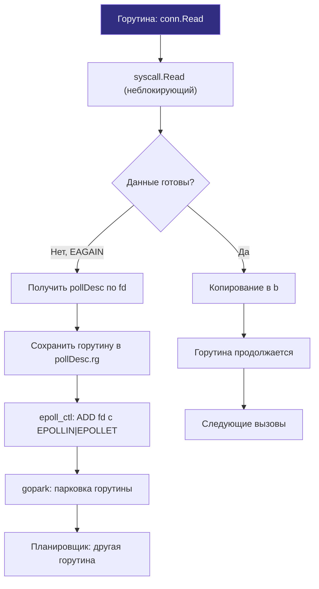
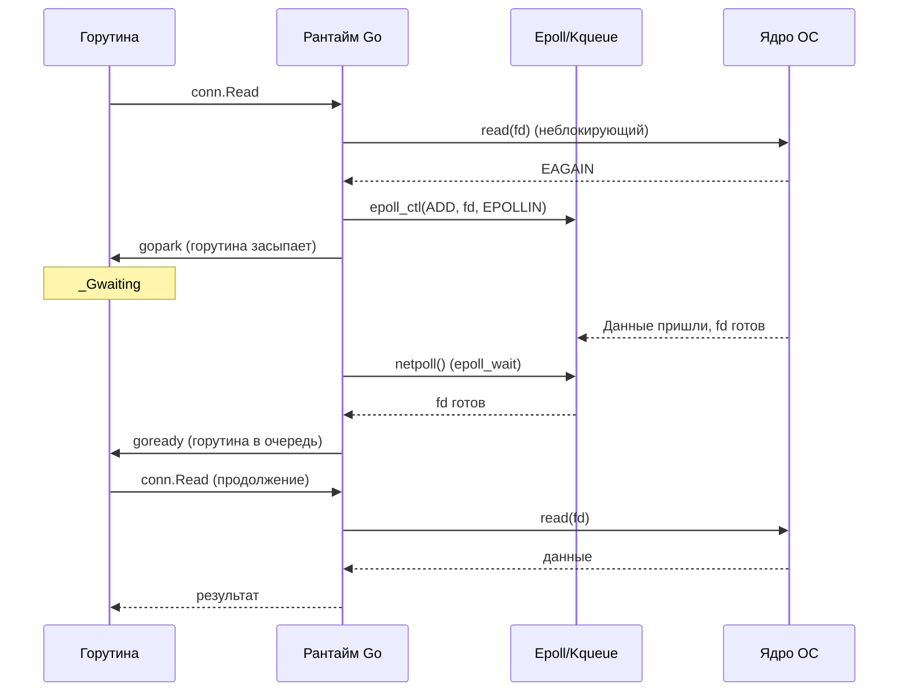

## Epoll, Kqueue и Netpoller: асинхронное сердце Go

В предыдущих статьях мы подробно разобрали природу системных вызовов ядра ([[1. Системные вызовы и их стоимость]]), классифицировали узкие места дискового и сетевого ввода-вывода ([[2. IO bottlenecks]]) и препарировали физическую структуру сетевой задержки ([[3. Network latency]]). Теперь настало время изучить механизм, который является подлинным технологическим фундаментом успеха Go в мире высоконагруженных серверных систем.

Этот механизм — **сетевой поллер** (netpoller). В его основе лежат передовые системные API мультиплексирования ввода-вывода современных операционных систем: **epoll** в Linux и **kqueue** в macOS и BSD-системах.

Без netpoller модель конкурентности Go была бы невозможна в её нынешнем виде. Если бы каждая горутина, ожидающая сетевых байтов от клиента или базы данных, вызывала блокирующий системный вызов ядра, операционной системе для обслуживания 50 000 одновременных WebSocket-соединений потребовалось бы создать 50 000 тяжелых потоков ядра (OS threads). Планировщик Linux CFS захлебнулся бы в переключениях контекста, а память исчерпалась бы стеками потоков (по 2–8 МБ на поток).

Вместо этого сетевой поллер позволяет **горстке системных потоков M** (обычно равной числу физических ядер процессора `GOMAXPROCS`) асинхронно обслуживать сотни тысяч горутин. Для разработчика код выглядит абсолютно синхронным и линейным, но под капотом рантайм Go дирижирует сложнейшим асинхронным реактором событий.

Эта статья — глубокое погружение в устройство асинхронного ввода-вывода: от системных вызовов ядра (`epoll_create`, `epoll_ctl`, `epoll_wait`) и их аналогов в BSD (`kqueue`, `kevent`) до структур данных `pollDesc` в рантайме Go и их взаимодействия с планировщиком горутин ([[1. Scheduler Go. G M P модель]]).

## Зачем нужен epoll/kqueue: проблема select/poll

Чтобы оценить элегантность epoll, обратимся к истории Unix. Исторически первыми механизмами мультиплексирования ввода-вывода были системные вызовы **select** (появился в 4.2BSD) и **poll** (System V).

Оба механизма страдали от фундаментального архитектурного порока: **отсутствия памяти состояний в ядре (stateless model)**. При каждом вызове `select` или `poll` пользовательский процесс обязан:
1. Скопировать из пространства пользователя в ядро полный битовый массив или массив структур со всеми десятками тысяч отслеживаемых файловых дескрипторов.
2. Ядро линейным циклом последовательно обходит весь список дескрипторов от первого до последнего ($O(n)$), опрашивая внутренние драйверы на предмет готовности данных.
3. Процесс усыпляется, а при пробуждении ядро снова перезаписывает массив и копирует его обратно в userspace.
4. Программа вынуждена заново обойти весь массив в userspace ($O(n)$), чтобы найти, какой именно из 10 000 сокетов готов к чтению.

Представьте себе ресторан на 10 000 столиков и одного официанта. При модели `select` официант обязан непрерывно обходить все 10 000 столиков по кругу, подходя к каждому гостю и спрашивая: «Вы готовы сделать заказ?». Даже если заказ готов сделать всего один посетитель за вечер, официант потратит 99.9% сил и времени на бессмысленный обход пустых столиков. Сложность $O(n)$ делала обслуживание более 1024 соединений (лимит `FD_SETSIZE`) архитектурно невозможным (знаменитая проблема C10K).

**Epoll** (внедрен в ядре Linux 2.6) и **kqueue** (появился во FreeBSD 4.1) решили эту проблему радикально, применив **событийно-ориентированную модель с сохранением состояния в ядре (stateful event-driven model)**:

- В нашем ресторане на каждый столик установили электронную кнопку с лампочкой.
- Приложение **один раз** регистрирует интересующие дескрипторы и интересующие события (чтение, запись) через `epoll_ctl` (или вызов `kevent` с макросом `EV_SET` для регистрации фильтра в kqueue).
- Ядро сохраняет эти дескрипторы во внутренней структуре данных (сбалансированное красно-чёрное дерево в epoll).
- Когда на сокет приходят данные, драйвер сетевой карты помещает дескриптор в отдельный список готовых событий (ready list).
- Последующие системные вызовы ожидания (`epoll_wait`, `kevent`) возвращают **только те** дескрипторы, которые реально готовы к обработке. Нет необходимости каждый раз передавать ядру полный список дескрипторов.

Сложность выборки готовых событий упала с $O(n)$ до строгого **$O(1)$** относительно общего числа соединений.

Сравнительная таблица эволюции мультиплексирования:

| Характеристика | select/poll | epoll | kqueue |
|---|---|---|---|
| **Передача списка дескрипторов** | При каждом системном вызове | Один раз при регистрации (`epoll_ctl`) | Один раз при регистрации (`kevent`) |
| **Сложность ожидания** | $O(n)$ от числа всех соединений | $O(1)$ по числу готовых событий | $O(1)$ по числу готовых событий |
| **Лимит дескрипторов на процесс** | Ограничена `FD_SETSIZE` (1024 для select) | До миллионов (ограничено памятью ядра) | До миллионов (ограничено памятью ядра) |
| **Режимы срабатывания (Triggers)** | Только Level-triggered | Level- и Edge-triggered (`EPOLLET`) | Level- и Edge-triggered (`EV_CLEAR`) |
| **Поддерживаемые платформы** | Любые POSIX-системы | Linux | macOS, FreeBSD, OpenBSD, NetBSD |

## Epoll в Linux: ядерная кухня

### Системные вызовы epoll

Интерфейс подсистемы epoll в ядре Linux опирается на три ключевых системных вызова:

1. **`epoll_create1(flags)`**  
   Создает экземпляр подсистемы epoll и возвращает специальный файловый дескриптор `epfd`. В пространстве ядра аллоцируется структура `struct eventpoll`, содержащая:
   - Сбалансированное красно-чёрное дерево (`rbr_nodes`), в котором хранятся все зарегистрированные для отслеживания сокеты.
   - Двусвязный кольцевой список готовых событий (`rdllist` — ready list).
   - Очередь ожидания потоков (`wait_queue_head_t`).
   Флаг `EPOLL_CLOEXEC` гарантирует закрытие дескриптора при вызове `execve`.

2. **`epoll_ctl(epfd, op, fd, event)`**  
   Служит для управления деревом дескрипторов. Параметр `op` принимает команды:
   - `EPOLL_CTL_ADD` — зарегистрировать файловый дескриптор `fd` в экземпляре `epfd`.
   - `EPOLL_CTL_MOD` — изменить битовую маску отслеживаемых событий для `fd`.
   - `EPOLL_CTL_DEL` — удалить сокет из отслеживания (автоматически выполняется ядром при закрытии дескриптора через `close`).  
   В структуре `struct epoll_event` задается битовая маска интересующих событий: `EPOLLIN` (доступны данные для чтения), `EPOLLOUT` (буфер отправки свободен для записи), `EPOLLRDHUP` (удаленный узел закрыл соединение), `EPOLLERR` (ошибка на сокете) и `EPOLLHUP` (обрыв связи). Также можно выставить флаг `EPOLLET` — переход в edge-triggered режим.

3. **`epoll_wait(epfd, events, maxevents, timeout)`**  
   Переводит вызывающий поток в режим ожидания событий. Если список готовых дескрипторов `rdllist` пуст, поток засыпает на время `timeout` (или бессрочно при `timeout = -1`). Как только сетевая карта доставляет данные, ядро переносит готовые дескрипторы в пользовательский массив `events` и возвращает их точное количество.

### Edge-triggered vs Level-triggered

Это ключевое разделение режимов уведомлений:

- **Level-triggered (LT, триггер по уровню — режим по умолчанию):**  
  Системный вызов `epoll_wait` будет возвращать дескриптор как «готовый» на каждом вызове до тех пор, пока в буфере сокета ядра остается хотя бы один непрочитанный байт. Этот режим интуитивен, но порождает лишние системные вызовы и пробуждения, если приложение читает данные небольшими порциями.
- **Edge-triggered (ET, триггер по фронту / изменению состояния, флаг `EPOLLET`):**  
  Ядро генерирует событие готовности **ровно один раз** — в момент физического перехода состояния сокета из «нет данных» в «появились данные». Если приложение прочитало лишь часть данных и снова уснуло в `epoll_wait`, ядро **не разбудит** его повторно для старых данных! Приложение обязано вычитывать сокет в цикле до тех пор, пока системный вызов `read` не вернет код ошибки `EAGAIN` (или `EWOULDBLOCK`).

**Язык Go использует именно edge-triggered epoll (`EPOLLET`)**. Это сознательное архитектурное решение команды рантайма: режим ET минимизирует количество вызовов `epoll_wait` и полностью исключает шум паразитных повторных уведомлений.

> [!info] Под капотом
> Когда входящий Ethernet-фрейм поступает в сетевой адаптер, контроллер по DMA помещает данные в память и инициирует прерывание. Ядро выполняет обработку в контексте softirq и кладет пакет в очередь сокета. После этого ядро вызывает внутреннюю callback-функцию `ep_poll_callback()`. Она атомарно связывает дескриптор с элементом `struct epitem` и переносит его в список готовых событий `rdllist` экземпляра `eventpoll`. Если какой-то поток уже спал в вызове `epoll_wait`, ядро пробуждает его (`wake_up_locked`). Поскольку `rdllist` — это готовый связный список, извлечение готовых событий выполняется за строгое время $O(1)$.

## Kqueue в macOS и BSD

В операционных системах семейства BSD и macOS аналогом epoll является подсистема **kqueue**. Ее интерфейс концептуально универсальнее:

- **`kqueue()`** — создает очередь событий в ядре и возвращает дескриптор очереди `kq`.
- **`kevent(kq, changelist, nchanges, eventlist, nevents, timeout)`** — многофункциональный системный вызов, объединяющий функционал регистрации и ожидания. Если передан массив `changelist`, ядро регистрирует изменения (аналог `epoll_ctl`). Если передан буфер `eventlist`, вызов ожидает готовности событий и заполняет его (аналог `epoll_wait`).

Kqueue аппаратно спроектирован вокруг концепции «фильтров событий» (`EVFILT_READ`, `EVFILT_WRITE`, фильтры файловой системы vnode, процессов, сигналов и таймеров ядра). Внутри ядро использует эффективную хэш-таблицу зарегистрированных дескрипторов, обеспечивая ту же скорость $O(1)$.

В исходном коде рантайма Go различия между операционными системами аккуратно изолированы: пакет `src/runtime/netpoll.go` описывает общий интерфейс, а платформенная специфика скрыта в файлах `netpoll_epoll.go` (Linux), `netpoll_kqueue.go` (macOS/BSD), `netpoll_windows.go` (IOCP) и `netpoll_aix.go`.

## Архитектура netpoller в Go

Netpoller — это специализированная подсистема рантайма Go, бесшовно соединяющая горутины, спящие в ожидании сетевого ввода-вывода, с системными очередями epoll/kqueue ядра ОС.

### Основные структуры данных

- **`pollDesc` (дескриптор опроса):**  
  Центральная структура, ассоциированная с каждым открытым сокетом. Она хранит:
  - Ссылку на файловый дескриптор ядра `fd uintptr`.
  - Указатель на горутину, ожидающую чтения (`rg pdReady / *g`).
  - Указатель на горутину, ожидающую записи (`wg pdReady / *g`).
  - Метки сетевых дедлайнов и таймеров отмены.
- **`pollCache`:**  
  Высокопроизводительный lock-free кэш структур `pollDesc`, организованный в виде связанных страниц (chunks) памяти, что исключает обращение к глобальному аллокатору памяти Go при открытии новых сокетов.
- **`epfd` (или `kq`):**  
  Глобальный файловый дескриптор инстанса epoll/kqueue, создаваемый один раз на весь процесс Go в функции `runtime.netpollinit`.

### Инициализация

При старте рантайма вызывается `runtime.netpollinit()` (или `netpollinit()`). В Linux она делает `epoll_create1(EPOLL_CLOEXEC)`, в macOS — `kqueue()`. Созданный дескриптор сохраняется в глобальной переменной `epfd`. Для пробуждения спящего netpoller создается неблокирующий pipe или счетчик `eventfd`, который также добавляется в epoll.

### Регистрация и ожидание: жизненный цикл горутины

Проследим по шагам, как выполняется операция `conn.Read(b)` в Go:



1. **Неблокирующий вызов (Fast Path):**  
   Любой сокет в Go, созданный через `net.Dial` или `net.Listen`, сразу переводится рантаймом в неблокирующий режим с флагом `O_NONBLOCK` через вызов `syscall.SetNonblock(fd, true)`. Метод `conn.Read(b)` сразу делает системный вызов `read(fd)`. Если данные уже лежат в буфере сокета, вызов возвращает байты немедленно. Никаких переключений горутин не происходит.
2. **Обработка `EAGAIN`:**  
   Если в сокете пусто, системный вызов возвращает ошибку `EAGAIN`. Рантайм через `runtime.pollDesc` получает указатель на `pollDesc`, связанный с этим fd.
3. **Регистрация в epoll:**  
   При первом обращении к сокету вызывается `netpollopen(fd, pd)`:
   ```c
   epoll_ctl(epfd, EPOLL_CTL_ADD, fd, &ev)
   ```
   где `ev.events = EPOLLIN | EPOLLOUT | EPOLLRDHUP | EPOLLET`.
4. **Парковка горутины (`gopark`):**  
   В поле `pollDesc.rg` атомарно записывается указатель на текущую горутину G. Затем вызывается внутренняя функция `gopark(netpollblockcommit, ...)`. Горутина переходит из состояния `_Grunning` в состояние `_Gwaiting` с причиной ожидания `waitReasonIOWait`.
5. **Освобождение потока M:**  
   Поток ОС (M) **не уходит в сон**! Он отпускает заснувшую горутину и немедленно берет следующую готовую задачу из очереди локального процессора P.



### Где вызывается `netpoll()`

Как и кто опрашивает `epoll_wait`, если все потоки M заняты выполнением других горутин? В рантайме Go функция опроса `netpoll()` вызывается в двух стратегических точках планировщика:

1. **Планировщик при поиске работы (`findRunnable()`):**  
   Когда процессор P исчерпал свою локальную очередь `runq`, проверил глобальную очередь и безуспешно попытался украсть работу у соседей ([[3. Work stealing]]), он вызывает `netpoll(false)` (неблокирующий опрос epoll с нулевым таймаутом). Если в сети есть готовые сокеты, `netpoll(false)` возвращает список проснувшихся горутин. Одна из них сразу берется на исполнение, а остальные помещаются в очередь `runq`.
2. **Фоновый поток системного монитора (`sysmon`):**  
   Если все процессоры P заняты непрерывными вычислительными CPU-задачами и не заходят в `findRunnable()`, сетевые события рискуют зависнуть. Для предотвращения этой проблемы поток-надзиратель `sysmon`, работающий без процессора P, периодически (каждые 10–20 мс) проверяет сетевой поллер. Он вызывает `netpoll(true)` с бесконечным таймаутом, чтобы гарантированно пробуждать горутины, ожидающие сеть, находит проснувшиеся горутины, переводит их функцией `goready` в состояние `_Grunnable` и инжектирует их в глобальную очередь планировщика.

### Закрытие и ошибки

Когда сетевое соединение закрывается удаленной стороной или происходит аппаратный сброс (`EPOLLERR`, `EPOLLHUP`, `EPOLLRDHUP`), дескриптор epoll точно так же генерирует событие готовности. Netpoller пробуждает горутину, ожидающую чтения. При повторном `read` вызов возвращает `0` (сигнал `io.EOF`) или системную ошибку `ECONNRESET`.

При закрытии сокета в Go (`conn.Close()`) вызывается функция `netpollclose(pd)`, которая инвалидирует `pollDesc` и очищает связи, предотвращая утечки дескрипторов.

## Диагностика netpoller

Для мониторинга эффективности работы сетевого поллера Go-инженеру доступны следующие инструменты:

### 1. Execution tracer

Трассировщик рантайма Go ([[3. execution tracer]]) — эталонный визуальный инструмент для анализа netpoller:
- На временной диаграмме наглядно отображаются горутины в статусе `Waiting` с пометкой `Network I/O`.
- Видны моменты вызова функции `netpoll` планировщиком и потоком `sysmon`.
- Позволяет мгновенно выявить ситуации, когда сетевой поллер вовремя не опрашивается из-за монополизации CPU тяжелыми циклами.

### 2. Block profile

Профиль блокировок ([[5. block profile]]) фиксирует время, проведенное горутинами в ожидании внешних событий:
- Если в топе отчета доминирует функция `runtime.netpollblock`, это означает, что сервис уперся в задержки внешних сетевых зависимостей.

### 3. `GODEBUG=schedtrace`

Запуск приложения с параметром трассировки:
```bash
GODEBUG=schedtrace=1000,scheddetail=1 ./my_server
```
Выводит в консоль ежесекундный срез состояния:
- Параметр `waiting` — суммарное число горутин, ожидающих в netpoller и на примитивах синхронизации.
- Позволяет отследить пробуждения потоков при сетевых всплесках.

### 4. Статистика ОС

- `ss -ti` — показывает `rtt`, `rto`, размер очередей сокетов (`Recv-Q` и `Send-Q`) и потери.
- `netstat -s` — агрегированная статистика стека TCP/IP ядра (ошибки, сброшенные пакеты).
- `perf top` или `perf record -e syscalls:sys_enter_epoll_pwait` — замеряет частоту и длительность вызовов `epoll_wait` на уровне ядра Linux.

## Преимущества и ограничения модели netpoller

### Преимущества

- **Колоссальная масштабируемость по памяти:**  
  Вместо 2–8 МБ на поток ОС горутина в ожидании сети требует всего 2 КБ памяти стека. Сервер на Go с 8 ГБ RAM может спокойно удерживать миллион открытых неактивных WebSocket-соединений.
- **Нулевые затраты на смену контекста ОС:**  
  Парковка и пробуждение горутины происходят в userspace за 10–15 наносекунд без переключения колец защиты CPU (Ring 3 → Ring 0).
- **Синхронный стиль кода:**  
  Инженеру не нужно писать спагетти из callback-функций, промисов или конечных автоматов (как в Node.js или старом C++). Код пишется последовательно, от строчки к строчке.

### Ограничения

- **Неприменимость к файловому вводу-выводу:**  
  Дисковые операции (`os.File.Read`) блокируют поток M, потому что стандартная библиотека не использует epoll для файлов (в ядре Linux обычные файлы на диске не поддерживают полноценный `epoll` — дескриптор файла всегда возвращает `EPOLLIN` и считается «готовым», хотя реальное чтение блокирует поток на миллисекунды). Поэтому файловый ввод-вывод в Go вызывает hand-off потоков M ([[1. Системные вызовы и их стоимость]]). Полноценный асинхронный дисковый ввод-вывод требует интерфейса `io_uring`.
- **Опасность задержки пробуждения при загрузке CPU:**  
  Если в приложении запущено множество длинных вычислительных горутин без точек прерывания, опрос `netpoll` может задерживаться до 10 мс (период работы `sysmon`), увеличивая хвостовую задержку p99.

## Mechanical Sympathy: что внутри epoll и как это влияет на производительность

- **Память структур ядра:**  
  Каждый сокет, добавленный в epoll, создает в пространстве ядра структуру `struct epitem` размером около 160 байт. На миллион соединений ядро Linux выделит около 160 МБ невыгружаемой оперативной памяти (SLAB/SLUB аллокатор) под структуры `eventpoll`.
- **Локальность кэша L1/L2 при обработке softirq:**  
  Когда сетевой пакет поступает на сетевой адаптер, прерывание обрабатывается на конкретном ядре процессора, определенном маской RSS (Receive Side Scaling). На этом же ядре запускается softirq и выполняется `ep_poll_callback()`. Если поток рантайма Go M, вызвавший `epoll_wait`, работает на другом ядре того же или соседнего процессорного сокета (NUMA), структуры событий будут передаваться по шине межъядерного взаимодействия с задержкой в десятки тактов.

> [!tip] Собеседование
> **Вопрос:** Почему в Go сетевые вызовы не блокируют потоки операционной системы, а файловые операции блокируют?  
> **Ответ:** Сетевой стек Go построен на базе неблокирующих сокетов (`O_NONBLOCK`) и подсистемы `netpoller` (`epoll` в Linux, `kqueue` в macOS). Когда в сокете нет данных, вызов `read` возвращает ошибку `EAGAIN`, и планировщик паркует горутину в userspace без открепления потока ОС. Файловые дескрипторы обычных файлов в Linux не поддерживают механизм `epoll` (файл всегда считается готовым). Поэтому чтение с диска выполняется как синхронный блокирующий системный вызов, который блокирует поток ядра M, вынуждая планировщик Go откреплять процессор P (механизм hand-off) и создавать новый поток ОС.

> [!warning] Ловушка / Gotcha
> **Утечка горутин при забытых дедлайнах (`SetDeadline`).** Если горутина читает из сетевого сокета без установленного таймаута (`conn.SetReadDeadline`), а удаленный клиент молча оборвал связь (без отправки пакета FIN/RST, например при выдергивании сетевого кабеля), горутина останется припаркована в `pollDesc` netpoller навечно. Десятки тысяч таких соединений приведут к постепенной утечке памяти сервиса. Всегда задавайте таймауты чтения и контекстные дедлайны!

## Заключение

Подсистема **netpoller** — это шедевр системного проектирования в рантайме Go. Она объединяет бескомпромиссную мощь событийных механизмов ядра (`epoll` и `kqueue`) с непревзойденной элегантностью и простотой модели горутин. 

Понимание того, как устроены структуры `pollDesc`, как переплетаются фазы парковки `gopark` и пробуждения `findRunnable`/`sysmon`, дает Senior-инженеру четкое понимание того, почему сетевые микросервисы на Go демонстрируют феноменальную плотность и производительность.

Далее мы перейдем к технологиям, которые позволяют еще сильнее снизить накладные расходы при передаче сетевых и дисковых данных, полностью исключая промежуточное копирование байт в памяти: [[5. Zero copy подходы]].