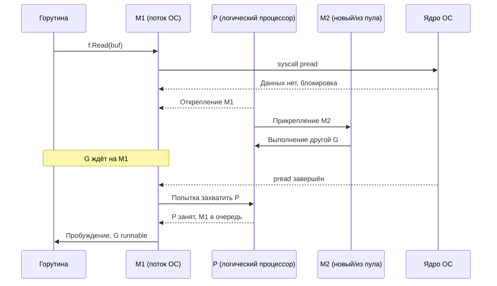

## File IO оптимизация: когда диск становится узким местом рантайма

В предыдущих статьях подраздела мы подробно разобрали аппаратную и программную природу системных вызовов ([[1. Системные вызовы и их стоимость]]), классифицировали бутылочные горлышки ввода-вывода ([[2. IO bottlenecks]]), изучили сетевую подсистему и сетевой поллер ([[3. Network latency]], [[4. epoll, kqueue и netpoller]]), освоили технологии zero-copy передачи данных ([[5. Zero copy подходы]]) и стратегии переиспользования буферов ([[6. Buffer reuse]]).

Теперь мы фокусируемся на **файловом вводе-выводе** — специфической области, где элегантная философия рантайма Go («пишите простой синхронный код, а планировщик сделает его асинхронным») сталкивается с суровой реальностью архитектуры ядра Linux.

Эта реальность проста и бескомпромиссна: в отличие от сетевых сокетов, которые Go виртуозно мультиплексирует через `epoll` и `kqueue`, обычные файлы на диске (даже открытые с флагом `O_NONBLOCK`) с точки зрения ядра Linux **всегда считаются готовыми к чтению и записи**. Системный вызов `epoll_wait` на дескрипторе дискового файла немедленно возвращает флаг `EPOLLIN`, невзирая на то, находятся ли запрашиваемые сектора в горячей оперативной памяти или считывающая головка механического диска только начинает перемещаться к дорожке.

Поэтому сетевой поллер (netpoller) для обычных файлов в Go принципиально не работает. Каждая файловая операция, которая сталкивается с промахом системного дискового кэша, **намертво блокирует системный поток ОС (M)**. Это фундаментальное архитектурное ограничение, которое Senior Go-инженер обязан не просто знать, а закладывать в фундамент надежности высоконагруженных систем.

В этой статье мы детально препарируем механику файловых операций в Go, проследим их влияние на планировщик M:N, разберем ключевые техники оптимизации (буферизацию через `bufio`, проецирование в память `mmap`, прямой ввод-вывод `O_DIRECT`, асинхронный интерфейс `io_uring`) и свяжем их с законами аппаратного уровня: работой системного Page Cache, алгоритмами планировщиков дискового ввода-вывода (CFQ/bfq, mq-deadline) и прерываниями контроллеров накопителей.

## Почему файловый ввод-вывод блокирует поток ОС

Когда горутина выполняет стандартный вызов `f.Read(buf)`:

1. Вызывается системный вызов ядра `pread` (или `read`).
2. Подсистема виртуальной файловой системы (VFS) ядра проверяет, присутствуют ли запрошенные страницы файла в **page cache** (буферном дисковом кэше ядра в оперативной памяти).
3. **Быстрый путь (Fast Path):** если данные уже находятся в page cache, ядро копирует байты в пользовательский буфер `buf` (`copy_to_user`). Системный вызов завершается за доли микросекунды, и горутина продолжает исполнение **без блокировки потока M**.
4. **Медленный путь (Slow Path):** если данных в кэше нет (Page Cache Miss), ядро переводит вызывающий поток в состояние `TASK_UNINTERRUPTIBLE` (непрерываемый сон D-state) и помещает запрос ввода-вывода в очередь блочного планировщика ввода-вывода (blk-mq). Поток ОС **блокируется** до завершения физической передачи секторов с диска (от десятков микросекунд на NVMe SSD до десятков миллисекунд на HDD).

В этот момент рантайм Go активирует механизм **hand-off** ([[1. Системные вызовы и их стоимость]]):
- Заблокированный поток M открепляется от логического процессора P (`P.m = nil`).
- Логический процессор P ищет в пуле простаивающий поток M или запрашивает у ядра создание нового потока ОС (`clone()`).
- Горутина остается привязанной к заблокированному потоку M.

Когда физическое чтение завершается, поток M просыпается, выходит из системного вызова ядра, вызывает функцию `exitsyscall` и пытается либо вернуть себе P, либо встать в очередь ожидания. Сама горутина переводится в статус runnable.



### Последствия для производительности

- **Взрывной рост потоков ОС (Thread Thrashing):**  
  Если тысячи параллельных горутин одновременно обращаются к диску за файлами, рантайм Go может в считанные секунды породить сотни или тысячи потоков ядра M. Каждый поток ОС резервирует память под стек ядра (~8 КБ на стек + управляющие структуры ядра `task_struct`), а постоянные переключения контекста ядра ([[4. Контекстные переключения]]) сжигают процессорное время и вымывают процессорный кэш. В худшем случае приложение упрется в системный лимит ядра `/proc/sys/kernel/threads-max` или упадет с паникой рантайма Go `runtime: program exceeds 10000-thread limit`.
- **Потеря аппаратной локальности (Cache Invalidation):**  
  После пробуждения потока M горутина возвращается в глобальную очередь и может быть украдена другим процессором P ([[3. Work stealing]]), мигрируя на другое физическое ядро процессора и теряя прогретые кэш-линии.
- **Непредсказуемая деградация задержки (Tail Latency):**  
  Время отклика запросов начинает полностью зависеть от очереди запросов к физическому контроллеру диска.

## Page Cache: главный союзник

**Page cache** (кэш страниц) — это фундаментальная подсистема ядра Linux, использующая всю доступную и не занятую процессами оперативную память для кэширования блоков дисковых файлов. При повторном обращении к одному и тому же файлу данные считываются прямо из оперативной памяти со скоростью DRAM (гигабайты в секунду). Именно благодаря page cache подавляющее большинство вызовов `pread` в Go отрабатывает по быстрому пути.

Инженерные правила взаимодействия с Page Cache:
- **Временная и пространственная локальность:**  
  Если файл регулярно читается разными горутинами, он надежно оседает в page cache, и дисковые задержки исчезают.
- **Аппаратное упреждающее чтение (Readahead):**  
  Ядро Linux отслеживает последовательные обращения к файлу. Обнаружив последовательный паттерн чтения, подсистема readahead начинает упреждающе загружать следующие страницы файла с диска по DMA до того, как Go-приложение их запросит. Благодаря этому даже первичное последовательное чтение крупного файла может проходить почти без пауз на ожидание диска.
- **Опасность вытеснения кэша (Cache Eviction):**  
  Если ваш Go-сервис производит массированные аллокации памяти в куче или на сервере запускается фоновый процесс с интенсивным дисковым вводом-выводом, ядро начинает вытеснять страницы файлов из памяти, переводя операции `read` в мучительный медленный путь.

Состояние page cache можно в реальном времени мониторить через `/proc/meminfo` (поля `Cached`, `Buffers`, `Dirty`, `Writeback`) и системную утилиту `vmstat 1`.

## Буферизация: bufio как обязательный стандарт

Наивный вызов `f.Read(buf)` на объекте `*os.File` выполняет ровно один системный вызов ядра. Попытка читать файл побайтово или мелкими порциями по 100 байт превратит чтение скромного 10-мегабайтного лога в **100 000 системных вызовов**, обрушивая производительность сервиса в сотни раз.

Стандартный спаситель в Go — буферизированный поток `bufio.Reader`:

```go
f, err := os.Open("large.json")
if err != nil {
    return
}
defer f.Close()

// Создаем буферизированный читатель с увеличенным размером буфера (64 КБ)
r := bufio.NewReaderSize(f, 64*1024)
data, err := r.ReadBytes('\n')
```

`bufio.Reader` выполняет один крупный блочный системный вызов `Read` в свой внутренний массив (по умолчанию 4 КБ, а при настройке через `NewReaderSize` — 64 КБ), после чего моментально отдает данные по запросам приложения прямо из оперативной памяти без единого перехода в ядро ОС.

Аналогично для записи: `bufio.Writer` накапливает результаты работы и сбрасывает их на диск крупными монолитными блоками. При завершении записи обязателен явный вызов метода `Flush()`!

> [!info] Под капотом
> `bufio.Reader` взаимодействует с низкоуровневым интерфейсом `io.Reader`. Для `*os.File` это напрямую транслируется в системный вызов `syscall.Read`. Размер внутреннего буфера критически важен: слишком маленький буфер порождает лишние системные вызовы, а слишком большой приводит к нерациональному расходу оперативной памяти и вымыванию процессорного кэша. Эмпирический оптимум для последовательного чтения современных файлов на SSD — от 32 до 128 КБ (для NVMe дисков иногда эффективны буферы в 256 КБ).

## Direct I/O: в обход page cache

В специализированных сценариях системный page cache становится не союзником, а помехой:
- Приложение самостоятельно управляет собственным кэшем данных в памяти (высоконагруженные СУБД, такие как PostgreSQL, CockroachDB, ScyllaDB). Двойное кэширование (в приложении и в ядре) вдвое сокращает полезную RAM сервера.
- Данные записываются или читаются строго один раз (потоковый бэкап или миграция данных), и забивать ими page cache бессмысленно.
- Критически важна детерминированная запись непосредственно на физический накопитель.

В ядре Linux флаг `O_DIRECT` при открытии файла (`syscall.O_DIRECT`) инструктирует ядро передавать данные напрямую между накопителем и пользовательским буфером процесса через DMA, минуя page cache.

Прямой ввод-вывод накладывает жесткие аппаратные ограничения:
- Базовый адрес буфера в памяти обязан быть строго **выровнен** по границе дискового сектора (обычно 512 байт для старых дисков и 4096 байт для современных накопителей Advanced Format 4Kn).
- Размер передаваемой порции данных обязан быть строго кратен размеру сектора.

В стандартном пакете `os` флаг прямого ввода-вывода не экспортируется, но доступен через системный вызов `syscall.Open` в пакете `golang.org/x/sys/unix`. Для высокопроизводительных дисковых движков это стандарт де-факто.

## mmap: альтернативный способ чтения

Вместо традиционных системных вызовов `read`/`write` файл можно отобразить в виртуальную память процесса с помощью системного вызова `syscall.Mmap`. После этого к содержимому файла можно обращаться через обычный срез `[]byte`:

```go
fi, _ := f.Stat()
data, err := syscall.Mmap(int(f.Fd()), 0, int(fi.Size()),
    syscall.PROT_READ, syscall.MAP_SHARED)
if err != nil {
    return
}
defer syscall.Munmap(data)

// data — это валидный []byte, ссылающийся на физические страницы файла
processData(data)
```

Преимущества `mmap`:
- Полное отсутствие явных системных вызовов при последующем чтении.
- Идеально подходит для работы со статическими файлами произвольного доступа (Apache Arrow, Parquet, встраиваемые базы данных BoltDB/bbolt, LMDB).

Недостатки:
- **`mmap` не устраняет блокировки потока!** При первом чтении байта из неотображенной страницы процессор генерирует аппаратный Page Fault, и поток ядра M засыпает в ожидании диска точно так же, как при вызове `pread`.
- Для гарантированного сброса изменений на диск требуется явный системный вызов `msync`.

## io_uring: будущее асинхронного файлового ввода-вывода в Go

Начиная с ядра Linux 5.1, появился революционный интерфейс асинхронного ввода-вывода — **io_uring**, созданный Йенсом Аксбо (Jens Axboe).

Архитектура `io_uring` построена на двух разделяемых кольцевых буферах (lock-free ring buffers), отображенных в память между ядром и пользовательским процессом:
1. **Submission Queue (SQ):** приложение записывает дескрипторы операций ввода-вывода (чтение, запись, открытие, синхронизация) в очередь отправки.
2. **Completion Queue (CQ):** ядро выполняет операции в фоне через выделенные ядерные потоки и складывает результаты в очередь завершения.

В режиме `IORING_SETUP_SQPOLL` ядро опрашивает очередь SQ в собственном потоке: приложение передает запросы на ввод-вывод **вообще без выполнения системных вызовов** (Zero Syscall I/O)!

Для рантайма Go внедрение `io_uring` ознаменовало бы исторический перелом:
- Файловый ввод-вывод перестал бы блокировать потоки M.
- Полностью исчез бы механизм hand-off и лавинообразное создание потоков ОС.
- Скорость дискового ввода-вывода в Go вплотную приблизилась бы к скорости сетевого netpoller.

На сегодняшний день официальная стандартная библиотека Go сохраняет традиционную синхронную модель. Однако для экстремальной производительности сообщество активно использует сторонние пакеты (например, `github.com/iceber/iouring-go`).

## fsync, O_SYNC и задержки записи

Когда горутина вызывает `os.File.Write`, данные записываются в системный page cache, получая статус «грязных страниц» (dirty pages). Физическая запись на пластины или флеш-ячейки диска откладывается ядром на секунды.

Чтобы гарантировать сохранность транзакций (например, в логах Write-Ahead Log СУБД), приложение обязано вызывать метод `f.Sync()` (системный вызов ядра `fsync` или более экономный `fdatasync`). Системный вызов `fsync` инициирует немедленный сброс всех грязных страниц файла на физический носитель и **блокирует вызывающий поток M до подтверждения от контроллера диска**.

На механических HDD задержка `fsync` достигает 5–15 мс (время оборота диска), а на серверных NVMe SSD — от десятков до сотен микросекунд.

Типичные архитектурные ошибки:
- **Синхронизация на каждый чих:** вызов `f.Sync()` на каждую запись строки в лог убивает производительность сервиса до жалких сотен RPS.
- **Массивный сброс:** редкий вызов `fsync` после записи сотен мегабайт замораживает поток на сотни миллисекунд, порождая огромный всплеск задержки (latency spike).
- Использование флагов синхронного открытия: `O_SYNC` (каждый вызов `write` неявно выполняет полный `fsync` данных и метаданных) или `O_DSYNC` (сбрасываются только данные файла без обновления времени модификации).

Решение: пакетная запись (Group Commit) — накопление пачки транзакций от сотен горутин и их фиксация одним общим вызовом `fsync`.

## Диагностика файлового ввода-вывода в Go

Для выявления дисковых узких мест в Linux применяются следующие инструменты:

### strace

Позволяет зафиксировать реальные системные вызовы, их точную длительность и частоту блокировок:

```bash
# Суммарная статистика вызовов
strace -c -p $(pgrep myapp)

# Точный хронометраж дисковых операций (с флагом -T)
strace -T -e trace=read,write,pread,pwrite,fsync -p $(pgrep myapp)
```

### iostat

Инспекция утилизации физических накопителей и очередей контроллера:

```bash
iostat -x 1
```

Ключевые метрики:
- `%util` — процент времени занятости накопителя. При приближении к 100% диск перегружен.
- `await` — среднее время ожидания запроса (включая очередь ядра).
- `aqu-sz` — средняя длина очереди запросов к накопителю (Average Queue Size).

### GODEBUG=schedtrace

Отслеживание поведения планировщика Go под нагрузкой:

```bash
GODEBUG=schedtrace=1000 ./myapp
```

Если параметр `threads` (число потоков M) кратно превышает `GOMAXPROCS` при активной работе с файлами — ваши горутины массово блокируются на диске, провоцируя hand-off.

### Execution tracer

Execution tracer ([[3. execution tracer]]) наглядно визуализирует фиолетовые полосы статуса `syscall` у горутин, помогая безошибочно выявить, какие именно функции дискового ввода-вывода парализуют сервис.

## Выбор размера буфера и другие практические рекомендации

- **Оптимальный размер буфера:**  
  Для последовательного чтения и записи оптимален размер буфера от 32 до 128 КБ. Для случайного доступа мелкими порциями буферизация `bufio` неэффективна — в таких случаях целесообразно выравнивать чтение кратно размеру блока файловой системы (4 КБ).
- **Пул дескрипторов файлов:**  
  В отличие от сетевых сокетов, открывать и закрывать миллионы мелких файлов крайне неэффективно из-за накладных расходов VFS на системные вызовы `open`/`close`. Для логов и постоянных файлов дескрипторы следует держать открытыми.
- **Асинхронное логирование:**  
  Категорически запрещено писать логи синхронно в stdout/файл на горячем пути запроса. Логирование должно производиться в кольцевой буфер в памяти с фоновым сбросом на диск через буферизированный writer отдельной горутиной.
- **Изоляция в ограниченный Worker Pool:**  
  Если сервису необходимо выполнять тяжелый дисковый ввод-вывод, эти операции следует выносить в выделенный пул горутин фиксированного размера (например, 16–32 воркера), ограниченный семафором на базе канала. Это на корню пресекает лавинообразное создание потоков M в рантайме.

## Mechanical Sympathy: как диск взаимодействует с процессором и памятью

- **DMA и системные прерывания:**  
  При чтении данных с NVMe SSD контроллер накопителя передает сектора напрямую в память page cache по шине PCIe через DMA. По завершении передачи контроллер генерирует аппаратное прерывание MSI-X. Обработчик ядра (softirq) завершает транзакцию и переводит поток M из D-state в состояние готовности.
- **Холодный кэш при пробуждении:**  
  Пока поток M спал в ядре десятки микросекунд, другие потоки вытеснили его структуры данных из кэшей L1/L2. При первом обращении к прочитанному буферу поток столкнется с цепочкой Cache Misses. Технология Intel DDIO (Data Direct I/O) частично решает эту проблему, позволяя контроллерам PCIe помещать данные сразу в L3-кэш процессора.
- **Блочные планировщики ввода-вывода ядра (I/O Schedulers):**  
  Ядро Linux использует многоочередные планировщики (blk-mq: `none`, `mq-deadline`, `bfq`, `kyber`), которые переупорядочивают и объединяют запросы для минимизации задержек. Для сверхбыстрых NVMe-дисков обычно выбирается планировщик `none` (отсутствие очередей) или `kyber`.

> [!tip] Собеседование
> **Вопрос:** Что происходит в рантайме Go, когда горутина читает большой файл с медленного диска, и почему это может повлиять на соседние сетевые горутины?  
> **Ответ:** Системный вызов чтения с диска является синхронным и блокирующим. Поток ОС M засыпает в ядре. Планировщик Go выполняет hand-off: открепляет процессор P от потока M и ищет или создает новый поток M. Если сотни горутин одновременно читают файлы, создаются сотни потоков ядра Linux. Это вызывает жесткую конкуренцию за кванты времени CPU в планировщике ядра (context switch overhead), разогревает процессор и вымывает кэш L1/L2/L3. В результате соседние сетевые горутины сталкиваются с повышенной задержкой (tail latency), хотя сама сеть свободна.

> [!warning] Ловушка / Gotcha
> **Забытый `Flush()` у `bufio.Writer`.** Если при записи файла вы не вызовете метод `Flush()` перед закрытием дескриптора (`f.Close()`), последние байты (до 64 КБ данных!), оставшиеся во внутреннем буфере `bufio`, будут безвозвратно утеряны! Всегда пишите `defer w.Flush()` сразу после создания буферизированного писателя.

## Итог

- **Файловый ввод-вывод в Go блокирует системные потоки ОС (M)**, поскольку обычные файлы в Linux не поддерживают событийную модель `epoll`.
- Механизм hand-off спасает от остановки параллелизма, но при массовых дисковых операциях приводит к взрывному росту числа потоков ядра и деградации производительности.
- **Page Cache** — главный аппаратный ускоритель дискового ввода-вывода, обеспечивающий субмикросекундное чтение за счет упреждающего чтения (readahead).
- **Буферизация через `bufio`** сокращает количество системных вызовов в тысячи раз и является абсолютным стандартом работы с файлами.
- **Интерфейс `io_uring`** — революция асинхронного файлового ввода-вывода в Linux, способная в будущем избавить Go от накладных расходов блокирующего дискового ввода-вывода.
- Защита транзакций через `fsync` требует осознанного применения: одиночные вызовы на каждую запись убивают RPS, спасением является групповой коммит (batching).
- Механическое сочувствие связывает задержки диска с контроллерами DMA, прерываниями, планировщиками blk-mq и прогревом процессорных кэшей.

Теперь мы переходим к завершающей статье подраздела — [[8. Connection pooling]], где объединим концепции управления задержками, буферами и сокетами в единую архитектуру пулов соединений.