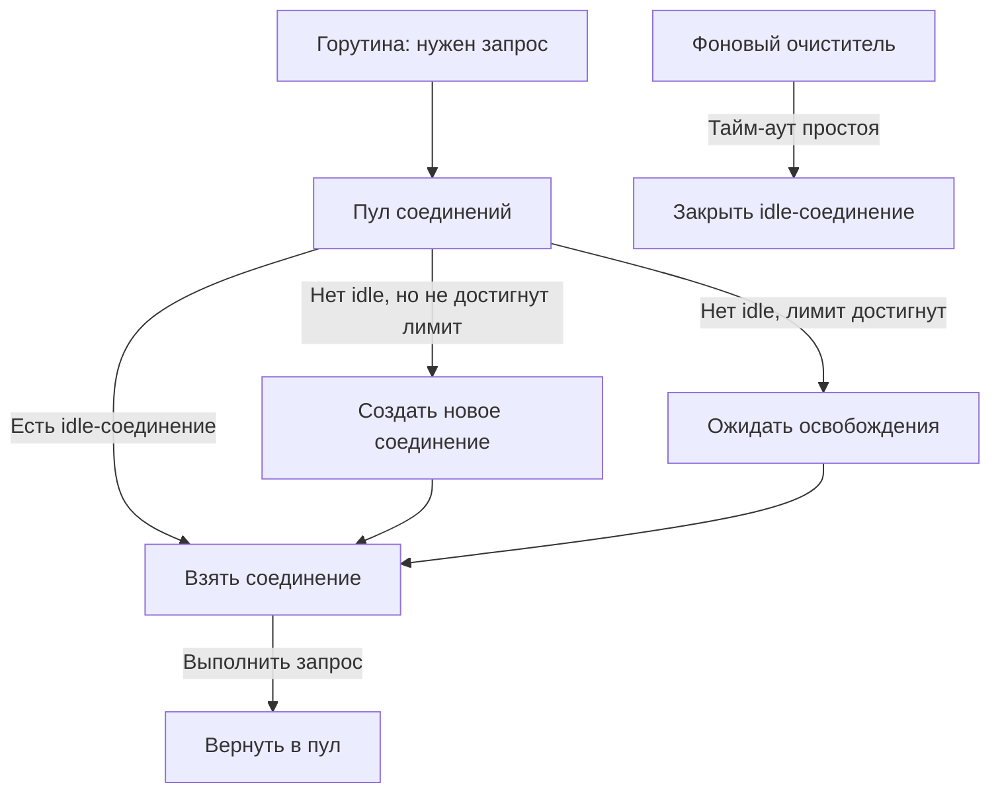
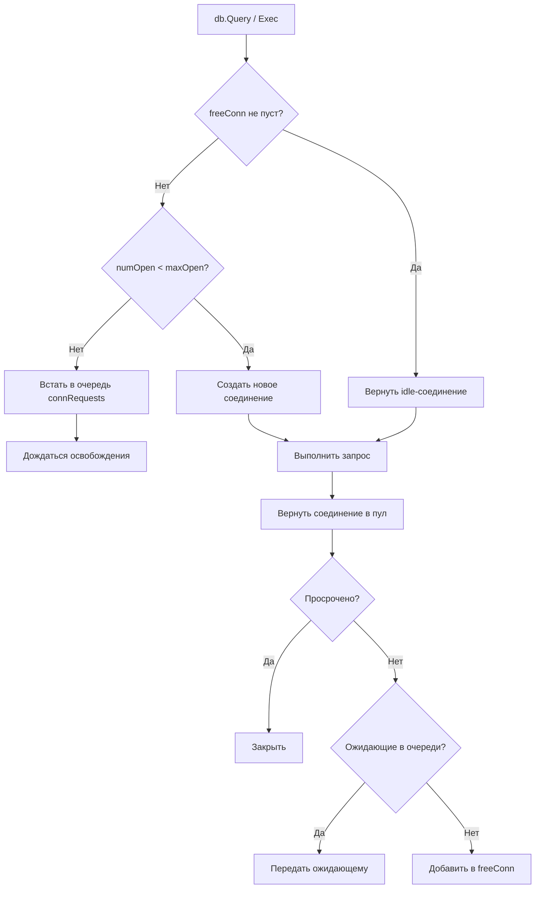

## Connection pooling: переиспользование соединений как основа эффективного ввода-вывода

В предыдущих статьях подраздела мы подробно разобрали скрытую стоимость системных вызовов ядра ([[1. Системные вызовы и их стоимость]]), классифицировали аппаратные и программные бутылочные горлышки ввода-вывода ([[2. IO bottlenecks]]), исследовали природу сетевой задержки ([[3. Network latency]]) и изучили архитектуру сетевого поллера Go — netpoller ([[4. epoll, kqueue и netpoller]]).

Мы выяснили, что процедура установления нового TCP-соединения требует как минимум 1 полного RTT (трехстороннее рукопожатие), плюс еще от 1 до 2–3 RTT на согласование шифрованных сессий TLS, плюс серию системных вызовов ядра на создание сокета, связывание и выделение буферов. Повторять этот тяжеловесный ритуал заново для каждого исходящего HTTP-запроса, вызова СУБД или отправки сообщения в очередь — значит бездумно разбазаривать драгоценные миллисекунды, такты процессора и память операционной системы на действия, не имеющие никакого отношения к полезной бизнес-логике.

Представьте себе почтовую службу, которой для доставки каждого отдельного письма нужно сначала построить персональную железнодорожную ветку до адресата, выставить на границе караул из четырех пограничников с проверкой паспортов (TCP SYN, SYN-ACK, ACK и обмен сертификатами TLS), передать один конверт, а затем... немедленно разобрать рельсы и уволить стражу! При такой организации служба доставки сможет отправлять лишь пару писем в минуту ценой колоссальных затрат.

**Connection pooling** (пул соединений) — это фундаментальный механизм удержания и повторного использования открытых сетевых соединений для обслуживания множества последовательных и параллельных транзакций. Пул амортизирует стоимость установления соединения, исключает лишние сетевые RTT, бережет ресурсы ядра ОС (дескрипторы, эфемерные порты, буферы сокетов) и защищает нижележащие сервисы от шторма подключений при пиковых нагрузках.

В языке Go стандартные клиенты (`net/http`, `database/sql`, а также популярные библиотеки `go-redis` и клиенты Kafka) уже содержат встроенные подсистемы пулинга. Однако Senior-инженер обязан досконально знать их внутреннее устройство, уметь тонко настраивать параметры под профиль нагрузки и диагностировать скрытые утечки и «протухшие» соединения.

## Что такое connection pool и зачем он нужен

Создание каждого нового TCP-сокета с точки зрения ядра и оборудования включает:

- Выделение локального эфемерного порта и системный вызов `connect`.
- Трёхстороннее рукопожатие TCP (SYN, SYN-ACK, ACK) — ровно 1 RTT задержки.
- Согласование шифрования TLS (пакеты ClientHello, ServerHello, обмен ключами) — ещё 1 RTT в TLS 1.3 или 2–3 RTT в устаревшем TLS 1.2.
- Выделение структур `struct sock` и буферов сокета в оперативной памяти ядра Linux.
- Переходы процессора между Ring 3 и Ring 0 на каждом системном вызове ([[1. Системные вызовы и их стоимость]]).

При повторном использовании уже открытого соединения все эти накладные расходы полностью исчезают. Стоимость запроса сводится исключительно к полезной работе: один системный вызов `write` для отправки тела запроса и асинхронное ожидание ответа через `read`, которое эффективно обрабатывается netpoller'ом без блокировки потоков ОС.

Пул соединений поддерживает набор так называемых **idle-соединений** (простаивающих, но физически живых и готовых к работе). Когда горутине требуется отправить запрос, она мгновенно берет свободное соединение из пула, отправляет байты и возвращает сокет обратно. Если свободных соединений нет, пул создает новое (до установленного лимита). Если сокет простаивает слишком долго, фоновый таймер корректно закрывает его, освобождая ресурсы.



## HTTP-клиент: пул в `http.Transport`

Стандартный HTTP-клиент в Go (`net/http.Client`) по умолчанию опирается на глобальный экземпляр `http.DefaultTransport`, содержащий встроенный высокопроизводительный пул TCP-соединений. Однако для продакшена использование дефолтного транспорта недопустимо: необходимо явно конфигурировать собственный экземпляр `http.Transport`.

### Как работает `http.Transport`

Внутренняя механика пула описана в файле `src/net/http/transport.go`. Пул управляется на основе двухуровневой ассоциативной карты:

- Ключ поиска: структура `connectMethodKey` — уникальная комбинация схемы протокола (http/https), сетевого адреса и целевого порта хоста.
- Значение: список структур `persistConn` — легковесных оберток над TCP-соединением, содержащих каналы координации и внутреннее состояние.

В рамках протокола HTTP/1.1 одно соединение `persistConn` способно обрабатывать ровно один запрос в единицу времени. Для протокола HTTP/2 одно физическое TCP-соединение мультиплексирует десятки независимых потоков фреймов, что обслуживается отдельной логикой клиента.

Алгоритм получения соединения в `http.Transport`:
1. Проверяется список `idleConn` для запрашиваемого ключа хоста.
2. Если в `idleConn` есть свободное соединение, оно извлекается и передается горутине.
3. Если свободных соединений нет, но суммарное число активных сокетов к данному хосту меньше лимита `MaxConnsPerHost`, рантайм инициирует создание нового TCP-соединения.
4. Если жесткий лимит `MaxConnsPerHost` достигнут, горутина паркуется и встает в очередь ожидания `connsPerHostWait` до момента возврата сокета другим запросом.

После завершения обработки HTTP-ответа соединение возвращается в пул idle-сокетов при соблюдении условий:
- Сервер не прислал заголовок закрытия `Connection: close`.
- Количество простаивающих соединений к хосту не превышает установленный лимит `MaxIdleConnsPerHost`.
- Соединение не было помечено как разорванное (`broken`).

Фоновая горутина с периодичностью `IdleConnTimeout` обходит неактивные сокеты и закрывает те, чье время простоя превысило порог (по умолчанию `IdleConnTimeout = 90s`).

> [!info] Под капотом
> Структура `persistConn` содержит собственные каналы `writech` и фоновые горутины `readLoop` и `writeLoop`. Это позволяет `http.Transport` полностью разделить ввод и вывод, изолировать чтение заголовков и гарантировать корректное закрытие TCP-сокета при возникновении сетевых сбоев. Перед возвращением сокета в пул рантайм обязательно проверяет статус `broken` — если удаленная сторона успела разорвать связь, соединение немедленно уничтожается.

### Ключевые настройки `http.Transport`

```go
tr := &http.Transport{
    MaxIdleConns:        100,              // Общий лимит idle-соединений на все хосты (0 — без ограничений)
    MaxIdleConnsPerHost:  10,              // Лимит idle-соединений к конкретному хосту (по умолчанию ВСЕГО 2!)
    MaxConnsPerHost:      20,              // Общий максимум одновременных соединений к хосту (0 — без ограничений)
    IdleConnTimeout:      90 * time.Second, // Время жизни неактивного сокета в пуле до закрытия (по умолчанию 90s)
    DisableKeepAlives:    false,           // Если true — keep-alive полностью отключен, соединения закрываются сразу
}
```

Пример: если у вас 100 горутин одновременно обращаются к одному и тому же хосту с `MaxConnsPerHost=10`, то ровно 90 горутин будут заблокированы в очереди `connsPerHostWait`, ожидая освобождения слотов. Это создает искусственное бутылочное горлышко. С другой стороны, неограниченный или чрезмерно большой `MaxConnsPerHost` способен легко перегрузить и обрушить удаленный сервер лавиной одновременных запросов.

> [!warning] Ловушка / Gotcha
> **Катастрофический дефолт `MaxIdleConnsPerHost = 2`.** В стандартной библиотеке Go поле `MaxIdleConnsPerHost` по умолчанию равно всего **2**! Если ваш микросервис отправляет к соседнему бэкенду 500 RPS, то пул сможет переиспользовать только 2 соединения. Остальные 498 запросов будут непрерывно открывать новые TCP-сокеты и тут же закрывать их! В результате сервис начинает захлебываться в TCP-рукопожатиях, а сетевой стек ядра заполняется тысячами сокетов в статусе `TIME_WAIT`. Для высоконагруженных микросервисов значение `MaxIdleConnsPerHost` обязано составлять не менее 20–100.

## gRPC и HTTP/2: почему пул «невидим», но всё равно важен

Клиенты gRPC работают поверх протокола HTTP/2, который аппаратно поддерживает **мультиплексирование потоков** внутри одного TCP-соединения.

В классическом понимании пул соединений для gRPC не требуется: один дескриптор `grpc.ClientConn` удерживает одно постоянное физическое TCP-соединение, через которое параллельно передаются сотни независимых RPC-вызовов.

Однако здесь возникают свои критические нюансы:
- **Несколько `grpc.ClientConn` (Subchannel Pooling):** при гигантских объемах трафика (гигабиты в секунду) пропускная способность одного TCP-соединения может упереться в лимиты окна перегрузки TCP или в производительность одного процессорного ядра, обрабатывающего softirq сокета. В таких случаях создают пул из 4–8 независимых `grpc.ClientConn` к одному кластеру.
- **Keepalive-пинги:** если соединение долго простаивает (например, в ночные часы), промежуточные NAT-шлюзы или облачные балансировщики могут молча разорвать соединение без отправки пакета FIN. Клиент узнает о разрыве только при попытке отправить запрос, получив `broken pipe`. Настройка `keepalive.ClientParameters` отправляет периодические HTTP/2 PING-фреймы, сохраняя соединение живым:

```go
conn, err := grpc.Dial("backend:50051",
    grpc.WithKeepaliveParams(keepalive.ClientParameters{
        Time:                10 * time.Second, // Интервал отправки keepalive-пингов
        Timeout:             3 * time.Second,  // Время ожидания ответа на пинг
        PermitWithoutStream: true,             // Пинговать даже при отсутствии активных RPC
    }),
)
```
- **Idle-таймаут (`IdleTimeout`):** gRPC-клиент умеет автоматически закрывать простаивающие каналы при отсутствии нагрузки, освобождая порты.

## Пул соединений к базам данных: `database/sql`

Встроенный пакет `database/sql` реализует индустриальный эталон пула соединений к СУБД, поверх которого работают сторонние драйверы (`go-sql-driver/mysql`, `jackc/pgx`, `mattn/go-sqlite3`).

### Внутреннее устройство пула `database/sql`

Структура `sql.DB` управляет следующими ключевыми полями:
- `freeConn` — слайс свободных простаивающих соединений `[]*driverConn`.
- `connRequests` — очередь горутин, ожидающих освобождения соединения (канал структур `connRequest`).
- `numOpen` — текущее количество всех открытых соединений к базе.
- `maxOpen` — предельное число открытых соединений (`MaxOpenConns`).
- `maxIdle` — предельное число свободных соединений в пуле (`MaxIdleConns`).
- `maxLifetime` — абсолютное максимальное время жизни соединения (`ConnMaxLifetime`).
- `maxIdleTime` — максимальное время непрерывного простоя сокета в пуле (`ConnMaxIdleTime`).

Алгоритм получения соединения (`db.conn`):
1. Проверяется список `freeConn`. Если есть свободное соединение, оно извлекается.
2. Если свободных соединений нет, но `numOpen < maxOpen`, пул обращается к драйверу СУБД и открывает новый физический сокет.
3. Если лимит `maxOpen` достигнут, горутина встает в очередь ожидания `connRequests` и засыпает до момента освобождения соединения или отмены контекста.

Алгоритм возврата соединения (`putConn`):
1. Проверяются дедлайны: если превышены параметры `maxLifetime` или `maxIdleTime`, сокет немедленно закрывается.
2. Если в очереди `connRequests` есть ожидающие горутины, соединение напрямую передается первой горутине в очереди.
3. Иначе соединение возвращается в слайс `freeConn`.
4. Если `len(freeConn) > maxIdle`, лишние соединения закрываются.

Специальная фоновая горутина `connectionCleaner` периодически инспектирует `freeConn`, закрывая просроченные по `maxLifetime` сокеты.



### Ключевые настройки

```go
db.SetMaxOpenConns(25)                 // Максимум одновременно открытых соединений к СУБД
db.SetMaxIdleConns(10)                 // Максимум удерживаемых idle-соединений (по умолчанию 2!)
db.SetConnMaxLifetime(5 * time.Minute) // Максимальный возраст соединения от момента создания
db.SetConnMaxIdleTime(1 * time.Minute) // Максимальное время простоя сокета в idle-пуле
```

> [!tip] Собеседование
> **Вопрос:** Чем чреваты несбалансированные параметры `SetMaxOpenConns` и `SetMaxIdleConns` в `database/sql`?  
> **Ответ:** Если `SetMaxOpenConns` слишком мал, запросы при скачках трафика будут выстраиваться в очередь `connRequests`, приводя к резкому росту задержки и таймаутам контекста. Если `SetMaxOpenConns` слишком велик (или равен 0 — без ограничений), тысячи параллельных горутин откроют тысячи соединений к СУБД, что обрушит саму базу данных (исчерпание лимита `max_connections` в PostgreSQL/MySQL и нехватка памяти под процессы бэкенда). Если же `MaxIdleConns` установлен намного меньше `MaxOpenConns`, пул будет постоянно убивать и заново открывать сокеты, порождая паразитный TCP/TLS overhead. Идеальный баланс: `MaxIdleConns` должен быть близок к `MaxOpenConns` (например, 20 и 25).

## Пул соединений к Redis, Kafka и другим системам

### Redis (go-redis)

Популярный клиент `go-redis` (`github.com/redis/go-redis/v9`) использует пул на основе `sync.Pool`-подобной структуры с явным управлением соединениями и их жизненным циклом. Настраивается через `redis.Options`:

```go
client := redis.NewClient(&redis.Options{
    Addr:        "localhost:6379",
    PoolSize:    20,               // Максимальное количество активных TCP-сокетов в пуле
    MinIdleConns: 5,               // Всегда удерживать не менее N прогретых idle-соединений
    IdleTimeout:  5 * time.Minute, // Время жизни простаивающего соединения
})
```

Параметр `MinIdleConns` критически важен: он заставляет клиент упреждающе прогревать указанное число соединений в фоне, сглаживая холодный старт при резких всплесках нагрузки.

### Kafka (sarama, kafka-go)

В библиотеке **Sarama** (`sarama.NewAsyncProducer` / `sarama.NewConsumer`) управление сокетами к брокерам кластера полностью инкапсулировано внутри клиента. Параметры `Net.MaxOpenRequests` и `Net.DialTimeout` задают лимиты конвейеризации.

В клиенте **`kafka-go`** от Segmentio архитектура пулинга более прозрачна: параметры `MaxAttempts`, `QueueCapacity` и `BatchSize` позволяют тонко балансировать пакетную отправку и время удержания соединений. Главное системное требование — не превышать лимит брокера `max.connections.per.ip`.

## Проблемы и ловушки connection pooling

> [!warning] Ловушка / Gotcha
> **Stale connections (протухшие соединения).** Балансировщик нагрузки (AWS ALB, Nginx) или удаленная СУБД закрывают неактивные TCP-соединения по собственному таймауту (например, через 60 секунд), отправляя пакет TCP FIN. Если клиентский пул не знает об этом и попытается отправить запрос в протухший сокет, ядро вернет ошибку `connection reset by peer` или `broken pipe`. Защита: параметр `SetConnMaxIdleTime` в клиенте Go всегда должен быть **меньше**, чем серверный таймаут простоя в конфигурации СУБД или балансировщика!

> [!warning] Ловушка / Gotcha
> **Утечки соединений из-за незакрытых ресурсов (`rows.Close()`, `resp.Body.Close()`).** Классическая катастрофа продакшена. Если в коде не вызван `defer rows.Close()` при запросе к СУБД или не прочитано до конца и не закрыто тело HTTP-ответа `defer resp.Body.Close()`, соединение **не возвращается в пул**! Оно навсегда остается в статусе «занято». Буквально за несколько минут все слоты пула исчерпываются, и приложение намертво зависает в очереди ожидания свободных сокетов. Всегда пишите `defer` закрытия немедленно после проверки ошибки!

> [!warning] Ловушка / Gotcha
> **Недостаток idle-соединений.** Если `MaxIdleConns` слишком мал, а `MaxOpenConns` велик, соединения будут постоянно создаваться под нагрузкой и закрываться после разового использования, теряя весь смысл пула. Всплески задержки на установку соединений будут отчетливо заметны на перцентилях p99 и p99.9.

> [!warning] Ловушка / Gotcha
> **Ограничения на стороне ОС (порты) и исчерпание диапазонов.** Если из-за отключенного пулинга (`DisableKeepAlives = true` или `MaxIdleConnsPerHost = 0`) сервис непрерывно открывает и закрывает тысячи сокетов, закрытые сокеты зависают в состоянии ядра `TIME_WAIT` на 60 секунд (период $2 \times \text{MSL}$). Вскоре в ядре заканчиваются свободные локальные порты из системного диапазона `net.ipv4.ip_local_port_range` (`/proc/sys/net/ipv4/ip_local_port_range`), и вызовы `connect()` начинают падать с ошибкой `cannot assign requested address`. Пул соединений полностью защищает от этой катастрофы.

## Mechanical Sympathy: connection pool и система

Рассмотрение пулов соединений через призму аппаратной архитектуры раскрывает их колоссальный эффект на производительность:

- **Сокет как структура ядра:**  
  Каждый вызов `socket()` аллоцирует в пространстве ядра структуру `struct sock` размером около 2–3 КБ, плюс выделяет буферы приема и отправки сокета (`SO_RCVBUF` и `SO_SNDBUF`, по 16–64 КБ каждый). Постоянное создание сокетов заставляет аллокатор ядра SLAB непрерывно выделять и освобождать страницы памяти. Пул соединений полностью устраняет эту системную суету.
- **Прогретые сетевые буферы в кэше процессора:**  
  Уже установленное и регулярно переиспользуемое TCP-соединение оперирует прогретыми кольцевыми буферами, которые оседают в L3-кэше процессора (благодаря Intel DDIO). Это ускоряет обработку пакетов сетевой картой и процессором.
- **Привязка к ядрам (RSS) и NUMA-локальность:**  
  Сетевой адаптер распределяет входящие TCP-потоки по ядрам процессора на основе хэша заголовков (IP/порт) с помощью Receive Side Scaling (RSS). Если соединение переиспользуется на том же процессоре P (чему способствует архитектура `sync.Pool`-подобных структур), обработка softirq и данные сокета остаются на одном NUMA-узле, минимизируя трафик по межпроцессорной шине (Intel UPI / AMD Infinity Fabric).

## Мониторинг и диагностика пулов

### database/sql

Пакет стандартной библиотеки предоставляет встроенный метод `db.Stats()`:

```go
stats := db.Stats()
fmt.Printf("Open: %d, InUse: %d, Idle: %d, WaitCount: %d, WaitDuration: %s\n",
    stats.OpenConnections, stats.InUse, stats.Idle,
    stats.WaitCount, stats.WaitDuration)
```

Интерпретация метрик:
- `WaitCount` — суммарное количество раз, когда горутины были вынуждены заблокироваться в очереди ожидания сокета. Рост показателя сигнализирует о нехватке `MaxOpenConns`.
- `WaitDuration` — совокупное время, проведенное горутинами в ожидании соединений. Если оно растет — база данных или пул тормозят весь сервис.
- `InUse` vs `Idle` — мгновенный баланс между занятыми и простаивающими слотами.

### net/http.Transport

Для детальной инспекции HTTP-пула используется пакет `net/http/httptrace`:
- Хуки `GotConn`, `ConnectStart`, `ConnectDone` позволяют замерить, было ли соединение получено из idle-пула мгновенно (`GotConnInfo.Reused == true`) или клиенту пришлось проходить процедуру установки сокета с нуля.
- Внешний сбор и экспорт метрик Prometheus (семейство `http_client_*`, например `http_client_requests_total`, `http_client_request_duration_seconds`) позволяет непрерывно анализировать задержки сетевых вызовов и оценивать процент попадания в пул idle-соединений.

### Системные утилиты

- **`ss -tanop` или `netstat -anp`:**  
  Позволяет оценить распределение состояний сокетов: `ESTABLISHED` (активные и idle-соединения), `TIME_WAIT` (закрывающиеся сокеты — признак недостатка пулинга) и `CLOSE_WAIT` (сокеты, закрытые сервером, но забытые клиентом).
- **`perf top` / `strace -c`:**  
  Показывает долю системных вызовов `connect` и `tcp_connect`. Если в профиле системных вызовов доминируют `connect`, пул настроен неэффективно.

## Итог

- **Connection pooling (пулинг соединений)** — ключевой инженерный механизм устранения сетевых задержек, амортизирующий затраты на рукопожатия TCP и TLS (экономия от 1 до 4 RTT на запрос).
- В Go пулы соединений бесшовно встроены в `net/http.Transport`, `database/sql`, а также библиотеки для Redis и Kafka.
- Для `http.Transport` дефолтное значение `MaxIdleConnsPerHost = 2` является опасной ловушкой: в продакшене его обязательно увеличивают до 20–100.
- В gRPC протокол HTTP/2 обеспечивает мультиплексирование потоков в одном физическом сокете, однако требует настройки `keepalive.ClientParameters` для защиты от скрытых разрывов.
- Пул `database/sql` требует осознанного балансирования `SetMaxOpenConns` и `SetMaxIdleConns`: жесткая дисциплина закрытия `rows.Close()` через `defer` предотвращает катастрофические утечки сокетов.
- На аппаратном уровне пулы стабилизируют память ядра, предотвращают исчерпание эфемерных портов и поддерживают прогретыми кэши L1/L2/L3 процессора.

На этом мы полностью завершаем подраздел **«07. IO и системный уровень»**. Мы прошли фундаментальный путь: от природы системных вызовов и сетевого поллера до технологий zero-copy и архитектуры пулов соединений.