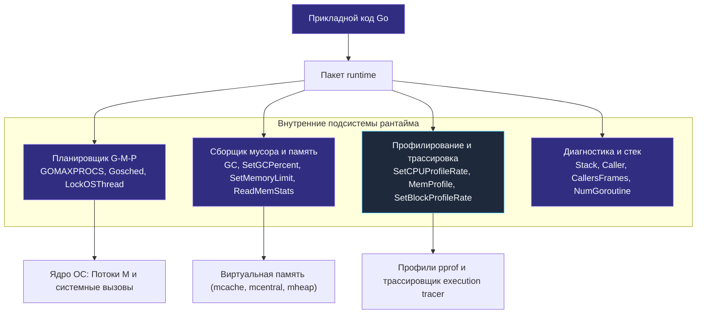
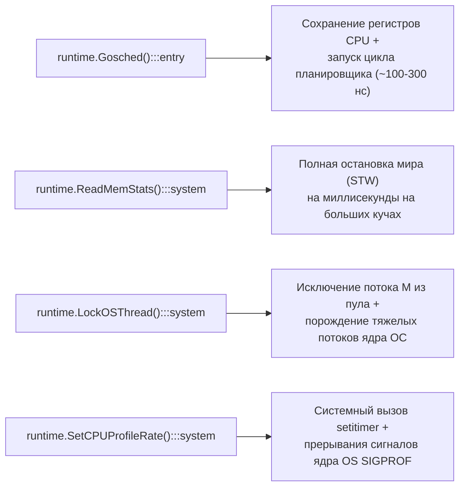

## `runtime` — мост между кодом и средой выполнения

Пакет `runtime` занимает совершенно особое положение в экосистеме Go. В отличие от подавляющего большинства стандартных библиотек, реализующих прикладную логику (сетевые протоколы, сериализацию или работу с файловой системой), `runtime` предоставляет прямой программный API к сокровенным внутренностям самого языка: планировщику горутин ([[1. Scheduler Go. G M P модель]]), сборщику мусора ([[1. GC в Go. Обзор]]), подсистеме низкоуровневого профилирования ([[1. pprof. Введение]]) и аллокатору виртуальной памяти ([[1. Memory model Go]]).

Если обычный код на Go работает в уютной абстракции «виртуальной машины без интерпретатора», то вызовы функций пакета `runtime` распахивают капот и дают инженеру доступ к рычагам управления двигателем. Senior-инженер, свободно владеющий этим пакетом, получает возможность не просто компилировать код, а «разговаривать» со средой выполнения на её родном языке: инспектировать распределение стека, тонко регулировать параллелизм, привязывать горутины к физическим ядрам процессора, динамически тюнить сборщик мусора и проводить глубинную диагностику приложений непосредственно в продакшене.



Знание архитектуры `runtime` обязательно для прецизионного тюнинга производительности высоконагруженных сервисов ([[7. GOGC и tuning]], [[8. GOMEMLIMIT]]), непрерывного профилирования под реальным трафиком ([[2. Profiling в production]]) и построения кастомных метрик телеметрии ([[8. Observability и performance]]).

Однако общение с рантаймом напрямую требует предельной инженерной дисциплины: многие системные функции несут ненулевой overhead, вызывают принудительные остановки мира (Stop-The-World) или блокировки глобальных структур планировщика, способные исказить замеры и нарушить стабильность системы при бездумном применении. В этой статье мы систематизируем ключевой арсенал пакета `runtime`, связывая каждую функцию с принципами механического сочувствия к машине ([[5. Mechanical sympathy в backend разработке]]).

---

## Управление параллелизмом и планировщиком

### GOMAXPROCS — главный регулятор параллелизма

Функция `runtime.GOMAXPROCS(n int) int` устанавливает максимальное количество логических процессоров `P` (структур `runtime.p`), которые имеют право одновременно исполнять пользовательский байткод Go на физических ядрах ОС, и возвращает предыдущее действующее значение.

Если передать `n <= 0`, рантайм ничего не изменяет, а просто сообщает текущее значение `GOMAXPROCS`:

```go
old := runtime.GOMAXPROCS(0) // Запросить текущее значение без изменений
runtime.GOMAXPROCS(4)        // Принудительно установить 4 логических процессора P
```

По умолчанию `GOMAXPROCS` инициализируется значением, равным числу доступных процессорных ядер хоста (или квоте cgroups в современных версиях Go при поддержке контейнеризации). Этот параметр напрямую задает степень аппаратного параллелизма в фундаментальной модели G-M-P ([[1. Scheduler Go. G M P модель]]): сколько бы тысяч горутин `G` ни находилось в статусе `_Grunnable`, активно молотить инструкции на конвейерах CPU в конкретный момент времени могут ровно `GOMAXPROCS` горутин.

Типичные сценарии изменения:
- **Уменьшение** — когда Go-процесс делит хост с другими critical-процессами (например, базой данных или сетевым прокси), и необходимо жестко ограничить аллокацию вычислительных ядер. Также уменьшение оправдано в облачных контейнерах при жестких CPU-квотах для предотвращения CPU throttling.
- **Увеличение** — в 99% случаев не имеет смысла и вредно. Установка `GOMAXPROCS` выше количества физических ядер процессора порождает паразитную конкуренцию за L1/L2/L3-кэши, лавину межпроцессорных прерываний и дорогостоящих вытесняющих контекстных переключений операционной системы ([[4. Контекстные переключения]]).

> [!info] Под капотом
> Вызов `GOMAXPROCS` на лету модифицирует внутреннее глобальное состояние планировщика `sched.procs`. Чтобы безопасно изменить количество `P`, рантайм производит процедуру `stopTheWorld("GOMAXPROCS")`: все работающие горутины временно паркуются. При увеличении создаются новые структуры `P`, при уменьшении — лишние `P` деаллоцируются, а их локальные очереди горутин `runq` сбрасываются в глобальную очередь `sched.runq`. Это порождает тяжелые блокировки планировщика, поэтому динамическое дерганье `GOMAXPROCS` в высоконагруженных горячих путях категорически недопустимо.

---

### Gosched — добровольная передача управления

Функция `runtime.Gosched()` заставляет текущую исполняющуюся горутину добровольно уступить процессор `P` своим товарищам по очереди:

```go
for {
    // Выполнение порции тяжелой вычислительной работы
    runtime.Gosched() // Уступить квант времени другим горутинам
}
```

Под капотом `Gosched` переводит текущую горутину из состояния `_Grunning` обратно в `_Grunnable`, отвязывает ее от `M` и помещает в конец глобальной очереди планировщика `sched.runq` (а не в локальную очередь `P`, чтобы исключить монополизацию процессора). После этого `M` немедленно вызывает планировщик `schedule()` для выбора следующей готовой горутины.

Исторический контекст: до появления асинхронного вытеснения на базе сигналов ОС в Go 1.14 (сигнал `SIGURG`), горутина, застрявшая в плотном вычислительном цикле без вызовов функций (где компилятор не мог вставить преамбулу проверки стека `morestack`), намертво монополизировала поток `M`, блокируя сборку мусора (STW) и другие горутины. В те времена `Gosched` был жизненно необходим. Сегодня, благодаря `SIGURG`-преемпции, необходимость в ручном вызове отпала в большинстве случаев, однако `Gosched` остается мощным инструментом в тестах, спинлоках и алгоритмах кооперативной многозадачности.

---

### NumGoroutine и NumCPU — индикаторы состояния

- **`runtime.NumGoroutine() int`** — возвращает мгновенное количество всех существующих в процессе горутин (включая активные, спящие в ожиданиях таймеров, заблокированные на каналах, мьютексах и системных вызовах). Экспоненциальный рост этого числа — первый признак классической утечки горутин (goroutine leak) или взрывного наплыва трафика.
- **`runtime.NumCPU() int`** — возвращает количество аппаратных логических ядер процессора, доступных процессу на момент старта. Значение считывается через вызовы ядра ОС (`sched_getaffinity` в Linux или `sysctl` в macOS) и используется для автоконфигурации пулов воркеров и размера очередей.

Обе функции практически бесплатны с точки зрения CPU и регулярно опрашиваются агентами мониторинга для формирования алертов.

---

## Привязка горутины к потоку ОС: LockOSThread

Модель G-M-P по умолчанию мультиплексирует миллионы горутин `G` на ограниченный пул потоков ОС `M`. Это означает, что горутина может уснуть на одном потоке ОС, а проснуться после системного вызова или блокировки ввода-вывода совершенно на другом потоке ОС и даже на другом ядре процессора.

Функция `runtime.LockOSThread()` ломает эту динамику и жестко «прибивает» текущую горутину к конкретному потоку операционной системы:

```go
func worker() {
    runtime.LockOSThread()
    defer runtime.UnlockOSThread()

    // Вся работа внутри этой функции гарантированно исполняется
    // на одном и том же неизменном потоке ОС (pthread)
}
```

После вызова `LockOSThread()`:
1. Только эта конкретная горутина `G` имеет право выполняться на данном потоке `M`.
2. Если горутина паркуется (ожидает канал или таймер), данный поток `M` засыпает вместе с ней и **не передается** другим горутинам.
3. При завершении горутины привязанный поток `M` не возвращается в пул, а уничтожается ядром ОС (если до выхода не был вызван парный `UnlockOSThread`).

### Когда `LockOSThread` жизненно необходим:
- **CGO и Thread-Local Storage (TLS):** библиотеки на C/C++ часто полагаются на `pthread_setspecific` или переменные `__thread`. Если разные этапы вычислений будут скакать по разным потокам ОС, C-библиотека повредит свои внутренние структуры памяти.
- **Графические и UI-библиотеки (OpenGL, Cocoa, Win32):** оконные подсистемы требуют, чтобы создание окон, обработка очереди событий мыши и клавиатуры, а также рендеринг происходили строго на главном системном потоке (Main Thread, поток `m0`).
- **Системные вызовы ядра, чувствительные к потоку:** операции с пространствами имен Linux (`setns`), изменение UID/GID потока, или вызовы, привязанные к `tid` (thread ID).

> [!warning] Ловушка / Gotcha
> **Неконтролируемое размножение системных потоков.** Привязанный через `LockOSThread` поток `M` исключается из общего пула планировщика. Если вы запустите 1000 горутин, и каждая вызовет `LockOSThread`, рантайм Go будет вынужден породить 1000 полноценных тяжелых потоков ядра Linux! Это приведет к взрывному росту `runtime.NumThread()`, перегрузит память стеками потоков (по 2–8 МБ на поток) и приведет к падению процесса по `out of memory` или превышению лимита ядра `/proc/sys/kernel/threads-max`. Всегда вызывайте парный `runtime.UnlockOSThread()` и никогда не используйте привязку в массовых обработчиках сетевых запросов.

---

## Управление сборщиком мусора и памятью

### GC и принудительная сборка

Функция `runtime.GC()` инициирует немедленный запуск полного цикла сборки мусора (фазы mark + sweep). В отличие от фонового конкурентного GC, вызов `runtime.GC()` является **синхронным и блокирующим**: вызвавшая его горутина засыпает и ждет полного завершения всех фаз очистки памяти.

```go
// Принудительный прогон сборщика мусора
runtime.GC()
```

Сценарии легитимного применения:
- **Точные бенчмарки (`testing.B`):** принудительный вызов `runtime.GC()` перед запуском итераций измерений позволяет очистить кучу от мусора, оставленного предыдущими тестами, стабилизируя замеры аллокаций ([[2. Benchmarking в Go]]).
- **Сброс памяти после огромного однократного пакета:** если сервис обработал огромный массив данных (например, загрузил в память 5 ГБ архив) и больше никогда к нему не вернется, вызов `GC()` помогает ускорить возврат неиспользуемых страниц операционной системе.
- **Диагностика утечек:** сопоставление показателей `runtime.ReadMemStats` непосредственно до и после принудительного `GC()` позволяет четко отличить «мусор, ожидающий фонового сбора» от реальной неустранимой утечки ссылок в живой памяти.

Вызывать `runtime.GC()` в обработчиках высоконагруженного боевого API категорически запрещено: это разрушает всю математику конкурентного GC Pacer, порождает деградацию p99 latency и на пустом месте тратит драгоценные процессорные циклы.

---

### SetGCPercent и SetMemoryLimit — динамическая настройка политик

Эти функции дублируют системные переменные окружения `GOGC` и `GOMEMLIMIT`, позволяя адаптировать аппетиты рантайма непосредственно из Go-кода на лету:

- **`runtime.SetGCPercent(percent int) int`** — программно изменяет целевой коэффициент прироста кучи `GOGC` ([[7. GOGC и tuning]]) и возвращает старое значение. Передача отрицательного числа (`-1`) полностью отключает автоматический сборщик мусора.
- **`runtime.SetMemoryLimit(limit int64) int64`** — устанавливает мягкий потолок потребления памяти в байтах ([[8. GOMEMLIMIT]]) и возвращает предыдущий лимит. Значение `math.MaxInt64` отключает лимит.

```go
// Временно снижаем агрессивность GC на период разогрева кэшей
oldGOGC := runtime.SetGCPercent(200)
defer runtime.SetGCPercent(oldGOGC)

// Устанавливаем мягкий лимит памяти в 2 ГБ для защиты от OOM Killer в Docker
oldLimit := runtime.SetMemoryLimit(2 * 1024 * 1024 * 1024)
```

Динамическое переключение позволяет умным оркестраторам сервиса временно повышать `GOGC` при скачках сетевого трафика (чтобы уменьшить CPU-overhead на частые сборы мусора за счет использования резервов RAM), возвращая стандартные значения при спаде нагрузки.

---

### ReadMemStats — подробный снимок подсистемы памяти

Функция `runtime.ReadMemStats(m *runtime.MemStats)` считывает глобальную статистику аллокатора памяти Go и заполняет переданную структуру детальными метриками:

```go
var m runtime.MemStats
runtime.ReadMemStats(&m)

fmt.Printf("Выделено активной кучи (HeapAlloc): %d МБ\n", m.HeapAlloc>>20)
fmt.Printf("Всего запрошено у ОС (Sys):           %d МБ\n", m.Sys>>20)
fmt.Printf("Количество прогонов GC (NumGC):        %d\n", m.NumGC)
```

Структура `runtime.MemStats` содержит богатейший спектр полей:
- `HeapAlloc` — объем байт в живых аллоцированных объектах кучи.
- `HeapInuse` — объем спанов кучи, содержащих хотя бы один живой объект.
- `HeapIdle` — объем свободных спанов, удерживаемых рантаймом для повторного переиспользования.
- `HeapReleased` — объем страниц памяти, возвращенных ядру ОС через `madvise(MADV_DONTNEED / MADV_FREE)`.
- `StackInuse` — память, занятая динамическими стеками горутин.
- `NumGC` — общее число завершенных циклов сборки мусора со старта приложения.
- `PauseNs` — кольцевой буфер последних 256 длительностей пауз Stop-The-World в наносекундах.
- `TotalAlloc` — кумулятивный объем всех когда-либо выделенных байт (монотонно растет).

> [!tip] Собеседование
> **Вопрос:** Почему регулярный вызов `runtime.ReadMemStats` для сбора метрик в Prometheus может вызывать необъяснимые лаги приложения, и как правильно решить эту проблему?  
> **Ответ:** Чтобы выдать кристально согласованный снимок десятков счетчиков памяти, `runtime.ReadMemStats` принудительно останавливает весь мир (`stopTheWorld("read mem stats")`). На больших сервисах с кучей в десятки гигабайт и сотнями тысяч горутин эта пауза может достигать десятков миллисекунд!  
> **Современное решение:** начиная с Go 1.16, стандартная библиотека предоставляет пакет `runtime/metrics`. Он считывает любые показатели памяти, планировщика и GC абсолютно **без пауз Stop-The-World**, используя атомарные счетчики в конкурентном режиме. Для экспорта телеметрии в продакшене всегда используйте `runtime/metrics` вместо `ReadMemStats`.

---

## Профилирование из кода

Большинство инженеров привыкли профилировать Go-приложения через HTTP-эндпоинты пакета `net/http/pprof` ([[1. pprof. Введение]]). Однако в CLI-утилитах, демонах без сетевого интерфейса, интеграционных тестах или кастомных агентах мониторинга требуется запускать сбор профилей непосредственно программным кодом.

### CPU-профиль

- **`runtime.SetCPUProfileRate(hz int)`** — настраивает базовую частоту дискретизации таймера профилировщика CPU (в герцах, то есть сэмплов в секунду). По умолчанию частота равна 100 Гц (прерывание каждые 10 миллисекунд). Установка `hz = 0` полностью отключает профилирование.
- Высокоуровневая обертка `pprof.StartCPUProfile(w)` (из пакета `runtime/pprof`) внутри себя конфигурирует буферы и вызывает именно `runtime.SetCPUProfileRate`.

### Memory профиль

- **`runtime.MemProfileRate`** — глобальная целочисленная переменная рантайма, определяющая шаг вероятностного сэмплирования аллокаций памяти. По умолчанию равна $512 \times 1024$ (один сэмпл на каждые 512 КБ выделенной памяти).
- Если установить `runtime.MemProfileRate = 1`, рантайм начнет сэмплировать абсолютно каждую аллокацию. Это дает 100% точность в тестах, но порождает колоссальный overhead в проде.
- Для ручной вычитки записей профиля кучи служит функция `runtime.MemProfile(records []MemProfileRecord, zero bool)` или функция `pprof.WriteHeapProfile(w)`.

### Block и mutex профили

Профилировщики задержек синхронизации по умолчанию полностью выключены, так как они требуют замеров времени на системных таймерах при каждой блокировке:

- **`runtime.SetBlockProfileRate(rate int)`** — активирует профиль блокировок горутин на каналах, мьютексах и сетевых вызовах ([[5. block profile]]). Аргумент задает порог задержки в наносекундах: события блокировки длительностью более `rate` наносекунд попадают в профиль. Значение `1` отслеживает абсолютно все блокировки.
- **`runtime.SetMutexProfileFraction(rate int)`** — включает профиль конкуренции за мьютексы (`sync.Mutex`, `sync.RWMutex`, [[6. mutex profile]]). Аргумент задает знаменатель вероятности выборки: записывается каждое `1/rate`-е событие contention. Значение `1` записывает 100% конфликтов.

### Профили потоков и горутин

- **`runtime.ThreadCreateProfile(records []ThreadCreateProfileRecord)`** — считывает стек-трейсы мест создания системных потоков ОС `M`. Позволяет выявить виновников взрывного роста потоков операционной системы.
- **`runtime.GoroutineProfile(records []GoroutineProfileRecord)`** — программный аналог профиля горутин, возвращающий структуры с программными счетчиками стека для всех существующих горутин.

---

## Получение стека и инспекция вызовов

Пакет `runtime` предоставляет мощнейший инструментарий интроспекции, позволяющий коду исследовать собственный стек вызовов в режиме реального времени:

- **`runtime.Stack(buf []byte, all bool) int`** — форматирует текстовый стек-трейс текущей горутины в переданный байтовый слайс `buf` (или всех горутин, если `all=true`). Используется для логирования паник или снятия аварийных диагностических дампов при расследовании инцидентов.
- **`runtime.Caller(skip int) (pc uintptr, file string, line int, ok bool)`** — возвращает программный счетчик (Program Counter), абсолютный путь к файлу исходного кода и номер строки вызывающей функции. Параметр `skip = 0` указывает на саму точку вызова `Caller`, `1` — на вызвавшую ее функцию, и так далее вверх по стеку.
- **`runtime.Callers(skip int, pc []uintptr) int`** — эффективный низкоуровневый сборщик аппаратных адресов возврата (`uintptr`) со стека. Заполняет переданный слайс адресами без строковой аллокации.
- **`runtime.CallersFrames(callers []uintptr) *Frames`** — преобразует массив сырых адресов `pc` в человекочитаемые структуры `Frame` (функция, файл, строка) с корректной обработкой inline-функций компилятора.
- **`runtime.FuncForPC(pc uintptr) *runtime.Func`** — извлекает метаданные функции (имя через `.Name()`, точку входа `.Entry()`) по аппаратному адресу инструкции.

Именно на базе связки `Callers` и `CallersFrames` построены современные высокопроизводительные логгеры вроде `log/slog` ([[1. Logging и observability]]) и `uber-go/zap`, собирающие метаданные об источнике лога с минимальными аллокациями памяти.

---

## Трассировка событий: execution tracer

Пакет `runtime/trace` (не путать с низкоуровневым `runtime` напрямую, но тесно связанный с ним) предоставляет функции `trace.Start(w)` и `trace.Stop()`, которые записывают события рантайма (запуск и остановка горутин, фазы GC, сетевой поллер и системные вызовы syscall) для последующего анализа execution tracer'ом ([[3. execution tracer]]):

```go
f, err := os.Create("trace.out")
if err != nil {
    log.Fatal(err)
}
defer f.Close()

// trace.Start(w) принимает io.Writer
if err := trace.Start(f); err != nil {
    log.Fatal(err)
}
defer trace.Stop()

// Критическая секция бизнес-логики под нагрузкой
```

Внутри ядра рантайма модуль трассировки оперирует внутренними функциями `traceEvent`, `traceAcquire` и `traceRelease`, сбрасывая микрособытия в сверхбыстрые кольцевые буферы на каждом `P`. При включенном `trace.Start(w)` рантайм непрерывно регистрирует переключения контекста, парковку горутин и системные вызовы, а пользовательский код вызывает лаконичный и безопасный API из `runtime/trace`.

---

## Другие важные функции пакета `runtime`

- **`runtime.KeepAlive(x interface{})`** (в современном Go `x any`) — гарантирует, что объект `x` не будет собран сборщиком мусора до вызова `KeepAlive`. Это критически важно при работе с `cgo`, `syscall.Syscall` или финализаторами. Если компилятор видит, что обертка структуры больше не используется в коде, он может позволить GC освободить память структуры прямо в середине выполнения низкоуровневого системного вызова, передающего дескриптор в C-код. Вызов `KeepAlive` предотвращает преждевременную утилизацию объекта.
- **`runtime.NumCgoCall() int64`** — возвращает общее количество вызовов функций CGO, совершенных процессом с момента запуска. Позволяет оценить масштаб накладных расходов на переключение стеков между миром Go и C.
- **`runtime.GOROOT() string`** — возвращает путь к корневой директории установленного тулчейна Go.
- **`runtime.Version() string`** — возвращает строку текущей версии компилятора Go (например, `go1.23.1`).

---

## Mechanical Sympathy: системная стоимость вызовов `runtime`

Разработчик, обладающий аппаратной интуицией, никогда не рассматривает функции `runtime` как бесплатные библиотечные вызовы. Многие из них напрямую воздействуют на планировщик ядра ОС, инвалидируют процессорные кэши и сбрасывают конвейеры инструкций:



- **`runtime.Gosched()`** — требует сохранения регистров текущего контекста в структуру `g.sched`, сброса локальных переменных из регистров в память и вызова логики планирования (цена — сотни наносекунд).
- **`runtime.GC()` и `ReadMemStats()`** — вызывают `stopTheWorld`, паркуя все `P`. Конвейеры процессора пустеют, а кэши L1i/L1d вымываются чужими служебными данными.
- **`runtime.LockOSThread()`** — лишает рантайм гибкости ворк-стилинга, принуждая ядро Linux тратить оперативную память на структуры `task_struct` и стеки потоков ядра.
- **`runtime.SetCPUProfileRate(hz)`** — конфигурирует аппаратный интервальный таймер ядра ОС (`setitimer`), что приводит к генерации сигналов `SIGPROF` и переключениям в контекст ядра.

---

## Собеседование: типичные вопросы

> [!tip] Собеседование
> **Вопрос:** Чем принципиально отличается `runtime.Gosched()` от вызова `time.Sleep(0)` и когда что следует предпочесть?  
> **Ответ:**  
> - `runtime.Gosched()` добровольно уступает процессор, переводя текущую горутину в состояние `_Grunnable` и возвращая ее в очередь планировщика. Если в очередях нет других готовых горутин, текущая горутина продолжит исполнение немедленно, потратив минимум тактов.
> - `time.Sleep(0)` регистрирует полноценный системный таймер в подсистеме таймеров рантайма и безусловно переводит горутину в состояние сна `_Gwaiting`. Горутина отвязывается от процессора и сможет проснуться только тогда, когда системный поллер или фоновый поток таймеров обработает срабатывание таймера.  
> Для алгоритмов кооперативного планирования и спинлоков всегда следует предпочитать `runtime.Gosched()`.

> [!tip] Собеседование
> **Вопрос:** Как программно выяснить количество горутин в работающем сервисе без подключения сетевого эндпоинта `/debug/pprof/goroutine`?  
> **Ответ:** Вызвать легковесную функцию `runtime.NumGoroutine()`. Она считывает атомарный счетчик активных горутин `sched.gcount` из глобального состояния планировщика без блокировок и без аллокаций памяти.

> [!tip] Собеседование
> **Вопрос:** Можно ли безопасно вызывать `runtime.GOMAXPROCS(n)` прямо во время исполнения программы под высокой нагрузкой?  
> **Ответ:** Технически это безопасно (гонки данных исключены), но архитектурно крайне нежелательно. Смена `GOMAXPROCS` выполняет процедуру Stop-The-World, останавливая все горутины, пересоздает структуры логических процессоров `P` и перераспределяет локальные очереди задач. Это гарантированно вызовет всплеск задержки (latency spike) в обслуживании сетевых запросов. Менять `GOMAXPROCS` следует только на этапе старта приложения (в `main()` или `init()`).

---

## Итог

- Пакет `runtime` — это прямой низкоуровневый интерфейс к планировщику задач G-M-P, сборщику мусора, профилировщикам и памяти языка Go.
- Основные функциональные группы пакета охватывают:
  - Управление параллелизмом (`GOMAXPROCS`, `Gosched`, `LockOSThread`, `UnlockOSThread`).
  - Управление памятью и GC (`GC`, `SetGCPercent`, `SetMemoryLimit`, `ReadMemStats`).
  - Профилирование и трассировку (`SetCPUProfileRate`, `MemProfileRate`, `SetBlockProfileRate`, `SetMutexProfileFraction`).
  - Интроспекцию стека (`Caller`, `Callers`, `CallersFrames`, `Stack`, `NumGoroutine`).
- Для мониторинга памяти в современных версиях Go (1.16+) рекомендуется использовать конкурентный пакет `runtime/metrics`, исключающий губительные паузы Stop-The-World функции `ReadMemStats`.
- С точки зрения Mechanical Sympathy, системные функции несут скрытые накладные расходы (STW-паузы, переключения контекста, сигналы ядра), поэтому должны применяться точечно и осознанно.

Освоив фундаментальный API пакета `runtime`, мы переходим к инструментам визуальной трассировки выполнения Go-приложений. Следующая статья: [[2. trace tool]].