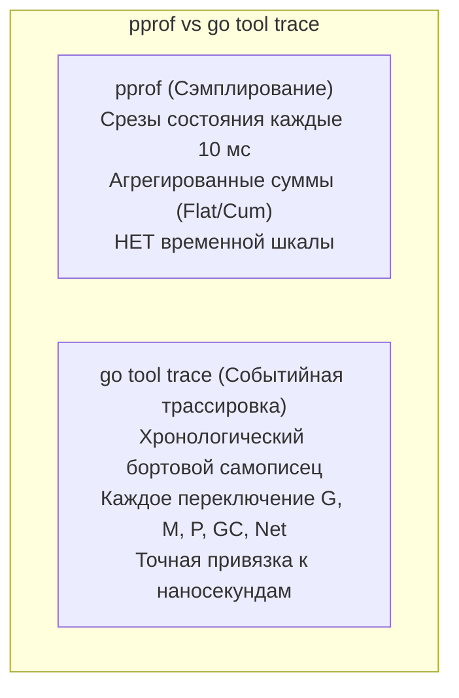
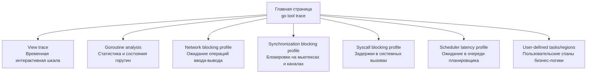
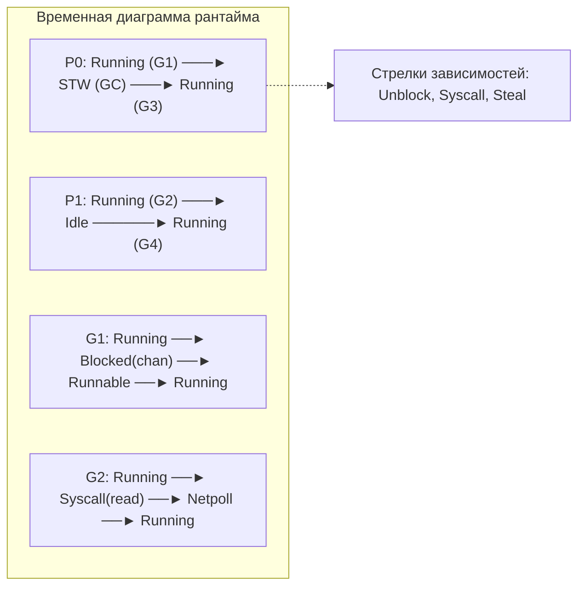
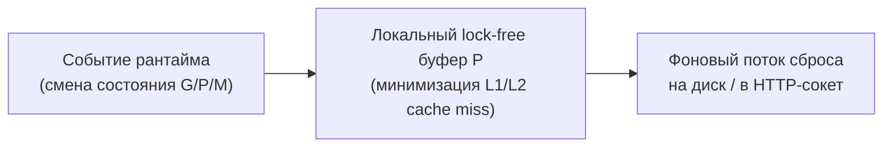

## `go tool trace` — визуализация временной шкалы рантайма

Стандартные профилировщики CPU ([[2. CPU profiling в Go]]) и памяти ([[5. pprof memory profile]]) представляют собой агрегированные статистические отчеты. Они дают исчерпывающий ответ на вопрос: *«В каких функциях программа сожгла больше всего тактов процессора или аллоцировала больше всего мегабайт кучи?»* Однако эти профили абсолютно слепы к измерению времени: они подобны банковской выписке за месяц, в которой указаны общие расходы по статьям, но невозможно понять, в какую именно секунду в кассе закончились деньги, и почему платеж завис на полчаса.

Если ваш сервис демонстрирует аномальные всплески задержки (p99 latency spikes), а CPU-профиль показывает полупустые ядра и нулевую утилизацию процессора, обычный `pprof` бессилен. Почему горутина висела 80 миллисекунд? Ждала ли она системного вызова ядра, заблокировалась на переполненном канале, страдала в очереди ожидания свободного процессора `P`, или рантайм Go в этот момент заморозил мир для сборки мусора?

Ответ на эти вопросы дает **трассировка исполнения** (execution trace) и инструмент для её глубокого визуального анализа — **`go tool trace`**.



`go tool trace` — это мощный CLI-инструмент и интерактивное веб-приложение, входящее в стандартную поставку тулчейна Go. В отличие от `pprof`, который периодически снимает случайные срезы стека (сэмплирование), execution tracer регистрирует **дискретные низкоуровневые события рантайма** в строгой временной последовательности. Это позволяет инженеру превратить необъяснимые лаги в наглядную киноленту событий, вскрывая истинные причины деградации производительности.

---

## Что такое трассировка исполнения в Go

Трассировка исполнения (execution tracer) — это встроенная в рантайм Go легковесная подсистема протоколирования событий. Низкоуровневым сбором управляет пакет `runtime/trace` ([[3. execution tracer]]). При активации трассировки ядро Go непрерывно записывает бинарный поток микрособытий:

- **События горутин:** рождение новой горутины (`GoCreate`), запуск на процессоре (`GoStart`), блокировка на каналах и мьютексах (`GoBlock`), пробуждение другой горутиной (`GoUnblock`), парковка и завершение жизненного цикла (`GoEnd`).
- **События планировщика:** привязка горутины к логическому процессору `P`, уступка кванта времени (`Gosched`), миграция горутин между процессорами `P`, воровство работы из чужих очередей ([[3. Work stealing]]).
- **События сборщика мусора (GC):** фазы concurrent mark, sweep, фоновые GC-воркеры, вспомогательное маркирование аллокаторами (mark assist) и глобальные остановки мира STW ([[3. Stop the world]]).
- **События сети и ввода-вывода:** парковка горутины в системном селекторе `netpoller` ([[4. epoll kqueue и netpoller]]) и ее мгновенное пробуждение при приходе сетевого пакета.
- **Системные вызовы ядра (Syscalls):** точный момент ухода потока `M` в блокирующий вызов операционной системы и выход из него.
- **Пользовательские события (User-defined events):** кастомные задачи (tasks), регионы выполнения (regions) и логические метки бизнес-логики.

`go tool trace` принимает полученный бинарный файл трассировки и компилирует его в многоуровневый интерактивный веб-дашборд.

---

## Как получить трассировку

### 1. Из production-сервиса через HTTP

В боевых сетевых микросервисах наиболее простой и универсальный способ — воспользоваться стандартным HTTP-эндпоинтом `/debug/pprof/trace`, который регистрируется автоматически при импорте `_ "net/http/pprof"`:

```bash
# Записать трассировку рантайма длительностью 5 секунд в файл trace.out
curl -o trace.out "http://localhost:6060/debug/pprof/trace?seconds=5"
```

Параметр `seconds` определяет окно записи. Трассировщик активируется ровно на указанный интервал, после чего стримит собранные бинарные данные клиенту. 

> [!IMPORTANT]
> Запись трассировки обязана производиться **непосредственно под реальной нагрузкой** или во время воспроизведения инцидента. Если сервис простаивает, файл трассировки покажет унылые пустые дорожки `idle`.

### 2. Из кода с помощью `runtime/trace`

Для консольных утилит, бенчмарков или изолированных интеграционных тестов трассировку запускают напрямую через вызовы API:

```go
package main

import (
    "log"
    "os"
    "runtime/trace"
)

func main() {
    f, err := os.Create("trace.out")
    if err != nil {
        log.Fatalf("не удалось создать файл трассировки: %v", err)
    }
    defer f.Close()

    if err := trace.Start(f); err != nil {
        log.Fatalf("ошибка запуска трассировки: %v", err)
    }
    defer trace.Stop()

    // Исполнение критической логики, требующей профилирования
}
```

> [!warning] Ловушка / Gotcha
> **Системный оверхед и искажение картины.** Трассировка исполнения регистрирует абсолютно каждое событие рантайма. Исторически (до Go 1.22) запись трассировки создавала от 10% до 30% накладных расходов по CPU и интенсивно заполняла оперативную память буферами событий. В версиях Go 1.22+ архитектура трейсера была полностью переписана на секционированные кольцевые буферы, снизив оверхед до 1–3%, однако длительные дампы (>10 секунд) на сервисах с миллионами RPS по-прежнему могут раздуть файл до многих гигабайт и перегрузить браузер. Держите окно записи в пределах 3–10 секунд!

---

## Запуск `go tool trace`

После того как бинарный файл `trace.out` успешно сформирован, его открывают с помощью встроенной утилиты Go:

```bash
go tool trace trace.out
```

Команда автоматически запустит локальный HTTP-сервер и откроет браузер с адресом `http://127.0.0.1:PORT`. В окне появится главное меню:



Главное меню группирует данные по ключевым аспектам профилирования: от общей временной шкалы до специализированных гистограмм задержек.

---

## View trace: хронологическая карта рантайма

Ссылка **View trace** открывает сердце инструмента — интерактивный таймлайн рантайма (построенный на базе движка трассировки Chromium Catapult / Perfetto).

### Горизонтальная ось: временной континуум

По горизонтали отложено абсолютное физическое время с точностью до наносекунд. Вы можете плавно масштабировать масштаб колесом мыши или горячими клавишами (`W` — приблизить, `S` — отдалить, `A` — влево, `D` — вправо) и выделять интересующие временные окна клавишей `1` (режим Selection).

### Вертикальные секции таймлайна

Сверху вниз экран разделен на специализированные информационные дорожки:

- **Stats (Сводные графики):**
  - `Goroutines` — кривая общего количества одновременно существующих горутин.
  - `Heap` — график объема аллоцированной памяти кучи в динамике.
  - `Threads` — число реальных системных потоков ОС `M`.
  - `GC` — фазы активности сборщика мусора.
- **Procs (Дорожки логических процессоров `P`):**  
  Каждому процессору `P` (от `Proc 0` до `Proc N-1`, где $N = \text{GOMAXPROCS}$) выделена персональная горизонтальная дорожка. Цвета блоков обозначают происходящее:
  - **Зеленый (Running):** процессор активно выполняет код конкретной горутины `G`.
  - **Серый (Runnable):** горутина готова к исполнению, но простаивает в очереди в ожидании освобождения `P`.
  - **Белый (Idle):** процессор простаивает без работы (отсутствуют готовые задачи).
  - **Красный (GC / Mark Assist):** процессор мобилизован сборщиком мусора для сканирования указателей.
- **События и связи (Flow Events):**  
  При клике на отрезок выполнения горутины отрисовываются стрелочные траектории:
  - Кто разблокировал данную горутину (`unblock`).
  - Когда и на какой процессор `P` она мигрировала.
  - Вертикальные красные полосы, рассекающие все `P`, наглядно демонстрируют фазы полной остановки мира **Stop-The-World (STW)**.



---

### Как читать диаграмму для поиска инженерных аномалий

Опытный инженер читает trace-диаграмму как врач электрокардиограмму:

1. **Доминирование серого цвета (Runnable):**  
   Если в таймлайне горутины проводят значительную часть времени в сером статусе `Runnable`, а процессоры `P` плотно забиты зеленым, в системе наблюдается **жесткое процессорное голодание (CPU starvation)**. Горутины хотят работать, но не могут получить квант времени. Решение: оптимизация алгоритмов, устранение избыточных вычислений или увеличение ядер хоста и `GOMAXPROCS`.
2. **Много белого пространства (Idle) при высокой задержке:**  
   Процессоры свободны, но запросы тормозят. Это классический признак **синхронизационного затора**: горутины спят на мьютексах (`sync.Mutex`), ждут ответа от внешних микросервисов по сети или блокируются в системных вызовах дискового ввода-вывода.
3. **Красные шлейфы GC и плотные вертикальные барьеры:**  
   Если диаграмма пестрит красными полосами, а фазы STW занимают заметную долю времени, сервис захлебывается в аллокациях. Обратите внимание на дорожку `Mark Assist`: если прикладные горутины окрашиваются в красный цвет, значит рантайм принудительно штрафует их за слишком быстрый темп выделения памяти, заставляя помогать сборщику мусора вместо обработки клиентских запросов.
4. **Непрерывная миграция горутин между P:**  
   Если горутина начинает такт на `P0`, засыпает, просыпается на `P3`, затем на `P1` — в планировщике работает агрессивный Work Stealing. Для тяжелых вычислительных задач частые миграции означают постоянную потерю процессорных кэшей L1/L2 и падение производительности из-за межъядерной когерентности памяти ([[2. Cache line и false sharing]]).

---

## Goroutine analysis: детальная анатомия горутин

Раздел **Goroutine analysis** агрегирует статистику по всем типам горутин в приложении, группируя их по функции точки входа (например, `net/http.(*conn).serve` или кастомные воркеры):

| Метрика | Значение и физический смысл |
|---|---|
| **Execution Time** | Время чистого вычисления на процессоре (состояние `Running`). |
| **Network Wait** | Время нахождения в сетевом поллере в ожидании сокета. |
| **Sync Block** | Суммарное время сна на каналах (`chan`), мьютексах (`sync.Mutex`) и `sync.WaitGroup`. |
| **Syscall** | Время нахождения потока `M` внутри системного вызова ядра ОС. |
| **Scheduler Wait** | Время, проведенное в очереди `runq` в ожидании свободного процессора `P`. |
| **GC Time** | Время, потраченное горутиной на принудительную помощь GC (`mark assist`). |

Сортируя строки таблицы по столбцам, можно за секунды обнаружить:
- Горутины с гигантским `Scheduler Wait` (жертвы планировщика).
- Горутины, застрявшие в синхронном дисковом `Syscall` (не использующие неблокирующий асинхронный ввод-вывод).
- Утекшие горутины-зомби, накопившиеся тысячами с бесконечным `Sync Block`.

---

## Встроенные профили задержек

`go tool trace` автоматически преобразует хронологические события в агрегированные flame-графы и деревья вызовов, доступные по ссылкам:

- **Network blocking profile:** визуализирует стек-трейсы мест кода, вызвавших наибольшие суммарные задержки при ожидании сетевого ввода-вывода.
- **Synchronization blocking profile:** показывает конкретные строки кода, где горутины дольше всего простаивали в борьбе за мьютексы или чтении из пустых каналов.
- **Syscall blocking profile:** идентифицирует самые медленные системные вызовы операционной системы.
- **Scheduler latency profile:** выявляет функции, горутины которых дольше всего томились в очереди runnable.

Эти профили позволяют моментально локализовать источник проблемы без необходимости предварительно включать и настраивать `runtime.SetBlockProfileRate` или `runtime.SetMutexProfileFraction` в коде сервиса!

---

## Пользовательские задачи и регионы (Tasks & Regions)

При анализе сотен тысяч асинхронных горутин в трассировке легко утонуть в шуме фоновых задач рантайма. Пакет `runtime/trace` предоставляет мощнейший механизм логической разметки — **User-defined Tasks** и **Regions**:

```go
import (
    "context"
    "runtime/trace"
)

func HandleOrder(ctx context.Context, orderID string) {
    // Создаем высокоуровневую задачу, привязанную к контексту
    ctx, task := trace.NewTask(ctx, "HandleOrder")
    defer task.End()

    // Логируем метаданные (например, ID заказа)
    trace.Log(ctx, "orderID", orderID)

    // Выделяем критический этап через trace.StartRegion
    region := trace.StartRegion(ctx, "validatePayment")
    validatePayment(orderID)
    region.End()

    // Или через идиоматичную обертку trace.WithRegion
    trace.WithRegion(ctx, "saveToDatabase", func() {
        saveOrder(orderID)
    })
}
```

В интерфейсе `go tool trace` в разделе **User-defined tasks** появится сквозная дорожка вашего бизнес-процесса. Кликнув по задаче `HandleOrder`, вы увидите все горутины, задействованные в обработке конкретного заказа, с точным таймингом каждого региона (`validatePayment`, `saveToDatabase`).

---

## Практический пример: расследование всплеска задержки

**Симптомы:** 99-й перцентиль (p99 latency) сервиса вырос с 50 мс до 300 мс. Нагрузка не изменилась. CPU-профиль ([[2. CPU profiling в Go]]) не показывает явных горячих точек, а суммарное время в `runtime.mallocgc` вполне умеренное.

**Шаги расследования через `go tool trace`:**

1. **Снятие замера:** Снимаем трассировку на 5 секунд в период проблемы:
   ```bash
   curl -o trace.out "http://localhost:6060/debug/pprof/trace?seconds=5"
   ```
2. **Визуальный осмотр таймлайна:** Открываем `go tool trace trace.out`, переходим в **View trace**.
3. **Обнаружение STW:** Видим, что каждые ~1 секунду происходит длинная красная полоса GC, пересекающая все P. Это STW-пауза ([[3. Stop the world]]). Длительность пауз — около 1–2 мс, но они регулярные и синхронно замораживают исполнение запросов.
4. **Анализ кучи:** Смотрим на график Heap: он волнообразен, но живых объектов немного. Паузы вызваны не объемом живых объектов, а слишком частыми циклами GC.
5. **Инспекция горутин:** В **Goroutine analysis** видим, что несколько горутин-обработчиков имеют аномально большое `GC Time` (mark assist). Они непрерывно аллоцируют множество краткоживущих временных буферов.
6. **Выводы и оптимизация:** Высокий темп аллокаций заставляет GC частить. 
   - Временное оперативное решение — повысить `GOGC` ([[7. GOGC и tuning]]) со 100 до 200, чтобы снизить частоту циклов ценой большего размера кучи.
   - Фундаментальное долгосрочное решение — добавить `sync.Pool` ([[2. sync Pool]]) для переиспользования буферов в горячем пути.
7. **Контрольный замер:** Повторяем трассировку после внедрения изменений: STW-паузы стали редкими, а p99 latency гарантированно вернулась к исходным 50 мс.

---

## Mechanical Sympathy: аппаратная стоимость трассировки

Понимание внутреннего устройства трассировщика необходимо каждому Senior-разработчику, чтобы осознавать влияние инструмента на наблюдаемую систему:



1. **Lock-Free буферизация на уровне P:**  
   Чтобы трассировка не превратилась в единую точку синхронизации (contention), рантайм выделяет каждому логическому процессору `P` собственный кольцевой буфер трассировочных событий в оперативной памяти. Запись события сводится к инкременту локального индекса и сохранению нескольких байт данных, не требуя глобальных мьютексов.
2. **Парсинг больших файлов:**  
   Каждое событие трассировки — это несколько байт в памяти. При просмотре `go tool trace` парсит бинарный формат и строит визуализацию на JavaScript (используется веб-интерфейс). При открытии больших трасс (сотни мегабайт) браузер может тормозить. Рекомендуется ограничивать длительность трассировки или фильтровать события через `go tool trace -trace` с параметрами (если поддерживается).
3. **Влияние на кэши процессора:**  
   Генерация непрерывного потока событий неизбежно вытесняет рабочие данные прикладного кода из L1d/L2 кэшей процессора в оперативную память. Это может незначительно замедлить выполнение плотных математических циклов.
4. **Революция Go 1.22+:**  
   Начиная с Go 1.22, формат трассировки был полностью модернизирован. Рантайм избавился от глобальной синхронизации поколений трассировки, внедрил потоковый парсинг и оптимизировал хранение идентификаторов. В результате накладные расходы упали до рекордных 1–2%, сделав возможным использование постоянного кольцевого буфера трассировки (Flight Recorder) даже в чувствительном продакшене.

---

## Собеседование: типичные вопросы

> [!tip] Собеседование
> **Вопрос:** В каких ситуациях `go tool trace` предпочтительнее стандартного CPU-профилировщика `pprof`?  
> **Ответ:** `go tool trace` незаменим, когда проблемы производительности связаны не с избыточным вычислением на CPU, а с **латентностью ожидания и координацией**:
> 1. Высокая конкуренция за ресурсы синхронизации (мьютексы, каналы).
> 2. Аномальные задержки планировщика (горутины простаивают в очереди runnable).
> 3. Изучение влияния пауз сборщика мусора Stop-The-World на задержки сетевых запросов.
> 4. Диагностика блокировок в системных вызовах ввода-вывода.

> [!tip] Собеседование
> **Вопрос:** Что означает статус `Scheduler Wait` в отчете `Goroutine analysis`?  
> **Ответ:** `Scheduler Wait` отражает кумулятивное время, в течение которого горутина находилась в состоянии готовности к работе (`_Grunnable`), но не исполнялась на процессоре, потому что все логические процессоры `P` были заняты другими задачами. Высокое значение метрики указывает на жесткую нехватку вычислительных ресурсов CPU или несбалансированность пула воркеров.

---

## Итог

- `go tool trace` — это незаменимый инструмент для визуализации хронологии событий рантайма Go, вскрывающий проблемы, принципиально невидимые в агрегированных `pprof`-профилях.
- Ключевые аналитические представления включают:
  - **View trace:** интерактивный многодорожечный таймлайн состояний `P`, `G`, фаз GC и системных вызовов.
  - **Goroutine analysis:** детализированная таблица распределения времени жизни горутин по состояниям (Running, Waiting, Syscall, GC Assist).
  - **Профили задержек:** автоматические срезы по блокировкам синхронизации, сетевого ввода-вывода и планировщика.
- Аннотирование кода через `runtime/trace` (Tasks и Regions) позволяет связать микросекундные события низкоуровневого рантайма с бизнес-контекстом пользовательских запросов.
- За счет оптимизаций Go 1.22+ трассировщик стал существенно производительнее, оставаясь главным оружием инженера в расследовании аномалий хвостовой задержки.

В следующей статье мы заглянем под капот генератора этих данных и досконально изучим архитектуру самого пакета: [[3. execution tracer]].