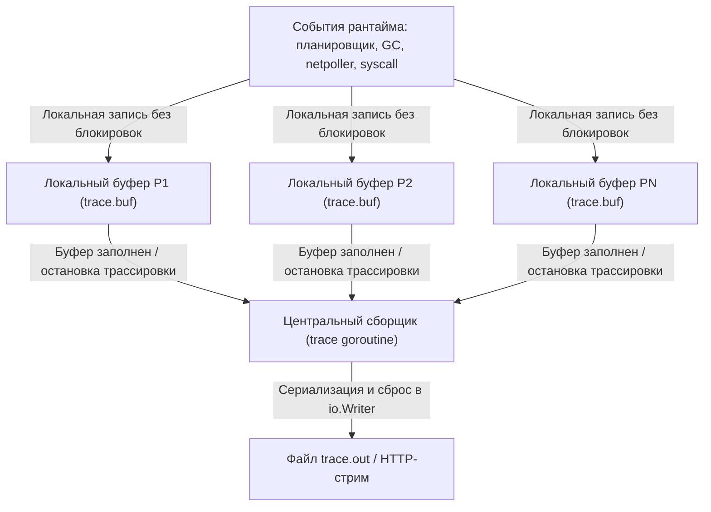
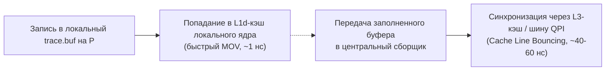

## Execution Tracer: событийная летопись рантайма

В предыдущей статье мы освоили веб-интерфейс **`go tool trace`** — высокоскоростной осциллограф для изучения динамики рантайма Go ([[2. trace tool]]). Но сам бинарный поток событий рождается значительно глубже: в самых раскаленных недрах рантайма, где каждый вызов `go func()`, каждая блокировка на канале, каждый системный вызов и каждая фаза сборки мусора протоколируются в наносекундную летопись.

Пакет **`runtime/trace`** и стоящий за ним низкоуровневый движок **execution tracer** (трассировщик исполнения) — это тот самый «черный ящик», который непрерывно фиксирует происходящее и формирует файл `trace.out`.

В отличие от `pprof`, который берет периодические случайные срезы состояния методом сэмплирования ([[1. pprof. Введение]]), execution tracer **записывает дискретные события во времени**. Он не усредняет и не теряет хронологию, что делает его единственным надежным инструментом для расследования недетерминированных плавающих сбоев: *«Почему горутина висела 25 мс, хотя ядра процессора были свободны, а сеть не отвечала?»*

Однако эта аналитическая мощь достается недешево: событийная трассировка нагружает процессор и подсистему памяти сильнее любого другого стандартного инструмента, а ее вывод требует досконального понимания внутренних структур Go. В этой статье мы препарируем архитектуру execution tracer: разберем взаимодействие с планировщиком G-M-P ([[1. Scheduler Go. G M P модель]]), сборщиком мусора ([[1. GC в Go. Обзор]]) и сетевым поллером ([[4. epoll kqueue и netpoller]]), изучим устройство кольцевых буферов на каждом `P` и поймем, как отличать реальные узкие места от шума самого трассировщика.

---

## Архитектура трассировщика: от события до protobuf

Execution tracer — это не отдельная фоновая горутина-наблюдатель, пытающаяся уследить за миллионами потоков. Подобная наивная архитектура мгновенно захлебнулась бы в межпоточных блокировках. Архитектура трассировщика построена на фундаментальном принципе Go: **минимизация блокировок за счет жесткой локальности данных**.

### Генерация событий на каждом P

Когда трассировка активирована, каждый логический процессор `P` (структура `runtime.p`) получает в монопольное владение **локальный кольцевой буфер** (`trace.buf`) размером около 32–64 КБ.

Все события, происходящие с горутинами, назначенными на данный `P`, записываются в его персональный буфер совершенно без блокировок мьютексами — запись осуществляется линейно с использованием быстрых локальных указателей и атомарных инструкций процессора.



Каждое микрособытие описывается кортежем:
- **Тип события:** битовый код операции (например, `EvGoCreate`, `EvGoStart`).
- **Временная метка:** монотонное время высокого разрешения, снимаемое ультрабыстрой функцией `runtime.nanotime()` (аппаратная обертка над системным вызовом `clock_gettime(CLOCK_MONOTONIC)` или инструкцией `RDTSC` / `vDSO`).
- **Идентификаторы контекста:** идентификатор горутины `goid`, потока ОС `M` и процессора `P`.
- **Стек вызовов:** программные счетчики `PC` для последующей символизации.

Локальный буфер `trace.buf` устроен предельно аскетично: непрерывный массив байт и указатели `head`/`tail`. Сериализация выполняется вручную прямыми побайтовыми операциями без участия рефлексии и без дополнительных динамических аллокаций.

---

### Центральный сборщик и сведение потоков

Когда локальный буфер `trace.buf` на конкретном `P` заполняется, процессор передает его в глобальную очередь и аллоцирует новый чистый буфер.

Специальная фоновая системная горутина-сборщик (trace goroutine) просыпается, забирает заполненные буферы от всех `P` и выполняет их потоковую сериализацию в выходной интерфейс `io.Writer`, переданный при старте в функцию `trace.Start(w io.Writer)`.

Формат выходного потока — компактный бинарный протокол (специализированный внутренний формат рантайма Go, концептуально близкий к protobuf/varint), где числовые идентификаторы и дельты временных меток сжимаются переменной длиной (LEB128). При вызове `trace.Stop()` все активные буферы `P` принудительно сбрасываются в `io.Writer`, гарантируя сохранность последних наносекунд работы перед закрытием файла.

---

## Типы событий и их связь с моделью G-M-P

Execution tracer — это прямой биограф модели G-M-P. Каждая смена статуса в жизненном цикле горутины ([[2. Goroutines под капотом]]) порождает строго типизированное событие:

| Событие | Момент генерации в рантайме | Что позволяет диагностировать |
|---|---|---|
| `EvGoCreate` | Создание новой горутины (`go func()`) | Всплески создания горутин, неконтролируемые утечки памяти |
| `EvGoStart` | Горутина перешла из `_Grunnable` в `_Grunning` на `P` | Задержки диспетчеризации планировщика, миграции между ядрами |
| `EvGoEnd` | Горутина успешно завершила выполнение | Преждевременное завершение воркеров, аномальный отток задач |
| `EvGoBlock` / `EvGoUnblock` | Переход в `_Gwaiting` на каналах, мьютексах, сети | Конфликты блокировок (contention), дедлоки, медленные внешние зависимости |
| `EvGoSyscall` / `EvGoSyscallEnd` | Поток `M` входит в блокирующий системный вызов ядра | Синхронный файловый ввод-вывод, подвисания в ядре Linux |
| `EvGoSched` | Добровольная уступка процессора (`runtime.Gosched`) | Эффективность кооперативной многозадачности в горячих циклах |
| `EvGoPreempt` | Принудительное асинхронное вытеснение сигналом `SIGURG` | Длинные монопольные CPU-участки кода, мешающие другим горутинам |
| `EvGCSweepBegin` | Старт фазы очистки спанов памяти (Sweeping) | Нагрузка на аллокатор страниц, фрагментация кучи |
| `EvGCMarkAssistStart` / `Done` | Горутина-мутатор мобилизована помогать GC | Чрезмерно высокий темп аллокаций, штрафующий бизнес-логику |
| `EvGCStart` | Старт фазы маркировки сборщика мусора | Частота циклов GC под нагрузкой |
| `EvUserTaskCreate` | Создание высокоуровневой логической задачи `trace.NewTask` | Сквозной трекинг обработки сквозного бизнес-запроса |
| `EvUserRegionBegin` | Вход в пользовательский интервал `trace.StartRegion` | Замеры длительности отдельных этапов (парсинг JSON, SQL-запрос) |

Каждое событие несёт идентификатор горутины (`goid`), P и M. Это позволяет `go tool trace` восстановить хронологию: на каком ядре работала горутина, куда мигрировала, из-за чего была вытеснена. Визуализация View trace ([[2. trace tool]]) строит из этих событий цветные полосы и стрелки причинно-следственных связей: кто породил горутину, кто ее разблокировал и на какое ядро она была украдена алгоритмом Work Stealing.

---

## Включение трассировки и её цена

Управление трассировщиком осуществляется программно через вызовы `trace.Start(w io.Writer)` и `trace.Stop()`. Встроенный в стандартную библиотеку HTTP-эндпоинт `/debug/pprof/trace?seconds=N` представляет собой тонкую сетевую обертку над этим низкоуровневым механизмом.

### Почему трассировка — самый тяжелый инструмент профилирования?

Накладные расходы включенного execution tracer могут достигать **10–30% CPU** и требовать десятков мегабайт оперативной памяти под буферизацию.

Причины столь внушительного оверхеда:
1. **Безусловная фиксация каждого шага:** В отличие от CPU-профилировщика, который опрашивает стек 100 раз в секунду и не зависит от интенсивности переключений, трассировщик обязан записать событие на **абсолютно каждую** операцию планировщика, каждый `select`, каждую отправку в канал и каждый системный вызов. На высоконагруженном сервере частота генерации событий легко превышает **2–5 миллионов событий в секунду**!
2. **Аллокации буферов памяти:** Процессоры `P` непрерывно заполняют буферы и запрашивают новые у аллокатора. Это порождает дополнительную работу для сборщика мусора, создавая паразитный фон.
3. **Конкуренция при сбросе:** Передача заполненных буферов от нескольких десятков `P` в центральную очередь сборщика требует синхронизации через мьютекс, порождая микроконфликты (contention) на многоядерных машинах.

> [!warning] Ловушка / Gotcha
> **Катастрофическое искажение latency и GC.** Запуск 30-секундной трассировки в боевом кластере под пиковой нагрузкой способен удвоить время отклика (p99 latency) и искусственно участить срабатывание сборщика мусора из-за миллионов аллокаций самого трассировщика. В результате вы будете профилировать не поведение вашего приложения, а накладные расходы самого инструмента наблюдения! Всегда ограничивайте съемку короткими окнами (3–10 секунд) и сверяйте результаты с внешними метриками Prometheus, собранными в штатном режиме без трейсера.

---

## Механика записи в критических секциях рантайма

Чтобы оценить инженерное изящество execution tracer, заглянем в исходный код ядра Go (`runtime`):

### Планировщик и горутины

Когда планировщик выбирает готовую горутину и вызывает функцию `execute(g, m, p)` в `src/runtime/proc.go`, первым делом проверяется флаг активности трассировки:

```go
// Псевдокод рантайма Go
if trace.enabled {
    traceGoStart(g)
}
```

Функция `traceGoStart(g)` считывает монотонный таймер `runtime.nanotime()`, формирует событие `EvGoStart` с идентификатором `g.goid` и атомарно сдвигает указатель в локальном буфере `p.trace.buf`. Аналогичные вызовы встроены в фундаментальные функции перехода состояний:
- `goexit()` генерирует `EvGoEnd`.
- `gopark()` генерирует `EvGoBlock` с указанием причины блокировки (канал, мьютекс, селектор).
- `goready()` генерирует `EvGoUnblock`, фиксируя точный момент, когда спящая горутина была пробуждена другой горутиной.

Принудительное вытеснение горутины по таймеру (асинхронная преемпция через сигнал `SIGURG`) генерирует событие `EvGoPreempt`. Это позволяет визуализатору отобразить, что горутина покинула процессор не по собственной воле, а была принудительно снята планировщиком из-за истечения 10-миллисекундного кванта времени.

---

### Сетевой поллер (Netpoller)

Подсистема неблокирующего ввода-вывода ([[4. epoll kqueue и netpoller]]) глубоко интегрирована с трассировщиком:
- Когда горутина пытается прочитать данные из незаполненного сокета, рантайм вызывает функцию `netpollblock()`, которая регистрирует событие `EvGoBlock` с типом ожидания `traceBlockNet`.
- Как только ядро ОС через `epoll_wait` / `kevent` сигнализирует о готовности дескриптора, фоновый поток поллера переводит горутину в очередь и записывает `EvGoUnblock`.

Именно эта связка позволяет отчету **Goroutine analysis** в `go tool trace` безупречно отделять время ожидания сокетов (`Network Wait`) от ожидания каналов и мьютексов (`Sync Block`).

---

### Сборщик мусора и Mark Assist

Критические секции сборщика мусора ([[4. Concurrent GC]]) инструментированы событиями `EvGCStart`, `EvGCSweepBegin` и `EvGCMarkAssistStart`.

Когда горутина-мутатор аллоцирует память быстрее, чем фоновый GC успевает сканировать граф объектов, GC Pacer принудительно переводит ее в режим **Mark Assist**: горутина откладывает бизнес-логику и тратит процессорные циклы на маркировку живых объектов. В трассировке эти эпизоды отмечаются парой `EvGCMarkAssistStart` / `EvGCMarkAssistDone`. Если вы видите высокую плотность этих событий, сервис страдает от тяжелого дефицита квот памяти.

---

## Пользовательские задачи и регионы (Tasks & Regions)

При анализе десятков тысяч однотипных горутин легко заблудиться в сырых системных вызовах. Пакет `runtime/trace` предоставляет средства высокоуровневой контекстной разметки:

```go
package main

import (
    "context"
    "runtime/trace"
)

func ProcessOrder(ctx context.Context, orderID string) {
    // 1. Создаем сквозную задачу Task с уникальным ID
    ctx, task := trace.NewTask(ctx, "handleOrder")
    defer task.End()

    // 2. Логируем текстовую аннотацию (видима в трейсе)
    trace.Log(ctx, "orderID", orderID)

    // 3. Выделяем именованный отрезок через StartRegion / End
    region := trace.StartRegion(ctx, "queryInventory")
    checkInventory(orderID)
    region.End()

    // 4. Или через идиоматичную функцию WithRegion
    trace.WithRegion(ctx, "processPayment", func() {
        chargeCreditCard(orderID)
    })
}
```

- **Task** (`trace.NewTask(ctx, "name")`) создаёт логическую единицу работы с уникальным идентификатором. Все последующие регионы, созданные с этим контекстом, будут привязаны к задаче. В интерфейсе `go tool trace` можно выбрать задачу и увидеть её временную шкалу.
- **Region** (`trace.StartRegion(ctx, "name")`) — именованный отрезок внутри задачи. На диаграмме он отображается как полоса, что позволяет измерить длительность бизнес-операции ("парсинг JSON", "запрос к БД") и сравнить её с системными событиями.

> [!tip] Собеседование
> **Вопрос:** Как вы будете расследовать ситуацию, когда ровно 1% клиентских запросов обрабатывается в 10 раз дольше остальных (проблема p99/p99.9), при этом средний CPU и память в норме?  
> **Ответ:**  
> 1. Размечу проблемный обработчик через `trace.NewTask` и `trace.StartRegion` вокруг ключевых этапов (вызовы СУБД, обращение к внешним API, сериализация).
> 2. Включу execution tracer на короткий промежуток времени (3–5 секунд) непосредственно под нагрузкой через `/debug/pprof/trace`.
> 3. В интерфейсе `go tool trace` открою раздел **User-defined tasks** и отфильтрую задачи по аномальной длительности.
> 4. В **Goroutine analysis** проверю, в каком состоянии находилась горутина во время лага: если это `Scheduler Wait` — горутина простаивала из-за нехватки свободных `P`; если `Sync Block` — боролась за мьютекс; если `Network Wait` — зависла в ожидании ответа медленной базы данных.
> 5. На общем таймлайне проверю, не совпал ли всплеск латентности с фазой Stop-The-World сборщика мусора.

---

## Сравнение с другими инструментами

| Инструмент | Что показывает | Аппаратный оверхед | Сценарий применения |
|---|---|:---:|---|
| **pprof CPU** | Агрегированное процессорное время по функциям | ~1–3% CPU | Поиск тяжелых вычислительных функций и горячих циклов |
| **pprof memory** | Распределение аллокаций и живых байт в куче | ~1–5% памяти | Поиск утечек памяти и источников мусора |
| **block / mutex profile** | Суммарные задержки на примитивах синхронизации | ~1–5% CPU | Локализация конкуренции (contention) за мьютексы и каналы |
| **execution tracer** | Посекундная хронология G-M-P, GC, сети и пауз | **10–30% CPU** | Задержки планировщика, всплески p99, миграция горутин, фазы STW |
| **strace** | Поток системных вызовов ядра ОС (Linux) | Высокий (до 10x) | Отладка взаимодействия с операционной системой и файловым дескрипторами |
| **perf sched** | Переключения контекста потоков на уровне ядра ОС | Низкий | Проблемы планирования потоков ядра Linux, CPU affinity |

Трассировщик комплементарен `pprof`, а не заменяет его: `pprof` отвечает на вопрос: *«Где программа жжет CPU?»*, а execution tracer: *«Почему программа ждала, когда CPU простаивал?»*

---

## Ловушки и ограничения

> [!warning] Ловушка / Gotcha
> **Переполнение буферов (`trace: buffer overflow`).** Если темп генерации микрособытий превышает пропускную способность записи в выходной поток `io.Writer` (например, при медленной записи на диск или сетевой сокет), промежуточные буферы переполняются, и рантайм начинает отбрасывать события. В выводе консоли появляется сообщение: `trace: buffer overflow`, а на диаграмме таймлайна возникают пустые разорванные интервалы. Решение: уменьшать длительность записи, либо стримить данные в память через предварительно аллоцированный `bytes.Buffer`.

> [!warning] Ловушка / Gotcha
> **Эффект наблюдателя (Observer Effect).** Из-за внушительного системного оверхеда трассировщик способен исказить картину: замедлить выполнение критических секций, спровоцировать внеочередные циклы GC и изменить естественный порядок планирования горутин. Никогда не принимайте архитектурных решений на основе единственного трейса — обязательно валидируйте гипотезы после отключения трассировки по бизнес-метрикам сервиса.

> [!warning] Ловушка / Gotcha
> **Неверная интерпретация высокого `Scheduler Wait`.** Высокое значение `Scheduler Wait` в отчете горутины не всегда означает глобальную перегрузку CPU. Если в таймлайне дорожки процессоров `P` окрашены в белый цвет (`Idle`), но горутины продолжают простаивать в ожидании запуска, проверьте использование `runtime.LockOSThread()`. Горутина, привязанная к конкретному системному потоку `M`, не может быть запущена на произвольном `P` и вынуждена ожидать освобождения именно своего привязанного потока.

---

## Mechanical Sympathy: взаимодействие трассировщика с «железом»

Архитектура буферизации execution tracer демонстрирует глубокое понимание законов современного компьютерного железа:



- **Локальность кэшей процессора:**  
  Пока процессор `P` пишет события в свой локальный буфер `trace.buf`, данные оседают в ультрабыстром кэше L1d текущего ядра процессора (доступ ~1 нс). Никакие другие ядра CPU не конкурируют за эти линии кэша.
- **Минимизация Cache Line Bouncing:**  
  Передача буфера центральному сборщику сопряжена с передачей владения линией кэша через общий L3-кэш (или межпроцессорную шину Intel UPI / AMD Infinity Fabric), что порождает Cache Line Bouncing ([[8. False sharing]]). Именно поэтому рантайм никогда не передает события поштучно: буферы сбрасываются только крупными блоками по мере заполнения (раз в 32–64 КБ).
- **Стоимость монотонного таймера:**  
  Каждое событие требует метки времени `runtime.nanotime()`. На современных архитектурах x86-64 и ARM64 это обращение к аппаратному регистру таймера (через vDSO без дорогостоящего переключения в кольцо ядра Ring 0). Однако при частоте в миллионы вызовов в секунду даже затраты в 10–20 тактов CPU на каждый замер начинают формировать заметную долю энергопотребления процессора.

---

## Революция Go 1.22+: Новый движок трассировки

Начиная с Go 1.22, архитектура execution tracer пережила фундаментальное перерождение:
- **Разделение на поколения (Generations):** Рантайм перешел на секционированные поколения событий. Больше нет необходимости останавливать мир (STW) для глобальной синхронизации состояния трейсера.
- **Потоковый анализ:** Новый формат трассировки поддерживает непрерывный потоковый парсинг без необходимости предварительной загрузки всего многогигабайтного файла в оперативную память браузера.
- **Flight Recorder:** Кардинальное снижение накладных расходов (до 1–2%) открыло дорогу встроенному «бортовому самописцу» (Flight Recorder) — режиму, когда рантайм непрерывно ведет кольцевую запись последних секунд работы в памяти, позволяя сбросить детальный след на диск только в момент аварии или фатальной ошибки!

---

## Итог

- **Execution tracer** (`runtime/trace`) — это внутренний механизм рантайма Go, протоколирующий каждое дискретное событие планировщика, сетевого поллера, сборщика мусора и системных вызовов в наносекундную летопись.
- Архитектура инструмента опирается на локальные кольцевые буферы процессоров `P` (`trace.buf`), что исключает глобальные блокировки при записи микрособытий.
- Трассировщик регистрирует полный спектр состояний G-M-P: рождение (`EvGoCreate`), запуск (`EvGoStart`), вытеснение (`EvGoPreempt`), блокировки (`EvGoBlock`/`EvGoUnblock`) и системные вызовы (`EvGoSyscall`).
- Механизм пользовательских задач и регионов (`trace.NewTask`, `trace.StartRegion`) связывает абстрактные системные события с конкретной бизнес-логикой приложения.
- Высокий оверхед (10–30% CPU в старых версиях, 1–2% в Go 1.22+) требует осмотрительности: съемка должна производиться короткими интервалами (3–10 секунд) непосредственно под нагрузкой.
- Execution tracer отвечает на вопрос: *«Почему горутина ждала?»*, вскрывая латентность, которую невозможно обнаружить стандартными профилировщиками `pprof`.

Теперь, овладев механикой непрерывной временной трассировки, мы переходим к мгновенным пространственным срезам состояния горутин — анализу дампов стеков в статье [[4. goroutine dump]].