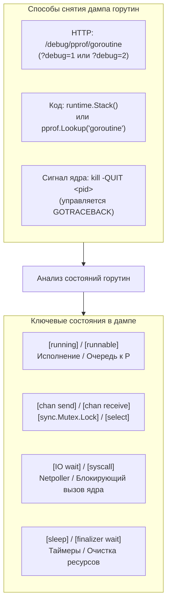

## Дамп горутин: мгновенный снимок конкурентного состояния приложения

Профилировщик CPU ([[2. CPU profiling в Go]]) скрупулезно подсчитывает, *в каких именно функциях* сгорели такты процессора. Трассировщик execution tracer ([[3. execution tracer]]) разворачивает перед глазами киноленту, показывая *когда* и *почему* происходили микропереключения контекста. Профиль памяти ([[5. pprof memory profile]]) отчитывается, *сколько байт* удерживается в спанах кучи.

Однако в реальной инженерной практике расследования инцидентов чаще всего требуется ответ на обескураживающе простой вопрос:  
**«Что именно делают все наши 40 000 горутин прямо сейчас, в эту секунду?»**

Представьте себе огромный логистический хаб: конвейеры остановились, сирены воют, новые посылки скапливаются у ворот, но электросчетчик показывает нулевое потребление энергии. Если в этот момент сделать мгновенную общую фотографию всего цеха, картина прояснится моментально: рабочий №1 зациклился в пустом складе (`[running]`), рабочие №2–№500 толпятся в узком дверном проеме перед запертым замком (`[sync.Mutex.Lock]`), а остальные 39 500 человек застыли у разгрузочных рамп в ожидании звонка диспетчера (`[IO wait]`).

Именно такую роль выполняет **дамп горутин (goroutine dump)** — мгновенный срез состояния всех горутин процесса с их полными стеками вызовов.



Этот инструмент абсолютно незаменим для расследования утечек горутин (goroutine leaks), выявления взаимных блокировок (deadlocks) и обнаружения паразитной конкуренции за общие ресурсы. В отличие от системного трассировщика `GODEBUG=schedtrace`, отображающего лишь сводные счетчики планировщика, дамп горутин вскрывает индивидуальные имена функций, пути к файлам и точные номера строк исходного кода.

---

## Способы получения дампа

### 1. HTTP-эндпоинт `pprof`

Самый распространенный способ в сетевых микросервисах — стандартный эндпоинт `/debug/pprof/goroutine`, регистрируемый пакетом `net/http/pprof`. Он поддерживает ключевой query-параметр `debug`:

- **`?debug=1`** — компактный текстовый отчет: одинаковые стеки вызовов агрегируются и схлопываются, показывая количество горутин с данным стеком и их текущий статус. Идеально подходит для быстрого беглого аудита в консоли.
- **`?debug=2`** — полный, неагрегированный стек-трейс **абсолютно каждой** горутины в отдельности (аналогичен аварийному дампу при необработанной панике, но снимается абсолютно безопасно, на лету, без падения приложения).

```bash
# Краткий агрегированный отчёт по группам горутин
curl http://localhost:6060/debug/pprof/goroutine?debug=1

# Полный исчерпывающий дамп всех стеков вызовов
curl http://localhost:6060/debug/pprof/goroutine?debug=2
```

### 2. Программный вызов `pprof` и `runtime.Stack`

В CLI-утилитах, тестах или background-демонах без HTTP-сервера дамп снимается непосредственно из кода приложения:

```go
package main

import (
    "os"
    "runtime/pprof"
)

func dumpGoroutinesToFile(filename string) error {
    f, err := os.Create(filename)
    if err != nil {
        return err
    }
    defer f.Close()

    // Запись дампа в формате debug=1 (агрегированный)
    // Передача 2 сформирует полный дамп аналогично debug=2
    return pprof.Lookup("goroutine").WriteTo(f, 1)
}
```

Для низкоуровневого получения среза сырых байт используется функция `runtime.Stack(buf []byte, all bool)`: при передаче `all = true` рантайм форматирует стеки всех существующих горутин в предоставленный слайс памяти `buf`.

### 3. Сигнал `SIGQUIT` и переменная `GOTRACEBACK`

Если сервис завис настолько глубоко, что сетевой порт `pprof` не отвечает, на помощь приходит операционная система:

```bash
# Отправка сигнала SIGQUIT процессу Go
kill -QUIT <pid>
```

По умолчанию ядро Go при получении сигнала `SIGQUIT` аварийно сбрасывает подробнейший дамп горутин прямо в стандартный поток ошибок `stderr` и завершает процесс (создавая core dump, если разрешено лимитами ядра).

Поведением форматирования управляет переменная окружения **`GOTRACEBACK`**:
- `none` — полностью отключает вывод стеков (крайне не рекомендуется в продакшене).
- `single` — печатает стек только текущей аварийной горутины.
- `all` — печатает дампы всех пользовательских горутин приложения.
- `system` — выводит дампы вообще всех горутин, включая скрытые системные горутины рантайма (фоновый сборщик мусора, таймеры, netpoller, скрапер памяти).

> [!warning] Ловушка / Gotcha
> **Гигантский размер текстового вывода `debug=2`.** Стек каждой горутины в выводе `debug=2` занимает от 500 байт до нескольких килобайт форматированного текста. Если в микросервисе из-за утечки скопилось 100 000 горутин, вызов `curl` сгенерирует текстовый файл размером более 100 МБ! Попытка распарсить такую простыню вручную в текстовом редакторе неизбежно приведет к зависанию терминала. Всегда начинайте с компактного `debug=1` или используйте бинарный профиль через `go tool pprof`.

---

## Профиль горутин в `go tool pprof`

Если запросить эндпоинт `/debug/pprof/goroutine` **без параметра `debug`**, сервер вернет сжатый бинарный файл формата Protocol Buffers:

```bash
# Скачиваем бинарный профиль распределения горутин
curl -o goroutine.prof http://localhost:6060/debug/pprof/goroutine

# Открываем интерактивный анализатор
go tool pprof goroutine.prof
```

Этот профиль агрегирует данные: он показывает, **в каких конкретно функциях** и на каких строках кода припаркованы горутины. Стандартные команды `top`, `list`, `tree` и визуализация `web` (SVG граф) работают точно так же, как при анализе CPU:

```
(pprof) top
Showing nodes accounting for 1024 goroutines, 90% of 1138 total
      flat  flat%   sum%        cum   cum%
       500 43.94% 43.94%        500 43.94%  runtime.gopark (chan receive)
       200 17.57% 61.51%        200 17.57%  runtime.gopark (IO wait)
       150 13.18% 74.69%        150 13.18%  runtime.gopark (select)
        80  7.03% 81.72%         80  7.03%  sync.(*Mutex).Lock
```

Столбец `flat` здесь показывает абсолютное количество горутин, заблокированных непосредственно на данной операции. Это дает мгновенную количественную оценку: сколько горутин ждут каналы, сколько — сокеты, а сколько — мьютексы.

---

## Состояния горутин в дампе и их интерпретация

Внутри рантайма каждая горутина управляется конечным автоматом состояний ([[2. Goroutines под капотом]]): `_Gidle`, `_Grunnable`, `_Grunning`, `_Gwaiting`, `_Gdead`.

В текстовом выводе `debug=2` рантайм заботливо транслирует внутренний статус в человекочитаемую метку в квадратных скобках:

```
goroutine 123 [chan receive]:
main.consumer(0xc0000a4000)
    /app/main.go:45 +0x79
created by main.main
    /app/main.go:20 +0x42
```

### Справочник состояний горутин

| Метка состояния | Физический смысл в рантайме | Инженерная интерпретация |
|---|---|---|
| `[running]` | Горутина активно молотит инструкции на процессоре `M` | Норма для работающих воркеров. Если одна и та же горутина стабильно остается в `[running]` во всех повторных дампах — она попала в бесконечный вычислительный цикл. |
| `[runnable]` | Готова к исполнению, но ждет освобождения процессора `P` | Явный признак процессорного голодания (CPU starvation): планировщик перегружен, готовых задач больше, чем `GOMAXPROCS`. |
| `[chan receive]` | Заблокирована в ожидании чтения из канала (`<-ch`) | Горутина-потребитель ждет данные. Если отправитель уже завершился или забыл послать сигнал — горутина утекла навсегда. |
| `[chan send]` | Заблокирована в ожидании отправки в канал (`ch <- val`) | Буфер канала заполнен, а читатель отсутствует. Самая частая причина утечек горутин при ошибках таймаута контекста. |
| `[IO wait]` | Запаркоpoolена в сетевом поллере `netpoller` | Ожидает готовности сокета (`epoll`/`kqueue`). Нормальное базовое состояние для соединений в ожидании сетевых пакетов. |
| `[select]` | Заблокирована внутри мультиплексора `select` | Ожидает готовности любого из перечисленных каналов или срабатывания таймаута. |
| `[sync.Mutex.Lock]` | Заблокирована при попытке захвата мьютекса | Конфликт за критическую секцию (contention). По стеку вызовов можно легко локализовать защищаемый мьютекс. |
| `[sleep]` | Приостановлена вызовом `time.Sleep` или таймером | Горутина спит. Нормально для фоновых тикеров, но тревожно при забытых искусственных задержках. |
| `[syscall]` | Поток `M` выполняет блокирующий системный вызов ядра | Синхронное чтение файла с диска, `futex` или обращение к C-библиотеке через cgo, удерживающее системный поток ОС. |
| `[finalizer wait]` | Ожидает запуска финализатора сборщиком мусора | Редкое системное состояние, свидетельствующее о перегрузке очереди финализаторов GC. |

### Правила экспресс-диагностики:
- **Лавина горутин в `[chan send]`:** Классический баг: HTTP-хэндлер запускает горутину для фоновой задачи и читает из канала с таймаутом `select { case res := <-ch: ... case <-ctx.Done(): ... }`. При таймауте хэндлер уходит, а фоновая горутина навсегда зависает на попытке положить результат в небуферизованный канал `ch <- res`.
- **Рост числа горутин в `[chan receive]`:** Продюсеры не успевают поставлять данные, либо забыли закрыть канал `close(ch)` при выходе.
- **Масса горутин в `[runnable]` при низкой загрузке CPU:** Потоки ОС застряли в блокирующих системных вызовах `[syscall]`, лишая планировщик свободных ядер.

> [!tip] Собеседование
> **Вопрос:** Чем принципиально отличается состояние горутины `[IO wait]` от состояния `[syscall]` с точки зрения ресурсов операционной системы?  
> **Ответ:**  
> - В состоянии **`[IO wait]`** горутина запаркована в системном селекторе `netpoller` (Linux `epoll` / macOS `kqueue`). Она **не удерживает системный поток ОС (`M`)**! Поток освобождается и продолжает обслуживать другие горутины. Один поток ядра может держать десятки тысяч горутин в `[IO wait]`.  
> - В состоянии **`[syscall]`** горутина выполняет синхронный системный вызов ядра ОС (например, дисковый `read()` файла). Поток ОС `M` **намертво замораживается ядром** в режиме сна до завершения ввода-вывода. Планировщик Go вынужден отвязать процессор `P` от этого `M` и, возможно, породить новый поток ОС.

---

## Типичные сценарии использования дампа горутин

### 1. Обнаружение и локализация утечки горутин

Симптом: метрика Prometheus `go_goroutines` демонстрирует монотонную «лесенку» вверх. Снимаем два бинарных профиля с интервалом в 5 минут и выполняем дифференциальное сравнение:

```bash
# Снимок 1
curl http://localhost:6060/debug/pprof/goroutine > dump1.prof
sleep 300
# Снимок 2
curl http://localhost:6060/debug/pprof/goroutine > dump2.prof

# Дифференциальный анализ через pprof
go tool pprof -diff_base=dump1.prof dump2.prof
```

Команда покажет чистый дельту-прирост: функции, где число горутин увеличилось. Стеки немедленно укажут на незакрытый канал или забытую отмену контекста (`defer cancel()`).

### 2. Расследование взаимных блокировок (Deadlock)

Если все горутины находятся в состояниях `[chan send]`, `[chan receive]` или `[sync.Mutex.Lock]`, и ни одной нет в `[running]`, система находится в состоянии мертвого затора.  
Дамп с `debug=2` выдаст точные номера строк в коде, позволяя восстановить цепочку: горутина A ждет канал X, который должна отправить горутина B, а горутина B заблокирована на мьютексе Y, удерживаемом горутиной A.

### 3. Оценка адекватности параллелизма

Если дамп показывает 5 000 горутин в статусе `[runnable]` при `GOMAXPROCS=8`, сервис испытывает катастрофический недостаток вычислительных мощностей. Если же подавляющее большинство горутин замерло в `[IO wait]`, процессор простаивает — бутылочное горлышко находится во внешних СУБД или микросервисах.

### 4. Проверка корректности shutdown

При завершении работы сервиса (grace period) все рабочие горутины обязаны штатно завершиться. Снятие дампа через 10 секунд после сигнала `SIGTERM` покажет, кто именно блокирует остановку процесса.

---

## Автоматизация и мониторинг профилей

Профиль горутин легко интегрируется в CI/CD и скрипты автоматической диагностики:

```bash
# Текстовый дамп верхнеуровневых точек ожидания
go tool pprof -top -text goroutine.prof
```

Утилиты вроде `github.com/uber-go/gops` умеют динамически подключаться к работающему Go-процессу по PID и извлекать статус горутин без открытия внешних сетевых портов.

---

## Mechanical Sympathy: память, планировщик и дамп горутин

Глубокое понимание цены горутины на уровне аппаратных ресурсов защищает сервис от аварий:


1. **Память стеков и структуры `g`:**  
   Минимальный размер стека горутины при рождении составляет **2 КБ**, а структура дескриптора `runtime.g` занимает около 400 байт в оперативной памяти. Однако по мере выполнения стек может автоматически расширяться вплоть до 1 ГБ (на 64-битных системах). Таким образом, 100 000 утекших горутин съедают как минимум **250 МБ** чистой оперативной памяти, а при глубоких стеках вызовов легко приводят к срабатыванию Linux OOM Killer.
2. **Нагрузка на планировщик при массовом пробуждении (Thundering Herd):**  
   Даже если спящая горутина в статусе `[chan receive]` потребляет нулевой процент CPU, она зарегистрирована в очереди ожидания `sudog`. Если канал внезапно закрывается через `close(ch)`, рантайм Go вынужден в цикле вызвать `goready()` для всех тысяч подписчиков. Это порождает колоссальный всплеск нагрузки на глобальную очередь планировщика `sched.runq`, выбивая процессоры `P` из привычного ритма.
3. **Безопасность снятия дампа:**  
   Снятие дампа горутин через `pprof` — исключительно легковесная процедура. Рантайм не замораживает весь мир (нет длительного Stop-The-World): сборщик обходит связный список горутин `allgs`, быстро копируя текущие программные счетчики и указатели стека за несколько миллисекунд.

---

## Связь с другими инструментами

- **Execution tracer** ([[3. execution tracer]]) воспроизводит непрерывную динамику во времени, а дамп — фиксирует мгновенный статический срез. В тандеме они дают абсолютную полноту картины.
- **Block profile** ([[5. block profile]]) концентрируется на суммарной длительности блокировок, тогда как дамп показывает, где горутины застряли прямо в эту наносекунду.
- Функция `runtime.NumGoroutine()` дает только абстрактную количественную цифру, а дамп горутин раскрывает их качественный состав.

---

## Итог

- **Дамп горутин** — это фундаментальный мгновенный срез состояния всех горутин приложения, доступный через HTTP-эндпоинт `/debug/pprof/goroutine`, вызов `runtime.Stack` или сигнал операционной системы `SIGQUIT`.
- Параметр `debug=1` предоставляет лаконичный агрегированный отчет по группам горутин, а `debug=2` — детальный листинг каждого стека с номерами строк исходного кода.
- Бинарный профиль горутин в `go tool pprof` позволяет строить наглядные графы и ранжировать точки блокировки по объему застрявших воркеров.
- Основные состояния: `running`, `runnable`, `chan receive/send`, `IO wait`, `syscall`, `sync.Mutex.Lock`, `sleep`. Интерпретация состояний — ключ к диагностике утечек, дедлоков и перегрузок.
- Дифференциальный анализ дампов (`pprof -diff_base`) — эталонный метод расследования утечек горутин в продакшене.

Освоив анализ статических срезов горутин, мы переходим к изучению профилирования суммарного времени блокировок в следующей статье: [[5. block profile]].