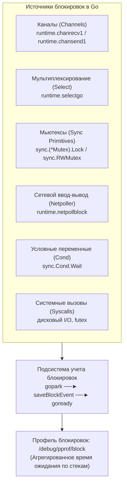
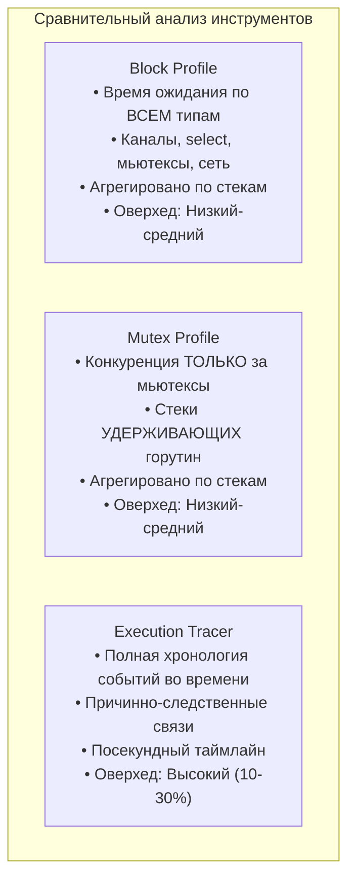

## Block Profile: измерение невидимых ожиданий

Стандартный профилировщик CPU ([[2. CPU profiling в Go]]) подробно рапортует, на какие именно участки кода процессор тратит драгоценные такты. Трассировщик execution tracer ([[3. execution tracer]]) разворачивает перед глазами полную временную ленту микрособытий. Дамп горутин ([[4. goroutine dump]]) дает мгновенную моментальную фотографию статусов.

Но ни один из этих инструментов не способен дать прямой и компактный ответ на фундаментальный вопрос высоконагруженного бэкенда:  
**«Сколько совокупного времени наши горутины теряют в пустом ожидании каналов, мьютексов и сетевых сокетов, и какие строки кода виновны в этих простоях?»**

Ответ дает **block profile (профиль блокировок)** — специализированный инструмент рантайма Go, измеряющий совокупную задержку нахождения горутин в заблокированном состоянии.



В отличие от CPU-профилирования, которое периодически сэмплирует работающие горутины с фиксированной частотой (100 Гц), block profile регистрирует **дискретные события парковки горутин**. Он фиксирует не только *место* в коде, где выполнение затормозилось, но и точную *длительность* задержки.

Senior-инженер опирается на block profile при поиске узких мест конкурентности, принципиально невидимых по графикам утилизации CPU: застрявших воркеров, разбалансированных конвейеров, блокировок небуферизованных каналов и долгого ожидания сетевых ответов.

---

## Что измеряет block profile

Block profile регистрирует события, когда исполняющаяся горутина добровольно или вынужденно уступает процессор и переходит в состояние ожидания `_Gwaiting` ([[2. Goroutines под капотом]]) через вызов внутренней функции рантайма `gopark`:

1. **Каналы (Channels):**
   - `chan receive` (в профиле отображается как `runtime.chanrecv1`) — горутина заблокирована на попытке чтения из пустого канала.
   - `chan send` (в профиле отображается как `runtime.chansend1`) — горутина ожидает освобождения буфера канала или появления читателя в небуферизованном канале.
2. **Оператор Select:**
   - Ожидание готовности хотя бы одной ветви в операторе `select` (функция `runtime.selectgo`).
3. **Примитивы синхронизации (`sync`):**
   - Захват взаимоисключающей блокировки `sync.Mutex.Lock` (в выводе pprof: `sync.(*Mutex).Lock`).
   - Захват разделяемой или эксклюзивной блокировки `sync.RWMutex.Lock/RUnlock`.
   - Ожидание сигнала на условной переменной `sync.Cond.Wait` (в профиле отображается как `Cond`).
4. **Сетевой поллер:**
   - Ожидание сетевого сокета через системный дескриптор в функции `runtime.netpollblock` ([[4. epoll kqueue и netpoller]]).
5. **Системные вызовы ядра:**
   - Блокирующие системные вызовы операционной системы (файловый ввод-вывод, `futex`).

Для каждого события рантайм сохраняет:
- Полный стек вызовов горутины, приведший к блокировке.
- Точную физическую длительность простоя (разница времени между вызовами `gopark` и пробуждающим `goready`).

> [!NOTE]
> **Принципиальное отличие от mutex profile:** Block profile измеряет **общее время пассивного ожидания** горутины, независимо от того, кто именно стал причиной затора. Профиль мьютексов ([[6. mutex profile]]) фокусируется исключительно на конкуренции (contention) за мьютексы и показывает стеки тех горутин, которые *удерживали* ресурс, мешая остальным.

---

## Как включить и настроить block profile

По умолчанию сбор block profile в Go **полностью отключен**, так как замеры времени на каждом переключении горутин создают дополнительную нагрузку на системные таймеры.

Для активации профиля необходимо сконфигурировать частоту сэмплирования через функцию `runtime.SetBlockProfileRate(rate int)`.

### Установка rate

Параметр `rate` — это делитель: записывается каждое N-е событие блокировки. `rate=1` означает «записывать всё», что даёт полную картину, но создаёт значительный overhead (особенно на каналах и сети). `rate=1000` означает «записывать каждое 1000-е событие», снижая overhead до пренебрежимого, но уменьшая точность.

Рекомендации:
- **Локальная отладка:** `rate=1`.
- **Production:** `rate=10000` для долгосрочного мониторинга, либо включать `rate=1` точечно на время диагностики.

### Способы включения

1. **Через HTTP pprof:**  
   Импорт `_ "net/http/pprof"` и установка `runtime.SetBlockProfileRate(1)` в `init()` или `main`.
   ```go
   import (
       _ "net/http/pprof"
       "runtime"
   )

   func init() {
       // Включаем запись всех блокировок для локального профилирования
       runtime.SetBlockProfileRate(1)
   }
   ```
2. **В тестах и бенчмарках:**  
   Стандартный флаг команды `go test` автоматически включает сбор блокировок с `rate=1` на время прогона:
   ```bash
   go test -blockprofile=block.out -bench=.
   ```
3. **Программно:**
   ```go
   runtime.SetBlockProfileRate(1)
   defer runtime.SetBlockProfileRate(0) // Отключить сбор
   ```

> [!warning] Ловушка / Gotcha
> `SetBlockProfileRate` не накапливает статистику задним числом. Она начинает запись с момента вызова. Если установить её после того, как программа уже отработала значительную часть, профиль будет неполным.

---

## Сбор и анализ профиля

### Сбор файла

Через HTTP:

```bash
# Выгрузка бинарного профиля блокировок за последние секунды
curl -o block.prof "http://localhost:6060/debug/pprof/block"
```

Или из результатов бенчмарка:

```bash
go test -blockprofile=block.out -bench=.
```

### 2. Анализ через `go tool pprof`

Анализ осуществляется стандартной консольной утилитой:

```bash
go tool pprof block.prof
```

В интерактивной оболочке доступны привычные команды навигации:
- **`top`** — список функций с максимальным суммарным временем блокировки. Значения выражаются в секундах или наносекундах.
- **`list FuncName`** — детальный построчный листинг исходного кода целевой функции с привязкой потерянного времени к конкретным строкам.
- **`web`** или флаг запуска `-http=:8080` — генерация интерактивного графа вызовов или flamegraph в браузере.

Пример вывода команды `top`:

```
(pprof) top
Showing nodes accounting for 5.50s, 85% of 6.47s total
      flat  flat%   sum%        cum   cum%
     2.00s 30.92% 30.92%      2.00s 30.92%  runtime.chanrecv1
     1.50s 23.19% 54.11%      1.50s 23.19%  runtime.chansend1
     1.00s 15.46% 69.57%      1.00s 15.46%  runtime.selectgo
     0.80s 12.36% 81.93%      0.80s 12.36%  runtime.netpollblock
     0.20s  3.09% 85.02%      0.20s  3.09%  sync.(*Mutex).Lock
```

Интерпретация отчета:
- **2.00s** — суммарно горутины провели 2 секунды в состоянии сна при чтении из канала (`chanrecv1`).
- **1.50s** — горутины ожидали возможности записать данные в заполненные каналы (`chansend1`).
- **1.00s** — время простоя в конструкции `selectgo`.
- **0.80s** — паузы в ожидании готовности сокетов в сетевом поллере (`netpollblock`).
- **0.20s** — прямое ожидание захвата мьютекса (`sync.(*Mutex).Lock`).

Команда `list FuncName` мгновенно локализует виновника:

```go
func consumer(ch chan int) {
    for {
        val := <-ch   // здесь блокируется (chanrecv1)
    }
}
```

> [!info] Под капотом
> Внутри ядра `runtime` каждое событие блокировки обслуживается функцией `gopark`. Перед засыпанием вызывается функция `traceBlockReason` и, если block profile активен, функция `saveBlockEvent`. Она считывает стек текущей горутины и фиксирует стартовую отметку времени. Когда другая горутина вызывает `goready`, рантайм вычисляет дельту времени. Если `rate > 1`, срабатывает алгоритм сэмплирования: внутренний счетчик событий инкрементируется, и запись в профиль производится только при выполнении условия `count % rate == 0`. Это предотвращает постоянные аллокации памяти в горячих путях.

---

## Интерпретация результатов: типовые паттерны проблем

### 1. Высокое время в `chanrecv1` или `chansend1`

- Если лидирует **`runtime.chanrecv1`** с огромным кумулятивным временем: потребители простаивают в ожидании задач. В фоновых воркерах это нормально, однако если под нагрузкой горутины долго ждут данные, значит продюсеры не справляются с генерацией входного потока (bottleneck на входе конвейера).
- Если в топе **`runtime.chansend1`**: каналы переполнены. Потребители не успевают разгребать очередь, либо используется небуферизованный канал там, где требуется сглаживание микропакетов.

### 2. Доминирование `runtime.selectgo`

Горутины зависли в ожиданиях нескольких каналов одновременно. Типичный антипаттерн: горутина слушает рабочий канал и `ctx.Done()`, однако контекст никогда не отменяется, а отправитель перестал посылать сообщения из-за ошибки в логике.

### 3. Задержки в `runtime.netpollblock`

Большие тайминги ожидания сети типичны для idle-соединений. Однако если `netpollblock` накапливает сотни секунд на активных RPC-хэндлерах, а внешние вызовы не ограничены таймаутами контекста (`context.WithTimeout`), сервис накапливает утекшие горутины на зависших сокетах.

### 4. Время в `sync.(*Mutex).Lock`

Отражает чистое время ожидания в очереди за мьютексом. Если мьютекс держится долго (например, внутри критической секции выполняется чтение с диска или сериализация JSON), block profile покажет точку страдания, а точную причину раскроет mutex profile ([[6. mutex profile]]).

### 5. Каскадные блокировки

Если горутина A ждет канал от горутины B, а горутина B застряла на мьютексе, block profile отобразит оба простоя. В сложных цепочках зависимостей для выявления первопричины рекомендуется переходить к execution tracer ([[3. execution tracer]]).

---

## Практический кейс: поиск утечки горутин через block profile

**Симптоматика:** Под нагрузкой в 1000 RPS память сервиса медленно утекает, а p99 задержка деградирует.

**Шаги диагностики:**

1. **Дамп горутин:** Снятие дампа ([[4. goroutine dump]]) показывает 8 000 горутин в состоянии `[chan receive]` на функции `processBatch`.
2. **Включение профилировщика:** Активируем сбор:
   ```go
   runtime.SetBlockProfileRate(1)
   ```
3. **Сбор профиля:** Через 30 секунд скачиваем дамп:
   ```bash
   curl -o block.prof http://localhost:6060/debug/pprof/block
   ```
4. **Анализ стека:** Команда `top` выводит `runtime.chanrecv1` с огромным суммарным временем. Вызов `list processBatch` указывает строго на строку:
   ```go
   result := <-ch
   ```
5. **Анализ кода:** Канал `ch` создается динамически на каждый запрос. Воркер должен отправить туда результат. Но при срабатывании таймаута клиентского запроса вызывающая функция досрочно завершается, а фоновый воркер навсегда зависает на попытке записи в канал!
6. **Исправление:** Замена на буферизованный канал `make(chan Result, 1)` или добавление проверки `select` с `ctx.Done()` в коде воркера полностью устраняет утечку.

---

## Механика записи и системный overhead

При `rate = 1` рантайм Go выполняет полноценный сбор стека для **каждого** события блокировки:
- Вызов внутренней функции `runtime.Stack` (проход по фреймам стека занимает около 1 микросекунды на глубоких стеках).
- Поиск и обновление счетчиков в глобальной хэш-таблице профиля (синхронизируется внутренней блокировкой).

Если в программе происходит миллион блокировок в секунду (например, плотные циклы с небуферизованными каналами), накладные расходы могут составить от 5% до 10% CPU.  
При `rate > 1` накладные расходы снижаются экспоненциально. Значение `rate = 10000` практически незаметно для продакшена и идеально подходит для непрерывного мониторинга.

---

## Сравнение: Block Profile vs Mutex Profile vs Execution Tracer



| Инструмент | Что измеряет | Гранулярность данных | Системный оверхед |
|---|---|---|:---:|
| **Block profile** | Суммарное время ожидания (каналы, мьютексы, сеть, syscall) | Агрегировано по стекам вызовов | Низкий / Средний |
| **Mutex profile** | Contention на мьютексах, стеки удерживающих горутин | Агрегировано по стекам вызовов | Низкий / Средний |
| **Execution tracer** | Полная хронология событий, причинно-следственные связи | Посекундно, по каждому событию | Высокий (10–30%) |

Block profile представляет собой золотую середину: он выявляет конкретные строки кода, крадущие время запросов, без необходимости развертывания тяжелого execution tracer.

---

## Mechanical Sympathy: как процессор переживает блокировку

С точки зрения кремниевого кристалла и операционной системы, переход горутины в состояние ожидания — это сложная цепочка аппаратных событий:

1. **Сброс регистров:** Вызов `gopark` сохраняет текущий набор регистров CPU в дескриптор `g.sched` и переключает стек на системный стек `g0`.
2. **Переключение контекста:** Планировщик отвязывает текущую горутину `G` от логического процессора `P` и передает конвейер другой готовой задаче ([[4. Контекстные переключения]]).
3. **Вымывание L1/L2 кэша:** Пока горутина спит, исполнение чужого кода вытесняет ее горячие рабочие данные из процессорного кэша L1d/L2 в оперативную память.
4. **Холодный старт при пробуждении:** Когда горутина разблокируется функцией `goready()`, она встает в очередь runnable. К моменту получения кванта времени ее кэши абсолютно холодны: первые сотни инструкций будут сопровождаться чередой тяжелых Cache Miss (штраф ~50–100 нс на каждое обращение к RAM).

Именно поэтому время блокировки в block profile — это не просто «пассивное ожидание», а прямой индикатор скрытых накладных расходов на вымывание кэшей и переключения контекста.

---

## Собеседование: типичные вопросы

> [!tip] Собеседование
> **Вопрос:** В чем заключается фундаментальное отличие между `block profile` и `mutex profile` в Go?  
> **Ответ:**  
> - **Block profile** измеряет **время ожидания** горутин на любых примитивах синхронизации (каналы, мьютексы, сетевой поллер, системные вызовы) и фиксирует стек **ожидающей** горутины.
> - **Mutex profile** фокусируется исключительно на конкуренции за блокировки (`sync.Mutex` и `sync.RWMutex`) и регистрирует стек горутины, которая **удерживала** мьютекс, пока другие ожидали его освобождения.

> [!tip] Собеседование
> **Вопрос:** Что произойдет, если установить `runtime.SetBlockProfileRate(1)` в сервисе с 50 000 RPS под высокой конкуренцией за каналы?  
> **Ответ:** На каждое блокирующее чтение или запись в канал рантайм начнет выполнять обход стека вызовов (`runtime.Stack`) и захватывать внутреннюю блокировку таблицы профилировщика. Это приведет к лавинообразному росту накладных расходов процессора (до 10–20% CPU) и исказит реальные задержки приложения. В высоконагруженном проде следует использовать сэмплирование (`rate = 10000`) или кратковременное профилирование.

---

## Итог

- **Block profile** — мощный специализированный инструмент для измерения суммарного времени ожидания горутин на каналах, мьютексах, сетевом поллере и системных вызовах.
- Включается через `runtime.SetBlockProfileRate(rate)`: при `rate = 1` собираются 100% событий, при `rate > 1` включается сэмплирование.
- Анализируется через `go tool pprof` с помощью команд `top`, `list` и интерактивных веб-графов `web`.
- Незаменим для поиска скрытых бутылочных горлышек конкурентности, перекосов в параллельных конвейерах и утечек горутин.
- С точки зрения Mechanical Sympathy, устранение блокировок стабилизирует кэши L1/L2 процессора и снижает издержки переключения контекста.

Изучив измерение времени пассивных ожиданий, мы переходим к профилю, выявляющему истинных виновников конфликтов синхронизации: [[6. mutex profile]].