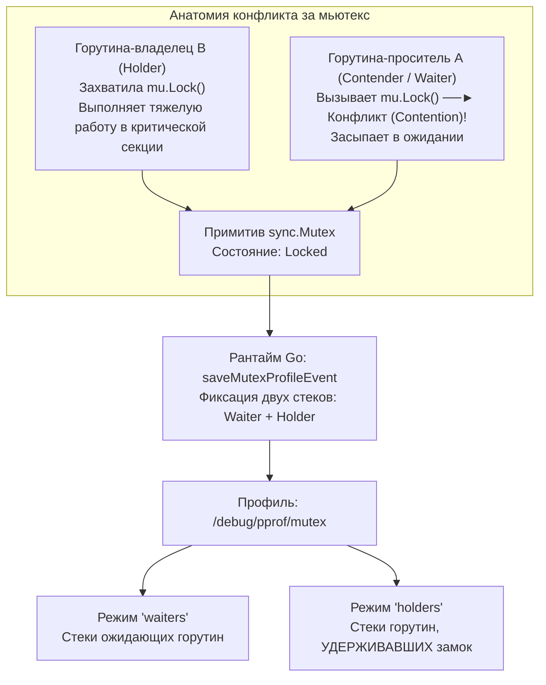
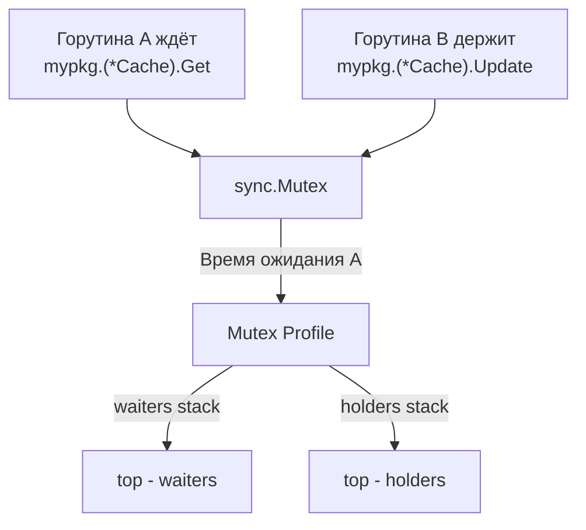
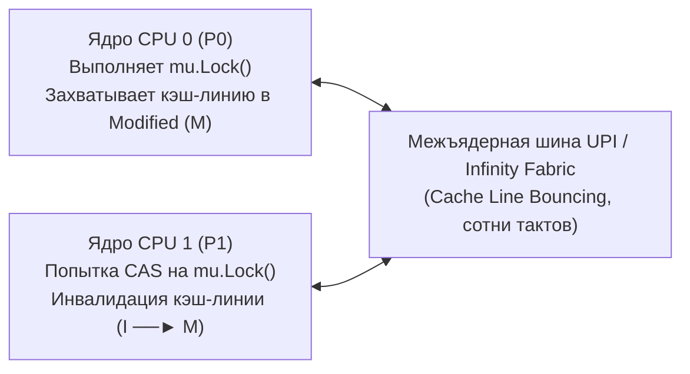

## Mutex Profile: кто держит блокировку и сколько мы ждём

В предыдущей статье мы освоили **block profile** ([[5. block profile]]) — инструмент для измерения суммарного времени, которое горутины проводят в томительном ожидании каналов, сокетов и мьютексов. Block profile превосходно отвечает на вопрос: *«Сколько совокупного времени потеряно?»*, однако в отношении мьютексов он хранит упорное молчание о главном: **«А кто именно стал виновником задержки, кто держал замок и не отпускал его?»**

Представьте дорожный затор на узком мосту: block profile замерит общую длину хвоста из стоящих автомобилей и время их простоя. Но он не расскажет, почему мост перекрыт: сломался ли впереди тяжелый негабаритный грузовик, или дорожные рабочие забыли убрать предупреждающий знак.

Ответ на этот вопрос дает **mutex profile** — специализированный инструмент рантайма Go для профилирования межпоточных конфликтов (**contention**).



Mutex profile регистрирует не просто факт обращения к мьютексу, а именно **события конкуренции**: моменты, когда горутина пытается захватить `sync.Mutex` или `sync.RWMutex`, но обнаруживает, что ресурс уже монополизирован другой горутиной. Для каждого такого инцидента рантайм сохраняет **два независимых стека вызовов**:
1. Стек горутины-просителя (**waiter/contender**), которой пришлось ждать.
2. Стек горутины-владельца (**holder**), которая удерживала мьютекс в момент возникновения конфликта.

Это превращает mutex profile в непревзойденное оружие для выявления «горячих» блокировок и архитектурных дефектов многопоточности, разрушающих горизонтальную масштабируемость бэкенда.

---

## Что измеряет mutex profile

### Contention, а не просто ожидание

Различие между block profile и mutex profile носит фундаментальный характер:
- Block profile срабатывает при **любой парковке** горутины в планировщике (включая ожидание сетевого сокета, таймеров или каналов).
- Mutex profile активируется **исключительно в момент конфликта (contention)** на мьютексах: когда вызывается медленный путь (slow path) функции `Lock()`, и горутина вынуждена уснуть в ожидании семафора.

Таким образом, mutex profile дает точные ответы на три ключевых инженерных вопроса:
1. На каких именно объектах `sync.Mutex` в приложении возникает максимальное число коллизий?
2. Сколько суммарного процессорного времени и астрономической задержки горутины потеряли в очередях за каждым конкретным замком?
3. Какой именно код и какая функция удерживали мьютекс в то время, пока остальные рабочие потоки простаивали?

### Двойной стек

В момент возникновения конкуренции за мьютекс рантайм фиксирует:
- **Стек ожидающей горутины (Waiters):** цепочка вызовов, которая привела к блокирующему вызову `mu.Lock()`.
- **Стек горутины-владельца (Holders):** цепочка вызовов, внутри которой мьютекс был захвачен и удерживается прямо сейчас.

В визуализаторе `go tool pprof` инженер может одним кликом переключаться между проекциями «waiters» и «holders», моментально находя не просто место страдания, а первопричину затора.

---

## Включение mutex profile

По умолчанию mutex profile **отключён**. Включается через `runtime.SetMutexProfileFraction(rate int)`.

- **`rate`** — частота записи событий contention. Аналогично block profile: `rate=1` — записывать каждый конфликт, `rate=1000` — каждый тысячный.
- При `rate > 0` рантайм начинает накапливать статистику в хеш-таблице профиля.

### Способы включения

1. **В коде при старте приложения:**
   ```go
   func main() {
       // Включаем запись 100% событий contention
       runtime.SetMutexProfileFraction(1)
       
       // Запуск бизнес-логики и фоновых горутин
   }
   ```
2. **Через HTTP-сервер `pprof`:**  
   Сам сетевой эндпоинт `/debug/pprof/mutex` доступен всегда при импорте `_ "net/http/pprof"`, однако он будет возвращать пустой профиль до тех пор, пока в программе не будет вызван `SetMutexProfileFraction(rate)` с `rate > 0`.
3. **В тестах и бенчмарках:**
   ```bash
   go test -mutexprofile=mutex.out -bench=.
   ```
   При запуске тестов с флагом `-mutexprofile` тестовый раннер Go автоматически устанавливает `runtime.SetMutexProfileFraction(1)` на весь период выполнения бенчмарков.

> [!warning] Ловушка / Gotcha
> `SetMutexProfileFraction` должна быть вызвана до того, как начнутся интересующие нас contention. Если мьютексы активно захватываются в `init()`-функциях, профиль может недосчитаться этих событий. В production-сервисах обычно устанавливают в `main` раньше всех `go func()`.

---

## Сбор и анализ профиля

### Сбор

Выгрузка бинарного профиля из работающего сервиса производится стандартной командой `curl`:

```bash
curl -o mutex.prof http://localhost:6060/debug/pprof/mutex
```

### Анализ через `go tool pprof`

Открываем полученный файл в анализаторе:

```bash
go tool pprof mutex.prof
```

Ключевые интерактивные команды:
- **`top`** — список функций с наибольшим суммарным временем ожидания (в наносекундах или секундах). По умолчанию отображается стек ожидающих горутин (**waiters**).
- **`list FuncName`** — построчный показ исходного кода с подсветкой вызовов `Lock`, вызвавших задержку.
- **`web`** или флаг `-http=:8080` — визуализация графа вызовов в веб-интерфейсе браузера.

Пример вывода команды `top`:

```
(pprof) top
Showing nodes accounting for 4.80s, 90% of 5.33s total
      flat  flat%   sum%        cum   cum%
     2.00s 37.52% 37.52%      2.00s 37.52%  sync.(*Mutex).Lock
     1.50s 28.14% 65.66%      1.50s 28.14%  mypkg.(*Cache).Get
     1.00s 18.76% 84.42%      1.00s 18.76%  mypkg.(*Stats).Increment
     0.30s  5.63% 90.05%      0.30s  5.63%  runtime.semacquire1
```

Анализ вывода:
- `sync.(*Mutex).Lock` и `runtime.semacquire1` — служебные функции рантайма Go, реализующие захват блокировки и сон на семафоре.
- Функция `mypkg.(*Cache).Get` аккумулировала **1.50s** задержки: горутины потеряли полторы секунды, ожидая освобождения мьютекса кэша.
- Функция `mypkg.(*Stats).Increment` сожгла **1.00s** в попытках обновить метрики.

Вызов `list Cache.Get` покажет точную строку кода:

```go
func (c *Cache) Get(key string) (any, bool) {
    c.mu.Lock() // <-- здесь зафиксированы основные потери времени!
    defer c.mu.Unlock()
    val, ok := c.items[key]
    return val, ok
}
```

---

### Просмотр удерживающих горутин (holders)

Обычный `top` показал, что горутины страдали внутри `Cache.Get`. Но почему мьютекс был занят? Кто его держал?

Запускаем веб-интерфейс:

```bash
go tool pprof -http=:8080 mutex.prof
```

В браузере переходим в меню **VIEW** → **Graph** (или **Flamegraph**). В левом верхнем углу интерфейса находим выпадающий переключатель режимов сэмплирования или поле **«show»** и переключаемся с `contentions / delay` на **`holders`**.

Интерфейс мгновенно перестроит граф: теперь на вершине графа окажутся не те, кто ждал, а те, **кто удерживал мьютекс в момент возникновения очередей**!



Это позволяет моментально найти истинного «виновника»: например, `holder` показывает, что мьютекс удерживался долгой операцией в `Cache.Update` (методом `mypkg.(*Cache).Update`), которая выполняется под замком, хотя парсинг JSON или дисковый I/O могли бы быть вынесены вне критической секции. Удержание мьютекса на 10 миллисекунд создало пробку из сотен читателей в методе `Get`!

> [!info] Под капотом
> При возникновении contention (медленный путь `sync.Mutex.Lock`) вызывается `runtime.semacquire1`. Именно в этот момент, если `mutexProfileFraction > 0`, рантайм вызывает `saveMutexProfileEvent`. Она получает стек текущей горутины (`callers`), вычисляет адрес мьютекса, ищет в хеш-таблице запись для этого мьютекса и сохраняет стек удерживающей горутины, который был ранее записан в `m.holder` при успешном захвате мьютекса. Таким образом, `holder`-стек фиксируется в момент `Unlock()`? Нет, в момент `Lock()` владелец устанавливает `m.holder` (внутреннее поле структуры `sync.Mutex`) на свой стек. При contention вызывается `saveMutexProfileEvent`, которая копирует стек из `m.holder` и записывает его вместе со стеком ожидающего. Поэтому `holder` — это стек, который был активен **на момент предыдущего успешного `Lock()`**.

---

## Отличие от block profile

| Характеристика | Block profile | Mutex profile |
|---|---|---|
| **Отслеживаемое событие** | Любая блокировка (каналы, `select`, сокеты, syscall, мьютексы) | **Только contention** на мьютексах (`sync.Mutex` и `sync.RWMutex`) |
| **Единицы измерения** | Время ожидания (от вызова `gopark` до `goready`) | Суммарное время задержки + стеки удерживающих горутин |
| **Сфера применения** | Широкий аудит любых задержек (сеть, конвейеры каналов) | Хирургический анализ конфликтов за конкретные критические секции |
| **Системный overhead** | Средний | Средний (обычно ниже, так как события contention происходят реже) |

На практике Senior-инженер использует эти инструменты в связке:
1. Запускает **block profile** для общего скрининга.
2. Обнаружив аномальные задержки на `sync.(*Mutex).Lock`, подключает **mutex profile**, чтобы выявить конкретные удерживающие функции (`holders`).

---

## Практический пример: деградация p99 под нагрузкой

**Симптоматика:** При нагрузке в 1000 RPS сервис демонстрирует образцовую задержку p99 = 10 мс. При росте нагрузки до 2000 RPS p99 катастрофически взлетает до 100 мс. Профиль CPU ([[2. CPU profiling в Go]]) чист: процессоры загружены всего на 35%, ядра простаивают.

**Шаги локализации проблемы:**

1. **Скрининг:** Включаем block profile ([[5. block profile]]) и видим доминирование функции `sync.(*Mutex).Lock`.
2. **Активация Mutex профиля:** Задаем `runtime.SetMutexProfileFraction(1)`.
3. **Снятие замера:** Выгружаем профиль под нагрузкой:
   ```bash
   curl -o mutex.prof http://localhost:6060/debug/pprof/mutex
   ```
4. **Инспекция:** Открываем `go tool pprof -http=:8080 mutex.prof`.
5. **Анализ Waiters:** В режиме `waiters` видим, что 90% всех задержек генерирует вызов `(*Metrics).Record` при попытке захватить внутренний `mu.Lock`.
6. **Анализ Holders:** Переключаем представление на `holders` и немедленно обнаруживаем виновника: мьютекс удерживается методом `(*Metrics).Export`, который раз в секунду формирует сводный отчет и синхронно сбрасывает его в дисковый файл, удерживая блокировку метрик на 80 миллисекунд!
7. **Инженерное решение:**  
   - Вынести дисковый ввод-вывод за пределы критической секции.
   - Заменить глобальный мьютекс на атомарные счетчики (`sync/atomic`), либо использовать `sync.RWMutex` (поскольку `Record` обновляет данные, а `Export` лишь считывает снимок), либо применить шардирование блокировок (Striped Locks).
8. **Результат:** После устранения удержания блокировки задержка p99 на 2000 RPS возвращается к нормативным 10 мс.

---

## Mechanical Sympathy: contention и кэш-линии

Когда несколько процессорных ядер пытаются одновременно захватить один и тот же `sync.Mutex`, борьба разворачивается на аппаратном уровне когерентности кэшей L1/L2/L3 ([[8. False sharing]], [[9. Cache line и выравнивание]]):



1. **Структура мьютекса в памяти:**  
   Структура `sync.Mutex` занимает 8 байт (поля `state int32` и `sema uint32`) и целиком помещается в одну 64-байтную кэш-линию процессора.
2. **Cache Line Bouncing:**  
   Каждая попытка атомарной инструкции CAS (`LOCK CMPXCHG`), спиннинг горутины в цикле ожидания или переход в системный вызов `futex` заставляют аппаратный протокол MESI передавать монопольное владение этой кэш-линией от одного процессорного ядра к другому. Линия кэша непрерывно инвалидируется («скачет» между ядрами), парализуя работу локальных кэшей L1d и создавая заторы на межпроцессорной шине.
3. **Плата за contention:**  
   Даже если сам критический участок кода исполняется за 5 наносекунд, накладные расходы на аппаратную синхронизацию кэшей при высоком contention составляют сотни наносекунд на каждую операцию. Mutex profile делает эти невидимые аппаратные потери очевидными для разработчика.

---

## Ловушки и частые ошибки

> [!warning] Ловушка / Gotcha
> `SetMutexProfileFraction` должна быть вызвана до того, как начнутся интересующие нас contention. Если мьютексы активно захватываются в `init()`-функциях, профиль может недосчитаться этих событий. В production-сервисах обычно устанавливают в `main` раньше всех `go func()`.

> [!warning] Ловушка / Gotcha
> **Mutex profile не включает RWMutex в полной мере.** contention для `RUnlock` редко записывается, так как `RUnlock` не является точкой contention (читатели не конкурируют). Но ожидание писателя фиксируется. При анализе RWMutex нужно отдельно смотреть на операции `Lock` и `Unlock`.

> [!warning] Ловушка / Gotcha
> **Переустановка `SetMutexProfileFraction` сбрасывает статистику.** При изменении `rate` хеш-таблица профиля очищается. Если нужно накопить данные за долгий период, устанавливайте `rate` один раз при старте.

> [!warning] Ловушка / Gotcha
> **Mutex profile показывает только contention, но не время удержания.** Если мьютекс часто захватывается, но никогда не вызывает contention (всегда свободен при подходе), он не появится в профиле. То есть профиль не заменит аудит критических секций.

---

## Интеграция с CI и observability

В современных архитектурах mutex profile используется не только в моменты аварий, но и как часть непрерывной телеметрии:
- **Нагрузочное тестирование в CI/CD:** Автоматический прогон тестов с флагом `-mutexprofile` и дифференциальное сравнение базового и нового профилей через `go tool pprof -diff_base` позволяет выявлять регрессии блокировок еще на этапе code review ([[5. Performance regression detection]]).
- **Метрики рантайма (`runtime/metrics`):** Начиная с Go 1.16, системный счетчик `/sync/mutex/wait/total:seconds` отслеживает кумулятивное время ожидания на мьютексах абсолютно без накладных расходов. Рост этой метрики в Grafana служит прямым триггером для снятия детального mutex profile.

---

## Собеседование: типичные вопросы

> [!tip] Собеседование
> **Вопрос:** Что конкретно покажет mutex profile, если функция захватывает `sync.Mutex` 100 000 раз в секунду, но в каждый момент времени к мьютексу обращается строго одна горутина?  
> **Ответ:** Mutex profile будет **абсолютно пуст** (0 событий). Профилировщик регистрирует исключительно события **конфликта (contention)**, когда горутина застает замок в заблокированном состоянии. Если мьютекс всегда свободен в момент вызова `Lock()`, contention отсутствует, и события в таблицу не записываются.

> [!tip] Собеседование
> **Вопрос:** Как в веб-интерфейсе `go tool pprof` найти функцию, которая удерживала мьютекс дольше всех, порождая очереди?  
> **Ответ:** Открыть профиль через `go tool pprof -http=:8080 mutex.prof`, переключить отображение в режим **Holders** (через меню выбора метрик или поле «show: holders») и построить Flamegraph или Graph. Вершины графа укажут на функции, захватившие блокировку до возникновения конфликта.

---

## Итог

- **Mutex profile** — специализированный профилировщик рантайма Go, регистрирующий события конкуренции (contention) за примитивы `sync.Mutex` и `sync.RWMutex`.
- Включается установкой частоты выборки через `runtime.SetMutexProfileFraction(rate)` и выгружается через эндпоинт `/debug/pprof/mutex`.
- Уникальное преимущество инструмента — фиксация **двойного стека**: стека ожидающих горутин (`waiters`) и стека горутины, удерживающей замок (`holders`).
- Незаменим для расследования просадок латентности p99 при низкой общей утилизации CPU.
- На аппаратном уровне устранение contention ликвидирует паразитный Cache Line Bouncing по межпроцессорной шине и стабилизирует кэши L1/L2 процессора.

Освоив анализ contention на мьютексах, мы теперь готовы заглянуть в ещё более тонкие механизмы рантайма — как планировщик Go распределяет горутины во времени, и как его решения влияют на latency. Следующая статья: [[7. scheduler trace]].