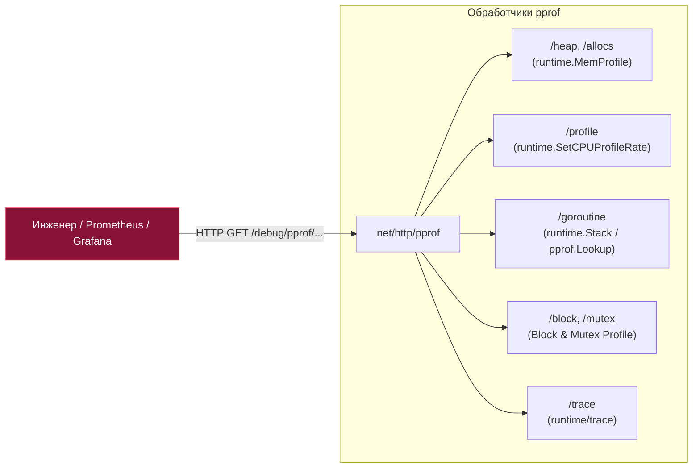
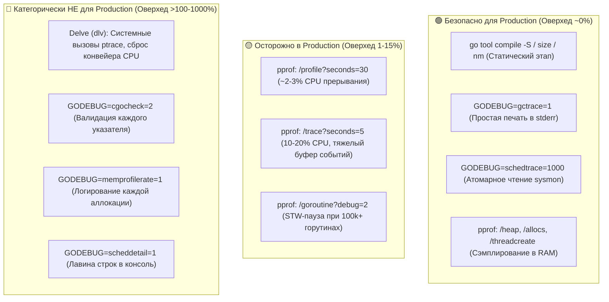

## Debug tools: арсенал отладчика и диагноста Go

В предыдущих главах мы подробно исследовали главные тяжелые орудия диагностики рантайма Go: программный интерфейс `runtime` ([[1. runtime пакет]]), веб-инструмент `go tool trace` ([[2. trace tool]]), низкоуровневый execution tracer ([[3. execution tracer]]), дампы горутин ([[4. goroutine dump]]), профилировщики блокировок ([[5. block profile]]) и мьютексов ([[6. mutex profile]]), а также числовую телеметрию планировщика ([[7. scheduler trace]]).

Однако реальная инженерная практика редко сводится к монотонному нажатию одной большой кнопки «Профилировать». Когда микросервис в продакшене неожиданно зависает в дедлоке, падает по segmentation fault в сторонней C-библиотеке или потребляет на 20% больше памяти после обновления компилятора, опытный инженер не мечется в догадках. В его распоряжении находится компактный, но всеобъемлющий **арсенал встроенных инструментов Go (Debug Tools)**:
- Системные переменные окружения (`GODEBUG`, `GOTRACEBACK`), позволяющие на лету переключить режимы работы рантайма без перекомпиляции;
- Утилиты инспекции бинарников (`compile -S`, `objdump`, `nm`, `size`), превращающие скомпилированный ELF/Mach-O файл в прозрачную книгу машинных инструкций;
- Встроенные HTTP-эндпоинты пакета `net/http/pprof`;
- Статические анализаторы компилятора (`go vet`, `staticcheck`);
- Интерактивные отладчики (`dlv`) и механизмы посмертного вскрытия процессов (Core Dump).

```mermaid
flowchart TD
    classDef process  fill:#1e293b,stroke:#38bdf8,stroke-width:1px,color:#f8fafc
    classDef success  fill:#064e3b,stroke:#34d399,stroke-width:1px,color:#f8fafc
    classDef error    fill:#7f1d1d,stroke:#f87171,stroke-width:1px,color:#f8fafc
    classDef warning  fill:#78350f,stroke:#fbbf24,stroke-width:1px,color:#f8fafc
    classDef entry    fill:#1e3a5f,stroke:#38bdf8,stroke-width:2px,color:#f8fafc
    classDef aux      fill:#334155,stroke:#64748b,stroke-width:1px,color:#f8fafc
    classDef system   fill:#312e81,stroke:#a78bfa,stroke-width:1px,color:#f8fafc
    classDef data     fill:#132d29,stroke:#2dd4bf,stroke-width:1px,color:#f8fafc
    classDef network  fill:#881337,stroke:#fb7185,stroke-width:1px,color:#f8fafc
    classDef accent   fill:#1e1b4b,stroke:#818cf8,stroke-width:1px,color:#f8fafc
    subgraph Toolchain ["Инженерный арсенал Go Debug Tools"]
        subgraph StaticStage ["1. Этап разработки и компиляции"]
            Vet["go vet / staticcheck<br/>Статический анализ AST"]:::process
            CompS["go tool compile -S<br/>Дизассемблирование и Escape-анализ"]:::process
            SizeNM["go tool nm / size<br/>Таблица символов и секции ELF"]:::process
        end

        subgraph RuntimeStage ["2. Рантайм в продакшене (Без оверхеда)"]
            EnvVars["GODEBUG / GOTRACEBACK<br/>Переменные окружения рантайма"]:::process
            SchedGC["gctrace=1, schedtrace=1000<br/>Потоковая текстовая телеметрия"]:::process
            PprofEndpoints["net/http/pprof<br/>Сэмплирующие HTTP-эндпоинты"]:::network
        end

        subgraph PostmortemStage ["3. Глубокая отладка и аварии"]
            Delve["Delve (dlv)<br/>Точки останова через ptrace"]
            CoreDump["Core Dump / SIGQUIT<br/>Посмертный срез памяти ядра"]:::process
        end
    end

    StaticStage --> RuntimeStage
    RuntimeStage --> PostmortemStage
```



Мастерство Senior-разработчика заключается в знании механической цены каждого инструмента ([[5. Mechanical sympathy в backend разработке]]): какие ручки можно смело выкручивать в живом боевом кластере под нагрузкой в 50 000 RPS, а какие приведут к мгновенной деградации задержек из-за системных вызовов ядра ОС.

---

## Переменные окружения: GODEBUG, GOTRACEBACK и другие

Рантайм Go славится своей автономностью: приложение упаковывается в единый монолитный бинарник со статически влинкованным планировщиком и сборщиком мусора. Однако поведение этого рантайма можно радикально модифицировать прямо в момент старта с помощью переменных окружения — без единой правки кода и без повторной сборки.

### GODEBUG — швейцарский нож отладки

Переменная `GODEBUG` принимает строку пар `ключ=значение`, разделенных запятыми. Это универсальный селектор низкоуровневых отладочных подсистем рантайма Go.

```bash
GODEBUG=gctrace=1,schedtrace=1000 ./my_server
```

Ключевые флаги `GODEBUG`, обязательные в арсенале бэкенд-инженера:

1. **`gctrace=1`** — включает вывод однострочного отчета в `stderr` при каждом срабатывании сборщика мусора ([[05. Garbage Collector]]). Показывает длительность фаз Stop-The-World, процент утилизации процессорных ядер, объем живой памяти до и после очистки, а также текущую цель триггера `GOGC`. Практически не создает накладных расходов.
2. **`memprofilerate=N`** — регулирует порог сэмплирования профилировщика памяти ([[5. pprof memory profile]]). По умолчанию рантайм фиксирует одну аллокацию на каждые 512 КБ выделенной памяти. Установка `memprofilerate=1` заставляет профилировщик логировать абсолютно каждое выделение памяти (катастрофический оверхед по CPU, только для локальных лабораторных тестов!). Значение `0` полностью отключает сбор профиля аллокаций.
3. **`schedtrace=N`** — выводит сводку состояния планировщика Go каждые `N` миллисекунд ([[7. scheduler trace]]). Позволяет мгновенно оценить занятость ядер, длину очередей `runqueue` и баланс между потоками ОС.
4. **`scheddetail=1`** — расширяет вывод `schedtrace`, выводя детализированное состояние каждого логического процессора `P`, системного потока `M` и каждой исполняющейся горутины `G`.
5. **`asyncpreemptoff=1`** — отключает механизм асинхронной вытесняющей многозадачности (внедренный в Go 1.14). По умолчанию рантайм использует POSIX-сигнал `SIGURG` для прерывания плотных вычислительных циклов горутин. Если ваша программа взаимодействует со специфическими C-библиотеками через CGO или отладчиком, конфликтующим с сигналами ОС, этот флаг возвращает кооперативную модель переключения по точкам вызова функций.
6. **`cgocheck=2`** — переводит проверки безопасности барьеров памяти CGO в параноидальный режим. В значении `1` (по умолчанию) рантайм проверяет только базовые указатели при вызове C-функций. В режиме `cgocheck=2` рантайм валидирует передачу указателей на каждом шаге, немедленно выбрасывая панику при попытке передать Go-указатель на память в неконтролируемую C-структуру. Замедляет CGO-вызовы в разы, но спасает от тихих разрушений памяти (Memory Corruption).
7. **`madvdontneed=1`** — управляет системным вызовом `madvise()` при возврате освобожденных страниц кучи ядру Linux ([[7. Fragmentation]]). По умолчанию Go в Linux использует `MADV_FREE` (ядро оставляет страницы за процессом, пока в системе нет дефицита RAM, что в утилитах `top`/`ps` выглядит как раздутый RSS). Флаг `madvdontneed=1` принуждает рантайм вызывать `MADV_DONTNEED`: физические страницы отбираются ядром мгновенно, что уменьшает метрику RSS, но увеличивает время повторного доступа из-за затрат на Page Faults.
8. **`inittrace=1`** — выводит хронометраж и аллокации для функции `init()` каждого подключенного пакета при холодном старте сервиса. Незаменим при поиске причин долгого запуска микросервисов в Kubernetes.

```
# Пример вывода GODEBUG=inittrace=1:
init internal/bytealg @0.038 ms, 0 ms clock, 0 bytes, 0 allocs
init fmt @1.4 ms, 0.22 ms clock, 8192 bytes, 14 allocs
init main @2.8 ms, 0.54 ms clock, 32768 bytes, 48 allocs
```

> [!info] Под капотом: пакетные флаги GODEBUG
> Механизм `GODEBUG` используется не только ядром рантайма, но и стандартной библиотекой. Например:
> - `http2debug=1` или `http2debug=2` — включает построчный дамп TCP-фреймов HTTP/2 (HEADERS, DATA, SETTINGS, WINDOW_UPDATE) в пакете `net/http`.
> - `netdns=go` или `netdns=cgo` — принудительно переключает встроенный DNS-резолвер между чистым Go-резолвером и системной функцией `getaddrinfo` из glibc.
> Актуальный перечень флагов для текущей версии компилятора доступен командой:
> ```bash
> go doc runtime/debug
> ```

---

### GOTRACEBACK — управление стек-трейсами при панике

Когда в Go-программе происходит необработанная паника (`panic`), рантайм перехватывает управление и форматирует стек вызовов в поток `stderr`. Глубиной и охватом этого отчета управляет переменная **`GOTRACEBACK`**:

| Значение | Поведение при панике | Область применения |
|---|---|---|
| **`none`** | Не выводить стек вызовов; печатается только текст ошибки паники. | Защита от утечки внутренней структуры путей в публичных CLI-утилитах. |
| **`single`** *(по умолчанию)* | Печатается трассировка стека **только той одной горутины**, в которой произошла паника. | Локальная разработка простых утилит. |
| **`all`** *(рекомендовано для Prod)* | Печатаются трассировки стеков **всех существующих пользовательских горутин**. | Высоконагруженный production: позволяет увидеть, что делали параллельные горутины в момент сбоя. |
| **`system`** | Выводятся все горутины, включая **служебные горутины рантайма** (GC workers, sysmon, finalizer, timers). | Диагностика багов внутри самого рантайма Go. |
| **`crash`** | Печатает стек уровня `system` и немедленно вызывает системный `abort()`, порождая образ памяти **Core Dump**. | Postmortem-анализ через Delve/GDB при фатальных падениях. |

```bash
GOTRACEBACK=all ./my_server
```

> [!tip] Собеседование: диагноз зависшего сервиса через SIGQUIT
> **Вопрос:** Высоконагруженный production-сервис на Go внезапно перестал отвечать на HTTP-запросы (100% подвисание, дедлок). Как за 2 секунды получить полный срез всех горутин сервиса без перезапуска и без подключения отладчика?  
> **Ответ:** Если сервис запущен с `GOTRACEBACK=all` (или дефолтным), отправка процессу POSIX-сигнала **`SIGQUIT`** (код сигнала 3):
> ```bash
> kill -QUIT <pid>
> ```
> заставит рантайм мгновенно распечатать в `stderr` полный снимок стеков всех горутин с их статусами (`chan receive`, `select`, `semacquire`). *Внимание:* обработчик по умолчанию после печати завершает процесс, поэтому в современных сервисах параллельно используют HTTP-эндпоинт `/debug/pprof/goroutine?debug=2` для неразрушающего съема.

---

### Другие важные переменные

- **`GOGC`** / **`GOMEMLIMIT`** — фундаментальные регуляторы сборщика мусора, детально рассмотренные в главах [[7. GOGC и tuning]] и [[8. GOMEMLIMIT]]. `GOMEMLIMIT` задает мягкий потолок потребления памяти (Soft Memory Limit), спасающий контейнеры от Linux OOM Killer.
- **`GOMAXPROCS`** — задает количество логических процессоров `P` планировщика Go. По умолчанию равно числу ядер CPU, доступных процессу (с учетом квот cgroups в Go 1.25+). Эквивалентно вызову функции `runtime.GOMAXPROCS()` в коде.
- **`GOPROXY`**, **`GONOSUMDB`**, **`GONOSUMCHECK`** — управляют загрузкой зависимостей и валидацией контрольных сумм в CI/CD пайплайнах. Знание этих переменных необходимо для обеспечения воспроизводимости сборок и изоляции приватных корпоративных репозиториев от публичных зеркал.

---

## Инструменты компилятора: заглянуть в скомпилированный код

Когда профайлер указывает на горячую функцию, но логика кода на первый взгляд идеальна, инженер спускается на уровень машинных инструкций. Компилятор Go включает встроенный набор инструментов для инспекции результатов трансляции и линковки.

### `go tool compile -S` — дизассемблер компилятора

Флаг `-S` заставляет компилятор Go вывести псевдоассемблерный листинг Plan 9 в процессе сборки исходных файлов:

```bash
go tool compile -S main.go
```

Листинг наглядно показывает работу компилятора:
1. **Вызовы функций (`CALL`):** Была ли функция скомпилирована в реальный переход по адресу или компилятор смог ее заинлайнить.
2. **Проверки выхода за границы слайса (Bounds Checks):** Инструкции сравнения с последующим переходом на `runtime.panicIndex`. Опытный инженер сразу видит, где компилятор не смог доказать безопасность диапазона в цикле.
3. **Генерация структур управления:** В какие ветвления и таблицы прыжков (jump tables) превратились конструкции `if`, `for`, `switch` и `select`.

Флаг `-S` традиционно комбинируют с флагами анализа:
- `-m` — выводит отчет escape-анализа (какие переменные остались на стеке, а какие утекли в кучу). Два флага `-m -m` дают детализированное дерево решений компилятора.
- `-l` — отключает инлайнинг функций (для изоляции замера накладных расходов вызова).

Детальное влияние инлайнинга на производительность раскрыто в главе [[5. Inline и влияние на performance]].

---

### `go tool objdump` — дизассемблер готового бинарника

В отличие от `compile -S`, который работает с единичными пакетами на этапе компиляции, утилита `objdump` дизассемблирует **уже скомпонованный исполняемый файл** со всеми влинкованными библиотеками и рантаймом.

```bash
go tool objdump -s 'main\.process' ./my_server
```

Флаг `-s` принимает регулярное выражение имени функции. `objdump` показывает:
- Точные 64-битные виртуальные адреса инструкций в секции памяти `.text`.
- Реальные машинные опкоды архитектуры целевого процессора (x86-64 или ARM64), а не абстрактный Plan 9 ассемблер.
- Перемежения исходных строк кода на Go с соответствующими блоками ассемблерных инструкций.

---

### `go tool nm` — таблица символов

Утилита `nm` извлекает таблицу символов исполняемого файла. Она незаменима, когда нужно расследовать, почему итоговый бинарник микросервиса раздулся до сотен мегабайт:

```bash
go tool nm -size ./my_server | sort -k2 -rn | head -20
```

Команда сортирует все символы (функции, глобальные таблицы, строковые пулы) по физическому размеру в байтах. Это позволяет за секунды обнаружить огромные вшитые через `//go:embed` статические ассеты или гигантские автогенерированные protobuf/gRPC структуры.

---

### `go tool size` — размер секций бинарника

Утилита дает мгновенную сводку по распределению памяти в сегментах исполняемого файла (форматы ELF в Linux, Mach-O в macOS, PE в Windows):

```bash
go tool size ./my_server
```

Пример вывода:
```
   text	   data	    bss	    dec	    hex	filename
 8240128	 152432	  45680	 8438240	  80c1e0	./my_server
```

- **`text`** (Code Segment) — машинный код всех функций программы и рантайма. Раздувание `text` свидетельствует о чрезмерном инлайнинге или тяжелых зависимостях.
- **`data`** — инициализированные глобальные переменные и константы.
- **`bss`** (Block Started by Symbol) — неинициализированные глобальные переменные (в файле занимают лишь числовой размер, выделяются ядром ОС в нули при старте).
- **`dec` / `hex`** — суммарный размер бинарника в десятичном и шестнадцатеричном форматах.

---

## HTTP-эндпоинты net/http/pprof — полный список

Стандартный пакет `net/http/pprof` регистрирует встроенные обработчики на HTTP-мультиплексоре приложения. Это основной и наиболее зрелый механизм интерактивной телеметрии Go в продакшене.

Сводная матрица всех диагностических эндпоинтов:

| HTTP-эндпоинт | Назначение и тип профиля | Накладные расходы | Связанная глава |
|---|---|---|---|
| **`/debug/pprof/`** | Индексная HTML-страница со ссылками на все профили | Нулевые | [[1. pprof. Введение]] |
| **`/debug/pprof/profile?seconds=N`** | Сбор CPU-профиля длительностью N секунд (по умолчанию 30с) | ~1–3% CPU | [[2. CPU profiling в Go]] |
| **`/debug/pprof/heap`** | Срез памяти кучи (сэмплирование аллокаций inuse/alloc) | Практически нулевые | [[5. pprof memory profile]] |
| **`/debug/pprof/allocs`** | Профиль аллокаций (alloc_space / alloc_objects с момента запуска) | Практически нулевые | [[4. Allocation profiling]] |
| **`/debug/pprof/goroutine?debug=1/2`** | Дамп горутин (debug=1 — текстовый с группировкой одинаковых стеков; debug=2 — детальный с раздельными стеками всех горутин) | Зависит от числа G | [[4. goroutine dump]] |
| **`/debug/pprof/block`** | Профиль задержек на блокировках каналов, мьютексов и системных вызовах | Зависит от rate | [[5. block profile]] |
| **`/debug/pprof/mutex`** | Профиль конфликтов за владение блокировками `sync.Mutex` | Зависит от rate | [[6. mutex profile]] |
| **`/debug/pprof/threadcreate`** | Профиль создания новых физических потоков операционной системы (`M`) | Нулевые | [[1. runtime пакет]] |
| **`/debug/pprof/trace?seconds=N`** | Полная запись событий execution trace за N секунд | До 10–25% CPU | [[3. execution tracer]] |
| **`/debug/pprof/cmdline`** | Аргументы командной строки запуска процесса (через `\x00`) | Нулевые | — |
| **`/debug/pprof/symbol`** | Эндпоинт символизации адресов функций для утилиты `go tool pprof` | Нулевые | — |



> [!warning] Ловушка безопасности: открытый pprof в публичный интернет
> Автоматическая регистрация пакета через пустой импорт:
> ```go
> import _ "net/http/pprof"
> ```
> вешает эндпоинты на дефолтный `http.DefaultServeMux`. Если этот мультиплексор слушает публичный порт, злоумышленники могут:
> 1. Снять дамп горутин и памяти, извлекая токены авторизации, приватные ключи и персональные данные из дампов стеков.
> 2. Устроить DoS-атаку, многократно дергая `/debug/pprof/trace?seconds=60` и `/debug/pprof/profile?seconds=60`.
> 
> **Золотое правило:** Всегда выносите pprof на отдельный внутренний порт (`localhost:6060` или закрытую сервисную сеть), либо защищайте эндпоинты middleware-аутентификацией.

---

## Статический анализ: go vet и его друзья

Многие критические дефекты производительности и конкурентности можно перехватить задолго до того, как код попадет на сервер. Статический анализ проверяет синтаксическое дерево (AST) и типизацию без запуска программы.

### `go vet` — встроенный набор анализаторов

Утилита `go vet` поставляется вместе с компилятором Go и запускает строгие эвристические анализаторы:

```bash
go vet ./...
```

Ключевые детекторы `go vet`:
- **`copylocks`** — выявляет передачу структур, содержащих `sync.Mutex` или `sync.RWMutex`, по значению вместо передачи по указателю (копирование мьютекса разрушает синхронизацию).
- **`loopclosure`** — обнаруживает некорректный захват переменной цикла горутиной внутри замыкания (классический баг семантики циклов Go до версии 1.22).
- **`fieldalignment`** (из пакета `golang.org/x/tools/go/analysis/passes/fieldalignment`) — находит неэффективный порядок полей в структурах, приводящий к накладным расходам на выравнивание памяти (padding) и лишним cache miss ([[9. Cache line и выравнивание]]).
- **`nilfunc`** — сигнализирует о бессмысленных сравнениях функции с `nil`.
- **`printf`** — проверяет строгое соответствие спецификаторов форматирования типам аргументов в `fmt.Printf`, `log.Printf`.
- **`shadow`** — находит опасное затенение переменных во внутренних блоках видимости (флаг `-shadow`).
- **`unreachable`** — детектирует мертвый код после операторов `return`, `panic`, `break`.

---

### staticcheck и golangci-lint

В современной промышленной разработке `go vet` является лишь первой ступенью проверки.

- **[staticcheck](https://staticcheck.io/)** — передовой статический анализатор от Доминика Хоннегера (Dominik Honnef). Содержит сотни специализированных проверок: находит утечки горутин, неэффективные регулярные выражения, бесполезные аллокации строк, ошибки работы с `sync.Pool` и устаревшие API.
- **golangci-lint** — скоростной мета-линтер, объединяющий `go vet`, `staticcheck`, `errcheck`, `gocritic`, `govet` и десятки других анализаторов под единым параллельным движком кэширования. Интеграция `golangci-lint` в CI/CD пайплайн гарантирует соблюдение стандартов кодовой базы всей командой.

---

## Delve: интерактивный отладчик

Для ситуаций, когда нужно пошагово проследовать по сложному алгоритму, остановиться на контрольной точке и проинспектировать значения локальных переменных, классический вывод логов уступает место интерактивному отладчику.

Де-факто стандартом в экосистеме Go является **Delve (`dlv`)**. В отличие от классического `gdb`, который плохо понимает внутренние структуры рантайма Go (модель G-M-P, слайсы, интерфейсы, каналы), Delve спроектирован специально для Go:
- Корректно отображает тысячи горутин и их состояния.
- Позволяет замораживать отдельные горутины и переключать контекст исполнения.
- Поддерживает удаленную отладку сервисов в контейнерах (`dlv attach`, `dlv exec`).

Подробно архитектура и сценарии работы с отладчиком представлены в отдельной лекции [[2. Delve debugger]].

---

## Core dump и postmortem

Когда процесс аварийно завершается сигналом операционной системы (`SIGSEGV`, `SIGBUS`, `SIGABRT`), вся оперативная память процесса может быть сохранена ядром Linux на диск в виде файла **Core Dump**.

Это позволяет провести **postmortem-анализ (посмертное вскрытие)**: открыть дамп памяти через Delve или GDB и увидеть точное состояние всех горутин, адреса указателей и значения переменных в микросекунду катастрофы.

```bash
GOTRACEBACK=crash ./my_server
```

Установка `GOTRACEBACK=crash` предписывает рантайму Go не просто завершить работу при панике, а форсировать системный сброс памяти ядра. Методика генерации и расследования дампов подробно рассмотрена в статьях [[5. Postmortem анализ]] и [[6. Core dumps]].

---

## Mechanical Sympathy: цена инструментов отладки

Каждый инструмент отладки вносит возмущение в исследуемую систему (принцип неопределенности Гейзенберга в программной инженерии). Понимание аппаратной стоимости инструментов — ключ к сохранению стабильности production:



### Физическая природа накладных расходов:
1. **Интерактивные отладчики (Delve):**  
   Каждая точка останова (breakpoint) физически заменяет машинную инструкцию в коде на прерывание `INT 3` (опкод `0xCC` в x86-64). При достижении этой точки процессор останавливает конвейер, генерирует прерывание ядра, и управление передается через системный вызов `ptrace`. Накладные расходы составляют сотни микросекунд на каждую точку, замедляя работу сервиса в тысячи раз.
2. **Execution Tracer (`/debug/pprof/trace`):**  
   Запись каждого микрособытия планировщика создает конкуренцию за локальные кольцевые буферы трейсера, приводя к частым сбросам кэш-линий процессора.
3. **Дампы горутин на огромных нагрузках:**  
   Снятие стеков 500 000 горутин требует временной остановки планировщика и выделения десятков мегабайт памяти для форматирования текстового представления.

---

## Собеседование: типичные вопросы

> [!tip] Собеседование
> **Вопрос:** В чем разница между `go tool compile -S` и `go tool objdump`? Когда следует предпочесть один другому?  
> **Ответ:**  
> - `go tool compile -S` работает на этапе трансляции конкретного `.go`-файла или пакета. Он выводит промежуточный псевдоассемблер Plan 9 до финальной линковки, позволяя увидеть решения компилятора по инлайнингу и проверки границ слайсов.  
> - `go tool objdump` дизассемблирует уже скомпонованный итоговый бинарник (ELF/Mach-O). Он отображает реальные машинные инструкции целевого процессора (x86-64/ARM64) с абсолютными виртуальными адресами памяти после всех оптимизаций линкера. Его используют, когда нужно проверить финальный ассемблерный код с учетом сторонних библиотек и рантайма.

> [!tip] Собеседование
> **Вопрос:** Чем отличается поведение сборщика мусора при установке `GODEBUG=madvdontneed=1` в Linux-контейнерах?  
> **Ответ:** По умолчанию рантайм Go в Linux использует системный вызов `madvise` с флагом `MADV_FREE`. Память помечается как свободная, но ядро Linux отбирает физические страницы только при возникновении системного дефицита RAM. Это приводит к тому, что мониторинг Kubernetes видит высокий RSS процесса. Флаг `madvdontneed=1` заставляет рантайм использовать `MADV_DONTNEED`: физические страницы возвращаются ядру немедленно, RSS резко снижается, но при последующих аллокациях процессор тратит такты на Page Faults.

---

## Итог

- **Debug tools Go** — это стройная многоуровневая система инструментов: от переменных окружения и утилит компилятора до встроенных профайлеров и статических анализаторов.
- Переменные **`GODEBUG`** и **`GOTRACEBACK`** позволяют оперативно управлять поведением рантайма, сборщика мусора и детализацией аварийных стек-трейсов без перекомпиляции кода.
- Утилиты **`go tool compile -S`**, **`objdump`**, **`nm`** и **`size`** предоставляют глубокую оптику для анализа скомпилированного бинарника, локализации горячих инструкций и устранения раздувания кода.
- Стандартные HTTP-эндпоинты **`net/http/pprof`** являются основным промышленным каналом телеметрии, но требуют обязательной изоляции и защиты от несанкционированного доступа.
- Статический анализ через **`go vet`**, **`staticcheck`** и **`golangci-lint`** отсекает ошибки конкурентности и неоптимальные структуры данных на этапе компиляции.
- Senior-инженер всегда помнит о механической стоимости отладки: легковесные инструменты (`gctrace`, `schedtrace`, `heap`) безопасны в продакшене, тогда как тяжелые (`trace`, `Delve`, `cgocheck=2`) предназначены для лабораторных и стендовых испытаний.

На этом мы триумфально завершаем подраздел **«08. Runtime и инструменты»**. Все восемь лекций выстроили фундаментальный мост от низкоуровневых структур рантайма к практической инженерии.

Следующий подраздел — **«09. Практические оптимизации»** — откроется фундаментальной темой эффективного управления памятью: [[1. Уменьшение аллокаций]].