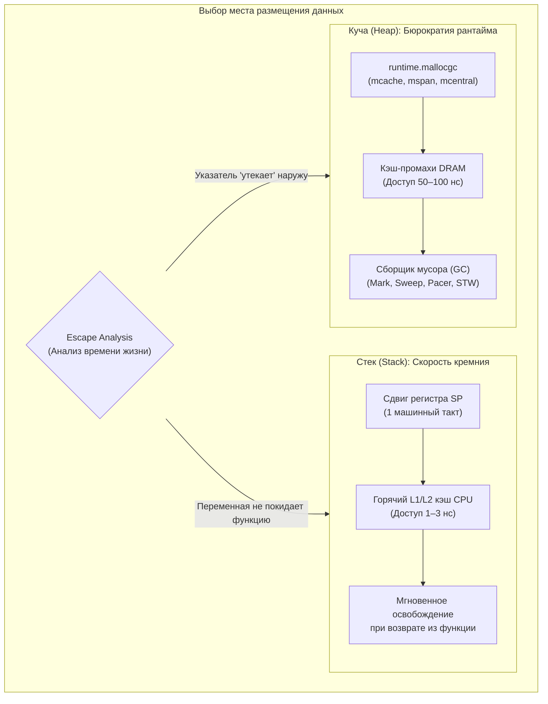
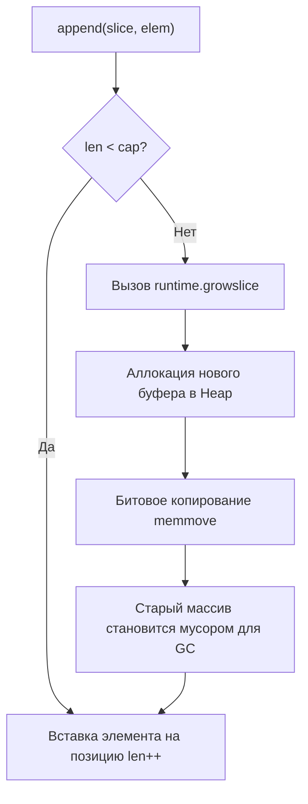
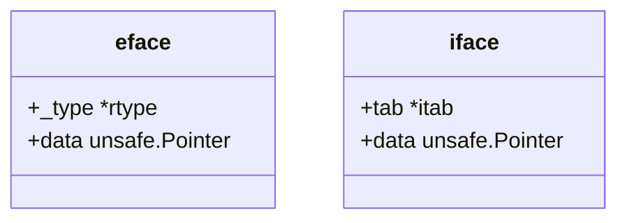

## Уменьшение аллокаций: практические приемы управления памятью в Go

В мире высоконагруженного бэкенда на Go производительность приложения часто упирается не в сложность алгоритмов (CPU bound), а в работу с памятью (Memory/IO bound). Процессор большую часть времени простаивает в ожидании данных из оперативной памяти. Каждая лишняя аллокация в куче (Heap) — это двойной удар по производительности.

Во-первых, вы тратите процессорное время прямо сейчас: на вызов аллокатора, поиск свободного `mspan` в локальном кэше потока `mcache` (а при его исчерпании — в `mcentral` и `mheap`), а иногда и на системные вызовы к ядру ОС. Во-вторых, вы берете «кредит», который неизбежно придется отдавать сборщику мусора (Garbage Collector), сжигая 25% ресурсов CPU на фазы Mark и Sweep и увеличивая хвостовые задержки (Tail Latency).



В этой статье мы разберем практические приемы написания кода, позволяющие компилятору оставлять данные на быстром стеке, сводя работу рантайма и аллокатора к абсолютному минимуму.

---

## Mechanical Sympathy: Стоимость аллокации

С точки зрения железа, стек (Stack) — это исключительно быстрая память, так как она практически всегда "прогрета" и находится в L1/L2 кэше процессора (о механике кэшей мы говорили в [[8. Cache friendliness]]). Аллокация на стеке — это сдвиг указателя `SP` (Stack Pointer) на несколько байт. Это выполняется за одну ассемблерную инструкцию (`SUBQ $24, SP`). Освобождение — обратный сдвиг (`ADDQ $24, SP`). Нулевая нагрузка на GC, нулевая фрагментация.

Аллокация в куче — это вызов сложной функции рантайма `runtime.mallocgc`. 
Даже если `mcache` (локальный кэш аллокатора текущего потока `M`) имеет свободные блоки нужного размера, это всё равно десятки инструкций:
1. Вычисление подходящего размерного класса (`sizeclass`).
2. Извлечение свободного слота из битовой карты `mspan`.
3. Очистка памяти нулями (`memclrNoHeapPointersChunk`).
4. Назначение барьеров записи, если объект содержит указатели.

А если объект "переживет" текущую горутину, доступ к нему будет разбросан по памяти, что приведет к кэш-промахам (Cache Misses) при чтении из DRAM.

> [!info] Под капотом: размерные классы runtime.mallocgc
> Аллокатор Go делит объекты на три категории:
> 1. **Tiny-аллокации (< 16 байт без указателей):** Упаковываются по нескольку штук в единый 16-байтный блок внутри `mcache.tiny`.
> 2. **Small-аллокации (до 32 КБ):** Выделяются из преднарезанных блоков `mspan` одного из 67 размерных классов без глобальных блокировок.
> 3. **Large-аллокации (> 32 КБ):** Выделяются напрямую через `mheap` с захватом глобального мьютекса кучи, что создает ощутимую задержку.

---

## 1. Значения против Указателей: Миф о производительности

В языках вроде C++ или C# передача сложных структур по указателю/ссылке — стандарт де-факто, чтобы избежать дорогого копирования. В Go этот паттерн часто приводит к **пессимизации** производительности из-за работы Escape Analysis (о котором мы подробно говорили в [[3. Escape analysis]]).

Когда вы возвращаете указатель из функции, компилятор не может оставить эту переменную на стеке функции (иначе указатель смотрел бы в невалидную память после завершения функции). Переменная "утекает" в кучу.

```go
type User struct {
    ID   int
    Name string
}

// ПЛОХО: Заставляет User аллоцироваться в куче
func NewUser(id int, name string) *User {
    return &User{ID: id, Name: name} 
}

// ХОРОШО: User остается на стеке вызывающей функции (или копируется по значению)
func NewUser(id int, name string) User {
    return User{ID: id, Name: name}
}
```

> [!warning] Ловушка / Gotcha
> Многие разработчики передают по указателю структуры размером в 16-32 байта (например, `time.Time` — 24 байта), думая, что экономят память. Копирование 24 байт (3 инструкции `MOV` на 64-битной архитектуре) занимает буквально доли наносекунды и данные остаются в кэш-линии L1. А вот аллокация в куче стоит ~30-50 наносекунд плюс стоимость будущей уборки мусора и кэш-промахи при разыменовании указателя.

**Правило:** Передавайте и возвращайте небольшие структуры по значению. Используйте указатели только если структуру нужно мутировать (и это мутирование должно отразиться у вызывающей стороны) или если её размер превышает размер кэш-линии (обычно > 64 байт).

---

## 2. Предварительная аллокация (Preallocation)

Когда вы добавляете элементы в `slice` через `append`, рантайм проверяет, есть ли место (`capacity`). Если места нет, вызывается функция `runtime.growslice`. 

Что делает `growslice`:
1. Вычисляет новую вместимость (в Go 1.18+ для малых слайсов удваивает, для больших плавно растет с коэффициентом ~1.25x).
2. Аллоцирует новый, более крупный массив в памяти кучи.
3. Копирует старые данные в новый массив (`memmove`).
4. Бросает старый массив на растерзание Garbage Collector-у.



Если вы знаете размер (или хотя бы приблизительный максимум) заранее — **всегда** указывайте capacity при создании слайсов и мап.

```go
// ПЛОХО: Будет несколько аллокаций и копирований в процессе цикла
func getIDs(users []User) []int {
    var ids []int
    for _, u := range users {
        ids = append(ids, u.ID)
    }
    return ids
}

// ХОРОШО: Одна аллокация, никакого копирования O(N)
func getIDs(users []User) []int {
    ids := make([]int, 0, len(users)) // capacity = len(users)
    for _, u := range users {
        ids = append(ids, u.ID)
    }
    return ids
}
```

Для мап (`map`) логика аналогична. Внутренний механизм `runtime.mapassign` при достижении порога load factor (6.5 элементов на бакет) начнет процесс эвакуации (evacuation), что крайне дорого, так как требует аллокации новых бакетов и перехеширования. Инициализируйте мапы так: `make(map[string]int, expectedSize)`.

---

## 3. Скрытые аллокации в интерфейсах (Boxing)

Интерфейс в Go под капотом — это структура `eface` (empty interface, `any`) или `iface` (interface with methods), занимающая 16 байт на 64-битных системах. Она содержит два указателя:
1. `_type` (для `eface`) или `itab` (для `iface`) — указатель на метаданные типа и таблицу виртуальных методов.
2. `data` — указатель на сами данные.



> [!info] Под капотом
> Поскольку `data` в интерфейсе — это всегда указатель, передача значения по значению в интерфейс (например, `fmt.Println(42)`) заставляет рантайм аллоцировать место в куче для числа `42`, скопировать его туда, и передать указатель на эту память в поле `data` интерфейса. Этот процесс называется Boxing. Исключение составляют лишь булевы значения и небольшие статические константы, для которых рантайм использует глобальные предвыделенные таблицы.

Особенно больно это бьет по производительности в горячих циклах при логировании или работе с пакетом `reflect`.

```go
// Каждый вызов этой функции с не-указателем приведет к аллокации
func LogDebug(msg string, args ...any) { ... }

// LogDebug("user id", 123) // 123 упакуется в interface{} -> Heap Allocation
```

**Как бороться?**
Если вы пишете высоконагруженный код, используйте строго типизированные API. Отличный пример — пакет `log/slog` или библиотека `zap`. Они используют строго типизированные поля вместо `interface{}`:

```go
// Пример типизированного подхода (нет аллокаций для базовых типов)
logger.Info("user logged in", zap.Int("user_id", 123))
```

---

## 4. Zero-copy конвертации между string и []byte

Строки в Go иммутабельны (неизменяемы). `[]byte` — мутабелен. Поэтому, когда вы делаете каст `[]byte(str)` или `string(bytes)`, Go **обязан** аллоцировать новую память и скопировать данные, чтобы гарантировать неизменяемость оригинальной строки.

Но в высоконагруженных сетевых приложениях парсинг протоколов (например, HTTP или кастомных TCP-протоколов) постоянно требует чтения байт и сравнения их со строками.

Начиная с Go 1.20, в пакете `unsafe` появились функции `String`, `StringData`, `Slice` и `SliceData` для zero-copy преобразований, которые работают мгновенно и без аллокаций.

> [!tip] Собеседование
> На интервью уровня Senior часто просят написать zero-copy конвертацию и объяснить, почему она опасна. Опасность в том, что если вы конвертируете `[]byte` в `string` через `unsafe`, а затем измените оригинальный `[]byte`, ваша "иммутабельная" строка внезапно изменит свое значение. Это приведет к data race и UB, если строка используется в качестве ключа мапы.

```go
import "unsafe"

// Быстрая конвертация []byte -> string без аллокаций
func BytesToString(b []byte) string {
    if len(b) == 0 {
        return ""
    }
    // unsafe.String принимает указатель на первый элемент и длину
    return unsafe.String(unsafe.SliceData(b), len(b))
}

// Быстрая конвертация string -> []byte без аллокаций
func StringToBytes(s string) []byte {
    if s == "" {
        return nil
    }
    return unsafe.Slice(unsafe.StringData(s), len(s))
}
```

*Примечание: в версиях Go до 1.20 использовались хаки с `reflect.SliceHeader` и `reflect.StringHeader`, но сейчас эти структуры помечены как deprecated, так как они ломали работу Garbage Collector.*

---

## 5. Замыкания (Closures) и захват переменных

Анонимные функции в Go — мощный инструмент, но они могут создавать скрытые аллокации. Если замыкание захватывает переменную из внешней области видимости, и само замыкание "утекает" (например, передается в горутину или сохраняется в структуру), захваченная переменная **обязана** быть перенесена в кучу.

```go
func processItems(items []string) {
    for _, item := range items {
        // Переменная item будет перенесена в кучу, 
        // так как она захвачена горутиной (до Go 1.22 это еще и вызывало баг с циклом)
        go func() {
            fmt.Println(item)
        }()
    }
}
```

Чтобы избежать аллокации (и потенциальных гонок), передавайте переменную явно как аргумент функции:

```go
func processItems(items []string) {
    for _, item := range items {
        // item копируется на стек горутины, нет замыкания - нет аллокации внешней переменной
        go func(val string) {
            fmt.Println(val)
        }(item)
    }
}
```

---

## Итог

1. **Понимание Escape Analysis** — ваш главный инструмент. Не возвращайте указатели на мелкие структуры.
2. **Всегда используйте предвыделение памяти (`make(..., cap)`)** для слайсов и мап, предотвращая каскадные `growslice` и эвакуации бакетов.
3. **Избегайте использования `interface{}` в горячих путях**, так как упаковка примитивных типов вызывает boxing и аллокации. Используйте строго типизированные API (`slog.Attr`, `zap.Field`).
4. **Осторожно используйте `unsafe` для zero-copy конвертации строк**, если абсолютно уверены, что лежащий в основе слайс байтов не будет модифицирован.
5. **Контролируйте замыкания:** передавайте переменные в анонимные функции явно через параметры стека.

Но что делать, если аллокаций избежать физически невозможно? Например, вы читаете сетевые пакеты неизвестного размера, обрабатываете JSON сложной структуры или парсите большие файлы? Постоянное выделение памяти "забьет" GC, даже если объекты короткоживущие.

В этом случае мы должны не *уменьшать* количество необходимых нам объектов, а *переиспользовать* ту память, которую мы уже запросили у ОС. Механизм для такого переиспользования встроен в стандартную библиотеку. Подробно о нем — в следующей статье: [[2. sync Pool]].