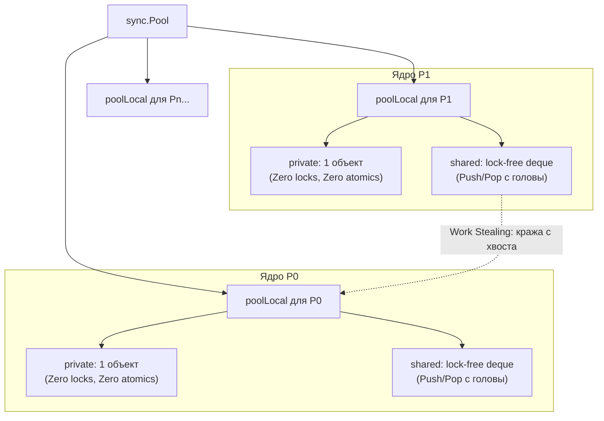
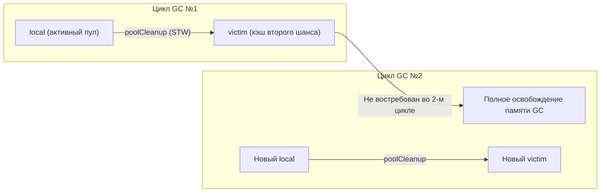

## sync.Pool: анатомия и механическое сочувствие к пулу объектов

В предыдущей статье [[1. Уменьшение аллокаций]] мы выяснили, почему аллокации в куче так губительны для высоконагруженного бэкенда и как с помощью Escape Analysis заставить компилятор оставлять структуры на быстром стеке. Однако в реальных сетевых сервисах избежать динамической памяти невозможно в принципе: чтение JSON-тел запросов переменной длины, сборка gRPC-сообщений, буферизация потоков из баз данных — всё это требует памяти переменного размера.

Если мы не можем полностью отказаться от выделения динамической памяти, инженерное решение очевидно: **перестать аллоцировать память заново и научиться её переиспользовать**.

В экосистеме Go для этой цели существует специализированный системный примитив — **`sync.Pool`**.

---

## Что такое sync.Pool?

**`sync.Pool`** — это высокопроизводительный, потокобезопасный пул масштабируемых временных объектов, встроенный в стандартную библиотеку Go. Его миссия — кэшировать уже выделенные структуры данных и буферы, избавляя аллокатор от вызовов `runtime.mallocgc`, а сборщик мусора — от необходимости непрерывно утилизировать гигабайты короткоживущего мусора.

В отличие от традиционных пулов объектов в Java или C++ (построенных на мьютексах или Thread-Local Storage), `sync.Pool` в Go тесно сопряжен с ядром рантайма, моделью планировщика G-M-P ([[1. Scheduler Go. G-M-P модель]]) и фазами Garbage Collector.

### Базовое использование

Канонический паттерн использования `sync.Pool` выглядит лаконично и строго:

```go
package main

import (
	"bytes"
	"sync"
)

// Создаем пул на уровне пакета
var bufPool = sync.Pool{
	New: func() any {
		// Эта функция вызывается ТОЛЬКО если пул пуст
		// Предвыделяем буфер на 1 КБ, чтобы избежать реаллокаций
		return bytes.NewBuffer(make([]byte, 0, 1024))
	},
}

func handleRequest(data []byte) {
	// Берем объект из пула (быстрая операция)
	buf := bufPool.Get().(*bytes.Buffer)
	
	// ВАЖНО: Сбрасываем состояние объекта перед использованием!
	buf.Reset()
	
	// Гарантируем возврат объекта в пул после завершения
	defer bufPool.Put(buf)
	
	// Полезная работа
	buf.Write(data)
	_ = buf.Bytes()
}
```

Но за этой обманчиво простой сигнатурой скрывается сложнейшая инженерная конструкция, спроектированная с глубоким механическим сочувствием к процессору (Mechanical Sympathy).

---

## Mechanical Sympathy: Как sync.Pool избегает блокировок?

Представьте себе веб-сервер, обрабатывающий 100 000 RPS на 32-ядерном сервере. Если бы `sync.Pool` защищался обычным мьютексом `sync.Mutex`, все 32 ядра процессора сгорели бы в бесконечных войнах за одну кэш-линию памяти (шторм когерентности кэшей MESI и чудовищный Lock Contention).

Рантайм Go решает эту фундаментальную проблему, децентрализуя хранилище по логическим процессорам `P` планировщика Go.



> [!info] Под капотом: устройство poolLocal
> Внутри `sync.Pool` содержит не одну общую очередь, а массив структур `poolLocal`, размер которого строго равен `GOMAXPROCS` (числу логических процессоров `P`).
> 
> Когда горутина вызывает `Get()` или `Put()`:
> 1. Вызывается внутренняя функция рантайма `runtime_procPin()`. Она привязывает исполняющуюся горутину к её текущему процессору `P` и **запрещает вытеснение планировщиком** (preemption). Это железно гарантирует, что горутина не мигрирует на другой поток ОС в середине операции.
> 2. Горутина мгновенно получает доступ к своей персональной структуре `poolLocal` без межъядерной синхронизации.
> 3. После завершения операции вызывается `runtime_procUnpin()`, возвращающий горутине стандартный режим вытесняющей многозадачности.

Каждый элемент `poolLocal` разделен на два уровня:
1. **`private` (unsafe.Pointer):** Одиночный объект. Доступ к нему разрешен **исключительно** текущему логическому процессору `P`. Чтение и запись выполняются за 1 такт CPU — здесь нет ни мьютексов, ни атомарных инструкций (`atomic`), ни сброса конвейера CPU.
2. **`shared` (двусторонняя lock-free очередь):** Кольцевой буфер объектов. Текущий процессор `P` добавляет и забирает объекты с головы очереди (`head`). Другие процессоры `P`, исчерпав свои запасы, имеют право воровать объекты с противоположного конца — хвоста очереди (`tail`).

---

### Алгоритм работы bufPool.Get():

Когда горутина запрашивает объект через `Get()`, рантайм следует строгой 5-ступенчатой иерархии:

1. Горутина "прибивается" к текущему `P` через `runtime_procPin()`.
2. **Проверка `private`:** Если слот `private` занят, объект забирается мгновенно (самый быстрый путь, 0 наносекунд на синхронизацию).
3. **Локальный `shared`:** Если `private` пуст, горутина выталкивает элемент из головы собственной очереди `shared`.
4. **Work Stealing (Кража у соседей):** Если локальная очередь пуста, горутина обходит структуры `poolLocal` соседних процессоров `P` и пытается украсть объект из хвоста их очередей `shared`.
5. **Victim Cache и `New()`:** Если ни у одного `P` ничего нет, проверяется жертвенный кэш `victim`. И лишь если весь пул абсолютно пуст, горутина вызывает пользовательскую функцию `New()`.

Благодаря этой архитектуре данные в 90% случаев берутся из локального ядра, оставаясь в горячих L1/L2 кэшах процессора!

---

## Взаимодействие с Garbage Collector (Victim Cache)

Классический вопрос на технических собеседованиях: *"Сколько живут объекты в sync.Pool и когда они удаляются?"*

Ответ кроется в интеграции с жизненным циклом Garbage Collector ([[1. GC в Go. Обзор]]).

Если бы объекты в `sync.Pool` жили бесконечно, пул превратился бы в неуправляемую утечку памяти (Memory Leak): приложение во время кратковременного всплеска нагрузки (spikes) выделило бы 10 ГБ буферов и удерживало их вечно.



### Эволюция: от жесткой зачистки до Victim Cache
- **До Go 1.13:** Перед каждым запуском сборщика мусора во время короткой фазы Stop-The-World вызывалась функция `poolCleanup`, которая **полностью обнуляла** все объекты во всех пулах. При высокой нагрузке GC мог запускаться каждую секунду, превращая пул в решето: все кэши сбрасывались, сервису приходилось заново аллоцировать сотни мегабайт, что вызывало новый цикл GC (порочный круг троттлинга).
- **Начиная с Go 1.13 (Victim Cache):** Внутрь `sync.Pool` ввели двухпоколенную модель — основной массив `local` и жертвенный массив `victim`.
  1. В момент фазы STW `poolCleanup` старый массив `victim` уничтожается, а объекты из текущего `local` перемещаются в `victim`. Сам `local` становится пустым.
  2. Если во время работы сервис обращается к `Get()`, он сначала ищет в `local`, а при промахе заглядывает в `victim`.
  3. Объект гарантированно переживает **минимум один полный цикл GC**. Это радикально сгладило провалы производительности при частых сборках мусора.

---

## Ловушки и подводные камни (Gotchas)

> [!warning] Ловушка / Gotcha: Утечка памяти через раздутый Capacity
> Представьте веб-сервер, переиспользующий байтовые слайсы `[]byte`. 99% запросов имеют размер до 2 КБ (`cap = 2048`).
> 
> Но однажды приходит аномальный файл размером 64 МБ. Операция `append` или метод `buf.Write()` расширяет внутренний слайс до 64 МБ. После обработки запроса разработчик делает:
> ```go
> buf.Reset() // Сбрасывает len в 0, но оставляет cap = 64 MB!
> bufPool.Put(buf)
> ```
> Теперь в пуле оседает гигантский кусок памяти в 64 МБ. Если таких буферов осядет десяток, сервис потребит гигабайты памяти вхолостую.
> 
> **Инженерное решение:** Фильтровать буферы по размеру перед возвратом в пул!
> ```go
> defer func() {
>     const maxPoolCap = 64 * 1024 // 64 КБ жесткий лимит
>     if buf.Cap() <= maxPoolCap {
>         bufPool.Put(buf)
>     }
> }()
> ```

---

## Паттерны и Антипаттерны

> [!tip] Собеседование
> **Вопрос:** Можно ли использовать `sync.Pool` для хранения пула TCP-соединений или коннектов к базе данных (Database Connection Pool)?  
> **Ответ:** **Категорически нет!**  
> `sync.Pool` хранит *временные, stateless* объекты без гарантии их выживания. Сборщик мусора может в любой момент очистить пул в фазе `poolCleanup`. Если положить туда TCP-сокет или транзакцию БД, рантайм уничтожит ссылку, сокет оборвется некорректно без вызова `Close()`, на стороне ОС утекут файловые дескрипторы, а на стороне БД зависнут открытые транзакции. Для сетевых ресурсов всегда используют долгоживущие пулы на каналах или мьютексах с контролируемым `MaxIdleTime`.

### Когда использовать `sync.Pool`:
- Переиспользование байтовых буферов (`bytes.Buffer`, `[]byte`) в сетевом I/O (сериализация JSON/protobuf, HTTP-хэндлеры).
- Тяжелые, но строго *бесстейтовые* (stateless) вычислительные структуры (контексты компрессии gzip/zstd, структуры парсеров AST).
- Если профилировщик (`pprof`) отчетливо показывает высокое время выполнения `runtime.mallocgc` на короткоживущих объектах.

### Когда НЕ использовать:
- **Для мелких примитивных объектов:** Вызов `Get()` и `Put()` (атомики, pinning потоков) может стоить дороже, чем 1 такт на сдвиг `SP` на стеке.
- **Для stateful-сущностей:** Коннекты к БД, сокеты, файлы.
- **Без предварительного профилирования:** Преждевременное добавление пулов усложняет код и повышает риск гонок данных без реального выигрыша (см. [[1. Почему нельзя оптимизировать без измерений]]).

---

## Итог

- **`sync.Pool`** — специализированный потокобезопасный пул временных объектов Go, оптимизированный под работу многоядерных систем.
- **Механическое сочувствие:** Пул разделен на структуры `poolLocal` по числу `P`, используя lock-free доступ к полю `private` и алгоритм Work Stealing для очереди `shared`.
- **Victim Cache:** Начиная с Go 1.13, двухпоколенная схема `local`/`victim` защищает пул от мгновенного опустошения при каждом срабатывании GC.
- **Главные правила безопасности:** Обязательный `Reset()` состояния перед использованием и фильтрация по максимальному `Cap()` перед возвратом в пул.

В следующей статье мы расширим тему переиспользования памяти и разберем практические приемы работы с долгоживущими буферами и кольцевыми структурами без участия `sync.Pool`: [[3. Reuse объектов]].