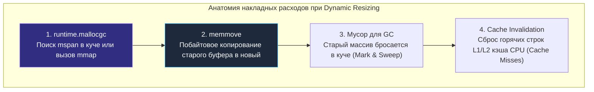
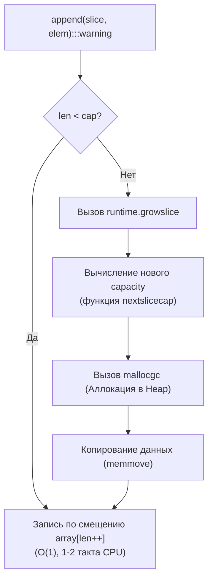
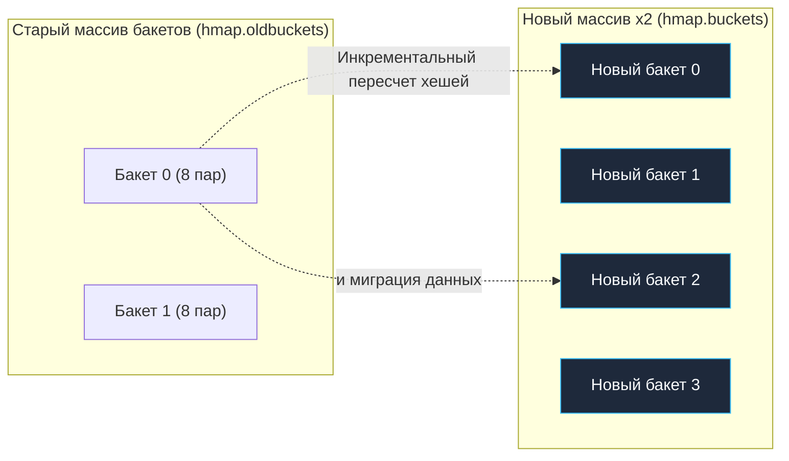

## Предвыделение памяти: устранение скрытых задержек динамического роста

В предыдущей статье [[3. Reuse объектов]] мы исследовали архитектурные паттерны переиспользования памяти. Но прежде чем память станет кандидатом на повторное использование, её необходимо запросить у рантайма и операционной системы. И именно в этот момент многие разработчики закладывают мину замедленного действия в архитектуру своего приложения.

Главный скрытый враг предсказуемой производительности и первопричина внезапных скачков хвостовых задержек (Tail Latency P99/P99.9) — это **динамическое изменение размеров структур данных (Dynamic Resizing)** в процессе обработки сетевых запросов.

В скриптовых языках (Python, PHP, JavaScript) программист привыкает беззаботно наполнять массивы и словари вызовами `.append()` или `.push()`, перекладывая заботу о выделении памяти на плечи интерпретатора. В Go инженерное мастерство требует глубокого понимания механики роста коллекций и применения **Предвыделения памяти (Preallocation)** везде, где объем данных известен заранее или может быть разумно спрогнозирован.

---

## Mechanical Sympathy: Цена динамического роста

Когда вы добавляете элемент в массив, под капотом которого исчерпана емкость (`capacity`), процессор не может просто «дописать» байты в конец существующего блока: пространство за пределами буфера в куче уже занято другими переменными или соседними `mspan`.



Чтобы коллекция выросла, рантайм вынужден выполнить четыре тяжелые аппаратные операции:
1. Вызвать аллокатор `runtime.mallocgc` для выделения нового, более крупного непрерывного куска памяти в куче.
2. Использовать низкоуровневую инструкцию `memmove` для побайтового копирования старых данных в новый блок.
3. Оставить старый блок памяти "умирать", создавая паразитный объем работы для фаз Mark и Sweep сборщика мусора.
4. **Уничтожить кэш-линии (Cache Invalidation):** Процессор уже прогрел старый массив в быстром L1/L2 кэше. Перенос данных в новую область виртуальной памяти гарантирует серию болезненных кэш-промахов (Cache Misses) при последующих обращениях.

Рассмотрим, как этот механизм работает в ключевых встроенных типах Go.

---

## 1. Слайсы и коварство runtime.growslice

Слайс в Go — это сверхлегковесная структура из трех полей (24 байта на 64-битной архитектуре): указатель на базовый массив `array`, текущая длина `len` и предельная вместимость `cap`.

При вызове встроенной функции `append`, рантайм проверяет условие: `len < cap`. Если свободное место есть, элемент записывается по смещению базового массива, а `len` инкрементируется за 1–2 такта процессора ($O(1)$).

Но как только `len == cap`, компилятор генерирует переход на системную функцию рантайма `runtime.growslice`.



> [!info] Под капотом: эволюция алгоритма nextslicecap
> До версии Go 1.18 действовало жесткое ступенчатое правило: если емкость среза меньше 1024 элементов, `cap` удваивался ($x2$). Если больше — емкость увеличивалась на 25% ($x1.25$). Это приводило к резким ступенькам и избыточному потреблению памяти (Over-allocation).
> 
> **Начиная с Go 1.18**, внедрен сглаженный алгоритм в функции `nextslicecap`: переход от удваивания к коэффициенту $~1.25$ происходит плавно в диапазоне от 256 элементов по формуле:
> $$\text{newcap} = \text{oldcap} + \frac{\text{oldcap} + 3 \times 256}{4}$$
> Это существенно снизило фрагментацию памяти при работе с большими слайсами.

### Практическое применение

Если итоговый размер коллекции известен заранее, **всегда** передавайте третьим аргументом емкость `capacity`:

```go
// ПЛОХО: O(N) скрытых аллокаций и постоянные memmove при заполнении
func getUserIDs(users []User) []int64 {
    var ids []int64
    for _, u := range users {
        ids = append(ids, u.ID) // Скрытые аллокации здесь!
    }
    return ids
}

// ХОРОШО: Ровно 1 аллокация, 0 лишних копирований памяти
func getUserIDs(users []User) []int64 {
    ids := make([]int64, 0, len(users)) // Предвыделение cap
    for _, u := range users {
        ids = append(ids, u.ID)
    }
    return ids
}
```

> [!warning] Ловушка / Gotcha: путаница между len и cap
> Классическая ошибка, регулярно встречающаяся на код-ревью:
> ```go
> // ОШИБКА:
> ids := make([]int64, len(users)) // создает слайс, где len И cap равны N. Все элементы = 0!
> for _, u := range users {
>     ids = append(ids, u.ID) // append добавит элементы В КОНЕЦ, начиная с индекса N!
> }
> ```
> В результате функция вернет слайс длиной `2 * N`, первая половина которого заполнена нулями.  
> **Правило:**
> - Для использования с `append` пишите: `make([]T, 0, expectedCapacity)`.
> - Для прямой записи по индексам (`ids[i] = u.ID`) пишите: `make([]T, expectedLen)`. Прямая индексация работает даже быстрее `append`, так как компилятор часто полностью элиминирует bounds checking.

---

## 2. Мапы (Maps) и дорогая эвакуация

Внутреннее устройство `map` в Go (структура `hmap`) представляет собой хеш-таблицу, состоящую из массива бакетов (`bmap`). Каждый бакет фиксированно вмещает ровно 8 пар «ключ-значение».

Когда в мапу добавляются новые записи, рантайм отслеживает средний коэффициент заполнения — **Load Factor**. В Go критический порог Load Factor строго зафиксирован константой и равен **6.5** (в среднем 6.5 элементов на один бакет). Как только порог превышен (или количество переполняющих overflow-бакетов становится избыточным), рантайм запускает процедуру **Эвакуации (Evacuation)**.



Эвакуация — это тяжелейший процесс для хвостовых задержек:
1. Выделяется новый массив бакетов, ровно в 2 раза превышающий исходный.
2. Текущий массив бакетов помечается как `oldbuckets`.
3. При каждой последующей операции мутации (вставка, перезапись, удаление) рантайм эвакуирует 1–2 бакета из старой памяти в новую (Incremental Evacuation).

Хотя инкрементальный перенос спасает от полной остановки мира (Stop-The-World), он размазывает деградацию производительности (CPU Throttling) на тысячи последующих HTTP-запросов.

### Практическое применение

Второй аргумент функции `make` для мапы задает подсказку размера (hint):

```go
// ПЛОХО: Размер неизвестен, мапа будет многократно удваиваться с эвакуацией
m := make(map[string]User)

// ХОРОШО: Рантайм выделит правильный массив бакетов СРАЗУ
m := make(map[string]User, 10000)
```

> [!info] Под капотом: вычисление бакетов из hint
> Число `10000` в `make(map, hint)` — это **не количество бакетов**, а количество элементов, которое вы планируете сохранить. Рантайм делит это число на целевой Load Factor (6.5) и вычисляет степень двойки $2^B$, необходимую для размещения бакетов без единой эвакуации.

---

## 3. strings.Builder и bytes.Buffer

Так как строки в Go абсолютно иммутабельны, наивная конкатенация через оператор `+` (например, `str3 := str1 + str2`) всегда выделяет новую память размером `len(str1) + len(str2)` и копирует туда обе строки. В цикле это дает квадратичную сложность $O(N^2)$ и лавину мусора.

Для эффективной конструирования строк используется `strings.Builder`. Под капотом он инкапсулирует обычный байтовый срез `[]byte`, который мутируется in-place, а при вызове `String()` возвращает строку через zero-copy `unsafe`-преобразование.

Однако слайс внутри `strings.Builder` также растет через системный `growslice`! Если вы генерируете объемный JSON, HTML-шаблон или SQL-запрос, `Builder` будет тратить время на реаллокации.

### Практическое применение: метод Grow()

Всегда оценивайте максимальный размер формируемой строки и вызывайте метод `Grow()`:

```go
func buildQuery(columns []string, table string) string {
    var sb strings.Builder
    
    // Предвычисляем примерный размер (экономим аллокации в цикле)
    expectedSize := len(table) + 30 // Базовый запрос "SELECT ... FROM table"
    for _, col := range columns {
        expectedSize += len(col) + 2 // Столбцы + запятые
    }
    
    // Предвыделение буфера одним куском
    sb.Grow(expectedSize) 
    
    sb.WriteString("SELECT ")
    for i, col := range columns {
        sb.WriteString(col)
        if i < len(columns)-1 {
            sb.WriteString(", ")
        }
    }
    sb.WriteString(" FROM ")
    sb.WriteString(table)
    
    return sb.String()
}
```

> [!tip] Собеседование
> **Вопрос:** В чем принципиальная разница между `strings.Builder` и `bytes.Buffer`, и почему для генерации строк предпочтителен именно первый?  
> **Ответ:** Метод `bytes.Buffer.String()` выполняет полноценную аллокацию памяти и побайтовое копирование слайса `[]byte` в новую иммутабельную строку. В отличие от него, `strings.Builder.String()` выполняет zero-copy приведение через `unsafe.String`, заимствуя базовый байтовый массив без единой аллокации. Платой за это является защита от копирования: структура `strings.Builder` содержит защитное поле `noCopy`, и попытка скопировать инстанс билдера по значению после начала записи вызовет немедленную панику.

---

## Итог

1. **Предвыделение памяти (`make` с `capacity`)** — самый дешевый, чистый и эффективный способ ускорить Go-код без усложнения архитектуры.
2. **Не путайте `len` и `cap`:** для наполнения через `append` инициализируйте слайс как `make([]T, 0, cap)`.
3. **Всегда передавайте hint в `make(map[K]V, hint)`:** это исключает катастрофическую эвакуацию бакетов и перехеширование под нагрузкой.
4. **Используйте `Grow(n)` в `strings.Builder` и `bytes.Buffer`:** предварительное бронирование буфера гарантирует нулевые реаллокации при сборке длинных строк.

Знание о том, как аллоцируется память — это фундамент. Однако сама форма данных, которые мы размещаем в памяти, играет не менее важную роль. Как правильный порядок полей в структуре способен сэкономить до 30% оперативной памяти и устранить промахи кэша процессора? Разберем в следующей главе: [[5. Оптимизация структур данных]].