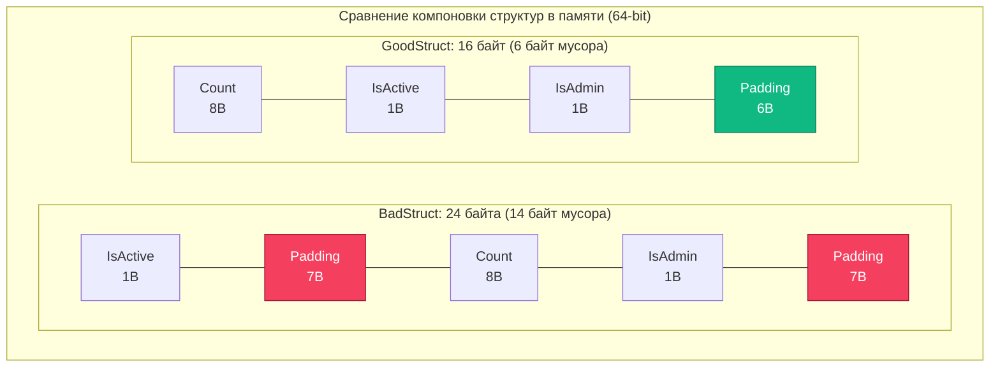

## Оптимизация структур данных: выравнивание, паддинг и магия нулевых структур

В предыдущих главах ([[1. Уменьшение аллокаций]] и [[4. Предвыделение памяти]]) мы научились жестко контролировать *количество* выделяемой памяти и жизненный цикл объектов в куче. Однако существует не менее важный аспект, напрямую определяющий аппаратную производительность сервиса: **то, как именно поля структур физически упакованы в оперативной памяти**.

В языках с виртуальными машинами (Java, C# с CLR) или динамических средах порядок полей объекта в памяти часто оптимизируется JIT-компилятором автоматически. В Go всё устроено предельно честно и бескомпромиссно: структура в памяти выглядит ровно так, как вы объявили её в исходном коде. Компилятор Go не переставляет поля местами ради вашей выгоды. И это возлагает полную ответственность за **оптимизацию структур данных (Data Structure Optimization)** на плечи инженера.

Один небрежный порядок полей способен выбросить на свалку от 30% до 50% оперативной памяти процесса и замедлить доступ к данным в разы из-за расщепления машинных слов и промахов процессорного кэша.

---

## Mechanical Sympathy: Выравнивание памяти (Memory Alignment)

Современные процессоры не читают оперативную память по отдельным байтам. Они оперируют **машинными словами (Words)**. На 64-битных архитектурах (x86-64, ARM64) размер машинного слова составляет 8 байт (64 бита), и шина памяти перекачивает данные блоками, кратными 8 байтам.

Представьте, что 8-байтное число (например, `int64`) оказалось записано по нечетному адресу, не кратному 8 (например, со смещения 3). Чтобы прочитать такое значение, процессору придется совершить два последовательных цикла чтения из памяти (прочитать первое 8-байтное слово, затем второе 8-байтное слово), после чего сдвигами и битовыми масками склеить половинки в целевом регистре. Это явление называется **невыровненным доступом (Unaligned Memory Access)**. На некоторых архитектурах (например, старых ревизиях ARM или MIPS) это вызывает аппаратное прерывание (Hardware Fault) и аварийный сбой программы.

Чтобы исключить штрафные циклы процессора, компилятор Go выполняет **выравнивание памяти (Memory Alignment)**. Он гарантирует, что переменная каждого типа размещается по адресу, кратному ее базовому размеру:
- `bool`, `byte`, `uint8` (1 байт) — выравнивание 1 байт (может лежать по любому адресу).
- `int16`, `uint16` (2 байта) — адрес кратен 2.
- `int32`, `uint32`, `float32` (4 байта) — адрес кратен 4.
- `int64`, `uint64`, `float64`, указатели (`*T`), интерфейсы (`eface`/`iface`) — адрес обязан быть кратен 8 (на 64-битных платформах).

---

## Padding (Заполнение): Куда утекает память

Чтобы гарантировать выравнивание каждого поля при их последовательном размещении, компилятор вынужден вставлять между ними пустые байты-заполнители — **Padding**.

Взглянем на классический пример неудачной компоновки:

```go
package main

import (
	"fmt"
	"unsafe"
)

type BadStruct struct {
	IsActive bool    // 1 байт
	Count    int64   // 8 байт
	IsAdmin  bool    // 1 байт
}

func main() {
	fmt.Println(unsafe.Sizeof(BadStruct{})) // Напечатает: 24 байта!
}
```

Полезных данных здесь всего 10 байт ($1 + 8 + 1$). Куда делись еще 14 байт?

1. `IsActive` занимает смещение 0 (1 байт).
2. Следующее поле `Count` требует 8-байтного выравнивания. Компилятор не может положить его на смещение 1, поэтому вставляет **7 байт паддинга**.
3. `Count` ложится на смещения 8–15 (8 байт).
4. `IsAdmin` ложится на смещение 16 (1 байт).
5. **Завершающий паддинг (Trailing Padding):** Размер всей структуры обязан быть кратен размеру ее максимального поля (8 байт), чтобы при создании массива `[]BadStruct` элементы оставались выровненными. Компилятор добавляет еще **7 байт паддинга** в конец.



Если в вашей системе хранится кэш на 10 миллионов таких структур, вы впустую расходуете **140 Мегабайт** оперативной памяти на хранение нулей!

---

## Правило оптимизации: Сортировка по убыванию размера

Решение проблемы элегантно: группируйте поля так, чтобы они плотно заполняли 8-байтные кванты памяти. Простое и безотказное инженерное правило: **сортируйте поля структуры по убыванию их размера**.

```go
type GoodStruct struct {
	Count    int64   // 8 байт
	IsActive bool    // 1 байт
	IsAdmin  bool    // 1 байт
}

// unsafe.Sizeof(GoodStruct{}) вернет ровно 16 байт!
```

Раскладка `GoodStruct` в памяти:
1. `Count` занимает смещения 0–7 (8 байт).
2. `IsActive` занимает смещение 8 (1 байт).
3. `IsAdmin` занимает смещение 9 (1 байт).
4. Завершающий паддинг для кратности 8 байтам — всего **6 байт** в конце (смещения 10–15).

Простым перемещением строчки кода в файле мы сократили потребление памяти на **33%** и улучшили плотность упаковки данных в кэш-линиях CPU!

> [!tip] Собеседование
> **Вопрос:** Нужно ли всегда маниакально сортировать поля во всех структурах проекта?  
> **Ответ:** Нет. Читаемость кода важнее слепых микрооптимизаций. Сортировать поля имеет смысл только для структур, которые инстанцируются в гигантских количествах (сотни тысяч и миллионы экземпляров в слайсах, кэшах, кольцевых буферах). Для конфигурационных DTO или структур зависимостей сервиса логическая группировка полей несравнимо важнее экономии пары десятков байт.

### Автоматический аудит через fieldalignment

Вам не нужно рассчитывать паддинги вручную с калькулятором. В официальном тулинге Go есть статический анализатор `fieldalignment`:

```bash
go install golang.org/x/tools/go/analysis/passes/fieldalignment/cmd/fieldalignment@latest
fieldalignment ./...
```

Анализатор находит неоптимальные структуры и с флагом `-fix` автоматически переставляет поля в коде.

---

## Магия struct{} (Пустая структура)

Отдельного восхищения заслуживает тип **`struct{}` (пустая структура)**. Ее размер равен строго **0 байт**:

```go
unsafe.Sizeof(struct{}{}) // 0 байт
```

Она не требует выравнивания, не занимает физического места в оперативной памяти и не создает нагрузки на сборщик мусора. Это делает пустую структуру идеальным строительным блоком для двух высоконагруженных паттернов:

### 1. Сигнальные каналы (Semaphores / Signals)

Если вам нужен канал исключительно для уведомления горутины о событии (например, `done chan struct{}`), использование `chan bool` или `chan int` будет тратить память на передачу ненужных значений. `chan struct{}` передает "ничто", сигнализируя самим фактом события:

```go
// ХОРОШО: 0 байт на полезную нагрузку
done := make(chan struct{})

// Сигнал о завершении
close(done) // или done <- struct{}{}
```

### 2. Реализация Set (Множества)

Поскольку в стандартной библиотеке Go нет встроенного типа `Set`, каноническая реализация строится на базе `map[Type]struct{}`:

```go
// ХОРОШО: значения map не занимают памяти в бакетах
visited := make(map[string]struct{})
visited["user_1"] = struct{}{} // Вставка элемента

if _, exists := visited["user_1"]; exists {
    // Элемент присутствует
}

// ПЛОХО: Использование bool тратит 1 байт на каждое значение в бакете
visitedBad := make(map[string]bool)
```

> [!info] Под капотом: переменная zerobase
> Как рантайм Go обращается к переменным нулевого размера, если они не занимают байтов?  
> В исходном коде рантайма (`runtime/malloc.go`) объявлена специальная глобальная статическая переменная `zerobase uintptr`. При любой аллокации в куче объекта размером 0 байт (пустые структуры `struct{}{}`, пустые массивы `[0]int`) рантайм всегда возвращает указатель на эту единственную системную переменную `zerobase`!

> [!warning] Ловушка / Gotcha: сравнение указателей на struct{}
> Из-за существования `zerobase` возникает классический каверзный вопрос на собеседованиях:
> ```go
> a := struct{}{}
> b := struct{}{}
> fmt.Println(&a == &b)
> ```
> Что выведет этот код? Спецификация Go прямо заявляет:  
> *"Pointers to distinct zero-size variables may or may not be equal"*.  
> Если переменные утекают в кучу (Escape Analysis), рантайм вернет для обеих адрес `zerobase`, и сравнение даст `true`. Если же переменные остаются на стеке функции, компилятор может выдать им разные смещения на стеке, и результат будет `false`!  
> **Никогда не завязывайте бизнес-логику на сравнение адресов пустых структур.**

---

## Итог

1. **Выравнивание памяти (Memory Alignment)** — фундаментальное требование аппаратной части CPU, предотвращающее расщепление машинных слов при чтении.
2. **Паддинг (Padding)** — плата за выравнивание. Неправильный порядок полей может раздувать структуру на 30–50%.
3. **Золотое правило компоновки:** сортируйте поля от большего к меньшему (`int64`, указатели ──► `int32`, `float32` ──► `int16` ──► `bool`, `byte`).
4. **Используйте утилиту `fieldalignment`** для аудита структур в CI/CD пайплайнах.
5. **Пустая структура `struct{}` (0 байт)** — идеальный инструмент для реализации множеств (Set) и сигнальных каналов без накладных расходов.

Оптимизируя размер и выравнивание структуры, мы решили проблему объема памяти (Capacity). Но размер структуры — это лишь половина уравнения. То, как эти структуры размещаются в процессорном кэше и не вызывают ли они инвалидацию соседних ядер (False Sharing), определит скорость работы ваших параллельных алгоритмов.

Об этом мы поговорим в следующей статье: [[6. Cache friendly структуры]].