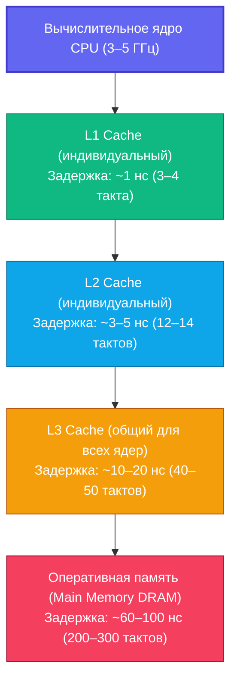
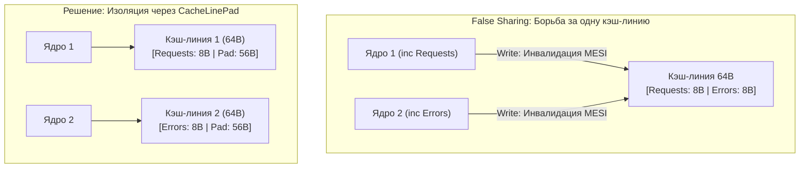

## Cache friendly структуры: проектирование структур данных под кэши CPU

В предыдущей главе [[5. Оптимизация структур данных]] мы научились бережно экономить оперативную память (RAM), правильно выравнивая поля структур и устраняя паразитный паддинг. Мы научились мыслить категориями мегабайт и гигабайт. Однако в настоящей высоконагруженной инженерии действует строгое правило: **мало просто компактно упаковать данные в оперативной памяти — критически важно обеспечить их быстрое чтение процессорными ядрами**.

Современный процессор работает на головокружительных частотах в 3–5 ГГц. Каждая базовая арифметическая или логическая инструкция совершается за доли наносекунды (0.2–0.3 нс). При этом обращение к оперативной памяти (DRAM) требует от 50 до 100 наносекунд. С точки зрения исполнительного конвейера процессора, поход в оперативную память — это ожидание длиною в вечность: за время одного обращения к DRAM процессор мог бы выполнить 300–500 полезных инструкций!

Чтобы вычислительные ядра не простаивали в постоянном голодании, кремниевые кристаллы снабжаются трехуровневой иерархией кэшей: сверхбыстрыми L1 и L2 (индивидуальными для каждого ядра) и разделяемым L3. Написание программ, которые максимизируют попадание в эти кэши (**Cache Friendliness**), — это абсолютная вершина механического сочувствия к машине ([[5. Mechanical sympathy в backend разработке]]).



---

## Mechanical Sympathy: Кэш-линии и Префетчер

Когда ваш код читает из памяти одну переменную `x` типа `int32` (всего 4 байта), контроллер памяти процессора **никогда не читает 4 байта**. Он запрашивает у системной шины и затягивает в кэш целый непрерывный квант размером в **64 байта** (на архитектурах x86-64 и ARM64). Этот квант называется **Кэш-линией (Cache Line)**.

Вместе с запрошенными 4 байтами переменной `x` процессор "бесплатно" доставляет в горячий L1-кэш соседние 60 байт, физически расположенные рядом с `x`.

Кроме того, в кремний каждого современного ядра встроен аппаратный предсказатель доступа — **Prefetcher (Аппаратный префетчер)**. Если префетчер фиксирует, что программа читает данные последовательно (адрес 0, затем 64, затем 128), он мгновенно распознает паттерн линейного обхода и начинает заблаговременно подкачивать следующие кэш-линии из DRAM в L1/L2 кэши *до того*, как процессорная инструкция успеет их запросить.

Задача инженера — проектировать структуры и алгоритмы так, чтобы каждый загруженный 64-байтный блок памяти использовался на 100%, а префетчер легко угадывал направление чтения. Это фундаментальное свойство алгоритмов называется **Пространственной локальностью (Spatial Locality)**.

---

## 1. Слайсы значений против Слайсов указателей

Это классическая архитектурная ловушка для новичков в Go. Разработчики, пришедшие из Java, PHP или C#, привыкают к тому, что любой объект по умолчанию является ссылкой, и по инерции создают слайсы указателей.

```go
// ПЛОХО: Слайс указателей (Pointer Chasing, хаос в кэше)
users := make([]*User, 1000)

// ХОРОШО: Слайс значений (Непрерывный блок памяти)
users := make([]User, 1000)
```

### Почему слайс указателей разрушает кэш?

Срез `[]*User` представляет собой непрерывный массив 8-байтных адресов. Когда процессор читает первый элемент, он загружает в кэш-линию 8 соседних указателей. Но чтобы прочитать *сами данные* пользователя (поля структуры `User`), ядру необходимо разыменовать указатель и обратиться по адресу в кучу (Heap).

А в куче эти объекты разбросаны аллокатором в случайных местах адресного пространства. Префетчер бессилен: при каждом переходе по указателю процессор сталкивается с **Cache Miss (кэш-промахом)** и вынужден ждать 80 нс, пока данные придут из DRAM.

Напротив, срез `[]User` размещается в оперативной памяти как единый сплошной массив байтов. Если структура `User` занимает 32 байта, то в одну 64-байтную кэш-линию помещается ровно два пользователя. Процессор сканирует структуры на предельной пропускной способности шины памяти.

> [!tip] Собеседование
> **Вопрос:** В каких ситуациях все-таки стоит использовать `[]*User` вместо `[]User`?  
> **Ответ:**  
> 1. Если размер структуры огромен (например, 1 КБ и больше), копирование по значению при `append` или передаче в функции убьет производительность.  
> 2. Если объекты шарятся между разными коллекциями, и их мутация в одной мапе/слайсе должна синхронно отражаться везде.  
> 3. Если требуется поддержка `nil` для обозначения "пустого" слота.  
> Во всех остальных случаях для массовой обработки (batch processing) выбирайте слайсы значений.

---

## 2. Матрицы: Строки против Столбцов

Классический тест на понимание работы кэша. Двумерный массив в Go (например, `matrix [1000][1000]int64`) в оперативной памяти лежит как один длинный плоский кусок. Элементы одной строки лежат рядом.

```go
// ПЛОХО: Итерация по столбцам (Column-major)
func sumCols(m [][]int64) int64 {
    var sum int64
    for j := 0; j < len(m[0]); j++ {
        for i := 0; i < len(m); i++ {
            // Прыгаем через тысячи байт на каждой итерации!
            sum += m[i][j] 
        }
    }
    return sum
}

// ХОРОШО: Итерация по строкам (Row-major)
func sumRows(m [][]int64) int64 {
    var sum int64
    for i := 0; i < len(m); i++ {
        for j := 0; j < len(m[0]); j++ {
            // Читаем непрерывный кусок памяти, префетчер счастлив
            sum += m[i][j] 
        }
    }
    return sum
}
```

В варианте `sumCols` при чтении `m[0][0]` ядро загружает 64-байтную кэш-линию, содержащую элементы `m[0][0]...m[0][7]`. Но на следующей итерации внутренний цикл запрашивает элемент `m[1][0]`, который находится на тысячи байт дальше! Загруженная кэш-линия отбрасывается, использовав всего 8 полезных байт из 64. На больших матрицах `sumRows` опережает `sumCols` в 10–25 раз исключительно за счет работы кэша.

---

## 3. Data-Oriented Design: AoS vs SoA

В классическом объектно-ориентированном программировании сущности проектируются так, как они представляются в предметной области. Этот подход называется **AoS (Array of Structs — массив структур)**.

Представим высоконагруженный сессионный сервис, в котором фоновый воркер каждую секунду фильтрует 1 миллион активных сессий и удаляет просроченные:

```go
// AoS - Массив структур
type Session struct {
    ID        [16]byte // 16 байт
    UserID    int64    // 8 байт
    ExpiresAt int64    // 8 байт
    Payload   [96]byte // 96 байт
} // Итого: 128 байт (ровно 2 кэш-линии)

func cleanup(sessions []Session, now int64) {
    for i := range sessions {
        if sessions[i].ExpiresAt < now { // Нам нужно только одно поле!
            // удаление...
        }
    }
}
```

Каждая структура `Session` занимает 128 байт (ровно 2 полные кэш-линии). Чтобы просто проверить 8-байтное число `ExpiresAt`, процессор вынужден затягивать в кэш L1 огромный массив `Payload`, `ID` и `UserID`, которые в этом цикле абсолютно не нужны. Полезная утилизация кэша составляет мизерные 6.25% ($8 / 128$), а кэш забивается бесполезным транзитным мусором.

Продвинутый инженерный паттерн из Data-Oriented Design — **SoA (Struct of Arrays — структура массивов)**. Мы декомпозируем структуру на параллельные срезы:

```go
// SoA - Структура массивов
type Sessions struct {
    IDs        [][16]byte
    UserIDs    []int64
    ExpiresAts []int64 // Сплошной непрерывный массив int64!
    Payloads   [][96]byte
}

func cleanup(s *Sessions, now int64) {
    for i := range s.ExpiresAts {
        if s.ExpiresAts[i] < now {
            // В одну 64-байтную кэш-линию помещается ровно 8 таймстемпов!
            // удаление по индексу i из остальных массивов...
        }
    }
}
```

При подходе SoA массив `ExpiresAts` лежит в памяти монолитным блоком. В одну 64-байтную кэш-линию помещается сразу **8 последовательных таймстемпов**. Кэш-промахи практически исчезают, а префетчер работает на пределе возможностей кремния. Этот паттерн является стандартом де-факто в GameDev (архитектура ECS), аналитических СУБД (ClickHouse) и Highload-трейдинге.

---

## 4. Изоляция кэш-линий (Padding) против False Sharing

В многопоточных сервисах кэш-линии процессора могут превратиться в источник критической деградации параллелизма ([[8. False sharing]] и [[9. Cache line и выравнивание]]).

Если две параллельные горутины, исполняющиеся на разных физических ядрах CPU, активно инкрементируют две *разные* переменные, но эти переменные расположены в памяти рядом (внутри одной 64-байтной кэш-линии), процессоры вступают в конкуренцию по аппаратному протоколу когерентности кэшей MESI. Каждая запись на одном ядре принудительно инвалидирует всю кэш-линию на втором ядре, заставляя ядра непрерывно пересылать кэш-линию по межъядерной шине (**Cache Line Bouncing / False Sharing**).



Чтобы сделать многопоточную структуру по-настоящему Cache Friendly, независимые горячие счетчики необходимо физически разносить по разным кэш-линиям с помощью изолирующего паддинга:

```go
import "golang.org/x/sys/cpu"

type Metrics struct {
    // Ядро 1 инкрементирует счетчик запросов
    Requests uint64 
    
    // Добавляем 56 пустых байт (64 - 8). 
    // Теперь Errors гарантированно лежит в другой кэш-линии!
    _ [56]byte 
    
    // Ядро 2 инкрементирует счетчик ошибок
    Errors   uint64 
}

// Или более идиоматичный вариант через пакет golang.org/x/sys/cpu:
type MetricsPro struct {
    Requests uint64
    _        cpu.CacheLinePad
    Errors   uint64
}
```

> [!warning] Ловушка / Gotcha: Чрезмерный CacheLinePad
> Не добавляйте `cpu.CacheLinePad` во все подряд структуры сервиса! Изоляция требуется **исключительно** для узких мест с колоссальной конкурентной записью: глобальные метрики, lock-free очереди, кольцевые буферы. В обычных структурах данных паддинг лишь раздует потребление памяти и вызовет лишние промахи кэша.

---

## Итог

1. **Кэш-линия (64 байта)** — неделимый атомарный блок обмена между оперативной памятью и ядрами CPU.
2. **Пространственная локальность:** располагайте данные так, чтобы каждый байт загруженной кэш-линии выполнял полезную работу.
3. **Слайсы значений (`[]T`) вместо слайсов указателей (`[]*T`):** устраняют губительный Pointer Chasing и позволяют префетчеру загружать данные заблаговременно.
4. **Матрицы и многомерные массивы:** всегда обходите в порядке строк (Row-Major), исключая прыжки по адресам.
5. **Data-Oriented подход (SoA):** разделение структур на параллельные срезы ускоряет аналитические циклы в разы.
6. **False Sharing:** изолируйте параллельно мутируемые поля с помощью `cpu.CacheLinePad`.

Мы разобрали, как выжать максимум из кремния за счет дружелюбных к кэшу структур данных. Но иногда лучшая оптимизация — это безжалостное устранение слоев абстракций, добавленных в проект "на вырост". В следующей главе мы разберем, как лишние интерфейсы, пустые обертки и reflection уничтожают производительность: [[7. Удаление лишних абстракций]].