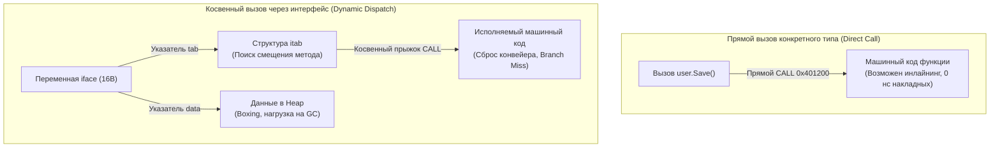

## Цена "Чистого кода" и ООП-наследия

Инженерное искусство часто путают с искусством украшения кода. Когда разработчики приходят в Go из объектно-ориентированных экосистем (Java, C# или корпоративного PHP), они нередко приносят с собой багаж тяжеловесных паттернов «кровавого энтерпрайза»: фабрики фабрик, сервисные локаторы, оборачивание каждого чиха в интерфейс «на случай будущей расширяемости» и многослойную луковую архитектуру из 5–7 уровней косвенности (`Controller` ──► `Service` ──► `UseCase` ──► `Repository` ──► `Driver`).

Для академических диаграмм и формального покрытия юнит-тестами это кажется идеальным. Но с точки зрения высокопроизводительной низкоуровневой инженерии (Highload & Performance), **любая абстракция имеет физическую цену на уровне кремния, регистров и оперативной памяти**.

Go — это язык с классической статической AOT-компиляцией (Ahead-Of-Time). В отличие от виртуальной машины Java, где адаптивный JIT-компилятор (HotSpot) может в рантайме обнаружить мономорфный вызов, выполнить девиртуализацию интерфейса и на лету заинлайнить машинный код, компилятор Go принимает все ключевые оптимизационные решения строго на этапе сборки бинарника. Если вы скрыли конкретный тип за интерфейсом, компилятор Go разводит руками и генерирует медленный путь косвенного вызова.

В этой главе мы разберем, когда и почему абстракции нужно безжалостно удалять ради сохранения предсказуемой производительности.

---

## 1. Интерфейсы и Динамическая диспетчеризация (Dynamic Dispatch)

Интерфейсы — краеугольный камень полиморфизма в Go. Однако плата за вызов метода через интерфейс несравнимо выше прямого вызова метода конкретной структуры.

> [!info] Под капотом: анатомия вызова iface
> Переменная непустого интерфейса в памяти представлена структурой `iface` размером 16 байт (на 64-битных системах) и состоит из двух указателей:
> 1. `tab` — указатель на интерфейсную таблицу `itab` (Interface Table), содержащую метаданные конкретного типа и таблицу виртуальных адресов методов.
> 2. `data` — указатель на сами данные экземпляра структуры в куче (Heap).
> 
> Когда программа выполняет вызов `user.Save()`, где `user` объявлен как интерфейс `UserRepository`, процессор выполняет **косвенный вызов (Indirect Call)**:
> 1. Загружает адрес структуры `iface` в регистр.
> 2. Разыменовывает указатель `tab` и переходит по адресу структуры `itab`.
> 3. Извлекает адрес функции по фиксированному смещению метода.
> 4. Совершает косвенный прыжок инструкции `CALL`, передавая указатель `data` в качестве первого аргумента (receiver).



### Аппаратные штрафы динамической диспетчеризации:

1. **Кэш-промахи (Cache Misses):** Чтение указателей `tab` и `data` требует переходов по разрозненным областям памяти, разрушая пространственную локальность данных ([[6. Cache friendly структуры]]).
2. **Сбои конвейера (Branch Misprediction):** Аппаратный предсказатель ветвлений CPU не способен заблаговременно загрузить инструкции по целевому адресу косвенного перехода. Конвейер процессора сбрасывается, сжигая 15–20 тактов вхолостую.
3. **Блокировка инлайнинга (Inlining Block):** Компилятор принципиально не может встроить тело метода в место вызова, поскольку на этапе компиляции конкретная реализация интерфейса неизвестна.
4. **Утечка в кучу (Escape Analysis & Boxing):** Передача значения в интерфейс почти всегда отправляет структуру в кучу, поскольку поле `data` внутри `iface` способно хранить только указатель. Это порождает паразитные аллокации и работу для сборщика мусора ([[1. Уменьшение аллокаций]]).

**Инженерное правило:** Если интерфейс имеет ровно одну реализацию в проекте и существует исключительно «ради мокирования в тестах», уберите его из критического пути выполнения (Hot Path). В парсерах пакетов, сетевых драйверах и циклах обработки байтов всегда принимайте и возвращайте **конкретные типы**.

---

## 2. Generics (Дженерики) как замена Boxing-у

До появления Go 1.18 единственным способом написания обобщенных коллекций и контейнеров данных (стеков, очередей, кэшей) было использование пустого интерфейса `interface{}` (ныне псевдоним `any`).

Использование `any` означало не только потерю контроля типов, но и гарантированную упаковку (Boxing) каждого примитива в кучу. Каждое извлечение элемента требовало динамической проверки типов (Type Assertion), сжигавшей такты процессора.

С внедрением дженериков компилятор Go получил механизм обобщенного программирования, снижающий накладные расходы через **мономорфизацию (Monomorphization)**.

```go
// ПЛОХО: Использование абстракции any
// Вызывает аллокацию при передаче числа и Type Assertion при чтении
type AnyStack struct {
    data []any
}
func (s *AnyStack) Push(v any) { s.data = append(s.data, v) }

// ХОРОШО: Использование Generics
// Никаких аллокаций для базовых типов. Строгая типизация.
type GenericStack[T any] struct {
    data []T
}
func (s *GenericStack[T]) Push(v T) { s.data = append(s.data, v) }
```

> [!tip] Собеседование: реализация дженериков в Go
> **Вопрос:** Могут ли дженерики в Go работать медленнее, чем интерфейсы?  
> **Ответ:** Да, в некоторых специфических сценариях. Чтобы не допустить раздувания размера бинарника (Code Bloat), компилятор Go использует гибридную модель (GCShape Stenciling with Dictionaries). Для всех типов указателей (`*User`, `*Order`) и интерфейсов компилятор генерирует единую общую реализацию машинного кода, которая обращается к неявному словарю типов (dictionary) для вызова специфических методов. Это вносит один уровень косвенности. Но для структур и примитивов (Value Types) компилятор выполняет честный стенсилинг (stenciling) — генерирует специализированный машинный код, полностью исключая аллокации и открывая дорогу агрессивному инлайнингу.

---

## 3. Рефлексия (Reflection) — абстракция с максимальным штрафом

Пакет `reflect` открывает возможность динамической инспекции типов, полей и методов во время работы программы. На рефлексии исторически построены стандартный пакет `encoding/json` и популярные ORM-библиотеки (вроде `gorm`).

Однако с точки зрения низкоуровневой производительности рефлексия катастрофически неэффективна:
1. Любой аргумент, переданный в `reflect.ValueOf` или `reflect.TypeOf`, принудительно упаковывается в `interface{}` и утекает в кучу.
2. Чтение полей и вызов методов через отражение порождают каскады динамических проверок типов, обходов списков и разыменований указателей в рантайме.
3. Код становится абсолютно непрозрачным для статического анализатора компилятора, лишая его возможности оптимизировать переходы и доступ к памяти.

**Как бороться:** Заменяйте динамическую рефлексию на **статическую кодогенерацию (Code Generation)**!

Вместо стандартного пакета `encoding/json`, который при каждом сетевом запросе заново парсит теги полей через `reflect`, используйте генераторы сериализаторов вроде `easyjson` или `ffjson`. Через утилиту `go generate` они компилируют специализированные, строго типизированные парсеры байтов под конкретные структуры. Сгенерированный код работает без аллокаций на рефлексию, опережая стандартный пакет в 3–5 раз.

---

## 4. Архитектурный оверхед: «Слои ради слоев»

Рассмотрим путь типового запроса на чтение профиля пользователя в приложении с догматичной «чистой архитектурой»:

```
HTTP Handler ──► UserService (Interface) ──► UserUseCase (Interface) ──► UserRepository (Interface) ──► PostgresDriver
```

Каждый промежуточный слой:
- Оборачивает или переупаковывает ошибки (`fmt.Errorf("...: %w", err)`), порождая аллокации.
- Перекладывает поля из DTO-структуры хэндлера в Доменную сущность, а затем в модель базы данных. Каждое перекладывание — это аллокация в памяти и лишняя нагрузка на Garbage Collector.
- Совершает вызовы через 3–4 интерфейса подряд, намертво блокируя инлайнинг компилятора на всем пути исполнения.

### Mechanical Sympathy подход: плоский код

Если ваш микросервис представляет собой типовой CRUD-сервис, перекладывающий записи из базы данных в JSON-ответы клиенту — **безжалостно удаляйте транзитные слои-пустышки**!

Вызывайте хранилище напрямую из хэндлера или компактного сервисного слоя. Считывайте поля из базы данных сразу в целевую выходную структуру DTO. В Go высоко ценится плоский (Flat), прямолинейный и кристально прозрачный код. Как гласит знаменитая пословица создателей языка:

> *"A little copying is better than a little dependency."*  
> (Немного дублирования кода лучше, чем лишняя зависимость или паразитная абстракция).

---

## Итог

1. **Интерфейсы имеют измеримую аппаратную цену:** Косвенные вызовы через `iface` разрушают конвейер процессора (Branch Misprediction), вызывают промахи кэша и блокируют инлайнинг. В горячих циклах используйте конкретные типы.
2. **Generics вместо `any`:** Заменяйте пустые интерфейсы на обобщенные типы (`GenericStack[T any]`), исключая упаковку примитивов в кучу.
3. **Кодогенерация вместо Reflection:** Заменяйте рантайм-рефлексию пакета `reflect` на генерацию специализированных парсеров до компиляции (`easyjson`, `ffjson`, `go generate`).
4. **Устраняйте «слои ради слоев»:** Если класс или модуль лишь транслирует вызов дальше без полезной трансформации бизнес-логики, удалите его.

Устраняя лишние уровни косвенности, мы делаем граф вызовов прозрачным для компилятора Go. А когда компилятор видит целевые функции напрямую, он может применить свое самое грозное оружие оптимизации — автоматическое встраивание тела функций.

Об этом фундаментальном механизме мы поговорим в следующей статье: [[8. Inline оптимизации]].