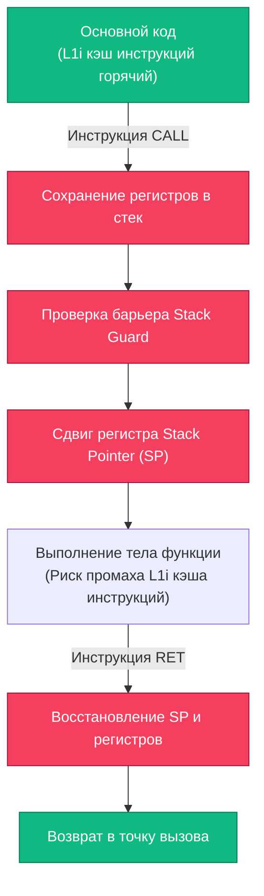

## Inline оптимизации: устранение накладных расходов вызова функций

В предыдущей главе [[7. Удаление лишних абстракций]] мы выяснили, что интерфейсы и избыточные архитектурные слои лишают компилятор возможности глубокой оптимизации: за пеленой динамической диспетчеризации он не видит конкретной реализации.

Но что именно происходит, когда компилятор Go видит прямой вызов конкретной функции без лишних абстракций? Он пускает в ход свое самое мощное и разрушительное для накладных расходов оружие — **автоматический инлайнинг (Inlining / Встраивание тела функций)**.

Для бэкенд-разработчика, проектирующего высоконагруженные сетевые сервисы, инлайнинг — это не просто деталь реализации компилятора, а базовый архитектурный рычаг, вокруг которого выстраивается проектирование горячих путей (Hot Paths) выполнения кода.

---

## Mechanical Sympathy: Цена вызова функции

В языках высокого уровня программисты часто считают вызов функции абсолютно бесплатной операцией. С точки зрения кремния и микроархитектуры процессора это далеко не так.

Когда поток инструкций доходит до машинной инструкции `CALL`, аппаратура CPU и рантайм Go выполняют целый комплекс действий:
1. **Сохранение контекста:** Адрес возврата (Instruction Pointer) и указатель базового фрейма (Base Pointer) сохраняются в стек памяти.
2. **Переход по адресу (Jump):** Процессор вынужден изменить счетчик команд и совершить прыжок в удаленную область памяти, где расположен машинный код вызываемой подпрограммы.
3. **Промах кэша инструкций (Instruction Cache Miss):** Если код функции не исполнялся недавно, его нет в сверхбыстром L1-кэше инструкций (L1i). Конвейер процессора замирает в ожидании подкачки опкодов из L2/L3 или DRAM.
4. **Пролог и эпилог функции Go:** В начале каждой функции рантайм Go выполняет проверку барьера стека (**Stack Guard**), чтобы при необходимости расширить сегмент стека горутины, и сдвигает указатель стека (`SP`) для выделения нового фрейма под локальные переменные. При возврате (`RET`) регистры и указатель `SP` восстанавливаются в обратном порядке.



**Инлайнинг** устраняет эти накладные расходы на корню: компилятор берет тело вызываемой функции и буквально «вклеивает» его в точку вызова на этапе компиляции. Инструкции `CALL` и `RET` исчезают, стек-фрейм не создается, а процессор исполняет линейный монолитный поток инструкций на максимальной скорости конвейера.

---

## Бюджет инлайнинга в Go

В отличие от языка C++ с его директивой `inline`, в Go программист не может насильно приказать компилятору встроить функцию (существует лишь запрещающая прагма `//go:noinline`). Компилятор Go принимает решение автономно, опираясь на строгий алгоритм расчета вычислительной сложности.

> [!info] Под капотом: расчет бюджета инлайнинга
> При синтаксическом разборе компилятор строит абстрактное синтаксическое дерево (AST) функции. Каждой синтаксической конструкции присваивается условный весовой коэффициент (стоимость в баллах).
> 
> Исторически и по сей день **базовый лимит (бюджет) инлайнинга составляет 80 единиц**. Если суммарная сложность AST-дерева функции превышает 80 баллов, компилятор отказывается от встраивания, чтобы предотвратить катастрофическое раздувание бинарного файла машинным кодом (Instruction Cache Bloat).

### Что моментально блокирует инлайнинг:
- **Чрезмерный объем:** Длинные функции с ветвистыми деревьями условий и десятками локальных переменных.
- **Встроенные перехватчики:** Вызовы `panic()` и `recover()`.
- **Сложные циклы:** Конструкции `select` и тяжелые циклы `for` (хотя в современных версиях Go 1.22+ компилятор научился инлайнить простые циклы).
- **Косвенные вызовы:** Вызовы методов через интерфейсы (без помощи PGO).

Проинспектировать решения компилятора по инлайнингу можно с помощью флагов сборщика:

```bash
# Флаг -m активирует печать оптимизаций. Двойной -m -m дает полную калькуляцию бюджета:
go build -gcflags="-m -m" main.go
```

В выводе консоли отображаются вердикты компилятора:
```
can inline calculateSum with cost 32 as: ...
cannot inline complexFunc: function too complex: cost 114 exceeds budget 80
```

---

## Синергия оптимизаций: Inline + Escape Analysis

Главная ценность инлайнинга выходит далеко за рамки экономии нескольких наносекунд на инструкции `CALL`. Инлайнинг выступает **мощнейшим катализатором Escape Analysis** ([[3. Escape analysis]]).

Рассмотрим показательный пример:

```go
type User struct {
    ID int
}

func NewUser(id int) *User {
    u := User{ID: id}
    return &u
}

func process() {
    user := NewUser(42)
    // работаем с user и выходим
    fmt.Println(user.ID)
}
```

Если бы компилятор не умел инлайнить код, функция `NewUser` была бы вынуждена вернуть указатель на свою локальную переменную `u`. Анализ времени жизни (Escape Analysis) не имел бы иного выбора, кроме как эвакуировать структуру `User` в кучу (Heap), вызвав полноценную аллокацию и увеличив работу для Garbage Collector.

Однако компилятор заинлайнил `NewUser` прямо в тело `process`:

```go
func process() {
    // Тело NewUser встроено напрямую в стек-фрейм process
    u := User{ID: 42}
    user := &u
    
    fmt.Println(user.ID)
}
```

Теперь анализатор компилятора видит всю картину целиком: переменная `u` никогда не покидает пределы функции `process`! Выделение памяти в куче отменяется, объект размещается на мгновенном стеке вызова (**Zero Allocation**), а сборщик мусора даже не узнает о его существовании.

---

## Паттерн: Fast-path / Slow-path

Паттерн **Fast-path / Slow-path** — золотой стандарт проектирования критических путей в рантайме Go (на нем построены `sync.Mutex`, сетевой поллер и внутренности `map`).

Если операция в 99% случаев выполняется по тривиальному сценарию (Fast-path), а в 1% случаев требует тяжелой логики, сетевого запроса или сложных блокировок (Slow-path) — **никогда не объединяйте их в одну монолитную функцию**!

```go
// ПЛОХО: Функция перегружена логикой. Бюджет AST превышен (>80).
// Функция НИКОГДА не заинлайнится, замедляя даже 99% тривиальных обращений.
func (c *Cache) Get(key string) (string, error) {
    c.mu.RLock()
    val, ok := c.data[key]
    c.mu.RUnlock()
    
    if ok {
        return val, nil
    }
    
    // Огромный кусок кода:
    // Поход в БД, логирование, аллокации метрик,
    // обновление локального кэша с Mutex.Lock() и т.д.
    return c.fetchFromDB(key)
}
```

### Высокопроизводительное решение

Вынесите тяжелую редкую ветку в отдельную вспомогательную функцию и запретите ее инлайнинг прагмой `//go:noinline`:

```go
// ХОРОШО: Fast-path компактен и легко инлайнится (cost < 80)
func (c *Cache) Get(key string) (string, error) {
    c.mu.RLock()
    val, ok := c.data[key]
    c.mu.RUnlock()
    
    if ok {
        return val, nil
    }
    
    // Вызов медленного пути (CALL произойдет только в 1% случаев)
    return c.getSlow(key) 
}

// Отделяем мухи от котлет. Эту функцию мы явно просим не инлайнить.
//go:noinline
func (c *Cache) getSlow(key string) (string, error) {
    // Вся сложная логика, БД, метрики...
    return c.fetchFromDB(key)
}
```

Теперь во всех точках вызова `Cache.Get()` компилятор встраивает проверку мапы прямо в вызывающий код. Чтение из кэша занимает считанные такты CPU.

---

## PGO (Profile-Guided Optimization)

Начиная с Go 1.20 и закрепившись в качестве стабильного стандарта в Go 1.21+, в инструментарии компилятора появилась поддержка **PGO (Profile-Guided Optimization)**. Это фундаментальный прорыв в оптимизации горячих путей.

Исторически вызов через интерфейс намертво блокировал инлайнинг. С технологией PGO вы можете снять репрезентативный CPU-профиль с боевого production-кластера под реальной нагрузкой (`pprof`), передать его компилятору на этапе сборки:

```bash
go build -pgo=default.pgo main.go
```

Компилятор анализирует профиль выполнения и производит направленные оптимизации:
1. Видит, что в 95% случаев за интерфейсом `UserRepository` скрывается конкретная структура `PostgresRepository`.
2. Проводит **девиртуализацию вызова (Devirtualization)** — генерирует проверку типа и заменяет косвенный прыжок через `itab` на прямой машинный вызов.
3. **Заинлайнивает** метод `PostgresRepository` непосредственно в вызывающую бизнес-логику!

> [!tip] Собеседование: почему компилятор не инлайнит всё подряд?
> **Вопрос:** Если инлайнинг настолько эффективен, почему компилятор Go просто не уберет порог бюджета в 80 единиц и не встроит абсолютно все функции программы?  
> **Ответ:** Это приведет к катастрофическому эффекту **Instruction Cache Thrashing (вымывание кэша инструкций)**.  
> Размер самого быстрого L1i-кэша инструкций процессора жестко ограничен (обычно всего 32–64 КБ на ядро). Если заинлайнить все функции, машинный код раздуется в десятки раз: одинаковые фрагменты будут растиражированы по всему адресному пространству. Процессор утратит возможность удерживать горячий цикл в L1i кэше и будет непрерывно простаивать в ожидании инструкций из DRAM, что сделает сервис в разы медленнее, чем при использовании обычных компактных инструкций `CALL`.

---

## Итог

1. **Инлайнинг (Inlining)** устраняет накладные расходы инструкции `CALL`, сохранение фрейма в стек и спасает от промахов L1i-кэша инструкций.
2. **Синергия с Escape Analysis:** встраивание функций позволяет компилятору доказать ограниченность времени жизни переменных и оставлять их на стеке, исключая аллокации в куче.
3. **Бюджет сложности:** следите за порогом в 80 баллов. Проверяйте решения компилятора через `go build -gcflags="-m -m"`.
4. **Паттерн Fast-path / Slow-path:** разделяйте частый легковесный код и тяжелую обработку исключений с помощью `//go:noinline`.
5. **PGO (Profile-Guided Optimization):** используйте производственные CPU-профили для девиртуализации интерфейсов и межпакетного инлайнинга.

Освоив контроль над аллокатором, структурами данных, кэш-линиями и оптимизатором компилятора, мы выходим на высший уровень инженерного мастерства. В финальной статье подраздела мы сведем все эти практики воедино и разберем бескомпромиссную парадигму экстремального бэкенда: [[9. Zero allocation подход]].