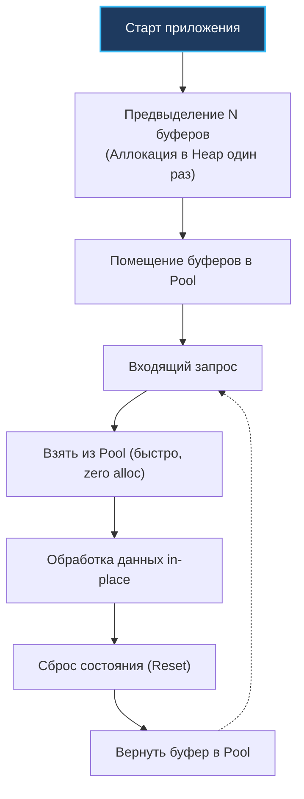

## Zero Allocation: Святой Грааль производительности

На протяжении предыдущих восьми глав мы последовательно препарировали ключевые механизмы оптимизации: от предвыделения памяти и инлайнинга до выравнивания структур и дружбы с процессорным кэшем. **Zero allocation (Нулевая аллокация)** — это не просто очередная точечная техника. Это экстремальная архитектурная парадигма и инженерный майндсет (mindset), объединяющий все изученные инструменты в единую бескомпромиссную систему.

В классическом корпоративном бэкенде (CRUD-сервисы, неспешные бизнес-пайплайны) аллокации в куче — это естественная и разумная плата за выразительность кода. Однако в системах высокочастотного трейдинга (HFT), рекламных аукционах реального времени (AdTech RTB), телеметрии и высоконагруженных API-шлюзах каждый такт процессора и каждая микросекунда задержки напрямую конвертируются в финансовый результат.

Zero allocation подход означает проектирование критических путей (Hot Paths) таким образом, чтобы во время непрерывной обработки рабочей единицы (HTTP-запроса, gRPC-фрейма, сообщения из брокера или сетевого пакета) **не происходило ни единого выделения памяти в куче (Heap)**.

---

### Mechanical Sympathy: Зачем нужен абсолютный ноль?

Как мы обсуждали в [[1. GC в Go. Обзор]], Garbage Collector в Go — один из наиболее совершенных конкурентных сборщиков мусора, однако его работа не бесплатна. Даже в параллельном режиме (Concurrent Mark) сборщик отбирает до 25% процессорного времени (GC Pacer), активирует системные барьеры записи (Write Barriers) и производит кратковременные остановки мира (Stop-The-World).

Чем больше объектов вы аллоцируете в куче, тем чаще рантайм Go запускает циклы сборщика мусора. Представьте сервис под нагрузкой в 100 000 RPS: если каждый входящий запрос создает всего 10 небольших временных объектов, в кучу ежесекундно выбрасывается **1 000 000 объектов**. Сборщик мусора начинает работать непрерывно, выжигая процессорный кэш (Cache Thrashing) и провоцируя непрогнозируемые спайки 99-го и 99.9-го перцентилей задержек (Tail Latency).

Zero allocation сводит эту проблему к абсолютному нулю. Нет нового мусора в куче — нет причин для запуска GC. Приложение переходит в состояние механической симпатии к процессору, когда скорость обработки ограничивается исключительно пропускной способностью шины RAM и кэшей процессора.


---

## 4 Столпа Zero Allocation архитектуры

Чтобы добиться чистых нулевых аллокаций, инженеру приходится писать код, разительно отличающийся от академического «чистого» Go. Приходится жертвовать привычной инкапсуляцией и отказываться от удобных абстракций ([[7. Удаление лишних абстракций]]).

### 1. Preallocation + Object Pools (Жизненный цикл "Аренда")
Ничего не создается динамически в момент поступления клиентского запроса. Вся необходимая память (буферы, контексты, структуры протоколов) выделяется при холодном старте приложения (Pre-allocation) и размещается в `sync.Pool` или кастомных локальных списках свободных блоков (Free Lists), как описано в [[3. Reuse объектов]].

Когда приходит запрос, мы берем память в «аренду», мутируем её in-place (на месте) и возвращаем обратно после обработки:



### 2. Value Semantics и Stack Allocation
Всё, что не удается переиспользовать в пуле, обязано гарантированно оставаться на стеке. Это требует передачи структур небольшого размера по значению, полного отказа от интерфейсов (чтобы избежать Boxing-а) и глубокого понимания механики [[3. Escape analysis]]. Благодаря агрессивному инлайнингу ([[8. Inline оптимизации]]), компилятор удерживает переменные на стеке вызывающей функции.

### 3. Zero-copy операции с I/O
Главный скрытый источник аллокаций в веб-серверах — это чтение байтов из сетевого сокета и непрерывное преобразование их в строки для маршрутизации или парсинга заголовков. В парадигме Zero allocation мы никогда не выполняем наивные приведения `string(bytes)` или `[]byte(str)`. Мы либо работаем со срезом `[]byte` напрямую, либо используем низкоуровневые функции `unsafe.String` и `unsafe.Slice` ([[1. Уменьшение аллокаций]]).

### 4. Custom parsers (Отказ от reflect)
Стандартный пакет `encoding/json` опирается на динамическую рефлексию, которая гарантированно аллоцирует память под каждый интерфейс. В мире Zero allocation используются специализированные кодогенераторы (`easyjson`, `ffjson`) или быстрые потоковые парсеры байтов (например, `valyala/fastjson`), обходящие JSON прямо в сыром буфере без порождения промежуточных структур в куче.

---

## Практический пример: fasthttp

Каноническим эталоном Zero allocation подхода в промышленной экосистеме Go является библиотека `fasthttp` за авторством Александра Валялкина. Этот сетевой движок превосходит стандартный `net/http` по пропускной способности в 3–5 раз именно за счет тотального отказа от аллокаций в куче на каждый запрос.

Сравним два подхода:

```go
// Стандартный net/http (Много аллокаций)
func stdHandler(w http.ResponseWriter, r *http.Request) {
    // 1. r *http.Request уже аллоцирован рантаймом в куче для каждого запроса
    // 2. r.URL.Path возвращает новую строку (аллокация)
    // 3. w.Write принимает слайс байт, конкатенация строк вызовет аллокацию
    io.WriteString(w, "Hello, "+r.URL.Path) 
}

// fasthttp (Zero allocation)
func fastHandler(ctx *fasthttp.RequestCtx) {
    // 1. ctx переиспользуется из sync.Pool самим фреймворком
    // 2. ctx.Path возвращает []byte, указывающий на оригинальный сетевой буфер!
    // 3. SetBodyString пишет напрямую в переиспользуемый буфер ответа
    
    ctx.WriteString("Hello, ")
    ctx.Write(ctx.Path()) // Zero-copy передача байт
}
```

> [!info] Под капотом: устройство парсера заголовков fasthttp
> В `fasthttp` даже HTTP-заголовки не парсятся в тяжелую мапу `map[string][]string` (как это делает `net/http`, порождая десятки аллокаций на запрос). Вместо этого `fasthttp` сохраняет указатель на непрерывный массив байтов, прочитанный из TCP-сокета, и компактный массив структур с целочисленными индексами (смещения начала и конца ключей и значений). Когда вы вызываете `ctx.Request.Header.Peek("User-Agent")`, библиотека просто сканирует массив индексов и возвращает слайс `[]byte` без единой аллокации в куче!

---

## Обратная сторона: The Dark Side of Zero Alloc

Если подход Zero Allocation столь эффективен, почему вся индустрия не пишет исключительно в таком стиле? Потому что за экстремальную производительность приходится платить читаемостью, безопасностью и колоссальным усложнением кодовой базы:

1. **Утечки памяти и Data Races:**  
   Если вы вернули объект в пул, но забыли затереть вложенный указатель (`buf.user = nil`), возникает утечка памяти. Но еще страшнее — сохранить слайс `[]byte`, полученный из `fasthttp`, в глобальную переменную или фоновую горутину. Фреймворк уже вернет этот сетевой буфер в пул и начнет перезаписывать его данными следующего HTTP-запроса клиента. Вы получите классический непредсказуемый **Data Race, повреждение данных и Use-After-Free**.
2. **Усложнение интерфейсов API:**  
   Вместо идиоматичного возвращения готовых объектов функции вынуждены принимать буферы-приемники извне: `func Parse(data []byte, dst *Result) error`.
3. **Разрыв с экосистемой:**  
   Код, спроектированный под `fasthttp`, принципиально не совместим со стандартным интерфейсом `http.Handler`. Вы теряете доступ к сотням готовых middleware-библиотек авторизации, метрик и распределенного трейсинга, написанных под `net/http`.

> [!warning] Ловушка / Gotcha: Мутация Zero-copy буферов
> Парадигма Zero-copy подразумевает работу с оригинальным сетевым буфером сокета. Если вы попытаетесь на месте мутировать срез `[]byte`, полученный из `ctx.Path()` в `fasthttp`, вы повредите сырые байты входящего TCP-пакета, что вызовет фатальные ошибки декодирования следующих запросов в том же коннекте (Keep-Alive). **Любые данные, полученные через Zero-copy, обязаны трактоваться как строго неизменяемые (Read-Only)!**

> [!tip] Собеседование
> **Вопрос:** Если `sync.Pool` дает нам Zero allocation, почему бы не сделать пул для абсолютно всех структур в проекте?  
> **Ответ:** Это приведет к деградации производительности. У `sync.Pool` есть базовый оверхед на вызов методов `Get` и `Put` (атомарные операции, захват P, см. [[2. sync Pool]]). Для небольших структур (например, DTO из 2-3 полей) аллокация на стеке (если она проходит Escape Analysis) занимает 1-2 ассемблерные инструкции и работает на порядки быстрее пула. Пулы нужны только для тяжелых объектов, избежавших стека, буферов I/O и сложных в инициализации структур (например, коннектов к БД или gzip-райтеров).

---

## Итог и чек-лист Zero Alloc инженера

Если вы оптимизируете узкое место (Bottleneck) системы до бескомпромиссного уровня Zero Allocation, проверьте кодовую базу по следующему чек-листу:

1. **Бенчмаркинг памяти:** Запуск `go test -bench . -benchmem` показывает строго **`0 allocs/op`** на горячем пути.
2. **Контроль кучи:** Вывод `go build -gcflags="-m"` подтверждает, что ни одна переменная горячего пути не сбегает в кучу (does not escape).
3. **Предвыделение:** Все слайсы и мапы инициализированы с точным `capacity`, а тяжелые буферы берутся из пулов (`sync.Pool` или Free Lists).
4. **Строки и байты:** Исключена конкатенация строк через оператор `+` и исключены аллоцирующие преобразования `string(b)` в пользу zero-copy `unsafe.String`.
5. **Высокопроизводительный тулинг:** Для критических путей применяются специализированные библиотеки без аллокаций (`valyala/fasthttp`, `valyala/fastjson`, `puzpuzpuz/xsync`).

---

Мы триумфально завершаем подраздел, посвященный профилированию, устройству рантайма и низкоуровневым микрооптимизациям кода. Все изученные механизмы — от процессорных кэшей и инлайнинга до выравнивания структур и бескомпромиссного Zero Allocation — дают вам возможность спроектировать одиночный инстанс сервиса, способный перемалывать колоссальный поток данных.

Однако в реальном распределенном бэкенде один сервер может отказать, а нагрузка — внезапно возрасти в сотни раз. Поэтому мы переходим на макро-уровень. В следующем подразделе мы начнем осваивать архитектурные паттерны высоконагруженных распределенных систем, и наша первая встреча начнется с методологии проведения нагрузочного тестирования и поиска пределов прочности: [[1. Load testing]].