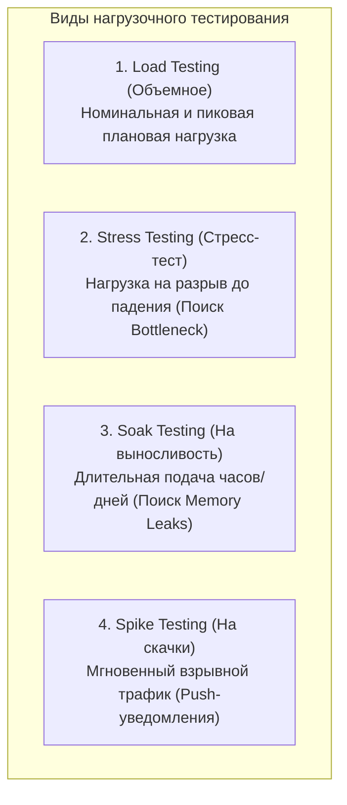
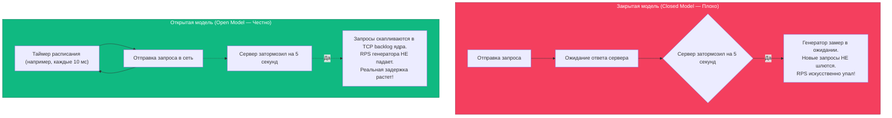
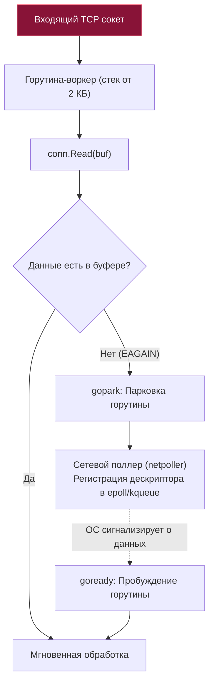

## Load testing: методология нагрузочного тестирования и пределы прочности

Мы потратили много времени на микроуровень: научились не аллоцировать память (см. [[9. Zero allocation подход]]), выравнивать поля структур, укрощать кэш-линии процессора и инлайнить горячие функции. Но в мире Highload и распределенных систем даже безупречный микрокод ничего не значит, если общая архитектура или инфраструктура операционной системы не выдерживают реального натиска пользователей.

Чтобы доказать, что наш сервис готов к боевой эксплуатации в Production, нам необходимы макро-измерения (как мы упоминали в [[5. microbenchmarks vs macrobenchmarks]]). Нам необходимо **Нагрузочное тестирование (Load testing)**.

---

## Зачем тестировать бэкенд на Go?

Язык Go изначально проектировался инженерами Google как специализированное оружие для сетевых сервисов. Благодаря неблокирующему вводу-выводу (`netpoller`) и сверхлегковесным горутинам, даже тривиальный неоптимизированный "Hello World" на Go играючи держит 50 000 RPS (Requests Per Second) на скромном сервере.

Проблемы начинаются не на пустых эндпоинтах, а когда:
1. Подключается реальная база данных с жестко ограниченным пулом соединений (Connection Pool).
2. Запускается сборщик мусора (Garbage Collector), отчаянно пытающийся собрать гигабайты временных объектов в условиях непрерывного входящего трафика.
3. Система упирается в фундаментальные лимиты ядра операционной системы (файловые дескрипторы сокетов, стек TCP, диапазон эфемерных портов).

---

## Виды нагрузочного тестирования

В зрелой инженерной практике нагрузочные тесты четко классифицируются по их целям и профилю подачи нагрузки:



1. **Load Testing (Объемное тестирование):** Подача ожидаемой "нормальной" и "пиковой" нагрузки. Цель — проверить, что `p99` latency (см. [[6. Метрики. p50, p95, p99]]) остается в рамках жестких соглашений об уровне сервиса SLA, а память не течет.
2. **Stress Testing (Стресс-тест):** Постепенное или ступенчатое наращивание нагрузки до тех пор, пока сервис не сломается. Цель — найти «бутылочное горлышко» (bottleneck): упрется ли сервис в CPU, память, пропускную способность сети или первой откажет реляционная база данных.
3. **Soak Testing (Тестирование на стабильность):** Подача постоянной средней нагрузки на протяжении длительного времени (от нескольких часов до нескольких суток). Идеальный метод для обнаружения медленных утечек памяти (Memory Leaks) и постепенной деградации производительности.
4. **Spike Testing (Тестирование скачков):** Резкая, практически мгновенная подача экстремальной нагрузки (в 10–50 раз выше нормы). Проверяет способность сервиса и очередей переварить эффект внезапной толпы (например, массовую рассылку push-уведомлений миллионам пользователей).

---

## Mechanical Sympathy: Битва с операционной системой

Типичная ошибка начинающих инженеров: они запускают стресс-генератор и тестируемый сервис на одной машине (или на общем слабом CI-раннере) и внезапно сталкиваются с лавиной ошибок "Connection refused" или полным зависанием. Они спешат винить рантайм Go, но в действительности **сломалась операционная система**.

> [!info] Под капотом: сетевой стек ядра Linux
> При высоких RPS ваш сервис вступает в плотный контакт с сетевым стеком ядра Linux (Kernel Space). Каждое открытое TCP-соединение требует реальных аппаратных ресурсов: буферов сокетов `rmem`/`wmem`, записей в таблицах отслеживания состояний и структур ядра.

Два главных барьера на уровне ОС, которые необходимо преодолеть перед тестом:

### 1. File Descriptors Exhaustion (Нехватка дескрипторов)
В классической философии Unix «всё есть файл», включая каждый сетевой TCP-сокет. Ядро ОС жестко лимитирует количество одновременно открытых файловых дескрипторов для процесса. По умолчанию в дистрибутивах Linux этот лимит часто составляет всего 1024. Ровно на 1025-м одновременном клиенте Go-сервер захлебнется и начнет возвращать ошибку `too many open files`.
* **Решение:** Перед запуском сервера и генератора нагрузки увеличьте лимит процесса:
  ```bash
  ulimit -n 65535 # или 1000000 для реального highload
  ```

### 2. Ephemeral Ports Exhaustion и TIME_WAIT
Когда клиент (генератор нагрузки) инициирует TCP-соединение к серверу, ядро выделяет ему локальный исходящий (эфемерный) порт. Количество этих портов ограничено системным пулом (обычно около 65 000 за вычетом зарезервированных).

Кроме того, при закрытии TCP-соединения сокет переходит в состояние `TIME_WAIT` (по умолчанию на 60 секунд), чтобы корректно поглотить запоздавшие пакеты в сети. Если ваш генератор генерирует 2000 RPS короткими одноразовыми соединениями, вы исчерпаете все доступные порты операционной системы менее чем за 30 секунд!
* **Решение:** Обязательно настраивайте `Keep-Alive` в генераторе нагрузки для переиспользования установленных TCP-соединений. На уровне ядра Linux проводите тюнинг через `sysctl`:
  ```bash
  sysctl -w net.ipv4.ip_local_port_range="1024 65535"
  sysctl -w net.ipv4.tcp_tw_reuse=1
  ```

---

## Главная ловушка: Coordinated Omission

**Coordinated Omission (Скоординированное упущение)** — это коварный феномен генераторов нагрузки, впервые подробно описанный Гилом Тене (Gil Tene). Он заставляет вас верить в то, что ваш сервис летает с минимальными задержками, когда на самом деле он находится в состоянии глубокого коллапса.

Существует две фундаментальные модели генерации трафика: **Закрытая (Closed Model)** и **Открытая (Open Model)**.



> [!warning] Ловушка / Gotcha: Иллюзия скорости в закрытой модели
> Представьте, что генератор настроен слать 100 RPS. Внезапно Go-сервер уходит в длинную GC-паузу на 1 секунду.
> - **В закрытой модели** (типичные наивные скрипты на Python/Bash или утилиты вроде ApacheBench) генератор посылает запрос, натыкается на паузу сервера и послушно ждет. За эту секунду он отправляет не 100 запросов, а всего 1. В итоговом отчете вы увидите оптимистичную цифру: `p99 latency = 1s`.
> - **В открытой модели** генератор строго соблюдает расписание прибытия (Arrival Rate) независимо от состояния сервера. За 1 секунду паузы он честно отправит все 100 запросов. Эти запросы встанут в очередь ядра ОС (`listen backlog`). Когда сервер наконец оживет, первому запросу потребуется секунда на обработку, а сотый запрос просидит в очереди еще дольше! Реальный показатель `p99 latency` окажется катастрофическим.
> 
> **Закрытая модель преступно маскирует проблемы производительности, когда сервер начинает захлебываться.**

---

### Инструменты тестирования (Экосистема Go)

Поскольку Go идеально подходит для создания конкурентных высокопроизводительных сетевых утилит, лучшие современные генераторы нагрузки написаны на самом Go:

1. **Vegeta (`tsenart/vegeta`):** Золотой стандарт для HTTP-нагрузки в экосистеме Go. Спроектирован со строгой поддержкой *открытой модели*. Вы указываете фиксированный Rate (например, `1000/s`), и утилита бомбардирует эндпоинт с прецизионной точностью таймера, безжалостно вскрывая Coordinated Omission.
2. **k6 (Grafana k6):** Мощнейший скриптуемый инструмент на Go, сценарии для которого описываются на JavaScript. Идеален для моделирования сложных пользовательских сценариев (многоэтапная аутентификация, цепочки вызовов). Начиная с версии 0.27 поддерживает открытую модель нагрузки с исполнителем `constant-arrival-rate`.
3. **Pandora (Yandex):** Высокопроизводительный движок на Go (входит в состав Yandex.Tank), оптимизированный под запредельные нагрузки (сотни тысяч и миллионы RPS) с поддержкой кастомных сетевых пушек и протоколов.

---

## Собеседование: типичные вопросы

> [!tip] Собеседование
> **Вопрос:** Мы запустили нагрузочный тест с интенсивностью 1000 RPS. Сервер отвечает статус-кодами 200 OK. Метрики показывают загрузку CPU всего 10%. Почему при этом `p99` latency внезапно выросла с 10 мс до 200 мс?  
> **Ответ:** Низкий CPU при взрывном росте задержек — верный признак блокировок и ожидания:
> 1. **Дефицит пула БД (Connection Pool):** Все соединения пула заняты медленными транзакциями, и горутины паркуются в ожидании освобождения коннекта.
> 2. **Дисковый I/O Wait:** Сервер производит синхронную запись логов на медленный диск при каждом запросе.
> 3. **Lock Contention:** Горутины выстраиваются в очередь за тяжелым `sync.Mutex` в глобальном кэше приложения.
> 4. **Хвостовые паузы сборщика мусора:** Из-за обилия мелких аллокаций рантайм тратит время на фазы STW и содействие GC (Mark Assist).

---

## Go netpoller под нагрузкой

При проектировании сетевых демонов в Java или C++ разработчики традиционно опасаются архитектуры «один поток на соединение» (Thread-per-connection), так как системный поток ОС стоит дорого: от 2 до 8 МБ на стек ядра и тяжелый оверхед на переключение контекста.

Go элегантно решил эту проблему архитектурой **«One Goroutine per connection»** (одна горутина на соединение):



1. **Минимальный объем памяти:** Стек горутины стартует всего с 2 КБ. 100 000 одновременных соединений потребуют всего ~200 МБ RAM.
2. **Дешевое переключение:** Переключение контекста горутин выполняется в User Space за наносекунды без перехода в кольцо защиты ядра (Ring 0).
3. **Асинхронный Netpoller:** Когда горутина вызывает `conn.Read()`, а данных в сокете еще нет, она не замораживает поток ОС (`M`). Рантайм перехватывает системный вызов, паркует горутину (`gopark`) и регистрирует дескриптор в подсистеме мультиплексирования `epoll` (Linux) или `kqueue` (macOS). Поток `M` немедленно переключается на исполнение других готовых задач. Когда сетевой пакет доходит до сетевой карты, ядро уведомляет netpoller, рантайм будит горутину (`goready`) и возвращает ее на свободный процессор `P`.

Благодаря этой архитектуре Go-серверы способны удерживать миллионы полуспящих соединений (WebSockets, gRPC-стримы) с нулевым оверхедом по процессору.

---

## Итог

1. **Макро-тестирование обязательно:** Никакие локальные микробенчмарки не спасут, если под нагрузкой откажет база данных или сетевой стек ОС.
2. **Контролируйте лимиты ядра Linux:** Увеличивайте лимит дескрипторов файлов (`ulimit -n`) и настраивайте `Keep-Alive` для предотвращения исчерпания эфемерных портов и заторов в `TIME_WAIT`.
3. **Остерегайтесь Coordinated Omission:** Используйте генераторы с открытой моделью расписания (Vegeta, k6 с `constant-arrival-rate`), отражающие реальное время ожидания запросов в очередях.
4. **Архитектура Netpoller:** Связка легковесных горутин и `epoll`/`kqueue` обеспечивает непревзойденную масштабируемость Go под экстремальным сетевым прессингом.

Но что делать, если нагрузочный тест показал деградацию, и сервис начинает захлебываться? Нам необходимо локализовать узкое место непосредственно в работающем процессе. Как безопасно собирать профили CPU и памяти с живого боевого кластера, мы разберем в следующей статье: [[2. Profiling в production]].