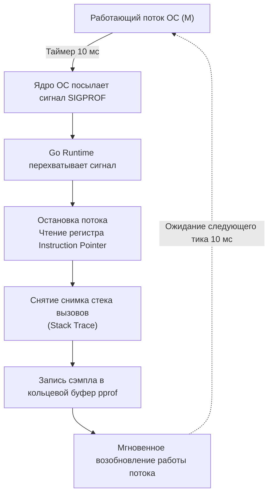
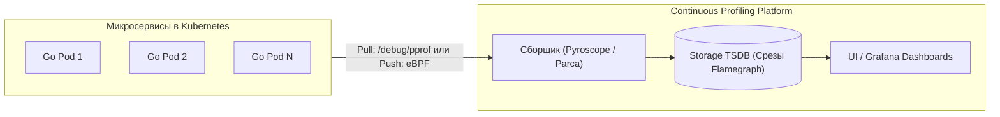

## Profiling в production: непрерывный анализ и безопасность

В предыдущей главе [[1. Load testing]] мы обсуждали, как с помощью искусственной нагрузки и открытых моделей прибытия запросов найти пределы прочности сервиса. Однако суровая инженерная реальность такова: **Staging-стенд всегда врет**. Как бы тщательно вы ни воспроизводили боевое окружение, распределение реальных данных в базе, непредсказуемые паттерны поведения живых пользователей, сетевые флапы и топология кластера всегда будут отличаться от синтетики.

Настоящие системные заторы и бутылочные горлышки вскрываются только на реальном трафике. И когда график `p99 latency` на дежурном мониторе внезапно устремляется в стратосферу, гадать по логам уже поздно: сервис парализован, а логи забиты вторичными таймаутами. В этот критический момент требуется заглянуть прямо вглубь работающего процесса.

Здесь у многих инженеров возникает естественный страх: *"А допустимо ли включать профилировщик на живом боевом продакшене под сотнями тысяч RPS? Не добьет ли профилирование захлебывающийся сервер окончательно?"*

Ответ от создателей рантайма Go однозначен: **Go изначально с первого дня проектировался для безопасного профилирования в Production**. Но делать это необходимо с глубоким пониманием физической цены каждого замера.

---

## Mechanical Sympathy: Стоимость профилирования

Чтобы уверенно применять инструмент в боевой обстановке, необходимо досконально понимать его микроархитектурную цену.

### 1. CPU Profiling (Затраты ~1–5%)

Когда вы активируете профилирование процессора ([[2. CPU profiling в Go]]), рантайм Go не внедряет никаких динамических хуков или перехватов инструкций в скомпилированный бинарный код. Он опирается на элегантный механизм **статистического сэмплирования (Statistical Sampling)** при поддержке сигналов операционной системы.



По умолчанию таймер срабатывает с частотой 100 раз в секунду (100 Hz). Это означает, что системный поток ОС прерывается всего на доли микросекунды каждые 10 миллисекунд. Накладные расходы на такую операцию составляют в среднем от **1% до 5% CPU**. Это ничтожная цена за достоверную картину того, в каких именно строках кода сгорают драгоценные процессорные такты.

### 2. Memory Profiling (Затраты < 1%)

Профилирование памяти кучи (Heap) работает еще дешевле ([[5. pprof memory profile]]). Аллокатор Go инкрементирует внутренние счетчики при каждом выделении памяти через `runtime.mallocgc`.

По умолчанию рантайм записывает детальный стек-трейс лишь для одной аллокации из каждых **512 Килобайт** выделенной памяти (параметр `MemProfileRate`). Это делает профилирование памяти практически неощутимым для производительности сервиса.

> [!warning] Ловушка / Gotcha: Катастрофа MemProfileRate = 1
> Программный интерфейс позволяет изменить частоту: `runtime.MemProfileRate = 1`, заставляя рантайм сохранять стек-трейс на *каждое* выделение памяти. **Никогда не делайте этого в Production!**  
> Сохранение фреймов стека на каждый аллоцированный байт замедлит сервис в десятки раз: приложение моментально захлебнется под тяжестью собственного профилировщика. Оставляйте дефолтное значение 512 КБ — для выявления утечек памяти и оценки аллокаций этого более чем достаточно.

---

## Безопасная интеграция pprof

Широко распространенный способ подключения профилирования в учебных статьях — добавление пустого импорта:

```go
import _ "net/http/pprof"
```

Этот импорт в своей функции `init()` автоматически регистрирует диагностические эндпоинты `/debug/pprof/*` в глобальном стандартном мультиплексоре `http.DefaultServeMux`.

> [!warning] Ловушка безопасности: Публикация pprof в открытый интернет
> Если ваш публичный веб-сервис слушает внешний порт через дефолтный роутер (например, `http.ListenAndServe(":80", nil)`), то после добавления этого импорта **любой анонимный пользователь в интернете** получает полный доступ к внутренностям вашего сервера!
> 
> Последствия катастрофичны:
> 1. Утечка конфиденциальных данных: дампы горутин и памяти содержат полные пути к файлам на хосте, параметры сборки, токены авторизации и персональные данные из дампов стеков.
> 2. Вектор тяжелейшей DoS-атаки: злоумышленник может непрерывно запрашивать `/debug/pprof/trace?seconds=60` и `/debug/pprof/profile?seconds=60`, парализуя процессорные ядра.

### Надежный инженерный паттерн: разделение портов

Никогда не выводите `pprof` на публичный интерфейс. Создайте отдельный внутренний HTTP-сервер на закрытом порту (доступном только локально через `127.0.0.1`, внутренний сервисный интерфейс или `kubectl port-forward`):

```go
package main

import (
	"log"
	"net/http"
	"net/http/pprof"
)

func main() {
	// 1. Основной публичный роутер (строго без pprof)
	publicMux := http.NewServeMux()
	publicMux.HandleFunc("/api/data", handleData)

	// Запуск публичного сервера в отдельной горутине
	go func() {
		log.Println("Public server starting on :8080")
		if err := http.ListenAndServe(":8080", publicMux); err != nil {
			log.Fatalf("public server failed: %v", err)
		}
	}()

	// 2. Внутренний роутер для безопасной диагностики
	debugMux := http.NewServeMux()
	
	// Явная регистрация необходимых хендлеров pprof
	debugMux.HandleFunc("/debug/pprof/", pprof.Index)
	debugMux.HandleFunc("/debug/pprof/cmdline", pprof.Cmdline)
	debugMux.HandleFunc("/debug/pprof/profile", pprof.Profile)
	debugMux.HandleFunc("/debug/pprof/symbol", pprof.Symbol)
	debugMux.HandleFunc("/debug/pprof/trace", pprof.Trace)

	// Запуск диагностического сервера на закрытом интерфейсе loopback
	log.Println("Debug server starting on :9090")
	if err := http.ListenAndServe("127.0.0.1:9090", debugMux); err != nil {
		log.Fatalf("debug server failed: %v", err)
	}
}

func handleData(w http.ResponseWriter, r *http.Request) {
	w.WriteHeader(http.StatusOK)
}
```

---

## Continuous Profiling (Непрерывное профилирование)

Исторически отладка была реактивной и запоздалой:
$$\text{Инцидент} \longrightarrow \text{Инженер подключается по SSH} \longrightarrow \text{Снимает go tool pprof} \longrightarrow \text{Ищет причину}$$

Но что делать, если критический спайк задержки произошел ночью в 03:15 и длился ровно 3 минуты? Утром инженер откроет мониторинг, снимет профиль с остывшего сервера и увидит идеальную картину.

В современной Highload-инженерии стандартом де-факто стал **Continuous Profiling (Непрерывное профилирование)**. Вы собираете непрерывные срезы профилей со всех подов кластера 24/7/365 — точно так же, как собираете метрики в Prometheus.



Ведущие платформы индустрии — **Pyroscope** (от Grafana Labs) и **Parca**:
1. **Pull-модель:** Сервер сбора с заданной периодичностью опрашивает защищенные эндпоинты `/debug/pprof/profile?seconds=10` ваших инстансов и сжимает профили в специализированную тайм-серийную БД.
2. **eBPF-модель (Parca Agent):** Агент функционирует на уровне ядра Linux и с помощью программ eBPF напрямую читает стеки инструкций из памяти процесса, не требуя даже интеграции пакета `pprof` в кодовую базу.

Это дает инженеру возможность ретроспективного анализа: открыть интерфейс и запросить Flamegraph для конкретного пода ровно за те 3 минуты ночного инцидента.

---

## Собеседование: типичные вопросы

> [!tip] Собеседование
> **Вопрос:** Если профилирование CPU основано на статистическом сэмплировании, как обнаружить функцию, которая вызывается крайне редко, но выполняется недопустимо долго (например, 1 раз в 10 минут подвешивает горутину на 400 мс)? Стандартный pprof с высокой вероятностью просто промахнется мимо нее.  
> **Ответ:** Статистический CPU-профилировщик оптимизирован для обнаружения функций, суммарно сжигающих много процессорного времени. Для единичных редких спайков задержек используют:
> 1. **Execution Tracer (`go tool trace`):** Записывает абсолютно каждое событие планировщика рантайма, переключения горутин и блокировки в системных вызовах.
> 2. **Распределенную трассировку (OpenTelemetry / Jaeger):** Снабжение критических методов контекстными спанами (Spans) с фиксацией длительности выполнения.

---

## Чего стоит избегать на проде?

Помимо контроля над `MemProfileRate`, рантайм Go содержит еще два специализированных профиля, которые по умолчанию **полностью отключены**:

1. **Block Profiling (`runtime.SetBlockProfileRate`)**: Фиксирует горутины, заблокированные в ожидании каналов, операций `select` или системного ввода-вывода.
2. **Mutex Profiling (`runtime.SetMutexProfileFraction`)**: Протоколирует конфликты и задержки ожидания на блокировках `sync.Mutex` и `sync.RWMutex` ([[7. Contention и lock profiling]]).

> [!warning] Ловушка / Gotcha: Mutex Profiling с рейтом 1
> Если вы активируете Mutex Profiling с параметром `1` (сохранять стек на каждый случай конкуренции за мьютекс) на боевом сервисе с интенсивной конкуренцией за кэш, рантайм начнет генерировать сотни тысяч стек-трейсов в секунду. Это вызовет эффект домино и лавинообразное падение сервиса. Включайте Mutex/Block профилирование только с разреженным рейтом (например, 1 событие из 1000) или кратковременно по требованию.

---

## Итог

1. **Профилирование в production безопасно и необходимо:** Накладные расходы на сэмплирование CPU составляют 1–5%, а профилирование кучи памяти практически незаметно (<1%).
2. **Строгая изоляция pprof:** Никогда не экспортируйте диагностические эндпоинты на публичные порты — изолируйте их на локальном loopback-интерфейсе.
3. **Continuous Profiling — современный стандарт:** Системы Pyroscope и Parca обеспечивают ретроспективный анализ инцидентов 24/7.
4. **Учитывайте ограничения сэмплирования:** Для поиска редких одиночных микрозадержек комбинируйте `pprof` с `go tool trace` и OpenTelemetry.

Выявив узкое место через боевой профиль, вы переписываете алгоритм. Но как безопасно доставить оптимизацию на миллионы пользователей и мгновенно откатить ее при первых признаках аномалий в памяти?

Для этого передовые команды используют динамическое управление кодом на лету. Об этом мы поговорим в следующей статье: [[3. Feature flags для оптимизаций]].