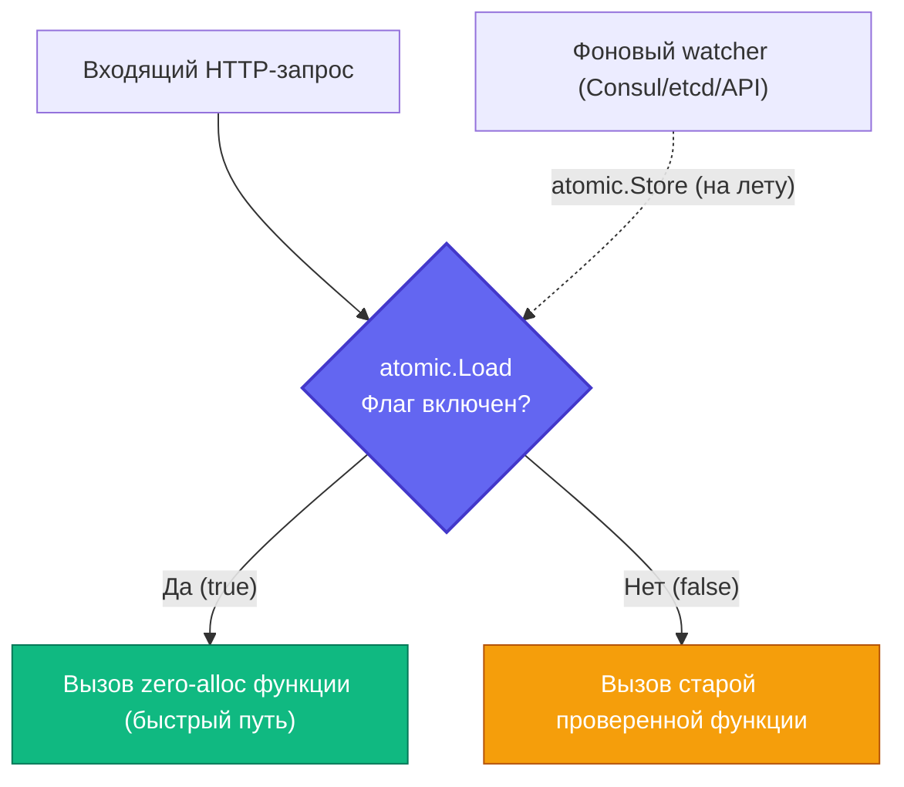

## Feature flags для оптимизаций: безопасный выкат и аварийные рубильники

В предыдущей главе [[2. Profiling в production]] мы научились точно локализовать узкие места на живых серверах. Допустим, профилировщик показал, что 40% процессорного времени сгорает в стандартном `encoding/json`. Вы, как опытный инженер, переписали критический маршрут на кодогенерацию или внедрили бескомпромиссный [[9. Zero allocation подход]]. Локальные микробенчмарки фиксируют десятикратный прирост производительности.

Казалось бы, пора немедленно отправлять код в Production. Однако в промышленном Highload реальность сурова: радикальная микрооптимизация может не учесть редкий пограничный случай (Edge Case), упасть с паникой на поврежденном сетевом пакете или устроить лавинообразную утечку памяти из-за ошибки работы с `sync.Pool`. Выкатывать масштабные оптимизации напрямую на весь входящий трафик — это неоправданная игра в русскую рулетку.

Для безопасного внедрения низкоуровневых оптимизаций мы используем **Feature Flags (Флаги функций)**. В контексте высоконагруженной производительности они выступают в роли **Kill Switches (Аварийных рубильников)**, позволяя мгновенно переключить исполнение на старую, пусть более медленную, но железобетонно проверенную версию кода — без пересборки бинарников и без перезапуска подов.

---

## Mechanical Sympathy: Цена проверки флага

Feature Flag в коде — это всегда условное ветвление (`if flag { ... } else { ... }`).

Когда речь идет о высокоуровневой продуктовой бизнес-логике (например, показать ли новую кнопку в веб-интерфейсе), флаг допустимо проверять сетевым запросом к Redis, Consul или базе данных: сетевая задержка в 1–2 мс на фоне общего рендеринга страницы незаметна.

Но когда мы защищаем микрооптимизацию, которая экономит сотни наносекунд в горячем цикле, сетевой запрос (и даже захват мьютекса `sync.Mutex`) **мгновенно уничтожит всю производительность**.

> [!warning] Ловушка / Gotcha: Сетевые проверки в горячем пути
> Классическая ошибка неопытных разработчиков:
> ```go
> func process(data []byte) {
>     // УЖАСНО: Сетевой запрос к Redis на каждый входящий сетевой пакет!
>     // Это замедлит функцию в тысячи раз и создаст шторм запросов к кэшу.
>     if redisClient.Get("use_fast_parser") == "true" { 
>         fastParse(data)
>     } else {
>         slowParse(data)
>     }
> }
> ```

Проверка флага в Hot Path обязана происходить **исключительно в оперативной памяти (In-Memory)** и быть абсолютно потокобезопасной (Thread-Safe) без использования блокировок ядра ОС.

Идеальным инструментом для этой задачи является стандартный пакет **`sync/atomic`**.

> [!info] Под капотом: аппаратная цена atomic.Bool
> Почему атомарный флаг `atomic.Bool` (или `atomic.LoadInt32` в старых версиях Go) настолько эффективен?  
> 1. **Кэш процессора:** Когда горутины на разных ядрах CPU непрерывно считывают переменную флага, которая меняется крайне редко, кэш-линия с этой переменной оседает в L1/L2 кэшах всех ядер в состоянии **Shared** (согласно аппаратному протоколу когерентности MESI).  
> 2. **Наносекундный доступ:** Атомарное чтение `atomic.Load` из горячего L1-кэша занимает всего 1–2 наносекунды (1–3 такта CPU).  
> 3. **Предсказание ветвлений:** Благодаря аппаратному Branch Predictor ([[6. Branch prediction и код]]), процессор со 100% вероятностью предугадывает результат `if`, исполняя код по конвейеру вообще без задержек.  
> Системная инвалидация кэш-линий и нагрузка на шину памяти возникают *исключительно* в момент записи (`atomic.Store`), когда администратор переключает рубильник, что происходит считанные разы за все время жизни сервиса.

---

## Идиоматичная реализация In-Memory флагов

Правильный подход заключается в хранении состояния флагов в локальной структуре с фоновым обновлением из внешней системы конфигурации (Consul, etcd или внутреннего административного HTTP API):

```go
package flags

import (
	"sync/atomic"
)

// GlobalFlags хранит состояние рубильников оптимизаций
type GlobalFlags struct {
	UseZeroAllocParser atomic.Bool
	EnableCache        atomic.Bool
}

var activeFlags GlobalFlags

// IsZeroAllocParserEnabled - сверхбыстрое O(1) чтение из L1 кэша
func IsZeroAllocParserEnabled() bool {
	return activeFlags.UseZeroAllocParser.Load()
}

// SetZeroAllocParser - вызывается извне (admin API или Consul watcher)
func SetZeroAllocParser(enabled bool) {
	activeFlags.UseZeroAllocParser.Store(enabled)
}
```



Теперь в горячем пути выполнения (Hot Path) вы можете безопасно изолировать новый код:

```go
func parseData(data []byte) (Result, error) {
    if flags.IsZeroAllocParserEnabled() {
        return fastParse(data) // Новая сверхбыстрая версия
    }
    return slowParse(data)     // Старая надежная версия
}
```

Если мониторинг зафиксирует аномальный всплеск потребления памяти, рост ошибок 500 или паники в рантайме, дежурный инженер выполняет один curl-запрос. Метод `atomic.Store` переключает флаг в `false`, и **на следующем же такте процессора** весь входящий трафик мгновенно возвращается на безопасный маршрут. Никаких откатов деплоя, перезапуска контейнеров и простоев сервиса.

---

## Контекстные флаги (Заморозка состояния)

Для многоэтапных операций прямое чтение глобального `atomic.Bool` несет в себе скрытую опасность. Представьте длинный пайплайн обработки данных или распределенную транзакцию (Saga).

Что произойдет, если в начале обработки входящего запроса флаг «Использовать новый формат сериализации» был `true`, сервис создал объект новой структуры, а в середине пайплайна дежурный инженер переключил флаг в `false`? Вторая половина пайплайна прочитает `false`, попытается десериализовать данные по старому алгоритму и вызовет `panic` или повреждение данных (Data Corruption).

> [!tip] Собеседование
> **Вопрос:** Как исключить рассинхронизацию логики, если глобальный фича-флаг переключается прямо во время выполнения длинного пользовательского запроса?  
> **Ответ:** Состояние всех критических флагов должно **замораживаться** ровно один раз на входе в систему (в HTTP/gRPC Middleware) и транслироваться по всему дереву вызовов внутри объекта `context.Context`.

### Реализация через Middleware:

```go
package middleware

import (
	"context"
	"net/http"
	
	"myproject/flags"
)

type contextKey string
const flagsKey contextKey = "feature_flags"

// RequestFlags - снимок состояния флагов на момент входа запроса
type RequestFlags struct {
	UseFastParser bool
}

func FlagsMiddleware(next http.Handler) http.Handler {
	return http.HandlerFunc(func(w http.ResponseWriter, r *http.Request) {
		// Читаем из atomic ровно один раз на входе в систему!
		currentFlags := RequestFlags{
			UseFastParser: flags.IsZeroAllocParserEnabled(),
		}
		
		// Замораживаем снимок в контексте запроса
		ctx := context.WithValue(r.Context(), flagsKey, currentFlags)
		next.ServeHTTP(w, r.WithContext(ctx))
	})
}
```

Далее в бизнес-логике обработчик читает флаг исключительно из контекста. Даже если глобальный флаг изменится на лету, текущий активный запрос гарантированно отработает по тем правилам, с которыми он стартовал.

---

## Паттерн "Теневое чтение" (Dark Launch / Shadowing)

Это высший стандарт надежности при внедрении критических оптимизаций в финансовом секторе и Highload.

Допустим, вы переписали сложный алгоритм матчинга заказов или парсер протокола. Вы хотите быть **на 100% уверенными**, что новая быстрая версия возвращает *бит в бит* те же результаты, что и старая, на реальном боевом трафике.

С помощью флага `EnableShadowParsing` вы запускаете **обе** функции одновременно: старая функция формирует ответ клиенту (бизнес-процесс защищен от сбоев), а новая версия исполняется «в тени»:

```go
func parseDataShadow(ctx context.Context, data []byte) (Result, error) {
    // Основной (медленный, но гарантированно надежный) путь
    res, err := slowParse(data)
    
    // Если активировано теневое тестирование
    if flags.IsShadowParsingEnabled() {
        // Запуск асинхронно в фоне, чтобы не увеличивать задержку ответа клиенту
        go func(d []byte, expectedRes Result, expectedErr error) {
            fastRes, fastErr := fastParse(d)
            
            // Сверка результатов старого и нового алгоритмов
            if fastErr != expectedErr || !reflect.DeepEqual(fastRes, expectedRes) {
                // Расхождение зафиксировано: бьем тревогу в метрики!
                metrics.Inc("parser_mismatch_errors")
                log.Printf("Mismatch: expected %v, got %v", expectedRes, fastRes)
            }
        }(data, res, err)
    }
    
    return res, err
}
```

Когда метрика `parser_mismatch_errors` стабильно показывает ровно 0 на протяжении нескольких суток под нагрузкой в миллионы вызовов, инженер с абсолютной уверенностью переключает основной рубильник на `fastParse`, удаляя старый код и теневой запуск.

---

## Итог

1. **Feature Flags в Highload** — это спасательный круг и аварийный рубильник (Kill Switch) при внедрении рискованных микрооптимизаций.
2. **Проверки в горячих путях:** строго In-Memory и без блокировок ядра. Используйте `sync/atomic` (`atomic.Bool`), читаемый за 1–2 нс из L1 кэша.
3. **Заморозка состояния (Context Snapshot):** считывайте флаги один раз на входе в Middleware и пробрасывайте через `context.Context`, чтобы исключить рассинхрон посреди выполнения длинного запроса.
4. **Теневое тестирование (Shadowing):** параллельный запуск нового кода без влияния на клиента позволяет доказать 100% математическую эквивалентность оптимизированного алгоритма старому.

Feature flags позволяют безопасно переключать логику *внутри* одного процесса. Но что делать, если изменение настолько фундаментально, что затрагивает схему базы данных, системные зависимости или сетевые протоколы? В таких сценариях рубильников в коде недостаточно, и мы поднимаемся на уровень сетевой маршрутизации кластера.

Об этом мы поговорим в следующей статье: [[4. Canary releases]].