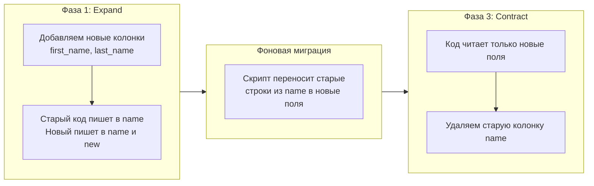

В предыдущей главе [[3. Feature flags для оптимизаций]] мы разобрали, как филигранно переключать алгоритмы и структуры данных прямо в памяти работающего процесса с помощью атомарных флагов. Это идеальный инструмент хирургической точности, когда речь идет об оптимизации конкретного парсера или алгоритма сортировки. Но что делать, если ваши оптимизации затрагивают фундаментальные основы сервиса?

Представьте, что вы обновляете мажорную версию компилятора Go (например, с 1.20 на 1.22 для получения оптимизаций PGO и нового аллокатора), переходите на альтернативный сетевой стек (скажем, с классического `net/http` на `fasthttp`), меняете драйвер базы данных или кардинально перестраиваете сериализацию сессий в Redis. Такие тектонические сдвиги невозможно спрятать за простой конструкцией `if flag { ... }`. Вам необходимо развернуть совершенно новый бинарный файл, скомпилированный другим тулчейном или слинкованный с новыми библиотеками.

Здесь на сцену выходит классический инженерный паттерн — **Канареечные релизы (Canary Releases)**. Свое поэтическое название метод получил от шахтеров XIX века, бравших в забой клетку с канарейкой: чуткая птица реагировала на малейшие утечки метана или угарного газа задолго до того, как опасность почувствуют люди. В распределенных системах канареечный релиз — это контролируемое развертывание новой версии сервиса параллельно со стабильной, при котором на новую версию направляется лишь крошечная доля (обычно 1–5%) реального боевого трафика.

---

## Mechanical Sympathy: Миф об отсутствии «Холодного старта» в Go

Инженеры, пришедшие в Go из экосистем Java (Spring Boot) или C# (.NET), прекрасно знакомы с феноменом холодного старта: виртуальной машине требуются минуты, чтобы интерпретировать байткод, собрать профиль выполнения и передать «горячие» методы JIT-компилятору (Just-In-Time) для трансляции в машинный код. 

Из-за этого среди Go-разработчиков нередко бытует опасная иллюзия: *«Go компилируется в нативный машинный код AOT (Ahead-Of-Time). У нас нет байткода и нет JIT-компилятора. Следовательно, свежезапущенный Go-процесс мгновенно готов перемалывать 100% пиковой нагрузки на полной скорости!»*

Это заблуждение разбивается о физику кремния и операционной системы. «Холодный старт» существует всегда, даже если ваш бинарник скомпилирован до единого машинного байта:

```
Холодный старт Go-пода:
┌────────────────────────────────────────────────────────────────────────┐
│ 1. L1i / L2 Instruction Caches: Девственно чисты (микросекунды)       │
│    -> Процессор промахивается мимо кэша инструкций (I-Cache Misses)    │
├────────────────────────────────────────────────────────────────────────┤
│ 2. TCP Connection Pool (database/sql): 0 открытых сокетов (сотни мс)   │
│    -> Шквал SYN/ACK (3-Way Handshake) + TLS Negotiation               │
├────────────────────────────────────────────────────────────────────────┤
│ 3. Go Runtime GC Pacer: Heap-цели не откалиброваны (секунды)           │
│    -> Взрывной рост кучи -> паника GC -> CPU Throttling в cgroups       │
├────────────────────────────────────────────────────────────────────────┤
│ 4. Linux OS Page Cache: Страницы памяти на диске (миллисекунды)        │
│    -> Major Page Faults при первом чтении статики и файлов             │
└────────────────────────────────────────────────────────────────────────┘
```

1. **Instruction Cache (L1i / L2):** Кэш инструкций каждого ядра CPU (обычно 32–64 КБ) изначально пуст. Приложению требуется время, чтобы заполнить строки кэша «горячими» машинными инструкциями вашего кода и рантайма. Первые миллионы тактов процессор буксует, ожидая доставки кода из медленной оперативной памяти (L1i misses).
2. **TCP Connection Pool:** Внутренние пулы соединений сервиса (`sync.Pool` или пулы внутри `database/sql`, `pgx`, `go-redis`) при старте абсолютно пусты. Первые клиентские запросы вызывают лавину создания соединений: на каждый запрос тратится драгоценное время на трехстороннее рукопожатие TCP (SYN, SYN-ACK, ACK), TLS-хендшейк с вычислением криптографических ключей Diffie-Hellman и аллокацию системных буферов сокетов в ядре Linux.
3. **GC Pacing (Адаптация сборщика мусора):** Рантайм Go не обладает магическим даром предвидения. Сборщик мусора (GC) использует динамические эвристики и обратную связь от планировщика, чтобы рассчитать оптимальный триггер запуска следующего цикла очистки (`GOGC` и `GOMEMLIMIT`). При мгновенной подаче 100% боевой нагрузки на «холодный» под скорость аллокаций в куче многократно опережает оценку GC Pacer. Рантайм впадает в режим ассистирования (`mark assist`), насильно заставляя пользовательские горутины помогать сборщику сканировать память. Сервис получает мгновенный скачок CPU Throttling в контейнере Kubernetes и взрыв задержек (`latency spike`).
4. **OS Page Cache:** Если сервис обращается к дисковым файлам, конфигам, сертификатам или статике, данные еще не подняты ядром Linux в кэш страниц оперативной памяти. Первые чтения вызывают аппаратные прерывания `Page Fault`.

Канареечный релиз решает эту фундаментальную проблему: направляя на свежий под всего 1–2% запросов, мы даем процессору, ядру ОС, пулам соединений и рантайму Go возможность мягко «прогреться» (Warm-up) в течение 5–10 минут перед встречей с настоящим штормом.

---

## Архитектура Канарейки: Маршрутизация на уровне Ingress и Service Mesh

В современных Cloud-Native инфраструктурах (Kubernetes, Envoy, Nginx, Istio, Linkerd) распределение трафика реализуется не на уровне самого приложения, а на уровне периметра маршрутизации.

```mermaid
flowchart TD
    Client["Клиентский трафик API"] --> LB["Балансировщик нагрузки<br>(Envoy / Nginx / Istio Ingress)"]
    
    LB -->|"95% трафика (Baseline)"| StableGroup["Stable ReplicaSet v1.0<br>Прогретые поды (Production)"]
    LB -->|"5% трафика (Canary)"| CanaryGroup["Canary ReplicaSet v1.1<br>Новый бинарник / оптимизация"]
    
    StableGroup --> DB[("База данных PostgreSQL<br>(Общая схема)")]
    CanaryGroup --> DB
    
    style CanaryGroup fill:#132d29,stroke:#10b981,stroke-width:2px
    style StableGroup fill:#161e31,stroke:#3b82f6,stroke-width:2px
    style DB fill:#2a1b1b,stroke:#f43f5e,stroke-width:2px
```



Существуют два основных подхода к разделению потока запросов:

1. **Маршрутизация по весу (Weight-based Routing):**
   Балансировщик нагрузки (например, Nginx с директивой `split_clients` или Envoy VirtualHost с весами `weight: 95` и `weight: 5`) для каждого входящего TCP-соединения или HTTP-запроса генерирует псевдослучайное число. Если значение попадает в интервал 1–5, запрос уходит на канареечный под. Это идеальный выбор для stateless HTTP/gRPC микросервисов.
2. **Маршрутизация по заголовкам и кукам (Header-based Routing):**
   Трафик фильтруется детерминированно. В канарейку направляются только запросы, содержащие специальный заголовок (например, `X-Canary: true`), запросы от корпоративных IP-адресов компании или пользователей с cookie бета-тестирования. Это обязательный подход для stateful сессий или сложных пользовательских сценариев (например, корзина и чекаут), где недопустимо, чтобы шаги одного бизнес-процесса скакали между старой и новой версиями приложения.

> [!info] Под капотом
> При использовании маршрутизации по весу помните о законе больших чисел. Если ваш сервис обрабатывает 20 запросов в секунду (20 RPS), а вес канарейки равен 5%, то на канарейку придет ровно 1 запрос в секунду. На таком объеме невозможно собрать статистически достоверные метрики задержки, а пулы соединений к базе данных так и останутся не прогретыми. В малонагруженных сервисах процент канарейки вынужденно повышают до 10–20%, либо используют синтетический прогрев перед открытием публичного доступа.

---

## Главная архитектурная ловушка: База данных

Внимательно посмотрите на архитектурную схему выше. И стабильные поды v1.0, и канареечные поды v1.1 работают **параллельно с одной и той же боевой базой данных**.

Это рождает непреложный закон архитектуры распределенных систем:

> [!warning] Ловушка / Gotcha
> **Ни один канареечный релиз не должен нарушать обратную совместимость схемы базы данных или протоколов хранения данных!**
> 
> Если ваш новый код оптимизирует чтение профилей и вы запускаете DDL-миграцию `ALTER TABLE ... RENAME` (`ALTER TABLE users RENAME COLUMN name TO full_name`), канареечный под заработает безупречно. Однако оставшиеся 95% стабильных подов в ту же миллисекунду начнут отвечать ошибками 500 (Internal Server Error), пытаясь прочитать удаленную колонку `name`. Ваша попытка провести «тихий и безопасный» канареечный тест мгновенно превращается в катастрофу уровня P1 (Outage всего продакшена).

### Паттерн «Expand and Contract» (Двухфазные миграции)

Чтобы избежать конфликта версий при канареечных раскатках, любые изменения базы данных разбиваются на неломающие фазы по паттерну **Expand and Contract (Расширение и Сжатие)**:



Разберем конкретный пример разделения одного поля `name` на `first_name` и `last_name`:

1. **Фаза 1 (Expand — Расширение):**
   - В БД накатывается миграция, добавляющая *новые nullable-колонки* `first_name` и `last_name`. Старая колонка `name` не трогается.
   - Старая версия (Stable) продолжает читать и писать в `name`.
   - Новая версия (Canary) пишет одновременно в оба формата (и в `name`, и в `first_name`/`last_name`), а читает уже из новых полей.
   - Выкатывается Canary. Если обнаруживается дефект — канарейку можно безболезненно свернуть: старые поды даже не заметят новых колонок.
   - После успешного канареечного тестирования новая версия раскатывается на 100% подов.
2. **Фоновая миграция данных (Data Backfill):**
   - Запускается асинхронный фоновый воркер (batch job), который порциями переносит исторические записи из `name` в `first_name` и `last_name`.
3. **Фаза 2 (Contract — Сжатие):**
   - Выкатывается следующий мажорный релиз, в котором код полностью очищен от упоминаний `name`.
   - После раскатки в базу данных накатывается финальная миграция: `ALTER TABLE users DROP COLUMN name;`.

---

## Метрики: Как понять, что канарейка подает сигнал бедствия?

Смысл канарейки в том, чтобы «умереть первой», сохранив здоровье основной популяции. Но чтобы система среагировала автоматически, необходима непрерывная наблюдаемость (подробнее в [[8. Observability и performance]]).

В современных инструментах прогрессивной доставки (например, **Argo Rollouts** или **Flagger**) поведение канарейки непрерывно оценивается по метрикам четырех золотых сигналов и RED-методологии:

1. **Rate (Частота запросов):** Фактический входящий RPS на канареечные реплики обязан строго соответствовать заданному весу балансировщика. Если вес 5%, а канарейка получает 0.05% или 0%, значит, она не проходит Health Check проверки (`/live`, `/ready`), либо Ingress настроен некорректно.
2. **Errors (Уровень ошибок):** Сравнивается частота ответов `5xx` или gRPC-статусов `Internal`/`Unavailable`. Если процент ошибок канарейки превышает базовый уровень стабильной версии даже на 0.5%, раскатка немедленно замораживается и запускается автоматический откат (Automated Rollback).
3. **Duration (Распределение задержек p50, p95, p99):** Задержки анализируются в соответствии с правилами квантилей (см. [[6. Метрики. p50, p95, p99]]). Новая версия оптимизированного сервиса ни при каких условиях не должна увеличивать `p99 latency`.
4. **Потребление ресурсов (CPU, Memory, Goroutines):** Метрики среды выполнения Go. Если оптимизированный бинарник показывает рост потребления памяти (Memory Leak) или монотонно растущее число горутин `go_goroutines` (Goroutine Leak), канарейку необходимо изолировать и сбросить heap-профиль для анализа.

> [!tip] Собеседование
> **Вопрос:** Мы развернули канареечную реплику с 5% боевого трафика и увидели по графикам Prometheus, что `p50 latency` на канарейке составляет 10 мс, тогда как на стабильных подах под 95% нагрузки она равна 50 мс. Означает ли это, что наша оптимизация ускорила сервис в 5 раз?
> 
> **Ответ:** Категорически нет. Это классическая ошибка интерпретации метрик под названием **«иллюзия недогруженности» (Underload Illusion)**. Канареечный под обрабатывает в 19 раз меньше запросов. В условиях столь низкой нагрузки кэши процессора L2/L3 не вытесняются чужими вызовами, contention на блокировках мьютексов минимален, сборщик мусора Go простаивает, а пул соединений к СУБД полностью свободен от очередей ожидания. Сравнивать абсолютные задержки при пятикратной разнице в утилизации неправомерно. 
> 
> Производительность под полной нагрузкой валидируется на предварительном нагрузочном тестировании в изолированном контуре (см. [[1. Load testing]]). Задача канарейки в продакшене — служить **детектором аномалий**: искать ошибки совместимости, деградации крайних процентилей (`p99.9`) и утечки ресурсов на реальном потоке данных.

---

## Резюме

1. **Канареечный релиз** — это фундаментальный архитектурный паттерн развертывания, локализующий радиус поражения (Blast Radius) любых изменений, которые невозможно скрыть за простыми Feature Flags.
2. **Go подвержен холодному старту:** Несмотря на AOT-компиляцию, процессору требуется время на прогрев кэшей инструкций (L1i/L2), операционной системе — на создание пулов TCP-сокетов, а рантайму Go — на калибровку эвристик сборщика мусора (GC Pacer). Канарейка обеспечивает этот мягкий прогрев.
3. **Паттерн Expand and Contract:** Канарейка и стабильная версия всегда делят единое хранилище. Схема базы данных и форматы сообщений должны сохранять 100% обратную совместимость на протяжении всего жизненного цикла релиза.
4. **Автоматизация Rollback:** Оценка канарейки строится на объективных метриках RED (Rate, Errors, Duration) и метриках рантайма Go (`go_goroutines`, `go_memstats_alloc_bytes`). Любая статистически достоверная деградация должна приводить к немедленному автоматическому откату.

Мы научились безопасно выкатывать бинарные изменения на живых пользователей. Но как убедиться, что производительность системы не деградирует со временем незаметно, шаг за шагом, от коммита к коммиту разных инженеров? Переходим к автоматизации обнаружения деградаций: [[5. Performance regression detection]].