В предыдущей статье [[4. Canary releases]] мы разобрали, как безопасно выкатывать свежий бинарный файл на боевой трафик. Канареечный деплой спасает продакшен от масштабной катастрофы. Но давайте взглянем правде в глаза: если код дошел до канарейки и был экстренно откатан из-за просадки производительности, это все равно поражение. Время разработчиков, QA-инженеров и вычислительные ресурсы CI-пайплайна уже сожжены впустую.

Инженерный подход зрелой команды требует проактивности: деградацию необходимо душить еще на этапе pull request (PR).

Производительность систем редко рушится в одночасье. В зрелых проектах с сотнями инженеров правит коварный закон: **«Смерть от тысячи порезов» (Death by a thousand cuts)**:
- Один инженер добавил безобидный с виду `fmt.Sprintf("%d", id)` в горячий цикл — возникла скрытая аллокация в куче.
- Другой передал структуру по интерфейсу, из-за чего компилятор Go отключил спасительные [[8. Inline оптимизации]] и отправил указатель на кучу через Escape Analysis.
- Третий добавил в структуру поле `bool` перед `int64`, увеличив паддинг (Padding) и раздув размер объекта на 8 байт, из-за чего кэш-линии процессора L1d стали вмещать меньше записей.

Ни один из этих коммитов по отдельности не уронит канарейку и не вызовет тревогу в SRE-дашбордах. Но за полгода суммарная задержка `p99 latency` вырастает вдвое, а счета за облачные сервера увеличиваются на миллионы.

Чтобы предотвратить эту ползучую эрозию, необходима система **Continuous Performance Regression Detection (Непрерывное обнаружение деградации производительности)** — автоматический сторожевой пес в CI/CD, блокирующий мерж pull request'а, если код стал медленнее или прожорливее.

---

## 1. Проблема дисперсии и статистический арбитр `benchstat`

Первая наивная попытка автоматизировать бенчмарки в CI обычно выглядит так: инженер пишет Bash-скрипт, запускающий `go test -bench .`, вырезает число наносекунд с помощью `awk` и сравнивает его с числом из ветки `main`.

Этот подход **обречен на провал**.

Если вы запустите один и тот же тест дважды подряд на одной и той же машине, результаты будут естественным образом "гулять" на 2–10%. Планировщик Linux выделил квант времени демону `systemd`, соседнее ядро нагрелось и сбросило частоту, сработал кэш диска — все это создает **стохастический шум**. Если пайплайн будет падать при случайном колебании на 3%, разработчики быстро отключат проверку из-за постоянных ложноположительных срабатываний (Flaky tests).

### Решение: Математическая статистика и `benchstat`

В официальном инструментарии Go есть эталонный инструмент для решения этой проблемы — утилита `benchstat` (`golang.org/x/perf/cmd/benchstat`).

Ее принцип базируется на выборке: бенчмарк запускается не один раз, а сериями (как минимум `count=10`):

```bash
# 1. Переключаемся на базовую ветку (baseline)
git checkout main
# ОБЯЗАТЕЛЬНО запускаем бенчмарки несколько раз (count=10) для сбора статистики
go test -run=^$ -bench=. -count=10 > old.txt

# 2. Переключаемся на ветку с оптимизацией / фичей
git checkout feature-branch
go test -run=^$ -bench=. -count=10 > new.txt

# 3. Сравниваем статистически значимую разницу
benchstat old.txt new.txt
```

> [!info] Под капотом
> `benchstat` принципиально не использует наивное среднее арифметическое (Mean), так как редкий выброс (например, прерывание ОС) искажает среднее до неузнаваемости.
> 
> Под капотом утилита применяет непараметрический статистический критерий — **U-критерий Манна — Уитни (Mann-Whitney U test)**. Алгоритм ранжирует все 20 замеров (10 старых и 10 новых) и математически вычисляет вероятность того, что оба набора взяты из одного и того же распределения.
> 
> Если `benchstat` рапортует `delta +15%` при `p-value < 0.05` — это строгое математическое доказательство того, что код замедлился. Списать это на «сервер лаганул» разработчик уже не сможет: вероятность случайного совпадения составляет менее 5%.

---

## 2. Mechanical Sympathy: Аппаратные ловушки CI/CD

Самая опасная иллюзия при построении regression testing — запуск бенчмарков на стандартных виртуальных машинах в облаке (GitHub-hosted Runners, GitLab Shared Runners).

Облачные виртуалки страдают от феномена **«Шумных соседей» (Noisy Neighbors)**. Ваш виртуальный процессор (vCPU) в любой момент может быть вытеснен гипервизором, если на соседней ВМ другой клиент запустил компиляцию ядра или майнинг криптовалюты. В такой обстановке кэши L1/L2/L3 непрерывно сдуваются чужими процессами, а замеры `ns/op` превращаются в генератор случайных чисел.

Для прецизионного замера времени процессора требуется **выделенный Bare-Metal сервер (Железо)** с физически изолированной конфигурацией:

```
Изоляция кремния под бенчмаркинг:
┌────────────────────────────────────────────────────────────────────────┐
│ 1. CPU Frequency Lock: Отключение Intel Turbo Boost / AMD Precision    │
│    -> Фиксация частоты (scaling governor = performance)               │
├────────────────────────────────────────────────────────────────────────┤
│ 2. CPU Isolation (isolcpus=2,3): Ядра 2 и 3 изолированы от ядра Linux  │
│    -> Ядро ОС не посылает прерывания и фоновые треды на эти ядра       │
├────────────────────────────────────────────────────────────────────────┤
│ 3. Disable ASLR (randomize_va_space=0): Детерминизм страниц памяти     │
│    -> Исключает случайные промахи мимо L1i/L1d кэш-линий              │
└────────────────────────────────────────────────────────────────────────┘
```

1. **Отключение Turbo Boost:** Динамический разгон частоты процессора недопустим. Если ветка `main` тестировалась на холодной системе при частоте 3.0 ГГц, а ветка `feature` запустилась, когда процессор разогрелся и сбросил частоту (или наоборот, включил Turbo Boost до 4.5 ГГц), вы получите фантастическую погрешность до 50%. Тактовая частота процессора должна быть жестко зафиксирована через CPU Scaling Governor в режиме `performance`.
2. **Изоляция ядер (CPU Isolation):** Параметр ядра Linux `isolcpus=2,3` запрещает планировщику CFS запускать на выделенных ядрах любые системные процессы и прерывания устройств. Бенчмарки Go привязываются к изолированным ядрам через утилиту `taskset -c 2,3`.
3. **Отключение ASLR:** Рандомизация адресного пространства (Address Space Layout Randomization) меняет базовые адреса структур при каждом запуске. Это приводит к тому, что структуры ложатся в кэш-линии процессора с разным смещением, меняя процент Cache Misses (подробнее см. в [[6. Стабилизация результатов]]). Для CI-бенчмарков ASLR отключают: `echo 0 > /proc/sys/kernel/randomize_va_space`.

```mermaid
flowchart TD
    PR["Pull Request разработчика"] --> Build["Сборка бинарников main и feature"]
    Build --> Route{"Тип тестов?"}
    
    Route -- "Unit-тесты и линтеры" --> SharedRunner["Shared CI Runner<br>(Docker / VM)"]
    Route -- "go test -bench" --> MetalRunner["Выделенный Bare-Metal Runner<br>(CPU Frequency Locked, isolcpus)"]
    
    MetalRunner --> Bench["Генерация old.txt и new.txt<br>(count=10)"]
    Bench --> Stat["Анализ через benchstat"]
    Stat --> Verdict{"Деградация > 5%<br>при p < 0.05?"}
    
    Verdict -- "Да" --> Fail["Блокировка мержа ❌<br>(Комментарий в PR со статистикой)"]
    Verdict -- "Нет" --> Pass["Разрешение мержа ✅"]
    
    style Fail fill:#2a1b1b,stroke:#f43f5e,stroke-width:2px
    style Pass fill:#132d29,stroke:#10b981,stroke-width:2px
    style MetalRunner fill:#161e31,stroke:#3b82f6,stroke-width:2px
```



---

## 3. Отслеживание аллокаций: Нулевая терпимость к мусору

Что делать, если у вашей компании нет бюджета на отдельный выделенный Bare-Metal сервер для бенчмарков, а GitHub Actions крутятся на виртуальных машинах общего пула?

Выход есть, и он фундаментален: **отслеживать детерминированные метрики памяти**.

В отличие от процессорного времени (`ns/op`), которое колеблется от температуры воздуха в серверной, **количество аллокаций памяти и объем выделенных байт абсолютно детерминированы**. Одна и та же детерминированная функция с одинаковыми входными аргументами всегда выделит ровно то же количество байт в куче (вспомните фундаментальные основы из [[1. Уменьшение аллокаций]]).

> [!tip] Собеседование
> **Вопрос:** В нашем CI виртуальные машины сильно загружены фоновыми задачами, и `benchstat` постоянно показывает статистический шум по процессорному времени (`ns/op`). Нам критически важно защитить сервис от скрытых аллокаций памяти в горячем пути (Hot Path). Как организовать проверку?
> 
> **Ответ:** Запускать бенчмарки с флагом `-benchmem` и настроить проверку так, чтобы полностью игнорировать изменения времени `ns/op`, но ввести **правило нулевой терпимости (Zero Tolerance)** к росту аллокаций памяти: фейлить пайплайн, если количество аллокаций `allocs/op` или объем памяти `B/op` увеличились хотя бы на 1 единицу. 
> 
> Выделение памяти в Go детерминировано и не зависит от загрузки физического сервера. Рост `allocs/op` — это прямое доказательство утечки объекта в кучу через Escape Analysis.

Вот классический CI-скрипт, отлавливающий деградации аллокаций в горячем пути:

```bash
# Запускаем бенчмарки с профилированием памяти
go test -run=^$ -bench=BenchmarkHotPath -benchmem -count=5 > new.txt
git checkout main
go test -run=^$ -bench=BenchmarkHotPath -benchmem -count=5 > old.txt

# Получаем статистическую разницу
benchstat old.txt new.txt > diff.txt

# Если в колонке 'allocs/op' появился знак '+' (увеличение аллокаций)
if grep -q "allocs/op" diff.txt | grep -q "+"; then
    echo "ERROR: Обнаружена деградация аллокаций памяти в Hot Path!"
    cat diff.txt
    exit 1
fi
```

---

## 4. Макро-регрессии: Непрерывное Нагрузочное Тестирование

Микро-бенчмарки (`go test -bench`) великолепны для изолированных функций. Но у них есть фатальная слепая зона: **они не ловят проблемы конкуренции за ресурсы (Lock Contention)**.

Представьте: разработчик добавил глобальный `sync.Mutex` в популярный middleware авторизации. Одиночный юнит-бенчмарк этого хендлера выполнится за 20 наносекунд, ведь он запущен в один поток. Но когда в продакшене сойдутся 10 000 горутин, ядра процессора встанут в ступор из-за каскада кэш-инвалидаций протокола MESI и ожидания мьютекса.

Для защиты от системных деградаций в CI/CD внедряется непрерывное макро-тестирование:

1. **Ephemeral Staging Environment:** Перед мержем критических релизов сервис автоматически деплоится в изолированный контур, архитектурно идентичный проду.
2. **Синтетический генератор нагрузки:** Утилита нагрузки вроде `vegeta` или `k6` запускает 5-минутный тест с профилем открытой нагрузки (Open-loop Model, например, постоянные 5000 RPS).
3. **Анализ задержек по SLA:** Собираются агрегированные метрики задержки. Если `p99 latency` превышает установленный порог базовой линии более чем на 10%, пайплайн падает.

> [!warning] Ловушка / Gotcha: Ошибка скользящей базовой линии (Moving Baseline)
> Никогда не сравнивайте `p99 latency` нового коммита с `p99` **непосредственно предыдущего** коммита!
> 
> Если каждый pull request будет замедлять систему всего на 0.5–1%, скрипт верификации никогда не сработает: разница утонет в допустимой погрешности. Однако спустя 100 таких «незаметных» коммитов задержка сервиса вырастет в два раза.
> 
> Всегда сравнивайте результаты с фиксированной **Базовой линией (Baseline)** — результатами последнего стабильного мажорного релиза (например, тега `v1.0.0`), либо с жестко зашитым SLA спецификации (например, строгое требование `p99 < 50ms` при 5000 RPS).

---

## Резюме

1. **`benchstat` обязателен:** Забудьте про сравнение одиночных чисел в Bash. Используйте многократные запуски (`count=10`) и статистический U-критерий Манна — Уитни для доказательства регрессий.
2. **Изолируйте аппаратную среду:** На облачных виртуальных машинах процессорное время подвержено стохастическому шуму из-за Noisy Neighbors. Для замера наносекунд используйте Bare-Metal сервера с фиксированной частотой процессора и отключенным Turbo Boost.
3. **`Allocs/op` — безупречный индикатор:** Если у вас нет выделенного оборудования, отслеживайте метрики `allocs/op` и `B/op`. Они на 100% детерминированы и мгновенно вскрывают непреднамеренные побеги переменных в кучу.
4. **Макро-тестирование и фиксированный Baseline:** Микро-бенчмарки слепы к Lock Contention. Сочетайте их с нагрузочными тестами на изолированном стенде (Staging), сравнивая задержки `p99` с неизменной базовой линией релиза, а не с предыдущим коммитом.

Автоматический контроль производительности защитит кодовую базу от деградаций при разработке. Но как понять, выдержит ли сервис реальный рост бизнеса через полгода или год? Чтобы перевести абстрактные наносекунды и RPS в конкретные ядра процессора и гигабайты памяти, мы переходим к инженерной дисциплине планирования мощностей: [[6. Capacity planning]].