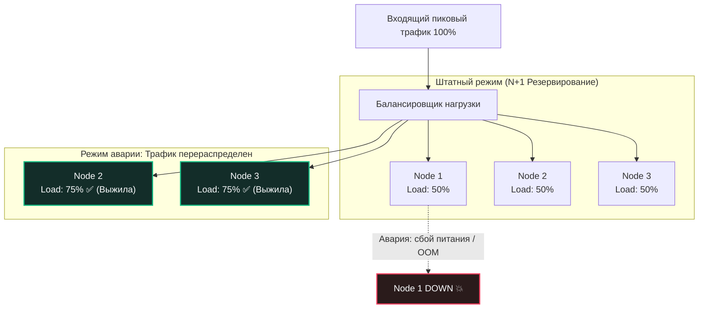

В предыдущих главах мы детально разобрали, как испытывать сервисы на предельную прочность ([[1. Load testing]]) и как пресекать деградации алгоритмов в CI/CD пайплайнах ([[5. Performance regression detection]]). Но рано или поздно в кабинет инженеров заходит бизнес с вполне конкретной задачей: *«Через месяц стартует Черная Пятница и масштабная маркетинговая кампания. Мы ожидаем наплыв пользователей до 50 000 RPS. Сколько серверов нам нужно докупить в стойку или арендовать в облаке Kubernetes?»*

Отвечать на такой вопрос интуитивно — «ну давайте наугад поднимем 100 подов» — признак дилетантизма. Избыточное резервирование железа бездумно сжигает бюджет компании на облачную инфраструктуру. Недостаточное — неминуемо приведет к каскадному коллапсу серверов, отказу базы данных и многомиллионным финансовым и репутационным потерям.

**Capacity Planning (Планирование емкости)** — это строгая инженерная дисциплина, переводящая бизнес-метрики (RPS, DAU, пиковые всплески) в математически выверенные требования к аппаратному обеспечению (CPU Cores, RAM, Network Bandwidth, Disk IOPS) с учетом специфики планировщика и сборщика мусора языка Go.

---

## 1. Фундамент: Закон Литтла (Little's Law)

Математический базис любого планирования емкости лежит в классической теории массового обслуживания (Queuing Theory). Фундаментальное уравнение, которое обязан уверенно применять каждый Senior-инженер и системный архитектор, сформулировал профессор Джон Литтл в 1961 году:

$$ L = \lambda \times W $$

В контексте распределенных систем и рантайма Go эти переменные имеют предельно осязаемый физический смысл:
* $L$ (**In-Flight Requests**) — среднее количество запросов, одновременно находящихся в процессе обработки внутри сервиса. В архитектуре Go каждый входящий сетевой коннект обслуживается отдельной легковесной нитью: следовательно, $L$ — это **количество активных горутин**, занятых полезным вычислением или ожидающих ответа от внешних систем.
* $\lambda$ (**Arrival Rate**) — интенсивность входящего потока запросов (RPS, Requests Per Second).
* $W$ (**Residence Time / Latency**) — среднее время полной обработки одного запроса от момента приема сокета до отправки последнего байта ответа (в секундах).

```
Закон Литтла в действии:
Входящий поток (λ = 10 000 RPS) ───► [ Сервер Go: Latency W = 0.05c ] ───► Ответы
                                               │
                                               ▼
                              L = 10 000 * 0.05 = 500 горутин в памяти
```

### Наглядный расчет: коварство медленного бэкенда

Представим штатный сценарий: ваш микросервис держит $\lambda = 10\,000 \text{ RPS}$. Среднее время выполнения одного запроса (с учетом легковесного запроса в Redis) составляет $W = 50 \text{ мс}$ ($0.05 \text{ с}$).
$$ L = 10\,000 \times 0.05 = 500 \text{ горутин} $$
В памяти системы стабильно крутится всего 500 горутин. Процессор отдыхает, память свободна.

Но теперь представьте, что база данных PostgreSQL под высокой нагрузкой исчерпала пул соединений, и задержка ответа деградировала всего до $500 \text{ мс}$ ($0.5 \text{ с}$). Входящий поток $\lambda$ остался прежним — те же $10\,000 \text{ RPS}$.

Пересчитаем $L$ по закону Литтла:
$$ L = 10\,000 \times 0.5 = 5\,000 \text{ горутин} $$

Количество горутин, одновременно висящих в памяти, **выросло ровно в 10 раз**! Сервис мгновенно начинает выделять гигабайты оперативной памяти под стеки горутин и буферы сокетов, даже несмотря на то, что внешний трафик ни на один запрос не увеличился. Закон Литтла наглядно доказывает: емкость системы определяется не только входящим RPS, но и скоростью ее ответа.

---

## 2. Планирование CPU: Масштабирование по ядрам

Планировщик Go (G-M-P) великолепно утилизирует многоядерные процессоры. Однако перенос вычислений с 1 ядра на 32 ядра никогда не дает 32-кратного прироста скорости из-за **Закона Амдала** (Amdahl's Law), накладных расходов планировщика, конкуренции за блокировки (Lock Contention) и аппаратной синхронизации строк кэша ядер по протоколу когерентности MESI.

### Методика расчета потребности в ядрах (CPU Cores):

1. **Изолированный эталонный замер:** На этапе нагрузочного тестирования разворачивается эталонный инстанс с жестким ограничением в 1 виртуальное ядро (1 vCPU).
2. **Определение порога насыщения:** На сервис подается монотонно растущий синтетический профиль до достижения **70–80% утилизации ядра**.
   > *Никогда не проводите расчеты емкости по точке 100% загрузки CPU!* При достижении 90–100% процессорного времени время ожидания в очереди планировщика рантайма Go (`runq`) возрастает по экспоненте, а планировщик ядра Linux CFS (Completely Fair Scheduler) начинает безжалостно троттлить контейнер квотами cgroups.
3. **Фиксация эталонного RPS:** Допустим, 1 ядро при 80% загрузки стабильно обрабатывает $2\,000 \text{ RPS}$ в рамках заданного SLA по задержке.
4. **Математическая экстраполяция:** Для целевой нагрузки $50\,000 \text{ RPS}$ базовая потребность в процессорных ядрах составит:
   $$ \text{Cores} = \frac{50\,000}{2\,000} = 25 \text{ ядер} $$

```
Закон Амдала и выбор архитектуры масштабирования:
┌──────────────────────────────────────┐     ┌──────────────────────────────────────┐
│  Вертикальное (Scale-Up): 1x 32 CPU  │     │ Горизонтальное (Scale-Out): 8x 4 CPU │
│  - Высокий Lock Contention           │ vs  │  - Изоляция кэшей L1/L2              │
│  - Межъядерный трафик шины MESI      │     │  - Нулевая межпроцессорная синхрониз.│
│  - Единая точка отказа               │     │  - Высокая отказоустойчивость        │
└──────────────────────────────────────┘     └──────────────────────────────────────┘
```

Из-за накладных расходов межъядерной синхронизации одна гигантская виртуальная машина на 32 ядра почти всегда будет проигрывать по эффективности пулу из 8 небольших виртуальных машин по 4 ядра каждая.

> [!warning] Ловушка / Gotcha: IO-bound против CPU-bound
> При расчете ядер критически важно понимать физическую природу ваших узких мест:
> - **IO-bound сервисы** (прокси, шлюзы API, роутеры к Redis/PostgreSQL): 5000 активных горутин практически не потребляют циклы CPU. Они спят в системном мультиплексоре `netpoller` ядра Linux (`epoll`/`kqueue`), ожидая дескрипторов ввода-вывода. В таких сценариях одно ядро способно переваривать десятки тысяч RPS.
> - **CPU-bound сервисы** (вычисление хэшей Argon2/bcrypt, валидация подписей JWT, тяжелая сериализация огромных Protobuf/JSON, компрессия gzip/zstd, ресайз изображений): горутины беспрерывно жгут такты ALU. 500 горутин на 4 физических ядрах немедленно вызовут жесткое процессорное голодание (CPU Starvation), гигантские очереди в локальных очередях выполнения `runq`, а задержка `p99 latency` улетит в бесконечность.

---

## 3. Планирование RAM: Учитываем аппетит Garbage Collector

Расчет оперативной памяти в Go — самая частая причина катастроф на продакшене. Разработчики, привыкшие к языкам без сборщика мусора, рассуждают линейно: «Размер структуры события 1 КБ, в памяти хранится 1 000 000 событий, значит, нам нужен ровно 1 ГБ RAM». На практике такой сервис будет немедленно уничтожен демоном `oom-killer` операционной системы.

Потребление памяти Go-процессом складывается из трех независимых физических уровней:

1. **Static / Base Footprint:** Размер скомпилированного машинного кода, рантайма Go, метаданных типов, глобальных переменных, статических кэшей (`sync.Map`, предвыделенных пулов `sync.Pool`).
2. **In-Flight Data (Рабочая нагрузка в полете):** Оперативная память, занятая текущими $L$ обрабатываемыми запросами (из закона Литтла):
   * Стек каждой активной горутины: начинается от 2 КБ и динамически расширяется до мегабайт при глубоком стеке вызовов.
   * Буферы сетевого ввода-вывода: стандартный буфер чтения/записи сокета (`io.Copy`, `bufio.Reader`) потребляет от 4 КБ до 32 КБ на каждое открытое клиентское соединение.
3. **GC Overhead (Мусор, ожидающий сборки):** Доминирующая составляющая памяти.

По умолчанию сборщик мусора Go ориентируется на коэффициент `GOGC=100`. Это означает, что сборщик мусора позволяет динамической куче (Heap) **вырасти еще на 100% от объема живых достижимых данных**, прежде чем запустит очередной цикл Mark & Sweep:

$$ \text{Total Memory} \approx \text{Base} + (L \times \text{Size}) \times \left(1 + \frac{\text{GOGC}}{100}\right) $$

Если в момент пиковой нагрузки объем реально обрабатываемых живых данных составляет 2 ГБ, то при дефолтном `GOGC=100` приложение запросит у ядра Linux **4 ГБ оперативной памяти**, накапливая мусор до следующей сборки.

```
Анатомия потребления памяти в Go-сервисе:
┌────────────────────────────────────────────────────────────────────────┐
│ 1. Base / Static: 200 MB (Код, рантайм, системные кэши)                │
├────────────────────────────────────────────────────────────────────────┤
│ 2. In-Flight Data: 1.2 GB (Живые объекты, стеки 5000 горутин, буферы)  │
├────────────────────────────────────────────────────────────────────────┤
│ 3. GC Overhead (GOGC=100): 1.2 GB (Мусорные объекты до триггера GC)   │
└────────────────────────────────────────────────────────────────────────┘
Итого фактическое потребление: 2.6 GB (Превышает cgroups limit 2.0 GB!)
```

> [!tip] Собеседование
> **Вопрос:** Мы выделили контейнеру в кластере Kubernetes жесткий лимит по памяти `resources.limits.memory = 2Gi`. Метрики Prometheus показывают, что объем активных живых структур в приложении не превышает 1.2 ГБ. Почему контейнер регулярно падает с кодом ошибки 137 (OOMKilled)?
> 
> **Ответ:** Причина кроется в механике сборщика мусора при стандартном значении `GOGC=100`. Имея 1.2 ГБ живых данных, рантайм Go запланирует следующий цикл очистки только тогда, когда куча вырастет на 100% — то есть достигнет $1.2 + 1.2 = 2.4 \text{ ГБ}$. Однако ядро Linux отслеживает жесткий лимит cgroups памяти в 2.0 ГБ. В момент, когда куча достигает 2.0 ГБ, ядро видит превышение квоты и отправляет процессу сигнал `SIGKILL`.
> 
> **Решение:** Начиная с Go 1.19, необходимо задавать мягкий лимит памяти через переменную окружения `GOMEMLIMIT=1800MiB` (примерно 90% от лимита контейнера). При приближении кучи к этой границе рантайм Go будет запускать GC более агрессивно и своевременно возвращать страницы памяти ОС через `madvise`, защищая контейнер от OOM-Killer.

---

## 4. Сетевые квоты облаков (Bandwidth & PPS)

Инженеры часто воспринимают сетевой кабель как бесконечную трубу. Однако в облачных платформах (AWS EC2, GCP Compute Engine, Yandex Cloud) гипервизор жестко квотирует сеть для каждой виртуальной машины.

Два главных сетевых барьера:

1. **Bandwidth (Полоса пропускания в Гбит/с):**
   Рассчитывается по формуле:
   $$ \text{Bandwidth} = \lambda \times (\text{Размер входящего запроса} + \text{Размер исходящего ответа}) $$
   Если сервис отвечает крупными JSON-документами размером по 50 КБ при нагрузке 5 000 RPS:
   $$ 5\,000 \times 50 \text{ KB} = 250 \text{ MB/s} = 2\,000 \text{ Mbps} \approx 2 \text{ Gbps} $$
   Бюджетные виртуальные машины часто ограничены полосой в 1 Gbps. При попытке выдать 2 Gbps сетевой адаптер гипервизора начнет молча отбрасывать TCP-пакеты (Packet Drops).
2. **PPS (Packets Per Second — Пакеты в секунду):**
   Даже если полезная нагрузка запроса мизерная (например, микросервис проверки баланса шлет 60 байт), каждый HTTP-запрос порождает на физическом уровне цепочку пакетов протокола TCP (SYN, ACK, PSH, FIN). Облачные виртуальные интерфейсы имеют строгий лимит коммутации пакетов (обычно от 100 000 до 300 000 PPS для средних инстансов). Превышение лимита PPS приводит к лавинообразному росту сетевых ретрансмитов (`TCP Retransmissions`) и внезапному скачку времени ожидания.

---

## 5. Архитектурное правило N+1 и деградация нод

Capacity Planning никогда не проектируется «впритык» под 100% утилизацию оборудования. Если расчет показал, что для обслуживания пика нужно ровно 3 сервера, загруженных на 95%, вы построили карточный домик, готовый рухнуть от легкого дуновения ветра.



В Highload-инженерии действует золотой стандарт отказоустойчивости — **правило резервирования N+1 (или N+2 при распределении по независимым дата-центрам)**:

* Пул вычислительных узлов рассчитывается так, чтобы в штатном пиковом режиме сервера были утилизированы максимум на **60–70%**.
* Если один сервер внезапно умирает (отказ планки памяти, Kernel Panic, сбой гипервизора или OOM), балансировщик мгновенно распределяет весь его трафик между оставшимися нодами.
* Если бы оставшиеся ноды работали на 90% мощности, перенос даже 10% нагрузки загнал бы их в 100%+ утилизацию. Начнется катастрофический **эффект домино (Cascading Failure)**: вторая нода умирает от перегрузки, оставшиеся берут еще больше трафика и падают следом за секунды.

---

## Резюме

1. **Закон Литтла — основа основ:** Формула $L = \lambda W$ доказывает: объем ресурсов, удерживаемых в памяти сервиса (горутины, сокеты, стеки), прямо пропорционален не только входящему RPS, но и скорости работы базы данных и внешних API.
2. **Планируйте CPU с запасом:** Целевая утилизация ядер не должна превышать 70–80%. Горизонтальное масштабирование (Scale-Out) предпочтительнее вертикального (Scale-Up) из-за закона Амдала и накладных расходов синхронизации кэшей CPU.
3. **Память в Go требует учета GC:** Из-за коэффициента `GOGC=100` реальное потребление памяти в 2 раза превышает объем полезных живых данных. Всегда конфигурируйте `GOMEMLIMIT` в контейнерах для предотвращения ударов OOM-Killer.
4. **Учитывайте сетевые лимиты:** Не забывайте рассчитывать ограничения виртуальных машин на пропускную способность (Gbps) и коммутацию пакетов (PPS).
5. **Закон N+1:** Никогда не проектируйте инфраструктуру впритык. Запас мощности в 30–40% спасает систему от каскадных сбоев при аварии отдельных серверов.

Мы рассчитали базовый парк серверов для обслуживания пиковой нагрузки Черной Пятницы. Но реальный суточный трафик колеблется: ночью нагрузка падает в 10 раз, а днем подскакивает волнами. Держать сотни серверов включенными круглосуточно — экономическое расточительство. Как заставить инфраструктуру автоматически сжиматься и расширяться вслед за дыханием трафика? Переходим к динамическому масштабированию: [[7. Autoscaling]].