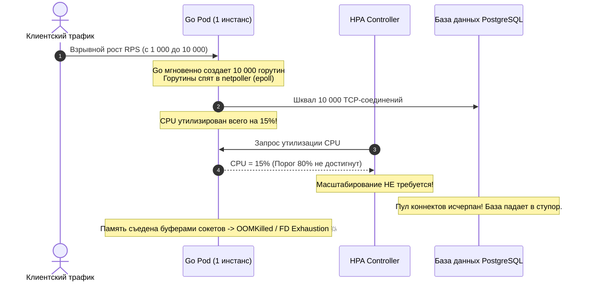
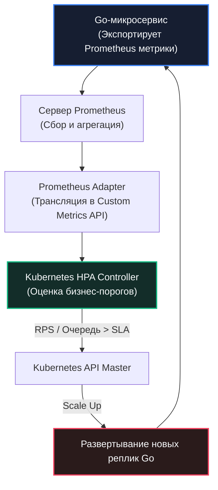

В предыдущей главе [[6. Capacity planning]] мы провели детальные расчеты и выяснили, сколько вычислительных мощностей требуется нашему сервису, чтобы пережить колоссальный шторм в час пик (например, во время Черной Пятницы). Но интернет устроен так, что пользовательская активность непрерывно пульсирует: в глухой ночной час трафик падает в 5–10 раз по сравнению с вечерним прайм-таймом.

Держать зарезервированные под пиковый шторм сотни серверов круглосуточно (24/7) — непозволительное расточительство бюджета. Чтобы инфраструктура оставалась гибкой и экономически эффективной, поверх базового планирования емкости настраивается **Автомасштабирование (Autoscaling)**.

В мире Cloud-Native (Kubernetes) и Go-бэкенда автомасштабирование демонстрирует чудеса эффективности благодаря крошечному потреблению памяти и феноменально быстрому старту скомпилированных бинарников Go. Однако слепое копирование стандартных манифестов и игнорирование законов планировщика рантайма превращают автоскейлинг в коварную мину замедленного действия: он способен либо уронить базу данных, либо устроить клиентам шквал оборванных сетевых соединений.

---

## 1. Горизонтальное vs Вертикальное масштабирование

В экосистеме Kubernetes предусмотрено два фундаментальных вектора автоскейлинга:

1. **VPA (Vertical Pod Autoscaler)** — динамическое изменение аллокаций ресурсов (`resources.requests` и `resources.limits` по CPU и RAM) для уже запущенного пода.
2. **HPA (Horizontal Pod Autoscaler)** — динамическое изменение *количества* реплик (подов) сервиса в зависимости от текущей нагрузки.

```
Векторы масштабирования:
┌──────────────────────────────────────┐     ┌──────────────────────────────────────┐
│  VPA (Vertical Pod Autoscaler)       │     │  HPA (Horizontal Pod Autoscaler)     │
│  Увеличение размеров одного пода     │ vs  │  Размножение подов-реплик            │
│  [ CPU: 1 -> 4 | RAM: 1GB -> 4GB ]   │     │  [ Pod 1 ] [ Pod 2 ] [ Pod 3 ]       │
│  ❌ Опасно для Go (рестарты, GC)      │     │  ✅ Золотой стандарт для Go          │
└──────────────────────────────────────┘     └──────────────────────────────────────┘
```

> [!info] Под капотом
> Для микросервисов на Go **использование VPA категорически не рекомендуется** в боевом контуре.
> 
> Во-первых, классический VPA в Kubernetes не умеет изменять память контейнера на лету и принудительно перезапускает под (`evict`), сбрасывая все прогретые кэши и TCP-соединения. Во-вторых, рантайм Go (в особенности GC Pacer и мягкий лимит `GOMEMLIMIT`) жестко калибрует свои внутренние эвристики относительно фиксированного объема оперативной памяти. Изменение границ памяти «на лету» без перезапуска дезориентирует сборщик мусора Go, вызывая деструктивный цикл `mark assist` или внезапный удар OOM-Killer со стороны ядра Linux.

Инженерным стандартом Highload-систем на Go является **HPA (Горизонтальное автомасштабирование)**. Go-сервисы идеально рождены для горизонтального тиражирования: они проектируются как Stateless (состояние хранится во внешней СУБД или кэше), стартуют за считанные миллисекунды и практически не создают накладных расходов на системные библиотеки.

---

## 2. Mechanical Sympathy: Смертельная ловушка CPU-метрик

Подавляющее большинство вводных туториалов по Kubernetes рекомендуют настраивать HPA по банальной утилизации процессора (например, через старый параметр `targetCPUUtilizationPercentage: 80`):
```yaml
metrics:
- type: Resource
  resource:
    name: cpu
    target:
      type: Utilization
      averageUtilization: 80
```

Для скриптовых однопоточных платформ (Python, Ruby, Node.js) этот подход оправдан: входящий трафик упирается в GIL (Global Interpreter Lock) или цикл событий, CPU подпрыгивает до 100%, и контроллер HPA послушно разворачивает новые реплики.

Но для высококонкурентного сетевого сервиса на Go это **самая опасная ловушка из всех существующих**.

Вспомним физику модели `netpoller` (подробно разобранную в [[1. Load testing]]). Подавляющее большинство микросервисов решают задачи класса IO-bound: принять HTTP/gRPC запрос, распаковать JSON, отправить SQL-запрос в PostgreSQL, подождать ответ и отправить клиенту результат. В таких сервисах 99% времени горутины проводят в глубоком сне, будучи запаркованными в мультиплексоре `epoll` ядра Linux в ожидании дескриптора сокета.

### Хроника катастрофы на продакшене:



1. Начинается резкий наплыв пользователей. Трафик подскакивает с 1 000 до 10 000 RPS.
2. Планировщик Go без малейшего напряжения создает 10 000 горутин по 2 КБ каждая. Каждая горутина открывает сокет к базе данных или внешнему сервису.
3. Поскольку горутины спят в `netpoller`, процессор загружен всего на **15%** (ядра тратят минимум тактов на простой паркинг тредов).
4. Контроллер HPA опрашивает cgroups: «Нагрузка 15%, а порог скейлинга — 80%. Все отлично, под справляется, добавлять реплики не нужно».
5. Сервис намертво забивает пул соединений СУБД, оперативная память распухает от системных буферов сокетов ядра Linux, и процесс гибнет от исчерпания файловых дескрипторов (FD Exhaustion) или падает под ударом `oom-killer`.

**Вывод:** Автомасштабирование высокопроизводительных Go-сервисов **категорически запрещено** завязывать на голый CPU.

---

### Архитектура Custom Metrics: HPA + Prometheus Adapter и KEDA

В зрелых инфраструктурах HPA управляется через механизм внешних метрик (**Custom Metrics**), поступающих напрямую из систем мониторинга:



Метрики, на которых строится надежное масштабирование:
* **HTTP Requests Per Second (RPS):** Оптимальный выбор для открытых API-шлюзов. Правило: если на один под приходится более 500 RPS — контроллер немедленно поднимает новую реплику.
* **Queue Length (Глубина очереди сообщений):** Незаменимо для асинхронных воркеров Kafka, RabbitMQ или NATS. Если в очереди скопилось более 10 000 необработанных сообщений, кластер наращивает число консьюмеров.
* **Active Connections:** Количество удерживаемых долгоживущих TCP/WebSocket сессий на под.

> [!info] Под капотом
> В современной облачной индустрии стандартом де-факто для событийно-ориентированного масштабирования стал оператор **KEDA (Kubernetes Event-driven Autoscaling)**. KEDA умеет скейлить поды в ноль (**Scale-to-Zero**), когда очереди пусты, и опрашивает брокеры сообщений (Kafka Consumer Lag, Redis List Length, SQS) напрямую через легковесные скейлеры, минуя тяжеловесные цепочки с Prometheus Adapter.

---

## 3. Проблема инерции и прогрева (Cold Start)

Когда HPA фиксирует превышение порога и отдает команду на масштабирование, новые вычислительные мощности материализуются далеко не мгновенно:
1. **Планирование пода (Pod Scheduling):** Kubernetes выбирает подходящую рабочую ноду и скачивает образ контейнера (1–3 секунды).
2. **Инерция инфраструктуры (Cluster Autoscaler):** Если в кластере закончились физические ресурсы, Cluster Autoscaler отправляет запрос в облачный API (AWS EC2, GCP) на выделение новой виртуальной машины. Это занимает **от 1 до 5 минут**.
3. **Холодный старт бинарника Go:** Приложению необходимо время на прогрев кэшей процессора L1i/L2, инициализацию пулов соединений к БД и калибровку GC Pacer (как мы подробно разобрали в [[4. Canary releases]]).

Если трафик налетает резким прямоугольным импульсом (Spike), автоскейлинг просто физически не успеет среагировать. Пока облако поднимает виртуальные машины, существующие поды будут раздавлены перегрузкой.

### Инженерные меры борьбы с инерцией:

* **Overprovisioning (Резервный буфер емкости):** Порог срабатывания HPA всегда настраивается существенно ниже предела прочности приложения. Если нагрузочный тест показал, что сервис начинает деградировать при 2 000 RPS, границу скейлинга устанавливают на **1 200 RPS**. Образовавшийся буфер безопасности в 40% удержит удар нагрузки в течение тех 3 минут, пока прогреваются свежие узлы.
* **Readiness Probes с синтетическим прогревом:** Никогда не отдавайте реальный трафик на под сразу после старта функции `main()`. Реализуйте в коде процедуру инициализации (Warm-up): выполните серию фиктивных запросов к СУБД, чтобы наполнить пулы соединений `database/sql`, прогрейте кэши памяти, и только после этого возвращайте `200 OK` на пробу готовности `readinessProbe` Kubernetes.

---

## 4. Масштабирование вниз и Graceful Shutdown

Увеличение числа реплик (Scale Up) спасает от перегрузки. Но уменьшение числа реплик (**Scale Down**), когда волна трафика спала, таит в себе не меньшую опасность: потерю данных и разрыв пользовательских транзакций.

Когда оркестратор Kubernetes принимает решение удалить избыточный под, он не ждет пассивно:
1. Под переводится в состояние `Terminating` и исключается из эндпоинтов сервиса.
2. Процессу отправляется системный сигнал **SIGTERM**.
3. Запускается таймер обратного отсчета `terminationGracePeriodSeconds` (по умолчанию 30 секунд).
4. Если процесс не завершился по истечении таймера, ядро Linux уничтожает его беспощадным сигналом **SIGKILL**.

Если Go-сервис при получении `SIGTERM` просто выходит из `main()`, все клиенты, чьи запросы находились в сокетах в момент обработки, получат ошибки `HTTP 502 Bad Gateway` или оборванные TCP-сессии, а незавершенные транзакции в базе данных откатятся с ошибкой.

В каждом боевом сервисе на Go обязана присутствовать каноническая реализация паттерна **Graceful Shutdown (Корректное завершение работы)**:

```go
package main

import (
	"context"
	"log"
	"net/http"
	"os"
	"os/signal"
	"syscall"
	"time"
)

func main() {
	srv := &http.Server{
		Addr:    ":8080",
		Handler: myRouter(),
	}

	// 1. Запускаем HTTP-сервер в отдельной фоновой горутине
	go func() {
		if err := srv.ListenAndServe(); err != nil && err != http.ErrServerClosed {
			log.Fatalf("Ошибка ListenAndServe: %v\n", err)
		}
	}()

	// 2. Создаем буферизованный канал для приема сигналов операционной системы
	quit := make(chan os.Signal, 1)
	// K8s при Scale Down или деплое отправляет процессу сигнал SIGTERM
	// При локальной остановке через Ctrl+C в терминале летит сигнал SIGINT
	signal.Notify(quit, syscall.SIGINT, syscall.SIGTERM)

	// 3. Блокируем main горутину до момента поступления сигнала
	sig := <-quit
	log.Printf("Получен сигнал завершения: %v. Инициируем Graceful Shutdown...\n", sig)

	// 4. Формируем контекст с жестким таймаутом на доработку активных запросов
	// ВАЖНО: Таймаут в коде обязан быть МЕНЬШЕ, чем terminationGracePeriodSeconds в K8s!
	ctx, cancel := context.WithTimeout(context.Background(), 25*time.Second)
	defer cancel()

	// 5. Метод srv.Shutdown выполняет канонический протокол остановки:
	//    а) Немедленно закрывает слушающий TCP-сокет, блокируя прием новых подключений.
	//    б) Закрывает все простаивающие keep-alive соединения.
	//    в) Терпеливо дожидается завершения обработки всех активных запросов.
	if err := srv.Shutdown(ctx); err != nil {
		log.Fatalf("Принудительное завершение сервера по таймауту: %v\n", err)
	}

	log.Println("Сервер успешно и безопасно завершил работу.")
}
```

> [!tip] Собеседование
> **Вопрос:** Мы внедрили канонический `srv.Shutdown()` с таймаутом в 25 секунд. Однако во время автомасштабирования вниз (Scale Down) клиенты все равно стабильно получают всплески ошибок `HTTP 502 Bad Gateway`. В чем фундаментальная причина и как ее исправить?
> 
> **Ответ:** Причина кроется в **асинхронной природе распространения событий в сети Kubernetes**. 
> В ту же миллисекунду, когда kubelet отправляет вашему контейнеру сигнал `SIGTERM`, контроллер конечных точек (Endpoints Controller) начинает процесс удаления IP-адреса пода из сетевой таблицы маршрутизации (`iptables`, `IPVS` или eBPF в Cilium/Calico). 
> 
> Обновление правил маршрутизации на всех нодах кластера занимает от нескольких сотен миллисекунд до нескольких секунд. Если ваш сервис мгновенно вызовет `srv.Shutdown()` и закроет слушающий порт, балансировщик (Ingress / Envoy) успеет переслать на него несколько входящих клиентских запросов по еще «не остывшим» старым правилам маршрутизации. Клиент получит TCP `RST` и ошибку `HTTP 502`.
> 
> **Инженерное решение:** Добавьте небольшую паузу `time.Sleep(5 * time.Second)` в обработчик `SIGTERM` **перед** вызовом `srv.Shutdown()`, либо используйте Kubernetes Lifecycle Hook `preStop: exec: command: ["/bin/sleep", "5"]`. Это гарантирует, что сеть кластера успеет удалить под из балансировки до того, как Go закроет порт.

---

## Резюме

1. **Используйте HPA:** Go-микросервисы идеально подходят для горизонтального тиражирования. Избегайте VPA в боевой эксплуатации из-за паразитных рестартов и несовместимости с тонкими эвристиками аллокатора и `GOMEMLIMIT`.
2. **CPU — обманчивая метрика:** Для IO-bound сервисов горутины спят в `netpoller`, процессор простаивает на 15%, а база данных захлебывается. Стройте HPA на базе внешних метрик (**Custom Metrics**) через Prometheus Adapter или оператор KEDA (RPS, длина очередей Kafka/RabbitMQ).
3. **Управляйте инерцией:** Выделение новых облачных виртуальных машин занимает до 5 минут. Держите буфер прочности (Overprovisioning) на уровне 30–40% и прогревайте пулы базы данных перед отдачей статуса `Readiness`.
4. **Graceful Shutdown обязателен:** Перехватывайте сигнал `SIGTERM` и используйте `srv.Shutdown(ctx)`. Чтобы исключить ошибки HTTP 502 при рассинхронизации сетевых правил кластера, выдерживайте паузу `preStop sleep` перед закрытием порта.

Мы научили систему динамически дышать: поды рождаются и гаснут сотнями в ответ на приливы и отливы трафика. Но когда распределенный монолит распадается на сотни динамических контейнеров, традиционные методы отладки через SSH и чтение локальных логов становятся бесполезными. Как увидеть целостную картину здоровья системы сквозь терабайты телеметрии? Открываем фундаментальный инженерный пласт: [[8. Observability и performance]].