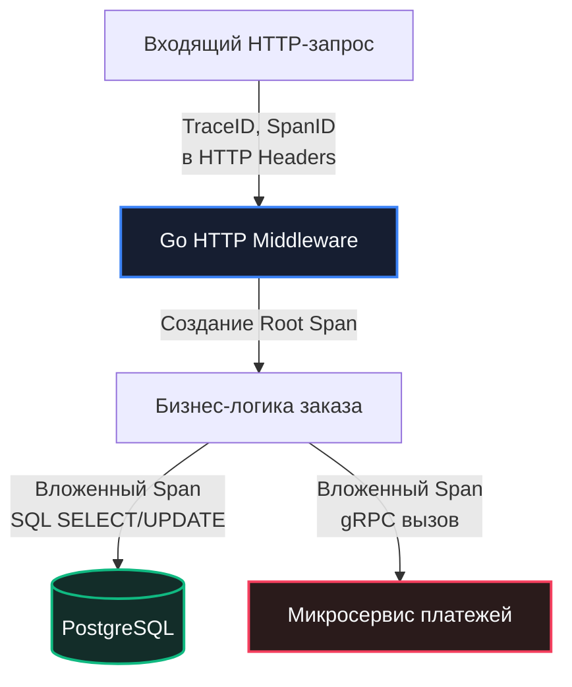

В предыдущей главе [[7. Autoscaling]] мы передали бразды правления инфраструктурой автоматическим алгоритмам Kubernetes: поды динамически рождаются десятками при наплыве пользователей и столь же стремительно уничтожаются при отливе нагрузки. Но в такой эфемерной, распределенной среде классические методы инженерной отладки — зайти на сервер по SSH, сделать `tail -f /var/log/app.log` или прицепиться к процессу интерактивным отладчиком — окончательно теряют смысл.

Представьте картину: в кластере работают 50 реплик микросервиса, обрабатывающих 30 000 RPS. Внезапно каждый тысячный запрос зависает дольше чем на две секунды, вызывая раздражение клиентов. Ни на одной конкретной ноде вы эту проблему «глазами» не увидите. Вам необходимо сделать систему прозрачной и **Наблюдаемой (Observable)**.

В инженерной практике высокой производительности **Observability (Наблюдаемость)** — это вовсе не набор красивых разноцветных панелей в Grafana. Это математическая способность системы отвечать на любые непредвиденные вопросы о своем внутреннем состоянии исключительно на основе данных, которые она экспортирует наружу. В индустрии эти данные называют «тремя столпами наблюдаемости»: **Метрики (Metrics)**, **Трассировки (Distributed Tracing)** и **Логи (Structured Logs)**.

Но у любого наблюдения есть своя физическая цена. Инструментирование кода, сбор данных, сериализация и отправка телеметрии по сети — это тоже инструкции процессора и байты памяти. Если написать этот слой небрежно, система наблюдения сама станет главной причиной деградации продакшена, наглядно демонстрируя квантовый эффект наблюдателя.

---

## 1. Метрики (Prometheus): Дешево, быстро и сердито

Метрики представляют собой сжатые числовые показатели (счетчики, гистограммы, уровни), снабженные набором тегов-лейблов и привязанные к временной шкале (Time Series). Они служат идеальным инструментом для оценки макро-состояния системы: общей задержки, пропускной способности и частоты ошибок.

В экосистеме Go абсолютным стандартом стала система **Prometheus**. Ключевое архитектурное преимущество Prometheus — **Pull-модель**:
* Ваше Go-приложение не тратит драгоценные миллисекунды на отправку UDP/TCP-пакетов куда-то вовне на каждый запрос.
* Код в горячем пути лишь инкрементирует числовые переменные прямо в оперативной памяти (используя атомики `sync/atomic` или узкие блокировки).
* Раз в 10–15 секунд сервер Prometheus сам забирает срез телеметрии через легковесный эндпоинт `/metrics`.

### Mechanical Sympathy: Аппаратная цена одного счетчика

В официальной библиотеке `prometheus/client_golang` инкремент счетчика `Counter.Inc()` занимает всего 5–10 наносекунд. Чтобы избежать взаимного торможения горутин на многоядерных машинах, внутренние структуры данных библиотеки выравниваются по границам 64-байтных строк процессорного кэша, предотвращая катастрофический эффект False Sharing (подробнее в [[8. False sharing]]).

Однако главная опасность метрик кроется не в процессорных тактах, а в оперативной памяти.

```
Анатомия временного ряда (Time Series) в памяти:
Metric: http_request_duration_seconds{method="GET", route="/api/v1/user", status="200"}
Каждая уникальная комбинация тегов = Выделенная структура памяти в Heap Go и Prometheus!
```

> [!warning] Ловушка / Gotcha: Взрыв кардинальности (Cardinality Explosion)
> Каждый уникальный набор значений меток (labels) порождает в рантайме Go и базе данных Prometheus **новый независимый объект временного ряда**, который занимает место в оперативной памяти вплоть до перезапуска процесса.
> 
> ```go
> // ПЛОХО: Лейбл user_id уникален для миллионов пользователей
> requestDuration.WithLabelValues("GET", "/api/v1/profile", "user_123456").Observe(0.5)
> ```
> 
> Если неопытный разработчик добавит в лейблы `user_id`, `session_id`, номер заказа или сырой URL-путь с динамическими ID (`/order/748392`), комбинаторика мгновенно выйдет из-под контроля. Сервис породит миллионы временных рядов, поглотит гигабайты оперативной памяти и будет уничтожен `oom-killer` в течение нескольких минут.
> 
> **Железное правило:** Лейблами метрик могут быть исключительно конечные множества (**Enums**) с ограниченным числом значений: HTTP-методы (`GET`, `POST`), статусы ответов (`200`, `404`, `500`), статические шаблоны маршрутов (`/api/v1/users/:id`) и имена микросервисов.

### Нулевой оверхед: пакет `runtime/metrics`

Начиная с Go 1.16 (и с фундаментальными расширениями в Go 1.21+), стандартная библиотека предоставляет пакет `runtime/metrics`. Это низкоуровневый, стандартизированный интерфейс, позволяющий читать внутренние счетчики рантайма напрямую из структур ядра Go без накладных расходов:

* `/gc/pauses:seconds` — непрерывная гистограмма пауз Stop-The-World сборщика мусора.
* `/sched/goroutines:goroutines` — мгновенное число существующих горутин.
* `/memory/classes/heap/objects:bytes` — точный объем активных живых объектов в куче.

Если на графиках задержек вашего сервиса возникли необъяснимые пики, первым делом сопоставьте их с метрикой `/gc/pauses:seconds`.

---

## 2. Distributed Tracing (OpenTelemetry): Анатомия распределенных задержек

Метрики надежно сигнализируют о том, *что* задержка `p99 latency` взлетела до 2 секунд. Но они абсолютно бессильны объяснить, *где именно* внутри сложной цепочки микросервисов потерялись эти две секунды.

Для детальной вивисекции запроса применяется **Распределенная трассировка (Distributed Tracing)** на базе открытого стандарта **OpenTelemetry (OTel)**.

Каждому входящему запросу на периметре системы присваивается глобальный уникальный идентификатор `TraceID`. При переходе от сервиса к сервису `TraceID` передается в HTTP-заголовках (`traceparent`). Каждый внутренний этап работы — выполнение запроса к PostgreSQL, обращение в Redis, обращение к внешнему API или сложный расчет — оформляется в виде интервала-спана (`Span`), образуя связное направленное ациклическое дерево вызовов:



В идиоматичном Go трассировка органично опирается на стандартный тип `context.Context`. Мы передаем `ctx` первым аргументом во все функции именно для того, чтобы OpenTelemetry мог извлечь текущий родительский спан и привязать к нему дочерний.

### Mechanical Sympathy: Аллокации контекста и стратегии сэмплирования

> [!info] Под капотом
> Контекст `context.Context` в Go спроектирован как иммутабельный связный список. Каждый вызов `context.WithValue` или добавление нового спана порождает **новый узел дерева**.
> 
> Поскольку интерфейс `context.Context` передается по стеку дальше и должен пережить текущий стековый фрейм, механизм Escape Analysis почти гарантированно отправляет этот узел в динамическую кучу (Heap). Сборщик спанов обязан зафиксировать метку времени `time.Now()`, сериализовать строковые атрибуты и сохранить спан в кольцевой буфер для отправки в коллектор (Jaeger / Tempo). 
> 
> Если в системе под нагрузкой 20 000 RPS трассировать 100% запросов, сам процесс генерации спанов может отобрать до 25–30% процессорных ресурсов и перегрузить сеть.

Чтобы трассировка не разорила инфраструктуру, применяются строгие стратегии **сэмплирования (Sampling)**:

```
Стратегии сэмплирования трасс:
1. Head-based: Gateway кидает кубик (1%) ──► Трассируем 1 из 100 (дешево, но теряем редкие ошибки)
2. Tail-based: Go генерирует спаны ───────► Collector буферизует ──► Сбрасывает на диск ТОЛЬКО сбои
```

1. **Head-based Sampling (Сэмплирование на входе):** Решение о сборе трассы принимается на самом входе в систему (API Gateway) стохастически — например, собирается ровно 1% запросов. Для остальных 99% запросов контекст снабжается легковесным `noop tracer`, и Go-приложение не тратит ни одного такта CPU на создание реальных спанов. Минус: мы можем пропустить единичные редкие запросы, завершившиеся критической ошибкой.
2. **Tail-based Sampling (Сэмплирование на выходе):** Go-сервисы создают спаны для всех запросов, но отправляют их в локальный сайдкар-агент (**OpenTelemetry Collector**). Агент держит трассы в кольцевом буфере памяти и сбрасывает их в постоянное хранилище (Jaeger, Tempo) **только в том случае**, если запрос завершился ошибкой `HTTP 5xx` или его общая длительность превысила заданный порог SLA. Это обеспечивает 100% фиксацию всех аномалий.

---

## 3. Логирование в Highload: Философия Zero-Allocation

Логирование — старейший и наиболее коварный вид телеметрии. В современных контейнеризированных средах логи пишутся в поток `stdout`, откуда перехватываются агентами ядра (FluentBit, Promtail, Vector) и маршрутизируются в хранилища (Elasticsearch, Loki, ClickHouse).

Классический пакет `log` из стандартной библиотеки Go совершенно непригоден для высоких нагрузок:
- Каждая запись захватывает глобальный `sync.Mutex`, блокируя параллельные горутины при выводе в терминал.
- Форматирование через `fmt.Sprintf` внутри `log.Printf` гарантирует упаковку примитивов в интерфейсы `interface{}` (boxing) и непрерывные аллокации строк в куче (подробно в [[1. Уменьшение аллокаций]]).

В Highload-инженерии используется исключительно **Структурированное логирование (Structured Logging)** с нулевыми аллокациями памяти.

> [!tip] Собеседование
> **Вопрос:** Почему библиотека логирования `uber-go/zap` работает на порядки быстрее классических логеров вроде `logrus` или стандартного пакета `log`?
> 
> **Ответ:** Архитектура `zap` построена на двух фундаментальных принципах:
> 1. **Отказ от рефлексии и Boxing:** Вместо приема произвольных значений через `interface{}` (`zap.Any`), библиотека обязывает использовать строго типизированные конструкторы полей (`zap.Int`, `zap.String`, `zap.Duration`). Это позволяет процессору копировать примитивы напрямую без побега в кучу.
> 2. **Zero-Allocation буферизация через `sync.Pool`:** Под капотом `zap` не создает новые строки через конкатенацию. Он арендует предварительно выделенные байтовые буферы из пула `sync.Pool` (см. [[2. sync Pool]]), сериализует JSON-структуру напрямую в байтовый срез и сбрасывает его в файловый дескриптор, возвращая буфер в пул без нагрузки на сборщик мусора.

Начиная с версии Go 1.21, в стандартную библиотеку вошел современный пакет `log/slog`, вобравший в себя лучшие практики высокоскоростного структурированного логирования.

### Золотые правила логирования в горячем пути (Hot Path):

1. **Никакой неявной конкатенации в аргументах:**
   ```go
   // ГРУБАЯ ОШИБКА: Конкатенация строк выполнится ВСЕГДА, даже если уровень Debug выключен!
   logger.Debug("user " + id + " loaded")
   
   // ПРАВИЛЬНО: Ленивая оценка структурированных полей
   logger.Debug("user loaded", slog.String("id", id))
   ```
   Если уровень `Debug` в конфигурации отключен, второй вариант мгновенно выйдет из метода по проверке числового уровня, не потратив ни одного байта на конкатенацию.
2. **Логируйте факты, а не шаги алгоритма:** Не превращайте лог-файлы в пошаговый трейс функций («entered func X», «exited func X»). Логи предназначены для фиксации **бизнес-событий** (оформлен заказ, списаны средства), **ошибок** и **смены состояний**. Для отслеживания потока управления используйте трассировку OpenTelemetry.

---

## 4. Синергия телеметрии: Exemplars (Экземпляры)

Вершиной инженерного искусства в области наблюдаемости является концепция **Exemplars (Экземпляры)** — бесшовный мост между агрегированными метриками и детальными трассировками.

В традиционном мониторинге вы видите на графике Prometheus скачок гистограммы `http_request_duration_seconds_bucket` до 3 секунд. Чтобы понять причину, вам приходится вручную открывать Jaeger, выставлять временной диапазон и наугад искать похожие запросы.

Exemplars решают эту проблему аппаратно: Prometheus-клиент при регистрации долгого наблюдения в гистограмму сохраняет метаданные — текущий `TraceID` из `context.Context`.

В Grafana это отображается в виде кликабельных точек прямо поверх графика перцентилей. Вы нажимаете на точку выброса на графике метрик и в один клик мыши открываете детальный водопад спанов Jaeger для того самого конкретного запроса, вызвашего этот всплеск. Время локализации аварии (MTTR — Mean Time To Resolution) сокращается с мучительных часов до считанных секунд.

---

## Резюме

1. **Observability имеет физическую стоимость:** Сбор телеметрии расходует такты процессора и оперативную память. Контролируйте оверхед наблюдаемости, чтобы она не ухудшала работу боевого сервиса.
2. **Остерегайтесь Cardinality Explosion:** В метриках Prometheus метки должны быть строго ограниченными множествами. Никогда не помещайте идентификаторы пользователей или сырые URL в теги.
3. **Используйте встроенный `runtime/metrics`:** Пакет стандартной библиотеки Go предоставляет стандартизированный и бесплатный доступ к внутренностям рантайма (паузы GC, число горутин, состояние кучи).
4. **Управляйте сэмплированием OpenTelemetry:** Для высоконагруженных потоков используйте Head-based или Tail-based Sampling для защиты от перерасхода ресурсов CPU и сети.
5. **Zero-Allocation логирование:** Применяйте структурированные логеры (`slog`, `zap`), используйте строго типизированные поля вместо `interface{}` и избегайте конкатенации строк в горячем коде.
6. **Связывайте метрики с трассировками через Exemplars:** Это обеспечивает мгновенный переход от графиков аномалий к конкретным трассам в Jaeger.

Мы вооружили наш сервис инструментами абсолютной прозрачности. Мы видим каждую горутину, каждый запрос к СУБД и каждый миллисекундный всплеск задержки. Но как превратить этот океан цифр в четкие договорные обязательства перед бизнесом и пользователями? Как формализовать границы между допустимой нормой и аварийным инцидентом? Переходим к кульминационной теме проектирования надежности: [[9. SLO и SLA]].