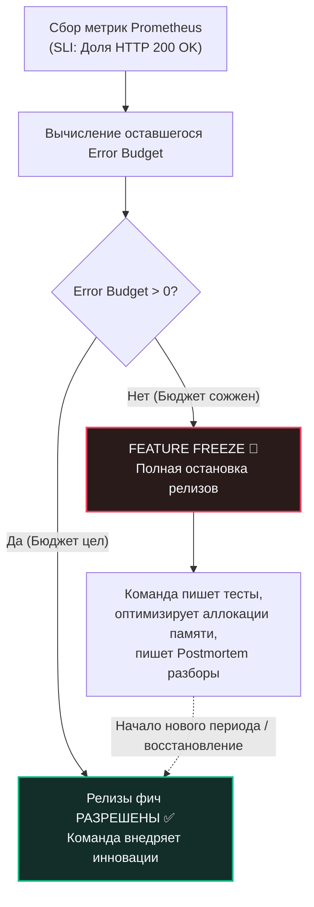

В предыдущей главе [[8. Observability и performance]] мы вооружили наш сервис полным спектром телеметрии: научились замерять входящий RPS, профилировать потребление памяти, следить за длительностью пауз сборщика мусора и собирать распределенные трассировки. Перед нами — безупречные дашборды, отображающие каждый такт работы распределенной системы.

Но именно здесь инженера подстерегает ключевой концептуальный вызов при переходе на уровень Lead / Principal Architect: **графики и сырые метрики сами по себе лишены бизнес-смысла**.

Представьте конкретную ситуацию: на вечернем графике Prometheus перцентиль задержки `p99 latency` вашего Go-сервиса подскочил с 50 мс до 150 мс. 
* Является ли это аварийным инцидентом?
* Обязан ли дежурный SRE-инженер поднимать команду посреди ночи?
* Нужно ли срочно останавливать релиз критически важной продуктовой фичи и переписывать код?

Глядя исключительно в код или на графики задержки, ответить на этот вопрос невозможно. Инженерная производительность обретает смысл только тогда, когда она привязана к финансовым и пользовательским целям компании. В современной культуре SRE (Site Reliability Engineering) и Highload-архитектуре этот мост между кремнием и бизнесом держится на трех китах: **SLI, SLO и SLA**.

---

## 1. Терминология: SLI, SLO, SLA

Хотя эти три акронима часто смешивают в разговорной речи, они обозначают строго разделенные уровни абстракции — от математических замеров в коде до юридических договоров с финансовой ответственностью.

```
Иерархия надежности:
┌────────────────────────────────────────────────────────────────────────┐
│ SLA (Соглашение): "Если доступность < 99.5%, мы платим неустойку"      │ ◄── Юристы / Бизнес
├────────────────────────────────────────────────────────────────────────┤
│ SLO (Целевой стандарт): "99.9% запросов успешны и p99 < 100ms"         │ ◄── Инженеры / SRE
├────────────────────────────────────────────────────────────────────────┤
│ SLI (Индикатор): Фактический замер (например, 99.94% за последние 30д)  │ ◄── Метрики Prometheus
└────────────────────────────────────────────────────────────────────────┘
```

### SLI (Service Level Indicator) — Индикатор уровня обслуживания
Это конкретная, измеримая количественная характеристика качества сервиса здесь и сейчас. Это объективный физический факт.
* **Плохой SLI:** *«Средняя загрузка процессоров в кластере составляет 45%»*. Пользователю абсолютно безразлично, сколько тактов CPU потратил сервер; пользователю важно, открылась ли его страница в браузере.
* **Хороший SLI:** Доля успешных HTTP-запросов со статусом `200 OK` относительно всех валидных клиентских запросов.
* **Хороший SLI:** Процентиль задержки `p99 latency` при получении профиля пользователя (как мы подробно разбирали в [[6. Метрики. p50, p95, p99]]).

### SLO (Service Level Objective) — Целевой уровень обслуживания
Это согласованный с бизнесом целевой порог для выбранного SLI, который инженерная команда обязуется поддерживать. Это внутренний компас надежности.
* **Пример SLO надежности:** 99.9% всех запросов к эндпоинту `/api/v1/checkout` должны завершаться без серверных ошибок (`5xx`) на скользящем окне в 30 дней.
* **Пример SLO скорости:** `p99 latency` генерации пользовательской ленты не должна превышать 250 миллисекунд при оценке за 5-минутный интервал.

### SLA (Service Level Agreement) — Соглашение об уровне обслуживания
Это официальный юридический и финансовый контракт, заключаемый с внешними клиентами или смежными департаментами компании. SLA строго формулирует штрафные санкции: *«Что произойдет, если мы нарушим установленные обязательства»*.
* **Пример SLA:** *«Если месячная доступность API падает ниже 99.5%, компания возвращает корпоративным клиентам 20% от суммы абонентской платы»*.
* **Золотое инженерное правило:** **Внутренний SLO обязан быть существенно строже внешнего SLA!** Если внешний контракт SLA обещает клиентам доступность 99.5%, ваша инженерная команда обязана держать внутренний SLO на уровне не ниже 99.9%. Этот буфер надежности дает инженерам драгоценное время на локализацию аварии задолго до того, как компания начнет нести прямые финансовые убытки.

---

## 2. Mechanical Sympathy: Физика и математика целей (Physics of SLOs)

При постановке инженерных целей неопытные менеджеры часто формулируют фантастические требования: *«Нам нужна 100% доступность сервиса и задержка p99 < 1ms»*.

С точки зрения законов физики, теории вероятностей и кремниевой архитектуры требование 100% надежности является **недостижимой утопией**.

Почему 100% надежности в распределенных системах не существует?
1. **Стохастическая природа сетей:** Транзитные магистральные оптоволоконные кабели рвутся экскаваторами, BGP-маршрутизаторы испытывают сбои маршрутизации, а TCP-пакеты неизбежно отбрасываются буферами сетевых карт.
2. **Аппаратные дефекты железа:** Контроллеры твердотельных накопителей (SSD) деградируют, серверные блоки питания выходят из строя, а ячейки оперативной памяти испытывают спонтанные инверсии битов (Bit flips) под воздействием космического излучения.
3. **Рантайм языка Go:** Даже если ваш код спроектирован в парадигме Zero Allocation и скомпилирован в чистый машинный код, операционная система периодически переключает контекст тредов ядра, а планировщик Go и сборщик мусора запускают фазы Stop-The-World. Если ваш SLO требует ответа строго за 1 мс, единственная пауза GC длительностью 2 мс сожжет ваш показатель в ноль.

```
Сравнение уровней доступности (Downtime в год):
┌──────────┬──────────────────────┬──────────────────────────────────────┐
│  SLO %   │ Допустимый простой   │ Инженерная цена                      │
├──────────┼──────────────────────┼──────────────────────────────────────┤
│  99%     │ 3.65 дня в год       │ 1 сервер, базовые бэкапы             │
│  99.9%   │ 8.76 часа в год      │ Kubernetes HPA, Multi-AZ, Canary     │
│  99.99%  │ 52.6 минуты в год    │ Multi-Region, Chaos Engineering      │
│  99.999% │ 5.26 минут в год     │ Военные бюджеты, астрономическая цена│
└──────────┴──────────────────────┴──────────────────────────────────────┘
```

Каждая дополнительная «девятка» после запятой увеличивает стоимость инфраструктуры экспоненциально.

> [!tip] Собеседование
> **Вопрос:** Заказчик требует закрепить в контракте SLO: «HTTP API платежного шлюза должен отвечать быстрее 5 миллисекунд в 99.99% запросов (`p99.99 < 5ms`)». При этом клиенты физически находятся в Европе (Франкфурт), а дата-центр с Go-бэкендом расположен в США (Северная Вирджиния). Реализуемо ли это требование при неограниченном бюджете на серверы?
> 
> **Ответ:** Это требование **физически невыполнимо** в нашей Вселенной. 
> Скорость света в вакууме составляет ~300 000 км/с (300 км за 1 миллисекунду). В стекле оптоволоконного кабеля свет распространяется со скоростью около 200 000 км/с. Расстояние от Франкфурта до Вирджинии по кабелям через Атлантический океан превышает 6 500 км в одну сторону.
> 
> Чистое время прохождения одного фотона туда и обратно (Round Trip Time — RTT) составляет минимум **65–85 миллисекунд** исключительно на преодоление расстояния, без учета времени коммутации в роутерах и криптографических рукопожатий TLS Handshake. Требовать задержку в 5 мс через океан — непонимание базовых законов физики. Инженер обязан возвращать бизнес с небес на землю.

---

## 3. Error Budget (Бюджет на ошибки): Двигатель инноваций

Самая революционная концепция, которую подарила миру методология SLO — это **Error Budget (Бюджет на ошибки)**.

Если ваш целевой SLO равен 99.9% успешных ответов, это означает фундаментальную вещь: **вам математически официально разрешено уронить 0.1% запросов**. Этот допустимый процент ошибок и есть ваш Бюджет на ошибки.

Бюджет на ошибки — это не дефект и не повод для стыда. Это **инженерная валюта**, которую команда тратит на развитие продукта: выкатку рискованных фич, канареечные релизы ([[4. Canary releases]]), эксперименты с мажорными версиями компилятора Go и оптимизацию параметров рантайма `GOMEMLIMIT`. Если требовать от системы 100% безошибочности, разработка будет полностью парализована, ведь любой релиз несет в себе ненулевую вероятность бага.

### Как работает экономика Error Budget на практике:

Пусть сервис обрабатывает $10\,000\,000$ запросов в месяц.
* Наш целевой SLO: **99.9%**.
* Наш месячный Error Budget: $10\,000\,000 \times 0.001 = 10\,000$ допустимых ошибок `5xx`.

Пока в течение календарного месяца суммарное количество сбойных запросов не превышает 10 000, команда разработки имеет полный карт-бланш: можно активно выкатывать новые функции, рефакторить архитектуру и внедрять смелые оптимизации.

Но что происходит, если неудачный канареечный релиз или падение сети сгенерировали 8 000 ошибок за один час? Бюджет сгорает почти дотла.



### Правило Feature Freeze (Заморозка функциональной разработки)

**Feature Freeze** — жесткий закон дисциплины SRE. Как только счетчик Prometheus показывает, что Error Budget исчерпан до нуля, продуктовая разработка мгновенно ставится на паузу.

Все продуктовые задачи в таск-трекере замораживаются. Вся инженерная команда бросает силы на восстановление надежности:
- Пишутся глубокие ретроспективные разборы инцидентов (**Postmortems**).
- Исправляются узкие места в базах данных и устраняются дефекты конкурентности.
- Оптимизируются аллокации памяти, внедряются пулы `sync.Pool`.
- Улучшается гранулярность алертов и Observability.

Релизы новых фич возобновляются только тогда, когда бюджет восстанавливается.

> [!warning] Ловушка / Gotcha: Ложное спокойствие Nginx
> Классическая ловушка наивных измерений SLI: инженеры парсят логи обратного прокси-сервера Nginx, подсчитывая долю ответов со статусом 500.
> 
> Внезапно физический сервер с Nginx падает по Kernel Panic или OOM на 10 минут. Клиенты получают обрыв TCP-соединений или ошибки Connection Refused, приложение недоступно. Но в логах Nginx за это время нет ни одной записи об ошибке 500 — ведь Nginx был полностью выключен! По расчетам скрипта SLI доступность составила идеальные 100%, в то время как клиенты уходят к конкурентам.
> 
> **Железное правило:** Индикаторы SLI должны собираться **максимально близко к конечному пользователю**: на внешнем глобальном балансировщике (Cloud Load Balancer), Ingress-шлюзе, а в идеале — отправляться из SDK мобильного приложения или веб-фронтенда.

---

## 4. Практика: Как измерять SLI задержек в Go через Prometheus Histograms

Подсчитать процент ошибок просто: делим ошибки на общее число запросов. Но как математически строго измерить SLI задержки (Latency)?

Как мы уже знаем, среднее арифметическое (Average) категорически непригодно, так как скрывает катастрофические выбросы. Для расчета SLI по квантилям в Go применяются **Гистограммы Prometheus (Histograms)**.

```go
package main

import (
	"net/http"
	"time"

	"github.com/prometheus/client_golang/prometheus"
	"github.com/prometheus/client_golang/prometheus/promauto"
)

// Инициализируем векторную гистограмму распределения времени запросов
var requestDuration = promauto.NewHistogramVec(prometheus.HistogramOpts{
	Name: "http_request_duration_seconds",
	Help: "Длительность обработки входящих HTTP-запросов в секундах.",
	// Границы бакетов (Buckets) имеют первостепенное значение для точности SLO!
	// Если наш целевой SLO гласит: «99% запросов быстрее 100 мс», 
	// в гистограмме ОБЯЗАН присутствовать явный бакет на 0.1 секунды!
	Buckets: []float64{0.01, 0.05, 0.1, 0.25, 0.5, 1.0, 5.0},
}, []string{"handler"})

func myHandler(w http.ResponseWriter, r *http.Request) {
	start := time.Now()
	defer func() {
		// Фиксируем длительность обработки с точностью до наносекунд
		duration := time.Since(start).Seconds()
		requestDuration.WithLabelValues("/api/v1/data").Observe(duration)
	}()

	// Выполнение полезной бизнес-логики сервиса...
	w.WriteHeader(http.StatusOK)
}
```

Почему разбиение на `Buckets` критически важно? В отличие от сырых замеров, сервер Prometheus не хранит каждое число. Он инкрементирует счетчики попадания в интервалы: «до 10 мс», «до 50 мс», «до 100 мс» (`le="0.1"`, то есть `<= 0.1`).

Чтобы в Grafana вычислить текущее соблюдение нашего SLO (например: «Доля запросов быстрее 100 мс должна быть $\ge 99\%$»), мы пишем канонический PromQL-запрос:

```promql
sum(rate(http_request_duration_seconds_bucket{le="0.1"}[5m]))
/
sum(rate(http_request_duration_seconds_count[5m]))
```

Если результат выполнения этой формулы равен `0.995` (99.5%) — наш SLO перевыполняется с запасом! Если же показатель опустился до `0.982` (98.2%) — система немедленно отправляет алерт, и драгоценный Error Budget начинает сгорать.

---

## Резюме раздела «Highload»

1. **SLI, SLO, SLA разделены концептуально:** SLI — измеряемый физический факт. SLO — целевой инженерный ориентир. SLA — юридический контракт со штрафами.
2. **SLO избавляет от перфекционизма:** Перформанс-инженерия стремится не к абстрактному «максимально быстро», а к прагматичному «достаточно быстро для бизнес-целей». Если SLO выполняется с запасом, не нужно тратить человеко-месяцы на оптимизацию микросекунд.
3. **Error Budget — фундамент баланса:** Бюджет на ошибки примиряет извечный конфликт между жаждой продуктовых релизов и требованиями стабильности.
4. **Физика первична:** Скорость распространения сигнала в оптоволокне и аппаратные реалии диктуют фундаментальные ограничения на задержки.
5. **Собирайте SLI объективно:** Рассчитывайте квантили задержек через калиброванные бакеты гистограмм Prometheus и собирайте метрики как можно ближе к реальным пользователям.

---

Поздравляем! Мы полностью преодолели грандиозный инженерный раздел **«Highload»**. Мы научились проектировать системы под сотни тысяч RPS, проводить нагрузочные испытания, профилировать боевой код, организовывать безопасные канареечные релизы, автоматически отлавливать регрессии производительности, рассчитывать емкость оборудования и строить наблюдаемую инфраструктуру.

Однако даже в безупречно спроектированной архитектуре неизбежно возникают баги. В конкурентном коде горутины могут заблокироваться во взаимной блокировке (Deadlock), гонки данных (Data Races) могут разрушить структуры в памяти, а сторонний C-библиотечный код может вызвать падение процесса в ядре Linux.

Чтобы мастерски препарировать самые коварные инциденты на живых серверах, мы открываем следующий раздел: [[1. Debugging в Go]].