## Debugging в Go: философия, анатомия рантайма и инструментарий

В предыдущих разделах мы погрузились в мир высоких скоростей: научились филигранно измерять производительность ([[1. Обзор раздела. Как мыслить о производительности]], [[2. Benchmarking в Go]]), снимать срезы работы процессора и аллокаций памяти ([[2. CPU profiling в Go]], [[5. pprof memory profile]]), договариваться со сборщиком мусора ([[1. GC в Go. Обзор]]) и исследовать планировщик ([[1. Scheduler Go. G M P модель]]). 

Но любой опытный инженер подтвердит фундаментальную истину: *программа может исполняться со скоростью света, но если она вычисляет ошибочный результат или зависает в мертвом клинче — это бесполезный мусор*. **Отладка (Debugging)** — это высшее инженерное искусство поиска скрытых аномалий, расследования причин аварийных падений и восстановления корректного состояния программы.

В экосистеме Go отладка имеет уникальную специфику. Строгая статическая типизация, отказ от скрытого наследования классов, отсутствие исключений (`try/catch`) и явная обработка ошибок на корню отсекают 90% нелепых ошибок, терзающих разработчиков в динамических языках (вроде Python или JavaScript). Однако легковесная конкурентность (горутины), неблокирующий ввод-вывод через `netpoller`, сложная слабоупорядоченная модель памяти (Memory Model) и скрытая работа сборщика мусора порождают свой собственный класс изощренных дефектов:
- Гонки данных (Data Races), повреждающие заголовки слайсов и интерфейсов в памяти;
- Взаимные блокировки горутин (Deadlocks), замораживающие сервис намертво;
- Утечки горутин (Goroutine Leaks), медленно высасывающие оперативную память хоста;
- Недетерминированные баги, зависящие от таймингов планировщика и межъядерной синхронизации (Heisenbugs).

Senior Go-инженер обязан обладать принципом механического сочувствия ([[5. Mechanical sympathy в backend разработке]]) и свободно владеть всем спектром инструментов: от интерактивного отладчика Delve до препарирования посмертных дампов памяти (Core Dumps).

Эта вводная статья открывает подраздел «Debugging» и формирует концептуальную карту: мы классифицируем методы диагностики, сопоставим отладку с профилированием и разберем влияние отладочного инструментария на живую систему. Далее мы досконально разберем каждый практический инструмент: [[2. Delve debugger]], [[3. Race detector в проде]], [[4. Логи и debugging]], [[5. Postmortem анализ]], [[6. Core dumps]], [[7. Debugging latency проблем]].

---

## Отладка против профилирования: два разных вопроса

Начинающие разработчики нередко путают профилирование и отладку, поскольку оба направления активно используют инструменты `runtime/pprof` и `go tool trace`. Но вектор их внимания прямо противоположен:

* **Профилирование** отвечает на вопрос: *«Почему программа работает МЕДЛЕННО?»*  
  Фокус направлен на агрегированные статистические показатели: процессорные такты, объем выделенных байт в куче, частоту переключения контекста.
* **Отладка** отвечает на вопрос: *«Почему программа работает НЕПРАВИЛЬНО?»*  
  Фокус направлен на конкретное мгновенное состояние системы: значения указателей, цепочки блокировок, зависшие стековые фреймы и условия ветвления.

```mermaid
flowchart LR
    Code["Исходный код Go"] --> Profile["Профилирование<br>(CPU, Memory, Block)"]
    Code --> Debug["Отладка<br>(Delve, trace, дампы)"]
    
    Profile --> Question1["Где тратятся ресурсы?<br>(Агрегированная статистика)"]
    Debug --> Question2["Почему состояние некорректно?<br>(Срез состояния и путь)"]
    
    Question1 --> Optimize["Оптимизация производительности"]
    Question2 --> Fix["Исправление логической ошибки"]
    
    style Profile fill:#161e31,stroke:#3b82f6,stroke-width:2px
    style Debug fill:#132d29,stroke:#10b981,stroke-width:2px
    style Fix fill:#2a1b1b,stroke:#f43f5e,stroke-width:2px
```



Инструменты здесь образуют синергию. Дамп горутин ([[4. goroutine dump]]) используется как для поиска утечек памяти (производительность), так и для выявления взаимной блокировки (отладка). Трассировщик выполнения ([[3. execution tracer]]) одновременно вскрывает хвостовые задержки и показывает причинно-следственную связь между спящими горутинами.

---

## Классификация методов отладки в Go

Отладочный арсенал выстраивается в многослойную систему обороны — от статического анализа в редакторе до посмертного исследования рухнувшего процесса.

```mermaid
flowchart TD
    Bug["Обнаружена аномалия в системе"] --> Type{"Какова природа проблемы?"}
    
    Type -- "Логическая ошибка<br>воспроизводима локально" --> Delve["Delve (dlv)<br>Интерактивная пошаговая отладка"]
    Type -- "Конкурентный баг<br>гонка данных (Data Race)" --> Race["Race Detector<br>go test -race / go build -race"]
    Type -- "Дедлок / Зависание<br>все горутины заблокированы" --> Dump["Дамп горутин<br>pprof/goroutine?debug=2"]
    Type -- "Падение в проде (Panic / Crash)<br>не воспроизводится локально" --> Core["Core dump + Delve<br>Postmortem анализ"]
    Type -- "Медленная работа<br>высокая хвостовая задержка" --> Trace["Execution tracer<br>pprof и go tool trace"]
    
    Delve --> Fix["Исправление дефекта"]
    Race --> Fix
    Dump --> Fix
    Core --> Fix
    Trace --> Fix
    Fix --> Verify["Проверка тестами и бенчмарками"]
    
    style Delve fill:#161e31,stroke:#3b82f6,stroke-width:2px
    style Race fill:#2a1b1b,stroke:#f43f5e,stroke-width:2px
    style Dump fill:#132d29,stroke:#10b981,stroke-width:2px
    style Verify fill:#1e1e2f,stroke:#eab308,stroke-width:2px
```



### 1. Статический анализ на этапе компиляции
Самый дешевый баг — тот, который компилятор или линтер не пустили в кодовую базу. В арсенале Go:
- **Встроенные анализаторы `go vet`:** Автоматически выявляют опасное копирование мьютексов по значению, несовпадение аргументов в функциях форматирования семейства `printf`, неиспользуемые переменные и синтаксически сомнительные конструкции.
- **`staticcheck` (ядро `golangci-lint`):** Сотни глубоких проверок кода: от утечек ресурсов в `time.Tick` до забытых вызовов в `defer`.
- **Анализатор выравнивания структур:** Инструмент `golang.org/x/tools/go/analysis/passes/fieldalignment` анализирует порядок полей структур, предотвращая нерациональный расход памяти и лишние промахи мимо кэш-линий (подробно в [[9. Cache line и выравнивание]]).

### 2. Логирование как фундамент наблюдаемости
Логи, обогащенные уникальными сквозными идентификаторами Correlation ID ([[7. Correlation ID]]), остаются главным инструментом расследования в боевом контуре. В отличие от точек останова, структурированные логи работают на полной скорости в production и сохраняют хронологию для postmortem-анализа. Пакет стандартной библиотеки `log/slog` обеспечивает высокопроизводительный вывод в JSON без аллокаций. Подробно в [[4. Логи и debugging]].

### 3. Интерактивная отладка с Delve
Официальный отладчик [Delve](https://github.com/go-delve/delve) (`dlv`) спроектирован специально под внутреннее устройство рантайма Go. В отличие от классического GDB, Delve понимает структуры горутин (`g`), каналы (`hchan`), интерфейсы (`iface`) и слайсы. Он позволяет ставить брейкпоинты, пошагово шагать по стеку, инспектировать локальные переменные и переключаться между тысячами горутин. Детальный разбор — в статье [[2. Delve debugger]].

Однако Delve опирается на системный вызов `ptrace` и прерывания сигналов ОС. Он замораживает процесс, что делает его абсолютно неприменимым на боевом трафике продакшена и разрушает временные зависимости конкурентного кода.

### 4. Дампы и профили как моментальные снимки состояния
Когда интерактивное вмешательство недопустимо, инженер снимает слепок рантайма:
- **Дамп горутин** (`/debug/pprof/goroutine?debug=2`, вызов `runtime.Stack` или отправка сигнала `SIGQUIT` процессу в Linux) — выводит полный стек вызовов абсолютно всех активных горутин. Незаменим при поиске утечек горутин и взаимных блокировок (см. [[4. goroutine dump]]).
- **Профили блокировок и мьютексов** — профиль блокировок ([[5. block profile]]) наглядно демонстрирует, какие горутины часами простаивают в ожидании отправки в канал `chan send` или получения из закрытого канала.
- **Execution tracer** ([[3. execution tracer]]) — позволяет буквально помикросекундно воспроизвести историю: какая горутина передала управление, когда проснулся сетевой поллер и кто удерживал блокировку.

### 5. Трассировка планировщика (scheduler trace)
Запуск сервиса с флагом `GODEBUG=schedtrace=1000` ([[7. scheduler trace]]) выводит в `stderr` периодическую сводку работы планировщика: число активных процессоров P, тредов ОС M, горутин в глобальной очереди `runq` и локальных очередях. Это мгновенно вскрывает перегрузку планировщика или утечку системных потоков M.

### 6. Детектор гонок (Race Detector)
Флаг сборки `go build -race` (или запуск тестов `go test -race`) встраивает в код библиотеки ThreadSanitizer. Инструмент перехватывает каждое чтение и запись в память, отслеживая векторные часы синхронизации. Race detector — обязательный фильтр в CI/CD для любого конкурентного кода. Но его цена (5–10x замедление CPU, 5–10x расход RAM) исключает его постоянное использование на боевом трафике. Стратегии точечного применения описаны в [[3. Race detector в проде]].

### 7. Postmortem анализ и Core Dumps
Если сервис упал с неперехваченной паникой или фатальной ошибкой сегментации (SIGSEGV в CGO), на помощь приходит **Postmortem анализ** — исследование слепка оперативной памяти аварийно завершенного процесса (Core Dump). Переменная окружения `GOTRACEBACK=crash` заставляет Go-рантайм генерировать полноценный системный core dump, который затем загружается в Delve для посекундного расследования причин краша. Методология детально описана в [[5. Postmortem анализ]] и [[6. Core dumps]].

### 8. Отладка проблем задержек (Latency Debugging)
Специфический вид ошибок: сервис формально работает без единой ошибки `5xx`, но задержка `p99 latency` превышает допустимый SLA в 10 раз. Здесь отладка превращается в детективное расследование распределения задержек, поиск длинных хвостов через `go tool trace` и разметку пользовательских регионов OpenTelemetry. Этой теме посвящена статья [[7. Debugging latency проблем]].

---

## Отладка конкурентности: особая сложность

Отладка многопоточного кода в Go на порядок сложнее последовательных программ. Планировщик недетерминирован: горутины спонтанно мигрируют между ядрами процессора, а очередность вызовов зависит от микросекундных таймингов.

Ключевой арсенал для укрощения конкурентности:
- **Race detector (`-race`):** Первая линия обороны. Любой юнит- и интеграционный тест с конкурентным кодом обязан проходить проверку ThreadSanitizer.
- **Дамп горутин:** Моментально вскрывает, где именно сгруппировались зависшие горутины — в ожидании канала `[chan send]` или захвата примитива `[sync.Mutex.Lock]`.
- **Execution tracer:** Раскрывает причинно-следственную цепочку: «Горутина G1 зависла на чтении из канала, потому что горутина G2 была вытеснена прерыванием GC во время удержания мьютекса».
- **Mutex profile ([[6. mutex profile]]):** Показывает точки самого яростного соперничества за мьютексы (Lock Contention).

> [!important] Эффект наблюдателя в Delve
> **Интерактивный отладчик Delve кардинально искажает порядок исполнения конкурентного кода!**
> Когда вы останавливаете выполнение на брейкпоинте внутри одной горутины, поток выполнения замирает, но планировщик и фоновые горутины могут вести себя иначе (или также быть заморожены). Это часто маскирует настоящую гонку данных (эффект Гейзенберга), либо провоцирует искусственные дедлоки из-за тайм-аутов в каналах. Для конкурентного кода первичны логи, дампы и execution tracer.

---

## Mechanical Sympathy: Как отладочный инструментарий влияет на программу

Любой инструмент наблюдения оказывает физическое влияние на исполняемый код. Пренебрежение этим правилом способно положить боевой кластер или создать ложные иллюзии.

```
Аппаратное влияние отладочных инструментов:
┌────────────────────────────────────────────────────────────────────────┐
│ Delve (dlv): Системные вызовы ptrace, сигналы ядра SIGTRAP             │
│ -> Заморозка планировщика Go, разрыв сетевых соединений по таймауту    │
├────────────────────────────────────────────────────────────────────────┤
│ Race Detector (-race): Инструментирование каждой инструкции чтения/записи│
│ -> Замедление CPU в 5-10 раз, раздувание памяти в 5-10 раз            │
├────────────────────────────────────────────────────────────────────────┤
│ Execution Tracer: Кольцевые буферы событий в критических секциях       │
│ -> Накладные расходы 10-30% CPU, давление на сборщик мусора            │
├────────────────────────────────────────────────────────────────────────┤
│ Pprof / Goroutine Dump: Чтение метаданных рантайма Go                  │
│ -> Легковесно (миллисекунды), но memory profile может вызвать STW       │
└────────────────────────────────────────────────────────────────────────┘
```

1. **Delve (dlv):**
   Работает через системный вызов ядра Linux `ptrace(PTRACE_ATTACH, ...)`. При остановке на точке останова ядро отправляет процессу сигнал `SIGTRAP`. Замораживается либо конкретный тред, либо весь процесс целиком. Планировщик Go парализуется, а внешние балансировщики (Kubernetes Ingress) фиксируют падение Readiness Probes и сбрасывают сетевые сокеты клиентов по тайм-ауту.
2. **Race detector:**
   Встраивает в бинарник теневую память (Shadow Memory) и код перехвата для каждого обращения к оперативной памяти. Процессор тратит колоссальное количество тактов на обновление теневых меток. Программа замедляется в 5–10 раз. Из-за этого тайминги меняются настолько сильно, что тонкая гонка данных, регулярно воспроизводившаяся на проде, может бесследно исчезнуть под `-race`.
3. **Execution tracer:**
   Запись каждого события планировщика (смена статуса горутины, сетевое событие, захват мьютекса) в локальные буферы требует 10–30% дополнительных ресурсов CPU и генерирует дополнительную нагрузку на сборщик мусора.
4. **Дампы горутин и профили pprof:**
   Дамп горутин через `/debug/pprof/goroutine?debug=2` крайне легковесен: рантайм просто пробегает по глобальному списку `allgs` и форматирует стек вызовов за несколько миллисекунд. Однако снятие профиля распределения памяти (`heap`) может кратковременно инициировать паузу Stop-The-World ([[3. Stop the world]]).
5. **Логирование:**
   Чрезмерно подробное логирование в горячем цикле (например, запись каждого шага обработки пакета) забивает буферы ввода-вывода, вызывает конкуренцию за блокировку потока `os.Stdout` и перегружает GC миллионами короткоживущих строк.

**Инженерное правило эскалации диагностики:**  
*Всегда начинайте с самых легковесных инструментов (метрики Prometheus, структурированные логи, дамп горутин), переходите к тяжелой артиллерии (Execution Tracer, Race Detector) точечно и изолированно, и никогда не подключайте интерактивный отладчик Delve к боевым подам под нагрузкой.*

---

## Вопросы с собеседований

> [!tip] Собеседование
> **Вопрос:** В продакшене работает высоконагруженный микросервис на Go. Мониторинг показывает, что каждые несколько часов случайные запросы зависают ровно на 30 секунд (клиентский HTTP-таймаут). При этом сервис не падает с паникой, а утилизация CPU составляет всего 5%. Каков ваш пошаговый план локализации проблемы?
> 
> **Ответ:** 
> 1. **Анализ метрик:** Изучить графики `go_goroutines` (наличие утечки горутин), `go_gc_duration_seconds` (исключить аномальные паузы GC) и распределение задержек внешних зависимостей (PostgreSQL, Redis, внешние HTTP API).
> 2. **Проверка планировщика:** Запустить сервис с параметром `GODEBUG=schedtrace=1000`, чтобы убедиться, что планировщик не заблокирован и в очередях `runq` нет застрявших потоков M.
> 3. **Снятие дампа горутин:** В момент очередного зависания запросить дамп горутин через защищенный эндпоинт `/debug/pprof/goroutine?debug=2`. Найти кластер горутин, застрявших в стековых фреймах `runtime.gopark` с метками `[chan send]`, `[chan receive]` или `[sync.Mutex.Lock]`.
> 4. **Анализ взаимных блокировок:** Проверить, не заблокированы ли горутины перекрестно (Deadlock), ожидая ответа из небуферизованного канала или удерживаемого мьютекса.
> 5. **Execution Tracer:** Если дамп не дал однозначного ответа, снять 5-секундный профиль через `/debug/pprof/trace` и открыть его в `go tool trace`, чтобы восстановить точную хронологию блокировок и сетевых событий `netpoller`.
> 6. **Локальное воспроизведение:** Воссоздать сценарий в изолированном интеграционном тесте и прогнать его с флагом `go test -race`, чтобы исключить скрытую гонку данных при работе с общими структурами.

---

## Интеграция отладки в жизненный цикл разработки (SDLC)

Отладка не должна быть пожарной операцией в режиме паники, когда продакшен уже лежит. Культура надежности встраивает диагностические инструменты во все фазы конвейера разработки:

```
Культура отладки на этапах разработки:
┌───────────────────┬────────────────────────────────────────────────────┐
│ Pre-commit / IDE  │ go vet, golangci-lint, fieldalignment              │
├───────────────────┼────────────────────────────────────────────────────┤
│ CI Pipeline       │ go test -race, go test -bench, benchstat           │
├───────────────────┼────────────────────────────────────────────────────┤
│ Staging Контур    │ Интеграционные тесты с execution trace и Delve     │
├───────────────────┼────────────────────────────────────────────────────┤
│ Production        │ pprof эндпоинты, Correlation ID в slog, SIGQUIT    │
├───────────────────┼────────────────────────────────────────────────────┤
│ Post-incident     │ Сбор core dumps через GOTRACEBACK=crash, Postmortem│
└───────────────────┴────────────────────────────────────────────────────┘
```

Такой системный подход гарантирует, что в момент любой нештатной ситуации у команды будет исчерпывающий объем диагностических данных, исключающий гадание на кофейной гуще.

---

## Резюме

1. **Отладка исследует корректность:** Профилирование ищет причины медлительности, отладка вскрывает причины ошибочного состояния и поведения.
2. **Многоуровневый арсенал Go:** Защита выстраивается от статических проверок (`go vet`, `staticcheck`) и логирования (`slog`) до дампов горутин, трассировщика событий и анализа посмертных дампов памяти.
3. **Конкурентность требует осторожности:** Интерактивные отладчики искажают тайминги и скрывают гонки данных. Для отладки параллельного кода первичны Race Detector, дамп горутин и Execution Tracer.
4. **Помните об оверхеде инструментов:** Каждый диагностический инструмент расходует ресурсы процессора и памяти. Соблюдайте дисциплину эскалации: от легковесных логов и дампов к тяжелым профилям и системным дампам.

Теперь, когда перед нами развернута общая карта методов отладки, пришло время взять в руки главный интерактивный скальпель Go-разработчика. В следующей статье мы досконально изучим возможности, команды и внутреннее устройство отладчика Delve: [[2. Delve debugger]].