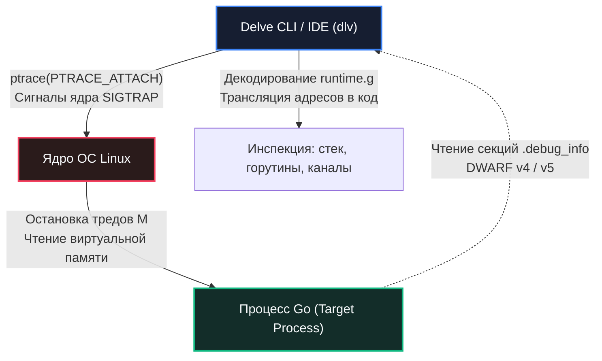

## Delve: интерактивный отладчик Go

В предыдущей статье «[[1. Debugging в Go]]» мы определили отладку как искусство поиска логических ошибок и расследования аномального поведения рантайма, выстроив общую карту диагностических инструментов. Теперь мы берем в руки главный интерактивный скальпель Go-разработчика — **Delve** (`dlv`).

Это специализированный отладчик уровня исходного кода, позволяющий устанавливать точки останова (включая условные), пошагово трассировать инструкции, инспектировать локальные переменные и регистры процессора, мгновенно переключаться между тысячами горутин и препарировать посмертные дампы памяти (Core Dumps). В отличие от профилировщика `pprof`, отображающего размытую агрегированную статистику за интервал времени, Delve предоставляет абсолютный детерминированный контроль над конкретным срезом состояния программы.

Для Senior Go-инженера Delve — не костыль на случай «непонятной ошибки», а высокоточный лабораторный инструмент. Умение виртуозно управлять Delve из терминала и связывать его с анализом гонок данных ([[3. Race detector в проде]]) и дедлоков входит в золотой стандарт инженерной квалификации.

---

## Архитектура Delve: как отладчик взаимодействует с Go под капотом

Классические отладчики вроде GDB создавались десятилетия назад для языков C и C++. Они мыслят понятиями потоков операционной системы (OS Threads) и ничего не знают о внутренних структурах рантайма Go: легковесных горутинах `runtime.g`, каналах `runtime.hchan`, интерфейсах `runtime.iface` и динамических расширяемых стеках. Попытка отлаживать сложный Go-сервис через GDB обычно заканчивается кашей из системных тредов и искаженными стековыми фреймами.

Отладчик **Delve** изначально спроектирован с глубоким пониманием рантайма Go:



Delve функционирует через стандартный системный интерфейс ядра:
* В **Linux** он использует системный вызов `ptrace` (`PTRACE_ATTACH`, `PTRACE_PEEKDATA`, `PTRACE_POKEDATA`).
* В **macOS** он взаимодействует через системный API `proc_*` и Mach-порты ядра.

Отладчик перехватывает сигналы ядра, останавливает выполнение инструкций процессора, считывает память процесса и сопоставляет машинные адреса с исходным кодом, используя стандартную отладочную информацию **DWARF** (версий 4 и 5). Компилятор Go автоматически встраивает DWARF-таблицы в результирующий бинарный файл, если сборка не производилась с флагами усечения отладочных символов `-ldflags="-s -w"`.

### Фундаментальные следствия архитектуры:

1. **Полная независимость от модификации кода:** Delve не требует перекомпиляции программы со специальными обертками. Он способен исследовать стандартный бинарник, собранный `go build` (при сохранении DWARF).
2. **Колоссальный оверхед системных прерываний:** Вызов `ptrace` принудительно останавливает либо поток ОС, либо весь процесс целиком через сигнал `SIGTRAP`. Это полностью разрушает временные характеристики (тайминги), замораживает фоновые сетевые циклы и приводит к разрыву TCP-сокетов. По этой причине Delve **категорически запрещено использовать на живом продакшене**.

---

## Установка и режимы запуска

Канонический способ установки Delve — компиляция через `go install`:

```bash
go install github.com/go-delve/delve/cmd/dlv@latest
```

Бинарный файл `dlv` помещается в директорию `$GOPATH/bin`. Убедитесь, что этот путь экспортирован в системную переменную `PATH`.

Delve поддерживает четыре базовых режима инициализации:

- **`dlv debug`** — компилирует исходники текущей директории с отключенными оптимизациями компилятора (`-gcflags="all=-N -l"`), запускает полученный бинарник и немедленно подключает отладчик к функции `main`.
- **`dlv exec`** — запускает уже скомпилированный исполняемый файл под контролем Delve.
- **`dlv attach <PID>`** — на лету перехватывает управление уже работающим локальным процессом по его идентификатору PID.
- **`dlv core <binary> <core.dump>`** — открывает аварийный снимок памяти для ретроспективного Postmortem-анализа ([[6. Core dumps]]).

```bash
# Компиляция и немедленный запуск отладки main.go
dlv debug ./main.go

# Запуск предварительно скомпилированного бинарника
dlv exec ./my_server

# Подключение к работающему фоновому процессу
dlv attach 12345

# Расследование посмертного дампа памяти
dlv core ./my_server core.dump
```

---

## Командный арсенал: REPL интерфейс Delve

Интерфейс командной строки Delve представляет собой интерактивный цикл REPL (Read-Eval-Print Loop). Освоение ключевых команд позволяет диагностировать сложнейшие аномалии без графической оболочки.

### 1. Точки останова (Breakpoints)

Точка останова — инструкция процессора `INT 3` (опкод `0xCC` в x86-64), временно подменяемая отладчиком по целевому адресу в памяти, по достижении которой ядро ОС передает сигнал `SIGTRAP` отладчику.

- **`break main.main`** (или `b main.main`) — установка брейкпоинта на точку входа в функцию `main`.
- **`break handler.go:45`** — останов на строке 45 файла `handler.go`.
- **`break -list`** — вывод списка всех активных точек останова с их индексами.
- **`clear 1`** — удаление точки останова с идентификатором 1.
- **`condition 1 req.ID == 42`** — создание **условного брейкпоинта**: отладчик останавливает выполнение на точке 1 исключительно в том случае, если выражение `req.ID == 42` истинно. Это спасает часы времени при отладке циклических итераций.

```text
(dlv) break processOrder
Breakpoint 1 set at 0x4a1b20 for main.processOrder() ./service.go:30
```

### 2. Управление исполнением

- **`continue`** / **`c`** — продолжить выполнение до следующей точки останова.
- **`next`** / **`n`** — шаг на следующую строку в текущей функции (не заходя внутрь вызовов).
- **`step`** / **`s`** — шаг на следующую строку, заходя внутрь вызываемых функций.
- **`stepout`** / **`so`** — выполнить до выхода из текущей функции.
- **`restart`** — перезапустить программу под отладчиком (быстро, без перекомпиляции).

### 3. Инспекция стека и переменных

- **`stack`** / **`bt`** — вывод полного стека вызовов (Backtrace) текущей горутины.
- **`frame 2`** — переход к стековому фрейму номер 2 для исследования локальных переменных вызывающей функции.
- **`print variable`** / **`p variable`** — отображение значения конкретной переменной или структуры.
- **`locals`** — печать всех локальных переменных текущего фрейма.
- **`args`** — печать значений входных аргументов текущей функции.

```text
(dlv) p user.Name
"Alice"
(dlv) p *user
main.User{ID: 42, Name: "Alice", Email: "alice@example.com"}
```

### 4. Работа с горутинами

Главная суперсила Delve — бесшовная работа с абстракциями планировщика Go:

- **`goroutines`** / **`grs`** — полный список всех существующих горутин в памяти с указанием их текущего статуса (`running`, `runnable`, `waiting`). Это интерактивный аналог дампа горутин ([[4. goroutine dump]]).
- **`goroutine 15`** — мгновенное переключение фокуса отладчика на горутину с идентификатором 15. Все последующие команды (`stack`, `locals`, `frame`) будут отображать контекст именно этой горутины.
- **`goroutines -t`** — вывод списка всех горутин с раскрытыми трассировками их стеков. Незаменимо для распутывания взаимных блокировок.

### 5. Прочие полезные команды

- **`disassemble`** / **`disass`** — показать ассемблерный листинг текущей функции (требует понимания ассемблера Go, но иногда необходимо).
- **`regs`** — содержимое регистров процессора (`RAX`, `RSP`, `RIP` и др.).
- **`examinemem`** / **`x`** — дамп памяти по адресу.
- **`call`** — вызвать функцию из контекста отладчика (экспериментальная возможность).
- **`source`** — выполнить скрипт команд Delve из файла.

---

## Просмотр сложных типов и кастомные принтеры

Delve корректно отображает слайсы, мапы, интерфейсы и структуры:

- **`p var`** — покажет значение с полями структуры.
- **`p len(slice)`** — выведет длину слайса.
- **`p cap(slice)`** — ёмкость слайса.
- **`p map[key]`** — значение по ключу (если ключ — простая константа).

```text
(dlv) p mySlice
[]int len: 3, cap: 5, [10, 20, 30]

(dlv) p len(mySlice)
3

(dlv) p cap(mySlice)
5

(dlv) p myMap["user_key"]
"active_session"
```

Если стандартный вывод структур перегружен, Delve поддерживает настройку конфигурационного файла `~/.dlv/config.yml`, где можно активировать **pretty-print** и подключать кастомные функции строкового форматирования для визуализации доменных типов.

---

## Удаленная отладка в контейнерах (Headless Mode)

При разработке распределенных систем код часто выполняется внутри контейнеров Docker или в удаленном кластере Kubernetes. В таких условиях запустить интерактивный терминал невозможно.

Delve решает эту задачу через **Headless-режим** (серверный режим без консоли):

```bash
# Запуск Delve в режиме TCP-сервера внутри контейнера
dlv debug --headless --listen=:2345 --api-version=2 ./main.go
```

К запущенному отладочному серверу можно подключиться снаружи:
1. Из терминала другой машины: `dlv connect localhost:2345`.
2. Из графической среды IDE (VSCode или GoLand), настроив профиль удаленной отладки (Remote Debug).

В Kubernetes этот подход реализуется через проброс портов:
```bash
kubectl port-forward pod/my-service-pod 2345:2345
```

> [!warning] Ловушка / Gotcha: Катастрофические риски безопасности Headless-режима
> Сервер Delve в Headless-режиме, запущенный на открытом порту `:2345`, предоставляет любому подключившемуся клиенту **неограниченные привилегии выполнения произвольного кода** в контексте процесса. 
> 
> Злоумышленник может перезаписать инструкции в оперативной памяти, прочитать секретные ключи шифрования из кучи или выполнить системный вызов через команду `call`. 
> 
> Никогда не публикуйте порт Delve во внешнюю сеть! Используйте флаг `--accept-multiclient` только в связке с локальными SSH-туннелями, взаимной аутентификацией и строгой сетевой изоляцией NetworkPolicy.

---

## Анатомия Postmortem анализа: препарирование Core Dump

Когда сервис падает с фатальной паникой или сегментацией памяти на удаленном сервере, Delve выступает в роли патологоанатома. 

Workflow посмертного вскрытия (подробно разобранный в [[6. Core dumps]]):


1. Процесс падает в окружении с включенной переменной `GOTRACEBACK=crash`, в результате чего ядро Linux сбрасывает полный слепок памяти `core.dump`.
2. Инженер забирает идентичный скомпилированный бинарный файл и файл `core.dump` на локальную машину.
3. Запускается команда: `dlv core ./my_binary core.dump`.
4. Команда `goroutines` раскрывает полный список всех горутин на момент физической гибели процесса.
5. Инженер переключается на упавшую горутину, выполняет `stack` и видит точную строку кода, вызвавшую панику.
6. Команды `locals` и `p variable` позволяют побайтово прочитать значения структур в момент катастрофы.

---

## Mechanical Sympathy: Аппаратная цена интерактивной остановки

Каждый раз, когда процессор спотыкается о точку останова Delve, в системе запускается каскад низкоуровневых событий:

```
Физические последствия брейкпоинта Delve:
┌────────────────────────────────────────────────────────────────────────┐
│ 1. Сигнал ядра SIGTRAP: Остановка тредов M в системном вызове          │
│    -> Полная остановка планировщика Go, GC и netpoller                 │
├────────────────────────────────────────────────────────────────────────┤
│ 2. Сетевой уровень: Истечение таймеров TCP Keep-Alive и HTTP Deadlines │
│    -> Разрыв соединений внешними балансировщиками и клиентами          │
├────────────────────────────────────────────────────────────────────────┤
│ 3. Кластерный оркестратор: Сбой Kubernetes Liveness Probe              │
│    -> Kubelet считает контейнер мертвым и отправляет SIGKILL          │
├────────────────────────────────────────────────────────────────────────┤
│ 4. Аппаратный кэш CPU: Вытеснение строк кэша L1/L2/L3 другими задачами │
│    -> Лавина Cache Misses при возобновлении исполнения                 │
└────────────────────────────────────────────────────────────────────────┘
```

1. **Заморозка рантайма:** Замораживается не абстрактный код Go, а физические потоки ядра ОС (M-треды). Весь процесс замораживается (или конкретный поток, если используются опции `--continue` и `--headless` с настройками). Планировщик Go останавливается, сборщик мусора блокируется, а системный мультиплексор `netpoller` прекращает опрашивать сетевые дескрипторы `epoll`.
2. **Разрыв сетевых сессий:** Если вы остановились на брейкпоинте дольше, чем на несколько секунд, все активные сетевые клиенты закроют сокеты по тайм-ауту.
3. **Реакция оркестратора Kubernetes:** Пробы жизнеспособности `livenessProbe` перестают получать ответы. Kubelet делает вывод, что контейнер намертво завис, и принудительно перезапускает под сигналом `SIGKILL`, уничтожая вашу отладочную сессию.
4. **Вымывание кэшей процессора:** За время простоя ядра процессора переключаются на другие фоновые задачи ОС. Строки кэша данных и инструкций (L1i/L1d/L2) вытесняются чужими данными (подробнее о локальности в [[8. Cache friendliness]]). При возобновлении исполнения программа получает шквал аппаратных Cache Misses.

---

## Типичные сценарии использования Delve

### 1. Расследование паники
Программа спорадически падает с сообщением `panic: runtime error: invalid memory address or nil pointer dereference`. Стек указывает на функцию `processData`. 
* Запускаем Delve, ставим брейкпоинт: `break processData`.
* Воспроизводим запрос, шагаем по строкам (`next`).
* Инспектируем указатели через `p order.Customer` и проверяем кэш.
* Находим, что `config.Cache` равен `nil` при определенных условиях ветвления.

### 2. Дедлок горутин
Тесты зависают без завершения. 
* Запускаем тесты под отладчиком: `dlv test`.
* В момент зависания нажимаем комбинацию `Ctrl+C`, перехватывая управление в REPL.
* Команда `goroutines` показывает, что горутина 7 застряла в ожидании канала `ch1`, а горутина 9 — в ожидании `ch2`.
* Переключаясь между `goroutine 7` и `goroutine 9`, анализируем их стеки вызовов (`stack`) и находим место, где порядок блокировок был нарушен.

### 3. Почему возвращается не то значение
Функция иногда возвращает пустую строку или некорректное значение.
* Устанавливаем точку останова: `break getValue`.
* Навешиваем условие: `condition 1 len(result) == 0`.
* Когда брейкпоинт срабатывает, проходим по стеку (`stack`), смотрим, откуда пришел вызов с пустым результатом.

### 4. Анализ core dump'а
Ночью упал production-сервер. Core dump сохранен.
* Открываем `dlv core ./my_binary core.dump`.
* Переключаемся на упавшую горутину, видим панику из-за `send on closed channel`.
* Стек показывает, что канал был закрыт в блоке `defer`, но горутина-отправитель еще работала. Находим гонку по управлению жизненным циклом канала.

---

## Интеграция с современными IDE и CI/CD

Хотя консольный интерфейс Delve самодостаточен, современные редакторы предоставляют удобные графические оболочки:
* **VSCode:** Официальный плагин Go интегрирует Delve «из коробки». Точки останова выставляются кликом мыши, запуск отладки по клавише `F5`. Конфигурация `.vscode/launch.json` позволяет легко настроить удаленную отладку через headless port.
* **GoLand (JetBrains):** Глубокая интеграция с визуализацией дерева горутин, поддержкой условных брейкпоинтов и инспекцией структур в реальном времени.

В CI/CD Delve иногда используют для скриптовой автоматической диагностики нестабильных тестов (Flaky tests):
```bash
dlv test -- -test.run TestFlaky &
DLV_PID=$!
sleep 5
# Отправка автоматизированных команд через JSON-RPC API Delve
```
Однако на практике нестабильные тесты эффективнее локализовать через параллельные прогоны с ключами `-race` и `-count=100`.

---

## Связь в экосистеме знаний

- [[1. Debugging в Go]] — философский фундамент и классификация методов отладки.
- [[3. Race detector в проде]] — как использовать ThreadSanitizer для локализации гонок, которые Delve маскирует.
- [[4. Логи и debugging]] — структурированное логирование, когда Delve недоступен на проде.
- [[5. Postmortem анализ]] — методология ретроспективного расследования инцидентов.
- [[6. Core dumps]] — глубокая механика снятия и анализа дампов памяти ядра.
- [[7. Debugging latency проблем]] — почему Delve бессилен при поиске хвостовых задержек.
- [[4. goroutine dump]] — легковесное снятие дампов горутин на лету без системных прерываний.

---

## Резюме

1. **Delve — специализированный инструмент для Go:** Он понимает структуры рантайма (`runtime.g`, `hchan`, интерфейсы) и опирается на отладочную информацию DWARF.
2. **Функциональные возможности:** Условные брейкпоинты, переключение контекста между горутинами, удаленная отладка через Headless Mode и расследование посмертных core dump'ов.
3. **Помните об аппаратной цене:** Использование системного вызова `ptrace` замораживает процесс, разрывает TCP-соединения и провоцирует Kubernetes перезапускать поды. Интерактивная отладка допустима только в изолированном тестовом контуре.
4. **Соблюдайте безопасность Headless Mode:** Никогда не выставляйте отладочный порт `:2345` в открытый интернет; используйте локальные порты и SSH-туннелирование.

Delve великолепен для исследования алгоритмов и расследования локализуемых дефектов. Но что делать, когда дефект проявляется только на боевом трафике в многопоточном режиме в виде повреждения структур памяти? Чтобы обнаружить гонки данных прямо в бою, мы переходим к следующему инструменту: [[3. Race detector в проде]].