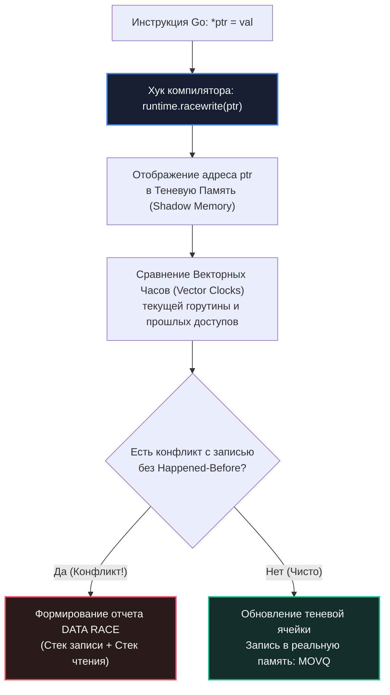

## Race Detector в проде: охота на гонки данных в боевых условиях

В предыдущих главах мы детально изучили общую философию диагностики ([[1. Debugging в Go]]) и взяли в руки интерактивный отладчик Delve ([[2. Delve debugger]]). Однако оба этих инструмента имеют непреодолимое аппаратное ограничение: они анализируют статическую картину, либо требуют принудительной заморозки процесса через системный вызов `ptrace`.

Но в мире параллельных вычислений существует самый коварный, разрушительный и неуловимый класс дефектов — **гонки данных (Data Races)**. 

Они возникают исключительно в динамике многопоточного выполнения, зависят от наносекундных таймингов межъядерной шины и планировщика Go, и практически никогда не воспроизводятся на машине разработчика под одиночным тестовым запросом. В продакшене же гонка данных способна незаметно испортить структуры в памяти, исказить баланс пользователя или вызвать спонтанную панику сервиса спустя три недели непрерывной работы.

Для обнаружения таких аномалий компилятор Go оснащен встроенным оружием высшего калибра — **Race Detector**. Он инструментирует машинный код на уровне ассемблера и отслеживает несинхронизированные обращения к оперативной памяти. Однако его колоссальная цена — замедление процессора в 5–10 раз и 5–10-кратный рост расхода оперативной памяти — делает невозможным его тривиальное включение на всех серверах продакшена.

Задача Senior-инженера — проявлять механическое сочувствие ([[5. Mechanical sympathy в backend разработке]]) и уметь применять Race Detector в боевых и околобоевых условиях: на канареечных подах, при зеркалировании боевого трафика и в ночных окнах диагностики.

---

## Что такое гонка данных в Go: модель памяти

В инженерной терминологии критически важно строго различать два понятия, которые часто путают:

1. **Состояние гонки (Race Condition):** Высокоуровневая архитектурная логическая ошибка, при которой корректность работы бизнес-логики зависит от относительного порядка выполнения параллельных операций. При этом все обращения к памяти могут быть безупречно защищены мьютексами, и Race Detector не выдаст ни единого предупреждения.
2. **Гонка данных (Data Race):** Низкоуровневая аппаратная коллизия памяти. Возникает тогда, когда две или более горутины **одновременно обращаются к одной и той же физической ячейке памяти**, причем как минимум одно из этих обращений является **записью (Write)**, и между операциями отсутствует отношение синхронизации **Happened-Before** (мьютекс, атомик, канал).

Согласно официальной спецификации **Go Memory Model**, наличие в программе хотя бы одной гонки данных переводит все ее поведение в категорию **Undefined Behavior (Неопределенное поведение)**: компилятор и процессор получают право переупорядочивать машинные инструкции произвольным образом.

```go
var counter int

func increment() {
    counter++ // неатомарно: read-modify-write
}

func main() {
    go increment()
    go increment()
}
```

На уровне ассемблера строка `counter++` — это не одно неделимое действие, а классический цикл **Read-Modify-Write**:
1. Прочитать значение из оперативной памяти в регистр процессора `RAX`.
2. Увеличить значение регистра `RAX` на единицу.
3. Записать значение из регистра `RAX` обратно в оперативную память.

Если две горутины на разных ядрах CPU выполнят чтение одновременно, обе увидят `0`, обе инкрементируют до `1` и обе запишут `1`. Одно обновление бесследно растворилось в кремнии.

---

## Как устроен Race Detector: анатомия ThreadSanitizer

Race Detector в экосистеме Go основан на промышленной библиотеке **ThreadSanitizer (TSan v2)**, разработанной компанией Google для анализа языков C/C++.

Когда вы компилируете бинарник с флагом `go build -race` (или запускаете тесты `go test -race`), компилятор Go внедряет специальные хуки рантайма перед **каждой инструкцией чтения и записи памяти**:



### Принцип работы TSan:

1. **Векторные часы (Vector Clocks):** Рантайм ведет логические часы для каждой горутины, которые монотонно увеличиваются при операциях синхронизации (`sync.Mutex`, закрытие или передача через `chan`, вызовы `sync/atomic`).
2. **Теневая память (Shadow Memory):** Для каждых 8 байт пользовательской оперативной памяти TSan выделяет в 4–8 раз больший сегмент теневой памяти. В теневых ячейках сохраняется метаинформация о последних нескольких обращениях: ID горутины, тип доступа (Read/Write) и снимок логических часов.
3. **Детекция коллизий:** При обращении к адресу рантайм сопоставляет текущие логические часы горутины с историей, хранящейся в теневой памяти. Если обнаружено пересечение без отношения синхронизации — фиксируется авария.

> [!info] Под капотом
> Теневая память в 64-битной архитектуре резервирует колоссальный диапазон виртуального адресного пространства (до десятков терабайт Virtual Memory). Физическая память выделяется ядром ОС только по мере реального касания страниц. Однако сам факт удлинения каждого разыменования указателя десятком дополнительных инструкций порождает неизбежное замедление исполнения в 5–10 раз.

---

## Цена использования: почему `-race` нельзя включать на 100% продакшена

Попытка собрать боевой релиз с флагом `go build -race` и выкатить его на весь парк серверов немедленно приведет к коллапсу инфраструктуры:

* **CPU Overhead (5–10x):** Каждое чтение и запись поля структуры превращаются в цепочку проверок теневых меток. Сервер, державший 10 000 RPS, сможет обслужить лишь 1 000–1 500 RPS.
* **Memory Overhead (5–10x):** Расход оперативной памяти взлетает экспоненциально из-за теневых сегментов и расширенных стеков горутин. Контейнеры будут массово падать под ударом `oom-killer`.
* **Искажение временных характеристик:** Замедление инструкций меняет микросекундные задержки между горутинами.
* **Давление на Garbage Collector:** Раздувание структур в памяти приводит к тому, что сборщик мусора Go запускается в разы чаще и тратит значительно больше времени на фазы сканирования кучи (см. [[9. Когда GC становится bottleneck]] и [[7. GOGC и tuning]]).

---

## Стратегии применения Race Detector в продакшен-условиях

Если включить `-race` на всех подах нельзя, как поймать баг, который проявляется исключительно под живым боевым трафиком? Для этого применяются изощренные инженерные стратегии:

### 1. «Канареечный» под с race detector
В кластер Kubernetes можно внедрить один под, собранный с `-race`, который обслуживает тот же трафик, что и остальные. Благодаря балансировщику на него попадет небольшая доля запросов (например, 0.5–1%).
* Ему выделяются расширенные квоты по CPU и RAM (с запасом 10x).
* Запускаем с флагом `GORACE=log_path=...`, чтобы гонки писались в файл, а не в stderr (иначе забьют логи). Мониторим метрики (CPU всплеск на pod'е — ожидаемо). Если за несколько часов не выявлено гонок — вероятно, код чист под данной нагрузкой.

```bash
# Сборка бинарника с детектором гонок
go build -race -o ./my_server_race

# Запуск с сохранением отчётов в файлы
GORACE="log_path=/tmp/race" ./my_server_race
```

### 2. Репликация production-трафика на staging
Более безопасный подход: staging-среда, в которую зеркалируется реальный трафик (через Service Mesh, типа Istio traffic mirroring, или воспроизведение логов). Запускаем сервис с `-race` в staging и подаём реальную нагрузку. Это даёт высокие шансы повторить гонки, идентичные production, без риска для пользователей.

### 3. Запуск с `-race` на ограниченное время в ночные часы
Если нагрузка позволяет, можно временно подменить один из подов на race-версию в период низкой активности (например, с 04:00 до 05:00), тщательно контролируя метрики. Это рискованно, но иногда единственный способ поймать гонку, не воспроизводимую локально.

### 4. Анализ конкретного запроса
Если гонка проявляется в ответ на специфический запрос, можно написать интеграционный тест, воспроизводящий именно этот сценарий, и запускать его с `-race` в CI: `go test -race -count=1000 -run=TestConcurrentSessionUpdate`.

---

## Настройка Race Detector через `GORACE`

Поведение ThreadSanitizer в рантайме Go управляется системной переменной окружения `GORACE`:

* **`log_path`** — путь, куда писать отчёты. Если не задан, пишет в stderr. При задании создаёт файлы `путь.pid`.
* **`halt_on_error=1`** — завершить процесс при первой же гонке. Полезно для CI, но опасно для прода (лучше ставить `halt_on_error=0`).
* **`history_size=N`** — размер истории для отчётов (количество доступов, хранимых для контекста, $2^N$). По умолчанию 1 (мало), рекомендуется 2 или 3 для лучшего вывода стеков.
* **`strip_path_prefix`** — убирает префикс из путей в стек-трейсах для читаемости.
* **`exitcode=N`** — код возврата при обнаружении гонки (по умолчанию 66).

```bash
export GORACE="log_path=/var/log/race history_size=3 halt_on_error=0 strip_path_prefix=/build/"
./my_server_race
```

> [!warning] Ловушка / Gotcha: Буферизация отчетов при аварийных крашах
> Race detector не записывает отчёты в log_path, пока процесс не завершится или пока не будет вызван `runtime/race`? На самом деле файлы создаются сразу при обнаружении гонки и дописываются. Но при аварийном завершении часть данных может быть потеряна. Для критических расследований комбинируйте Race Detector с генерацией посмертных дампов: `GOTRACEBACK=crash` (см. [[6. Core dumps]]).

---

## Чтение отчёта о гонке

При обнаружении коллизии детектор выводит структурированный протокол:

```text
==================
WARNING: DATA RACE
Write at 0x00c000120008 by goroutine 15:
  main.increment()
      /app/main.go:12 +0x4e

Previous read at 0x00c000120008 by goroutine 12:
  main.display()
      /app/main.go:18 +0x3a

Goroutine 15 (running) created at:
  main.main()
      /app/main.go:22 +0x76

Goroutine 12 (finished) created at:
  main.main()
      /app/main.go:21 +0x68
==================
```

### Анатомия отчета:
1. **Адрес конфликта (`0x00c000120008`):** Точный физический адрес переменной в оперативной памяти кучи или стека.
2. **Первая секция (`Write at ... by goroutine 15`):** Текущее несинхронизированное действие (запись) с полным стеком вызовов функции `increment()` и номером строки.
3. **Вторая секция (`Previous read at ... by goroutine 12`):** Предыдущая операция (чтение), которая конфликтовала с текущей записью, со стеком функции `display()`.
4. **Секции `Goroutine created at`:** Места в коде функции `main()`, где оператор `go` породил конфликтующие потоки выполнения.

Если в конфигурации задана опция `history_size=2`, в отчете можно увидеть подробные промежуточные шаги, что существенно упрощает понимание последовательности обращений.

---

## Ложные срабатывания и миф о «безобидных» гонках

Иногда разработчики пытаются оправдать гонки данных: *«Ну мы же просто читаем булев флаг без блокировки, подумаешь, прочитаем значение на одну итерацию позже»*, *«Это всего лишь счетчик просмотров, потеря пары кликов не имеет значения»* или ссылаются на трюки с `unsafe.Pointer`, которыми они якобы управляют вручную.

С точки зрения аппаратной архитектуры и спецификации Go **«безобидных» гонок данных не существует**.

```
Почему гонка данных разрушает программу:
1. Слайсы и Интерфейсы: Состоят из нескольких машинных слов (указатель + длина + емкость).
   -> Неатомарная запись приводит к чтению разорванного указателя (Torn Read) -> Паника SIGSEGV!
2. Переупорядочивание компилятора: Компилятор считает переменную однопоточной.
   -> Выносит чтение за пределы цикла -> Вечный цикл (Deadlock в логике)!
```

> [!tip] Собеседование
> **Вопрос:** В кодовой базе обнаружен отчет Race Detector: горутины несинхронизированно инкрементируют целочисленный счетчик `totalViews++`. Разработчик на Code Review заявляет: «Это безопасная гонка (Benign Race). Потеря единицы раз в сутки допустима для аналитики, зато мы экономим такты процессора на мьютексах». Что вы ответите?
> 
> **Ответ:** Заявление в корне неверно. В архитектуре современных процессоров (x86-64, ARM64) и спецификации Go Memory Model гонка данных на любой переменной провоцирует компилятор и кэш CPU на агрессивные оптимизации. Компилятор может закешировать значение переменной в регистре процессора, из-за чего поток никогда не увидит изменений от других горутин. 
> 
> Кроме того, на 32-битных платформах запись 64-битного числа выполняется двумя инструкциями (по 4 байта): гонка приведет к чтению полуразрушенного мусорного значения (Torn Write). 
> 
> **Решение:** Использовать примитив `sync/atomic`: вызов `atomic.AddInt64(&totalViews, 1)` выполняется за одну аппаратную инструкцию шины `LOCK XADD` (несколько наносекунд), полностью ликвидируя гонку данных без накладных расходов мьютекса.

---

## Mechanical Sympathy: Аппаратные искажения и феномен Heisenbug

Race Detector не просто добавляет отладочный код — он радикально перестраивает кремниевое поведение сервиса:

1. **Разрушение иерархии кэшей процессора:** Теневая память TSan беспрерывно вытесняет полезные структуры вашего приложения из сверхоперативных кэшей L1d и L2. Количество аппаратных промахов (Cache Misses) возрастает лавинообразно.
2. **Вмешательство в планировщик рантайма:** Из-за колоссального замедления циклов горутины значительно чаще исчерпывают свой квант времени (10 мс) и насильственно прерываются системным таймером рантайма (подробнее о планировщике в [[1. Scheduler Go. G M P модель]]). Это полностью перетасовывает очередность передачи управления.
3. **Эффект Гейзенберга (Heisenbug):** Самый коварный эффект детектора. Тонкая гонка данных, которая регулярно приводила к авариям на продакшене, может **полностью исчезнуть под `-race`**! Замедление кода приводит к тому, что первая горутина теперь всегда гарантированно успевает завершить запись до того, как вторая горутина доберется до чтения.

Поэтому отсутствие предупреждений под Race Detector в течение 5 минут тестирования — это еще не математическое доказательство абсолютной чистоты кода, а лишь подтверждение того, что коллизия не произошла за время конкретного наблюдения.

---

## Интеграция с CI и производственным циклом

Наиболее эффективный подход к устранению гонок — многослойная система фильтрации:

1. **CI/CD:** Все юнит- и интеграционные тесты обязаны запускаться с флагом `-race`. Это первая и самая надежная линия обороны.
2. **Staging:** Периодический прогон нагрузочных испытаний под реплицированным трафиком с включенным детектором гонок.
3. **Production (Канареечный контур):** Выкатка изолированного пода с `-race` для валидации поведения на живом трафике при подозрениях на коллизии.
4. **Postmortem:** При аварийных падениях анализ дампов памяти ([[6. Core dumps]]) и логов на предмет следов несинхронизированного доступа.

---

## Практический пример: расследование загадочных паник

**Симптомы:** Высоконагруженный API-сервер спорадически раз в неделю падал с паникой `runtime error: invalid memory address or nil pointer dereference` внутри хендлера `handleRequest()`, но локально не воспроизводился. Анализ логов показал, что несколько горутин обрабатывали общий контекст.

**Ход расследования:**
1. Бинарный файл был собран с ключом `go build -race` и развернут на канареечный под в Kubernetes с 1% боевой нагрузки.
2. Конфигурация `GORACE="log_path=/var/log/race/app history_size=3"` выгружала отчеты на локальный том.
3. Спустя 20 минут в логах появился отчет: гонка данных при одновременной записи в структуру сессии `user.Session` внутри фоновой горутины логирования аудита и чтении этой же сессии в валидаторе токенов `validateSession()`.
4. Анализ показал: объект сессии передавался по указателю (`*Session`) без создания независимой копии и без защиты примитивами синхронизации.
5. **Исправление:** Было реализовано глубокое клонирование контекста перед передачей в фоновую горутину, что полностью устранило дефект и навсегда ликвидировало паники на проде.

---

## Резюме

1. **Гонка данных — это аппаратная коллизия:** Одновременный доступ к одной ячейке памяти с операцией записи без Happened-Before синхронизации переводит программу в состояние Undefined Behavior.
2. **ThreadSanitizer под капотом:** Race Detector оперирует теневой памятью (Shadow Memory) и векторными часами, отслеживая каждый машинный доступ.
3. **Ограничения боевого использования:** 5–10x замедление CPU и 5–10x расход RAM исключают запуск на 100% прод-серверов.
4. **Безопасные стратегии:** Используйте канареечные поды (1% трафика), зеркалирование боевого потока на Staging (Traffic Mirroring) и ночные диагностические окна.
5. **Безобидных гонок не бывает:** Любая гонка данных на счетчиках или флагах должна быть устранена с помощью `sync/atomic` или `sync.Mutex`.

Мы научились ловить глубокие дефекты памяти в параллельном коде. Но что делать, когда сервис работает в продакшене без возможности подключить отладчик Delve или запустить тяжелый Race Detector? Главным источником истины становятся структурированные логи. В следующей статье мы разберем искусство zero-allocation логирования для высоконагруженной отладки: [[4. Логи и debugging]].