## Логи и debugging: почему `fmt.Println` — не стратегия

В предыдущих главах мы детально рассмотрели интерактивную пошаговую отладку с помощью Delve ([[2. Delve debugger]]), требующую жесткой остановки процесса системным вызовом `ptrace`, и специализированный детектор гонок ([[3. Race detector в проде]]), замедляющий исполнение в 10 раз. Оба эти инструмента либо категорически неприменимы на живом боевом трафике продакшена, либо до неузнаваемости искажают временные характеристики системы.

Что же остается в распоряжении инженера, когда сервис обрабатывает 30 000 RPS в распределенном кластере Kubernetes? Остается самый древний, универсальный и при этом наиболее часто недооцениваемый инструмент — **логи**.

Правильно спроектированная система логирования — это не хаотичный сброс отладочных строк на диск, а высокопроизводительный, структурированный поток телеметрии первого уровня. Когда глобальные метрики сигнализируют о всплеске серверных ошибок, а распределенная трассировка (подробно разобранная в разделе [[18. Observability]]) указывает на деградацию конкретного микросервиса, именно логи позволяют по сквозному Correlation ID посекундно восстановить причинно-следственную цепочку событий в момент сбоя. Без логов любые метрики и трейсы — это мощный микроскоп с выключенной подсветкой.

В этой статье мы превратим логирование из источника тормозов в высокоточный отладочный инструмент: разберем стандарт `log/slog`, архитектуру Correlation ID, динамическое переключение уровней детализации на лету и механическое сочувствие к процессору ([[5. Mechanical sympathy в backend разработке]]) при профилировании аллокаций ([[4. Allocation profiling]]) и сборке мусора ([[1. GC в Go. Обзор]]).

---

## От `fmt.Println` к структурированному логированию

Среди начинающих разработчиков распространена привычка расставлять по коду вызовы вроде `fmt.Println("error:", err)` или `log.Printf("user %d failed: %v", userID, err)`. В учебных скриптах это допустимо, но в боевом высоконагруженном сервисе такой подход гарантирует три катастрофических последствия:

1. **Непригодность для машинного анализа:** Неструктурированный текст требует медленного парсинга через регулярные выражения (RegEx), что в разы удорожает работу систем агрегации (Grafana Loki, Elasticsearch, ClickHouse).
2. **Утрата контекста в конкурентной среде:** Когда 10 000 параллельных горутин одновременно пишут в поток `stdout`, текстовые строки хаотично перемешиваются, и понять, к какой транзакции или пользователю относится конкретное сообщение об ошибке, становится физически невозможно.
3. **Колоссальный оверхед по памяти и CPU:** Вызовы `fmt.Sprintf` внутри классических логеров упаковывают аргументы в интерфейсы `interface{}` (boxing), порождают непрерывные аллокации строк в куче и запускают лавину циклов сборки мусора (см. [[9. Когда GC становится bottleneck]]).

### Золотой стандарт индустрии: пакет `log/slog`

Решением является **структурированное логирование (Structured Logging)**. Вместо произвольной текстовой строки формируется строгая JSON-запись со стандартизированными типизированными атрибутами:
```json
{"time":"2026-09-18T12:00:00Z","level":"ERROR","msg":"failed to process","user_id":42,"trace_id":"a1b2c3d4","error":"connection reset"}
```

Начиная с версии Go 1.21, в стандартную библиотеку вошел пакет **`log/slog`**, объединивший лучшие наработки индустрии:
- Четыре стандартизированных уровня: `Debug`, `Info`, `Warn`, `Error`.
- Строго типизированные конструкторы полей (`slog.String`, `slog.Int`, `slog.Any`, `slog.Duration`), минимизирующие аллокации.
- Нативная поддержка контекста вызовов (`slog.InfoContext`, `slog.ErrorContext`).
- Модульная архитектура обработчиков (**Handlers**), позволяющая разделять формат вывода (JSONHandler, TextHandler) и транспорт.

```go
package main

import (
	"log/slog"
	"net/http"
)

func orderHandler(w http.ResponseWriter, r *http.Request) {
	// Обогащаем логер идентификатором запроса
	logger := slog.With("trace_id", r.Header.Get("X-Request-Id"))
	
	logger.InfoContext(r.Context(), "request started", "path", r.URL.Path)

	err := processOrder(r.Context())
	if err != nil {
		logger.ErrorContext(r.Context(), "failed to process", "error", err)
		http.Error(w, "internal error", http.StatusInternalServerError)
		return
	}

	w.WriteHeader(http.StatusOK)
}
```

---

## Correlation ID: распутывание клубка в распределенных системах

В современных микросервисных архитектурах ([[8. Debugging distributed systems]]) единый пользовательский клик порождает цепочку из десятков синхронных и асинхронных вызовов через HTTP, gRPC и брокеры сообщений. Логи изолированного сервиса без глобального идентификатора бесполезны для отладки системных сбоев.

**Correlation ID (Trace ID)** — это глобальный уникальный идентификатор, генерируемый на периметре системы (API Gateway / Ingress) и транзитивно передаваемый через все сетевые границы.

```mermaid
flowchart LR
    Client["Клиентский запрос"] -->|"X-Request-Id: 9f8e7d"| GW["API Gateway"]
    GW -->|"gRPC Metadata: 9f8e7d"| Auth["Микросервис Auth"]
    GW -->|"HTTP Header: 9f8e7d"| Orders["Микросервис Orders"]
    Orders -->|"Kafka Message Header: 9f8e7d"| Billing["Воркер Billing"]
    
    Auth -.->|"Лог: 9f8e7d"| Loki[("Хранилище Grafana Loki / ELK")]
    Orders -.->|"Лог: 9f8e7d"| Loki
    Billing -.->|"Лог: 9f8e7d"| Loki
    
    style GW fill:#161e31,stroke:#3b82f6,stroke-width:2px
    style Loki fill:#132d29,stroke:#10b981,stroke-width:2px
```



В Go Correlation ID идиоматично прокидывается через стандартный `context.Context` с помощью HTTP-Middleware:

```go
package middleware

import (
	"context"
	"log/slog"
	"net/http"

	"github.com/google/uuid"
)

type contextKey string

const traceIDKey contextKey = "traceID"

// TraceIDMiddleware извлекает или генерирует уникальный Correlation ID
func TraceIDMiddleware(next http.Handler) http.Handler {
	return http.HandlerFunc(func(w http.ResponseWriter, r *http.Request) {
		id := r.Header.Get("X-Request-Id")
		if id == "" {
			id = uuid.New().String()
		}
		// Помещаем идентификатор в контекст запроса
		ctx := context.WithValue(r.Context(), traceIDKey, id)
		w.Header().Set("X-Request-Id", id)
		next.ServeHTTP(w, r.WithContext(ctx))
	})
}

// LoggerFromContext извлекает TraceID и возвращает обогащенный логер
func LoggerFromContext(ctx context.Context, base *slog.Logger) *slog.Logger {
	if id, ok := ctx.Value(traceIDKey).(string); ok {
		return base.With("trace_id", id)
	}
	return base
}
```

Подробнее о передаче сквозных контекстов см. в материале [[14. Распределенные системы на Go/08. Практика/7. Correlation ID]].

> [!info] Под капотом
> Вызов `context.WithValue` порождает новый узел в иммутабельном связном дереве контекстов (аллокация около 80–100 байт в куче). Поиск значения по ключу в цепочке контекстов имеет алгоритмическую сложность $O(N)$, где $N$ — глубина вложенности (обычно не более 3–5). Извлекайте Correlation ID один раз на входе в хендлер, а не дёргайте через `context.Value` в горячем цикле.

---

## Уровни логирования и динамическая перенастройка на лету

В штатном режиме в продакшене выставляется фильтрация уровня **`slog.LevelInfo`**, чтобы не перегружать сетевые каналы и дисковые массивы гигабайтами отладочной информации.

Однако в момент возникновения аварийного инцидента инженеру критически важно заглянуть глубже и активировать уровень `Debug`. Перезапуск сервиса с изменением конфига недопустим: рестарт сбросит текущее ошибочное состояние памяти и уничтожит воспроизводимость бага.

Пакет `log/slog` элегантно решает эту задачу: он поддерживает специализированный `LevelHandler` или атомарный уровень `slog.LevelVar`:

```go
package main

import (
	"log/slog"
	"net/http"
	"os"
)

// Атомарный уровень логирования
var level = new(slog.LevelVar)

func init() {
	// Устанавливаем базовый уровень Info
	level.Set(slog.LevelInfo)

	// Настраиваем глобальный JSON-логер с поддержкой динамического изменения уровня
	handler := slog.NewJSONHandler(os.Stdout, &slog.HandlerOptions{
		Level: level,
	})
	slog.SetDefault(slog.New(handler))
}

// Эндпоинт внутренней административной панели для смены уровня на лету
func setLogLevel(w http.ResponseWriter, r *http.Request) {
	newLevel := r.URL.Query().Get("level")
	switch newLevel {
	case "debug":
		level.Set(slog.LevelDebug)
		slog.Warn("ВНИМАНИЕ: Активирован детальный отладочный уровень DEBUG!")
	case "info":
		level.Set(slog.LevelInfo)
		slog.Info("Уровень логирования возвращен к INFO")
	default:
		http.Error(w, "недопустимый уровень", http.StatusBadRequest)
		return
	}
	w.WriteHeader(http.StatusOK)
}
```

Во время аварии дежурный инженер отправляет простой запрос `POST /admin/log-level?level=debug`, собирает исчерпывающий отладочный лог в течение двух минут и возвращает уровень в `info` без единого рестарта подов.

---

## Производительность логирования: аллокации, буферы и GC

В системах класса Highload логирование в горячем пути (Hot Path) — один из главных скрытых убийц производительности.

Давайте посчитаем: если сервис обрабатывает $10\,000 \text{ RPS}$, и на каждый запрос генерируется всего 5 строк логов, система формирует **50 000 записей в секунду**.
Если каждая запись создает временный срез атрибутов `[]slog.Attr` и конкатенирует строки, сервис будет генерировать сотни тысяч паразитных аллокаций в секунду, приводя к непрерывному Stop-The-World и взрывному росту `p99 latency`.

### Сравнение логеров: `slog`, `zap` и `zerolog`

Для максимальной производительности в экстремальных нагрузках применяются специализированные библиотеки:
- **`uber-go/zap`:** Пионер высокоскоростного логирования. Использует предварительно выделенные пулы буферов через `sync.Pool` ([[2. sync Pool]]) и строгую типизацию без упаковки в `interface{}`.
- **`rs/zerolog`:** Архитектура с абсолютным Zero Allocation. Пишет JSON напрямую в байтовые буферы без создания промежуточных структур.

Стандартный `slog` из Go 1.21 спроектирован с учетом этих практик, однако его дефолтный `JSONHandler` может немного уступать `zerolog` по чистым аллокациям. В latency-критичных узлах всегда бенчмаркайте альтернативные реализации бэкендов для `slog.Handler`.

### Асинхронное логирование и кольцевые буферы

Прямой синхронный вызов системного вывода через `syscall.Write` ([[1. Системные вызовы и их стоимость]]) может блокировать горутину на миллисекунды, если буфер пайпа ядра Linux или сокет агента сбора логов переполнен.

Асинхронные логгеры решают эту проблему: вызывающая горутина лишь помещает сформированное сообщение в неблокирующий кольцевой буфер в памяти (`RingBuffer`), а отдельная фоновая горутина сбрасывает данные на диск порциями (Batching).

> [!warning] Ловушка / Gotcha: Переполнение асинхронного буфера
> Если скорость генерации логов превышает пропускную способность дисковой подсистемы или сборщика логов (FluentBit / Vector), асинхронный буфер начнет расти, пожирая оперативную память вплоть до падения сервиса по OOM.
> 
> **Решение:** Необходимо мониторить размер буфера и настраивать `RingBuffer` с политикой сброса (drop oldest — отбрасывать самые старые записи при переполнении) для защиты от OOM, с обязательным экспортом счетчика отброшенных логов `logs_dropped_total` в Prometheus.

### Сэмплирование логов (Log Sampling)
Когда трафик исчисляется десятками тысяч запросов в секунду, писать 100% успешных сообщений не имеет смысла. Применяется **сэмплирование**: сохраняется лишь 1% успешных операций (`rand.Intn(100) == 0`), но 100% сообщений об ошибках (`level >= Error`).

---

## Mechanical Sympathy: Что происходит в кремнии при записи лога

Каждая запись лога — это путь от строки в памяти до системного вызова `write` (или `sendto` для сети). С точки зрения процессора:

1. **Форматирование и локальность данных:** Сериализация JSON-структуры требует копирования байт. Если логер использует пулы `sync.Pool`, память остается «горячей» в кэше процессора L1d/L2, исключая промахи (подробнее в [[8. Cache friendliness]]).
2. **Переход в режим ядра (Syscall Overhead):** Системный вызов `write` (или `sendto` при отправке по UDP/UNIX-сокету) переключает контекст процессора из User Space в Kernel Space. Ядро копирует данные в системный буфер `Page Cache`. Этот контекстный переход не только расходует сотни тактов CPU, но и вымывает строки инструкций из L1i кэша. Батчинг записей (буферизация перед вызовом `Flush`) многократно снижает эти накладные расходы.
3. **Нагрузка на сборщик мусора:** Если форматирование логов выполнено небрежно (конкатенация через `+` или неявный `fmt.Sprintf`), миллионы короткоживущих объектов моментально перегружают молодые арены аллокатора Go, провоцируя частые циклы GC и фазы `mark assist` (см. [[9. Когда GC становится bottleneck]]).

---

## Конфигурация логирования по контурам развертывания

* **Локальная разработка:** Текстовый человекочитаемый формат (`slog.NewTextHandler`), уровень `Debug`, вывод в консоль терминала `stderr`.
* **CI / Интеграционные тесты:** Уровень `Warn` или `Error`, чтобы не загрязнять вывод конвейера сборки, но гарантированно фиксировать непредвиденные сбои.
* **Production:** Строгий JSON-формат (`slog.NewJSONHandler`), уровень `Info` с возможностью динамического повышения до `Debug`, обязательный Correlation ID, вывод в `stdout` для сбора локальными демонами (Vector, FluentBit) и отправки в централизованные хранилища (Grafana Loki, ClickHouse).

---

## Практический пример: расследование инцидента через структурированные логи

**Проблема:** В распределенной платформе электронных платежей сервис чекаута спорадически падал с ошибкой таймаута при списании средств. В старых неструктурированных логах царил хаос из перемешанных строк `fmt.Println`.

**Инженерный план действий:**
1. Кодовая база была переведена на `log/slog` с JSON-выводом.
2. Внедрен `TraceIDMiddleware`, прокидывающий сквозной заголовок `X-Request-Id` во все исходящие HTTP- и gRPC-запросы.
3. Базовый уровень был зафиксирован как `Info`, а на эндпоинт админки выведено управление `level.Set(slog.LevelDebug)`.
4. В момент повторения аномалии уровень был временно переключен в `Debug`.
5. По уникальному `trace_id` из сообщения об ошибке в Grafana Loki был выполнен точный поисковый запрос:
   ```logql
   {app="checkout-service"} |= "trace_id=f47ac10b-58cc-4372-a567-0e02b2c3d479"
   ```
6. Была мгновенно восстановлена посекундная хронология: за 2 секунды до падения внешний сервис курсов валют ответил с задержкой 1.9 с, что исчерпало общий дедлайн контекста родительской горутины.
7. Логи перестали быть бесполезным шумом и превратились в точнейший измерительный инструмент.

---

## Резюме

1. **`fmt.Println` не является инженерной стратегией:** Неструктурированные логи не парсятся машинами, перемешиваются между параллельными горутинами и генерируют горы мусора для GC.
2. **Используйте стандарт `log/slog`:** Структурированный JSON-формат, типизированные атрибуты и нативная интеграция с `context.Context` обеспечивают максимальную наблюдаемость.
3. **Correlation ID обязателен:** Без сквозного идентификатора трассировки логи распределенных микросервисов превращаются в разрозненный шум.
4. **Управляйте уровнями на лету:** Используйте `slog.LevelVar` для динамического переключения уровня в `Debug` во время аварий без перезапуска подов.
5. **Помните о механической цене:** В горячих путях минимизируйте аллокации с помощью типизированных полей, переиспользования буферов (`sync.Pool`), асинхронного сброса и сэмплирования.

Мы научились превращать логи в прецизионный отладочный инструмент. Но что делать, когда авария уже произошла, процесс скоропостижно скончался, а в логах осталась лишь лаконичная запись о краше ядра? Как заглянуть внутрь мертвого процесса? Переходим к фундаментальной методологии ретроспективного расследования: [[5. Postmortem анализ]].