## Postmortem анализ: расследование после инцидента

В предыдущих статьях нашего подраздела мы освоили мощный арсенал оперативной отладки: интерактивный отладчик Delve ([[2. Delve debugger]]), боевой детектор гонок ThreadSanitizer ([[3. Race detector в проде]]) и структурированное логирование высокой пропускной способности ([[4. Логи и debugging]]). 

Однако в реальной эксплуатации распределенных систем неизбежно наступает момент, когда методы живой диагностики бессильны: высоконагруженный сервис в продакшене скоропостижно скончался в три часа ночи, оставив после себя лишь лаконичное сообщение в системном журнале и файл посмертного дампа памяти. Либо масштабный инцидент длился 15 минут, привел к деградации базы данных и самопроизвольно прекратился, но никто в команде не понимает истинной первопричины сбоя.

В такие моменты на первый план выходит **Postmortem анализ (Посмертный анализ)** — фундаментальная инженерная дисциплина системного расследования уже завершившегося инцидента по оставленным артефактам.

Для Senior Go-разработчика умение проводить глубокий postmortem — обязательный профессиональный стандарт. Без системной методологии каждый сбой в продакшене воспринимается как необъяснимая мистика («сервер моргнул, само починилось»), технический долг накапливается, а выводы после инцидентов превращаются в пустые формальности. Напротив, строгий postmortem превращает даже катастрофический отказ в бесценный источник знаний, делающий архитектуру монолитно устойчивой.

В этой статье мы построим законченный цикл расследования: от упреждающего сбора артефактов ([[4. goroutine dump]], [[5. pprof memory profile]], [[3. execution tracer]], [[1. runtime пакет]], [[7. Correlation ID]]) до выявления истинной первопричины по методике «Пять почему» и формирования культуры Blameless.

---

## Что такое Postmortem анализ в экосистеме Go

**Postmortem анализ** (дословно — «вскрытие после смерти») — это строго регламентированный процесс исследования причин аварии программного комплекса на основе данных, сохраненных до и в момент катастрофы. Главная цель расследования — не поиск виновных и не наказание инженеров, а установление точной причинно-следственной связи событий и внедрение системных предохранителей, исключающих повторение данного класса проблем в будущем.

В высоконагруженных системах на Go postmortem анализ опирается на три фундаментальных столпа:

1. **Диагностические артефакты:** Моментальные слепки состояния памяти (Core Dump), структурированные логи с Correlation ID, профили аллокаций кучи (`heap profile`) и срезы стеков горутин.
2. **Аналитический инструментарий:** Delve (для посмертного анализа `dlv core`), `go tool pprof`, `go tool trace` и распределенные хранилища телеметрии (Loki, Elasticsearch).
3. **Методология расследования:** Построение временной шкалы (Timeline), применение метода «Пяти почему» (Root Cause Analysis) и документирование корректирующих действий (Action Items).

```mermaid
flowchart TD
    Incident["Инцидент в продакшене:<br>Краш, паника, OOMKill, всплеск 5xx"] --> Artifacts["Сбор артефактов:<br>Core dump, логи с Trace ID,<br>pprof heap/goroutine, trace"]
    
    Artifacts --> Timeline["Восстановление хронологии (Timeline):<br>Посекундная синхронизация событий"]
    Timeline --> RootCause["Поиск первопричины (Root Cause):<br>Методология 'Пять почему'"]
    
    RootCause --> Fix["Инженерное исправление:<br>Устранение уязвимости в коде и архитектуре"]
    Fix --> PostmortemDoc["Postmortem-документ:<br>Blameless культура, системные Action Items"]
    
    style Incident fill:#2a1b1b,stroke:#f43f5e,stroke-width:2px
    style Artifacts fill:#161e31,stroke:#3b82f6,stroke-width:2px
    style RootCause fill:#132d29,stroke:#10b981,stroke-width:2px
    style PostmortemDoc fill:#1e1e2f,stroke:#eab308,stroke-width:2px
```



Главное отличие postmortem от оперативной отладки заключается в том, что у инженера нет возможности перезапустить упавший запрос под отладчиком. Есть только осколки информации — застывшие снимки памяти. Задача инженера — восстановить по ним динамику катастрофы.

---

## Подготовка к Postmortem: что необходимо настроить заранее

Качественный посмертный анализ невозможен, если сервис не оставил после себя следов. Подготовка к инцидентам всегда начинается задолго до аварии:

### 1. Полнотекстовые логи со сквозным Correlation ID
Каждая операция обязана маркироваться уникальным `trace_id` ([[4. Логи и debugging]], [[7. Correlation ID]]), транзитивно передаваемым через микросервисные границы. Без сквозного идентификатора терабайты логов в Elasticsearch или Loki превращаются в бесполезный белый шум.

### 2. Автоматическая генерация системных дампов памяти (Core Dump)
По умолчанию при необработанной панике рантайм Go выводит стек вызовов в `stderr` и завершает процесс. Чтобы ядро Linux сохранило полный слепок виртуальной памяти процесса на момент падения, бинарник запускается с переменной окружения:

```bash
export GOTRACEBACK=crash
./my_server
```

Кроме того, на уровне операционной системы должны быть сняты лимиты на размер дампа: `ulimit -c unlimited`, а в ядре настроен шаблон сохранения через `sysctl kernel.core_pattern`. В результате аварии в каталоге создается файл `core.<pid>`, содержащий полный снимок структур рантайма на момент краша. Детально эта механика исследована в [[6. Core dumps]].

### 3. Автоматические триггеры снятия профилей при приближении к OOM
Ждать, пока Linux принудительно убьет под сигналом `SIGKILL` по нехватке памяти — верный путь остаться без улик. Зрелые команды разворачивают фоновые агенты (или sidecar-контейнеры), которые по порогу утилизации снимают дампы:
* Опрос стандартных эндпоинтов `/debug/pprof/heap` и `/debug/pprof/goroutine` при превышении 80% порога памяти.
* Программный запуск `pprof.WriteHeapProfile` из самого Go-приложения при приближении метрики `runtime.MemProfileRate` к критической отметке.
* Запись 5-секундного среза execution trace ([[3. execution tracer]]) при фиксации скачка перцентиля задержки `p99 latency`.

---

## Инструменты анализа посмертных артефактов

### 1. Препарирование Core Dump через Delve
Главный инструмент патологоанатомического анализа в Go. Delve ([[2. Delve debugger]]) умеет загружать системный файл дампа ядра так же прозрачно, как живой процесс:

```bash
dlv core ./my_server core.23456
```

Внутри посмертной сессии Delve предоставляет полный доступ к состоянию памяти в наносекунду гибели:
- **`goroutines`** — список абсолютно всех горутин на момент падения с указанием их состояний (`running`, `waiting`).
- **`stack`** — восстановленный стек вызовов выбранной горутины с номерами строк исходников.
- **`locals`** и **`print`** — значения всех локальных переменных и аргументов в каждом стековом фрейме.
- **`threads`** — перечень системных потоков ОС (помогает выявить зависания в блокирующих системных вызовах или сторонних библиотеках CGO).

### 2. Профили pprof в ретроспективе
Сохраненные профили процессора ([[2. CPU profiling в Go]]), памяти ([[5. pprof memory profile]]), дампы горутин ([[4. goroutine dump]]) и профили блокировок ([[5. block profile]]) раскрывают статистику, накопленную перед аварией:
- **Heap profile (inuse_space):** точно указывает, какая структура данных или кэш раздули кучу перед падением по OOM.
- **Goroutine profile:** вскрывает утечку горутин (Goroutine Leak) и показывает, на каком канале или мьютексе застряли тысячи воркеров.
- **Block profile:** визуализирует точки экстремального соперничества за мьютексы (Lock Contention).

### 3. Execution Trace
Если в момент инцидента мониторинг успел записать срез трассировки событий рантайма, утилита `go tool trace` ([[3. execution tracer]]) позволяет восстановить посекундный фильм: в какой момент планировщик Go заблокировал потоки M, когда сборщик мусора запустил длительную фазу Stop-The-World и какие сетевые события `netpoller` привели к коллапсу.

---

## Методология проведения Postmortem: пошаговый алгоритм

Расследование серьезного инцидента — это строгий научный процесс, исключающий домыслы и спекуляции.

```
Пошаговый протокол расследования:
[ Шаг 1: Сбор улик ] ──► [ Шаг 2: Timeline ] ──► [ Шаг 3: 5 Почему ] ──► [ Шаг 4: Action Items ]
```

### Шаг 1. Сбор всех доступных артефактов
Первым делом инженер изолирует и копирует все цифровые улики:
- Файл core dump (если сервис упал).
- Логи с временными метками за интервал: время аварии $\pm 10$ минут.
- Срезы профилей кучи и горутин.
- Скриншоты и экспорты метрик Prometheus/Grafana (CPU, RAM, RPS, GC Pauses, Network Drops).
- Журнал событий оркестратора (Kubernetes events, OOMKill timestamps).
- Хэши коммитов задеплоенных версий и историю изменений инфраструктуры.

### Шаг 2. Восстановление хронологии (Timeline)
На основе синхронизированных временных меток строится объективная шкала развития аварии:

```text
Хроника инцидента (Timeline):
14:02:10 — Сервис промо-акций запускает рассылку push-уведомлений.
14:02:31 — Prometheus фиксирует резкий скачок p99 latency на payment-service с 30 мс до 1.5 с.
14:02:45 — Alertmanager отправляет дежурному алерт: PaymentServiceHighLatency (p99 > 500ms).
14:03:10 — В логах Kibana появляются первые ошибки: "pq: remaining connection slots are reserved".
14:03:15 — Kubelet фиксирует событие OOMKilled на подах payment-service (код 137).
14:03:17 — Ядро Linux генерирует core dump процесса PID 23456 (GOTRACEBACK=crash).
```
Построение шкалы времени мгновенно отделяет причину от следствия (в примере выше исчерпание пула базы данных предшествовало падению сервиса по OOM).

### Шаг 3. Поиск первопричины (Root Cause Analysis)
Метод «Пять почему» (Five Whys) требует последовательно задавать вопрос «Почему это произошло?», пока расследование не выйдет на системные дефекты архитектуры или процессов:

1. **Почему упали поды payment-service?**  
   -> Они были уничтожены ядром Linux по OOMKill из-за превышения лимита памяти в 2 ГБ.
2. **Почему память превысила 2 ГБ?**  
   -> Число активных горутин в Go выросло с 200 до 45 000, каждая из которых аллоцировала буферы запроса.
3. **Почему число горутин подскочило до 45 000?**  
   -> Запросы к PostgreSQL стали выполняться за 20 секунд вместо 5 мс из-за ожидания соединений в очереди.
4. **Почему соединения в пуле базы данных исчерпались?**  
   -> В кодовой базе отсутствовал таймаут контекста (`context.WithTimeout`) на операции резервирования средств, и горутины удерживали открытые соединения бесконечно.
5. **Почему код без таймаута попал в продакшен?**  
   -> В линтерах CI/CD не было статической проверки обязательного использования контекстных таймаутов, а нагрузочное тестирование интеграций с СУБД проводилось без эмуляции исчерпания пула соединений.

Корневая причина кроется не в том, что «разработчик забыл поставить таймаут», а в **отсутствии автоматизированного контроля таймаутов в CI/CD и пробелах в методике нагрузочного тестирования**.

### Шаг 4. Формирование выводов и action items
Результаты оформляются в официальный postmortem-документ. Корректирующие действия (Action items) должны быть конкретными, назначенными на владельцев и с жесткими сроками выполнения.

### Шаг 5. Верификация исправлений
После реализации доработок обязательно:
- Проводится нагрузочное тестирование, подтверждающее устранение узкого места.
- Настраиваются новые алерты и метрики в Prometheus.
- Обновляются эксплуатационные регламенты (runbooks).

---

## Пример postmortem-расследования падения с паникой

**Инцидент:** В ночное время сервис `user-api` упал с паникой `panic: runtime error: invalid memory address or nil pointer dereference`. Под перезапустился, но файл `core.user-api.3456` был успешно сохранен.

**Хронология (из логов):**
- 03:14:05 — запрос с `trace_id=abc123` поступил на `user-api`.
- 03:14:05 — лог `processing user update`.
- 03:14:05 — паника, процесс завершён.

### Исследование артефакта через Delve:

```bash
dlv core ./user-api core.user-api.3456
```

```text
(dlv) goroutines
  Goroutine 1: Running: main.main ./main.go:40
  Goroutine 42: Running: main.handleUpdate ./handler.go:56
(dlv) goroutine 42
(dlv) stack
0  0x4a1c2d in main.handleUpdate
    at /app/handler.go:56
1  0x4a1b8a in main.processUser
    at /app/user.go:23
(dlv) locals
user = main.User {ID: 123, Name: "Ivan", Email: nil}
```

Инспекция показала: в строке `user.go:23` выполнялось прямое разыменование `*user.Email`. Поле `Email` оказалось `nil`.

### Анализ хроники и формулирование Action Items:
Запрос пришел с `trace_id=abc123`. Анализ логов показал, что накануне ночью была запущена миграция базы данных, добавившая nullable-колонку `email`.

**План корректирующих мероприятий (Action Items):**
- [ ] Добавить обязательную валидацию `user.Email != nil` в функцию `processUser` (Ответственный: @backend-dev, срок: 1 день).
- [ ] Покрыть юнит-тестами сценарии обработки пользователей с пустым email (Ответственный: @backend-dev, срок: 2 дня).
- [ ] Внедрить в пайплайн CI статический анализатор указателей **`nilaway`** от Uber для автоматического выявления потенциальных Nil Dereference на этапе компиляции (Ответственный: @lead-dev, срок: 1 неделя).
- [ ] Провести аудит схемы СУБД и проставить дефолтные значения для пустых колонок (Ответственный: @dba, срок: 3 дня).

---

## Mechanical Sympathy: Аппаратное влияние сбора артефактов

Сбор диагностических улик расходует ресурсы сервера. Небрежная автоматизация сбора артефактов способна вызвать «вторичный инцидент», добив едва живой сервер:

```
Аппаратная цена посмертных артефактов:
┌────────────────────────────────────────────────────────────────────────┐
│ Core Dump (GOTRACEBACK=crash): Ядро сбрасывает образ памяти на диск    │
│ -> Процесс зависает в TASK_UNINTERRUPTIBLE (D-state) на минуты         │
│ -> Забивает дисковый канал I/O и переполняет диск                      │
├────────────────────────────────────────────────────────────────────────┤
│ Heap Profile (pprof.WriteHeapProfile):                                 │
│ -> Инициирует паузу Stop-The-World (STW) для консистентности снимка    │
├────────────────────────────────────────────────────────────────────────┤
│ Execution Trace (runtime/trace):                                       │
│ -> Создает накладные расходы 10-30% CPU, перегружает аллокатор         │
└────────────────────────────────────────────────────────────────────────┘
```

1. **Сброс Core Dump на диск:** При аварийном завершении через системный вызов `abort()` ядро Linux начинает последовательно записывать всю физическую память процесса на диск. Если куча Go-сервиса занимала 32 ГБ, сброс дампа на медленный сетевой диск может занять до двух минут, в течение которых процесс висит в состоянии непрерываемого сна `TASK_UNINTERRUPTIBLE`.  
   *Решение:* Использовать `core_pattern` с конвейерным сжатием на лету: `|/usr/bin/core_compressor` или `|/usr/bin/zstd -o /var/dumps/core.%p.zst`, либо ограничивать максимальный размер через `ulimit -c`.
2. **Паузы Stop-The-World при снятии профилей кучи:** Вызов `pprof.WriteHeapProfile` требует кратковременной остановки мира ([[3. Stop the world]]), чтобы зафиксировать консистентное состояние аллокационных арен. Автоматическое снятие профилей должно быть жестко лимитировано по частоте (Rate Limiting) — не чаще одного раза в 5 минут при превышении порога метрики `go_memstats_heap_inuse_bytes`.

---

## Культура Blameless Postmortem (Безобвинительная культура)

Высшим признаком инженерной зрелости компании является внедрение **культуры Blameless Postmortem**:

* **Отказ от поиска виновных:** Никаких фамилий разработчиков в протоколах инцидентов. Человеческая ошибка — это не причина аварии, а естественное следствие несовершенства системы. Человек не может работать безошибочно 100% времени.
* **Фокус на системных процессах:** Почему компилятор пропустил неверный тип? Почему линтер не проверил таймаут? Почему канареечный деплой не отловил деградацию на 1% пользователей?
* **Открытость и обмен опытом:** Документ postmortem публикуется на всю инженерную команду. Разбор аварии превращается в коллективный обучающий мастер-класс.

В распределенных системах культура надежности дополняется регулярными учениями **Game Days** и проактивным хаос-инжинирингом (подробнее в [[9. Production incidents]]).

---

## Резюме

1. **Postmortem — системная инженерная дисциплина:** Ее цель — выявить истинную корневую причину аварии и навсегда устранить возможность ее повторения.
2. **Готовьте артефакты заранее:** Включайте `GOTRACEBACK=crash`, снимайте лимиты на core dump через `ulimit -c`, используйте сквозные Correlation ID в структурированных логах `slog`.
3. **Используйте Delve для вскрытия Core Dump:** Команда `dlv core` предоставляет абсолютную прозрачность состояния горутин, стековых фреймов и переменных на момент краша.
4. **Применяйте метод «Пять почему»:** Не останавливайтесь на техническом баге; докапывайтесь до пробелов в архитектуре, тестировании и CI/CD процессах.
5. **Помните об аппаратной цене артефактов:** Сжатие core dump на лету и квотирование частоты снятия профилей кучи защищают систему от вторичных отказов ввода-вывода.
6. **Соблюдайте Blameless-культуру:** Надежность строится на открытом анализе системных несовершенств, а не на поиске стрелочников.

Теперь, когда методология расследования инцидентов ясна, пришло время досконально изучить самый ценный и глубокий артефакт посмертной диагностики — устройство системных дампов памяти ядра. В следующей статье мы разберем генерацию, структуру и анализ дампов: [[6. Core dumps]].