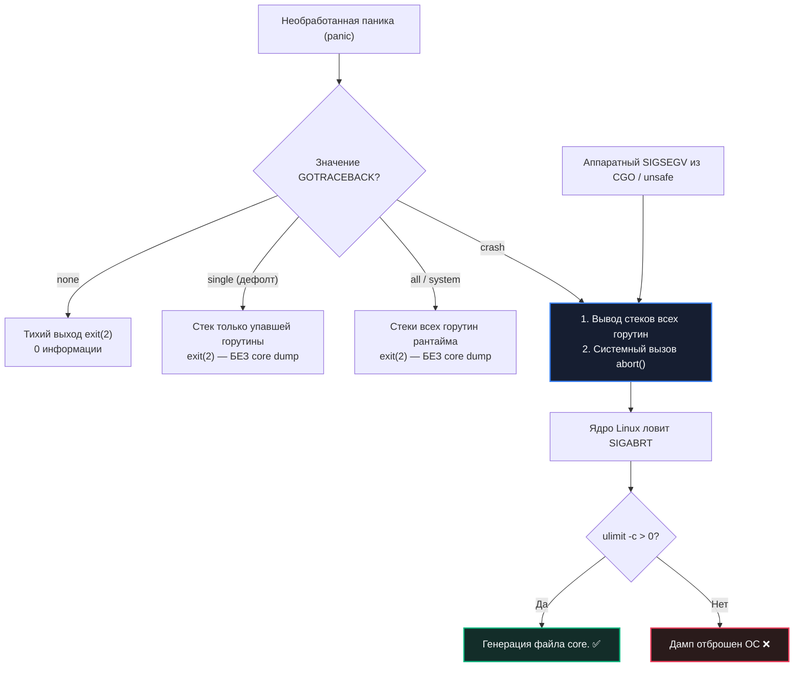

## Core dumps: «чёрный ящик» упавшей программы

В предыдущей главе [[5. Postmortem анализ]] мы выстроили целостную методологию расследования инцидентов по сохраненным цифровым следам. Но среди всех возможных артефактов существует один абсолютный источник истины — **Core Dump (дамп ядра / дамп памяти)**. Это исчерпывающий побайтовый снимок виртуальной памяти процесса, зафиксированный операционной системой в наносекунду физической гибели программы.

Если структурированные логи ([[4. Логи и debugging]]) отвечают на вопрос: *«Что происходило за мгновение до катастрофы?»*, а профили аллокаций — *«Какой общий объем памяти был занят кучей?»*, то Core Dump позволяет заглянуть в самый эпицентр взрыва. Он позволяет восстановить точнейшее состояние всех горутин, значения абсолютно всех локальных переменных в стеке, содержимое срезов, хэш-таблиц и даже машинные регистры процессора на момент падения.

Для Senior Go-инженера владение техникой генерации и анализа Core Dump'ов — обязательный стандарт. Спорадические паники с разыменованием `nil pointer`, фатальные сегфолты в CGO-библиотеках, скрытые повреждения памяти через `unsafe.Pointer` или дедлоки, которые невозможно воспроизвести локально под отладчиком Delve ([[2. Delve debugger]]) — всё это оставляет неизгладимые улики в Core Dump. 

В этой статье мы препарируем анатомию Core Dump: разберем, как рантайм Go и ядро Linux создают дамп, как правильно сконфигурировать серверы и поды Kubernetes, как провести расследование через Delve и с какими аппаратными ограничениями операционной системы предстоит столкнуться инженеру.

---

## Что представляет собой Core Dump в архитектуре Go

**Core Dump** (дамп ядра) — это системный бинарный файл стандарта ELF (Executable and Linkable Format в Linux) или Mach-O (в macOS), содержащий точный снимок адресного пространства виртуальной памяти процесса на момент получения фатального сигнала ядра (`SIGSEGV`, `SIGABRT`, `SIGBUS`, `SIGQUIT`), при условии, что лимит `ulimit -c` разрешает запись на диск.

В контексте среды выполнения Go Core Dump сохраняет фундаментальные пласты рантайма:

```
Анатомия Core Dump процесса Go:
┌────────────────────────────────────────────────────────────────────────┐
│ 1. Стеки всех горутин (runtime.g): Локальные переменные, фреймы, адреса│
├────────────────────────────────────────────────────────────────────────┤
│ 2. Динамическая куча (Heap): Все живые структуры, слайсы, мапы, строки │
├────────────────────────────────────────────────────────────────────────┤
│ 3. Метаданные типов и кода: .text, .rodata, глобальные переменные      │
├────────────────────────────────────────────────────────────────────────┤
│ 4. Аппаратный контекст: Регистры CPU (RAX, RSP, RIP) для всех тредов M │
└────────────────────────────────────────────────────────────────────────┘
```

* **Стеки всех горутин:** Каждая легковесная горутина имеет свой непрерывный стек памяти. В дампе сохраняются все стековые фреймы: где горутина была остановлена, какие аргументы передавались в функции и какие локальные структуры лежали на стеке.
* **Динамическая куча (Heap):** Все объекты, выделенные аллокатором Go, сохраняются со своим содержимым — сырые байты строк, внутренние бакеты хэш-таблиц `runtime.hmap`, заголовки слайсов.
* **Сегменты данных и кода:** Глобальные переменные, константы и машинный код.
* **Аппаратные регистры процессора:** Содержимое регистров CPU для каждого активного потока операционной системы (M-треда).

В отличие от текстового дампа горутин ([[4. goroutine dump]]), содержащего лишь плоские стек-трейсы, Core Dump — это **полноценный замороженный бинарный слепок**. Это позволяет инспектировать реальные значения в структурах данных, обходить граф объектов кучи и диагностировать повреждения памяти, вызванные CGO.

---

## Как Go управляет созданием Core Dump: переменная `GOTRACEBACK`

Рантайм Go перехватывает аварийные сигналы и паники. Поведение рантайма при падении напрямую определяется системной переменной окружения **`GOTRACEBACK`**:



### 1. Необработанная паника (panic)
Когда в программе возникает паника, и она не перехвачена `recover()`, рантайм вызывает внутреннюю процедуру `runtime.fatalpanic`. Поведение рантайма при этом напрямую зависит от переменной `GOTRACEBACK`:

- **`GOTRACEBACK=none`:** Процесс завершается молча, без вывода стека и без core dump.
- **`GOTRACEBACK=single` (значение по умолчанию):** Рантайм выводит стек вызовов только той горутины, в которой произошла паника, и завершает процесс через `exit(2)`. **Core dump не создается!**
- **`GOTRACEBACK=all`:** Выводит в `stderr` стеки всех горутин сервиса, но завершается через `exit(2)`. Core dump не генерируется.
- **`GOTRACEBACK=system`:** Аналогично `all`, но дополнительно включает системные горутины рантайма (GC background workers, scavenger, finalizer). Без дампа.
- **`GOTRACEBACK=crash`:** **Единственный режим, создающий дамп!** Рантайм сначала печатает стеки всех горутин, а затем намеренно инициирует системный сбой вызовом `abort()`. Процесс получает сигнал `SIGABRT`, и ядро ОС генерирует Core Dump.

### Аппаратные сигналы (SIGSEGV, SIGBUS)
При возникновении аппаратных исключений ядра (ошибка адресации памяти в CGO или разыменование невалидного указателя через `unsafe.Pointer`) ядро Linux отправляет процессу сигнал `SIGSEGV`. 

Рантайм Go перехватывает сигнал и пытается преобразовать его в стандартную панику `panic: runtime error: invalid memory address`. Если восстановление невозможно или установлен `GOTRACEBACK=crash`, рантайм вызывает `abort()`, гарантируя сохранение дампа памяти.

### Принудительная генерация дампа
В критических ситуациях инженер может принудительно заставить процесс сбросить дамп:
* Программно: через `runtime.Breakpoint()` или прямой системный вызов `syscall.Kill(syscall.Getpid(), syscall.SIGABRT)`.
* Из терминала: отправкой сигнала завершения с дампом `kill -SIGQUIT <PID>` (в Linux по умолчанию сигнал `SIGQUIT` генерирует core dump, если разрешено системой).

> [!info] Под капотом
> Внутренняя процедура `runtime.abort()` в Linux выполняет системный вызов `tgkill(getpid(), gettid(), SIGABRT)` либо инструкцию завершения `UD2` (Undefined Instruction). Ядро ОС перехватывает `SIGABRT` и запускает ядерную процедуру сброса памяти процесса `do_coredump()`. Важно: рантайм Go успевает записать стек вызовов в `stderr` *до* вызова `abort()`, поэтому текстовый лог и бинарный дамп идеально дополняют друг друга.

---

## Настройка инфраструктуры для сохранения Core Dump

По умолчанию большинство дистрибутивов Linux блокируют запись дампов ради экономии дискового пространства (`ulimit -c 0`).

### Локально и на серверах

```bash
# 1. Разрешаем создание core dump неограниченного объема
ulimit -c unlimited

# 2. Настраиваем канонический шаблон именования в ядре Linux
echo "/var/coredumps/core.%e.%p.%t" | sudo tee /proc/sys/kernel/core_pattern
```

Специальные спецификаторы в шаблоне `core_pattern`:
* `%e` — имя исполняемого бинарного файла.
* `%p` — идентификатор процесса (PID).
* `%t` — Unix-timestamp момента падения.

### Сжатие на лету через конвейер (Pipe Compression)
Поскольку дамп 16-гигабайтного процесса может мгновенно забить диск, ядро Linux поддерживает передачу дампа через pipe в скрипт сжатия:

```bash
echo "|/usr/local/bin/core_compressor %e %p %t" | sudo tee /proc/sys/kernel/core_pattern
```

Где `/usr/local/bin/core_compressor` принимает бинарный поток дампа из `stdin`, сжимает его на лету с помощью `zstd` или `gzip` и асинхронно сбрасывает в сетевое хранилище (NFS / S3).

---

### 2. Настройка в контейнерах Kubernetes и Docker

В контейнеризированных окружениях контейнер после краша немедленно уничтожается оркестратором. Если не принять меры, дамп испарится вместе с контейнером.

Правильная конфигурация пода в Kubernetes:

```yaml
apiVersion: v1
kind: Pod
metadata:
  name: highload-backend
spec:
  containers:
  - name: app
    image: my-company/backend:v1.2.0
    env:
    # 1. Приказываем рантайму падать через abort()
    - name: GOTRACEBACK
      value: "crash"
    resources:
      limits:
        memory: "4Gi"
    volumeMounts:
    # 2. Монтируем каталог для дампов на быстрый узел хоста
    - name: coredumps
      mountPath: /var/coredumps
  volumes:
  - name: coredumps
    emptyDir: {}
```

> [!important] Влияние параметров ядра ноды
> Параметр `sysctl kernel.core_pattern` настраивается **на уровне хостовой операционной системы рабочей ноды Kubernetes** и разделяется всеми подами на этом сервере. При падении контейнера дамп сохраняется по пути, заданному хостом, либо попадает в смонтированный volume. Пока под находится в состоянии `CrashLoopBackOff`, инженер успевает скачать дамп командой `kubectl cp`.

---

## Анализ Core Dump с помощью отладчика Delve

Для препарирования посмертного дампа используется специализированный режим Delve (`dlv core`):

```bash
dlv core ./my_server core.my_server.12345
```

Отладчик открывает дамп как замороженный процесс в момент его гибели. Инженеру доступны ключевые команды интерактивного исследования:

- **`goroutines`** — полный список всех горутин с их состояниями на момент аварии.
- **`threads`** — системные потоки операционной системы (M-треды).
- **`goroutine <id>`** — переключение контекста на конкретную горутину.
- **`stack`** — восстановленный стек вызовов выбранной горутины.
- **`frame <N>`** — переход к стековому фрейму номер $N$.
- **`locals`** — вывод всех локальных переменных текущего фрейма.
- **`print <variable>`** (или `p variable`) — отображение значений полей структур, слайсов, хэш-таблиц.
- **`list`** — отображение исходного кода вокруг инструкции падения.

---

### Практический сценарий: Расследование паники Nil Pointer Dereference

**Ситуация:** Боевой API-сервер упал с ошибкой `panic: runtime error: invalid memory address or nil pointer dereference`. В логах виден лишь факт паники. Открываем сохраненный Core Dump:

```bash
dlv core ./api core.api.5678
```

```text
(dlv) goroutines
  Goroutine 1: Running: main.main ./main.go:25
  Goroutine 34: Running: main.processRecord ./handler.go:67
(dlv) goroutine 34
(dlv) stack
0  0x4a1b20 in main.processRecord
    at /app/handler.go:67
1  0x4a1a8a in main.handleRequest
    at /app/handler.go:32
(dlv) frame 0
(dlv) locals
record = main.Record {ID: 456, Data: nil}
(dlv) p record.Data
nil
```

**Диагноз:** На строке `handler.go:67` выполнялось чтение поля `record.Data.Field` при значении `Data == nil` (переменная `record.Data` оказалась равна `nil`). Без Core Dump мы бы видели только строку кода, но не знали бы, какое именно поле структуры содержало `nil`. Core Dump позволил мгновенно увидеть конкретное значение объекта `record`.

---

### Анализ дедлока

Если сервис завис в мертвом клинче, сборщик мусора и запросы клиентов останавливаются. Внешний мониторинг фиксирует таймаут пробы `livenessProbe` и завершает процесс сигналом `SIGABRT` (или администратор посылает `kill -ABRT`).

Открыв Core Dump такого процесса в Delve, мы выполняем команду `goroutines` и видим характерную патологию:
* 0 горутин со статусом `[running]`.
* 500 горутин заблокированы в состоянии `[chan send]`.
* 500 горутин заблокированы в состоянии `[sync.Mutex.Lock]`.

Переключаясь между горутинами (`goroutine 12`, `goroutine 15`), мы исследуем переменные каналов и мьютексов, мгновенно выявляя циклическую зависимость блокировок.

---

## Ограничения и риски использования Core Dump

При всей своей мощи Core Dump — это тяжеловесный инструмент, требующий осторожности:

1. **Гигантский размер на диске:** Объем дампа равен объему виртуальной памяти (RSS + анонимные страницы), выделенной процессу. Для Go-сервиса с 16 ГБ кучи дамп займет 16 ГБ дискового пространства. Если на сервере кончится свободное место, это приведет к падению соседних сервисов.
2. **Конфиденциальность и безопасность (Security Risk):** Core Dump содержит побайтовый слепок памяти: в нем присутствуют приватные ключи RSA/TLS, пароли к базе данных, пользовательские токены авторизации JWT и персональные данные клиентов. Файлы дампов должны шифроваться и удаляться сразу после завершения расследования инцидента.
3. **Отсутствие истории (Только срез времени):** Core Dump показывает состояние системы в последнюю миллисекунду. Если повреждение памяти (Data Race, см. [[3. Race detector в проде]]) произошло за 10 минут до краша, а падение случилось позже, Core Dump зафиксирует лишь последствия, но не покажет виновника первоначальной коллизии.
4. **Специфика платформ:** В macOS дампы сохраняются в директорию `/cores/` в бинарном формате Mach-O, требующем специфической сборки Delve.

---

## Альтернативы: когда Core Dump избыточен

Если падения вызваны предсказуемыми логическими дефектами, Core Dump часто можно заменить значительно более легкими инструментами:

* **Текстовый дамп горутин ([[4. goroutine dump]]):** Снимается по сигналу `SIGQUIT` или через `pprof.Lookup("goroutine").WriteTo()`. Он весит несколько мегабайт текста и полностью достаточен для распутывания 90% взаимных блокировок (дедлоков).
* **Профиль памяти ([[5. pprof memory profile]]):** Показывает точки аллокаций кучи и достаточен для расследования причин утечек памяти (OOM) без сброса гигабайтных дампов ядра.
* **Execution Trace ([[3. execution tracer]]):** Фиксирует динамику переключений горутин и планировщика рантайма.

---

## Mechanical Sympathy: Что происходит в ядре ОС при записи дампа

Когда рантайм Go выполняет `abort()`, процессор переходит в режим обработки исключения:

```
Аппаратный путь генерации Core Dump:
[ runtime.abort() ] ──► [ Инструкция UD2 / SIGABRT ] ──► [ Переход в ядро Linux: do_coredump() ]
                                                                     │
                                                                     ▼
[ Диск: VFS write ] ◄── [ Заморозка тредов: TASK_UNINTERRUPTIBLE ] ◄── [ Обход страниц VMA ]
```

1. **Заморозка процесса (D-State):** Ядро Linux переводит все системные потоки M в состояние непрерываемого сна **`TASK_UNINTERRUPTIBLE`** (состояние `D` в выводе `ps`). Процесс перестает реагировать на любые сигналы, включая `SIGKILL`.
2. **Сброс виртуальных областей памяти (VMA):** Ядро последовательно обходит таблицы страниц (Page Tables) процесса и сбрасывает все анонимные страницы памяти через подсистему VFS на диск.
3. **Конкуренция за дисковый I/O:** Если дамп пишется на медленный диск или сетевой том (NFS/EBS), запись может продолжаться 60–120 секунд. В это время дисковый контроллер утилизирован на 100%, блокируя операции ввода-вывода других контейнеров на этой же ноде.
4. **Кэш-когерентность:** При генерации дампа ядро сбрасывает модифицированные строки аппаратного кэша процессора L1/L2 обратно в оперативную память, гарантируя актуальность данных.

---

## Резюме

1. **Core Dump — абсолютный черный ящик:** Это полный побайтовый снимок виртуальной памяти процесса (стеки всех горутин, куча, код, регистры CPU).
2. **Активация через `GOTRACEBACK=crash`:** Только с этим параметром рантайм Go вызывает системный `abort()`, инициируя генерацию дампа при панике.
3. **Подготовка инфраструктуры обязательна:** Снимайте лимиты через `ulimit -c unlimited` и настраивайте шаблон `/proc/sys/kernel/core_pattern` с конвейерным сжатием на лету.
4. **Delve (`dlv core`) — главный инструмент патологоанатома:** Позволяет восстановить значения локальных переменных, стековые фреймы и состояние горутин в момент гибели процесса.
5. **Помните об аппаратной цене:** Запись многогигабайтного дампа замораживает процесс в `TASK_UNINTERRUPTIBLE` и перегружает дисковую подсистему. Контролируйте лимиты и защищайте конфиденциальные данные.

Core Dump позволяет распутать самые глубокие аварии, приводящие к физической гибели процесса. Но что делать, если сервис не падает, не паникует и не течет по памяти, но при этом отдельные пользовательские запросы внезапно зависают на секунды? Чтобы победить скрытые хвосты задержек, мы переходим к финальной теме подраздела: [[7. Debugging latency проблем]].