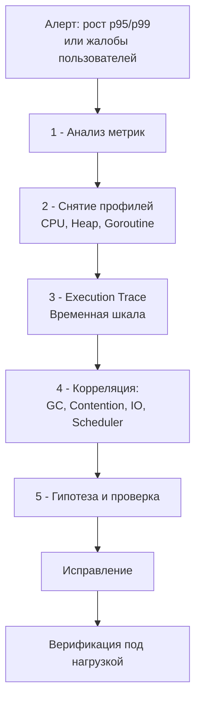

## Debugging Latency проблем: когда программа не ломается, но «тормозит»

> *"There are two ways of constructing a software design: One way is to make it so simple that there are obviously no deficiencies, and the other way is to make it so complicated that there are no obvious deficiencies."*  
> — C.A.R. Hoare

В предыдущих статьях подраздела мы вооружались инструментами для расследования катастрофических сбоев: препарировали упавшие процессы в Delve ([[2. Delve debugger]]), искали гонки данных ([[3. Race detector в проде]]), анализировали посмертные логи ([[5. Postmortem анализ]]) и вскрывали «черные ящики» системных аварий ([[6. Core dumps]]). Катастрофа с грохотом роняет сервис, оставляя четкий след: сигнал `SIGSEGV`, фатальную панику, стектрейс и дамп памяти.

Но спросите любого опытного дежурного инженера, и он признается: падения сервиса — это благословение по сравнению с **деградацией задержек (Latency Spikes)**.

Представьте картину: сервис работает, код возвращает статус `200 OK`, процессор загружен на скромные 25%, оперативная память в норме, логи чисты от ошибок. Но клиенты в ярости: время отклика 99-го перцентиля ($p99$) внезапно подскочило с комфортных 10 мс до мучительных 800 мс. Бюджет ошибок SLO сгорает за считанные минуты, upstream-сервисы начинают отваливаться по таймаутам, порождая лавину повторных запросов (retry storm). Программа не сломалась — сломались ее **временные характеристики**.

Отладка задержек (latency debugging) — высший пилотаж бэкенд-инженерии, находящийся на стыке профилирования производительности (раздел [[16. Профилирование, отладка и производительность]]) и классической отладки (раздел [[11. Debugging]]). Здесь недостаточно запустить `pprof` и найти «самую тяжелую функцию». Задержка — это не количество выполненных инструкций, а **время, проведенное в вынужденном ожидании**. 

В этой завершающей статье подраздела мы построим строгий инженерный фреймворк расследования задержек в Go-сервисах. Мы объединим метрики ([[6. Метрики. p50, p95, p99]]), профилировщики ([[2. CPU profiling в Go]], [[5. pprof memory profile]], [[5. block profile]], [[6. mutex profile]]), execution tracer ([[3. execution tracer]]), scheduler trace ([[7. scheduler trace]]) и логи с трассировкой ([[4. Логи и debugging]]) в единую систему поиска узких мест, опираясь на принципы механического сочувствия к машине ([[5. Mechanical sympathy в backend разработке]]).

---

## Почему проблемы задержек — самые сложные

Если краш программы бинарен (сервис либо жив, либо мертв), то задержка многомерна, коварна и часто сопротивляется прямолинейным методам наблюдения:

1. **Отсутствие явной точки отказа:** Процесс функционирует. 95% пользователей не замечают проблем, и лишь каждый сотый запрос застревает в неизвестности. Где именно? На сетевом сокете, в очереди ОС, на парсинге JSON или на дисковом I/O базы данных?
2. **Искажение статических профилей (Sample Bias):** Классический CPU-профиль сэмплирует работающие потоки 100 раз в секунду. Но если горутина *спит*, ожидая мьютекс, сетевой ответ или квант времени процессора, CPU-профилировщик ее просто не видит! Он покажет, что 30% времени ушло на `json.Unmarshal`, создавая ложное впечатление виновника, хотя на самом деле запрос провел 95% времени в состоянии блокировки.
3. **Эффект накопления в распределенных системах:** В микросервисной архитектуре запрос проходит через цепочку из $N$ сервисов. Если каждый сервис имеет $p99 = 10$ мс, то вероятность того, что сложный запрос из 10 вызовов столкнется с медленным ответом, составляет не 1%, а почти $10\%$ ($1 - (1 - 0.01)^{10} \approx 9.56\%$). Хвосты задержек ([[7. Tail latency и почему она важна]]) каскадно мультиплицируются.
4. **Нелинейная многопричинность (Feedback Loops):** Задержка редко возникает из-за одной изолированной строчки кода. Обычно это порочный круг: кратковременный всплеск трафика увеличивает аллокации → сборщик мусора чаще запускает фазу разметки ([[6. GC pause и latency]]) → рантайм принудительно переводит горутины в режим `mark assist` → горутины дольше удерживают мьютексы ([[7. Contention и lock profiling]]) → растет очередь блокировок → планировщик истощает локальные очереди P ([[1. Scheduler Go. G M P модель]]).

```
Порочный круг деградации задержек:
[ Всплеск аллокаций ] ──► [ GC Mark Assist ] ──► [ Замедление обработчиков ]
         ▲                                                 │
         │                                                 ▼
[ Рост очередей и задержки ] ◄── [ Конфликты на мьютексах (Contention) ]
```

---

## Фреймворк отладки задержек (Latency Debugging Framework)

Хаотичные попытки оптимизировать все подряд при росте $p99$ напоминают стрельбу в темноте. Чтобы локализовать причину за минимальное время, senior-инженер использует пятиэтапный алгоритм сужения области поиска.



---

### Шаг 1. Анализ метрик — где именно задержка?

Расследование всегда начинается с верхнеуровневой телеметрии в Prometheus и дашбордов Grafana по методологии RED (Rate, Errors, Duration):

* **Какая именно квантиль деградировала?**
  * Если вырос только $p99$, а медиана $p50$ осталась неизменной (например, 5 мс против 600 мс) — ищите редкие выбросы: фазы Stop-The-World в GC, эпизодический lock contention, переподключение пула соединений БД, троттлинг cgroups или длинные полезные нагрузки.
  * Если синхронно выросли и $p50$, и $p99$ — деградация системная: процессор физически перегружен, закончились потоки/дескрипторы, либо downstream-зависимость (БД) замедлилась для всех.
* **На каком сегменте конвейера растет задержка?**
  * Изучите гистограммы времени отдельных стадий: `read_request_body`, `auth_validation`, `db_query`, `json_serialization`.
* **Корреляция с системными метриками Go и ядра:**
  * `go_gc_duration_seconds` — длительность фаз сборщика мусора.
  * `go_memstats_heap_inuse_bytes` — динамика заполнения кучи.
  * `go_goroutines` — аномальный рост числа горутин свидетельствует об их зависании.
  * `container_cpu_cfs_throttled_seconds_total` (а также метрики `container_cpu_throttling`) — скрытый убийца в Kubernetes: принудительное замораживание контейнера ядром Linux из-за исчерпания CPU-квоты.
* **Локальная или сетевая проблема?**
  * Если задержка возросла одновременно у нескольких независимых сервисов, причина почти наверняка лежит в инфраструктуре: общая сеть ([[3. Network latency]]), сетевая карта (NIC drop) или общая перегруженная СУБД.

```bash
# Быстрая проверка GC в реальном времени через логирование рантайма
GODEBUG=gctrace=1 ./my-service
```
О параметрах настройки сборщика мусора см. [[7. GOGC и tuning]].

---

### Шаг 2. Снятие профилей — что делает процессор и память?

Когда временной интервал проблемы зафиксирован, снимаются срезы профилирования непосредственно под нагрузкой:

```bash
# 1. CPU profile за 10 секунд
go tool pprof http://localhost:6060/debug/pprof/profile?seconds=10

# 2. Профиль аллокаций памяти кучи
go tool pprof http://localhost:6060/debug/pprof/heap

# 3. Дамп активных горутин
curl -s http://localhost:6060/debug/pprof/goroutine?debug=2 > goroutines.txt

# 4. Профили блокировок и конкуренции
go tool pprof http://localhost:6060/debug/pprof/block
go tool pprof http://localhost:6060/debug/pprof/mutex
```

* **CPU profile:** ищем характерные сигнатуры:
  * Если в верхних строках `runtime.mallocgc` или `runtime.gcAssistAlloc` — процессор сжигает такты на раздачу памяти и помощь сборщику мусора ([[9. Когда GC становится bottleneck]]).
  * Если в топе `sync.(*Mutex).Lock` или `sync.(*RWMutex).RLock` — потоки выжигают такты в спинлоках или блокируются в futex ([[7. Contention и lock profiling]]).
  * Если доминирует `runtime.netpollblock` — приложение ожидает сетевого ввода-вывода от клиентов или внешних API ([[4. epoll kqueue и netpoller]]).
* **Heap profile:** анализируем `alloc_space` (суммарный объем выделенной памяти) и `inuse_space` (живая память). Если `alloc_space` растет на гигабайты за секунды при стабильном `inuse_space`, сервис генерирует шквал короткоживущих объектов, заставляя GC циклически пожирать процессорное время.
* **Goroutine profile:** ищем массовые скопления горутин со статусами:
  * `[chan receive]` / `[chan send]` — перегрузка внутренних очередей или утечка фоновых воркеров.
  * `[sync.Mutex.Lock]` — конкуренция за общую память.
  * `[runnable]` — катастрофический признак: горутины готовы исполняться, но операционная система или планировщик Go не дают им процессорного времени (голодание).

> [!NOTE]
> Профили дают превосходный статистический срез «кто потребил больше всего ресурсов», но они слепы к фактору времени. Они не отвечают на вопрос: «почему запрос #4812 ждал ответа 2 секунды, если средняя функция занимает 50 микросекунд?». Для ответа на этот вопрос требуется хронологическая лента событий.

---

### Шаг 3. Execution trace — восстановление временной шкалы

Самое мощное оружие против задержек в арсенале Go-инженера — **execution tracer** ([[3. execution tracer]]). Он сохраняет микросекундную летопись всех событий в рантайме: смена состояний горутин (Running, Runnable, Waiting), переключения между логическими процессорами P, системные вызовы ядра, этапы работы сборщика мусора и активность потоков ОС (M).

Снятие 5-секундного следа:
```bash
curl -o trace.out http://localhost:6060/debug/pprof/trace?seconds=5
go tool trace trace.out
```

```
Визуализация Execution Trace во времени:
Proc 0: [  Goroutine 101 (HTTP)  ] [ MARK ASSIST ] [ Goroutine 101 ]
Proc 1: [           GC: Mark Termination (STW)             ]
Proc 2: [ Goroutine 102 ] [ Waiting on Mutex ]──► [ Runnable ] [ Goroutine 102 ]
Proc 3: [ Syscall: epoll_wait ] ────────────────────────► [ Goroutine 105 ]
        ├─────────────────────────────────────────────────────────────► Время (t)
```

Что мгновенно проявляется на временной шкале трассировщика:
1. **Фазы Stop-The-World (STW):** Отображаются как сплошные вертикальные полосы, блокирующие исполнение на всех логических процессорах P. Выделив полосу курсором, можно мгновенно узнать точную длительность остановки мира (например, 3.2 мс).
2. **Mark Assist:** Если пользовательская горутина вместо выполнения бизнес-логики подсвечена статусом `MARK ASSIST`, значит, она превысила выделенный лимит аллокаций и рантайм принудил ее маркировать объекты кучи в наказание за расточительность.
3. **Длительные блокировки на мьютексах и каналах:** Трассировщик показывает отрезки ожидания (`Waiting`) и связывает стрелкой событие разблокировки: видно, какая именно горутина освободила мьютекс или отправила сообщение в канал.
4. **Миграции горутин между P:** Если чувствительная к задержкам горутина постоянно перепрыгивает с одного P на другой, она непрерывно сбрасывает аппаратный L1/L2 кэш процессора ([[8. Cache friendliness]]).

---

### Шаг 4. Корреляция — соединение точек

На четвертом этапе данные агрегированных профилей, временной шкалы и распределенных логов объединяются:

* **Сценарий 1: GC-индуцированные задержки.**
  * *Симптомы:* В CPU-профиле доминирует `gcAssistAlloc`, в Execution Trace видны частые полосы `MARK ASSIST` прямо в контексте HTTP-обработчиков.
  * *Первопричина:* Интенсивная генерация мусора в куче.
  * *Лечение:* Устранение аллокаций через предварительное выделение слайсов ([[1. Уменьшение аллокаций]]) и переиспользование объектов через `sync.Pool` ([[2. sync Pool]]).
* **Сценарий 2: Мьютексный затор (Lock Contention).**
  * *Симптомы:* Goroutine profile показывает тысячи горутин в `[sync.Mutex.Lock]`, mutex profile ([[6. mutex profile]]) и block profile ([[5. block profile]]) указывают на конкретный метод (например, `updateCache`).
  * *Первопричина:* Выполнение долгого I/O или тяжелых вычислений внутри критической секции мьютекса.
  * *Лечение:* Сокращение критической секции, переход на шардированные структуры (`ShardedMap`) или lock-free атомики.
* **Сценарий 3: Зависание в Runnable (CPU Throttling в Kubernetes).**
  * *Симптомы:* Трассировщик фиксирует, что горутины проводят десятки миллисекунд в статусе `Runnable` при свободных или заблокированных P. При этом CPU-профиль приложения полупустой.
  * *Первопричина:* Ядро Linux обрубает процессорное время контейнеру по механизму CFS (Completely Fair Scheduler) из-за жестких CPU limits (`resources.limits.cpu`).
  * *Лечение:* Увеличение CPU limits, снятие limits с оставлением requests, либо тюнинг `cfs_quota_us` / `cfs_period_us`.
* **Сквозные цепочки с Correlation ID:**
  * По логам с единым Correlation ID ([[7. Correlation ID]]) вычисляется конкретный аномальный запрос. По OpenTelemetry Trace ID мы сопоставляем микросекунды в коде Go с таймлайном сетевых запросов к БД или внешним микросервисам.

---

### Шаг 5. Гипотеза, исправление, верификация

Научный подход исключает правки наугад:
1. **Формулировка гипотезы:** «Рост $p99$ задержки до 400 мс вызван режимом Mark Assist при сериализации аналитических отчетов из-за создания временных `[]byte` буферов».
2. **Проверка гипотезы:** Профиль памяти подтверждает 1.8 ГБ аллокаций в функции отчетов.
3. **Локальное исправление:** Внедрение кольцевого буфера или пула байтовых срезов `sync.Pool`.
4. **Верификация под нагрузкой:** Запуск нагрузочного генератора ([[1. Load testing]]) с профилированием до и после рефакторинга. Контроль возвращения $p99$ в границы SLA.

---

## Ключевые источники задержек в Go

В таблице систематизированы наиболее частые причины проседания времени отклика в продакшене:

| Источник задержки | Симптомы и проявления | Инструменты диагностики |
|---|---|---|
| **GC-паузы и Mark Assist** | Рост `go_gc_duration_seconds`, пики в `gcAssistAlloc`, широкие полосы STW и `MARK ASSIST` в трассировщике. | [[6. GC pause и latency]], [[3. execution tracer]], `GODEBUG=gctrace=1` |
| **Contention на мьютексах** | Массовое зависание в `[sync.Mutex.Lock]`, высокий contention delay в block profile, задержки в `runtime.chansend`. | [[7. Contention и lock profiling]], [[5. block profile]], [[6. mutex profile]] |
| **Перегрузка планировщика (Runqueue Saturation)** | `schedtrace` рапортует о гигантском `runqueue`, десятки горутин в `runnable` при `idleprocs=0`. | [[7. scheduler trace]], [[1. Scheduler Go. G M P модель]] |
| **Сетевые задержки и Netpoller** | Рост `http_client_request_duration_seconds`, долгое пребывание в `runtime.netpollblock`, исчерпание пула TCP-соединений. | [[3. Network latency]], [[4. epoll kqueue и netpoller]], [[5. block profile]] |
| **Блокирующие системные вызовы** | Резкий рост количества потоков ОС (`threads` в `schedtrace`), горутины в статусе `syscall` блокируют потоки M. | [[1. Системные вызовы и их стоимость]] |
| **CFS CPU Throttling** | `container_cpu_cfs_throttled_seconds_total` > 0 при низком `cpu/utilization` от Go, горутины замирают в `Runnable`. | Метрики Linux cgroup, `node_exporter` |

---

## Пользовательские аннотации в трассировке

Стандартная трассировка рантайма фиксирует низкоуровневые события (память, потоки, планировщик), но ничего не знает о контексте вашего приложения: каком пользователю принадлежит запрос, какой заказ обрабатывается и какой SQL-запрос выполняется.

Для бесшовного соединения бизнес-контекста с хронологией рантайма стандартная библиотека предоставляет пакет `runtime/trace`. Он позволяет встраивать **пользовательские задачи (Tasks), регионы (Regions) и лог-события (Logs)**:

```go
package main

import (
	"context"
	"net/http"
	"runtime/trace"
)

func handleOrder(w http.ResponseWriter, r *http.Request) {
	// 1. Создаем пользовательскую задачу, привязанную к жизненному циклу запроса
	ctx, task := trace.NewTask(r.Context(), "handleOrder")
	defer task.End()

	// 2. Логируем метаданные заказа прямо в трассировку
	trace.Log(ctx, "orderID", r.Header.Get("X-Order-ID"))

	// 3. Выделяем критический этап в именованный регион
	processPayment(ctx)

	w.WriteHeader(http.StatusOK)
}

func processPayment(ctx context.Context) {
	// Регион отобразится на временной шкале отдельным цветным блоком
	region := trace.StartRegion(ctx, "validatePayment")
	defer region.End()

	// Имитация валидации и взаимодействия с платежным шлюзом
	// Любая GC-пауза или блокировка мьютекса внутри этого региона
	// будет визуально наложена на отрезок времени 'validatePayment'
}
```

Когда вы откроете такой файл через `go tool trace`, в интерфейсе появится специализированная панель **User-defined Tasks**:
* Вы можете кликнуть на конкретную транзакцию `handleOrder`.
* Браузер отобразит полную диаграмму Ганта (Gantt chart) для данного запроса: сколько микросекунд ушло на регион `validatePayment`, где именно запрос был прерван сборщиком мусора, и сколько времени он ожидал ответа сокета.

> [!TIP]
> Пользовательские регионы `trace.StartRegion` обладают околонулевым оверхедом при отключенной трассировке. Их можно и нужно оставлять в критических путях высоконагруженных сервисов: при включении трассировки на 5 секунд в продакшене вы мгновенно получаете рентгеновский снимок работы бизнес-логики.

---

## Практический пример: расследование роста p99

Рассмотрим реальный кейс из практики высоконагруженного сервиса оформления заказов.

**Инцидент:**  
Сервис `order-api` при стабильной нагрузке в 3 000 RPS внезапно показал взрывной рост задержки: $p50$ остался стабильным на уровне 20 мс, но $p99$ подскочил с 50 мс до 300 мс. Появились единичные таймауты клиентов.

```
Хронология расследования инцидента:

1. МЕТРИКИ (Prometheus / Grafana):
   - go_gc_duration_seconds: пилообразные всплески STW до 48 мс каждые 2 секунды.
   - go_memstats_heap_alloc_bytes: куча пилообразно взлетает до 1.2 ГБ и падает до 200 МБ.
   - go_goroutines: стабильно ~1500 (утечки горутин нет).
   
2. ПРОФИЛИРОВАНИЕ (pprof):
   - CPU profile (10 сек):
     * 25% — runtime.gcAssistAlloc
     * 35% — json.Unmarshal (включая служебные функции runtime.slicebytetostring)
   - Memory profile (alloc_space):
     * 60% всех аллокаций процесса генерирует функция parseOrderPayload() в json.Unmarshal.

3. EXECUTION TRACE (5 сек):
   - Каждые 200 мс наблюдаются паузы STW длительностью до 2 мс.
   - Горутины HTTP-воркеров проводят по 3-5 мс в статусе MARK ASSIST, не выполняя бизнес-код.
   - Время сетевого ожидания (netpoll) и очереди планировщика (runqueue) находятся в норме.

4. КОРРЕЛЯЦИЯ И ДИАГНОЗ:
   - Стандартный парсер `encoding/json` при разборе тяжелых входящих JSON-массивов аллоцирует миллионы промежуточных объектов в куче.
   - Сборщик мусора перегружается и мобилизует горутины-обработчики на помощь в маркировке (`mark assist`).
   - Запросы, попавшие в фазу Mark Assist + STW, получают кумулятивную задержку 250-300 мс.

5. ИСПРАВЛЕНИЕ И ВЕРИФИКАЦИЯ:
   - Замена рефлексивного `encoding/json` на высокопроизводительную SIMD-библиотеку `sonic` (или кодогенерацию `easyjson`).
   - Внедрение пула буферов `sync.Pool` для временных байтовых срезов парсера.
   - Результат: объем аллокаций (alloc_space) снизился на 70%, GC-паузы упали до субмиллисекундных значений, метрика $p99$ вернулась к эталонным 45 мс.
```

---

## Mechanical Sympathy: как задержка складывается из тактов

С точки зрения кремниевого кристалла процессора, общее время отклика сервиса — это не абстрактные «миллисекунды». Это сумма элементарных аппаратных событий, в которых процессор либо выполняет полезные инструкции, либо простаивает:

$$\text{Latency} = T_{\text{useful}} + T_{\text{cache\_miss}} + T_{\text{sync}} + T_{\text{gc}} + T_{\text{syscall}} + T_{\text{scheduler}}$$

1. **Полезные такты ($T_{\text{useful}}$):** Непосредственное вычисление бизнес-правил, работа алгоритмов, арифметические операции в регистрах CPU.
2. **Такты простоя кэша ($T_{\text{cache\_miss}}$):** Процессор ожидает выборки данных из оперативной памяти DRAM при промахе мимо кэша L1/L2/L3 (до 200 тактов на каждый промах, см. [[8. Cache friendliness]]).
3. **Такты ожидания синхронизации ($T_{\text{sync}}$):** Бесплодное вращение в спинлоке (CPU spinning) или перевод потока в спячку через `futex` при конфликте за мьютекс ([[4. Контекстные переключения]]).
4. **Такты, экспроприированные сборщиком мусора ($T_{\text{gc}}$):** Работа потоков GC-маркировки, фазы полной остановки мира (STW) и принудительный режим `mark assist` ([[9. Когда GC становится bottleneck]]).
5. **Такты перехода в пространство ядра ($T_{\text{syscall}}$):** Сброс конвейера инструкций, переключение контекста процессора при системных вызовах `epoll_wait`, `read`, `write` ([[1. Системные вызовы и их стоимость]]).
6. **Такты голодания в очереди ($T_{\text{scheduler}}$):** Время, когда готовая к работе горутина находится в статусе `Runnable` в локальной очереди $P$, ожидая, пока освободится поток ОС ([[1. Scheduler Go. G M P модель]]).

Инженер, обладающий механическим сочувствием к железу, глядя на полосы трассировщика, видит физическую реальность: запрос завис не потому, что «Go медленный», а потому что поток M был вытеснен ядром Linux из-за исчерпания квантов времени CFS, а горутина ждала освобождения мьютекса, удерживаемого другой горутиной, отрабатывающей mark assist.

---

## Когда ничего не помогло: эвристики для сложных случаев

Бывают инциденты, когда очевидных всплесков в метриках нет, а редкие клиенты продолжают жаловаться на зависания. В таких ситуациях помогают продвинутые эвристики:

* **Дифференциальные профили (Differential Profiling):**  
  Сохраните CPU-профиль в период нормальной работы сервиса и сравните его с профилем во время инцидента с помощью флага `-diff_base`:
  ```bash
  go tool pprof -diff_base=normal_cpu.pb.gz incident_cpu.pb.gz
  ```
  Это визуализирует исключительно **дельту**: функции, которые стали потреблять аномально больше времени или появились в стеке впервые ([[8. Сравнение версий кода]]).
* **Точечное логирование задержек по Correlation ID:**  
  Внедрите замер времени контрольных участков:
  ```go
  start := time.Now()
  // ... подозрительный блок ...
  if elapsed := time.Since(start); elapsed > 50*time.Millisecond {
      logger.Warn("slow operation detected", "elapsed", elapsed, "trace_id", traceID)
  }
  ```
  В момент деградации можно динамически понизить уровень логирования для конкретного Correlation ID и собрать детальный хронометраж каждого шага.
* **Детерминированное воспроизведение нагрузки:**  
  Если аномалия проявляется лишь на 0.05% запросов, используйте инструменты дублирования сетевого трафика с продакшена (например, `GoReplay` / `gor/m replay`). Запись и воспроизведение реального трафика на тестовом стенде с включенным execution trace позволяет воспроизвести гонку или краевой случай без риска для живых пользователей.
* **Изоляция внешних сетевых зависимостей:**  
  Замените сетевые вызовы к внешним сервисам или СУБД на локальные in-memory заглушки (mock). Если задержка воспроизводится на заглушках — проблема строго внутри процесса Go; если исчезает — фокус поиска смещается на сеть и внешние базы данных.

---

> [!TIP] Вопрос с собеседования
> **Вопрос:** «На проде подскочил p99 latency HTTP-сервиса с 20 мс до 1.5 секунд. При этом CPU utilisation всего 15%, а память стабильна. С чего вы начнете расследование и какие инструменты примените?»  
> **Ответ кандидата Senior-уровня:**  
> «Низкий CPU при высоком latency прямо указывает на то, что потоки не выполняют полезную работу, а проводят время в **ожидании (блокировках)**.
> 1. Сначала проверю метрику `container_cpu_cfs_throttled_seconds_total` — если контейнер задушен квотой cgroups, CPU будет низким, но горутины будут простаивать в `Runnable`.
> 2. Сниму `goroutine profile` (`debug=2`) и `block/mutex profile`. Это покажет, заблокированы ли сотни горутин на `sync.Mutex`, ожидании каналов или на сетевых вызовах базы данных (`runtime.netpollblock`).
> 3. Сниму 5-секундный `execution trace` (`curl /debug/pprof/trace?seconds=5`). На временной шкале сразу станет видно распределение: если горутины висят в `Waiting` на системных вызовах — узкое место в I/O или downstream-сервисе; если в `Runnable` — планировщик Go или ядро ОС не дают квантов времени; если видны паузы STW или `MARK ASSIST` — проблема в сборщике мусора из-за пикового темпа временных аллокаций».

---

> [!WARNING] Ловушка на проде: коварство CFS Throttling в контейнерах
> Одна из самых частых причин необъяснимого взрыва $p99$ в Kubernetes — это механизм ядра Linux CFS Quota.  
> Если для пода задан лимит `resources.limits.cpu: 1` при периоде CFS `100ms`, то процессу разрешено утилизировать суммарно 100 мс процессорного времени за каждые 100 мс астрономического времени. Если Go-сервис запустил 8 горутин на 8 ядрах одновременно, они израсходуют лимит 100 мс всего за 12.5 мс!  
> В оставшиеся 87.5 мс периода ядро Linux принудительно усыпляет весь контейнер. В этот момент задержка любого входящего запроса мгновенно подскакивает на 80–90 мс на ровном месте. При этом средний CPU сервиса за 1 минуту в Prometheus будет выглядеть как безопасные 40–50%! Решение — регулярный мониторинг троттлинга и отказ от заниженных CPU limits в пользу правильно рассчитанных CPU requests.

---

## Итог

* **Отладка задержек** — фундаментальная дисциплина на стыке наблюдаемости (Observability) и глубинного понимания рантайма Go. Она требует сопоставления агрегированных метрик, моментальных профилей, хронологических трассировок и структурированных логов.
* **Строгий пятиэтапный фреймворк:** Метрики (RED) → Профили (CPU, Heap, Goroutine) → Execution Trace (временная шкала) → Корреляция (GC, Contention, I/O, Scheduler) → Формулирование гипотезы и верификация под нагрузкой.
* **Главные виновники задержек в Go:** Фазы сборщика мусора и режим `mark assist`, конкуренция за мьютексы и каналы (Lock Contention), насыщение очередей планировщика (Runqueue Saturation), сетевые задержки ввода-вывода и CFS CPU Throttling в контейнерах.
* **Execution Tracer (`go tool trace`)** — непревзойденный инструмент для визуализации задержек во времени. Пользовательские задачи и регионы (`runtime/trace`) позволяют транслировать бизнес-транзакции непосредственно на временную шкалу рантайма.
* **Механическое сочувствие:** Задержка складывается из тактов процессора, растраченных на ожидание кэша, системные вызовы, переключения контекста и сборку мусора. Понимание этого аппарата превращает отладку из гадания на кофейной гуще в строгую инженерную науку.

С этой статьей мы завершаем подраздел «Debugging». Мы прошли путь от низкоуровневой интерактивной отладки и выявления гонок данных до патологоанатомического анализа падений ядра и системного обуздания сетевых и процессорных задержек.

Впереди нас ждет заключительный аккорд всего 16-го модуля: обобщение изученного фундамента и формирование инженерного мышления в статье [[1. Итоги раздела. Performance engineering mindset]].