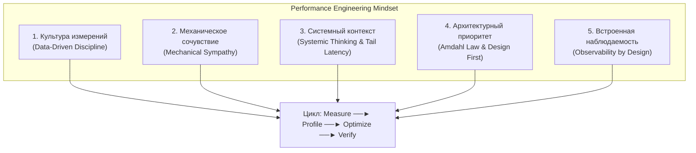

## Performance Engineering Mindset: от инструментов к мышлению

> *«Каждый знает, что отладка программы вдвое сложнее ее написания. Поэтому, если при написании кода вы выложились на пределе своего ума, как же вы собираетесь его отлаживать?».*    
> — Брайан Керниган

Вот мы и подошли к финалу одного из самых масштабных, глубоких и технически насыщенных разделов нашей энциклопедии — **«Профилирование, отладка и производительность»**.

Позади колоссальный путь: от фундаментальных математических законов масштабирования до физики кремниевых кристаллов, от ассемблерных инструкций SIMD до внутренних структур рантайма Go, от триколорного маркинга сборщика мусора до виртуозного препарирования упавших серверов через Delve и Core Dumps. 

Но если после прочтения 91 лекции у инженера в голове останется лишь разрозненная записная книжка с флагами `GODEBUG` и командами `pprof`, цель не будет достигнута. Истинный результат глубокого погружения — это не знание конкретных синтаксических трюков, которые могут измениться в очередном мажорном релизе Go. Истинный результат — это сформированный **Performance Engineering Mindset** (инженерное мышление высокой производительности).

Это особое состояние инженерного восприятия, которое навсегда отделяет разработчика, механически пишущего код по туториалам, от системного архитектора (Staff / Principal / Senior Go Engineer). Такой инженер видит сквозь абстракции: за строчкой кода он ощущает движение электронов, кэш-линии процессора, переключения контекста ядра ОС и аллокации в страницах виртуальной памяти.

В этой финальной синтезирующей статье мы соберем воедино все линии огромного раздела, закрепим нерушимые законы архитектурной дисциплины и сформулируем правила мышления, которые будут служить вам путеводной звездой на протяжении всей инженерной карьеры.

---

## Что такое Performance Engineering Mindset

**Performance Engineering Mindset** — это профессиональная культура и философия взаимодействия с вычислительной системой. Она зиждется на пяти фундаментальных столпах:



1. **Не набор хаков, а способ мышления:** Флаги компилятора и параметры сборщика мусора приходят и уходят. Но принцип «*никогда не оптимизируй вслепую — измеряй, выдвигай гипотезу, проверяй*» остается вечным законом физики и программирования.
2. **Производительность — это архитектурная фича первого класса:** Невозможно построить кривой, протекающий каркас и «навесить оптимизации в самом конце проекта перед релизом». Производительность либо заложена в базовые модели данных, сетевые протоколы и контракты конкурентности, либо ее не будет вовсе. Статья [[1. Обзор раздела. Как мыслить о производительности]] задала этот вектор с самых первых страниц.
3. **Глубокое понимание цены абстракций:** Язык Go знаменит своей элегантной простотой. Но за лаконичными ключевыми словами `go`, `chan`, `select` и пустым интерфейсом `any` скрываются сложнейшие структуры: планировщик рантайма, сборщик мусора с барьерами записи, escape analysis. Механическая эмпатия ([[5. Mechanical sympathy в backend разработке]]) требует от инженера осознавать цену каждого синтаксического удобства — в наносекундах задержки, тактах процессора и строках аппаратного кэша.
4. **Системный взгляд на сквозную цепочку:** Высоконагруженный микросервис никогда не живет в вакууме. Любая внутренняя задержка в 500 мкс эхом отдается во всей распределенной топологии. Хвостовая задержка ([[7. Tail latency и почему она важна]]) накапливается каскадно, уничтожая бюджеты ошибок (SLO) и порождая лавины ретраев.
5. **Владение строгим научным циклом: Measure → Profile → Optimize → Verify:** Инженерный подход противоположен шаманизму. Если оптимизация не подтверждена цифрами до и после в идентичных воспроизводимых условиях — это не оптимизация, а случайная деградация, замаскированная удачей.

---

## Карта раздела: что мы изучили

Оглянемся назад и окинем взором панораму грандиозного пути, пройденного в 16-м модуле:

```
                          АРХИТЕКТУРА ИНЖЕНЕРНОГО МАЙНДСЕТА
┌──────────────────────────────────────────────────────────────────────────┐
│ 1. ФУНДАМЕНТ: Latency, Throughput, Amdahl Law, Mechanical Sympathy, SLO │
└────────────────────────────────────┬─────────────────────────────────────┘
                                     ▼
┌──────────────────────────────────────────────────────────────────────────┐
│ 2. ИЗМЕРЕНИЯ: Бенчмаркинг, benchstat, микро/макротесты, стабилизация     │
└────────────────────────────────────┬─────────────────────────────────────┘
                                     ▼
┌──────────────────────────────────────────────────────────────────────────┐
│ 3. МИКРОАРХИТЕКТУРА: CPU profiling, Flamegraphs, Inlining, SIMD, Cache   │
└────────────────────────────────────┬─────────────────────────────────────┘
                                     ▼
┌──────────────────────────────────────────────────────────────────────────┐
│ 4. ПОДСИСТЕМА ПАМЯТИ: Стек vs Куча, Escape Analysis, Профилирование, GC   │
└────────────────────────────────────┬─────────────────────────────────────┘
                                     ▼
┌──────────────────────────────────────────────────────────────────────────┐
│ 5. КОНКУРЕНТНОСТЬ & IO: Планировщик GMP, Lock Contention, Netpoller, Sys │
└────────────────────────────────────┬─────────────────────────────────────┘
                                     ▼
┌──────────────────────────────────────────────────────────────────────────┐
│ 6. ВЫСОКИЕ НАГРУЗКИ & ДЕБАГ: Highload Patterns, Delve, Tracing, Core Dump│
└──────────────────────────────────────────────────────────────────────────┘
```

### Фундамент
Мы начали с формулирования понятийного аппарата: разделили задержку и пропускную способность ([[2. Latency vs throughput]]), классифицировали задачи на вычислительные и связанные с вводом-выводом ([[3. CPU bound vs IO bound задачи]]), осознали жесткие пределы параллелизма по закону Амдала ([[4. Amdahl law и масштабирование]]), познакомились с концепцией механической эмпатии ([[5. Mechanical sympathy в backend разработке]]), научились презирать средние значения в пользу перцентилей ([[6. Метрики. p50, p95, p99]]) и изучили природу хвостовых задержек ([[7. Tail latency и почему она важна]]). Без этого базиса разговор об оптимизациях теряет всякий физический смысл.

### Benchmarking
Бенчмаркинг ([[2. Benchmarking в Go]]) стал нашим главным метрологическим инструментом. Мы научились создавать безупречные изолированные эксперименты, обходить коварные ловушки компилятора ([[4. Подводные камни benchmark тестов]]), стабилизировать результаты на современных процессорах с динамическим турбобустом ([[6. Стабилизация результатов]]), отличать микроэффекты от макросистем ([[5. microbenchmarks vs macrobenchmarks]]) и статистически доказывать гипотезы через `benchstat`. Главный закон: **без замеров любая оптимизация — это лишь суеверие**.

### CPU Profiling
Профилирование процессора с помощью `pprof` ([[1. pprof. Введение]], [[2. CPU profiling в Go]]) распахнуло двери в тайны исполнения инструкций. Мы научились читать и строить интерактивные флеймграфы ([[3. Flamegraph]]), мгновенно вычислять тяжелейшие функции по метрикам `flat` и `cum` ([[4. Top functions анализ]]), анализировать решения компилятора о встраивании кода ([[5. Inline и влияние на performance]]), оптимизировать предсказатели переходов процессора ([[6. Branch prediction и код]]), применять векторные инструкции SIMD ([[7. SIMD и Go]]) и уважать пространственную и временную локальность кэша ([[8. Cache friendliness]]). Процессорное время — это не строчки вашего исходника, а физические такты кремниевого кристалла.

### Memory Profiling
Память в Go перестала быть абстрактным бесконечным хранилищем. Мы разделили стек и кучу ([[2. Heap vs stack]]), исследовали логику escape analysis компилятора ([[3. Escape analysis]]), научились профилировать аллокации кучи ([[4. Allocation profiling]], [[5. pprof memory profile]]), выявлять коварные утечки ресурсов ([[6. Утечки памяти]]), бороться с фрагментацией аллокатора TCMalloc ([[7. Fragmentation]]) и управлять жизненным циклом структур данных ([[8. Object lifetime]]). Мы выучили жесткое правило: **каждая аллокация в куче — это налог на процессорное время, который неминуемо взыщет сборщик мусора**.

### Garbage Collector
Мы заглянули под капот рантайма сборщика мусора ([[1. GC в Go. Обзор]]). Разобрали механику трехцветной раскраски графа объектов ([[2. Tri color marking]]), микроскопические паузы Stop-The-World ([[3. Stop the world]]), параллельные фазы конкурентного маркинга ([[4. Concurrent GC]]) и защитные барьеры записи ([[5. Write barriers]]). Мы осознали природу влияния пауз GC на задержки сервиса ([[6. GC pause и latency]]) и вооружились тонким инструментарием настройки через `GOGC` ([[7. GOGC и tuning]]) и спасительный мягкий лимит памяти `GOMEMLIMIT` ([[8. GOMEMLIMIT]]). Сборщик мусора Go прекрасен, но он мгновенно превращается в фатальное бутылочное горлышко ([[9. Когда GC становится bottleneck]]), если проектировать структуры данных беспечно.

### Конкурентность
Мы исследовали планировщик Go по модели G-M-P ([[1. Scheduler Go. G M P модель]]), разобрав анатомию горутины под капотом ([[2. Goroutines под капотом]]) и алгоритмы кражи работы work stealing ([[3. Work stealing]]). Оценили истинную стоимость переключений контекста ([[4. Контекстные переключения]]), накладные расходы примитивов синхронизации ([[5. Sync primitives и их стоимость]]), сделали взвешенный выбор между мьютексами и каналами ([[6. Mutex vs channel]]), научились бороться с заторами на блокировках (Lock Contention, см. [[7. Contention и lock profiling]]), устранили аппаратный эффект ложного разделения памяти ([[8. False sharing]]) и научились идеально выравнивать поля структур под 64-байтные строки кэша процессора ([[9. Cache line и выравнивание]]). Итог: **конкурентность бесплатна только в презентациях; в реальном железе она требует железной дисциплины синхронизации**.

### IO и системный уровень
Мы спустились на уровень ядра операционной системы: подсчитали скрытую стоимость системных вызовов ([[1. Системные вызовы и их стоимость]]), научились выявлять узкие места ввода-вывода ([[2. IO bottlenecks]]), поняли фундаментальные источники сетевых задержек ([[3. Network latency]]) и исследовали сетевой поллер Go на базе `epoll` и `kqueue` ([[4. epoll kqueue и netpoller]]). Мы освоили бескомпромиссные zero-copy подходы ([[5. Zero copy подходы]]), виртуозное переиспользование байтовых буферов ([[6. Buffer reuse]]), оптимизацию файлового ввода-вывода ([[7. File IO оптимизация]]) и искусство пулинга сетевых TCP-соединений ([[8. Connection pooling]]).

### Runtime и инструменты
Мы подчинили себе низкоуровневый пакет `runtime` ([[1. runtime пакет]]), освоили визуальный трассировщик `go tool trace` ([[2. trace tool]], [[3. execution tracer]]), научились моментально снимать и читать дампы горутин ([[4. goroutine dump]]), находить застрявшие потоки через block profile ([[5. block profile]]) и mutex profile ([[6. mutex profile]]), наблюдать за очередями через scheduler trace ([[7. scheduler trace]]) и виртуозно использовать системные инструменты отладки ([[8. debug tools]]).

### Практические оптимизации / Highload / Debugging
В подразделе паттернов и практик мы укротили аллокации через `sync.Pool`, оптимизировали слайсы, мапы и сериализацию данных. В подразделе Highload — выстроили эшелонированную защиту продакшена: Graceful Degradation, Circuit Breaker, Rate Limiting, адаптивный шеддинг нагрузки, кэширование и канареечные релизы. А в подразделе Debugging — освоили хирургический скальпель интерактивного отладчика Delve, поиск гонок под нагрузкой, посмертный анализ инцидентов и извлечение крупиц истины из аварийных дампов ядра и задержек $p99$.

---

## Ключевые принципы Performance Engineering Mindset

Сложим изученные концепции в незыблемый морально-технический кодекс инженера:

### 1. Data-Driven: нет цифр — нет проблемы

Фундаментальная аксиома из вводной статьи [[1. Почему нельзя оптимизировать без измерений]]: **любое утверждение о производительности без подтверждающего профиля или бенчмарка является не более чем гаданием на кофейной гуще**.

Каждое инженерное суждение обязано опираться на строгие метрологические артефакты:
* Бенчмарки с дельтой по `benchstat` (`old.txt` vs `new.txt`).
* Профили CPU, heap, block и mutex до и после оптимизации.
* Перцентильные метрики $p50$, $p95$, $p99$, throughput и счетчики ошибок.
* Хронологические трассировки `execution trace` и логи `schedtrace`.

**В повседневной практике:** Никогда не принимайте на код-ревью пуллреквесты с комментарием «я переписал цикл, так работает быстрее», если автор не приложил бенчмарк `go test -bench` и анализ `benchstat`. При авариях в продакшене блокируйте любые хаотичные рестарты и правки конфигов наугад: сначала фиксируются метрики и срезы профилей, затем формулируются гипотезы.

### 2. Mechanical Sympathy: понимай своё «железо»

Концепция Мартина Томпсона ([[5. Mechanical sympathy в backend разработке]]) — философское ядро нашего курса. Язык Go компилируется в нативный машинный код, который исполняется на физических транзисторах кремниевого процессора с архитектурой фон Неймана.

Процессор понятия не имеет о «красивой архитектуре» или «паттернах проектирования». Он понимает только:
* Конвейер инструкций и точность предсказания ветвлений ([[6. Branch prediction и код]]).
* Иерархию кэшей L1i/L1d, L2, L3 и попадание в 64-байтные строки кэша.
* Пространственную связность данных: линейный слайс плоских структур `[]Order` летит со скоростью 50 ГБ/с благодаря аппаратному предвыборщику памяти (Hardware Prefetcher), в то время как связный список указателей заставляет процессор тратить 200 тактов на каждый шаг, безнадежно промахиваясь мимо кэша ([[8. Cache friendliness]]).
* Недопустимость одновременной записи в соседние байты строки кэша с разных ядер CPU ([[8. False sharing]], [[9. Cache line и выравнивание]]).

**В повседневной практике:** Проектируя структуры данных и горячие пути бизнес-логики, всегда мысленно сопоставляйте структуры в оперативной памяти: где возникнет `runtime.memmove`, упадет ли указатель в кучу, разрушит ли эта многопоточная запись локальность кэш-линии?

### 3. Системный подход: производительность — свойство системы, а не компонента

Изолированная оптимизация отдельного модуля может парадоксальным образом обрушить всю систему в целом:
* Если вы оптимизировали сервис так, что он стал обрабатывать 50 000 RPS вместо 5 000 RPS, вы можете мгновенно положить общую реляционную базу данных PostgreSQL, спровоцировав глобальный каскадный отказ.
* Кратковременная пауза Stop-The-World в 2 миллисекунды на одном внутреннем микросервисе каскадно превращается в потерю сотен запросов в хвосте распределенного вызова ([[7. Tail latency и почему она важна]]).
* Агрессивное увеличение коэффициента `GOGC` до 300 снижает утилизацию CPU сборщиком мусора, но раздувает кучу, вызывая фатальный визит демона `OOMKilled` от ядра Linux в контейнере Kubernetes ([[7. GOGC и tuning]], [[8. GOMEMLIMIT]]).
* Неправильно настроенный пул соединений ([[8. Connection pooling]]) может создать искусственный затор на стороне клиента при абсолютно ненагруженном сервере.

**В повседневной практике:** Каждое архитектурное решение оценивается в контексте сквозного бюджета задержек (Latency Budget) и всей системы в целом.

### 4. Цикл Measure → Profile → Optimize → Verify

Этот цикл — рабочий алгоритм, которому следует инженер высокой квалификации:

```
                  ИНЖЕНЕРНЫЙ ЦИКЛ ОПТИМИЗАЦИИ
┌──────────────┐      ┌──────────────┐      ┌──────────────┐      ┌──────────────┐
│ 1. MEASURE   │ ──►  │ 2. PROFILE   │ ──►  │ 3. OPTIMIZE  │ ──►  │ 4. VERIFY    │
│ Замер метрик │      │ Поиск узкого │      │ Точечный     │      │ Доказанный   │
│ SLA/SLO/RPS  │      │ горлышка     │      │ рефакторинг  │      │ результат    │
└──────────────┘      └──────────────┘      └──────────────┘      └──────┬───────┘
       ▲                                                                 │
       └───────────────────────── Повтор ────────────────────────────────┘
```

1. **Measure:** Замеряем базовое состояние системы под нагрузкой. Фиксируем $p50$, $p99$, RPS, RPS на ядро CPU, потребление RSS.
2. **Profile:** Снимаем профили (`cpu`, `heap`, `block`, `mutex`, `trace`). Определяем доминирующий фактор (CPU-bound, Memory-bound, Contention или Network-wait).
3. **Optimize:** Применяем конкретную минимально достаточную технику (пулирование `sync.Pool`, уменьшение аллокаций, шардирование мьютекса, пакетная обработка).
4. **Verify:** Повторяем идентичный тест. Доказываем улучшение цифрами. Если профиль показывает нулевой выигрыш или рост задержек в соседнем месте — изменение немедленно откатывается.

### 5. Приоритет архитектурных решений над микрооптимизациями

Закон Амдала ([[4. Amdahl law и масштабирование]]) сурово напоминает: ускорение компонента, на который приходится 5% времени выполнения, ускорит систему максимум на 5%, даже если вы сделаете этот компонент бесконечно быстрым.

Если ваш HTTP-хэндлер тратит 85 миллисекунд на синхронный SQL-запрос к базе данных и 1 миллисекунду на сериализацию JSON:
* Переписывание JSON на SIMD-парсер сэкономит 0.4 миллисекунды (0.4% общей задержки).
* Внедрение локального in-memory кэша или параллельная асинхронная вычитка сэкономит 80 миллисекунд (более 90% общей задержки!).

Сначала решаются архитектурные задачи (кэширование, очереди, пакетная обработка, пулирование соединений, исключение синхронного I/O), и только затем, когда архитектура вычищена, наступает время микрооптимизаций горячего пути.

### 6. Профилируемость как требование к архитектуре

Сервис, который невозможно профилировать и инспектировать в режиме реального времени на боевом сервере — это бомба замедленного действия.

Профилируемость закладывается в проект с первого дня:
* Обязательный защищенный внутренний эндпоинт `net/http/pprof` (доступный только из внутренней сети или по mTLS).
* Экспорт стандартных рантайм-метрик Go в Prometheus (`go_gc_*`, `go_goroutines`, `go_memstats_*`, `go_sched_*`).
* Сквозной Correlation ID и контекстная распределенная трассировка OpenTelemetry ([[7. Correlation ID]]).
* Поддержка пользовательских аннотаций трассировки `runtime/trace`.

---

## Применение майндсета в повседневной работе

### Код-ревью

Senior-инженер на код-ревью смотрит на код под микроскопом производительности:
* **Аллокации на горячем пути:** Создаются ли анонимные функции, захватывающие переменные? Приводят ли вызовы интерфейсных методов к утечке на кучу (`escape to heap`)? Выделена ли емкость слайса заранее (`make([]T, 0, expected)`)?
* **Критические секции мьютексов:** Захватывается ли `sync.Mutex` во время выполнения сетевого вызова, запроса к БД или дисковой операции? Если да — это гарантированный коллапс под нагрузкой.
* **Неконтролируемая конкуренция:** Создаются ли горутины по принципу `go func()` на каждый входящий чих без использования пула воркеров или семафора?
* **Таймауты и контексты:** Передается ли `context.Context` с жестким `WithTimeout` во все сетевые клиенты?

### Проектирование

На этапе составления архитектурного дизайна (RFC / Design Doc):
* Каков ожидаемый бюджет задержек ($p99$ SLA)?
* Каков профиль сервиса — преимущественно CPU-bound или I/O-bound? Хватит ли ядер процессора при пиковой нагрузке?
* Как система защищена от перегрузки (Rate Limiting, Circuit Breaker, Shedding)?
* Каково поведение при сбое зависимостей — предусмотрен ли Graceful Degradation?

### Инциденты и их разбор

Когда в полночь срабатывает критический алерт, инженер с развитым майндсетом действует хладнокровно:
1. **Телеметрия:** Анализируем перцентили $p99$, код ответов, график нагрузки и saturation ресурсов.
2. **Срез артефактов:** Снимаем CPU profile, goroutine dump и execution trace прямо в момент пика аномалии.
3. **Корреляция:** Сопоставляем проблему с последними деплоями, миграциями баз данных или всплесками внешнего трафика.
4. **Локализация:** Выделяем точную функцию и ресурс (конкуренция за мьютекс, пауза GC, задержка сети).
5. **Безопасное купирование:** Откат релиза, включение деградации, масштабирование реплик.
6. **Blameless Postmortem:** Не поиск виновного, а выяснение: «почему система позволила проблеме дойти до продакшена и какой системный барьер нужно внедрить, чтобы исключить этот класс ошибок навсегда?» (см. [[8. Debugging distributed systems]]).

---

## Связь с другими разделами базы знаний

Performance Engineering Mindset — это замковый камень, скрепляющий воедино всю инженерную энциклопедию:

* **Архитектура компьютера** и **Устройство и работа ОС** дают аппаратный фундамент для механического сочувствия: транзисторы, конвейеры, кэши, виртуальная память и системные вызовы.
* **Глубокий Go** (внутреннее устройство слайсов, хэш-мап, интерфейсов, каналов) объясняет, *почему* возникают скрытые аллокации и блокировки.
* **Стандартная библиотека Go** (`io`, `net/http`, `sync`, `sync/atomic`) учит выбирать правильный инструмент под конкретную задачу.
* **Базы данных** и **Брокеры сообщений** показывают поведение I/O-систем за пределами нашего приложения.
* **Безопасность (AppSec)** гарантирует, что профилирование и отладка не скомпрометируют пользовательские пароли и приватные ключи.
* **Observability** дает глаза и уши: через метрики, логи и трассировки мы наблюдаем живой пульс высоконагруженной системы.

---

> [!TIP] Вопрос с собеседования
> **Вопрос:** «Что отличает высококлассного Go-инженера от разработчика среднего уровня при решении проблем производительности?»  
> **Ответ кандидата уровня Lead / Principal:**  
> «Разработчик среднего уровня действует методом проб и ошибок: увидев медленный код, он интуитивно пытается заменить структуры данных, переписать циклы, добавить горутин или наугад накрутить параметры `GOGC`.  
> Инженер с Performance Mindset действует как ученый-экспериментатор:  
> 1. Он начинает со сквозных метрик $p99$ и бюджета SLO.  
> 2. Снимает профили `pprof` и `execution trace`, чтобы обнаружить фактическое бутылочное горлышко (CPU, Memory, Mutex contention или IO).  
> 3. Опирается на механическое сочувствие к архитектуре процессора и рантайму Go.  
> 4. Формулирует строгую гипотезу, вносит изолированное изменение и доказывает выигрыш статистическими замерами через `benchstat` и нагрузочные тесты.  
> Он оптимизирует систему архитектурно, а не просто переписывает код».

---

> [!WARNING] Ловушка на проде: оптимизационный зуд (Premature Optimization)
> Классическое предостережение Дональда Кнута актуально как никогда: «Преждевременная оптимизация — корень всех зол».  
> Разработчик, только что прочитавший о SIMD, пулах памяти и lock-free алгоритмах, испытывает непреодолимое искушение переписать весь сервис на нечитаемый ассемблер и низкоуровневые указатели `unsafe.Pointer`. В результате код становится хрупким, полным скрытых гонок и абсолютно неподдерживаемым, а выигрыш в задержке составляет незаметные 2 микросекунды на фоне 50 миллисекунд сетевого запроса к СУБД.  
> **Золотое правило:** Пишите код просто, чисто и идиоматично. Оптимизируйте только тогда, когда профилировщик указывает на узкое горлышко, и только в той мере, которая требуется для выполнения требований вашего SLA.

---

## Заключение: что значит быть Senior/Lead Go-инженером в контексте производительности

Формальное завершение 16-го модуля — это не галочка в списке прочитанных глав. Это качественная трансформация вашего профессионального взгляда на разработку программного обеспечения.

Быть ведущим инженером — значит:

* **Видеть невидимое:** За строкой `json.Unmarshal` ощущать поток выделения памяти в аренах кучи и неизбежную работу сборщика мусора. За оператором `go worker()` — видеть выделение стека в 2 КБ, регистрацию в планировщике и перекладывание в очередь $P$. За оператором `+=` на соседних полях структуры — видеть аппаратный false sharing и битву ядер за кэш-линию L1.
* **Измерять, а не верить на слово:** Иметь привычку написать бенчмарк за 3 минуты до того, как высказать субъективное мнение в споре на код-ревью.
* **Принимать архитектурные решения на основе точных данных:** Выбирать между in-memory кэшем и Redis, между Mutex и Channel, между стандартным `encoding/json` и SIMD-библиотекой `sonic` — опираясь на замеры под целевой нагрузкой.
* **Проектировать надежность и наблюдаемость как единое целое:** Понимать, что Graceful Shutdown, Backpressure, Circuit Breaker, Rate Limiting и трассировка — это не разрозненные библиотеки, а кирпичи единой неприступной крепости отказоустойчивой системы.
* **Щедро делиться культурой с командой:** Учить коллег искусству чтения флеймграфов, писать информативные постмортемы без обвинений, помогать джуниорам и мидлам развивать механическое сочувствие к машине.

Performance Engineering Mindset — это не финишная прямая, а непрерывный увлекательный путь. С каждым новым релизом языка Go, с каждым новым поколением чипов и ядер Linux в мире высоконагруженных систем будут появляться новые нюансы. Но принципы инженерной честности, уважения к физике машины и дисциплины измерений останутся неизменными.

---

Модуль 16 полностью пройден. Мы овладели искусством создания быстрейших, надежнейших и прозрачнейших бэкенд-систем. 

Но как сделать так, чтобы наша быстрая система не была взломана в первый же день после выхода в открытый интернет? Чтобы ее конфиденциальные данные не утекли, токены не были скомпрометированы, а пользовательский ввод не превратился в вектор удаленного выполнения кода?

Мы открываем следующую фундаментальную главу нашей инженерной энциклопедии: **Модуль 17: Безопасность (AppSec в Go)**!