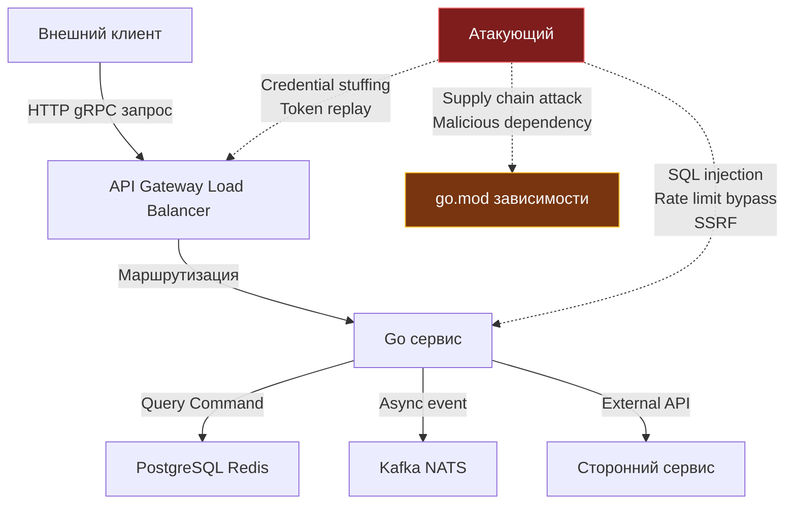
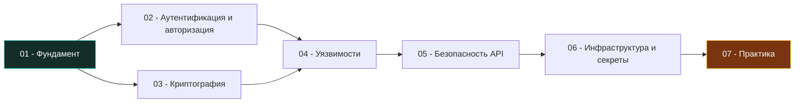

## Почему безопасность — это не фича, а фундамент

> *«Если вы считаете, что технологии способны решить ваши проблемы с безопасностью, вы не понимаете ни проблем, ни технологий».*    
> — Брюс Шнайер

Когда мы говорим о создании высоконагруженного бэкенда на Go, воображение инженера мгновенно рисует захватывающие картины: терабайты сетевого трафика, микросекундные задержки в $p99$, миллионы горутин, оптимизацию кэш-линий и филигранный тюнинг сборщика мусора. Но в реальном продакшене существует аспект, который начинающие разработчики и неопытные менеджеры упорно откладывают «на потом», ошибочно полагая его второстепенной задачей: **безопасность приложений (Application Security, AppSec)**.

Это фундаментальная, критическая архитектурная ошибка.

Попытка «прикрутить безопасность» к уже готовому сервису перед самым релизом напоминает попытку забетонировать фундамент под уже построенным небоскребом. Уязвимость в парсинге пользовательских данных, скрытая утечка токенов в логах, небезопасная конфигурация TLS или гонка состояний в логике проверки прав — это не мелкие «баги». Это глубокие **архитектурные дефекты**, исправление которых часто требует полного слома публичных API, переделки схем базы данных и переписывания половины сервиса.

> [!info] Под капотом
> **Почему «добавить безопасность потом» технически невозможно?**
> 
> Представьте, что вы спроектировали сетевой микросервис на Go. Вы подняли `net/http` сервер, сериализуете структуры в JSON через `encoding/json`, читаете и пишете данные в PostgreSQL. На этапе раннего прототипа команда решила: «Аутентификацию и валидацию прав добавим позже, сейчас главное — выкатить функционал и проверить продуктовые гипотезы».
> 
> Когда наступает неизбежный день аудита безопасности, вы сталкиваетесь с суровой реальностью:
> 1. Все хэндлеры принимают невалидированные структуры напрямую → внедрение валидационного middleware ломает контракты и типы входных параметров.
> 2. Секреты и пароли захардкожены в конфигах и коде → переход на динамические секреты из HashiCorp Vault требует переписывания всего жизненного цикла инициализации приложения.
> 3. Логи пишут `fmt.Printf("%v", userInput)` → конфиденциальные данные клиентов (PII, пароли, платежные токены) уже утекли в Elastic/Loki, требуя полной замены механизма логирования на структурированный `log/slog` с фильтрацией полей.
> 
> Безопасность, не заложенная в систему изначально, превращает любой последующий рефакторинг в бесконечный ночной кошмар.

---

## Безопасность как архитектурный примитив

В надежной инженерной архитектуре безопасность — это не отдельный изолированный «слой», который можно накинуть сверху как пальто. Это **имманентное свойство каждого примитива, типа данных и интерфейса**. 

Каждый раз, когда вы создаете структуру данных, проектируете HTTP-ручку, объявляете канал или проектируете взаимодействие с внешней базой данных, инженер обязан задать себе четыре фундаментальных вопроса:

1. **Кто имеет право доступа?** (Аутентификация — подтверждение подлинности субъекта, и авторизация — проверка конкретных полномочий).
2. **Какие данные обрабатываются и как они защищены?** (Конфиденциальность при передаче и хранении, целостность и защита от несанкционированной модификации).
3. **Что происходит при возникновении сбоя или направленной атаки?** (Принцип Fail-Secure — отказ в безопасном состоянии, полный аудит инцидентов и наблюдаемость).
4. **Где проходят границы доверия (Trust Boundaries)?** (Бескомпромиссная валидация любых данных, пересекающих границу внешней сети).

Эти критерии должны быть частью чек-листа код-ревью точно так же, как отсутствие гонок данных, утечек горутин и правильная обработка ошибок.

---

### Модель угроз (Threat Modeling) на старте

Прежде чем написать первую строчку рабочего кода, зрелая инженерная команда проводит сессию **моделирования угроз (Threat Modeling)** — систематический анализ архитектурной схемы с целью выявления векторов атак и брешей в обороне.

В современной распределенной системе на Go архитектурная картина выглядит следующим образом:



На этой диаграмме отчетливо видны векторы потенциальных вторжений:
* **Атаки на API Gateway / Load Balancer:** перебор паролей (Credential stuffing), подделка или повтор токенов (Token replay), отказ в обслуживании (DDoS).
* **Атаки на Go-бэкенд:** внедрение SQL-инъекций (SQL injection), обход лимитов частоты запросов (Rate limit bypass), подделка межсерверных запросов (SSRF).
* **Атаки на цепочку поставок (Supply Chain Attack):** внедрение вредоносного кода через внешние библиотеки в `go.mod`.

> [!tip] Собеседование
> **Вопрос:** Почему в языке Go особенно критично выполнять моделирование угроз (Threat Modeling) на стадии архитектурного проектирования, а не после написания кода?  
> **Ответ:**  
> 1. **Интерфейсная композиция:** Go строится вокруг неявных интерфейсов. Если сигнатура интерфейса слоя бизнес-логики изначально не принимает контекст безопасности (`context.Context` с маркером безопасности и токеном), добавить контекст постфактум невозможно без переписывания всех вызывающих функций и моков.  
> 2. **Конкурентная модель (Goroutines & Channels):** Планировщик Go и легковесные горутины провоцируют ошибки класса TOCTOU (Time-of-Check to Time-of-Use) и гонки данных, если разграничение доступа к ресурсам не спроектировано атомарным с самого начала.  
> 3. **Статическая сборка:** Go компилируется в единый бинарник. Если архитектура зависимостей изначально загрязнена непроверенными пакетами, исключить уязвимость в рантайме без полной перекомпиляции и комплексного регрессионного тестирования невозможно.

---

## Go и безопасность: преимущества и ловушки

Язык Go создавался инженерами Bell Labs и Google с упором на надежность, лаконичность и безопасность управления памятью. Это дает Go-разработчикам колоссальные преимущества по сравнению с C/C++, но одновременно создает иллюзию «абсолютной защищенности».

### ✅ Что помогает

| Особенность языка Go | Практическое влияние на безопасность |
|---|---|
| **Автоматическое управление памятью (GC)** | Полное отсутствие уязвимостей типа Use-After-Free, Double-Free и классических повреждений кучи из-за ручного `free()` |
| **Строгая статическая типизация и компиляция** | Исключение ошибок несоответствия типов; огромный пласт синтаксических ошибок отсекается до выкатки на прод |
| **Идиоматическая конкурентность** | Каналы и примитивы `sync` при дисциплинированном использовании снижают вероятность низкоуровневых гонок за память |
| **Эталонная стандартная библиотека (`crypto/*`)** | Криптографические алгоритмы Go реализованы ведущими экспертами (Филиппо Вальсорда и др.), защищены от атак по времени (constant-time) и безопасны по умолчанию |
| **Минималистичный синтаксис** | Отсутствие скрытого метапрограммирования и перегрузки операторов делает аудит кода прозрачным и прямолинейным |

### ⚠️ Что требует внимания

| Особенность языка Go | Потенциальный вектор уязвимости |
|---|---|
| **Явный возврат ошибок без исключений** | Соблазн проигнорировать ошибку через `_ = err` (или `_ = fn()`) приводит к продолжению исполнения запроса в скомпрометированном невалидном состоянии |
| **Рефлексия (`reflect`) и пустой интерфейс `any`** | Небезопасная десериализация произвольных объектов в рантайме способна обойти защиту компилятора |
| **Инициализация через `init()` и глобальное состояние** | Скрытый побочный код в сторонних зависимостях может выполняться до `main()` без ведома разработчика |
| **Escape Analysis и время жизни объектов** | Пароли и секретные ключи, утекшие в кучу, сохраняются в оперативной памяти процесса вплоть до очистки GC |

> [!warning] Ловушка / Gotcha: Утечка чувствительных данных через кучу
> В Go строки (`string`) неизменяемы (immutable). Если вы прочитали секретный токен или пароль пользователя в переменную типа `string`, компилятор выделит под нее память в куче (heap). Даже когда функция завершится, этот секрет останется лежать в памяти процесса до тех пор, пока сборщик мусора не освободит страницу, а операционная система не перезапишет байты.  
> 
> Более того, если упавший сервис сбросит Core Dump ([[6. Core dumps]]), пароль в открытом виде окажется на диске!
> 
> ```go
> // 🔴 ОПАСНО: пароль в строке невозможно стереть из памяти!
> func processPassword(password string) {
>     // Строка неизменяема. Сборщик мусора сотрет ее когда-нибудь потом.
>     authenticate(password)
> }
> 
> // 🔒 БЕЗОПАСНО: используем []byte и гарантированно затираем нулями
> func processSecureToken(token []byte) {
>     defer func() {
>         // Явное обнуление слайса в памяти сразу после работы
>         for i := range token {
>             token[i] = 0
>         }
>     }()
>     
>     // Выполнение криптографической операции
>     authenticateBytes(token)
> }
> ```
> Для строк рассмотрите использование `strings.Builder` с последующим сбросом, или специализированные типы из `crypto/subtle`, чтобы гарантировать очистку и исключить атаки по времени (Timing Attacks).

---

## Ключевые принципы для бэкенда на Go

При разработке сервисов на Go держите в голове четыре фундаментальных правила безопасного дизайна:

### Многоуровневая защита (Defense in Depth)

Никогда не доверяйте единственному защитному периметру. Если атакующий сумел обойти правила WAF или валидацию на шлюзе API Gateway, его должен встретить второй барьер в виде строгой типизированной валидации хэндлера, третий барьер в виде авторизации бизнес-логики и четвертый барьер на уровне прав доступа к базе данных (Row-Level Security).

```go
// Пример эшелонированной защиты при получении профиля пользователя
func (s *UserService) GetUser(ctx context.Context, userID string) (*User, error) {
    // Уровень 1: Аутентификация (извлечение субъекта из криптографически подписанного контекста)
    auth, ok := auth.FromContext(ctx)
    if !ok || !auth.isAuthenticated {
        return nil, ErrUnauthenticated
    }
    
    // Уровень 2: Авторизация на уровне доменной логики
    if !s.authz.CanReadUser(auth.Subject, userID) {
        return nil, ErrForbidden
    }
    
    // Уровень 3: Запрос в базу данных с жесткой привязкой к тенанту
    return s.repo.FindByIDAndTenant(ctx, userID, auth.TenantID)
}
```

### Отказ в безопасном состоянии (Fail Secure)

Любая нештатная ситуация, ошибка сети, таймаут или поврежденный ввод должны приводить к состоянию **запрета доступа**, а не к пропуску запроса. При этом ошибки, возвращаемые наружу клиенту, ни в коем случае не должны раскрывать детали внутреннего устройства системы.

```go
// ❌ НЕПРАВИЛЬНО: утечка внутренней структуры данных наружу
func validateToken(token string) error {
    if !isValid(token) {
        // Утечка: злоумышленник узнает о существовании пользователя
        return fmt.Errorf("invalid token for user %s", userID)
    }
    return nil
}

// ✅ ПРАВИЛЬНО: безопасный отказ с непрозрачной ошибкой
func validateToken(token string) error {
    if !isValid(token) {
        // Подробности пишем во внутренний журнал с уровнем Debug/Warn
        slog.Warn("token verification failed", "reason", "signature_mismatch", "ip", clientIP)
        // Наружу отдаем стандартизированную нейтральную ошибку
        return ErrInvalidToken
    }
    return nil
}
```

### Наименьшие привилегии (Least Privilege)

Каждый исполнительный узел, процесс и пользователь должны обладать строго минимальным набором прав, необходимым для выполнения непосредственных обязанностей:
* Сервис заказов не должен подключаться к PostgreSQL с правами `SUPERUSER` или владельца схемы; он должен иметь доступ только к `SELECT, INSERT, UPDATE` в строго отведенных таблицах.
* JWT-токены взаимодействия между сервисами должны быть ограничены по времени жизни (Short-lived) и содержать узкие области доступа (Scopes).
* Docker-контейнеры Go-приложений должны запускаться под непривилегированным пользователем (`USER nonroot:nonroot`) в режиме Read-Only файловой системы и без флагов `--privileged`.
* Избегайте бесконтрольного вызова системных утилит через `os/exec`.

### Observability как элемент безопасности

Невозможно защитить то, что вы не видите. Однако сами журналы логирования часто становятся причиной крупнейших утечек данных.

Используйте структурированный логгер `log/slog` (стандарт Go 1.21+) с предварительной санитаризацией входных данных:

```go
// Безопасная обертка логирования с защитой от CRLF-инъекций в логи
type SafeLogger struct {
    logger *slog.Logger
}

func (l *SafeLogger) Info(msg string, userInput string) {
    // Экранируем символы перевода строки для предотвращения Log Injection
    sanitized := strings.ReplaceAll(userInput, "\n", "\\n")
    sanitized = strings.ReplaceAll(sanitized, "\r", "\\r")
    l.logger.Info(msg, "input", sanitized)
}
```

> [!info] Под капотом
> **Почему `slog` предпочтительнее `log.Println` для безопасности?**
> 
> Пакет `slog` (стандартный с Go 1.21) предоставляет структурированное логирование с явными типизированными ключами. В отличие от `log.Println` или неконтролируемого `fmt.Printf`, он позволяет:
> 1. Централизованно применять middleware-фильтры к чувствительным полям (автоматическое маскирование `password`, `token`, `cardNumber`).
> 2. Избегать инъекций через формат-строки.
> 3. Легко интегрировать с системами аудита и SIEM через экспорт в JSON.
> 
> Подробнее: [[17. Безопасность (AppSec в Go).07. Практика.3. Логирование и аудит]]

---

## Структура раздела: что мы разберём

Этот раздел спроектирован как фундаментальное руководство по построению защищенных высоконагруженных бэкенд-систем на Go. Мы последовательно пройдем все эшелоны обороны:



1. **Фундамент (эта статья + следующие):** Философия AppSec, архитектурные границы доверия, моделирование угроз по методологии STRIDE, разбор OWASP Top 10 для Go-разработчика и декомпозиция принципа наименьших привилегий.
2. **Аутентификация и авторизация:** Надежное хэширование паролей (Argon2id, bcrypt), устройство и подводные камни JWT, OAuth 2.0 / OIDC, сессионные модели и разграничение доступа (RBAC, ABAC, ReBAC).
3. **Криптография:** Архитектура пакетов `crypto/*`, симметричное (AES-GCM, ChaCha20-Poly1305) и асимметричное шифрование (RSA, Ed25519), цифровые подписи, генерация энтропии и правильная настройка TLS 1.3 / mTLS.
4. **Уязвимости (OWASP & Go Gotchas):** Предотвращение SQL-инъекций, защита от SSRF, Command Injection, Path Traversal, атаки отказа в обслуживании (ReDoS, XML/JSON bombs) и гонки состояний (TOCTOU).
5. **Безопасность API:** Валидация входных данных, Rate Limiting и защита от брутфорса, правильная настройка CORS, защита от CSRF и предотвращение атак повторного воспроизведения (Replay Attacks).
6. **Инфраструктура и секреты:** Управление жизненным циклом секретов, интеграция с HashiCorp Vault, безопасная сборка Docker-контейнеров (Distroless, rootless), Supply Chain Security и статический анализ (`govulncheck`, SBOM).
7. **Практика и процессы:** Встраивание безопасности в CI/CD (DevSecOps), фаззинг сетевых протоколов, аудит и ведение защищенных журналов событий, реагирование на инциденты и итоговый чеклист AppSec.

---

## Итог и следующий шаг

Безопасность — это не набор формальных галочек в корпоративном опроснике перед сдачей проекта. Это **инженерный образ мышления (Security Mindset)**. Профессионал отличается тем, что в момент написания любой строчки кода задает себе трезвый вопрос: *«Что произойдет с этой функцией, если ее входные данные будут сгенерированы искусным и безжалостным злоумышленником?»*.

В следующей лекции мы перейдем к практическому инструменту моделирования угроз: разберем классификацию STRIDE, научимся очерчивать Attack Surface нашего сервиса и формализовывать защитные меры: [[2. Threat modeling и attack surface]].