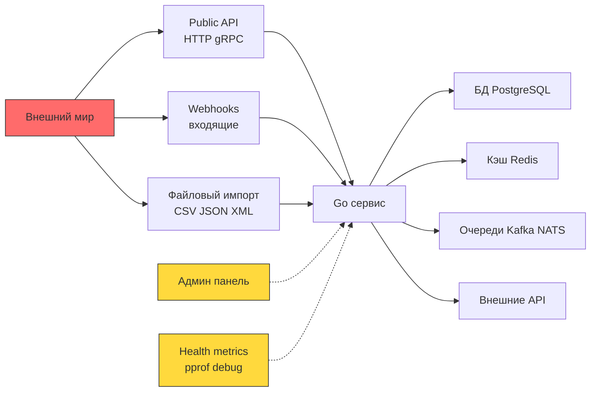
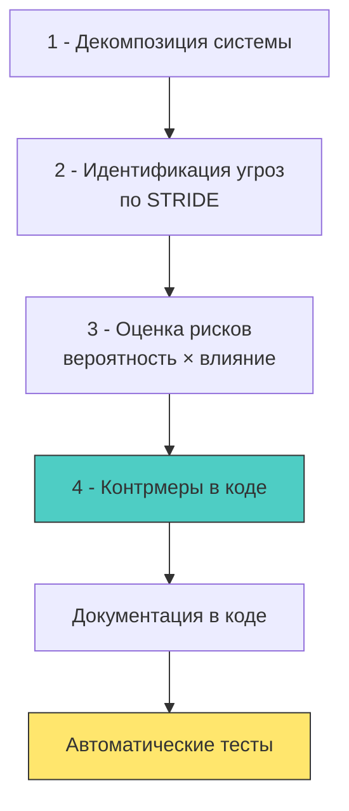
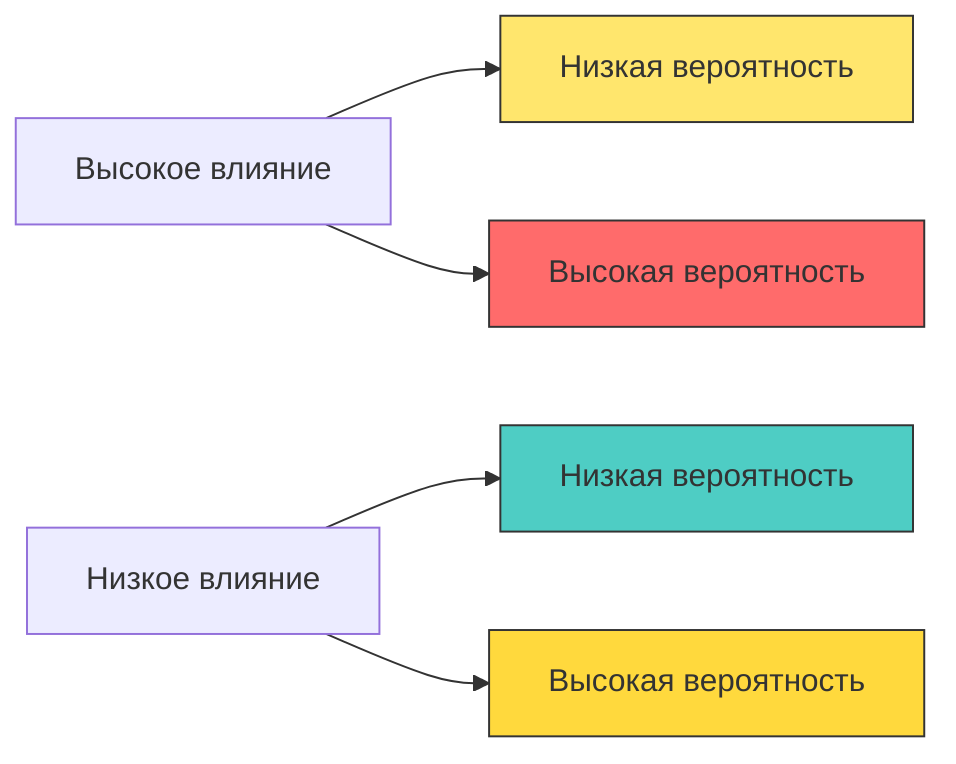

## От абстрактных угроз к конкретным уязвимостям

> *"The first rule of security: Don't guess what the attacker wants to do. Calculate what the system allows them to do."*  
> — Брайан Керниган

В предыдущей статье [[1. Обзор раздела. Безопасность как часть архитектуры]] мы сформулировали фундаментальный постулат: безопасность — это неотъемлемый архитектурный примитив системы, закладываемый до первой строчки кода, а не косметический плагин перед релизом.

Но как преодолеть пропасть между абстрактной философской установкой «наш бэкенд должен быть безопасным» и конкретными инженерными решениями в коде на Go? Как программисту понять, где именно в сотнях микросервисов, gRPC-ручек и горутин кроется брешь?

Ответ инженерной школы Bell Labs и современной индустрии безопасности прост: **Threat Modeling** (систематическое моделирование угроз) и анализ **Attack Surface** (поверхности атаки).

Это два парных метрологических процесса. Поверхность атаки очерчивает границы и все физические двери, через которые чужак может постучаться в систему. Моделирование угроз анализирует каждого гостя и сценарии, при которых он попытается взломать замок, поджечь дверь или выдать себя за хозяина дома. В результате туманная тревога «нас могут взломать» превращается в строгий инженерный реестр: *«У нас есть ровно 7 векторов атак, вот математика их риска, а вот конкретные контрмеры в коде хэндлеров и тестах»*.

> [!info] Под капотом
> **Почему это особенно критично для бэкенда на Go?**
> 
> Go-сервисы редко живут изолированно. Как правило, это высоконагруженные сетевые узлы с десятками каналов ввода-вывода: публичные REST API, бинарные gRPC-потоки, подписчики брокеров сообщений Kafka/RabbitMQ, периодические cron-воркеры и внутренние сервисные порты метрик. Каждый сокет — это потенциальный плацдарм для вторжения.
> 
> Кроме того, уникальная модель конкурентности Go (планировщик G-M-P, неблокирующий I/O, разделяемая память) открывает специфические классы уязвимостей:
> 1. **Гонки состояний при проверке прав (TOCTOU — Time-of-Check to Time-of-Use):** когда между проверкой прав горутиной $A$ и исполнением действия горутина $B$ успевает изменить состояние объекта в памяти.
> 2. **Утечки контекста авторизации (`context.Context`):** случайная передача родительского контекста запроса с токенами во второстепенную фоновую горутину, переживающую исходный HTTP-запрос.
> 3. **Асимметричный отказ в обслуживании (Resource Exhaustion DoS):** создание миллиона «висящих» горутин одним злонамеренным медленным запросом (Slowloris), блокирующим память и дескрипторы сокетов.

---

## Что такое Attack Surface (поверхность атаки)

**Attack Surface (поверхность атаки)** — это совокупность абсолютно всех точек входа, сетевых интерфейсов, протоколов, форматов данных и зависимостей, через которые неавторизованный субъект может передать байты в ваш процесс, прочитать внутреннее состояние или спровоцировать непредусмотренное поведение рантайма.

Любой байт, пересекающий границу процесса извне, по определению считается враждебным.

В типичном бэкенд-сервисе на Go поверхность атаки охватывает несколько ключевых рубежей:



Главное правило минимизации поверхности атаки сформулировал еще Кен Томпсон: **«Чего в коде нет — того нельзя сломать»**. Каждый неиспользуемый открытый порт, забытый debug-хэндлер или избыточный эндпоинт админки расширяет фронт обороны и увеличивает шансы атакующего на победу.

---

### Классификация точек входа в Go-сервисе

Каждый интерфейс ввода данных несет свой характерный профиль угроз:

| Тип точки входа | Пример реализации в коде Go | Доминирующий риск безопасности |
|---|---|---|
| **HTTP-хендлер** | `http.HandleFunc("/api/users", handler)` | Инъекции (SQLi/XSS), обход аутентификации, DoS тела запроса |
| **gRPC-метод** | `func (s *srv) GetUser(ctx, req) (*Resp, error)` | Те же риски, плюс атаки на десериализацию Protobuf, переполнение буферов |
| **Консьюмер очереди** | `ch, _ := amqp.Consume(...)` | Недоверенная полезная нагрузка, Replay-атаки, подделка служебных заголовков |
| **CLI-аргументы / env** | `os.Args`, `os.Getenv("DB_PASSWORD")` | Command Injection, чтение секретов через утечку дампов окружения (`/proc`) |
| **Файловая система** | `os.ReadFile(configPath)` | Path Traversal (`../../etc/passwd`), атаки через символические ссылки (Symlink race) |
| **Сетевые сокеты** | `net.Dial`, `net.Listen` | SSRF (подделка межсерверных запросов), сканирование внутренних сетей, MITM |
| **Debug-эндпоинты** | `net/http/pprof`, `expvar` | Раскрытие памяти кучи, дампы горутин с паролями, удаленный DoS профилированием |

---

> [!warning] Ловушка / Gotcha: Публичный доступ к эндпоинтам `net/http/pprof`
> Пакет `net/http/pprof` при подключении через `import _ "net/http/pprof"` автоматически регистрирует свои обработчики в глобальном мультиплексоре `http.DefaultServeMux`.  
> Если разработчик по неопытности запускает основной публичный сервер через `http.ListenAndServe(":8080", nil)`, отладочные ручки `/debug/pprof/*` мгновенно становятся доступны всему интернету!
> 
> ```go
> // ❌ СМЕРТЕЛЬНО ОПАСНО: pprof доступен публично любому пользователю!
> func main() {
>     // nil означает использование http.DefaultServeMux
>     // Атакующий может скачать /debug/pprof/heap и найти пароли и токены в куче!
>     log.Fatal(http.ListenAndServe("0.0.0.0:8080", nil))
> }
> ```
> 
> **Надежное архитектурное решение:**  
> Разделяйте бизнес-трафик и системную телеметрию. Отладочный сервер должен жить на отдельном порту, слушать только локальную петлю `127.0.0.1` (или закрытую management-сеть Kubernetes) и быть защищен строгой аутентификацией с защитой от атак по времени через `crypto/subtle.ConstantTimeCompare`:
> 
> ```go
> // ✅ БЕЗОПАСНО: выделенный изолированный сервер управления
> func setupDebugServer() {
>     mux := http.NewServeMux()
>     mux.Handle("/debug/pprof/", 
>         httpBasicAuth(pprof.Index(), "admin", getDebugPassword()))
>     
>     srv := &http.Server{
>         Addr:         "127.0.0.1:6060", // 🔒 Слушаем строго localhost
>         Handler:      mux,
>         ReadTimeout:  5 * time.Second,
>         WriteTimeout: 30 * time.Second,
>     }
>     go srv.ListenAndServe()
> }
> 
> func httpBasicAuth(handler http.Handler, user, pass string) http.Handler {
>     return http.HandlerFunc(func(w http.ResponseWriter, r *http.Request) {
>         u, p, ok := r.BasicAuth()
>         // 🔒 ConstantTimeCompare защищает от атак по времени (Timing Attacks)
>         if !ok || subtle.ConstantTimeCompare([]byte(u), []byte(user)) != 1 ||
>             subtle.ConstantTimeCompare([]byte(p), []byte(pass)) != 1 {
>             w.Header().Set("WWW-Authenticate", `Basic realm="Restricted"`)
>             w.WriteHeader(http.StatusUnauthorized)
>             return
>         }
>         handler.ServeHTTP(w, r)
>     })
> }
> ```

---

## Что такое Threat Modeling (моделирование угроз)

**Threat Modeling (моделирование угроз)** — это структурированная инженерная процедура, направленная на выявление, классификацию и оценку рисков безопасности до того, как система будет введена в эксплуатацию.

Общепризнанным золотым стандартом моделирования угроз для прикладных сервисов является методология **STRIDE**, разработанная в Microsoft:

| Буква | Категория угрозы | Физический смысл | Контрольный вопрос для Go-бэкенда | Пример защитной контрмеры |
|:---:|---|---|---|---|
| **S** | **Spoofing** (Подмена субъекта) | Выдача себя за другого пользователя или сервис | «Может ли атакующий подделать JWT-токен, claim или идентификатор сессии?» | Криптографическая подпись Ed25519/HMAC, проверка срока жизни (`exp`) и подписи на каждый чих |
| **T** | **Tampering** (Фальсификация данных) | Несанкционированная модификация данных на лету или в БД | «Может ли пользователь изменить SQL-запрос или внедрить разметку через форму ввода?» | Параметризованные запросы в `database/sql`, строгая типизированная валидация схем |
| **R** | **Repudiation** (Отказ от авторства) | Невозможность доказать, кто именно совершил транзакцию | «Сможет ли оператор заявить: "я не переводил эти деньги", если баланс обнулился?» | Неизменяемые журналы аудита (Audit Trail), криптографическая подпись событий транзакций |
| **I** | **Information Disclosure** (Утечка информации) | Раскрытие конфиденциальных данных лицам без допуска | «Что выведет хэндлер при панике? Не попадут ли токены в логи или текст 500 ошибки?» | Структурированное логирование `slog`, маскирование PII, унифицированные непрозрачные ошибки |
| **D** | **Denial of Service** (Отказ в обслуживании) | Исчерпание ресурсов (CPU, RAM, сокеты, треды) легитимных клиентов | «Может ли злоумышленник отправить 10 запросов и сожрать всю память кучи Go?» | `http.MaxBytesReader`, Rate Limiting, жесткие таймауты `ReadTimeout` / `WriteTimeout` |
| **E** | **Elevation of Privilege** (Повышение привилегий) | Получение неавторизованных прав доступа (роли админа) | «Может ли обычный покупатель вызвать gRPC-метод одобрения кредита?» | Авторизация на уровне доменных сущностей (RBAC/ABAC), отсечение прав в middleware |

---

### Практический процесс: 4 шага для Go-разработчика

Моделирование угроз не требует привлечения дорогостоящих внешних консультантов для каждого микросервиса. Разработчик может провести качественный экспресс-анализ за 4 последовательных шага:



---

#### Шаг 1: Декомпозиция

Разбейте целевой микросервис на компоненты и явно зафиксируйте **границы доверия (Trust Boundaries)**. Внутренние хранилища и проверенные компоненты считаются доверенными, внешняя сеть и клиенты — абсолютно недоверенными.

```go
// Пример: архитектура сервиса пользователей с явным разделением зон ответственности
type UserService struct {
    // 🔒 Доверенные внутренние зависимости (Internal Trust Zone)
    db     *sql.DB        // PostgreSQL-соединение с правами наименьших привилегий
    cache  *redis.Client  // Изолированный Redis-кэш
    logger *slog.Logger   // Структурированный логгер с фильтрацией PII
    
    // ⚠️ Внешние зависимости (External Boundaries)
    httpClient *http.Client  // Сетевой клиент с жесткими таймаутами и проверкой TLS
    authClient *AuthClient   // gRPC-клиент сервиса единой авторизации (IdP)
    
    // 🎯 Граница доверия: публичный сетевой периметр
    router *http.ServeMux  // Маршрутизатор с цепочкой валидационных middleware
}

// Контракт хендлера: пошаговая верификация безопасности
func (s *UserService) GetUserHandler(w http.ResponseWriter, r *http.Request) {
    // 1. Извлечение и валидация контекста безопасности
    ctx := r.Context()
    auth, err := auth.FromContext(ctx)
    if err != nil {
        // 🔒 Fail secure: немедленный отказ без утечки деталей наружу
        s.logger.ErrorContext(ctx, "auth extraction failed", "err", err)
        http.Error(w, http.StatusText(http.StatusUnauthorized), http.StatusUnauthorized)
        return
    }
    
    // 2. Проверка прав ДО обращения к ресурсам базы данных
    userID := chi.URLParam(r, "id")
    if !s.authz.CanReadUser(auth.Subject, userID) {
        // 🔒 Запрет доступа при несовпадении полномочий
        http.Error(w, http.StatusText(http.StatusForbidden), http.StatusForbidden)
        return
    }
    
    // 3. Безопасное исполнение бизнес-логики через параметризованный запрос
    user, err := s.db.QueryRowContext(ctx, "SELECT id, email FROM users WHERE id = $1", userID)
    // ... дальнейшая сериализация ответа
}
```

---

#### Шаг 2: Идентификация угроз по STRIDE

Каждый компонент декомпозиции подвергается перекрестному допросу по всем 6 пунктам матрицы STRIDE:

| Компонент / Операция | S (Spoofing) | T (Tampering) | R (Repudiation) | I (Information Disclosure) | D (Denial of Service) | E (Elevation of Privilege) |
|---|---|---|---|---|---|---|
| **`auth.FromContext`** | Может ли атакующий внедрить фиктивный токен? | Может ли контекст быть модифицирован другой горутиной? | Логируются ли факты успешного и отклоненного входа? | Не попадет ли секретный токен в системный лог при сбое? | Можно ли положить сервис шквалом невалидных JWT-токенов? | Может ли пользователь выдать свой контекст за чужой? |
| **`db.QueryRowContext`** | Может ли злоумышленник подключиться к СУБД в обход сервиса? | Возможна ли SQL-инъекция через параметр `userID`? | Фиксируются ли критические модификации в таблице аудита? | Не утечет ли структура таблиц и пароли при панике БД? | Можно ли исчерпать пул соединений `max_connections`? | Может ли непривилегированный сервис вызвать `DROP TABLE`? |

---

#### Шаг 3: Оценка рисков

Для приоритизации задач безопасности используется классическая инженерная матрица: **Риск = Вероятность × Влияние**:



1. 🔴 **Высокая вероятность + Высокое влияние (P0 — Блокер):** SQL-инъекции, отсутствие проверки авторизации в публичных ручках, хардкод приватных ключей. Исправляются немедленно.
2. 🟡 **Низкая вероятность + Высокое влияние (P1 — Критично):** Компрометация корневого сертификата CA, физический захват сервера БД. Требуют архитектурных мер и регламентов Disaster Recovery.
3. 🟡 **Высокая вероятность + Низкое влияние (P2 — Умеренно):** Спам-запросы в форму обратной связи. Закрываются внедрением Rate Limiting и капчи.
4. 🟢 **Низкая вероятность + Низкое влияние (P3 — Низкий):** Сканирование несуществующих URL-путей. Достаточно фонового мониторинга.

---

#### Шаг 4: Контрмеры в коде

На четвертом этапе абстрактные требования матрицы STRIDE материализуются в защитный программный код:

```go
// Пример комплексной эшелонированной защиты бизнес-операции смены email
func (s *UserService) UpdateEmail(ctx context.Context, userID, newEmail string) error {
    // 🔒 D (Denial of Service): Защита от исчерпания ресурсов через Rate Limiting
    if !s.rateLimiter.Allow(userID, "update_email") {
        return ErrRateLimitExceeded
    }
    
    // 🔒 T (Tampering): Валидация входных данных по белому списку (Allowlist)
    if !isValidEmail(newEmail) {
        return ErrInvalidEmail // 🔒 I: непрозрачная ошибка без раскрытия регулярного выражения
    }
    
    // 🔒 E (Elevation of Privilege): Проверка субъекта авторизации
    auth, ok := auth.FromContext(ctx)
    if !ok || auth.Subject != userID {
        return ErrForbidden
    }
    
    // 🔒 R (Repudiation): Неизгладимый след в журнале аудита
    s.auditLog(ctx, "email_changed", userID, map[string]any{
        "old": s.getCurrentUserEmail(userID),
        "new": maskEmail(newEmail), // 🔒 I: маскирование чувствительных данных
    })
    
    // 🔒 T (Tampering): Параметризованный SQL-запрос, исключающий инъекции
    _, err := s.db.ExecContext(ctx, 
        "UPDATE users SET email = $1 WHERE id = $2", 
        newEmail, userID)
    
    // 🔒 I (Information Disclosure): Санитаризация системных ошибок СУБД
    if err != nil {
        s.logger.ErrorContext(ctx, "db update failed", "err", sanitizeDBError(err))
        return ErrInternal // Клиент получает стандартную ошибку 500 без деталей SQL
    }
    
    return nil
}
```

---

## Уникальные аспекты Go: конкурентность и безопасность

Высокая производительность Go и его модель конкурентности таят в себе скрытые архитектурные ловушки, которые атакующий может использовать против вас.

### Race Condition как уязвимость (TOCTOU)

Атака класса **Time-of-Check to Time-of-Use (TOCTOU)** возникает в ситуации, когда проверка права доступа и само защищаемое действие разнесены во времени и не являются атомарными.

В многопоточной среде с миллионами горутин это создает «окно уязвимости» (Race Window):

```go
// ❌ УЯЗВИМЫЙ КОД: проверка и чтение не атомарны!
func (s *FileService) ReadFile(ctx context.Context, path string) ([]byte, error) {
    // Шаг 1: Проверка прав доступа
    if !s.acl.CanRead(auth.FromContext(ctx), path) {
        return nil, ErrForbidden
    }
    
    // 🔴 ОКНО УЯЗВИМОСТИ (Race Window):
    // В этот микросекундный зазор другая горутина или внешний процесс
    // может подменить легитимный файл на символическую ссылку (symlink attack)
    // на /etc/shadow!
    return os.ReadFile(path) // 🔴 Path traversal и privilege escalation
}

// ✅ БЕЗОПАСНЫЙ ПОДХОД: канонизация пути и атомарная изоляция
func (s *FileService) ReadFile(ctx context.Context, path string) ([]byte, error) {
    // 1. Строгая нормализация пути (исключение ../)
    cleanPath, err := filepath.Abs(filepath.Join(s.rootDir, path))
    if err != nil || !strings.HasPrefix(cleanPath, s.rootDir) {
        return nil, ErrInvalidPath
    }
    
    // 2. Атомарное выполнение проверки и чтения в защищенной критической секции
    var data []byte
    err = s.fileMutex.Do(cleanPath, func() error {
        if !s.acl.CanRead(auth.FromContext(ctx), cleanPath) {
            return ErrForbidden
        }
        var readErr error
        data, readErr = os.ReadFile(cleanPath)
        return readErr
    })
    
    return data, err
}
```

> [!tip] Собеседование
> **Вопрос:** Как состояние гонки (Race Condition) в Go может трансформироваться из обычного функционального бага в критическую уязвимость безопасности?  
> **Ответ кандидата Senior-уровня:**  
> «1. **TOCTOU (Time-of-Check to Time-of-Use):** Если между проверкой баланса пользователя и списанием средств проходит время, злоумышленник может отправить сотни конкурентных запросов одновременно. Из-за отсутствия атомарности все горутины увидят положительный баланс и спишут деньги многократно (Double Spending).  
> 2. **Несинхронизированные флаги авторизации:** Если булев флаг `isAuthenticated` читается и пишется из разных горутин без атомиков (`sync/atomic`) или мьютекса, из-за переупорядочивания инструкций процессором и отсутствия барьеров памяти горутина может прочесть устаревшее значение или мусор из соседней кэш-линии.  
> 3. **Решение:** Использование транзакций БД с уровнем `SERIALIZABLE` или `SELECT FOR UPDATE`, атомарные примитивы Go, либо явные блокировки (`sync.Mutex`, `singleflight.Group`) для критических секций. Инструменты `go run -race` и `go test -race` помогают найти гонки, но не все гонки являются уязвимостями — здесь всегда требуется глубокий контекстный анализ».

---

### Утечка контекста между горутинами

В Go `context.Context` традиционно используется для передачи дедлайнов, сигналов отмены и метаданных безопасности. Однако бездумный запуск фоновых воркеров с родительским контекстом может привести к серьезной бреши:

```go
// ❌ ОПАСНО: передача контекста с токенами в долгоживущую фоновую горутину
func (s *Handler) Process(w http.ResponseWriter, r *http.Request) {
    ctx := r.Context()
    auth := auth.FromContext(ctx) // 🔒 Содержит Bearer-токен, роли, скоупы
    
    // 🔴 Фоновая горутина переживет HTTP-запрос.
    // Если контекст отменится клиентом, фоновая задача внезапно оборвется,
    // либо токен пользователя будет использован для служебных операций спустя часы!
    go func() {
        s.backgroundJob(ctx, auth)
    }()
}

// ✅ БЕЗОПАСНО: явная изоляция и принцип наименьших привилегий
func (s *Handler) Process(w http.ResponseWriter, r *http.Request) {
    ctx := r.Context()
    auth := auth.FromContext(ctx)
    
    // Извлекаем только атомарный идентификатор, отсекая токены и секреты
    userID := auth.Subject
    
    go func() {
        // Создаем независимый корневой контекст для системной фоновой задачи
        bgCtx := context.WithValue(context.Background(), userIDKey, userID)
        s.backgroundJob(bgCtx, userID) // 🔒 Работает под системными сервисными правами
    }()
}
```

---

## Инструменты для автоматизации threat modeling в Go

Инженерная культура исключает надежду на человеческую непогрешимость. Аудит должен быть автоматизирован и встроен в пайплайны непрерывной интеграции (CI/CD).

### Статический анализ с `gosec`

Утилита `gosec` инспектирует абстрактное синтаксическое дерево (AST) Go-кода на предмет наличия типовых уязвимостей и антипаттернов:

```bash
# Установка линтера безопасности
go install github.com/securego/gosec/v2/cmd/gosec@latest

# Запуск сканирования с выводом отчета в формате SARIF
gosec -exclude=G104,G115 -fmt=sarif -out=security-report.sarif ./...
```

Ключевые правила `gosec`, которые обязан знать каждый разработчик:

| Идентификатор правила | Категория риска | Патология в коде, вызывающая срабатывание |
|---|---|---|
| **G101** | Хардкод учетных данных | Присваивание строковых литералов: `password := "admin123"` |
| **G104** | Игнорирование ошибок | Игнорирование результата системных функций: `_ = file.Close()` |
| **G109** | Целочисленное переполнение | Небезопасное приведение типов: `int32(a) + int32(b)` без проверки границ |
| **G201 / G202** | SQL-инъекция | Конкатенация строк в запросах: `db.Query("SELECT * FROM users WHERE id = " + id)` |
| **G306** | Избыточные права на файлы | Создание общедоступных файлов: `os.WriteFile(path, data, 0644)` вместо `0600` |

---

### Интеграция в CI/CD

Автоматическая блокировка уязвимых пуллреквестов на этапе GitHub Actions:

```yaml
# .github/workflows/security.yml
name: Security Scan
on: [push, pull_request]

jobs:
  gosec:
    name: Run Gosec AST Scanner
    runs-on: ubuntu-latest
    steps:
      - name: Checkout Source Code
        uses: actions/checkout@v4

      - name: Run Gosec Security Scanner
        uses: securego/gosec@master
        with:
          args: '-exclude=G104 -fmt=sarif -out=results.sarif ./...'

      - name: Publish Security Alerts to GitHub Security Tab
        uses: github/codeql-action/upload-sarif@v3
        with:
          sarif_file: results.sarif
```

---

### Документирование угроз в коде

Модель угроз не должна пылиться на закрытых корпоративных порталах. Фиксируйте архитектурные решения непосредственно в исходном коде:

```go
// Security: Threat Model Reference
// - STRIDE: [T]ampering via SQL injection -> mitigated by parameterized queries ($1)
// - STRIDE: [I]nformation disclosure via error messages -> sanitized generic errors
// - STRIDE: [D]enial of service via body size -> limited by http.MaxBytesReader(1MB)
// - Last reviewed: 2024-03-20 by @security-guild
func (s *UserService) GetUser(ctx context.Context, id string) (*User, error) {
    // ... реализация ...
}
```

---

## Чек-лист для код-ревью с фокусом на безопасность

Каждый пуллреквест в продакшен обязан проходить валидацию по внутреннему чек-листу безопасности:

```markdown
## Security Code Review Checklist
- [ ] Все пользовательские входные данные валидируются по белому списку (Allowlist, не Blocklist).
- [ ] Ошибки, возвращаемые наружу, не раскрывают внутренние структуры данных, стектрейсы или запросы БД.
- [ ] Конфиденциальные данные (пароли, ключи, токены) не пишутся в логи в открытом виде (маскируются).
- [ ] Контекст авторизации и права доступа проверяются перед каждой операцией с ресурсом.
- [ ] В коде полностью отсутствует захардкоженный секретный контент (ключи, пароли, токены).
- [ ] Для сравнения хэшей, токенов и паролей используется постоянное время `crypto/subtle.ConstantTimeCompare`.
- [ ] Настроены строгие сетевые таймауты (`context.WithTimeout`, HTTP Client Timeouts) для всех внешних вызовов.
- [ ] Для всех публичных эндпоинтов настроен Rate Limiting и ограничение размера входящего тела запроса.
- [ ] Сторонние зависимости проверены утилитами `govulncheck` и `osv-scanner`.
- [ ] Сервисные debug-эндпоинты (`/debug/pprof`) отключены на публичных портах или вынесены на localhost.
```

---

> [!tip] Собеседование
> **Вопрос:** «Вам поручили спроектировать новый критически важный платежный микросервис на Go с нуля. Опишите ваш системный подход к моделированию угроз (Threat Modeling).»  
> **Ответ кандидата уровня Lead / Principal:**  
> «Мой подход состоит из семи взаимосвязанных шагов:  
> 1. **Декомпозиция:** Отрисовываю диаграмму потоков данных (DFD), выделяю границы доверия (Trust Boundaries) между внешней сетью, API Gateway, бэкендом и базой данных.  
> 2. **Анализ Attack Surface:** Инвентаризирую все входящие точки (HTTP/gRPC endpoints, вебхуки платежных шлюзов, очереди Kafka, переменные среды).  
> 3. **Идентификация угроз по STRIDE:** Для каждого потока и хранилища прогоняю вопросы STRIDE (подделка токена, модификация суммы платежа, отказ от транзакции, утечка номеров карт, DoS перегрузка, неавторизованный доступ).  
> 4. **Матрица рисков:** Ранжирую угрозы по формуле "Вероятность × Ущерб" и формирую приоритетный бэклог защиты.  
> 5. **Архитектурные контрмеры в коде:** Внедряю идемпотентность, параметризованные запросы, шифрование данных в покое (AES-GCM), маскирование PII в логах, взаимный TLS (mTLS) между микросервисами.  
> 6. **Автоматизация и верификация:** Включаю `gosec`, `govulncheck` и детектор гонок `go test -race` в CI/CD; пишу негативные тесты на фаззинг и краевые условия.  
> 7. **Документирование:** Фиксирую архитектурные решения безопасности в виде ADR (Architecture Decision Records)».

---

## Итог

* **Поверхность атаки (Attack Surface)** — это полный периметр открытых дверей сервиса. Минимизация поверхности атаки (закрытие лишних портов, отключение публичного `pprof`, изоляция внутренних интерфейсов) — первый закон обороны.
* **Моделирование угроз (Threat Modeling по STRIDE)** переводит безопасность из категории мистических страхов в категорию измеримых инженерных задач: Spoofing, Tampering, Repudiation, Information Disclosure, Denial of Service, Elevation of Privilege.
* **Специфика Go:** Высокая конкурентность требует защиты от гонок состояний (TOCTOU), контроля за утечками контекстов авторизации между горутинами и предотвращения атак исчерпания ресурсов (DoS).
* **Автоматизация:** Интеграция статических анализаторов (`gosec`, `govulncheck`) в пайплайны CI/CD и внедрение чек-листов безопасности на код-ревью гарантируют соблюдение стандартов в масштабе всей команды.

Теперь, когда мы научились видеть архитектуру глазами атакующего и выявлять слабые места периметра, настало время препарировать главные угрозы современного веба.

В следующей статье мы разберем канонический список критических уязвимостей в преломлении к языку Go: [[3. OWASP Top 10 для backend разработчика]].