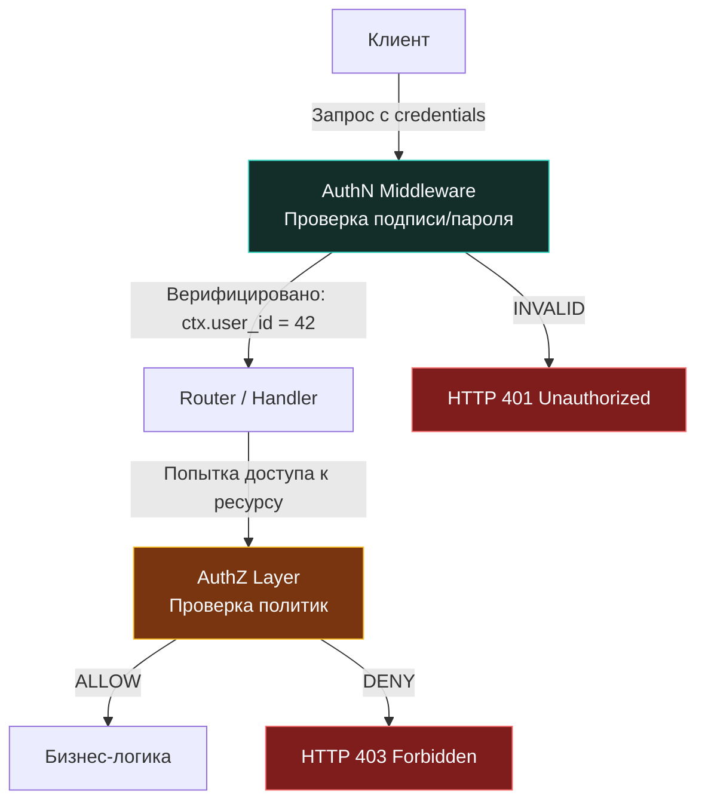

## Разделение ответственности: кто ты и что тебе можно

> *«Цель абстракции — не в том, чтобы порождать неясность, а в том, чтобы создать новый семантический уровень, на котором возможна абсолютная точность».*    
> — Эдсгер Дейкстра

В промышленной разработке распределенных систем размытие понятийных границ между **аутентификацией** (Authentication, AuthN) и **авторизацией** (Authorization, AuthZ) — одна из самых частых, разрушительных и трудноисправимых архитектурных ошибок. Начинающие разработчики нередко воспринимают их как единую сущность «проверка пользователя» и сваливают валидацию токенов и проверку прав в один монструозный middleware.

Однако для инженера с системным мышлением это не терминологический педантизм, а фундаментальное разделение жизненного цикла запроса, точек отказа, механизмов кэширования и модели угроз:

* **Аутентификация (AuthN)** отвечает на вопрос: *«Кто вы?»*. Это процесс верификации заявленной субъектом идентичности на основе криптографических доказательств (пароль, цифровая подпись, закрытый ключ, JWT, mTLS-сертификат). Результатом успешной аутентификации является однозначное утверждение подлинности субъекта (Principal / Subject ID, например: `subject_id = "user-123"` или `user_id = 42`).
* **Авторизация (AuthZ)** отвечает на вопрос: *«Имеете ли вы право совершить это конкретное действие над этим конкретным ресурсом?»*. Это процесс принятия решения о доступе на основе атрибутов субъекта, параметров целевого объекта, текущего времени и политик безопасности (RBAC, ABAC, ReBAC). Результат авторизации строго бинарен: `ALLOW` (разрешено) или `DENY` (запрещено).

Простая бытовая аналогия: когда вы проходите паспортный контроль в аэропорту, пограничник сличает вашу фотографию с лицом и проверяет подлинность паспорта — это **аутентификация**. Но когда таможенник проверяет, есть ли у вас действующая рабочая виза и имеете ли вы право ввезти ящик редких медикаментов — это **авторизация**. Наличие настоящего паспорта не дает права заходить в кабину пилота.

Смешивание этих этапов в коде порождает катастрофические последствия:
1. **Невозможность переиспользования:** Бизнес-логика привязывается к конкретному протоколу входа (нельзя поддержать вход по API-ключам для внешних клиентов без переписывания правил прав).
2. **Крах кэширования:** Токены сессий обновляются каждые 15 минут, тогда как роли и матрица прав пользователя могут не меняться месяцами.
3. **Нарушение принципа наименьших привилегий:** Ошибка в логике одного хэндлера приводит к неконтролируемой эскалации привилегий во всей системе.



---

## Аутентификация: Доказательство идентичности и цена валидации

Аутентификация всегда предшествует любой бизнес-логике. В экосистеме Go она реализуется на самом раннем рубеже: в виде первого `Middleware` в цепочке `http.Handler` или в качестве `grpc.UnaryServerInterceptor`.

> [!info] Под капотом: Влияние на кэш и аллокации
> **Анатомия `context.Context` и нагрузка на память**  
> Стандартный `context.Context` в стандартной библиотеке Go реализован как неизменяемый односвязный список структур (`valueCtx`). Каждый отдельный вызов `context.WithValue(parent, key, val)` создает новый узел списка и гарантированно аллоцирует новую структуру в куче (heap).  
> 
> В высоконагруженном микросервисе при нагрузке 10 000 RPS добавление трех раздельных ключей в контекст (`user_id`, `roles`, `auth_method`) генерирует **30 000 лишних аллокаций в секунду**! Это раздувает кучу, заставляет сборщик мусора чаще включать фазы разметки (`GC`), вымывает строки аппаратного кэша процессора L1/L2 из-за хаотичного разброса указателей по страницам виртуальной памяти и ухудшает latency.
> 
> **Инженерная оптимизация:** Агрегируйте все атрибуты аутентификации в единую компактную структуру и помещайте ее в контекст строго **одним вызовом**. Это сокращает число аллокаций ровно в три раза и гарантирует последовательную раскладку полей в непрерывной памяти.

```go
// ✅ Идиоматичная агрегированная структура аутентификации
type AuthClaims struct {
    UserID    string
    Roles     []string
    ExpiredAt time.Time
}

// Приватный тип ключа предотвращает коллизии в пакетах
type ctxKey struct{}

// WithAuthClaims упаковывает метаданные за одну аллокацию
func WithAuthClaims(ctx context.Context, claims *AuthClaims) context.Context {
    return context.WithValue(ctx, ctxKey{}, claims)
}

// AuthClaimsFromContext извлекает утверждения с проверкой типа
func AuthClaimsFromContext(ctx context.Context) (*AuthClaims, bool) {
    claims, ok := ctx.Value(ctxKey{}).(*AuthClaims)
    return claims, ok
}
```

---

## Авторизация: Принятие решений на основе политик

В отличие от аутентификации, авторизация не может быть полностью решена «вслепую» на входе в роутер. Чтобы принять решение, серверу необходимо знать: *к какому именно ресурсу* обращается пользователь (например, ID документа в URL), *какое действие* он хочет совершить (чтение, удаление, экспорт) и *каковы параметры тела запроса* (например, сумма денежного перевода).

```go
// ❌ АНТИПАТТЕРН: грязное смешивание AuthN и AuthZ в одном глобальном middleware
func AuthMiddleware(next http.Handler) http.Handler {
    return http.HandlerFunc(func(w http.ResponseWriter, r *http.Request) {
        token := extractToken(r)
        if !isValidToken(token) {
            http.Error(w, "Unauthorized", http.StatusUnauthorized)
            return
        }
        
        // 🔴 ОШИБКА АРХИТЕКТУРЫ: жесткая привязка к конкретной роли
        // Этот middleware нельзя переиспользовать для обычных пользователей!
        userID := parseUserID(token)
        if !isAdmin(userID) {
            http.Error(w, "Forbidden", http.StatusForbidden)
            return
        }
        
        next.ServeHTTP(w, r)
    })
}
```

Идиоматичный подход в Go разделяет эти зоны ответственности: аутентификационный middleware лишь устанавливает личность, а авторизация делегируется специализированному слою доменных политик:

```go
// ✅ ЭТАП 1: Аутентификация (AuthN) — только верификация личности
func AuthNMiddleware(next http.Handler) http.Handler {
    return http.HandlerFunc(func(w http.ResponseWriter, r *http.Request) {
        token := strings.TrimPrefix(r.Header.Get("Authorization"), "Bearer ")
        
        claims, err := jwt.ParseAndValidate(token, signingKey)
        if err != nil {
            // 🔒 Безопасный отказ: не раскрываем детали ошибки клиенту
            logAuthError(r.Context(), err)
            http.Error(w, "unauthorized", http.StatusUnauthorized)
            return
        }
        
        ctx := WithAuthClaims(r.Context(), claims)
        next.ServeHTTP(w, r.WithContext(ctx))
    })
}

// ✅ ЭТАП 2: Авторизация (AuthZ) — проверка полномочий в контексте ресурса
func (h *Handler) DeleteResource(w http.ResponseWriter, r *http.Request) {
    ctx := r.Context()
    claims, ok := AuthClaimsFromContext(ctx)
    if !ok {
        http.Error(w, "unauthorized", http.StatusUnauthorized)
        return
    }
    
    resID := chi.URLParam(r, "id")
    
    // 🔒 Явная проверка авторизации с полным контекстом домена
    if err := h.authz.Check(ctx, claims.UserID, "resource:delete", resID); err != nil {
        http.Error(w, "forbidden", http.StatusForbidden)
        return
    }
    
    // 3. Выполнение операции только после одобрения политикой
    if err := h.repo.Delete(ctx, resID); err != nil {
        http.Error(w, "internal error", http.StatusInternalServerError)
        return
    }
}
```

---

## Механика ошибок: 401 против 403 и влияние на клиента

Разделение кодов состояния HTTP `401` и `403` — это не академическая прихоть, а строгий протокольный контракт с сетевой инфраструктурой:

| HTTP-код ответа | Семантический смысл | Когда возвращать в Go | Поведение инфраструктуры и клиентов |
|---|---|---|---|
| **`401 Unauthorized`** | Личность не установлена (Authentication Failure) | Токен отсутствует, поврежден, просрочен, подпись не сошлась, пароль неверен | Шлюз API Gateway / WAF может автоматически перенаправить браузер на страницу входа (SSO / OAuth 2.0). Клиент должен обновить токен через Refresh Token и повторить запрос |
| **`403 Forbidden`** | Личность установлена, но прав нет (Authorization Failure) | Токен валиден, `user_id` подтвержден, но `authz.Check()` вернул `false` (или ошибку доступа) | Инфраструктура регистрирует инцидент нарушения доступа (`authz_denials` в Prometheus). Повторять запрос с теми же учетными данными бесполезно |

В метриках Prometheus счетчики `authn_errors` и `authz_denials` должны вестись строго раздельно: всплеск `401` означает проблему с ротацией ключей или окончанием жизни сессий, а всплеск `403` — целенаправленную атаку на перебор IDOR или эскалацию привилегий.

---

> [!warning] Ловушка / Gotcha: Утечка информации через тайминги ошибок (Timing Attacks)
> Если ваш middleware тратит 60 миллисекунд на криптографическую проверку хэша (`bcrypt` или `rsa.VerifyPKCS1v15`) и всего 0.1 миллисекунды на проверку формата строки, злоумышленник получает высокоточный инструмент зондирования. Измеряя наносекундную разницу во времени ответа сервера, он может безошибочно определять, какие токены синтаксически корректны, а какие имеют валидную цифровую подпись.  
> 
> **Решение:** Для всех низкоуровневых операций проверки секретов всегда применяйте функцию `crypto/subtle.ConstantTimeCompare`, которая выполняет сравнение за константное число тактов CPU независимо от того, в каком байте встретилось первое несовпадение.

---

## Производительность: Ветвление, кэш и планировщик горутин

В высоконагруженных микросервисах логика авторизации способна стать скрытым тормозом всей системы:

1. **Непредсказуемость ветвлений (Branch Misprediction):** Если проверки прав хаотично размазаны глубоко внутри бизнес-логики (`if !user.CanDoX() { return }`), аппаратный предсказатель ветвлений процессора сбивается при частой смене ролей. Сброс суперскалярного конвейера CPU увеличивает затраты `CPU cycles` на каждый запрос на 15–20%.
2. **Накладные расходы системных вызовов (Syscall Overhead):** Если проверка прав вынесена во внешний сетевой движок (Open Policy Agent — OPA, Keycloak), каждый HTTP-запрос порождает вторичный сетевой системный вызов (`write`/`read` в сокет). Это заставляет горутину Go блокироваться в ожидании сокета через `netpoller`, отнимая ресурсы у планировщика (что стандартный `net/http` делает автоматически, но создает дополнительную горутину).
3. **Давление на сборщик мусора (Memory Pressure):** Парсинг сложных JSON-политик на каждый чих провоцирует массовый `Escape Analysis` в кучу.

**Архитектурный паттерн: локальное кэширование политик на `RWMutex`:**

```go
// Локальный потокобезопасный кэш политик с горячим путем в L1-кэше
type LocalAuthz struct {
    mu       sync.RWMutex
    policies map[string]PolicyCache // составной ключ: "user_id:resource:action"
}

func (a *LocalAuthz) Check(ctx context.Context, userID, action, resID string) error {
    key := fmt.Sprintf("%s:%s:%s", userID, resID, action)
    
    // 🔥 Горячий путь: чтение под RLock без аллокаций
    a.mu.RLock()
    policy, ok := a.policies[key]
    a.mu.RUnlock()
    
    if ok && policy.IsValid() {
        return policy.Allowed() // Мгновенное решение из строки кэша CPU
    }
    
    // 🔒 Холодный путь: фоновый fallback к удаленному OPA или БД
    return a.evaluateRemote(ctx, userID, action, resID)
}
```
Для редко обновляемых структур с миллионами чтений также превосходно подходит стандартный контейнер `sync.Map`.

---

> [!tip] Собеседование
> **Вопрос:** «Почему проверка авторизации на самых ранних этапах в глобальном middleware считается антипаттерном для сложных корпоративных систем?»  
> **Ответ кандидата Senior-уровня:**  
> «1. **Неполнота контекста:** На этапе глобального middleware тело входящего HTTP-запроса еще не распарсено, параметры URL не извлечены, а состояние базы данных неизвестно. Невозможно реализовать атрибутивную модель доступа (ABAC), где решение зависит от суммы платежа или статуса документа.  
> 2. **Нарушение инкапсуляции домена:** Если вынести проверки предметной области в сетевой middleware, сетевой слой вынужден знать внутреннюю бизнес-логику всех модулей сервиса.  
> 3. **Правильная архитектура:** Аутентификация (AuthN) выполняется строго глобально в middleware (проверка личности). Авторизация (AuthZ) выносится на уровень доменных сервисов или контроллеров, где доступен полный контекст операции. В масштабных системах решение делегируется движкам политик вроде OPA (Open Policy Agent) с локальной репликацией данных».

---

## Итог

1. **Аутентификация** устанавливает идентичность субъекта (кто ты). **Авторизация** определяет границы дозволенного (что тебе можно). Их смешивание в едином блоке кода разрушает архитектуру.
2. **Оптимизация контекста в Go:** `context.Context` — это связный список. Агрегируйте все поля учетных данных в единую структуру `AuthClaims`, сокращая аллокации памяти втрое и повышая кэш-локальность для CPU.
3. **Разделение кодов 401 и 403:** Критично для работы прокси-серверов, WAF и систем мониторинга: `401` запускает сценарий аутентификации, `403` сигнализирует о нарушении периметра.
4. **Защита от Timing Attacks:** Никогда не сравнивайте хэши и токены через обычный оператор `==`; применяйте `crypto/subtle.ConstantTimeCompare`.
5. **Производительность авторизации:** Минимизируйте накладные расходы через предзагрузку политик в память с помощью `sync.RWMutex` или `sync.Map` и избегайте синхронных блокирующих сетевых вызовов в критическом пути запроса.

Разобравшись с тем, как подтверждать идентичность и разграничивать полномочия, мы переходим к фундаментальному правилу построения защищенных систем: [[5. Принцип наименьших привилегий]].