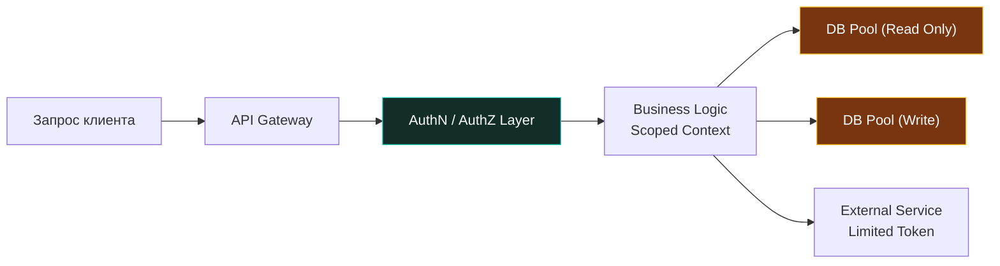
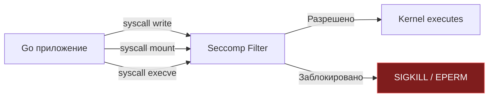

## Суть принципа: минимизация blast radius

> *«Фундаментальное правило безопасности — разделение на отсеки. Если одну переборку пробьет, герметичные люки обязаны гарантировать, что остальной корабль удержится на плаву».*    
> — Брайан Керниган

В теории безопасности программного обеспечения существует концепция, стоящая наравне с законами сохранения энергии в физике — **Принцип наименьших привилегий (Principle of Least Privilege, PoLP)**. 

Его каноническая формулировка проста: любой компонент вычислительной системы — будь то системный процесс ОС, поток выполнения, горутина, функция, токен авторизации или пользователь базы данных — должен обладать **строго минимальным набором полномочий**, абсолютно достаточным для выполнения его сиюминутной задачи, и **ровно на то время**, которое необходимо для ее завершения.

В реальной практике промышленного бэкенда это не просто абстрактная рекомендация «не сидите под учетной записью `root`». Это базовый архитектурный рубеж обороны, направленный на радикальное уменьшение **радиуса поражения (Blast Radius)**.

Представьте современную подводную лодку: ее корпус разделен на изолированные отсеки водонепроницаемыми переборками. Если в один из отсеков проникнет вода (злоумышленник эксплуатирует уязвимость нулевого дня в парсере заголовков), герметичные двери захлопнутся, и корабль продолжит плавание. Но если в погоне за мнимым удобством вы уберете все переборки, одна-единственная течь мгновенно затопит все судно. 

Принцип наименьших привилегий — это и есть водонепроницаемые переборки вашего бэкенда. Он исключает горизонтальное распространение атаки (Lateral Movement) и блокирует попытки повышения привилегий (Privilege Escalation) внутри инфраструктуры.



---

## Уровень ОС и процессов: Linux Capabilities и Syscalls

В классическом мире Unix/Linux права доступа исторически были примитивно бинарными: либо всемогущий суперпользователь `root` (UID 0), способный стереть файловую систему или перехватить трафик ядра, либо бесправный обычный пользователь.

Современное ядро Linux делит абсолютную власть `root` на тонкие гранулярные привилегии — **Capabilities** (битовые флаги ядра):
* `CAP_NET_BIND_SERVICE` — право слушать привилегированные сетевые порты ниже 1024 (например, 80 или 443).
* `CAP_SYS_PTRACE` — право отлаживать другие процессы и читать их виртуальную память через `ptrace`.
* `CAP_DAC_OVERRIDE` — право игнорировать классические файловые разрешения (rwx).

Когда Go-бинарник запускается в операционной системе, он наследует набор capabilities родительского процесса. Управление ими осуществляется через системные вызовы ядра `capget` и `capset`. Однако прямое манипулирование правами из чистого рантайма Go сопряжено с трудностями (требует `cgo` или `unsafe` вызовов `libc`). Поэтому в зрелом продакшене сброс лишних прав выполняется на уровне entrypoint контейнера или специализированных утилит еще до запуска сервиса.

> [!warning] Ловушка / Gotcha: Выполнение `init()` до сброса привилегий
> В рантайме Go функции `init()` всех импортированных пакетов выполняются **строго до** того, как управление будет передано в точку входа `main()`.  
> Если вы планируете снизить привилегии процесса программно прямо в коде Go (например, вызвав системный вызов `syscall.Setuid(1000)` или применив Seccomp-фильтры в начале `main()`), помните: **весь код во всех `init()` функциях сторонних библиотек уже выполнился с максимальными правами процесса!**  
> 
> **Решение:**  
> Никогда не надейтесь на сброс привилегий внутри самого бинарника Go. Контейнеризируйте сервис и сбрасывайте права суперпользователя на уровне рантайма контейнеров (директива `USER 1000:1000` в Dockerfile) до передачи управления бинарнику. Чувствительную инициализацию выносите в явные конструкторы, вызываемые под контролем вашего кода.

---

## Базы данных и пул соединений

Классическая и повсеместная ошибка архитектуры: создание одного глобального подключения к PostgreSQL от имени пользователя `admin` с правами `OWNER` или `SUPERUSER`. В этом случае любая тривиальная SQL-инъекция в пользовательском поиске мгновенно дает злоумышленнику права модифицировать системные таблицы, читать чужие тенанты или выполнять произвольные команды ОС через `COPY ... FROM PROGRAM`.

В рантайме Go стандартный пакет `database/sql` организует внутренний пул открытых TCP-соединений (`sql.ConnPool`). Если пул проинициализирован под учетной записью с максимальными правами, **каждая горутина** приложения наследует этот безграничный контекст.

Более того, смена прав на стороне СУБД не инвалидирует уже открытые физические соединения: они продолжают жить в пуле Go с устаревшими правами!

```go
// ❌ АНТИПАТТЕРН: единый монолитный пул с суперпользовательскими правами
db, err := sql.Open("postgres", "host=localhost user=admin password=...")

// ✅ АРХИТЕКТУРНЫЙ СТАНДАРТ: разделение пулов соединений по уровням доступа
type DBPool struct {
    ReadOnly *sql.DB // Пользователь с правами GRANT SELECT
    Write    *sql.DB // Пользователь с правами GRANT INSERT, UPDATE, DELETE
    Admin    *sql.DB // Пользователь с DDL-правами (миграции схем, бэкапы)
}

func NewDBPool(dsnRead, dsnWrite, dsnAdmin string) (*DBPool, error) {
    // 1. Пул только для чтения (реплики, аналитика)
    r, err := sql.Open("postgres", dsnRead)
    if err != nil {
        return nil, err
    }
    // 🔒 Принудительная периодическая ротация сессий
    r.SetConnMaxLifetime(10 * time.Minute)
    
    // 2. Пул для транзакционной модификации данных
    w, err := sql.Open("postgres", dsnWrite)
    if err != nil {
        return nil, err
    }
    w.SetConnMaxLifetime(10 * time.Minute)
    
    return &DBPool{
        ReadOnly: r, 
        Write:    w,
    }, nil
}
```

> [!info] Под капотом: Как пул соединений Go удерживает сессионные привилегии
> Пакет `database/sql` хранит список свободных соединений `idleConn` в виде кучи в памяти. Когда горутина выполняет запрос `db.QueryContext()`, пул берет готовое соединение из `idleConn` либо выполняет системный вызов `dial` для создания нового сокета.  
> 
> Сервер PostgreSQL ассоциирует права с открытой сетевой сессией, включая значение переменной `current_role`. Если соединение удерживается в пуле часами, изменение ролей в базе данных не вступит в силу для этого сокета. Настройка `db.SetConnMaxLifetime()` принудительно разрывает сокет по истечении лимита времени, закрывая окно рассинхронизации прав.

---

## Уровень кода и рантайма Go

Принцип наименьших привилегий должен пронизывать исходный код на микроуровне: в интерфейсах, системных командах и управлении горутинами.

### 1. Сегрегация интерфейсов (Interface Segregation)

Знаменитая буква **I** в акрониме SOLID — это чистейшее воплощение PoLP в архитектуре кода. Благодаря неявным (duck typing) интерфейсам компилятор Go может гарантировать ограничения доступа на этапе сборки:

```go
// ❌ ОШИБКА: монолитный интерфейс с избыточными правами
type Storage interface {
    Read(ctx context.Context, key string) ([]byte, error)
    Write(ctx context.Context, key string, data []byte) error
    Delete(ctx context.Context, key string) error
    ListKeys(ctx context.Context, prefix string) ([]string, error)
}

// ✅ ИДИОМАТИЧНО: гранулярные контракты наименьших привилегий
type Reader interface {
    Read(ctx context.Context, key string) ([]byte, error)
}

type Writer interface {
    Write(ctx context.Context, key string, data []byte) error
}

// Хэндлер чтения принимает СТРОГО Reader!
// Компилятор физически запретит вызов Write или Delete из этого обработчика.
func NewReadHandler(s Reader) *Handler {
    return &Handler{reader: s}
}
```

Если обработчик скомпрометирован злоумышленником через уязвимость десериализации, атакующий физически не сможет вызвать метод удаления `Delete`, потому что ссылка на этот метод отсутствует в таблице виртуальных методов (`itable`) данного интерфейса.

---

### 2. `os/exec` и наследование окружения

По умолчанию функция `exec.Command` в Go наследует **абсолютно все** переменные окружения родительского процесса и все открытые файловые дескрипторы (0, 1, 2 и сетевые сокеты).

Если ваш сервис хранит в переменных среды `DB_PASSWORD` или `AWS_SECRET_KEY`, запуск любой внешней утилиты приводит к неконтролируемой утечке этих секретов в дочерний процесс!

```go
// ❌ СМЕРТЕЛЬНО ОПАСНО: утилите передаются все секреты процесса и сокеты
cmd := exec.Command("external-tool", "--flag", value)

// ✅ БЕЗОПАСНО: строгая изоляция окружения и дескрипторов
cmd := exec.Command("external-tool", "--flag", value)

// 🔒 Минимальный белый список переменных среды
cmd.Env = []string{
    "PATH=/usr/local/bin:/usr/bin",
    "TZ=UTC",
}

// 🔒 Защита от процессов-зомби и утечки дескрипторов
cmd.SysProcAttr = &syscall.SysProcAttr{
    // Pdeathsig гарантирует отправку SIGTERM дочернему процессу при гибели родителя
    Pdeathsig: syscall.SIGTERM,
}
```

---

### 3. Контекст и время жизни привилегий

Привилегия должна быть ограничена не только функционально, но и **во времени**. Долгоживущие привилегии — подарок для атакующего.

```go
// ✅ Изоляция по времени через контекст с жестким дедлайном
ctx, cancel := context.WithTimeout(context.Background(), 5*time.Second)
defer cancel()

// Фоновая задача получит ограниченный токен, который автоматически 
// станет недействительным через 5 секунд в рантайме
go processBackgroundTask(ctx, payload)
```

---

## Механика безопасности: Seccomp и Namespace

В защищенных средах исполнения (Kubernetes, Docker) принцип наименьших привилегий опускается на уровень ядра Linux с помощью механизма **Seccomp (Secure Computing Mode)**.

Seccomp представляет собой BPF-фильтр в ядре, который перехватывает каждый системный вызов процесса и проверяет его по белому списку:



Рантайм Go активно использует низкоуровневые системные вызовы ядра: `epoll`, `mmap`, `madvise`, `futex`, `rt_sigaction`, `clone`. Однако веб-сервису абсолютно не нужны вызовы монтирования файловых систем `mount`, отладки `ptrace` или `socket` на создание низкоуровневых сырых сетевых интерфейсов. Наложение Seccomp-профиля гарантирует, что даже если злоумышленник добьется удаленного выполнения кода (RCE), ядро мгновенно пристрелит процесс сигналом `SIGKILL` при первой попытке вызвать `mount` или создать несанкционированный сокет.

Настройка Seccomp обычно задается декларативно в манифесте пода Kubernetes (`securityContext.seccompProfile`) или через флаг Docker `docker run --security-opt seccomp=default.json`. Для специфических статических сборок фильтры можно инициализировать через системный вызов `prctl` с помощью `cgo` до передачи управления планировщику Go.

---

> [!tip] Собеседование
> **Вопрос:** «Почему запуск сервиса на Go от пользователя `root` (UID 0) внутри Docker-контейнера считается критической уязвимостью, даже если контейнер изолирован пространствами имен (Namespaces)?»  
> **Ответ кандидата Senior-уровня:**  
> «1. **Побег из контейнера (Namespace Escape):** Пространства имен (mount, pid, net) — это не жесткая аппаратная виртуализация, а изоляция структур ядра. Если процесс внутри контейнера работает под UID 0 с флагом `CAP_SYS_ADMIN`, любая известная уязвимость в ядре Linux (например, Dirty COW или дефекты cgroups) позволяет процессу выйти из пространства имен напрямую в хостовую систему.  
> 2. **Доступ к устройствам:** Процесс с правами `root` может взаимодействовать с блочными устройствами `/dev/mem`, `/dev/sda` или сокетом Docker `/var/run/docker.sock`, если они были неосторожно смонтированы.  
> 3. **Специфика Go:** Рантайм Go при старте динамически аллоцирует память через `mmap` и создает потоки через `clone`. Работа под учетной записью `root` дает атакующему в случае RCE доступ к чтению любых системных файлов, включая смонтированные сертификаты и секреты Kubernetes ServiceAccount.  
> 4. **Инженерный стандарт:** В Dockerfile обязательна директива `USER 1000:1000` (nonroot), монтирование корневой файловой системы в режиме Read-Only (`--read-only`) и принудительный сброс всех capabilities ядра через `--cap-drop ALL`».

---

## Итог

1. **Принцип наименьших привилегий (PoLP)** — главная стратегия минимизации радиуса поражения (Blast Radius) при неизбежных инцидентах безопасности.
2. **На уровне операционной системы:** Заменяйте монолитный `root` гранулярными Linux Capabilities, контролируйте выполнение функций `init()` и сбрасывайте права до старта сетевых служб.
3. **На уровне баз данных:** Никогда не используйте суперпользователя для бэкенда. Разделяйте пул `database/sql` на независимые пулы (ReadOnly, Write, Admin) с принудительной ротацией сессий через `SetConnMaxLifetime`.
4. **На уровне языка Go:** Практикуйте Interface Segregation — передача узких интерфейсов (`Reader` вместо `Storage`) защищает от несанкционированных операций на уровне компилятора.
5. **Изоляция окружения:** Функция `exec.Command` обязана получать явный срез разрешенных переменных `cmd.Env` и атрибут `Pdeathsig` в `SysProcAttr`.
6. **Контейнерная безопасность:** Запуск от `USER nonroot` (`USER 1000:1000`), отключение capabilities (`--cap-drop ALL`) и фильтрация системных вызовов через Seccomp — обязательный производственный стандарт.

Мы полностью завершили первый подраздел «Фундамент»! Мы изучили архитектуру безопасности, моделирование угроз по STRIDE, карту OWASP Top 10, разделение аутентификации и авторизации, а также принцип наименьших привилегий.

Впереди нас ждет второй фундаментальный подраздел — **«02. Аутентификация и авторизация»**, где мы перейдем к практическому устройству криптографических паролей: [[1. Пароли и хранение хешей]].