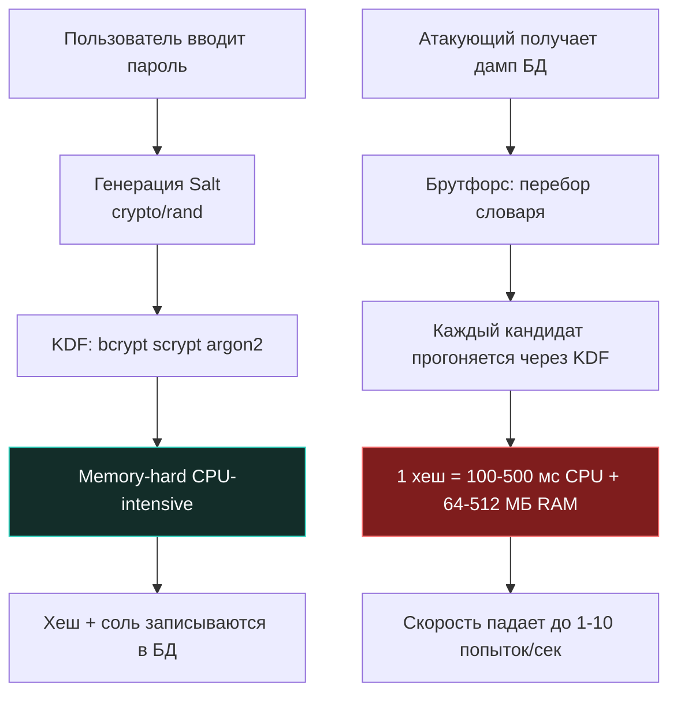
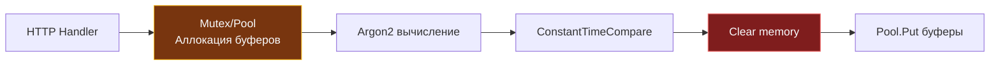

## Фундаментальная проблема: энтропия, радужные таблицы и цена вычисления

> *«Самый быстрый алгоритм легко может стать самым опасным, если его скорость помогает взломщику больше, чем хозяину дома».*    
> — Брайан Керниган

В компьютерной безопасности пароли представляют собой уникальный феномен: это секрет с катастрофически низкой информационной энтропией. Человеческий мозг не приспособлен генерировать и запоминать 256-битные случайные числа. Среднестатистический пользователь выбирает пароль длиной 8–12 символов из предсказуемого словаря, что дает пространство перебора порядка $10^9$ – $10^{14}$ комбинаций.

В то же время современный вычислительный кластер из восьми видеокарт NVIDIA RTX 4090 способен перебирать сотни миллиардов быстрых хэшей в секунду. Поэтому хранение паролей в обратимом виде (симметричное шифрование) или использование быстрых криптографических хэш-функций общего назначения (MD5, SHA-1, SHA-256) — это не просто «слабая защита», это фундаментальный архитектурный дефект.

Криптографические хэш-функции вроде SHA-256 создавались математиками для совершенно иной цели — **максимальной скорости и эффективности проверки целостности**. Их вычисление требует минимума тактов CPU, они великолепно векторизуются векторными инструкциями SIMD (AVX2, AVX-512), не требуют аллокаций памяти и не нагружают аппаратные кэши процессора. На специализированных интегральных микросхемах (ASIC) или видеокартах перебор SHA-256 происходит со скоростью триллионов операций в секунду.

Принцип защиты паролей диаметрально противоположен: **функция хэширования паролей обязана быть намеренно, чудовищно медленной и прожорливой к ресурсам**. 

Если легитимный пользователь тратит 200 миллисекунд на один вход в систему, он даже не заметит этой задержки. Но если злоумышленник захочет перебрать словарь из миллиарда паролей по украденной базе, задержка в 200 миллисекунд на одну попытку превратит брутфорс в многовековой непреодолимый тупик:



---

## Эволюция механизмов защиты: от соли до памяти

Чтобы нейтрализовать технологическое превосходство атакующих, индустрия криптографии последовательно создала три фундаментальных барьера:

### 1 - Соль (Salt)
Соль — это криптографически стойкая последовательность псевдослучайных байтов (минимум 16 байт), генерируемая для каждого пароля индивидуально при регистрации или смене учетных данных.  
Соль конкатенируется с паролем перед передачей в алгоритм хэширования. Она решает две ключевые задачи:
1. Полностью уничтожает применимость **радужных таблиц (Rainbow Tables)** — гигантских предрассчитанных баз соответствия паролей и хэшей.
2. Гарантирует, что если два пользователя выбрали одинаковый пароль `password123`, их хэши в базе данных будут абсолютно разными.

Соль не является секретом (в отличие от ключей шифрования) и открыто хранится в базе данных рядом с вычисленным хэшем.

### 2 - Фактор работы (Work Factor / Cost)
Итерационный параметр, определяющий математическую сложность алгоритма. Он заставляет процессор прогонять хэширование через тысячи циклов вычислений, искусственно повышая время проверки на сервере до заданного порога (например, 150–300 мс). Главное достоинство фактора работы — масштабируемость: по мере роста быстродействия процессоров в законе Мура вы просто увеличиваете параметр `Cost`, сохраняя защищенность системы.

### 3 - Стойкость к памяти (Memory Hardness)
Самое революционное открытие в современных функциях формирования ключа (KDF — Key Derivation Functions). Видеокарты (GPU) и чипы ASIC обладают колоссальной вычислительной мощностью, но имеют крошечный локальный кэш памяти на один вычислительный поток.  
Memory-hard алгоритм требует для вычисления одного хэша выделения массивного буфера в оперативной памяти (например, от 64 до 512 МБ) и выполняет непрерывные случайные чтения и записи внутри него. Это переносит узкое горлышко из кремниевых ядер в **пропускную способность шины памяти (Memory Bandwidth)**.

> [!info] Под капотом: Как Argon2 загружает память на уровне процессора
> Алгоритм **Argon2** делит выделенный в оперативной памяти буфер на блоки фиксированного размера по 1 КБ. На каждой итерации индекс следующего блока вычисляется псевдослучайным образом на основе предыдущих байт.  
> 
> Это провоцирует постоянные аппаратные промахи предсказателя переходов CPU (Branch Misprediction) и принудительно вымывает кэш-линии L1/L2/L3. Процессор вынужден непрерывно ждать загрузки данных из контроллера DRAM, упираясь в физическую скорость шины памяти (25–40 ГБ/с на ядро).  
> Для видеокарты попытка запустить 10 000 параллельных потоков вычисления Argon2 приводит к мгновенному коллапсу: на чипе банально не хватает видеопамяти (VRAM), а пропускная способность памяти делится между ядрами, обрушивая скорость брутфорса почти до нуля.

---

## Реализация в Go: идиоматика и управление памятью

В языке Go пароли **категорически запрещено** передавать и хранить в типе `string`!  
Строки в Go неизменяемы. Передача пароля в `string` означает, что копия байтов останется лежать в страницах кучи рантайма, а ссылка на строку может сохраниться в регистрах CPU или внутренних буферах `net/http`. Сборщик мусора не дает гарантий по времени очистки, а `pprof heap dump` или Core Dump процесса могут раскрыть пароль в открытом виде на диске.

Идиоматичный подход: работа строго со срезами байт `[]byte` и гарантированное зануление памяти сразу после вычисления.

```go
package auth

import (
	"crypto/rand"
	"crypto/subtle"
	"encoding/base64"
	"fmt"
	"runtime"

	"golang.org/x/crypto/argon2"
)

// HashPassword генерирует криптостойкий хэш Argon2id в стандартном формате
func HashPassword(password []byte) (string, error) {
	salt := make([]byte, 16)
	if _, err := rand.Read(salt); err != nil {
		return "", fmt.Errorf("salt generation failed: %w", err)
	}

	// Параметры Argon2id:
	// time: 3 итерации
	// memory: 64 * 1024 КБ (64 МБ RAM)
	// threads: 4 параллельных потока
	// keyLen: 32 байта выходного хэша
	hash := argon2.IDKey(password, salt, 3, 64*1024, 4, 32)

	// Сериализация соли и хэша в строку Base64
	encoded := base64.RawStdEncoding.EncodeToString(
		fmtAppend(nil, salt, hash),
	)
	
	// 🔒 Гарантированное затирание чувствительного материала в оперативной памяти
	clear(salt)
	clear(hash)
	runtime.KeepAlive(password) // Защита от Dead Store Elimination компилятора
	clear(password)

	return fmt.Sprintf("$argon2id$v=19$m=65536,t=3,p=4$%s", encoded), nil
}

// VerifyPassword сравнивает кандидатский пароль с хэшем за константное время
func VerifyPassword(password []byte, hashStr string) (bool, error) {
	salt, expectedHash, err := decodeHash(hashStr)
	if err != nil {
		return false, err
	}

	// Повторное вычисление хэша с идентичными параметрами
	gotHash := argon2.IDKey(password, salt, 3, 64*1024, 4, 32)

	// 🔒 Сравнение за постоянное время (Constant Time) на уровне процессора.
	// Предотвращает утечку через Timing Attacks.
	res := subtle.ConstantTimeCompare(expectedHash, gotHash)
	
	clear(gotHash)
	runtime.KeepAlive(password)
	clear(password)

	return res == 1, nil
}

func fmtAppend(b, s, h []byte) []byte {
	return append(append(b, s...), h...)
}

func decodeHash(hashStr string) ([]byte, []byte, error) {
	// Реализация парсинга формата $argon2id$...
	return nil, nil, fmt.Errorf("not implemented")
}
```

---

> [!warning] Ловушка / Gotcha: Компилятор оптимизирует `clear()` и циклы обнуления
> В Go 1.21+ функция `clear(slice)` встроена в язык. Однако компилятор Go при оптимизации машинного кода имеет полное право применить технику **Dead Store Elimination (DSE)**: если компилятор видит, что после вызова `clear()` переменная больше никогда не читается, он может полностью выбросить инструкции записи нулей из ассемблерного кода!  
> В результате пароль останется в памяти в открытом виде.
> 
> **Решения:**
> 1. Вызывайте `runtime.KeepAlive(slice)` сразу после очистки (например, `runtime.KeepAlive(password)`). Это сообщает оптимизатору компилятора, что объект используется, блокируя удаление обнуляющих инструкций.
> 2. Для критических криптографических ключей применяйте специализированные функции из пакета `golang.org/x/crypto/internal/subtle` или блокируйте сброс страниц памяти в своп через системный вызов `syscall.Mlock()` (требует прав `CAP_IPC_LOCK` или настройки лимитов ядра `sysctl vm.mlock_limit`).
> 3. Исключайте чувствительные области памяти из аварийных дампов ядра: `syscall.Madvise(ptr, len, syscall.MADV_DONTDUMP)`.

---

## Сравнение алгоритмов: почему bcrypt уступает argon2

В современной индустрии применяются три основных KDF:

| Параметр | bcrypt | scrypt | argon2id (Рекомендуется) |
|---|---|---|---|
| **Потребление памяти** | Фиксированное (~4 КБ) | Настраиваемое | Настраиваемое (стандарт: 64+ МБ) |
| **Защита от GPU/ASIC** | Слабая (эффективно перебирается на GPU) | Средняя | Исключительная (упирается в RAM bandwidth) |
| **Устойчивость к Side-Channel** | Высокая | Низкая (уязвима к атакам по кэшу) | Максимальная (комбинация data-dependent и data-independent) |
| **Время расчета в Go** | ~100–300 мс (CPU bound) | ~50–150 мс | ~80–200 мс |
| **Стандартизация** | OpenBSD, 1999 г. (устаревает) | RFC 7914 | RFC 9106, победитель Password Hashing Competition |

Хотя `bcrypt` исторически чрезвычайно популярен в Go благодаря пакету `golang.org/x/crypto/bcrypt`, его фатальный недостаток — **жесткий лимит длины пароля в 72 байта** и почти нулевое потребление памяти (всего 4 КБ на блок). На современных графических процессорах NVIDIA вычисление `bcrypt` отлично параллелится, в то время как `Argon2id` заставляет фермы GPU захлебываться от нехватки пропускной способности памяти.

---

> [!tip] Собеседование
> **Вопрос:** «Почему категорически запрещено использовать `SHA-256(password + salt)` для сохранения паролей в базе данных?»  
> **Ответ кандидата Senior-уровня:**  
> «1. **Экстремальная скорость вычисления:** Один цикл SHA-256 занимает всего 150 наносекунд на одном ядре CPU. Атакующий с несколькими видеокартами перебирает более $10^{10}$ комбинаций в секунду.  
> 2. **Отсутствие барьера памяти (Zero Memory Cost):** SHA-256 требует лишь несколько служебных регистров процессора. Это позволяет загрузить все тысячи шейдерных ядер GPU на 100%.  
> 3. **Истинная цель KDF:** Пароли обязаны защищаться алгоритмами с доказанной вычислительной сложностью (Memory-Hard Key Derivation Functions — Argon2id, bcrypt, scrypt), где каждый хэш требует сотен миллисекунд работы процессора и десятков мегабайт оперативной памяти».

---

## Инфраструктурные аспекты и масштабирование

Хэширование паролей — намеренно тяжелая CPU-bound и Memory-bound операция. Если ваш сервис логина подвергнется нагрузке в 1 000 RPS, вычисление `argon2.IDKey` потребует эквивалента 200 ядер CPU ежесекундно!

**Инженерные приемы оптимизации и защиты от отказа в обслуживании:**
1. **Привязка к потокам (CPU Affinity):** Вызов `runtime.LockOSThread()` на время вычисления тяжелого хэша предотвращает миграцию горутины между логическими ядрами CPU, сохраняя прогретый L3-кэш.
2. **Переиспользование буферов памяти (`sync.Pool`):** Выделение временных массивов для соли и результатов хэширования через `sync.Pool` исключает аллокационный шторм в куче и разгружает сборщик мусора.
3. **Защита от OOM:** Применение мягкого лимита `GOMEMLIMIT` защищает Go-процесс от внезапной гибели под всплеском параллельных авторизаций.



---

## Итог

1. Пароли обладают низкой энтропией. Быстрые хэш-функции (SHA-256, MD5) категорически непригодны для их хранения из-за возможности молниеносного перебора на GPU и ASIC.
2. Современный золотой стандарт — алгоритм **Argon2id** (RFC 9106), сочетающий фактор работы процессора и стойкость к пропускной способности оперативной памяти.
3. В Go пароли должны обрабатываться исключительно как `[]byte`, а память обязана затираться нулями сразу после использования с вызовом `runtime.KeepAlive()` для защиты от Dead Store Elimination.
4. Сравнение хэшей производится строго за константное время с помощью `crypto/subtle.ConstantTimeCompare`, исключая утечки информации через тайминги ответов.
5. Ресурсоемкость хэширования требует грамотного планирования инфраструктуры: ограничения частоты запросов (Rate Limiting) и мониторинга профилей CPU/памяти через `pprof`.

В следующей лекции мы детально сравним алгоритмы `bcrypt` и `argon2`, измерим их на бенчмарках и выберем оптимальные параметры для продакшена: [[2. bcrypt, argon2 и выбор алгоритма]].