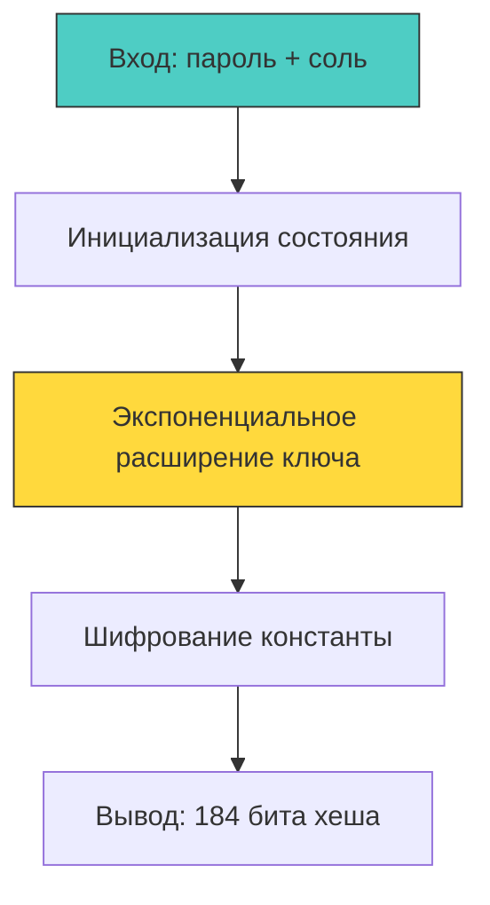
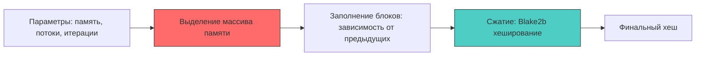

## Эволюция и выбор: почему нет серебряной пули

> *«Есть два способа проектирования программ: сделать систему настолько простой, чтобы в ней явно не было недостатков, либо настолько сложной, чтобы в ней не было явных недостатков».*    
> — C.A.R. Hoare

Выбор криптографического алгоритма хэширования паролей — это вечный инженерный компромисс между теоретической стойкостью к атакам, накладными расходами на сервере и устойчивостью к параллельному взлому на специализированном аппаратном обеспечении (GPU, FPGA, ASIC).

Сегодня общепризнанным стандартом индустрии является **Argon2id**, однако **bcrypt** продолжает нести боевое дежурство в миллионах существующих систем. Понимание их внутреннего устройства, микроархитектурных различий (L1-кэш против пропускной способности DRAM) и поведения в планировщике рантайма Go жизненно необходимо каждому бэкенд-инженеру для осознанного проектирования подсистемы аутентификации.



---

## bcrypt: Наследие Blowfish и экспоненциальная сложность

Алгоритм **bcrypt** был создан в 1999 году Нильсом Провосом и Дэвидом Мазьером для операционной системы OpenBSD. В его основу лег блочный шифр Blowfish Брюса Шнайера, модифицированный в схему с расширением ключа под названием **Eksblowfish** (Exact Key Setup Blowfish).

Главное достоинство bcrypt — регулируемый параметр сложности **`cost`**. Инициализация внутреннего состояния требует ровно `2^cost` ($2^{\text{cost}}$) итераций шифрования. Каждое увеличение параметра `cost` на единицу строго **удваивает** время вычисления хэша на процессоре.

*Механика работы:* Алгоритм оперирует внутренними таблицами подстановок (S-boxes) суммарным объемом около 4 КБ. При инициализации ключа таблицы многократно перезаписываются псевдослучайными значениями, после чего зашифровывается 192-битная тестовая константа `"OrpheanBeholderScryDoubt"`. 

Объем рабочего состояния в 4 КБ идеально укладывается в быстрый кэш первого уровня L1d современных процессоров (обычно 32–48 КБ на ядро). В Go реализация находится в официальном расширении стандартной библиотеки `golang.org/x/crypto/bcrypt` (включая функцию `bcrypt.GenerateFromPassword`). Она написана на чистом Go, что гарантирует мгновенную кросс-компиляцию под любую архитектуру, но не задействует аппаратные инструкции SIMD так агрессивно, как ассемблерные сишные аналоги.

> [!info] Под капотом: Влияние параметра cost на планировщик Go
> На современном x86-64 ядре вычисление bcrypt с параметром `cost=12` занимает около 250 мс чистого процессорного времени. При значении `cost=13` задержка подскакивает до ~500 мс, а при `cost=14` — до 1 секунды!  
> 
> Поскольку вычисление bcrypt — это непрерывный цикл вычислений в регистрах CPU без системных вызовов (`syscall`), горутина **не отдает управление планировщику Go добровольно**. До версии Go 1.14 такие циклы вызывали зависание рантайма; сейчас компилятор вставляет асинхронную преемпцию через сигналы ОС (`SIGURG`). Тем не менее, поток ОС ($M$) оказывается монопольно занят вычислениями.  
> Если в ваш сервис хлынет волна параллельных логинов, планировщик Go начнет лихорадочно плодить новые потоки ядра $M$, упираясь в системный лимит дескрипторов или провоцируя OOM и троттлинг ядра. Значения `cost > 16` (и на веб-серверах даже `cost > 14`) применять категорически не рекомендуется.

---

## Argon2: Память, потоки и устойчивость к GPU

В 2015 году международный консилиум криптографов завершил конкурс Password Hashing Competition (PHC). Безоговорочным победителем стал алгоритм **Argon2**, позже стандартизированный IETF в спецификации RFC 9106.

Argon2 создавался с прицелом на нейтрализацию современных ферм GPU и заказных чипов ASIC. Для этого алгоритм ввел три независимых параметра масштабирования:
1. **Объем оперативной памяти (`memory`):** Количество килобайт RAM, выделяемых под массив блоков.
2. **Параллелизм (`parallelism` / `threads`):** Количество независимых вычислительных дорожек (lanes).
3. **Время (`time` / `iterations`):** Количество итерационных проходов по памяти.

Алгоритм существует в трех модификациях:
* `Argon2d` (Data-dependent): Порядок адресации памяти зависит от значений в предыдущих блоках. Это дает максимальную защиту от атак на GPU, но теоретически уязвимо к атакам по сторонним каналам (Side-Channel Cache Timing Attacks). Применяется для PoW в криптовалютах.
* `Argon2i` (Data-independent): Порядок обхода памяти генерируется независимым генератором. Устойчив к утечкам через кэш CPU, но требует больше проходов против атак на GPU.
* `Argon2id` (Hybrid): Золотая середина. На первом проходе ведет себя как `Argon2i`, защищая от атак по времени, а на последующих проходах переключается в режим `Argon2d`, связывая руки GPU. **Строго рекомендуется для хэширования паролей.**



*Механика сжатия:* Алгоритм аллоцирует непрерывную матрицу 1-килобайтных блоков. Внутри блоков применяется сверхбыстрая функция перестановки и сжатия на базе криптографического примитива **Blake2b**. Это превращает алгоритм в классическую **memory-bound** задачу: скорость вычисления упирается не в гигагерцы тактовой частоты процессора, а в физическую пропускную способность шины оперативной памяти DDR4/DDR5.

---

## Механическое сочувствие: влияние на CPU, кэш и планировщик

Проверка паролей — тяжелейший стресс-тест для рантайма Go. Рассмотрим анатомию физических процессов в процессоре:

1. **Escape Analysis и давление на кучу:** Выделение памяти под массив Argon2 (например, 64 МБ) гарантированно уходит в кучу (heap). При пиковой нагрузке в 100 RPS это генерирует гигабайты временных аллокаций. Сборщик мусора Go перегружается (происходит череда циклов `Minor GC` и затяжные фазы Stop-The-World), вымывая строки кэша L1/L2.
2. **Аппаратные промахи кэша (CPU Cache Thrashing):** В то время как 4 КБ таблиц bcrypt уютно помещаются в L1-кэше ядра процессора, 64 МБ Argon2 физически не влезают даже в общий кэш третьего уровня L3 (обычно 16–32 МБ на сокет). Процессор непрерывно простаивает в циклах ожидания выборки из контроллера DRAM (Memory Stall Cycles), резко снижая показатель IPC (Instructions Per Cycle).
3. **Нагрузка на планировщик GMP:** Массовый одновременный запуск горутин с Argon2 парализует планировщик. Пул системных потоков $M$ разрастается, вызывая жесткую конкуренцию за ядра процессора.

```go
// ✅ Промышленная обертка: ограничение параллелизма через семафор и пул буферов
type PasswordHasher struct {
	sem  chan struct{}   // Семафор для ограничения одновременных тяжелых расчетов
	pool *sync.Pool      // Пул временных буферов для разгрузки GC
}

func NewHasher(maxParallel int) *PasswordHasher {
	return &PasswordHasher{
		sem: make(chan struct{}, maxParallel),
		pool: &sync.Pool{
			New: func() any { 
				// Предвыделенный буфер памяти
				b := make([]byte, 64*1024) 
				return &b
			},
		},
	}
}

func (h *PasswordHasher) Hash(ctx context.Context, password []byte) (string, error) {
	// 🔒 Ограничиваем число одновременно работающих ядер CPU
	select {
	case h.sem <- struct{}{}:
		defer func() { <-h.sem }()
	case <-ctx.Done():
		return "", ctx.Err()
	}

	salt := make([]byte, 16)
	if _, err := io.ReadFull(rand.Reader, salt); err != nil {
		return "", fmt.Errorf("salt gen: %w", err)
	}

	// 🔒 Вычисление Argon2id: 3 итерации, 64 МБ памяти, 4 потока, 32 байта хэша
	hash := argon2.IDKey(password, salt, 3, 64*1024, 4, 32)
	
	// Сериализация и безопасная очистка...
	return fmt.Sprintf("$argon2id$v=19$m=65536,t=3,p=4$%s", base64.RawStdEncoding.EncodeToString(hash)), nil
}
```

---

> [!warning] Ловушка / Gotcha: Алгоритмическая миграция без сброса паролей
> При увеличении параметра `cost` в bcrypt или при переходе со старого bcrypt на современный Argon2id старые хэши в базе данных остаются валидными, но они беззащитны перед новым мощным «железом» злоумышленников.  
> Сбросить пароли всем пользователям принудительно — верный способ потерять аудиторию.  
> 
> **Элегантное инженерное решение: «Ленивая миграция при входе» (Lazy Migration on Login):**  
> При вызове `VerifyPassword()` сервис анализирует префикс хэша в БД:
> * Если хэш начинается с `$2a$` (bcrypt) или содержит устаревшие параметры `cost=10`, а пароль введен верно — хэндлер прямо в памяти перехэширует введенный открытый пароль по новому стандарту `Argon2id` и прозрачно обновляет строку в PostgreSQL!  
> В течение нескольких месяцев активная база пользователей бесшовно мигрирует на новый криптографический стандарт без единого сбоя.

---

## Практический выбор и настройка под железо

| Инженерный критерий | bcrypt | argon2id |
|---|---|---|
| **Зрелость и проверка временем** | 25+ лет в строю, дефолт в Unix | 9+ лет, официальный победитель PHC |
| **Аппаратная стойкость** | Средняя (уязвима для специализированных GPU-ферм) | Абсолютная (Memory-Hard барьер) |
| **Многопоточность** | Однопоточный (1 ядро CPU на хэш) | Настраиваемый параллелизм (использует $N$ ядер) |
| **Лимит длины пароля** | **Критический дефект: обрезает до 72 байт** | Без ограничений по длине |
| **Рекомендация** | Поддержка легаси-баз данных | **Все новые проекты, высокие требования безопасности** |

**Инженерный чеклист подбора параметров Argon2id для продакшена:**
1. **Базовый профиль:** `memory=64MB` (`memory = 64 * 1024` КБ RAM), `iterations=3`, `parallelism=4`.
2. **Бенчмарк под нагрузкой:** Запустите тест `go test -bench` на сервере с целевыми CPU. Добейтесь времени вычисления в диапазоне **150–300 мс** на операцию.
3. **Баланс памяти:** Увеличивайте объем `memory` до тех пор, пока хватает свободной оперативной памяти ноды Kubernetes без риска ухода в своп.
4. **Ограничение рантайма:** Установите `GOMEMLIMIT` и защитите эндпоинт авторизации семафором, чтобы отсечь атаки на исчерпание памяти.
5. **Внешняя конфигурация:** Выносите параметры KDF в конфигурационные файлы приложения (ConfigMap), а не хардкодьте в коде.

---

> [!tip] Собеседование
> **Вопрос:** «Почему сравнение хэшей паролей через стандартный оператор `==` в Go считается серьезной уязвимостью, даже если сам хэш вычислен с помощью надежного Argon2id?»  
> **Ответ кандидата Senior-уровня:**  
> «Оператор `==` в Go выполняет быстрое побайтовое сравнение и немедленно прерывает цикл при обнаружении первого несовпадения.  
> Из-за этого время выполнения проверки линейно зависит от того, сколько байт в начале хэша совпало. Злоумышленник, измеряя микросекундные задержки ответов по сети, может проводить атаку по времени (Timing Attack), последовательно подбирая байты хэша. Сложность подбора падает с экспоненциальной $O(2^n)$ до тривиальной линейной `O(n*256)` ($O(n \times 256)$).  
> В Go обязательно применение функции `crypto/subtle.ConstantTimeCompare`, которая выполняет побитовый XOR для всех байтов среза и суммирует результат за строго константное число тактов CPU».

---

## Итог

1. **bcrypt** остается надежным рабочим инструментом для существующих систем, но фундаментально уступает современным стандартам из-за жесткого лимита длины пароля в 72 байта и отсутствия требований к оперативной памяти.
2. **Argon2id** — золотой стандарт криптографии паролей (RFC 9106). Его гибридный дизайн нейтрализует параллельные вычисления на GPU и ASIC за счет принудительного использования пропускной способности оперативной памяти (Memory Hardness).
3. **Механическое сочувствие к рантайму:** Хэширование паролей — тяжелейшая операция. В Go она должна защищаться семафорами ограничения параллелизма, переиспользованием буферов через `sync.Pool` и контролем мягкого лимита памяти `GOMEMLIMIT`.
4. **Стратегия ленивой миграции:** Обновляйте алгоритмы и параметры сложности прозрачно для пользователя в момент успешного входа в систему.
5. **Сравнение только за константное время:** Функция `crypto/subtle.ConstantTimeCompare` — единственный легитимный способ проверки подлинности криптографических хэшей.

Мы завершили детальный разбор хранения паролей. Но как передавать полномочия пользователя между микросервисами после успешной аутентификации? 

В следующей лекции мы вскроем анатомию самого популярного формата распределенных токенов: [[3. JWT. Устройство и подводные камни]].