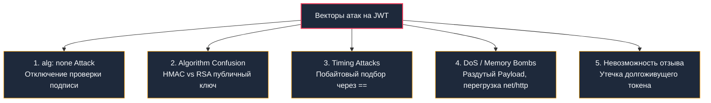

# 3. JWT: Устройство, криптография и подводные камни

> *"A distributed system is one in which the failure of a computer you didn't even know existed can render your own computer unusable."*  
> — Лесли Лэмпорт

В архитектуре современных микросервисов аутентификация часто сталкивается с дилеммой масштабируемости. Если на каждый входящий HTTP-запрос сервис обязан обращаться к центральной базе данных или кластеру Redis за проверкой сессии, то база сессий мгновенно превращается в узкое горлышко всей системы (Single Point of Failure).

Решением этой проблемы стал формат **JSON Web Token (JWT)**. Метафорически JWT похож на посадочный талон на авиарейс со штрихкодом и криптографической печатью авиакомпании: сотруднику у выхода на посадку не нужно звонить диспетчеру в штаб-квартиру, чтобы проверить каждого пассажира. Ему достаточно проверить целостность цифровой подписи авиакомпании и дату вылета прямо на бланке билета. Вся необходимая информация для авторизации встроена в сам токен и криптографически защищена от изменений.

Однако за эту независимость (**stateless**) приходится платить: токены раздувают HTTP-заголовки, нагружают процессор криптографическими расчетами при каждом запросе, порождают скрытые аллокации памяти в рантайме Go и создают одну из сложнейших проблем распределенных систем — проблему мгновенного отзыва полномочий.

---

## Анатомия токена и сериализация Base64URL

JWT (RFC 7519) представляет собой компактную строку, состоящую из трех частей, разделенных точками: `Header.Payload.Signature`.

```mermaid
flowchart LR
    subgraph TokenCreation["Формирование токена"]
        direction TB
        H["1. Header (JSON)<br/>typ: JWT, alg: HS256 / RS256 / ES256"] --> B64H["Base64URL Encode"]
        P["2. Payload (JSON Claims)<br/>sub, exp, iat, jti, roles"] --> B64P["Base64URL Encode"]
        B64H --> Cat["Конкатенация: Header.Payload"]
        B64P --> Cat
        Cat --> Sign["Криптографическая подпись<br/>(Secret / Private Key)"]
        Sign --> B64S["Base64URL Encode Signature"]
    end
    
    Cat -.-> Res["JWT: part1.part2.part3"]
    B64S --> Res
    
    style H fill:#1e293b,stroke:#38bdf8,stroke-width:2px,color:#f8fafc
    P fill:#1e293b,stroke:#38bdf8,stroke-width:2px,color:#f8fafc
    Sign fill:#1e293b,stroke:#f59e0b,stroke-width:2px,color:#f8fafc
    Res fill:#1e293b,stroke:#10b981,stroke-width:2px,color:#f8fafc
```

Каждая часть кодируется алгоритмом **Base64URL** (RFC 4648, Section 5). В отличие от классического Base64, здесь заменяются небезопасные для URL и заголовков символы: `+` заменяется на `-`, `/` заменяется на `_`, а хвостовой заполнитель выравнивания `=` отбрасывается:

1. **`Header`**: JSON-объект с метаданными. Обязательно указывает тип токена (`typ: JWT`) и криптографический алгоритм подписи (`alg: HS256`, `RS256`, `ES256`).
2. **`Payload`**: JSON-объект с полезной нагрузкой — утверждениями (claims). Стандартные зарегистрированные поля:
   - `sub` (subject) — уникальный идентификатор субъекта (ID пользователя).
   - `exp` (expiration) — Unix-время истечения срока действия токена.
   - `iat` (issued at) — время выпуска токена.
   - `jti` (JWT ID) — уникальный идентификатор конкретного токена для предотвращения атак повторного воспроизведения и построения черных списков.
3. **`Signature`**: Цифровая подпись, вычисляемая над первыми двумя частями. Гарантирует целостность и аутентичность данных:
   `HMAC(Header.Payload, secret)` или `RSA-SHA256(Header.Payload, private_key)`:
   $$\text{Signature} = \text{HMAC}(\text{Header} \mathbin{\Vert} \text{Payload}, \text{secret})$$
   или
   $$\text{Signature} = \text{RSA-SHA256}(\text{Header} \mathbin{\Vert} \text{Payload}, \text{private\_key})$$

---

## Под капотом: сериализация и цена на такт процессора

В Go вызов библиотечной функции парсинга вроде `jwt.Parse()` выглядит обманчиво легковесно. Однако заглянем внутрь рантайма при обработке каждого входящего HTTP-запроса:

1. **Чтение из сетевого буфера:** Срез байт извлекается из `net/http` буфера сокета.
2. **Декодирование Base64URL:** Алгоритм считывает чанки по 4 байта и преобразует их в 3 байта сырых данных. Стандартный пакет `encoding/base64` в Go требует аллокации нового среза в куче под декодированные байты, если буфер не переиспользуется.
3. **Парсинг JSON (`json.Unmarshal`):** Декодирование JSON-объекта в Go опирается на `reflect`. Создается множество мелких объектов: строки для ключей и значений, вложенные структуры и мапы.
4. **Давление на сборщик мусора:** При нагрузке в 10 000 RPS рутинная валидация JWT способна порождать свыше 30 000 короткоживущих аллокаций в секунду. Это провоцирует частые срабатывания `Minor GC`, раздувает `mcache` потоков и приводит к вымыванию горячих строк процессорного кэша L1/L2.

> [!info] Под капотом: Влияние сериализации на рантайм Go
> Каждый вызов `jwt.Parse()` или ручной валидации запускает цепочку: чтение байт из `net/http` буфера → декодирование Base64 → выделение новой памяти для результата → `json.Unmarshal` → аллокация мап и строк для claims. При 10 000 RPS это создаёт ~30 000 короткоживущих аллокаций в секунду, что провоцирует частые `Minor GC` и увеличивает латентность. Стандартный `encoding/base64` и `encoding/json` оптимизированы, но не избегают аллокаций полностью. Для высоконагруженных систем рекомендуется кэширование или использование специализированных парсеров с `[]byte` буферами.

---

## Криптография и подпись: от HMAC до ECDSA

Выбор алгоритма подписи определяет баланс между вычислительной сложностью, безопасностью распределения ключей и размером HTTP-пакетов.

| Алгоритм | Тип ключа | Скорость верификации в Go | Размер подписи | Типичное применение |
|---|---|---|---|---|
| **`HS256`** (HMAC-SHA256) | Симметричный (общий секрет) | Сверхвысокая (~50–100 нс) | 32 байта | Внутренние микросервисы одной доверенной зоны |
| **`RS256`** (RSA-SHA256) | Асимметричный (Public/Private) | Средняя (~200–400 мкс) | 256 байт (2048-bit) | Публичные API, Identity Provider (IdP), OIDC |
| **`ES256`** (ECDSA-SHA256, P-256) | Асимметричный (эллиптические кривые) | Высокая (~50–150 мкс) | 64 байта | Мобильные клиенты, IoT, оптимизация заголовков |

В стандартной библиотеке Go криптографические операции реализованы в пакетах `crypto/rsa` и `crypto/ecdsa`. На архитектурах `amd64` и `arm64` эти пакеты содержат оптимизированные ассемблерные вставки с использованием векторных инструкций.

Однако у асимметричной криптографии есть аппаратная специфика:
* **RSA-2048 (`RS256`):** Проверка подписи требует вычисления модульного возведения в степень `big.Int.ModExp`. Это интенсивная операция над длинными числами, монопольно загружающая арифметико-логические устройства (ALU) процессора и активно перемещающая данные через кэш L1. При пиковых нагрузках без кэширования публичных ключей и результатов сервис рискует столкнуться с `CPU throttling` в контейнерах Kubernetes.
* **ECDSA (`ES256`):** Работает на эллиптических кривых NIST P-256. Она требует значительно меньше памяти, подпись занимает всего 64 байта (в 4 раза компактнее RSA-2048), а нагрузка на процессор заметно ниже.

---

## Ручная верификация: анатомия без сторонних библиотек

Чтобы понимать, как устроен JWT, напишем надежный валидатор на чистом Go, строго соблюдающий требования криптографической безопасности:

```go
package auth

import (
	"crypto/hmac"
	"crypto/sha256"
	"crypto/subtle"
	"encoding/base64"
	"encoding/json"
	"errors"
	"fmt"
	"strings"
)

// verifyJWT выполняет разбор и криптографическую проверку токена
func verifyJWT(tokenStr string, secret []byte) (map[string]any, error) {
	// 1. JWT обязан строго состоять из трех сегментов
	parts := strings.Split(tokenStr, ".")
	if len(parts) != 3 {
		return nil, errors.New("invalid token format")
	}

	// 2. Декодируем Header для верификации разрешенного алгоритма
	headerBytes, err := base64.RawURLEncoding.DecodeString(parts[0])
	if err != nil {
		return nil, fmt.Errorf("base64 decode header: %w", err)
	}

	var header struct {
		Alg string `json:"alg"`
		Typ string `json:"typ"`
	}
	if err := json.Unmarshal(headerBytes, &header); err != nil {
		return nil, fmt.Errorf("parse header json: %w", err)
	}

	// 🛡️ Защита от атаки alg: none и подмены алгоритма
	if header.Alg != "HS256" {
		return nil, errors.New("unsupported algorithm")
	}

	// 3. Формируем сообщение подписи: "Header.Payload"
	message := []byte(parts[0] + "." + parts[1])
	sigBytes, err := base64.RawURLEncoding.DecodeString(parts[2])
	if err != nil {
		return nil, fmt.Errorf("base64 decode sig: %w", err)
	}

	// 4. Вычисляем ожидаемую подпись HMAC-SHA256
	mac := hmac.New(sha256.New, secret)
	mac.Write(message)
	expectedSig := mac.Sum(nil)

	// 🔒 Constant-time comparison: защита от Timing Attacks!
	if subtle.ConstantTimeCompare(sigBytes, expectedSig) != 1 {
		clear(expectedSig)
		return nil, errors.New("invalid signature")
	}
	clear(expectedSig) // Очищаем буфер подписи из памяти

	// 5. Декодируем и парсим Payload
	payloadBytes, err := base64.RawURLEncoding.DecodeString(parts[1])
	if err != nil {
		return nil, fmt.Errorf("base64 decode payload: %w", err)
	}

	var claims map[string]any
	if err := json.Unmarshal(payloadBytes, &claims); err != nil {
		return nil, fmt.Errorf("parse payload json: %w", err)
	}

	return claims, nil
}
```

---

## Подводные камни (Gotchas) и уязвимости в реальном мире



### 1. Атака `alg: none`
Стандарт JWT специфицирует алгоритм `"none"` для сценариев, где подпись якобы уже проверена внешним протоколом (например, внутри взаимного TLS).  
Если парсер на бэкенде безоговорочно верит полю `alg` из входящего незашифрованного заголовка, злоумышленник меняет в токене `sub` на `"admin"`, устанавливает `"alg": "none"`, стирает сегмент подписи (`header.payload.`) — и наивный сервер считает такой токен полностью легитимным!  
*Защита:* Жесткий allowlist доверенных алгоритмов на стороне сервера. Никакого доверия заголовку.

### 2. Algorithm Confusion (Confused Deputy)
Классическая брешь в сервисах, поддерживающих и симметричные, и асимметричные ключи:  
Сервер выпускает токены, подписывая их приватным RSA-ключом (`RS256`), а микросервисы проверяют подпись публичным RSA-ключом.  
Злоумышленник берет публичный ключ сервера (который лежит в открытом доступе, например, на `/.well-known/jwks.json`), подписывает свой модифицированный токен алгоритмом `HS256`, используя **публичный RSA-ключ как симметричный HMAC-секрет**.  
Если уязвимый middleware использует универсальный верификатор без строгой фиксации типа алгоритма, он загрузит публичный ключ, выполнит расчет HMAC и примет поддельный токен!

### 3. Timing-атаки при валидации подписи
Стандартный оператор `==` в Go для строк или срезов байт выполняет быстрое побайтовое сравнение и немедленно завершает работу при первом несовпадении.  
Злоумышленник посылает тысячи запросов с поддельными подписями и с микросекундной точностью замеряет время ответа сервиса. Если первый байт угадан верно — время проверки чуть дольше. Сложность взлома падает до линейной.  
*Защита:* Всегда использовать `crypto/subtle.ConstantTimeCompare`.

### 4. DoS и раздутые claims
JWT передается в HTTP-заголовке `Authorization: Bearer <token>`. Если нерадивые разработчики складывают в Payload профили пользователей, права и списки разрешенных организаций, размер токена легко вырастает до 4–8 КБ.  
Это приводит к фрагментации TCP-пакетов, дополнительным round-trip'ам сети и расходу буферов веб-сервера. Если входящий заголовок превышает порог, `net/http` возвращает ошибку `Header size too large`. Атакующий также может удерживать соединения открытыми с помощью атаки типа `Slowloris`. Регулируйте поле `http.Server.MaxHeaderBytes` и никогда не перегружайте Payload избыточными данными.

### 5. Невозможность мгновенного отзыва (Revocation)
Пока не наступило время `exp`, JWT считается абсолютно валидным. Если токен украден через XSS или сотрудника уволили прямо сейчас — закрыть ему доступ обычным stateless-способом невозможно.

Для решения проблемы отзыва применяются три подхода:
- **Short-lived Access Token + Refresh Token** (золотой стандарт индустрии): токен живет всего 5–15 минут.
- **Блок-лист (JTI)** в Redis: при выходе из системы идентификатор `jti` помещается в Redis с TTL, равным остатку времени жизни токена.
- **Версионирование токенов (`token_version`)**: в таблице пользователей хранится целочисленная версия `token_version`. При смене пароля или компрометации версия инкрементируется, и все старые токены отвергаются.

---

> [!warning] Ловушка / Gotcha: Аллокация строк при парсинге JWT в middleware
> Стандартный подход `claims := token.Claims.(jwt.MapClaims)["user_id"].(string)` создаёт новые строки при каждом запросе из-за конвертации `[]byte` в `string`. В высоконагруженном сервисе это генерирует гигабайты мусора в час.
> 
> **Решение:** Извлекайте нужные поля в типизированную структуру с указателями или используйте `[]byte` для ключей, избегайте `interface{}` кастов в критических путях. Применяйте `sync.Pool` для буферов декодирования.

---

> [!tip] Собеседование
> **Вопрос:** Как реализовать отзыв токена в stateless-архитектуре без потери производительности?
> 
> **Ответ кандидата Senior-уровня:**  
> 1. Использовать короткоживущие Access Tokens (5–15 минут) и долгоживущие Refresh Tokens (хранятся в БД/хранилище с флагом `revoked`).  
> 2. При выходе из системы или сбросе пароля записывать `jti` (JWT ID) в распределённый кэш (Redis) с TTL, равным времени жизни токена.  
> 3. На уровне API Gateway или middleware проверять `jti` против блок-листа только если токен валиден по подписи и `exp`.  
> 4. Альтернатива: версионирование токенов. Хранить `token_version` в профиле пользователя. При валидации сверять версию из токена с текущей в БД. Кэшировать `token_version` в Redis с коротким TTL для снижения нагрузки.

---

## Идиоматичная реализация на Go: github.com/golang-jwt/jwt/v5

В промышленной разработке ручной парсинг не пишут с нуля, а используют протестированную комьюнити библиотеку `github.com/golang-jwt/jwt/v5`. Ниже приведен образец строгого и типобезопасного валидатора:

```go
package auth

import (
	"errors"
	"fmt"

	"github.com/golang-jwt/jwt/v5"
)

// Claims строго типизирует ожидаемые поля в Payload
type Claims struct {
	UserID string `json:"sub"`
	Role   string `json:"role"`
	jwt.RegisteredClaims
}

type JWTVerifier struct {
	key []byte
}

func NewVerifier(secret []byte) *JWTVerifier {
	return &JWTVerifier{key: secret}
}

func (v *JWTVerifier) Parse(tokenStr string) (*Claims, error) {
	// ParseWithClaims берет типизированную структуру Claims
	token, err := jwt.ParseWithClaims(tokenStr, &Claims{}, func(t *jwt.Token) (any, error) {
		// 🛡️ Защита от Algorithm Confusion: валидируем конкретный алгоритм
		if _, ok := t.Method.(*jwt.SigningMethodHMAC); !ok {
			return nil, fmt.Errorf("unexpected signing method: %v", t.Header["alg"])
		}
		return v.key, nil
	})

	if err != nil {
		return nil, fmt.Errorf("invalid token: %w", err)
	}

	claims, ok := token.Claims.(*Claims)
	if !ok || !token.Valid {
		return nil, errors.New("invalid claims structure")
	}

	return claims, nil
}
```

---

## Архитектурный выбор: JWT vs Session Cookies

| Критерий | JWT (Bearer Header) | Session (Cookie) |
|---|---|---|
| **Хранение состояния** | На клиенте (в себе) | На сервере (Redis/DB) |
| **Отзыв** | Сложно (блок-лист, версии) | Мгновенно (удаление сессии) |
| **Размер запроса** | Большой (заголовок ~200–500 байт) | Малый (кука ~32–64 байта) |
| **Масштабирование** | Естественное (stateless) | Требует шардирования/репликации хранилища |
| **Безопасность XSS/CSRF** | XSS критичен (localStorage) | CSRF критичен (cookie), но `HttpOnly` + `SameSite` защищают |
| **Мобильные клиенты** | Удобно (нет кук) | Требует эмуляции кук или WebView |

Для большинства современных микросервисных архитектур на Go оптимален гибрид: короткий JWT для аутентификации запросов + долгоживущий Refresh Token в `HttpOnly, Secure, SameSite=Strict` cookie для обновления сессий.

---

## Итог

1. **Stateless-компромисс:** JWT избавляет микросервисы от синхронных походов в БД сессий, но перекладывает накладные расходы на сеть (раздутые заголовки) и CPU (криптографическая верификация).
2. **Механическое сочувствие к рантайму:** Парсинг токенов через рефлексию и строки порождает десятки тысяч аллокаций в секунду. Проектируйте типизированные структуры и используйте пулы буферов (`sync.Pool`).
3. **Бескомпромиссная валидация:** Защищайтесь от атак `alg: none` и Algorithm Confusion с помощью жестких белых списков алгоритмов. Сравнение подписи выполняйте исключительно через `crypto/subtle.ConstantTimeCompare`.
4. **Решение проблемы отзыва:** Сочетайте короткоживущие токены доступа с долгоживущими refresh-токенами, используйте `token_version` и временные черные списки `jti` в Redis.

Как выстроить безопасный жизненный цикл пары токенов и защитить их от кражи в браузере и мобильных приложениях?  
Об этом подробно поговорим в следующей статье: [[4. Access и refresh токены]].