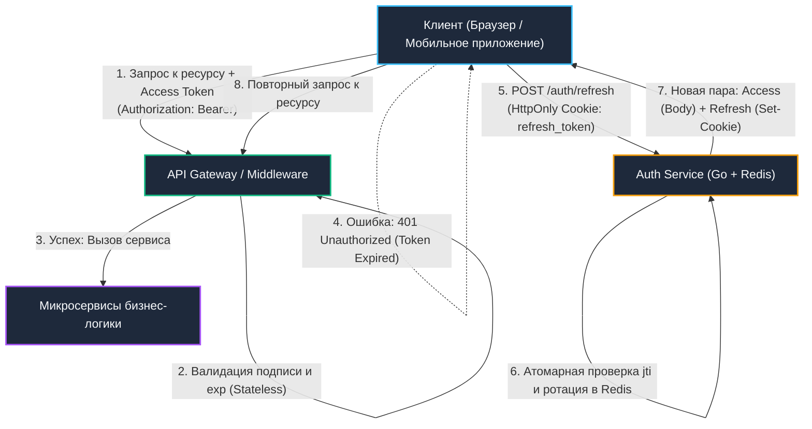

# 4. Access и Refresh токены: Архитектура, ротация и механическое сочувствие

> *"Complexity is that property of software which makes it hard to understand and expensive to change."*  
> — Брайан Керниган

В проектировании систем аутентификации инженеры неизбежно сталкиваются с дилеммой: как предоставить пользователю непрерывный и комфортный сеанс работы (не требуя вводить логин и пароль каждые десять минут), но при этом максимально сузить радиус поражения при возможной компрометации токена?

Классическая метафора из реального мира — электронный ключ в современном отеле. При регистрации вы предъявляете паспорт (мастер-пароль). Администратор сверяет данные с бронью и выдает вам пластиковую карту с RFID-меткой (**Access Token**). Эта карта мгновенно открывает турникет на входе, лифт и дверь вашего номера без звонка на ресепшен. Но ее срок действия ограничен — например, сутками. Если вы потеряете карту на пляже, злоумышленник сможет пользоваться ею считанные часы. 

Чтобы продлить пребывание, вам не нужно заново предъявлять паспорт — у вас есть квитанция с уникальным голографическим кодом в сейфе отеля (**Refresh Token**), по которой дежурный администратор аннулирует старую карту и программирует для вас новую. Если же кто-то попытается воспользоваться уже аннулированной квитанцией, служба безопасности немедленно блокирует весь номер и поднимает тревогу (**Token Family Revocation**).

В веб-системах на Go этот паттерн требует филигранной работы с конкурентностью, атомарными операциями в памяти и защитой сетевых протоколов.

---

## Философия разделения: безопасность против удобства



1. **Access Token:**
   - **Назначение:** Кратковременный пропуск к защищенным API-ресурсам.
   - **Время жизни:** Крайне малое — от 5 до 15 минут.
   - **Способ передачи:** Заголовок `Authorization: Bearer <token>`.
   - **Архитектура:** Абсолютно stateless. Проверяется на стороне любого микросервиса по локальному публичному ключу и полю `exp` без походов в базу данных.
   - **Риск:** Если токен перехвачен, окно атаки жестко ограничено минутами.

2. **Refresh Token:**
   - **Назначение:** Долгосрочный идентификатор авторизованной сессии пользователя.
   - **Время жизни:** Дни, недели или месяцы (например, 14–30 дней).
   - **Способ передачи:** Эндпоинт `/auth/refresh` через защищенную куку браузера или защищенное хранилище мобильной ОС (KeyStore/Keychain).
   - **Архитектура:** Строго stateful. Сохраняется в Redis или базе данных вместе с метаданными сессии (хэш токена, `jti`, идентификатор семьи токенов).

---

## Ротация токенов (Token Rotation) и Family Revocation

Просто выдать Refresh Token на месяц и обновлять по нему Access Token — небезопасно: если долгоживущий токен украден, злоумышленник будет месяцами выпускать свежие токены.

Поэтому современным стандартом является **строгая ротация (Refresh Token Rotation)**:
1. При каждом обращении к `/auth/refresh` сервер признает предъявленный Refresh Token **недействительным** и выпускает совершенно **новую пару токенов** (Access + Refresh).
2. Если в хранилище поступает запрос с токеном, который **уже был однажды использован**, сервер классифицирует это как критический инцидент информационной безопасности (Replay Attack). Это значит, что либо законный пользователь обновил токен, а атакующий украл старый из логов/трафика, либо наоборот — атакующий уже выполнил ротацию вперед легитимного клиента.
3. Сервер немедленно запускает процедуру **Family Revocation**: инвалидирует всю цепочку токенов данного пользователя, удаляет связанные ключи в Redis и принудительно завершает сеанс на всех устройствах.

---

## Под капотом: Атрибуты куки и защита сетевого стека

Хранить Refresh Token в веб-приложениях в хранилищах `localStorage` или `sessionStorage` — грубейшая ошибка безопасности. Любой скрипт, внедренный через атаку XSS (Cross-Site Scripting), может прочитать эти данные через глобальный объект `window.localStorage` и отправить злоумышленнику.

Единственное безопасное место для веб-клиентов — **`HttpOnly Cookie`**. Это не просто флаг в браузере, а прямое указание сетевому стеку и движку JavaScript изолировать память:

- **`HttpOnly`**: Запрещает доступ к куке через JavaScript API (`document.cookie`). Значение токена физически не попадает в память V8/SpiderMonkey, благодаря чему даже при успешной XSS-атаке злоумышленник не может украсть сам токен.
- **`Secure`**: Разрешает отправку куки исключительно по защищенному шифрованному каналу TLS 1.2/1.3. При попытке передать куку по открытому HTTP браузер на уровне сокетов блокирует отправку заголовка `Cookie`.
- **`SameSite=Strict` или `Lax`**: Надежная защита от межсайтовой подделки запросов (CSRF). Браузер проверяет `Origin`/`Referer` перед отправкой куки. При `SameSite=Strict` браузер никогда не прикрепляет куку при переходе со сторонних ресурсов, полностью нивелируя атаки с фишинговых сайтов.

```go
// ✅ Идиоматичная установка защищенной куки в Go
func setRefreshCookie(w http.ResponseWriter, token string, expires time.Time) {
	cookie := &http.Cookie{
		Name:     "refresh_token",
		Value:    token,
		Path:     "/auth",                 // 🔒 Кука уходит только на эндпоинты аутентификации
		Expires:  expires,
		HttpOnly: true,                     // 🔒 Защита от XSS (недоступно из JS)
		Secure:   true,                     // 🔒 Только через TLS/HTTPS
		SameSite: http.SameSiteStrictMode, // 🔒 Защита от CSRF
		Domain:   ".example.com",           // Опционально: для группы поддоменов
	}
	http.SetCookie(w, cookie)
}
```

---

## Идиоматичная реализация в Go: Singleflight и защита от гонок ротации

Представьте типичную ситуацию: пользователь открывает дашборд сервиса. Фронтенд параллельно отправляет 5 HTTP-запросов (`fetch`) за виджетами. Все 5 запросов одновременно получают `401 Unauthorized` (срок действия Access Token истек).

Если клиент наивно вызовет `/auth/refresh` 5 раз параллельно, на бэкенде возникнет классический **Race Condition**:
1. Запрос №1 первым долетает до сервиса авторизации, инвалидирует старый Refresh Token в Redis и возвращает новую пару токенов.
2. Запросы №2, №3, №4 и №5 приходят на микросекунду позже с тем же самым старым токеном.
3. Сервер видит повторное использование уже инвалидированного токена, считает это хакерской атакой, сжигает сессию пользователя и возвращает `403 Forbidden`! Пользователь внезапно «вылетает» из системы посреди рабочего процесса.

В Go эта проблема элегантно решается на двух уровнях:
1. **На клиенте:** Буферизация очереди запросов и запрет параллельного вызова `/refresh`.
2. **На бэкенде:** Использование примитива **`golang.org/x/sync/singleflight`** и короткого grace-периода в кэше. `Singleflight` подавляет дублирующие параллельные вызовы с одинаковым ключом и отдает всем горутинам результат единственного первого вызова:

```go
package auth

import (
	"context"
	"errors"
	"fmt"
	"net/http"
	"sync"
	"time"

	"golang.org/x/sync/singleflight"
)

type RefreshHandler struct {
	store  RefreshTokenStore // Интерфейс к хранилищу Redis/DB
	issuer TokenIssuer
	sfg    singleflight.Group
	mu     sync.Mutex
}

func (h *RefreshHandler) ServeHTTP(w http.ResponseWriter, r *http.Request) {
	// 1. Извлечение куки refresh_token
	rtCookie, err := r.Cookie("refresh_token")
	if err != nil || rtCookie.Value == "" {
		http.Error(w, "missing refresh token", http.StatusUnauthorized)
		return
	}

	// 2. Подавление параллельных запросов через singleflight
	// Если клиент отправил 20 параллельных запросов с одним токеном,
	// тело функции выполнится строго 1 раз на ядре CPU!
	key := fmt.Sprintf("rotate_%s", rtCookie.Value)
	result, err, _ := h.sfg.Do(key, func() (any, error) {
		return h.rotateToken(r.Context(), rtCookie.Value)
	})
	if err != nil {
		h.handleRotationError(w, err)
		return
	}

	tokens := result.(*TokenPair)

	// 3. Установка новой защищенной куки и выдача Access-токена
	setRefreshCookie(w, tokens.Refresh, tokens.ExpiresAt)
	w.Header().Set("Authorization", "Bearer "+tokens.Access)
	w.WriteHeader(http.StatusOK)
}

func (h *RefreshHandler) rotateToken(ctx context.Context, oldToken string) (*TokenPair, error) {
	// Атомарная проверка и удаление в Redis через EVAL (Lua) или MULTI/EXEC
	ok, err := h.store.InvalidateAndCheck(ctx, oldToken)
	if err != nil {
		return nil, fmt.Errorf("store check: %w", err)
	}
	if !ok {
		return nil, errors.New("token already used or expired")
	}

	// Генерация новой пары токенов
	newPair, err := h.issuer.IssuePair(ctx, oldToken)
	if err != nil {
		return nil, fmt.Errorf("issue pair: %w", err)
	}

	// Сохранение нового Refresh Token с TTL
	if err := h.store.Save(ctx, newPair.Refresh, newPair.ExpiresAt); err != nil {
		return nil, fmt.Errorf("save new token: %w", err)
	}

	return newPair, nil
}

func (h *RefreshHandler) handleRotationError(w http.ResponseWriter, err error) {
	clearRefreshCookie(w)
	http.Error(w, "session revoked", http.StatusUnauthorized)
}
```

---

> [!warning] Ловушка / Gotcha: Гонка ротации и "разорванные" сессии
> Если мобильный клиент делает 5 параллельных запросов и получает `401` на Access Token, он одновременно отправит 5 запросов на `/refresh`. Без `singleflight` или блокировки по `jti` сервер валидирует первый токен, инвалидирует его в БД, выдаст новую пару. Оставшиеся 4 запроса получат `403 "token already used"`. Клиент сочтёт сессию невалидной и принудительно разлогинит пользователя.
> 
> **Решение:** Сервер должен кэшировать результат ротации на 1–2 секунды или использовать `singleflight` с ключом по хешу старого токена, возвращая одну и ту же новую пару всем параллельным запросам в пределах короткого окна.

---

## Архитектура высокой нагрузки: память, Redis и P99 латентность

Ротация токенов — это точка централизованной синхронизации в распределенной системе. Каждое обновление требует:
1. **Сетевого round-trip к Redis:** Атомарные команды `SETNX`, `EVAL` (Lua) или транзакция `MULTI/EXEC` для исключения гонок.
2. **Системных вызовов сокета:** Системные вызовы `write` и `read` в сетевой подсистеме Linux.
3. **Криптографических расчетов:** Генерация случайных солей из `/dev/urandom`, расчет цифровой подписи.

При нагрузках в тысячи запросов в секунду пакет `net/http` непрерывно выделяет структуры `http.Cookie`, `url.Values` и заголовки в куче. Это провоцирует частые циклы `Minor GC` и деградацию хвостовой задержки на перцентилях `P50/P99`.

**Инженерные приемы оптимизации:**
1. **Локальное кэширование ротации:** После успешной ротации сохраняйте новую пару токенов в сверхбыстром локальном кэше в оперативной памяти (например, потокобезопасная `sync.Map` или библиотека `Ristretto`) на 1–2 секунды. Любые повторные обращения с тем же старым токеном в течение этого интервала мгновенно получают готовый ответ без обращения к Redis!
2. **Пул соединений и конвейеризация (Pipelining):** Используйте настроенный пул подключений `redis.Pool` с флагом `Wait=true`. Пакетная отправка команд валидации и сохранения через Lua-скрипт сокращает количество `syscall write/read` к сокету с двух до одного и минимизирует переключения контекста.
3. **Мягкое удаление (TTL вместо DEL):** Вместо немедленного удаления старого токена командой `DEL` используйте команду `EXPIRE` с коротким TTL (например, время жизни Access Token + 5 секунд). Это устраняет гонки при асинхронной репликации в кластерах Redis Sentinel / Redis Cluster.

---

> [!tip] Собеседование
> **Вопрос:** «Как защитить систему от утечки Refresh Token, если злоумышленник скопировал куку до момента ее ротации?»  
> 
> **Ответ кандидата Senior-уровня:**  
> «Защита строится на комплексном эшелонировании:  
> 1. **Ротация с отслеживанием семьи токенов (Family Tracking):** При каждом обновлении генерируется новый `jti` (JWT ID), связанный ссылкой с предыдущим. Если старый `jti` повторно предъявляется после того, как уже был создан новый токен, система фиксирует replay-атаку и мгновенно отзывает всю семью токенов.  
> 2. **Привязка к цифровому отпечатку (Device Fingerprinting):** На сервере сохраняется хэш комбинации `User-Agent`, диапазона `IP` или TLS-отпечатка клиента (JA3/JA4). При резкой смене отпечатка запрос на обновление отклоняется.  
> 3. **Ограничение времени неактивности:** Задается жесткий скользящий таймаут: если пользователь не проявлял активности более 30 дней, сессия полностью сгорает и запрашивается ввод пароля.  
> 4. **Корректная логика мобильного клиента:** При получении `401` клиентский HTTP-интерцептор ставит все исходящие запросы на паузу, выполняет ровно один запрос на `/auth/refresh` и затем возобновляет очередь с новым токеном».

---

## Итог

1. **Разделение сфер ответственности:** Краткосрочный stateless Access Token обеспечивает мгновенную и масштабируемую авторизацию в микросервисах; долгосрочный stateful Refresh Token дает управляемость и централизованный контроль сессий.
2. **Изоляция в памяти:** Единственным легитимным местом хранения Refresh Token в веб-интерфейсах являются куки с флагами `HttpOnly, Secure, SameSite`. Прямой доступ через JavaScript категорически исключен.
3. **Механическое сочувствие к параллелизму:** Параллельные запросы на обновление должны дедуплицироваться через `singleflight` и атомарные транзакции Redis (`EVAL` / `MULTI/EXEC`) с коротким grace-периодом для предотвращения разрыва пользовательских сессий.
4. **Обнаружение компрометации:** Стратегия Token Family Revocation позволяет надежно нейтрализовать украденные сессии в момент первой же попытки их повторного применения.

В следующей лекции мы поднимемся на уровень межсистемной интеграции и разберем, как делегировать авторизацию внешним провайдерам с помощью федеративных протоколов: [[5. OAuth 2.0 и OpenID Connect]].