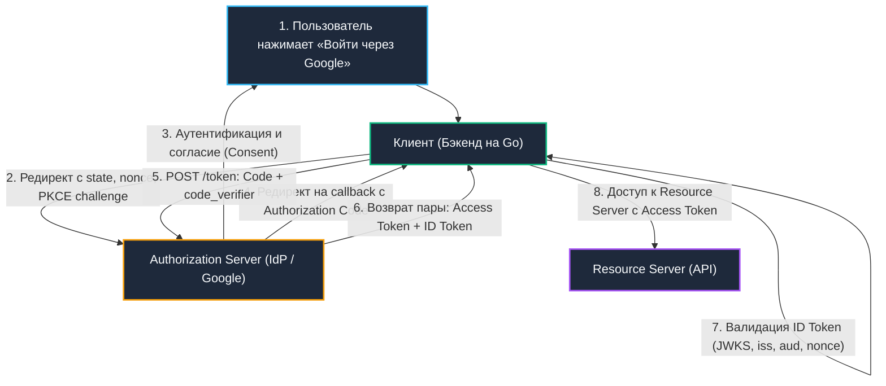

# 5. OAuth 2.0 и OpenID Connect: Архитектура делегирования и федеративная идентификация

> *«Цель абстракции — не быть расплывчатой, а сформировать новый семантический уровень, на котором можно достичь абсолютной точности».*    
> — Эдсгер Дейкстра

Среди бэкенд-разработчиков существует стойкое заблуждение: считать OAuth 2.0 протоколом входа в систему (аутентификации). Это фундаментальная архитектурная ошибка.

Чтобы раз и навсегда уяснить границу, обратимся к классической аналогии из реальной жизни — **ключу для парковщика (Valet Key)**:
- Когда вы приезжаете в отель и передаете автомобиль парковщику, вы не отдаете ему связку ключей от своей квартиры, сейфа и кошелек с документами. Вы передаете ему специальный служебный ключ, который позволяет завести мотор и проехать 50 метров до парковочного места, но физически не может открыть багажник или перчаточный ящик. Это и есть **OAuth 2.0**: фреймворк **делегирования прав доступа (авторизации)**. Он отвечает на вопрос: *«Имеет ли этот сторонний сервис право читать мои контакты в течение одного часа?»*.
- Но парковочный ключ ничего не говорит о том, кто сидит за рулем — владелец машины, его родственник или угонщик. Чтобы удостоверить личность водителя, офицер полиции на посту просит предъявить паспорт с фотографией и голографической печатью. Это **OpenID Connect (OIDC)**: слой идентификации поверх OAuth 2.0, стандартизирующий выпуск подписанного паспорта личности (**ID Token**). Он отвечает на вопрос: *«Кто этот человек?»*.

Для Senior-инженера понимание этой разницы критично: путаница между ними порождает уязвимости типа `confused deputy` (подмена доверенного лица) или `token leakage` (утечка токенов через клиентские каналы).

---

## Делегирование доступа и федеративная идентификация



1. **Authorization Server (IdP):** Сервер авторизации (Identity Provider), хранящий учетные записи пользователей и выпускающий криптографические токены.
2. **Resource Server:** Ваш микросервис или сторонний API, хранящий защищенные бизнес-данные.
3. **Client:** Ваше Go-приложение, запрашивающее доступ к ресурсам от имени пользователя.
4. **Resource Owner:** Сам конечный пользователь.

---

## Гранты: от Implicit к Authorization Code с PKCE

Исторически спецификация OAuth 2.0 (RFC 6749) предусматривала несколько сценариев выдачи полномочий (Grant Types). Однако эволюция атак на веб-приложения привела к тому, что в современных системах допустимы только два типа:

1. **Authorization Code + PKCE (Proof Key for Code Exchange):**  
   Абсолютный золотой стандарт для всех типов приложений (Web, SPA, Mobile).  
   Вместо прямой выдачи токенов браузеру сервер возвращает кратковременный `Authorization Code`. Затем клиент на защищенном бэкенд-канале обменивает этот код на токены.  
   Расширение **PKCE** (RFC 7636) нейтрализует атаки перехвата кода через кастомные URI-схемы в мобильных ОС. Клиент генерирует случайную энтропийную строку `code_verifier`, вычисляет ее хэш SHA-256 (`code_challenge`) и отправляет вызов на сервер. При обмене кода сервер требует предъявить `code_verifier` и проверяет совпадение.
2. **Client Credentials:**  
   Сценарий для межсерверного взаимодействия (Machine-to-Machine, M2M). Здесь нет пользователя — сервис аутентифицирует сам себя с помощью `client_id` и `client_secret` (либо с помощью взаимного TLS — `mTLS/MTLS`).

> [!warning] Ловушка / Gotcha: Implicit Grant и ROPC признаны устаревшими
> **Implicit Grant и Resource Owner Password Credentials (ROPC) признаны устаревшими**  
> Передача токена в URL-фрагменте (`#access_token=...`) делает его доступным в истории браузера, логах прокси и через заголовок `document.referrer`. ROPC требует ввода пароля напрямую в клиентское приложение, ломая модель доверия и отключая MFA. В современных кодобазах их использование — маркер архитектурной халатности.

---

## OIDC: Аутентификация поверх авторизации

OpenID Connect надстраивает над OAuth 2.0 стандартизированный формат удостоверения личности:

- **`id_token` vs `access_token`:**  
  `id_token` — это строго структурированный JWT, предназначенный **для вашего клиентского приложения**. Он сообщает, кто вошел в систему (`sub`), кто выдал токен (`iss`), для кого он выпущен (`aud`) и когда истекает (`exp`).  
  `access_token` — это непрозрачный токен (Opaque) или JWT, предназначенный исключительно **для ресурсного сервера**. Клиентскому приложению запрещено полагаться на структуру Access-токена!
- **Параметр `nonce`:**  
  Криптографическая случайная строка, генерируемая клиентом перед отправкой пользователя на форму входа. Провайдер обязан встроить этот же `nonce` в финальный `id_token`. При проверке токена сервер сверяет `nonce` с сохраненным в сессии значением, что на 100% исключает атаки повторного воспроизведения (Replay Attacks).
- **Служба Discovery (`/.well-known/openid-configuration`):**  
  Стандартизированный JSON-манифест провайдера. Он содержит адреса `authorization_endpoint`, `token_endpoint`, URL набора публичных ключей **`JWKS`** (`jwks_uri`) и перечень поддерживаемых алгоритмов подписи.

---

## Идиоматичная реализация в Go: oauth2 и coreos/go-oidc

В экосистеме Go базовая связка строится на двух проверенных библиотеках: `golang.org/x/oauth2` (управление потоком редиректов и обмена токенов) и `github.com/coreos/go-oidc/v3/oidc` (криптографическая верификация ID-токенов).

```go
package oidc

import (
	"context"
	"crypto/rand"
	"encoding/base64"
	"errors"
	"fmt"
	"net/http"
	"time"

	"github.com/coreos/go-oidc/v3/oidc"
	"github.com/golang-jwt/jwt/v5"
	"golang.org/x/oauth2"
	"golang.org/x/oauth2/google"
)

type IDTokenVerifier struct {
	verifier *oidc.IDTokenVerifier
	provider *oidc.Provider
}

func NewVerifier(ctx context.Context, issuerURL string, clientID string) (*IDTokenVerifier, error) {
	// 🔒 Автоматическая загрузка /.well-known/openid-configuration
	provider, err := oidc.NewProvider(ctx, issuerURL)
	if err != nil {
		return nil, fmt.Errorf("oidc provider init: %w", err)
	}

	// 🔒 Верификатор автоматически загружает JWKS, проверяет aud, exp, iss
	config := &oidc.Config{
		ClientID: clientID,
	}

	return &IDTokenVerifier{
		provider: provider,
		verifier: provider.Verifier(config),
	}, nil
}

// VerifyAndExtract валидирует ID Token и извлекает Claims
func (v *IDTokenVerifier) VerifyAndExtract(ctx context.Context, rawIDToken string, expectedNonce string) (*oidc.UserInfo, error) {
	// 1. Криптографическая проверка подписи через JWKS (RSA/ECDSA)
	idToken, err := v.verifier.Verify(ctx, rawIDToken)
	if err != nil {
		return nil, fmt.Errorf("token verification failed: %w", err)
	}

	// 2. Проверка nonce (защита от replay-атак)
	var claims struct {
		Nonce string `json:"nonce"`
	}
	if err := idToken.Claims(&claims); err != nil {
		return nil, fmt.Errorf("parse nonce claim: %w", err)
	}

	if claims.Nonce != expectedNonce {
		return nil, errors.New("nonce mismatch: potential replay attack")
	}

	// 3. Извлечение стандартного профиля UserInfo
	userInfo, err := v.provider.UserInfo(ctx, oauth2.StaticTokenSource(&oauth2.Token{
		AccessToken: idToken.AccessToken,
	}))
	if err != nil {
		return nil, fmt.Errorf("fetch userinfo: %w", err)
	}

	return userInfo, nil
}

// GenerateSecureState создаёт криптографически стойкое состояние
func GenerateSecureState() (string, error) {
	b := make([]byte, 32)
	if _, err := rand.Read(b); err != nil {
		return "", fmt.Errorf("rand read: %w", err)
	}
	return base64.URLEncoding.EncodeToString(b), nil
}
```

---

> [!info] Под капотом: Как x/oauth2 управляет токенами и соединением
> **Как `x/oauth2` управляет токенами и соединением**  
> Библиотека обёртывает `http.Client` через `Transport`, который автоматически intercept-ит запросы. При `401 Unauthorized` или истечении `exp`, транспорт блокирует горутины, выполняет один запрос к `TokenURL` для обновления (используя `sync.Mutex` внутри), кеширует новый токен в памяти процесса и повторяет исходный запрос. Это предотвращает `thundering herd` при истечении токена у тысяч одновременных клиентов, но создаёт блокировку на время `syscall` к провайдеру. В высоконагруженных микросервисах рекомендуется использовать `singleflight` поверх `oauth2.TokenSource` для дедупликации запросов рефреша.

---

## Механическое сочувствие: сеть, TLS и аллокации памяти

Взаимодействие с внешним IdP — тяжелая распределенная операция. Рассмотрим, что происходит под капотом рантайма Go:

1. **Накладные расходы сетевого стека (TLS Handshake Overhead):**  
   Каждое первичное обращение к эндпоинтам `/authorize` или `/token` провайдера требует полноценного рукопожатия TLS 1.3: на уровне ОС это несколько системных вызовов `syscalls` (`connect`, `write`, `read`), вычисление криптографических ключей Диффи-Хеллмана (`ECDHE`). Без настройки пула постоянных соединений (`Keep-Alive`) каждый обмен кодами добавляет от 20 до 100 мс физической задержки.
2. **Кэширование JWKS и нагрузка на сеть:**  
   Публичные ключи провайдера (`JWKS`) меняются редко (раз в недели или месяцы). Делать `DNS resolution` и запрашивать JWKS по HTTP на каждый входящий токен недопустимо — это перегрузит сеть и создаст огромное давление на GC (`GC pressure`) из-за аллокаций структур `http.Request` и `http.Response`. Библиотека `oidc` кэширует ключи в оперативной памяти и инвалидирует их только при встрече неизвестного `kid` (Key ID).
3. **Парсинг токенов и аллокации в куче:**  
   Вызовы `jwt.Parse` и `json.Unmarshal` декодируют метаданные и утверждения в структуры Go. Для оптимизации критических путей применяются легковесные парсеры вроде `gopkg.in/square/go-jose.v2` и пулы предвыделенных буферов `sync.Pool`.
4. **Хранение временного состояния (`state` / `nonce`):**  
   Параметры `state` и `nonce` должны сохраняться в безопасном распределенном хранилище (Redis) с коротким временем жизни (TTL 5–10 минут). Это защищает приложение от CSRF-атак и предотвращает рассинхронизацию при наличии нескольких инстансов бэкенда за балансировщиком.

---

## Подводные камни и ловушки (Gotchas)

1. **Несоответствие аудитории (`aud` Mismatch):**  
   Поле `aud` (Audience) в `id_token` обязано строго совпадать с вашим `client_id`. Если ваш сервис принимает ID-токены с чужим `aud`, злоумышленник может получить легитимный токен в другом, менее защищенном приложении того же провайдера, и войти под чужим аккаунтом в ваш сервис!
2. **Рассинхронизация системных часов (Clock Skew):**  
   Срок действия токена проверяется сравнением поля `exp` с текущим системным временем. Если часы серверов в вашем кластере разойдутся с серверами Google/Microsoft даже на пару минут, все валидные токены будут отвергнуты как просроченные. Настраивайте утилиты синхронизации времени `ntpd` или `chronyd` на всех нодах, либо используйте параметр `oidc.Config{TimeNow: customTimeFunc}` с небольшим допустимым зазором (leeway).
3. **Утечка `access_token` в логи:**  
   Никогда не выводите полный HTTP-запрос в логи через `httputil.DumpRequest` на продакшене. Токены в заголовках `Authorization` попадут в ElasticSearch/Loki, скомпрометировав сессии пользователей.
4. **Энтропия `code_verifier` в PKCE:**  
   Спецификация RFC 7636 требует строки длиной от 43 до 128 символов с высокой криптографической энтропией. Генерация через псевдослучайный `math/rand` предсказуема и полностью компрометирует защиту PKCE. Используйте исключительно `crypto/rand`.

---

> [!tip] Собеседование
> **Вопрос:** «Почему нельзя использовать только `access_token` для аутентификации пользователя в OIDC, и что произойдет, если провайдер изменит алгоритм подписи?»  
> 
> **Ответ кандидата Senior-уровня:**  
> «1. `access_token` — это непрозрачный токен авторизации для ресурсного сервера. Спецификация не гарантирует наличие в нем полей идентичности пользователя (`sub`, `iss`, `auth_time` или `nonce`). Клиентский сервис не имеет права его парсить. Для идентификации предназначен строго стандартизированный `id_token`.  
> 2. Если провайдер перейдет с `RS256` на более современный `ES256`, клиент с жестко захардкоженным `alg` в парсере упадет с ошибкой валидации. Грамотная реализация динамически вычитывает поддерживаемые алгоритмы через эндпоинт `/.well-known/openid-configuration` и адрес `jwks_uri`, сверяя их с белым списком безопасных алгоритмов (`RS256`, `ES256`)».

---

## Итог

1. **Четкое разделение концепций:** OAuth 2.0 делегирует полномочия (авторизация); OpenID Connect удостоверяет личность субъекта (аутентификация).
2. **Безопасные гранты:** Для клиентских приложений единственным промышленным стандартом является `Authorization Code + PKCE`. Устаревшие гранты `Implicit` и `ROPC` запрещены к использованию.
3. **Строгая криптографическая проверка:** Верификация ID-токена в Go обязана включать проверку подписи по актуальному `JWKS`, сопоставление `aud`, `iss`, `exp` и строгую проверку одноразового параметра `nonce`.
4. **Механическое сочувствие к сети:** Управляйте сетевыми задержками через `Keep-Alive`, кэшируйте публичные ключи в памяти, синхронизируйте системное время через `chronyd` и защищайте токены от утечек в логи. Рассинхронизация часов, несоответствие `aud` и слабая энтропия `state/nonce` — типичные причины продакшен-инцидентов.

Мы разобрались, как пользователь попадает в систему и подтверждает свою личность. Но как разграничить его права внутри приложения между тысячами ресурсов и действий?

В следующей лекции мы детально исследуем модели разграничения доступа: [[6. RBAC, ABAC модели]].