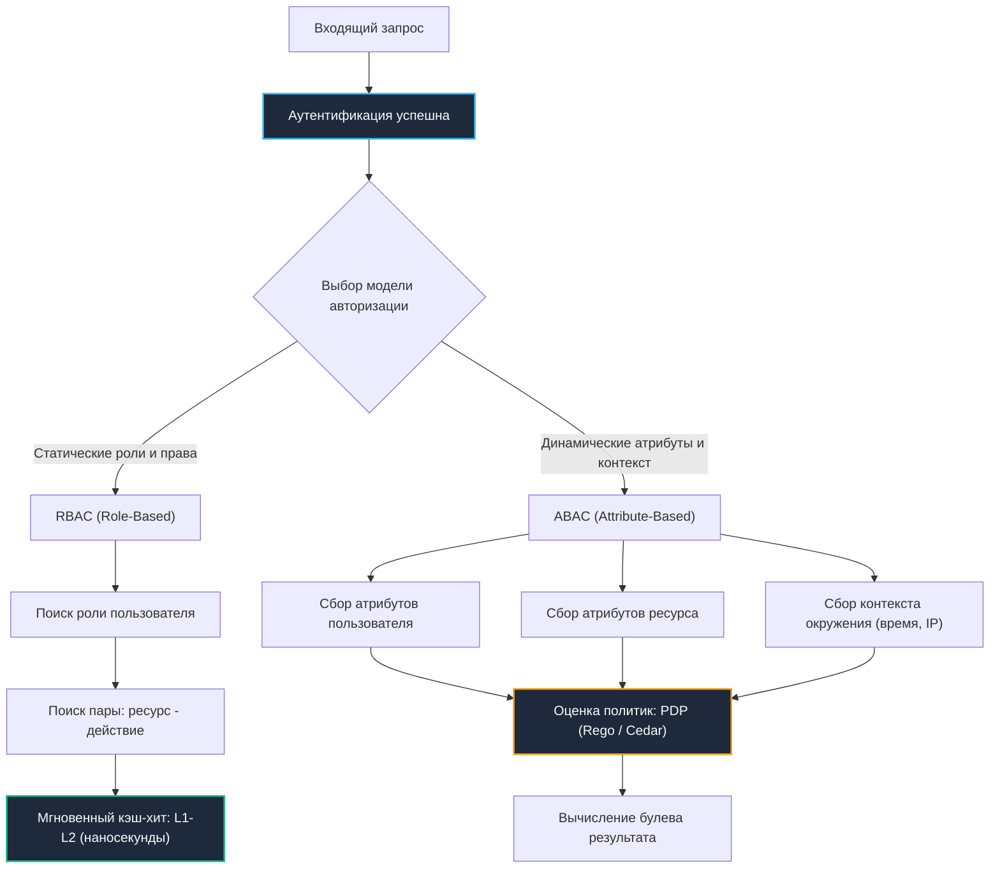

# 6. Модели контроля доступа: RBAC, ABAC и механическое сочувствие к кэшу

> *«Существуют два метода проектирования архитектуры: первый — сделать ее настолько прозрачной, чтобы дефектов заведомо не было; второй — сделать ее настолько запутанной, чтобы не было видно явных дефектов».*    
> — Сэр Чарльз Энтони Ричард Хоар

После того как личность пользователя надежно установлена (аутентификация), бэкенд встает перед вторым фундаментальным вопросом: **что именно этому пользователю разрешено делать?** Это зона ответственности авторизации (Authorization / Access Control).

В архитектуре распределенных систем выбор модели контроля доступа определяет не только гибкость бизнес-логики, но и физический профиль производительности сервера: нагрузку на сборщик мусора Go, частоту промахов в аппаратном кэше процессора (CPU Cache Misses) и накладные расходы сетевых вызовов.

Чтобы осязаемо прочувствовать разницу между двумя ключевыми парадигмами — **RBAC** и **ABAC**, представим систему допуска на охраняемый ядерный объект:
- **RBAC (Role-Based Access Control):** Цветной бейдж на шее сотрудника. Уборщик (`viewer`), лаборант (`editor`), главный инженер (`admin`). Охранник на турникете смотрит только на цвет пластика: «Красный бейдж имеет доступ к пульту управления? Да». Проверка мгновенна, не требует звонков и укладывается в доли наносекунды (прямой аналог попадания в L1-кэш CPU).
- **ABAC (Attribute-Based Access Control):** Многостраничный протокол спецпропуска. Проверяется не просто статус человека, а совокупность динамических условий: «Является ли сотрудник начальником смены **И** создана ли аварийная заявка менее 30 дней назад **И** входит ли он в здание в рабочие часы с 08:00 до 20:00 **И** совпадает ли его геопозиция по GPS с периметром объекта?». Гибкость колоссальная, но каждый шаг требует сбора контекста, опроса внешних датчиков и вычисления сложных логических предикатов.

---

## Выбор модели контроля доступа: скорость против гибкости



---

## RBAC: Матрица прав и кэш-локальность

В модели **RBAC** пользователю присваивается одна или несколько дискретных ролей (`admin`, `editor`, `viewer`). Каждой роли жестко сопоставлен набор разрешений в формате `(ресурс:действие)`.

Главное инженерное преимущество RBAC — абсолютная детерминированность. Проверка сводится к элементарному поиску в памяти со сложностью $O(1)$.

```go
package authz

import (
	"context"
	"errors"
	"sync"
)

// RBACChecker реализует матрицу прав доступа
type RBACChecker struct {
	mu sync.RWMutex
	// role -> resource -> action -> allowed
	policies map[string]map[string]map[string]bool
}

func NewRBACChecker() *RBACChecker {
	return &RBACChecker{
		policies: make(map[string]map[string]map[string]bool),
	}
}

// AddPolicy поточно-безопасно конфигурирует матрицу прав
func (r *RBACChecker) AddPolicy(role, resource, action string) {
	r.mu.Lock()
	defer r.mu.Unlock()

	if r.policies[role] == nil {
		r.policies[role] = make(map[string]map[string]bool)
	}
	if r.policies[role][resource] == nil {
		r.policies[role][resource] = make(map[string]bool)
	}
	r.policies[role][resource][action] = true
}

// Check проверяет наличие разрешения за минимальное число тактов CPU
func (r *RBACChecker) Check(ctx context.Context, role, resource, action string) error {
	r.mu.RLock()
	defer r.mu.RUnlock()

	// 🔒 Чтение структуры вложенных мап
	if resMap, resOk := r.policies[role]; resOk {
		if actMap, actOk := resMap[resource]; actOk && actMap[action] {
			return nil
		}
	}

	return errors.New("forbidden: insufficient permissions")
}
```

---

> [!info] Под капотом: Влияние вложенных мап на CPU и кэш
> **Влияние вложенных мап на CPU и кэш**  
> Структура `map[string]map[string]map[string]bool` в Go реализована как указатель на `hmap`. Каждый уровень вложенности — это новый `hmap`, расположенный в куче произвольным образом. При вызове `Check` процессор делает 3-4 разыменования указателей, что с высокой вероятностью приводит к промаху кэша (`cache miss`) и загрузке данных из RAM. Для высоконагруженных систем (50к+ RPS) это увеличивает латентность на 15-30 нс на каждый запрос.  
> 
> **Оптимизация:** Сериализовать тройку `(роль, ресурс, действие)` в один ключ или использовать отсортированный срез структур с бинарным поиском. Это упаковывает данные в смежные участки памяти, повышая hit-rate L1/L2 кэша.

---

## ABAC: Динамическая оценка и цена вычислений

Когда в системе появляются требования вида:  
*«Менеджер может редактировать документ, только если документ принадлежит его департаменту, создан менее 30 дней назад, а запрос отправлен с корпоративного IP в рабочие часы»*, — модель RBAC бессильна. Попытка выразить это через роли приводит к взрывному размножению ролей («ролевой взрыв» / Role Explosion): `manager_dep_finance_office_hours` и т.д.

Здесь на сцену выходит **ABAC** (Attribute-Based Access Control). Решение о допуске вычисляется как строгая функция от предикатов:
$$P(\text{user\_attrs}, \text{resource\_attrs}, \text{action}, \text{env}) \to \text{bool}$$
(где `P(user_attrs, resource_attrs, action, env) -> bool`).

```go
package authz

import (
	"context"
	"time"
)

// ABACPolicy определяет интерфейс для динамической оценки прав
type ABACPolicy interface {
	Evaluate(ctx context.Context, req AccessRequest) (bool, error)
}

// AccessRequest аккумулирует контекст запроса, пользователя и ресурса
type AccessRequest struct {
	UserID      string
	UserRole    string
	UserDept    string
	ResourceID  string
	ResourceAge time.Duration
	Action      string
	ClientIP    string
	RequestTime time.Time
}

type SimpleABACPolicy struct{}

func (p *SimpleABACPolicy) Evaluate(ctx context.Context, req AccessRequest) (bool, error) {
	// 🔒 Многофакторная проверка атрибутов
	if req.UserRole != "manager" {
		return false, nil
	}
	if req.UserDept != getOwnerDept(req.ResourceID) {
		return false, nil
	}
	if req.ResourceAge > 30*24*time.Hour {
		return false, nil
	}
	if !isOfficeHours(req.RequestTime) {
		return false, nil
	}

	return true, nil
}

func getOwnerDept(resID string) string   { return "engineering" }
func isOfficeHours(t time.Time) bool     { return t.Hour() >= 9 && t.Hour() <= 18 }
```

В распределенном энтерпрайзе правила ABAC выносятся в выделенный компонент — **Policy Decision Point (PDP)**. Индустриальными стандартами стали движки **Open Policy Agent (OPA)** с декларативным языком **Rego**, а также библиотека **Amazon Cedar**. Интеграция с Go осуществляется либо через встраиваемый модуль **WASM**, либо через `gRPC/HTTP` вызовы к внешнему сервису.

---

> [!warning] Ловушка / Gotcha: Латентность и syscall-оверхед при внешнем PDP
> **Латентность и syscall-оверхед при внешнем PDP**  
> Если ABAC-оценка вынесена в отдельный микросервис (`OPA sidecar` или centralized PDP), каждый запрос авторизации превращается в сетевой вызов. В Go это означает:  
> 1. Аллокация `http.Request`/`Response` или gRPC-фреймов.  
> 2. Переключение контекста в `netpoll`, блокировка горутины в `syscall read/write`.  
> 3. Планировщик может создать новый `M` (тред ОС), если текущий заблокирован.  
> 4. Добавляется 2-10 мс сетевого round-trip. При 10к RPS это гарантированно упирается в лимит файловых дескрипторов или троттлинг CPU из-за переключений контекста.  
> 
> **Решение:** Локальный кэш политик с TTL, встраиваемый OPA (golang `opa/rego`), или гибридная модель (RBAC для частых проверок, ABAC только для критичных операций).

---

## Механическое сочувствие: ветвления, аллокации и GC

Сравним физические характеристики исполнения двух подходов на процессоре x86-64:

| Инженерный параметр | RBAC | ABAC |
|---|---|---|
| **Аллокации на запрос** | 0–1 (поиск по ключу в хэш-таблице) | Высокие (сбор `map[string]any`, динамические структуры атрибутов в куче) |
| **Предсказание ветвлений (Branch Prediction)** | Высочайшее (предсказуемые проверки `role == X`) | Низкое (сложное ветвящееся дерево условий, сбросы конвейера) |
| **Давление на GC (`GC pressure`)** | Минимальное (матрица живет в памяти статически) | Значительное (генерация сотен короткоживущих объектов) |
| **Синхронизация конкурентности** | `sync.RWMutex` или `atomic` указатель на матрицу | Зависит от движка (в OPA — lock-free индекс) |

Динамический сбор атрибутов для ABAC провоцирует лавину аллокаций. В рантайме Go это вызывает частые циклы `Minor GC` и фазы `Stop-The-World`, катастрофически деградируя перцентиль латентности `P99`.

Для спасения производительности в Go применяют пул переиспользуемых объектов `sync.Pool`:

```go
// ✅ Промышленный паттерн: пул запросов со строгим сбросом памяти
var reqPool = sync.Pool{
	New: func() any {
		return &AccessRequest{}
	},
}

func evaluateWithPool(ctx context.Context, policy ABACPolicy, rawUserID, rawRole, rawDept, resID, ip string) (bool, error) {
	// Извлекаем объект из пула
	req := reqPool.Get().(*AccessRequest)
	
	// Заполняем поля
	req.UserID = rawUserID
	req.UserRole = rawRole
	req.UserDept = rawDept
	req.ResourceID = resID
	req.ClientIP = ip
	req.RequestTime = time.Now()

	// 🔒 Важнейшая деталь: sync.Pool НЕ очищает поля автоматически!
	// Сброс состояния должен происходить перед возвратом в пул.
	defer func() {
		*req = AccessRequest{} // Зануляем структуру
		reqPool.Put(req)
	}()

	return policy.Evaluate(ctx, *req)
}
```

---

> [!tip] Собеседование
> **Вопрос:** «Как обработать ситуацию, когда политики доступа обновляются «на лету» в распределённом кластере из 50 инстансов, и при этом нельзя допустить окна несоответствия (`TOCTOU` — Time of Check to Time of Use)?»  
> 
> **Ответ кандидата Senior-уровня:**  
> «1. **Версионирование политик:** Каждая новая сборка правил получает уникальный монотонный `version_id` или криптографический хэш.  
> 2. **Атомарная замена в памяти (RCU-паттерн):** В Go создается новая неизменяемая структура правил. Затем она атомарно подменяется через `atomic.StorePointer` (или `atomic.Pointer[T]`). Запросы, начавшиеся до обновления, беспрепятственно завершаются по старому указателю, после чего старая матрица утилизируется сборщиком мусора `GC`.  
> 3. **Шина событий и Graceful Reload:** Событие обновления рассылается через `Pub/Sub` брокер (Redis или `NATS`). Инстансы выполняют `graceful reload`, исключая гонки и рассинхронизацию между нодами.  
> 4. **Идемпотентность оценки:** Функция авторизации обязана быть чистой функцией, не зависящей от изменяемого состояния во время своего исполнения».

---

## Гибридные подходы и стандарты индустрии

В высоконагруженных промышленных системах выбор «или-или» не работает. Индустриальным стандартом является **каскадная (эшелонированная) модель**:

1. **Быстрый путь (Fast Path — RBAC / ReBAC):**  
   Проверка статических прав и графа отношений (**ReBAC** — Relationship-Based Access Control, в духе Google Zanzibar: `user.owner_id == resource.creator_id` или `user.ID == document.OwnerID`) выполняется локально в Go-коде за микросекунды. Если доступ безусловно разрешен или запрещен — проверка мгновенно завершается.
2. **Медленный путь (Slow Path — ABAC):**  
   Если быстрого пути недостаточно, запрос передается локальному движку правил OPA (`opa/rego`).
3. **Кэширование результатов авторизации:**  
   Повторяющиеся проверки кэшируются на 1–5 секунд с помощью высокоэффективных in-memory кэшей (`hashicorp/golang-lru` или `dgraph/ristretto`), что срезает до 95% нагрузки на PDP.

Старые громоздкие стандарты вроде `XACML` в современном Go-бэкенде практически вытеснены OPA и протоколами `OAuth 2.0 Token Introspection`.

---

## Итог

1. **RBAC** обеспечивает феноменальную скорость за счет статической структуры, минимальных аллокаций и высокой кэш-локальности. Это дефолтный выбор для 90% задач бэкенда.
2. **ABAC** предоставляет безграничную гибкость контекстных правил, но требует платы процессорными тактами, аллокациями в куче и нагрузкой на GC.
3. **Механическое сочувствие к рантайму:** Избегайте глубоких вложенных мап `map[string]map[...]` во избежание промахов кэша CPU. Используйте пулы объектов `sync.Pool` и атомарную смену политик через `atomic.StorePointer`.
4. **Архитектурный компромисс:** Стройте каскадную модель — отсекайте большинство запросов локальным RBAC/ReBAC, делегируя встраиваемому ABAC-движку только сложные бизнес-проверки.

Как хранить сессионные данные пользователя на сервере, когда stateless-токенов недостаточно?  
В следующей лекции мы разберем классические и современные подходы к управлению сессиями: [[7. Session based auth]].