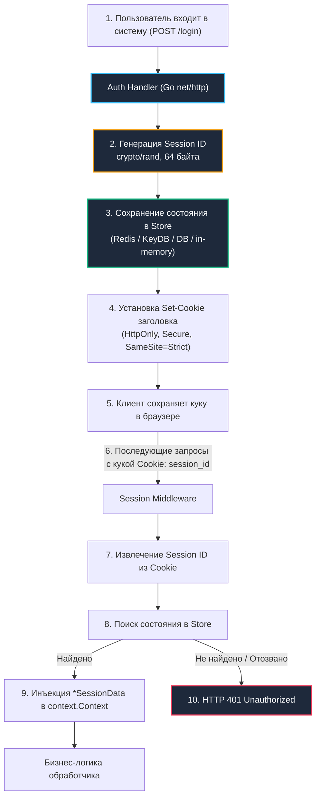

# 7. Сессионная аутентификация: Stateful-архитектура, безопасность кук и механическое сочувствие

> *«Самое важное достоинство программы заключается в том, воплощает ли она подлинные намерения своего пользователя».*    
> — К. А. Р. Хоар

В предыдущих лекциях мы исследовали мир токенов (JWT, OAuth 2.0), где главное знамя — **отсутствие состояния на сервере (stateless)**. Однако за эту независимость мы заплатили тяжелую цену: невозможность мгновенного отзыва скомпрометированного токена, раздутые заголовки и криптографическую нагрузку на каждое входящее соединение.

Существует фундаментальная альтернатива, проверенная десятилетиями промышленной эксплуатации, — **сессионная аутентификация (Stateful Session-Based Auth)**.

Физическая метафора из реального мира — **гардероб в оперном театре**:
- При входе вы сдаете тяжелое пальто, зонт и шляпу (все данные пользователя: профиль, права, роли, настройки). Гардеробщик вешает вещи на охраняемую вешалку за стойкой (серверное хранилище сессий) и выдает вам маленький латунный номерок (**Session ID**).
- Этот номерок не содержит ни грамма информации о том, чье это пальто и какого оно цвета. Это просто 32 байта криптографической случайности. Но пока номерок у вас в кармане — вы полноправный владелец вещей.
- Главное преимущество: если служба безопасности решает немедленно удалить нарушителя из зала, администратор просто выбрасывает номерок из реестра. При попытке предъявить номерок гардеробщик скажет: *«Такой сессии не существует»* (**HTTP 401**). Отзыв прав происходит **мгновенно и синхронно**, без ожидания истечения TTL токенов.

---

## Stateful-архитектура: контроль, отзыв и изоляция



В сессионной модели клиент не знает ничего, кроме абстрактной случайной последовательности байт, передаваемой через `Cookie` или заголовок `Authorization`. Вся бизнес-информация изолирована на бэкенде.

---

## Транспортный механизм: анатомия куки и браузерный стек

`Cookie` — это не просто строковый HTTP-заголовок, а строжайший контракт между сервером и браузером, контролируемый на уровне сетевого стека ОС:

1. **`HttpOnly`:**  
   Принудительно запрещает доступ к куке через клиентские скрипты (`document.cookie` или `XMLHttpRequest`). Браузер помещает значение куки в изолированный сегмент памяти, недоступный JavaScript-движку (V8 / SpiderMonkey). Даже в случае катастрофической XSS-уязвимости в приложении злоумышленник физически не сможет прочитать или экспортировать сессионный идентификатор.
2. **`Secure`:**  
   Гарантирует отправку куки строго поверх защищенного TLS-соединения. На уровне системных вызовов OpenSSL (`SSL_write`/`SSL_read`) браузер верифицирует шифрование канала. Любая попытка передачи по открытому протоколу HTTP немедленно блокируется — заголовок `Cookie` просто отбрасывается.
3. **`SameSite`:**  
   Фундаментальный барьер против атак межсайтовой подделки запросов (CSRF). 
   - `SameSite=Strict`: кука никогда не отправляется при переходах со сторонних ресурсов. Браузер сравнивает `Site` текущего окна и `Origin` запроса до вызова `syscall write` в сокет.
   - `SameSite=Lax`: разрешает отправку только при безопасных GET-переходах высшего уровня (нажатие на ссылку).
4. **`Domain` и `Path`:**  
   Жестко ограничивают скоуп видимости куки. Сервер обязан явно указывать `Path=/` или префикс `/api`, исключая отправку тяжелых сессионных заголовков при запросах к статическим файлам и картинкам на CDN.

> [!warning] Ловушка / Gotcha: Размер куки и фрагментация пакетов
> **Размер куки и фрагментация пакетов**  
> Заголовок `Cookie` ограничен ~4 КБ. Если вы начнёте хранить в сессии роли, права, настройки темы и кэшированные данные, размер вырастет, что приведёт к фрагментации на уровне TCP. Каждый дополнительный пакет добавляет задержку из-за ожидания подтверждения (`ACK`), увеличивая `P99` латентность на 10-20 мс.  
> 
> **Решение:** В куке хранить только `session_id`. Всё остальное выносить в серверное хранилище. Сессионный идентификатор должен быть строго случайным, без встроенных данных.

---

## Хранение состояния: от in-memory до распределённого кэша

| Архитектура хранилища | Достоинства | Недостатки | Влияние на рантайм Go |
|---|---|---|---|
| **In-memory (`map` / `sync.Map`)** | Нулевые задержки, предельная скорость | Утрата данных при перезапуске ноды, невозможность горизонтального масштабирования | Давление на сборщик мусора (`GC`), фрагментация кучи при миллионах сессий |
| **Распределенный кэш (`Redis/Memcached`)** | Идеальная горизонтальная масштабируемость, TTL, атомарность | Сетевой round-trip (0.5–2 мс), единая точка отказа без кластера | Блокировки горутин в `syscall read` через `netpoll`, сериализация структур |
| **Реляционная СУБД (`database/sql`)** | Абсолютная персистентность, транзакции, аудит | Высокая латентность, конкуренция за пул коннектов, нагрузка на диск | Зависание горутин при исчерпании пула `database/sql`, disk I/O contention |

В продакшене индустриальным стандартом является **распределенный кэш с TTL** (Redis Cluster или KeyDB), дополненный локальным микрокэшем в памяти сервера на 1–2 секунды для сглаживания всплесков нагрузки.

---

## Идиоматичная реализация в Go: middleware и store

Напишем чистую, типобезопасную и поточно-ориентированную реализацию сессионного middleware на стандартной библиотеке Go:

```go
package session

import (
	"context"
	"crypto/rand"
	"encoding/base64"
	"errors"
	"fmt"
	"net/http"
	"time"
)

var ErrSessionNotFound = errors.New("session not found or expired")

// SessionData хранит полное состояние пользователя на сервере
type SessionData struct {
	UserID    int64     `json:"user_id"`
	Roles     []string  `json:"roles"`
	CreatedAt time.Time `json:"created_at"`
	LastUsed  time.Time `json:"last_used"`
}

// SessionStore определяет контракт с хранилищем (Redis/DB)
type SessionStore interface {
	Get(ctx context.Context, id string) (*SessionData, error)
	Set(ctx context.Context, id string, data *SessionData, ttl time.Duration) error
	Delete(ctx context.Context, id string) error
}

// ctxKey защищает от коллизий ключей в context.Context
type ctxKey struct{}

func NewMiddleware(store SessionStore, cookieName string) func(http.Handler) http.Handler {
	return func(next http.Handler) http.Handler {
		return http.HandlerFunc(func(w http.ResponseWriter, r *http.Request) {
			cookie, err := r.Cookie(cookieName)
			if err != nil || cookie.Value == "" {
				// Кука отсутствует: запрос неавторизован, передаем дальше (если эндпоинт публичный)
				next.ServeHTTP(w, r)
				return
			}

			// Получаем сессию из хранилища
			session, err := store.Get(r.Context(), cookie.Value)
			if err != nil {
				if errors.Is(err, ErrSessionNotFound) {
					// 🔒 Сессия отозвана или протухла — принудительно очищаем куку в браузере
					clearSessionCookie(w, cookieName)
					next.ServeHTTP(w, r)
					return
				}
				http.Error(w, "internal auth error", http.StatusInternalServerError)
				return
			}

			// 🔒 Инжектируем указатель на сессию в контекст запроса
			ctx := context.WithValue(r.Context(), ctxKey{}, session)
			next.ServeHTTP(w, r.WithContext(ctx))
		})
	}
}

// GenerateSessionID генерирует криптографически стойкий идентификатор
func GenerateSessionID() (string, error) {
	b := make([]byte, 32) // 256 бит чистой энтропии
	if _, err := rand.Read(b); err != nil {
		return "", fmt.Errorf("crypto/rand: %w", err)
	}
	return base64.URLEncoding.EncodeToString(b), nil
}

func clearSessionCookie(w http.ResponseWriter, name string) {
	http.SetCookie(w, &http.Cookie{
		Name:     name,
		Value:    "",
		Path:     "/",
		Expires:  time.Unix(0, 0),
		HttpOnly: true,
		Secure:   true,
		SameSite: http.SameSiteStrictMode,
	})
}
```

---

## Под капотом: аллокации, гонки и сетевые вызовы

1. **`context.WithValue` и цепочка указателей:**  
   Каждый вызов `context.WithValue` порождает структуру `context.valueCtx` в куче. Внутри она содержит интерфейсный боксинг ключа и значения, а также указатель на родительский контекст. При 50 000 RPS это генерирует свыше 50 000 мелких аллокаций в секунду, загружая сборщик мусора `GC`.  
   *Оптимизация:* Всегда передавайте в контекст строго **указатель `*SessionData`**, а не структуру по значению, предотвращая глубокое копирование памяти.
2. **Сетевой стек и сокеты Redis (`net.Conn`):**  
   Драйверы `go-redis` или `redigo` оборачивают системный сокет `net.Conn`. Когда горутина запрашивает сессию, сетевой вызов блокируется в ожидании данных, и планировщик `G-M-P` переключает процессорный поток $M$ на другие задачи. Если пул соединений `redis.Pool` истощен, запросы выстраиваются в очередь. Обязательно настраивайте параметры пула: `MaxActive`, `Wait=true` и таймаут чтения `ReadTimeout < 50ms`.
3. **Сериализация сессионных структур:**  
   Стандартный пакет `encoding/json` использует рефлексию при каждом `json.Marshal`, выделяя промежуточные буферы. В системах высокой нагрузки для сохранения `SessionData` предпочтительнее использовать легковесный `msgpack`, бинарный `gob` или кодогенерацию на базе `vtprotobuf` / flatbuffers.

---

> [!warning] Ловушка / Gotcha: Session Fixation и параллельное обновление
> **Session Fixation и параллельное обновление**  
> Если после успешного логина не сгенерировать новый `session_id`, атакующий, заранее задавший куку, получит доступ к аутентифицированной сессии жертвы.  
> 
> **Решение:** Всегда вызывать `RegenerateID()` при смене привилегий (логин, смена роли, повышение прав). Удалять старую сессию из хранилища до установки новой.  
> 
> **Гонка обновлений:** Если два параллельных запроса пытаются обновить `LastUsed` или добавить данные в сессию, последний выигрывает. В Redis используйте `WATCH/MULTI/EXEC` или `EVAL` для атомарного обновления, либо проектируйте сессию как иммутабельную на чтение, а состояние писать через отдельные асинхронные потоки.

---

> [!tip] Собеседование
> **Вопрос:** «Как обеспечить согласованность сессий в кластере из 20 инстансов без единой точки отказа?»  
> 
> **Ответ кандидата Senior-уровня:**  
> «1. **Шардирование сессий:** Использовать распределенное хранилище с кластеризацией (`Redis Cluster` или `KeyDB`). Сессии шардируются по хэшу `session_id`, а не привязываются к конкретному серверу (no Sticky Sessions).  
> 2. **Разделение чтения и записи:** Использовать репликацию: чтение сессий можно масштабировать через `Read-Only Replicas`, а запись новых сессий и удаление направлять на узел `Master`.  
> 3. **Локальный микрокэш:** Реализовать локальный кэш на базе потокобезопасной `sync.Map` со сверхкоротким TTL (1–2 секунды) на каждом инстансе для снятия пиковой нагрузки с Redis.  
> 4. **Отказоустойчивость:** При падении мастер-узла протокол `Gossip` автоматически выбирает нового мастера за сотни миллисекунд.  
> 5. **Мониторинг метрик в Prometheus:** Непрерывный контроль метрик `active_connections`, `evicted_keys` и перцентилей задержки `latency_percentile`».

---

## Итог

1. **Бескомпромиссный контроль:** Сессионная аутентификация обеспечивает мгновенный синхронный отзыв прав и полный аудит сессий на бэкенде, превосходя stateless-токены в задачах с повышенными требованиями безопасности.
2. **Изоляция в браузере:** Куки с набором атрибутов `HttpOnly, Secure, SameSite` гарантируют защиту от XSS и CSRF атак на уровне системных вызовов ОС и движка браузера.
3. **Механическое сочувствие к рантайму:** В высоконагруженном Go-бэкенде передавайте в контекст только указатели `*SessionData`, тщательно настраивайте пулы подключений `redis.Pool` (`Wait=true`, `ReadTimeout`), и применяйте бинарную сериализацию `msgpack` / `gob`.
4. **Защита от атак:** Предотвращайте Session Fixation обязательным вызовом `RegenerateID()` при каждом логине и используйте транзакции `EVAL` / `WATCH/MULTI/EXEC` для исключения гонок обновления сессий.

---

Мы завершили фундаментальный разбор аутентификации и авторизации: от хеширования паролей и JWT до OAuth 2.0, RBAC/ABAC и stateful-сессий.

В следующем подразделе мы погрузимся в математический и инженерный фундамент современной безопасности — криптографические примитивы Go: [[1. Основы криптографии для backend]].