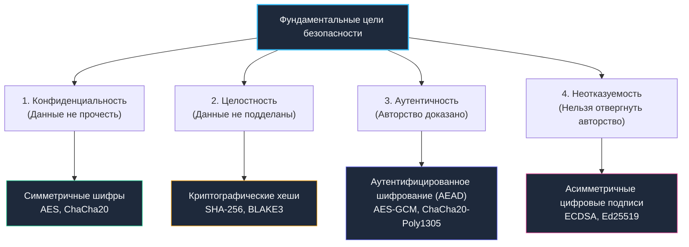

# 1. Основы криптографии для backend: Примитивы, гарантии и механическое сочувствие к железу

> *«В этом мире есть два рода криптографии: криптография, которая помешает вашей младшей сестре прочитать ваши файлы, и криптография, которая остановит правительственные спецслужбы».*    
> — Брюс Шнайер

Среди разработчиков бэкенда криптография часто воспринимается как сакральная магия: сложные формулы на эллиптических кривых, пугающие аббревиатуры и многостраничные спецификации NIST. Однако в реальной инженерной практике бэкенд-инженеру не нужно изобретать свои шифры — более того, попытка написать собственный криптографический алгоритм гарантированно приведет к катастрофе.

Задача инженера — обладать **механическим сочувствием к криптографическим примитивам**:
1. Понимать фундаментальные математические гарантии каждого инструмента (что именно он защищает — конфиденциальность, целостность или аутентичность).
2. Знать, как алгоритм исполняется на физическом кристалле процессора (задействует ли он специализированные инструкции `AES-NI`, провоцирует ли утечки через кэш CPU).
3. Понимать поведение рантайма Go: как чувствительные криптографические ключи хранятся в оперативной памяти, убегают ли они в кучу через Escape Analysis и стираются ли они после использования сборщиком мусора.

---

## Фундамент криптографии: четыре столпа безопасности



### Базовые криптографические примитивы и их свойства

Каждый примитив решает строго определенную задачу. Попытка применить инструмент не по назначению — частая причина критических уязвимостей:

1. **Симметричное шифрование:**  
   Использует один и тот же секретный ключ как для шифрования, так и для расшифровки. Отличается колоссальной скоростью (гигабайты в секунду на ядро благодаря аппаратным инструкциям). Применяется для шифрования баз данных «в покое» (Data at Rest) и высоконагруженных туннелей данных.  
   *В Go:* пакеты `crypto/aes`, `golang.org/x/crypto/chacha20`.
2. **Асимметричное шифрование:**  
   Оперирует математически связанной парой ключей: открытым (Public Key) и закрытым (Private Key). Шифрование выполняется публичным ключом, а расшифровать сообщение способен только держатель приватного ключа. Вычислительно на 3–4 порядка медленнее симметричного. Применяется для начального обмена сессионными ключами при установке защищенного соединения (TLS Handshake).  
   *В Go:* пакеты `crypto/rsa`, `crypto/ecdsa`, `crypto/ed25519`.
3. **Криптографические хеш-функции:**  
   Односторонние детерминированные преобразования произвольного массива байт в дайджест фиксированной длины. Они необратимы и обладают стойкостью к поиску коллизий. Они **не шифруют** данные и не предназначены для восстановления открытого текста!  
   *В Go:* пакеты `crypto/sha256`, `crypto/sha512`, `golang.org/x/crypto/blake2b`.
4. **Коды аутентификации сообщений (MAC / HMAC):**  
   Хеш-функция, скомбинированная с секретным ключом. Позволяет стороне, владеющей секретом, на 100% удостовериться, что сообщение не было модифицировано в пути транзита. Промышленным стандартом проверки вебхуков и токенов является `HMAC-SHA256`.

---

> [!info] Под капотом: Почему режимы шифрования критичны для безопасности?
> **Почему режимы шифрования критичны для безопасности?**  
> Блочные шифры (например, AES) работают с фиксированными блоками (16 байт). Режимы работы определяют, как блоки связываются между собой.  
> 
> `ECB (Electronic Codebook)` шифрует каждый блок независимо. Одинаковые открытые блоки дают одинаковые шифротексты. Это ломает конфиденциальность визуально и математически (хрестоматийный пример — «Пингвин Tux в режиме ECB», где очертания птицы отчетливо видны на зашифрованном изображении). В рантайме Go этот режим **отсутствует** в `crypto/cipher` именно из-за фундаментальной небезопасности.  
> 
> `GCM (Galois/Counter Mode)` использует счётчик для генерации ключевого потока и добавляет аутентификационный тег. Это обеспечивает конфиденциальность + целостность в одном проходе. В Go `cipher.NewGCM` использует аппаратные инструкции `PCLMULQDQ` и `AESNI` для вычисления тега Галуа, что делает его в 5-10 раз быстрее программной реализации и защищает от padding oracle атак.

---

## Энтропия и генерация случайных данных

Любая криптографическая система мгновенно становится тривиальной, если ключи, векторы инициализации (IV) или одноразовые соли (`nonce`) можно предсказать.

В бэкенде на Go существует две параллельные вселенные случайных чисел:
- **`math/rand` (и `math/rand/v2`):** Детерминированный генератор псевдослучайных чисел (PRNG). Он опирается на быстрые линейные конгруэнтные или PCG-формулы. Зная начальное зерно (seed) или перехватив несколько сгенерированных чисел, злоумышленник может на 100% вычислить все последующие значения. Он создан для моделирования Монте-Карло, тестов и игр, но **категорически непригоден для криптографии**.
- **`crypto/rand`:** Криптографически стойкий генератор случайных чисел (CSPRNG). В Linux он обращается к системному вызову `SYS_GETRANDOM` (или вычитывает виртуальное устройство ядра `/dev/urandom`). Ядро непрерывно аккумулирует аппаратную энтропию: микросекундные отклонения таймеров прерываний, фазовый шум кремниевых генераторов, тайминги дискового ввода-вывода и сетевых пакетов. Ядро смешивает эти шумы криптографической функцией ChaCha20/BLAKE2s и выдает непредсказуемый поток байт.

```go
package crypto_ops

import (
	"crypto/rand"
	"fmt"
	"io"
)

// GenerateSecureBytes возвращает криптографически стойкие случайные байты
func GenerateSecureBytes(n int) ([]byte, error) {
	b := make([]byte, n)
	// io.ReadFull гарантирует заполнение всего среза
	if _, err := io.ReadFull(rand.Reader, b); err != nil {
		// 🔒 В отличие от math/rand, crypto/rand может вернуть ошибку,
		// если системный вызов ядра завершился неудачей
		return nil, fmt.Errorf("failed to generate secure random bytes: %w", err)
	}
	return b, nil
}

// GenerateNonce создаёт 12-байтовый nonce для AES-GCM
func GenerateNonce() ([12]byte, error) {
	var nonce [12]byte
	_, err := rand.Read(nonce[:])
	return nonce, err
}
```

---

> [!warning] Ловушка / Gotcha: Блокировка в crypto/rand при загрузке
> **Блокировка в `crypto/rand` при загрузке**  
> На старых ядрах Linux (< 5.6) чтение `/dev/urandom` могло блокироваться до сбора начальной энтропии (`getrandom(2)` с флагом `0`). В рантайме Go при старте процесс может подвиснуть на 50-200 мс.  
> 
> **Решение:** В современных системах используйте `SYS_GETRANDOM` напрямую или убедитесь, что ядро обновлено. В контейнерах (Docker) без `--cap-add=SYS_ADMIN` пул энтропии инициализируется через `vDSO`, что исключает блокировки.

---

## Архитектура пакета crypto в Go: от интерфейсов к ассемблеру

Стандартная библиотека Go проектировалась под руководством ведущих криптографов и специалистов по безопасности (включая команду Google Security). Ее архитектура многослойна:

1. **Интерфейсный слой (`crypto/cipher`, `crypto/hmac`):** Описывает универсальные контракты `Block`, `Cipher`, `Hash`. Это чистый, переносимый код на Go.
2. **Референсная реализация (Portable Pure Go):** Запасной путь для архитектур без аппаратного ускорения (RISC-V, WebAssembly).
3. **Ассемблерные оптимизации (`crypto/internal/...`):** Высокопроизводительные ассемблерные файлы с директивами сборки компилятора `//go:build amd64` или `//go:build arm64`.

**Влияние на рантайм и процессор:**
- **Аппаратные инструкции `AES-NI / VAES`:** Современные процессоры Intel и AMD содержат специализированные микрокоманды (например, `AESENC`, `AESENCLAST`), выполняющие раунд шифрования прямо в регистрах за считанные такты. Без AES-NI шифрование вынуждено обращаться к программным таблицам подстановок (S-boxes) в оперативной памяти, что открывает фатальную брешь для атак по сторонним каналам (Cache Timing Attacks).
- **Аппаратные расширения `SHA Extensions`:** Специальные инструкции для ускорения хеширования SHA-256 в кремнии.
- **Вычисления за константное время (`crypto/subtle`):** Пакет реализует операции побитового сравнения без условных переходов, зависящих от секретных данных, предотвращая timing-атаки. Компилятор с агрессивными флагами оптимизации (`-l`, `-N`) не должен оптимизировать такие участки. В продакшене это также контролируется режимом `GOEXPERIMENT=strictfipsruntime`.

```go
package crypto_ops

import (
	"crypto/aes"
	"crypto/cipher"
	"fmt"
)

// EncryptAESGCM выполняет аутентифицированное шифрование данных.
// Возвращает шифротекст в формате: [12 байт Nonce][Шифротекст][16 байт Auth Tag]
func EncryptAESGCM(plaintext []byte, key []byte) ([]byte, error) {
	// 1. Инициализация блочного шифра AES
	block, err := aes.NewCipher(key)
	if err != nil {
		return nil, fmt.Errorf("aes cipher init: %w", err)
	}

	// 2. Генерация криптографически стойкого одноразового вектора (Nonce)
	nonce, err := GenerateNonce()
	if err != nil {
		return nil, fmt.Errorf("generate nonce: %w", err)
	}

	// 3. Создание режима GCM (Galois/Counter Mode)
	aesGCM, err := cipher.NewGCM(block)
	if err != nil {
		return nil, fmt.Errorf("gcm init: %w", err)
	}

	// 4. Seal шифрует открытый текст и вычисляет аутентификационный тег
	// Первый аргумент - целевой буфер, куда прикрепляется результат
	ciphertext := aesGCM.Seal(nonce[:], nonce[:], plaintext, nil)

	return ciphertext, nil
}
```

---

## Управление памятью и сборщик мусора (GC)

Криптография ставит перед рантаймом Go уникальные вызовы:

1. **Escape Analysis и утечки в кучу:** Большие буферы данных (`> 32 КБ`) или передача ключей через границы интерфейсов `interface{}` (например, `cipher.Block`) заставляют компилятор эвакуировать память из быстрого стека в кучу (heap), увеличивая нагрузку на `GC`.
2. **Очистка памяти (Memory Hygiene):** Сборщик мусора Go освобождает страницы памяти, но **физически не перезаписывает их нулями**. Чувствительные открытые пароли и приватные ключи могут часами лежать в неиспользуемых страницах кучи, рискуя попасть в аварийный дамп памяти (core dump) или быть прочитанными через уязвимости Heartbleed-типа. В высокозащищенных контурах критично применять функции явного затирания `clear()`, предотвращать преждевременный сбор через `runtime.KeepAlive()` и блокировать сброс страниц в своп с помощью `syscall.Mlock` (`mlock`).
3. **Синхронизация структур:** Экземпляры `cipher.NewGCM` и `aes.NewCipher` безопасны для одновременного параллельного чтения несколькими горутинами, но переиспользовать их через `sync.Pool` не рекомендуется, так как инициализация шифра детерминирована ключом.

---

> [!tip] Собеседование
> **Вопрос:** «Почему функция `crypto/rand` работает значительно медленнее, чем `math/rand`, и в каких сценариях бэкенда допустимо использовать `math/rand`?»  
> 
> **Ответ кандидата Senior-уровня:**  
> «1. `crypto/rand` обращается к ядру операционной системы через системный вызов `getrandom`, собирает физическую энтропию аппаратных прерываний и выполняет криптографическое смешивание. Это требует переключения контекста ядра (`syscall`) и блокировок. Пропускная способность ограничена десятками мегабайт в секунду.  
> 2. `math/rand` работает исключительно в пространстве пользователя (User Space). Это элементарный детерминированный алгоритм, занимающий доли такта CPU на число со скоростью генерации свыше 10 ГБ/с.  
> 3. В бэкенде `math/rand` допустим строго для: симуляций, распределения нагрузки (рандомизированный выбор узла для балансировки), A/B-тестирования или джиттера таймаутов повторных запросов (Exponential Backoff with Jitter).  
> 4. **Категорически запрещено:** использовать `math/rand` для токенов сброса пароля, сессионных идентификаторов, ключей API, солей и векторов инициализации (IV/nonce)».

---

## Итог

1. **Четкое разделение зон ответственности:** Симметричные шифры защищают конфиденциальность, хеш-функции — целостность, MAC и цифровые подписи — аутентичность и авторство.
2. **Энтропия первична:** Единственным источником случайности для криптографических задач является `crypto/rand` (системный вызов `getrandom`). Использование `math/rand` для секретов — грубейшая брешь в безопасности.
3. **Механическое сочувствие к крипто-железу:** Пакет `crypto` в Go использует аппаратные инструкции `AES-NI`, `PCLMULQDQ` и `SHA Extensions`, защищая код от атак по времени и многократно ускоряя обработку трафика.
4. **Безопасность памяти:** Управляйте жизненным циклом секретов в куче, очищайте буферы с помощью `clear()` и блокируйте сброс чувствительных страниц в своп с помощью `syscall.Mlock`.

В следующей лекции мы детально сопоставим две фундаментальные школы шифрования и разберем гибридные криптосистемы: [[2. Symmetric vs asymmetric шифрование]].