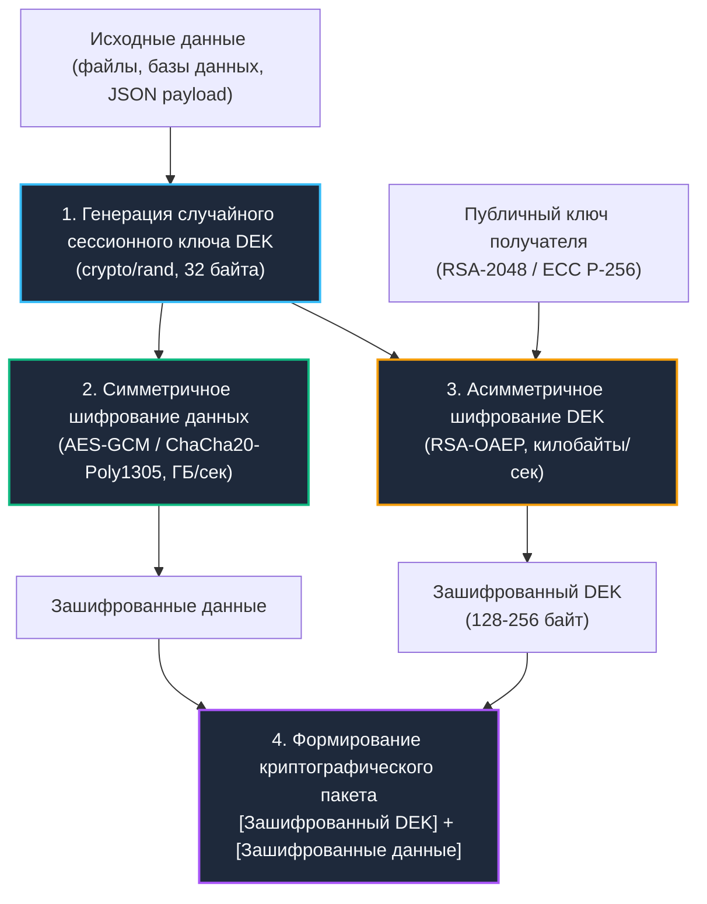

# 2. Симметричное и асимметричное шифрование: Архитектура, гибридные схемы и механическое сочувствие

> *"Symmetric ciphers are the workhorses of cryptography; asymmetric ciphers are the couriers."*  
> — Нильс Фергюсон, Брюс Шнайер

В архитектуре безопасности бэкенда нет вопроса «что лучше — симметричное или асимметричное шифрование?». Эти два класса криптографических систем решают принципиально разные физические и математические задачи. Попытка использовать их не по назначению неизбежно приводит либо к катастрофическому падению пропускной способности сервиса (в тысячи раз), либо к критическим брешам в управлении ключами.

Чтобы наглядно представить разницу, обратимся к классической физической аналогии:
- **Симметричное шифрование (AES, ChaCha20):** Высокоточный сейфовый замок с одним массивным латунным ключом. Замок открывается и закрывается за доли миллисекунды. Он способен защитить гигабайты информации, но порождает вечную проблему: *как передать этот латунный ключ партнеру на другой континент через враждебную территорию, если любой курьер может сделать слепок?*
- **Асимметричное шифрование (RSA, ECC):** Почтовый ящик с узкой прорезью. Любой человек на улице может опустить конверт в прорезь (**публичный ключ**), но достать письма может только владелец, имеющий ключ от дверцы на задней панели ящика (**приватный ключ**). Проблема распределения ключей решена: публичный адрес ящика можно напечатать хоть в газете. Однако прорезь ящика крошечная — протолкнуть туда многотомную энциклопедию физически невозможно.
- **Гибридная криптосистема (Конвертное шифрование / Envelope Encryption):** Гениальный союз двух подходов. Данные любого объема упаковываются в прочный сейф и мгновенно запираются одноразовым симметричным ключом (**DEK**). Затем сам маленький латунный ключ запечатывается в бумажный конверт и опускается в прорезь почтового ящика получателя. Скорость симметрии объединяется с безопасностью асимметрии!

---

## Фундаментальный разрыв в производительности и доверии



---

## Симметричное шифрование: Прямые конвейеры и аппаратное ускорение

В бэкенд-разработке на Go симметричные алгоритмы применяются для шифрования данных «в покое» (Data at Rest: базы данных, резервные копии, файлы в S3) и данных «в движении» (Data in Transit: TLS payload, межсервисные mTLS-туннели).

Безусловным стандартом индустрии является **AES** (Advanced Encryption Standard) в режиме **GCM** (Galois/Counter Mode), а также поточный шифр **ChaCha20-Poly1305**.

*Архитектура алгоритма:*  
AES — блочный шифр с фиксированным размером блока 16 байт (128 бит). Данные последовательно проходят через сеть подстановок и перестановок (SubBytes, ShiftRows, MixColumns, AddRoundKey). Режим GCM добавляет шифрование счетчиком (CTR) и умножение в поле Галуа для генерации имитовставки, предоставляя свойства `confidentiality + integrity` за один вычислительный проход.

**Влияние на процессор и кремний:**
1. **Инструкции `AES-NI` (на архитектурах `x86_64` и `ARMv8`):**  
   Современные микропроцессоры содержат аппаратные блоки инструкций, выполняющие раунды AES прямо на кремнии за 1–2 такта. Без аппаратной поддержки шифрование вынуждено использовать программные таблицы подстановки (`T-tables`) в оперативной памяти. Это не просто замедляет вычисления в 4–6 раз, но и открывает смертоносную брешь для атак по сторонним каналам — `cache-timing`: анализируя задержки вытеснения кэш-линий L1d, атакующий на соседней виртуальной машине способен полностью восстановить секретный ключ!
2. **Кэш-локальность и регистры SIMD:**  
   AES обрабатывает линейные массивы данных с абсолютно детерминированным шагом, что идеально загружает конвейер CPU и векторные регистры (`XMM, YMM`).
3. **Отсутствие ветвлений:**  
   Алгоритм `ChaCha20` построен на простых операциях сложения по модулю $2^{32}$, побитового XOR и циклического сдвига (ARX). В нем полностью отсутствуют инструкции условных переходов, что сводит вероятность `branch misprediction` к нулю и надежно защищает от timing-атак на микроархитектурном уровне.

```go
package crypto_ops

import (
	"crypto/aes"
	"crypto/cipher"
	"crypto/rand"
	"errors"
	"fmt"
	"io"
)

// EncryptSymmetric шифрует данные с помощью AES-GCM (256-битный ключ).
// Возвращает упакованный срез: [Nonce (12 байт)][Ciphertext][Auth Tag (16 байт)]
func EncryptSymmetric(plaintext, key []byte) ([]byte, error) {
	if len(key) != 32 {
		return nil, errors.New("aes-gcm requires 256-bit key")
	}

	block, err := aes.NewCipher(key)
	if err != nil {
		return nil, fmt.Errorf("cipher init: %w", err)
	}

	aesGCM, err := cipher.NewGCM(block)
	if err != nil {
		return nil, fmt.Errorf("gcm wrapper: %w", err)
	}

	// Выделяем память под уникальный Nonce
	nonce := make([]byte, aesGCM.NonceSize())
	if _, err := io.ReadFull(rand.Reader, nonce); err != nil {
		return nil, fmt.Errorf("nonce generation: %w", err)
	}

	// Seal автоматически конкатенирует Nonce и зашифрованное тело с тегом
	ciphertext := aesGCM.Seal(nonce, nonce, plaintext, nil)
	return ciphertext, nil
}

// DecryptSymmetric расшифровывает данные и валидирует подлинность
func DecryptSymmetric(ciphertext, key []byte) ([]byte, error) {
	block, err := aes.NewCipher(key)
	if err != nil {
		return nil, fmt.Errorf("cipher init: %w", err)
	}

	aesGCM, err := cipher.NewGCM(block)
	if err != nil {
		return nil, fmt.Errorf("gcm wrapper: %w", err)
	}

	nonceSize := aesGCM.NonceSize()
	if len(ciphertext) < nonceSize {
		return nil, errors.New("ciphertext too short")
	}

	nonce, ciphertextBody := ciphertext[:nonceSize], ciphertext[nonceSize:]

	// Open возвращает ошибку, если хотя бы один бит был поврежден или подменен
	plaintext, err := aesGCM.Open(nil, nonce, ciphertextBody, nil)
	if err != nil {
		return nil, fmt.Errorf("authentication failed: %w", err)
	}

	return plaintext, nil
}
```

---

## Асимметричное шифрование: Тяжёлая математика и проблема распределения

Асимметричные шифры опираются на вычислительно тяжелые математические задачи теории чисел, для которых в настоящее время не существует быстрых полиномиальных алгоритмов решения:
- **`RSA` (Rivest-Shamir-Adleman):** Сложность факторизации произведения двух сверхбольших простых чисел.
- **`ECC` (Elliptic Curve Cryptography):** Сложность вычисления дискретного логарифма в группе точек эллиптической кривой.

В алгоритме RSA операции представляют собой возведение в степень по модулю огромных чисел длиной 2048–4096 бит. В рантайме Go эта математика реализуется пакетом `math/big`. Каждое арифметическое действие над объектом `big.Int` вынуждено выделять срезы базовых слов в куче, создавая колоссальную нагрузку на `GC`. Скорость шифрования RSA редко превышает единицы мегабайт в секунду на ядро процессора.

Эллиптическая криптография (`ECC`) на порядок эффективнее: для достижения криптостойкости, эквивалентной RSA-3072, достаточно всего лишь 256-битного эллиптического ключа. Пакет `crypto/elliptic` в стандартной библиотеке Go содержит оптимизированные ассемблерные вставки для кривых `P-256` и `P-384`.

---

> [!info] Под капотом: Почему асимметричное шифрование такое медленное?
> **Почему асимметричное шифрование такое медленное?**  
> В отличие от линейных побитовых операций симметричных алгоритмов, RSA и ECC требуют операций с многобайтными числами:  
> 1. **Аллокации в куче:** Пакет `math/big` использует срезы `uint32`/`uint64`. При каждом умножении создаётся новый буфер. В высоконагруженном сервисе это тысячи короткоживущих объектов в секунду.  
> 2. **Сброс конвейера (Branch Divergence):** Алгоритмы модульного возведения в степень содержат ветвления, зависящие от значений битов экспоненты. Блок предсказания ветвлений процессора (Branch Target Buffer) не способен их угадывать, провоцируя частый сброс конвейера инструкций.  
> 3. **Давление на кэш:** Длинные числа и промежуточные матрицы не помещаются в регистры общего назначения CPU и непрерывно выгружаются в кэш L2/L3 и DRAM.  
> 4. **Защита от сторонних каналов:** Чтобы нейтрализовать timing-атаки, реализация выполняет алгоритмическое маскирование — `RSA blinding`, либо константные лестничные вычисления (`Montgomery ladder` в ECC), что увеличивает время расчета еще в 1.5–2 раза.

---

```go
package crypto_ops

import (
	"crypto/rand"
	"crypto/rsa"
	"crypto/sha256"
	"fmt"
)

// EncryptAsymmetric шифрует небольшой блок данных публичным ключом RSA.
// ⚠️ Максимальный размер открытого текста жестко ограничен размером ключа!
func EncryptAsymmetric(plaintext []byte, pubKey *rsa.PublicKey) ([]byte, error) {
	// Режим OAEP (Optimal Asymmetric Encryption Padding) защищает от математических атак на структуру
	label := []byte("hybrid-encryption-example")
	ciphertext, err := rsa.EncryptOAEP(
		sha256.New(),
		rand.Reader,
		pubKey,
		plaintext,
		label,
	)
	if err != nil {
		return nil, fmt.Errorf("rsa encrypt: %w", err)
	}
	return ciphertext, nil
}

// DecryptAsymmetric расшифровывает данные приватным ключом
func DecryptAsymmetric(ciphertext []byte, privKey *rsa.PrivateKey) ([]byte, error) {
	label := []byte("hybrid-encryption-example")
	// Под капотом выполняется RSA blinding для защиты от timing-атак
	plaintext, err := rsa.DecryptOAEP(
		sha256.New(),
		rand.Reader,
		privKey,
		ciphertext,
		label,
	)
	if err != nil {
		return nil, fmt.Errorf("rsa decrypt: %w", err)
	}
	return plaintext, nil
}
```

---

## Механическое сочувствие: Влияние на CPU, кэш и рантайм Go

Сравним физические характеристики исполнения алгоритмов на реальном оборудовании:

| Критерий | Симметричное (AES-GCM-256) | Асимметричное (RSA-2048) | Асимметричное (ECC P-256) |
|---|---|---|---|
| **Физическая скорость** | **1–5 ГБ/с на ядро** (аппаратный AES-NI) | 1–5 МБ/с на ядро | 10–50 МБ/с на ядро |
| **Размер ключа** | 32 байта | 256 байт | 32 байта |
| **Аллокации в памяти** | 0 аллокаций при переиспользовании буферов | Высокие (слайсы `uint64` в `math/big`) | Умеренные (структуры точек кривой) |
| **Поведение в кэше CPU** | Линейное чтение, отличный L1 hit-rate | Хаотичный доступ к памяти, Cache Thrashing | Оптимизированный константный доступ |
| **Системные вызовы (`syscall`)** | 0 (чистые регистровые вычисления) | 0 | 0 |
| **Давление на сборщик мусора** | Минимальное | Высокое (микро-объекты `big.Int`) | Низкое / Среднее |

В других экосистемах (например, PHP с модулем `openssl` через FFI или C# с пакетом `System.Security.Cryptography` и обертками над `SafeHandle`) криптография обычно делегируется внешней системной библиотеке `libcrypto.so`. В Go подход принципиально иной: стандартная библиотека компилирует ассемблерный и Go-код криптографии статически прямо в исполняемый бинарник (`//go:build`).

Это дает феноменальную автономность, но налагает строжайшую дисциплину очистки памяти: вызов `rsa.DecryptOAEP` выделяет память в куче. Если разработчик забыл затереть байты секретного ключа с помощью `clear()`, незашифрованные данные останутся в оперативной памяти вплоть до следующего полного прохода сборщика мусора и могут стать добычей злоумышленников при снятии профилей `pprof` или генерации аварийных дампов.

---

## Гибридные криптосистемы: Индустриальный стандарт

В реальных распределенных системах протоколы TLS, защищенные хранилища файлов, сквозное шифрование мессенджеров и облачные сервисы управления ключами (**AWS KMS**, **HashiCorp Vault**, **Yandex Lockbox**) используют архитектуру **конвертного шифрования (Envelope Encryption)**:

1. Для каждого сообщения или файла сервис генерирует уникальный симметричный ключ шифрования данных (**DEK** — Data Encryption Key) через `crypto/rand`.
2. Полезная нагрузка любого объема шифруется на максимальной скорости процессора с помощью `AES-GCM` или `ChaCha20-Poly1305`.
3. Сам 32-байтовый DEK шифруется асимметричным публичным ключом получателя (`RSA-OAEP` или `ECDHE`).
4. На диск или в сеть отправляется единый конверт: `[Зашифрованный DEK] + [Зашифрованные данные]`.

```go
package hybrid

import (
	"crypto/rand"
	"crypto/rsa"
	"crypto/sha256"
	"fmt"
)

// EncryptEnvelope реализует гибридную схему Envelope Encryption
func EncryptEnvelope(plaintext []byte, pubKey *rsa.PublicKey) ([]byte, []byte, error) {
	// 1. Генерация одноразового симметричного ключа DEK (256 бит)
	dek := make([]byte, 32)
	if _, err := rand.Read(dek); err != nil {
		return nil, nil, fmt.Errorf("generate DEK: %w", err)
	}

	// 2. Сверхбыстрое симметричное шифрование данных
	encryptedData, err := EncryptSymmetric(plaintext, dek)
	if err != nil {
		return nil, nil, fmt.Errorf("symmetric encrypt: %w", err)
	}

	// 3. Асимметричное шифрование DEK публичным ключом
	label := []byte("envelope-key-exchange")
	encryptedDEK, err := rsa.EncryptOAEP(sha256.New(), rand.Reader, pubKey, dek, label)
	if err != nil {
		return nil, nil, fmt.Errorf("asymmetric encrypt DEK: %w", err)
	}

	// 🔒 Обязательное затирание сырого DEK в оперативной памяти
	for i := range dek {
		dek[i] = 0
	}

	return encryptedDEK, encryptedData, nil
}
```

---

## Подводные камни и архитектурные ловушки (Gotchas)

1. **Жесткий лимит размера данных в RSA:**  
   Математическая природа RSA с паддингом OAEP-SHA256 физически не позволяет зашифровать объем данных, превышающий `256 - 2*32 - 2 = 190 байт` (длина модуля ключа за вычетом хешей паддинга):
   $$\text{Max Bytes} = 256 - 2 \times 32 - 2 = 190 \text{ байт (для RSA-2048)}$$
   Попытка зашифровать длинную строку вызовет ошибку рантайма: `crypto/rsa: message too large for RSA public key`. Шифровать массивы данных напрямую через RSA категорически запрещено — используйте только гибридную схему.
2. **Катастрофа повторного использования Nonce:**  
   В режиме AES-GCM повторное использование одного и того же 12-байтового вектора `nonce` с тем же самым ключом шифрования приводит к мгновенной компрометации: злоумышленник методом простого XOR шифротекстов раскрывает открытый текст и может вычислить внутренний ключ аутентификации GHASH. Nonce обязан быть строго уникальным!
3. **Атаки на выравнивание (Padding Oracle Attacks):**  
   Старые блочные режимы шифрования (`CBC + PKCS#7`) страдают фатальной уязвимостью: если сервер по-разному сигнализирует об ошибке неверного паддинга и ошибке неверных данных, злоумышленник за линейное число запросов `O(N)` может побайтово восстановить весь открытый текст. Современные режимы AEAD (GCM) и схемы паддинга OAEP (пришедшие на смену устаревшему `PKCS#1 v1.5`) полностью иммунны к этой атаке.
4. **Кроссплатформенная совместимость форматов:**  
   При интеграции Go-сервисов с Java, C# или Python критично строго фиксировать порядок байтов (`Big Endian` — канонический для криптографии) и согласовывать параметры хеширования маски `MGF1` в схеме OAEP.
5. **Ротация ключей:**  
   Никогда не зашивайте ключи шифрования в код или ConfigMap. Используйте специализированные хранилища секретов с автоматической сменой сертификатов (`cert-manager`).

---

> [!tip] Собеседование
> **Вопрос:** «Почему в спецификации TLS 1.3 полностью отказались от статического RSA Key Exchange в пользу ECDHE, и как это связано с концепцией Perfect Forward Secrecy (PFS)?»  
> 
> **Ответ кандидата Senior-уровня:**  
> «1. **Проблема статического RSA:** При классическом RSA Key Exchange клиент генерирует предварительный мастер-секрет (Pre-Master Secret), шифрует его публичным RSA-сертификатом сервера и отправляет по сети. Если спустя 3 года атакующий завладеет долгосрочным приватным ключом сервера, он сможет задним числом расшифровать абсолютно весь когда-либо записанный трафик компании.  
> 2. **Свойство Perfect Forward Secrecy (PFS):** Гарантирует, что компрометация долгосрочного приватного ключа сервера в будущем **не позволяет** расшифровать сеансы связи, записанные в прошлом.  
> 3. **Решение через `ECDHE`:** В протоколе `TLS 1.3` применяется протокол Диффи-Хеллмана на эллиптических кривых с эфемерными (одноразовыми) ключами (`ECDHE`). На каждую TLS-сессию генерируются временные криптографические ключи, которые после вычисления общего секрета немедленно стираются из памяти.  
> 4. Долгосрочный сертификат сервера используется исключительно для цифровой подписи (аутентификации узла), а не для обмена ключами. Пакет `crypto/tls` в Go оптимизирует эти вычисления через аппаратное ускорение `PCLMULQDQ` и инструкции векторной математики».

---

## Итог

1. **Симметричное шифрование** обеспечивает колоссальную производительность (ГБ/с) благодаря аппаратным инструкциям процессора (`AES-NI`), но требует доверенного канала для передачи общего секрета.
2. **Асимметричное шифрование** снимает проблему безопасной передачи ключей, но требует колоссальных вычислительных затрат процессора и страдает жесткими ограничениями на объем передаваемых данных.
3. **Гибридное (конвертное) шифрование** — фундамент современных криптосистем: данные шифруются симметричным DEK, а сам DEK запечатывается публичным ключом.
4. **Механическое сочувствие к рантайму:** Избегайте аллокаций `math/big.Int` на критических путях, очищайте чувствительные буферы оперативной памяти и строго контролируйте уникальность векторов инициализации (Nonce).

Как эти криптографические концепции оживают в главном защитном протоколе современного интернета — TLS 1.3?  
Об этом подробно поговорим в следующей статье: [[3. TLS и HTTPS под капотом]].