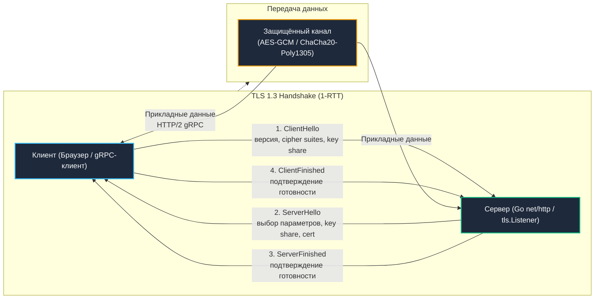

# 3. TLS и HTTPS под капотом: Рукопожатие, криптографический стек и рантайм Go

> *"Network protocols are the nervous system of modern computing; make them secure, make them fast, and make them simple."*  
> — Брайан Керниган

Для большинства пользователей интернета протокол HTTPS ассоциируется с иконкой закрытого замочка в адресной строке браузера. Но для бэкенд-инженера **TLS (Transport Layer Security)** — это сложнейший криптографический протокол, работающий прямо на границе между прикладным кодом и системными сокетами ядра операционной системы.

В экосистеме Go архитектура TLS уникальна: в отличие от C/C++ (где используются внешние библиотеки `libssl` / `OpenSSL`, `BoringSSL` или `mbedTLS` с ручным управлением структурами `SSL_CTX`, `SSL*` и вызовами `free()`) или Python/Java (делегирующих работу через FFI/JNI), стандартная библиотека Go содержит **полную, самодостаточную реализацию TLS на чистом Go** — пакет `crypto/tls`.

Она скомпилирована статически, тесно интегрирована с системным планировщиком Go (`netpoll`, `epoll/kqueue`) и управлением памятью, обеспечивая феноменальную скорость и исключая классические уязвимости переполнения буфера в C.

---

## Фундамент защищённых соединений: от рукопожатия до передачи байт



### Эволюция рукопожатия: TLS 1.2 против 1.3

Представьте дипломатические переговоры через океан:
- **В эпоху TLS 1.2** рукопожатие требовало двух полных круговых задержек (**2-RTT**). Сначала клиент и сервер приветствовали друг друга и договаривались о списке поддерживаемых алгоритмов (`cipher suites`), затем сервер присылал сертификат (`cert`), клиент генерировал предварительный секрет, шифровал его и отправлял обратно, и лишь на четвертом шаге начиналась передача данных. Если сетевой пинг через океан составлял 100 мс, то перед отправкой первого байта HTTP-запроса соединение простаивало **400 миллисекунд**!
- **В современном стандарте TLS 1.3 (RFC 8446)** рукопожатие сокращено вдвое — ровно до **1-RTT**. Клиент оптимистично предполагает, что сервер поддерживает современные эллиптические кривые, и прямо в первом пакете `ClientHello` отправляет свой публичный ключ Диффи-Хеллмана (`key share`). Сервер отвечает своим `key share`, сертификатом и подтверждением `ServerFinished`. Сразу после этого обе стороны вычисляют общий секрет!

Из TLS 1.3 беспощадно удалили весь устаревший и небезопасный легаси-код: статический `RSA key exchange`, поточный шифр `RC4`, функцию хеширования `SHA-1` и блочные режимы `CBC` с уязвимым выравниванием. Единственным механизмом обмена ключами остался **`ECDHE`** (Elliptic Curve Diffie-Hellman Ephemeral), гарантирующий **Perfect Forward Secrecy (PFS)**: даже если приватный ключ сервера будет похищен через 5 лет, злоумышленник не сможет расшифровать записанный трафик.

---

## Интеграция с рантаймом Go: как crypto/tls обёртывает сокет

В стандартной библиотеке Go тип `tls.Conn` является классическим паттерном «Декоратор» вокруг базового интерфейса сетевого сокета `net.Conn`. 

Физический конвейер обработки данных:
1. Системный вызов ядра Linux (`epoll_wait`) через планировщик `netpoll` уведомляет рантайм Go о готовности входящих байтов в сокете.
2. Горутина захватывает сырые данные вызовом `syscall.Read` (или `syscall.read`/`write`).
3. Парсер `crypto/tls` разбирает 5-байтовый заголовок TLS-записи (Record Header: тип контента, версия протокола, длина фрагмента до 16 КБ).
4. Аппаратный блок процессора выполняет расшифровку блоков прямо в памяти процесса (`AES/ChaCha20`).
5. Декодированные прикладные данные передаются вышестоящему обработчику `net/http` или `gRPC` (`HTTP/2`).

```go
package tls_example

import (
	"crypto/tls"
	"log"
	"net"
)

// Идиоматичная настройка TLS-сервера в Go
func runTLSServer(certFile, keyFile string) {
	// Загрузка сертификата и приватного ключа
	cert, err := tls.LoadX509KeyPair(certFile, keyFile)
	if err != nil {
		log.Fatalf("load cert: %v", err)
	}

	// Конфигурация TLS: строгие современные параметры
	cfg := &tls.Config{
		Certificates: []tls.Certificate{cert},
		MinVersion:   tls.VersionTLS13,               // Отключение устаревших версий (TLS 1.0, 1.1, 1.2)
		NextProtos:   []string{"h2", "http/1.1"},    // ALPN для согласования протоколов HTTP/2 и HTTP/1.1
	}

	ln, err := net.Listen("tcp", ":443")
	if err != nil {
		log.Fatalf("listen: %v", err)
	}

	// tls.Listener оборачивает входящие TCP-соединения в защищенные сессии
	tlsLn := tls.NewListener(ln, cfg)
	defer tlsLn.Close()

	log.Println("TLS server listening on :443")
	for {
		// tlsLn.Accept() выполняет TCP accept, рукопожатие происходит при первом Read/Write
		conn, err := tlsLn.Accept()
		if err != nil {
			log.Printf("accept: %v", err)
			continue
		}
		
		// Каждая горутина обслуживает одно TLS-соединение
		go handleConnection(conn)
	}
}

func handleConnection(conn net.Conn) {
	defer conn.Close()
	buf := make([]byte, 1024)
	for {
		n, err := conn.Read(buf)
		if err != nil {
			return
		}
		conn.Write(buf[:n])
	}
}
```

---

> [!info] Под капотом: Парсинг сертификатов и давление на GC
> **Парсинг сертификатов и давление на GC**  
> При каждом новом соединении сервер парсит цепочку сертификатов клиента (если включён `tls.VerifyClientCertIfGiven`). Парсинг `ASN.1DER` (`encoding/asn1`) создаёт множество промежуточных структур, `interface{}` и слайсов. При высоком RPS это генерирует тысячи короткоживущих объектов, вызывая `Minor GC` паузы.  
> 
> **Оптимизация:** Кэшируйте результаты парсинга или используйте `GetCertificate` для динамической загрузки без повторного парсинга. В современных версиях `tls.X509KeyPair` уже оптимизирован, но частая ротация сертификатов «на лету» требует аккуратного управления ссылками, чтобы старые `tls.Certificate` не удерживались в куче живыми ссылками дольше необходимого.

---

## Механическое сочувствие: системные вызовы, кэш и CPU

TLS добавляет измеримые физические затраты на каждом такте:
1. **Системные вызовы ядра:** Каждый вызов `conn.Read()`/`Write()` в `tls.Conn` может транслироваться в несколько системных вызовов `syscall.read`/`write` для агрегации 16-килобайтного фрейма TLS. `netpoll` эффективно мультиплексирует дескрипторы через `epoll_wait` (Linux) или `kqueue` (macOS), но криптографическая обработка происходит в User Space.
2. **Нагрузка на ALU и аппаратные инструкции:** Для симметричного шифрования AES-GCM процессор задействует инструкции `PCLMULQDQ` и `AES-NI`. Однако проверка целостности и сверка MAC требуют работы с кэшем. При десятках тысяч одновременных горутин данные сессионных ключей непрерывно конкурируют за кэш-линии L1/L2, вызывая задержки обращения к DRAM (`memory stall`).
3. **Синхронизация состояния:** `tls.Conn` не поддерживает одновременную параллельную запись из нескольких горутин. В `net/http` эта проблема решена архитектурно: одна горутина выделяется на чтение, а запись буферизируется через внутренние мьютексы.

---

## Продвинутые механизмы: Resumption, SNI и 0-RTT

- **Возобновление сессий (Session Resumption / Session Tickets):**  
  Чтобы не тратить ресурсы CPU на вычисление эллиптических кривых при каждом повторном подключении, сервер выдает клиенту зашифрованный тикет (`Session Tickets`). При следующем подключении клиент передает этот тикет, и сервер восстанавливает сессию без тяжелой асимметричной математики. В Go это настраивается параметрами `TicketKey(s)` и `SessionTicketsDisabled`. Секретные ключи шифрования тикетов обязаны ротироваться каждые 12–24 часа для поддержания PFS.
- **SNI (Server Name Indication):**  
  Позволяет размещать сотни различных доменов и SSL-сертификатов на одном IP-адресе. В Go динамическая диспетчеризация реализуется через колбэк `tls.Config.GetCertificate` или `GetConfigForClient`.
- **0-RTT (Early Data):**  
  Режим TLS 1.3, позволяющий клиенту отправлять полезную нагрузку HTTP-запроса непосредственно в первом пакете `ClientHello` (вообще без задержки рукопожатия!). Однако `0-RTT` фундаментально уязвим к **Replay-атакам**: перехватив этот пакет, атакующий может повторно списать деньги со счета или отправить дублирующее сообщение. В Go `tls.Conn.SetSessionTicketKeys()` управляет этой логикой, но в `net/http` режим 0-RTT по умолчанию отключен ради безопасности.

---

> [!warning] Ловушка / Gotcha: Блокировка в GetCertificate и таймауты рукопожатия
> **Блокировка в `GetCertificate` и таймауты рукопожатия**  
> Если ваша функция `GetCertificate` выполняет сетевой запрос (например, к Vault или БД за сертификатом), вы блокируете горутину на этапе установления TCP+TLS. Клиент получит таймаут соединения, а в рантайме Go накопятся заблокированные горутины в состоянии `syscall` или `chan receive`.  
> 
> **Решение:** Все тяжелые операции загрузки сертификатов выносите в фоновый процесс. `GetCertificate` должен работать только с уже загруженной в память структурой `tls.Certificate`, используя атомарное обновление указателя при ротации.

---

## Валидация цепочек и OCSP Stapling

По умолчанию `crypto/tls` проверяет цепочку сертификатов серверов против системных доверенных корневых центров сертификации (`crypto/x509.SystemCertPool()`). В ультра-минималистичных Docker-образах (Scratch, Distroless, Alpine) системный набор корневых сертификатов часто отсутствует, что вызывает фатальную ошибку рантайма: `x509: failed to load system roots`. Обязательно устанавливайте пакет `ca-certificates` на этапе сборки контейнера.

**OCSP Stapling:**  
Вместо того чтобы клиент сам обращался к серверу удостоверяющего центра (CA) за проверкой отзыва сертификата (раскрывая третьим лицам факт посещения сайта и добавляя сетевую задержку), сервер сам периодически запрашивает криптографически подписанную квитанцию об отзыве и «прикрепляет» ее к рукопожатию. В Go для высокой доступности кэшируйте ответы в потокобезопасной `sync.Map` с контролем TTL.

---

> [!tip] Собеседование
> **Вопрос:** «Почему установка флага `tls.InsecureSkipVerify = true` в коде Go-сервиса считается критической уязвимостью, и как правильно организовать тестирование самоподписанных сертификатов?»  
> 
> **Ответ кандидата Senior-уровня:**  
> «1. Флаг `tls.InsecureSkipVerify = true` полностью отключает криптографическую валидацию цепочки сертификатов и проверку имени хоста. Приложение примет любой сертификат, сгенерированный атакующим «на лету», открывая прямую дорогу для атаки Man-in-the-Middle (MitM) и перехвата учетных данных.  
> 2. **Правильное инженерное решение:** Для тестов и локальной разработки генерируется локальный корневой сертификат (Root CA). Затем создается изолированный пул сертификатов `x509.CertPool`, куда добавляется тестовый CA, и передается в конфигурацию клиента через параметр `tls.Config.RootCAs`. Это сохраняет строгую проверку подписи и целостности, но не требует отключения валидации.  
> 3. В рантайме Go библиотека `crypto/x509` обязательно проверяет расширение `Subject Alternative Name` (SAN), а не устаревшее поле `Common Name`. Игнорирование SAN — самая частая причина ошибок при генерации тестовых сертификатов».

---

## Сравнение подходов: Go против C++ и Python

- **C++:** Полностью зависит от динамических библиотек `OpenSSL`, `BoringSSL` или `mbedTLS`. Требует филигранного управления жизненным циклом `SSL_CTX`, `SSL*` и освобождения памяти через `free()`. Любая CVE в системной OpenSSL затрагивает все демоны на хосте.
- **Python / Java:** Делегируют TLS системному модулю `ssl` (обертка над OpenSSL) или Java JSSE. Удобны, но не позволяют тюнить низкоуровневые параметры планировщика сокетов без FFI.
- **Go:** Полная статическая линковка пакета `crypto/tls`. Нулевая зависимость от версий `libssl.so` в операционной системе, безупречная безопасность памяти. Обновление криптографических возможностей управляется релизом компилятора или версиями зависимостей в `go.mod`, обеспечивая предсказуемость сборки.

---

## Итог

1. **TLS в Go** — это самодостаточная, типобезопасная реализация на чистом Go, оборачивающая `net.Conn` и напрямую использующая асинхронный планировщик `netpoll`.
2. **TLS 1.3 сокращает задержку до 1-RTT**, делает Perfect Forward Secrecy обязательным благодаря `ECDHE` и исключает уязвимые симметричные режимы и алгоритмы прошлого.
3. **Механическое сочувствие:** Учитывайте накладные расходы на парсинг сертификатов в `encoding/asn1`, избегайте аллокаций в куче, применяйте аппаратное ускорение `AES-NI` и `PCLMULQDQ`.
4. **Запрет блокировок в Handshake:** Функции `GetCertificate` и `GetConfigForClient` обязаны работать с атомарными структурами в оперативной памяти без походов в базу данных или сеть.
5. **Строгая валидация:** Никогда не используйте `InsecureSkipVerify = true` в продакшене. Настраивайте `RootCAs` и `Subject Alternative Name` (SAN).

В следующей лекции мы погрузимся в прикладную работу с инструментами стандартной библиотеки Go: [[4. Работа с crypto пакетом Go]].