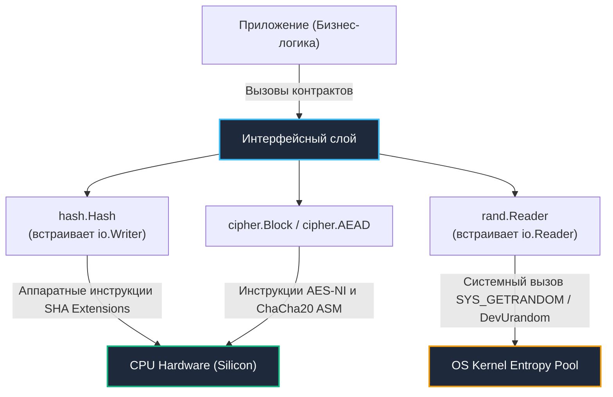

# 4. Работа с пакетом crypto в Go: Интерфейсы, потоковая обработка и безопасность памяти

> *«Интерфейсы в Go — это способ заявить: „Мне все равно, как именно вы это делаете, если вы делаете это правильно“. В криптографии делать правильно означает делать надежно на уровне кремния».*    
> — Брайан Керниган

Стандартная библиотека криптографии Go (`crypto`) — один из самых совершенных и продуманных компонентов языка. Вместо гигантского монолитного API она спроектирована как лаконичный ансамбль классических Go-интерфейсов (`io.Reader`, `io.Writer`, `hash.Hash`, `cipher.Block`, `cipher.AEAD`).

Это архитектурное решение дает программисту два колоссальных преимущества:
1. **Потоковая обработка данных (Zero-Allocation Streaming):** Вы можете хешировать или шифровать 50-гигабайтный файл на диске или входящий сетевой поток, расходуя всего 32 КБ оперативной памяти и создавая нулевую нагрузку на сборщик мусора.
2. **Взаимозаменяемость примитивов:** Замена одного криптографического алгоритма на другой (например, миграция с `sha256` на более стойкий `sha512`) часто требует изменения всего одной строчки инициализации, не затрагивая конвейеры ввода-вывода.

Однако работа с криптографией требует глубокого понимания механических деталей: как устроены системные вызовы генерации случайных чисел, почему `crypto/subtle` спасает от микросекундных утечек и как сборщик мусора Go обходится с чувствительными ключами в оперативной памяти.

---

## Архитектура стандартной криптографии: Интерфейсы и аппаратный уровень



---

## crypto/rand: Энтропия, шум ядра и системные вызовы

В отличие от псевдослучайного генератора `math/rand`, работающего полностью в User Space по формулам `PCG` или `xorshift`, глобальная переменная `crypto/rand.Reader` является абстракцией `io.Reader` над аппаратным источником энтропии операционной системы:

- **Linux:** Выполняет системный вызов ядра `getrandom(2)` (введенный в ядре 3.17). Он вычитывает данные из криптографического пула ядра. В старых системах использовались флаги `GRND_INSECURE` или `GRND_RANDOM`, но Go по умолчанию вызывает `getrandom` без флагов. Если системный вызов недоступен, фоллбэк читает виртуальное устройство ядра `/dev/urandom`.
- **Windows:** Использует системный вызов `BCryptGenRandom` из криптографического API CNG.
- **macOS / BSD:** Вычитывает энтропию из `/dev/urandom`.

> [!info] Под капотом: Почему crypto/rand может быть медленным?
> **Почему `crypto/rand` может быть медленным?**  
> Чтение из `crypto/rand` — это переход в ядро (syscall). Для каждого вызова `Read` происходит смена контекста Ring 3 -> Ring 0. Если вы читаете по 1 байту в цикле, производительность упадёт катастрофически.  
> 
> **Решение:** Всегда запрашивайте буферы оптимального размера (например, 32, 64 или 128 байт за раз). Это амортизирует стоимость системного вызова.

---

## hash.Hash: Интерфейс io.Writer и управление состоянием

Интерфейс `hash.Hash` из пакета `hash` определяет контракт для вычисления дайджестов данных:

```go
type Hash interface {
    io.Writer
    Sum(b []byte) []byte
    Reset()
    Size() int
    BlockSize() int
}
```

Благодаря тому, что `hash.Hash` встраивает `io.Writer`, для хеширования файлов или сетевых сокетов не требуется предварительно загружать весь массив данных в оперативную память. Мы используем стандартный конвейер `io.Copy`:

```go
package hash_example

import (
	"crypto/sha256"
	"fmt"
	"hash"
	"io"
	"os"
)

// HashFileWithoutLoadingInMemory хеширует файл любого размера, не загружая его в ОЗУ
func HashFileWithoutLoadingInMemory(path string) ([32]byte, error) {
	f, err := os.Open(path)
	if err != nil {
		return [32]byte{}, err
	}
	defer f.Close()

	h := sha256.New()
	
	// io.Copy использует буферизацию (обычно 32 КБ) и вызывает h.Write кусками.
	// Это минимизирует аллокации и эффективно использует кэш CPU.
	if _, err := io.Copy(h, f); err != nil {
		return [32]byte{}, err
	}

	// Sum возвращает хеш, добавляя его к переданному слайсу
	return *(*[32]byte)(h.Sum(nil)), nil
}
```

---

> [!warning] Ловушка / Gotcha: Состояние хеша и метод Reset
> **Состояние хеша и метод `Reset`**  
> Объект `hash.Hash` — это структура в куче (из-за `Escape Analysis` при возврате из `New`), которая хранит внутреннее состояние (текущий блок данных).  
> 
> Метод `Sum(b []byte)` **не очищает** состояние. Он просто возвращает текущий дайджест.  
> Если вы хотите использовать один объект `h` для хеширования разных данных, вы *обязаны* вызвать `h.Reset()`.  
> 
> ```go
> h := sha256.New()
> h.Write([]byte("data1"))
> fmt.Println(h.Sum(nil)) // Хеш data1
> 
> h.Write([]byte("data2"))
> // ⚠️ Здесь хеш будет от "data1 + data2", а не просто "data2"!
> // Нужно было вызвать h.Reset() перед Write("data2")
> ```
> 
> В высоконагруженных сервисах переиспользование `hash.Hash` через `sync.Pool` вместе с `Reset` снижает давление на `GC`, так как структура `sha256.digest` не пересоздаётся, а переинициализируется.

---

## crypto/subtle: Защита от Timing-атак на уровне CPU

Представьте сейф с механическим кодовым замком: если при вращении диска первый правильный номер отзывается еле слышным щелчком, опытный взломщик со стетоскопом подберет всю комбинацию за пару минут.

В компьютерных системах оператор побайтового сравнения строк или срезов (`==`) работает именно так: он сравнивает байты слева направо и мгновенно завершает цикл при первом несовпадении:
- Если первый байт не совпал — процессор завершает проверку за 1 такт ($t_1$).
- Если первые 100 байт совпали, а 101-й ошибся — процессор тратит сотни тактов ($t_{100} > t_1$).

Злоумышленник посылает запросы через сеть, собирает статистику задержек и за полиномиальное время $O(n \times 256)$ полностью восстанавливает секретный ключ или подпись вместо астрономического экспоненциального перебора $O(256^n)$!

Пакет `crypto/subtle` нейтрализует эту уязвимость, выполняя операции за **строго константное время**:

```go
package subtle_example

import (
	"crypto/hmac"
	"crypto/sha256"
	"crypto/subtle"
)

// VerifyMAC безопасно проверяет аутентичность сообщения
func VerifyMAC(data, key, mac []byte) bool {
	m := hmac.New(sha256.New, key)
	m.Write(data)
	expectedMAC := m.Sum(nil)
	
	// 🔒 Сравнение за константное время:
	// побитовый XOR всех байтов без условных ветвлений в CPU!
	return subtle.ConstantTimeCompare(expectedMAC, mac) == 1
}
```

---

> [!info] Под капотом: Как работает ConstantTimeCompare?
> **Как работает `ConstantTimeCompare`?**  
> Вместо проверки `if a[i] != b[i] { return false }`, функция выполняет:  
> ```go
> var v byte
> for i := range a {
>     v |= a[i] ^ b[i]
> }
> return subtle.ConstantTimeByteEq(v, 0)
> ```
> Операция `XOR` (`^`) возвращает 0 только в том случае, если биты полностью идентичны. Битовое ИЛИ (`|=`) аккумулирует любые различия в переменную `v`. В итоге `v` останется равным нулю только при 100% совпадении всех байтов.  
> Процессор выполняет абсолютно одинаковое количество тактов независимо от того, совпали данные или нет. Это исключает влияние предсказателя ветвлений (Branch Predictor) и кэширования на время выполнения.

---

## cipher и режимы шифрования: Интерфейсы и опасности

Пакет `crypto/cipher` предоставляет интерфейс `cipher.Block` для низкоуровневых блочных шифров (например, AES с блоком 16 байт).

Однако использование старых режимов блочного шифрования вроде `CBC` (Cipher Block Chaining) категорически не рекомендуется для нового кода: они требуют ручного выравнивания длины данных (`Padding`), что создает уязвимость к атакам `Padding Oracle`.

Современным золотым стандартом является интерфейс **`cipher.AEAD` (Authenticated Encryption with Associated Data)**. Самой популярной реализацией в Go выступает `AES-GCM`:

```go
package cipher_example

import (
	"crypto/aes"
	"crypto/cipher"
	"crypto/rand"
	"io"
)

// EncryptAESGCM демонстрирует идиоматичное использование интерфейса AEAD
func EncryptAESGCM(plaintext, key []byte) ([]byte, error) {
	// 1. Создание блочного шифра (AES-128 / AES-256)
	block, err := aes.NewCipher(key)
	if err != nil {
		return nil, err
	}

	// 2. Создание AEAD обёртки. В рантайме Go это автоматически
	// включает аппаратные инструкции AES-NI на x86_64 или NEON/ARMv8.
	aesGCM, err := cipher.NewGCM(block)
	if err != nil {
		return nil, err
	}

	// 3. Генерация криптографически стойкого одноразового вектора (Nonce)
	nonce := make([]byte, aesGCM.NonceSize())
	if _, err := io.ReadFull(rand.Reader, nonce); err != nil {
		return nil, err
	}

	// 4. Seal шифрует данные и вычисляет 16-байтовый аутентификационный тег
	// Упаковываем Nonce в начало среза для удобства последующей распаковки
	ciphertext := aesGCM.Seal(nil, nonce, plaintext, nil)
	return append(nonce, ciphertext...), nil
}
```

---

> [!warning] Ловушка / Gotcha: Повторное использование Nonce в GCM
> **Повторное использование Nonce в GCM**  
> Использование одного и того же `nonce` с одним `key` в AES-GCM позволяет атакующему восстановить ключевой поток и расшифровать *любые* сообщения, зашифрованные этим ключом. Это полная катастрофа для безопасности.  
> 
> **Решение:**  
> 1. Всегда генерируйте `nonce` через `crypto/rand`.  
> 2. Никогда не инкрементируйте `nonce` вручную без гарантии атомарности и отсутствия дубликатов (что сложно в распределённых системах).  
> 3. Если требуется детерминизм, рассмотрите `AES-SIV` (Synthetic IV), но он пока не встроен в стандартную библиотеку (требуется `golang.org/x/crypto`).

---

## Взаимодействие crypto и Garbage Collector (GC)

Криптография ставит перед рантаймом Go деликатные вопросы управления памятью:

1. **Escape Analysis:** Срезы байт `[]byte`, передаваемые через интерфейсы `io.Reader`, `io.Writer` или `hash.Hash`, почти всегда уходят в кучу (heap), увеличивая накладные расходы на сборщик мусора.
2. **Очистка памяти (Memory Scrubbing):** Сборщик мусора Go (`GC`) освобождает выделенные страницы памяти, но **не затирает их нулями**. Чувствительные открытые ключи и расшифрованные данные могут оставаться в свободных блоках кучи неопределенно долго.
3. **Безопасность страниц оперативной памяти:** В критических контурах безопасности применяйте системный вызов `syscall.Mlock` для закрепления страниц памяти в RAM (предотвращая их сброс в swap-раздел на диск) и затирайте массивы функцией `clear()` (доступной в Go начиная с версии `Go 1.21`).

---

> [!tip] Собеседование
> **Вопрос:** «Почему метод интерфейса `hash.Hash` имеет сигнатуру `Sum(b []byte) []byte`, а не возвращает просто готовый слайс байтов?»  
> 
> **Ответ кандидата Senior-уровня:**  
> «1. Архитектурно метод спроектирован для минимизации аллокаций памяти. Вызов `Sum` **добавляет (append)** вычисленный дайджест в конец уже переданного среза `b` (`append(b, hash...)`).  
> 2. Если передать `nil` (`h.Sum(nil)`), метод аллоцирует новый срез нужного размера.  
> 3. Но если у нас уже есть предварительно выделенный буфер или мы конструируем составные хеши вида `H(H(data))`, мы можем передать существующий срез, избежав дополнительной аллокации в куче».

---

## Итог

1. **Интерфейсная парадигма:** Пакет `crypto` в Go опирается на стандартные интерфейсы `io.Reader` и `io.Writer`, что обеспечивает эффективную потоковую обработку данных с минимальным расходом памяти.
2. **Энтропия через ядро:** `crypto/rand` использует системный вызов ядра `getrandom`, гарантируя криптографическую непредсказуемость ключей и солей.
3. **Константное время:** Проверка подлинности криптографических значений обязана выполняться исключительно через `crypto/subtle.ConstantTimeCompare`, исключая утечки через задержки процессора.
4. **Современные режимы:** Применяйте AEAD-режимы (`AES-GCM`), избегая устаревшего CBC, и гарантируйте абсолютную уникальность вектора Nonce.
5. **Гигиена памяти:** Сборщик мусора не очищает чувствительные данные в куче; используйте `clear()` и `syscall.Mlock` в ответственных системах.

В следующей лекции мы разберем, как подтверждать авторство и целостность сообщений с помощью цифровых подписей и HMAC: [[5. Подписи и HMAC]].